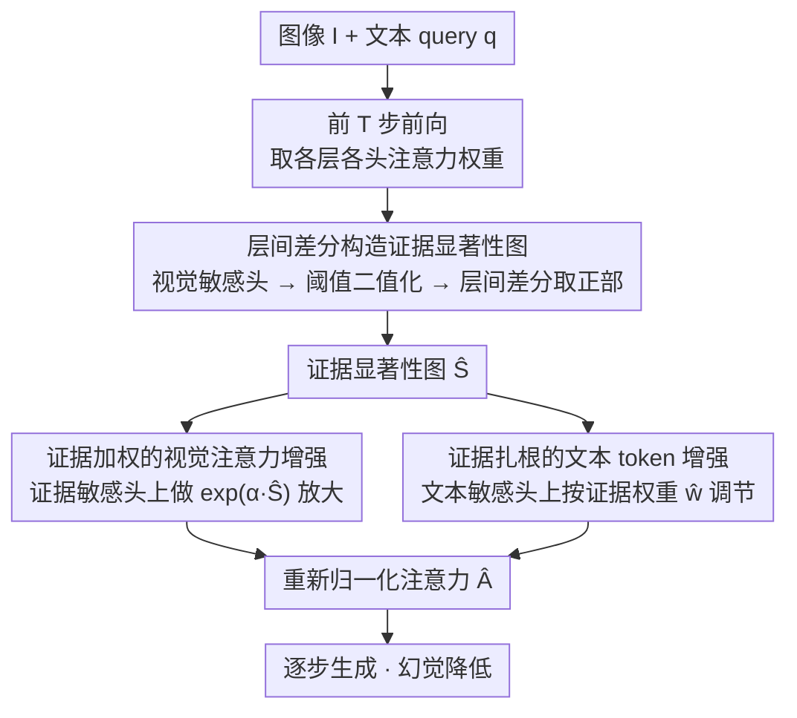

# Finding the Correct Visual Evidence Without Forgetting: Mitigating Hallucination in LVLMs via Inter-Layer Visual Attention Discrepancy

**会议**: ICML 2026  
**arXiv**: [2605.20965](https://arxiv.org/abs/2605.20965)  
**代码**: https://github.com/ytx-ML/ILVAD (有)  
**领域**: 幻觉检测  
**关键词**: 幻觉缓解, 视觉注意力, 层间差异, 显著性图, 训练无关

## 一句话总结
本文发现 LVLM 幻觉源于对正确视觉证据的"关注不足 + 生成中遗忘"，并观察到注意力对视觉证据存在显著的层间差异（ILVAD），据此提出一个 train-free / plug-and-play 的方法：用层间差分构造视觉证据显著性图，再在生成过程中持续加权视觉证据 token 和"扎根于证据"的文本 token，在 5 个 LVLM × 5 个幻觉/综合 benchmark 上一致降低幻觉。

## 研究背景与动机

**领域现状**：现有缓解 LVLM 幻觉的方法主要分四类——基于额外知识库的对齐/微调（计算开销大）、后处理校正、对比解码（VCD/CODE/AGLA/ONLY 等在 logits 层调整）、以及注意力干预（VAR/SPARC/VHR 等基于 attention sink 或视觉敏感头）。

**现有痛点**：解码层方法只调 logits，不能让模型真正去"看图"；attention 重分配类方法虽然意识到模型把过多注意力分给了与 query 无关的 visual sink，但并不保证模型把注意力转移到正确的视觉证据上，当语言先验过强时依旧失效。

**核心矛盾**：作者经验性发现两件事——(i) sample-level，幻觉样本对视觉证据的平均注意力显著低于正确样本；(ii) step-level，长文本生成过程中模型对视觉证据的注意力随步数衰减，幻觉频率同步上升。这说明问题不是"注意力总量不够"，而是"没找对位置 + 找到了也守不住"。

**切入角度**：作者继续做 layer-level 分析后发现一个被忽略的现象——LVLM 对视觉证据的注意力呈现强烈的层间差异 (Inter-Layer Visual Attention Discrepancy, ILVAD)：visual sink 几乎在每一层都受到高注意力，但视觉证据只在某些特定层被"看到"，相邻层间差距也很大。这给了一个区分"证据 vs sink"的天然信号——前者是层间稀疏激活的，后者是层间持续激活的。

**核心 idea**：用层间差分（后层激活减前层激活的正部）累积出视觉证据显著性图，从而把 sink 滤掉、只留下"真正的证据"；再用这张图在生成阶段持续抬高对证据 token 的注意力，并相应地放大那些"扎根于证据"的文本 token。

## 方法详解

### 整体框架
ILVAD 要解决的是"模型既没看对视觉证据、看对了又在长文生成中逐渐遗忘"这两个问题，而它选择完全不动架构、不动解码，只在 attention 权重上做文章。给定图像 $I$ 和 query $q$，方法先用模型跑一遍前 $T$ 个生成 token，拿到各层各头的注意力权重 $\mathbf{A}^{l,h}$，然后分两步：第一步**证据定位**——把"哪些视觉 token 才是真证据"提炼成一张显著性图 $\hat{\mathbf{S}} \in [0,1]^{|\mathbf{X}_v|}$；第二步**证据守护**——在之后每个生成步上用这张图同时加权视觉证据 token 和"扎根于证据"的文本 token，再重新归一化得到 $\hat{\mathbf{A}}$。整套流程与具体 LVLM 解耦，对 LLaVA-1.5/NeXT、Qwen2/3-VL、InternVL3 都通用。

### 关键设计

**1. 层间差分构造证据显著性图：用同一个算子同时滤掉 sink、定位证据**

视觉 token 里混着真正的证据、visual sink 和噪声，下游增强要想有的放矢就得先把证据单独挑出来。做法是先在每层 $l$ 按各头对视觉的总注意力排序、保留 top 50% 视觉敏感头 $\mathbf{H}_v^l$，在这些头上对前 $T$ 个生成 token 到每个视觉 token $j$ 的注意力求平均得到 $\bar{\mathbf{A}}_j^l$，再用阈值规则 $\tilde{\mathbf{A}}_j^l = \mathbb{1}[\bar{\mathbf{A}}_j^l > \tau \cdot \mathrm{mean}(\bar{\mathbf{A}}^l)]$ 在每层二值化出"显著 token"。真正的关键一步是层间差分 $\mathbf{S} = \sum_{l=1}^{L-1} \max(\tilde{\mathbf{A}}^{l+1} - \tilde{\mathbf{A}}^l, 0)$：它只累积"在第 $l{+}1$ 层新被点亮、但前一层还没亮"的 token，最后归一化为 $\hat{\mathbf{S}}$。这一行算子之所以奏效，正是因为 visual sink 在几乎每一层都持续亮着，差分项 $\max(\tilde A^{l+1}-\tilde A^l,0)$ 对它趋近于 0；而真正的视觉证据是"只在某些特定层突然亮起来"的，差分恰好捕捉这种"出现事件"——于是过滤 sink 和定位证据被同一个无监督的差分算子一并解决。

**2. 证据加权的视觉注意力增强：放大幅度严格随"是不是证据"调节**

光有显著性图还不够，生成越长模型对视觉的注意力衰减得越厉害，必须在每步把证据 token 的注意力主动抬起来。这里先给每个文本 token $i$ 和每个头 $(l,h)$ 算一个"证据率" $\mathbf{e}_i^{l,h} = \sum_{j \in \mathbf{X}_v} \hat{\mathbf{S}}_j \mathbf{A}_{i,j}^{l,h} / \sum_{j \in \mathbf{X}_v} \mathbf{A}_{i,j}^{l,h}$，据此挑出每层 top 50% 的证据敏感头 $\mathbf{H}_e^l$，只在这些头上做指数放大 $\hat{\mathbf{A}}_{i,j}^{l,h} = \mathbf{A}_{i,j}^{l,h} \cdot \exp(\alpha \hat{\mathbf{S}}_j)$，强度 $\alpha$ 越大证据 token 被推得越突出。和 VAF 那类"对所有视觉 token 一视同仁放大"（等于把 sink 也放大了）相比，这里用 $\hat{\mathbf{S}}_j$ 当乘子让放大幅度严格跟着"是不是证据"走，而且只在证据敏感头上动手，不去污染那些本就负责语义/语言建模的头。

**3. 证据扎根的文本 token 增强：让"当时真看了图"的前文 token 更有话语权**

仅放大视觉端只解决"看哪里"，但生成时模型还会大量从前文 token 抄答案，一旦前文是幻觉，错误就会滚雪球传递下去。为此对每个已生成的文本 token $i$ 算一个"证据权重" $\mathbf{w}_i = \frac{1}{L \cdot |\mathbf{H}_t^l|} \sum_{h,l,j} \hat{\mathbf{S}}_j \mathbf{A}_{i,j}^{l,h}$（即它在所有层、所有文本敏感头上对证据 token 的累计注意力），归一化为 $\hat{\mathbf{w}} \in [0,1]^{|\mathbf{X}_t|}$，再在文本敏感头上用 $\hat{\mathbf{A}}_{i,j}^{l,h} = \mathbf{A}_{i,j}^{l,h} \cdot (\hat{\mathbf{w}}_i + \beta)$ 调整文本 token 之间的注意力，其中 $\beta$ 是基线保护项（$\beta=0$ 会把所有文本一刀切压死，所以必须留一项）。本质上是用"它当时看了多少证据"给前文 token 打分，让后续 step 更倾向参考"扎根"的 token、压制"凭语感"的 token——和视觉端共用同一张 $\hat{\mathbf{S}}$，工程代价极低。

### 损失函数 / 训练策略
**完全 train-free**。所有操作都在 inference 时直接修改 attention 权重，再做标准的 softmax 归一化即可。关键超参：$\tau$（每层显著阈值，默认 $5$）、$\alpha$（视觉增强强度，LLaVA-NeXT 用 $3$、其他模型用 $5$）、$\beta$（文本增强基线，判别式 benchmark 用 $1$、生成式 benchmark 用 $0.2{-}0.5$）、$T$（用于提取显著性图的前 $T$ 步，默认 $10$）、视觉/证据/文本敏感头比例 $\rho=0.5$。

## 实验关键数据

### 主实验

5 个 LVLM、3 个幻觉 benchmark（CHAIR / POPE / MMHal-Bench），与 Greedy/Beam + VCD/CODE/AGLA/ONLY + VAF/VAR/SPARC/VHR 共 10 个 baseline 对比（以 LLaVA-1.5-7B 为例）：

| 方法 | CHAIR$_S$↓ | CHAIR$_I$↓ | POPE Acc↑ | POPE F1↑ | MMHal Hal.↓ | MMHal Score↑ |
|---|---|---|---|---|---|---|
| Greedy | 48.6 | 13.52 | 84.50 | 85.22 | 67.0 | 2.01 |
| VCD | 48.4 | 13.47 | 84.74 | 85.31 | 61.8 | 2.20 |
| AGLA | 46.4 | 13.27 | 85.63 | **86.38** | 63.8 | 2.14 |
| VAR | 52.5 | 14.17 | 84.82 | 85.87 | 62.2 | 2.18 |
| VHR | 34.5 | 9.86 | 84.74 | 85.45 | 65.6 | 2.10 |
| **Ours (ILVAD)** | **32.6** | **9.42** | **85.76** | 86.12 | **61.5** | **2.22** |

相对 greedy 在 LLaVA-1.5-7B 上 CHAIR$_S$ 下降 31.6%、MMHal Score 提升 9.12%；在 Qwen2-VL / Qwen3-VL / InternVL3 等较新模型上也一致改善（如 Qwen2-VL-7B CHAIR$_S$ 20.8→17.8、CHAIR$_I$ 7.58→5.14）。MME 子集上 LLaVA-1.5-7B 总分 631.66 → 641.66，超过所有 baseline。

### 消融实验

| 配置 | CHAIR$_S$↓ | CHAIR$_I$↓ | POPE Acc↑ | POPE F1↑ |
|---|---|---|---|---|
| Baseline (greedy) | 48.6 | 13.52 | 84.50 | 85.22 |
| w/o Visual Enh. | 49.4 | 13.44 | 84.44 | 85.12 |
| w/o Text Enh. | 34.8 | 9.73 | 85.59 | 85.85 |
| Full ILVAD | **32.6** | **9.42** | **85.76** | **86.12** |

阈值 $\tau$ 敏感性：$\tau=1$ 时 CHAIR$_S$=44.6（过松，sink 漏进来），$\tau=3$ 最低 25.3 但 POPE 略差，$\tau=5$ 在两类 benchmark 间取得最佳平衡，$\tau=10$ POPE F1 最高（86.28）但 CHAIR 退化到 38.8。

### 关键发现
- **去掉 visual enhancement 就几乎没效果**（CHAIR$_S$ 49.4 ≈ baseline 48.6），说明"找对证据 + 增强证据"才是核心，单做文本端筛选无源可依；text enhancement 是锦上添花，能再压 2 个点。
- **ILVAD 几乎不增加推理开销**：只在 attention 权重上做逐元素乘法和归一化，runtime 与 baseline 持平，明显优于需要二次前向的对比解码类方法（VCD/AGLA 等）。
- **方法对 $\alpha$ 鲁棒**（大部分模型固定 $\alpha=5$ 即可），$\beta$ 是真正需要按任务调的——判别式任务（POPE/MME）用 $\beta=1$，长文生成（CHAIR）需要把 $\beta$ 调到 $0.2{-}0.5$ 才能避免对所有文本一刀切压制。
- **越新的模型增益越稳但绝对幅度变小**：InternVL3-8B CHAIR$_S$ 21.2→16.8，Qwen3-VL-8B 51.6→45.2，说明 sink/forgetting 现象在新模型里仍未被根治。

## 亮点与洞察
- **"层间差分 = 自动 sink 过滤器"** 是这篇最优雅的设计：把"sink 在大多数层都亮、证据只在少数层亮"这一观察直接翻译成 $\max(\tilde A^{l+1}-\tilde A^l, 0)$ 这一行算子，免去了任何额外训练或外挂检测器。这种"用层间一致性来区分 spurious vs informative"的思路可以迁移到 LLM 安全（识别 jailbreak 时的层间异常激活）和 RAG（识别真正被检索内容支撑的 token）。
- **把"看图"和"信自己"解耦**：visual enhancement 解决"模型该看哪里"，text enhancement 解决"模型该相信前文哪些 token"，二者用同一张 $\hat{\mathbf{S}}$ 串起来——一张显著性图同时驱动两端，工程上代价极低、概念上很干净。
- **首次量化"step-level 视觉遗忘"**：作者实测随生成步数推进、对视觉证据的注意力单调下降而幻觉率单调上升，给"长文幻觉为何越来越多"提供了一个可观测的注意力侧指标，这一现象本身值得单独研究。

## 局限与展望
- 显著性图是用前 $T=10$ 个 token 一次性算出来后"冻结"用于整段生成的；长文生成中查询的语义焦点可能漂移（如先描述前景物体、再问背景），固定显著性图可能无法适应，理想的做法是滑窗式或动态更新（论文也承认 $T$ 是个 trade-off 超参）。
- 评测主要集中在物体级幻觉（CHAIR/POPE 都是 object existence），对关系/属性/计数类幻觉的覆盖较弱；MME 的 position/color 子分提升非常有限（123.33→133.33、155→160），暗示当幻觉来自"视觉证据本就模糊"而非"看错位置"时方法不一定有效。
- $\beta$ 需要按数据集类型手调（判别式 vs 生成式差一个数量级），尚未给出自动选 $\beta$ 的策略；超参敏感度让 plug-and-play 的优势略打折扣。
- 头选择固定 $\rho=0.5$ 是经验值，不同模型/不同任务最优比例可能不同，理论上可以用 EviRatio 直接给头排序后做更精细的自适应。

## 相关工作与启发
- **vs VAR / EVAS (attention sink 重分配)**：VAR 把 sink 的注意力按比例摊给其他视觉 token，但摊给"其他"不等于摊给"正确"；ILVAD 用层间差分直接把"其他"细化为"证据"，所以在 CHAIR 上 VAR 反而退化（52.5），而 ILVAD 大幅改善（32.6）——这是把"减负"升级为"定向加正"的关键区别。
- **vs SPARC (跨时间步差分)**：SPARC 用相邻生成步的 attention 差分挑视觉 token，关注的是"时间维"的稀疏性；ILVAD 关注的是"层维"的稀疏性。两者其实正交，原则上可以叠加（时间 × 层双重差分），是个直接的扩展方向。
- **vs VHR (vision-aware head divergence)**：VHR 只在头层面挑视觉敏感头然后整体增强，没有 token 级别的目标；ILVAD 在头筛选基础上多走一步到 token 级显著性，所以能"既挑对头、又挑对 token"，对长文生成（CHAIR 类）改善更明显。
- **vs AGLA / VCD (对比解码)**：对比解码需要二次/多次前向（masked image、perturbed image），开销翻倍；ILVAD 只走一次前向加几次张量乘法，且在 POPE F1 上仅与 AGLA 差 0.26、其余指标全面领先，性价比明显更高。

## 评分
- 新颖性: ⭐⭐⭐⭐ "层间差分滤 sink"这一观察+算子组合干净且未见前人系统用过，但整体仍属注意力干预家族的增量创新。
- 实验充分度: ⭐⭐⭐⭐ 5 模型 × 5 benchmark × 10 baseline 覆盖到位，消融、超参、runtime 都齐；不足是缺关系/属性级幻觉的针对性评测。
- 写作质量: ⭐⭐⭐⭐ 动机—观察—方法的递进非常清晰，Figure 1 的四子图（blue/yellow/green/gray）把核心证据一图打尽；公式记号略冗余。
- 价值: ⭐⭐⭐⭐ Train-free + plug-and-play + 推理开销近 0，对部署侧 LVLM 幻觉缓解很有吸引力，且 ILVAD 这种层间一致性视角对其他可解释性/安全工作有启发。

<!-- RELATED:START -->

## 相关论文

- [\[ICML 2026\] Learning from Fine-Grained Visual Discrepancies: Mitigating Multimodal Hallucinations via In-Context Visual Contrastive Optimization](learning_from_fine-grained_visual_discrepancies_mitigating_multimodal_hallucinat.md)
- [\[CVPR 2026\] HulluEdit: Single-Pass Evidence-Consistent Subspace Editing for Mitigating Hallucinations in LVLMs](../../CVPR2026/hallucination/hulluedit_subspace_editing_hallucination.md)
- [\[CVPR 2026\] Mitigating Object Hallucination in LVLMs via Attention Imbalance Rectification](../../CVPR2026/hallucination/mitigating_object_hallucinations_in_lvlms_via_attention_imbalance_rectification.md)
- [\[ICML 2026\] Automatic Layer Selection for Hallucination Detection](automatic_layer_selection_for_hallucination_detection.md)
- [\[CVPR 2026\] VES-RFT: Rewarding Visual Evidence Sensitivity to Mitigate Hallucinations in Large Vision-Language Models](../../CVPR2026/hallucination/ves-rft_rewarding_visual_evidence_sensitivity_to_mitigate_hallucinations_in_larg.md)

<!-- RELATED:END -->
