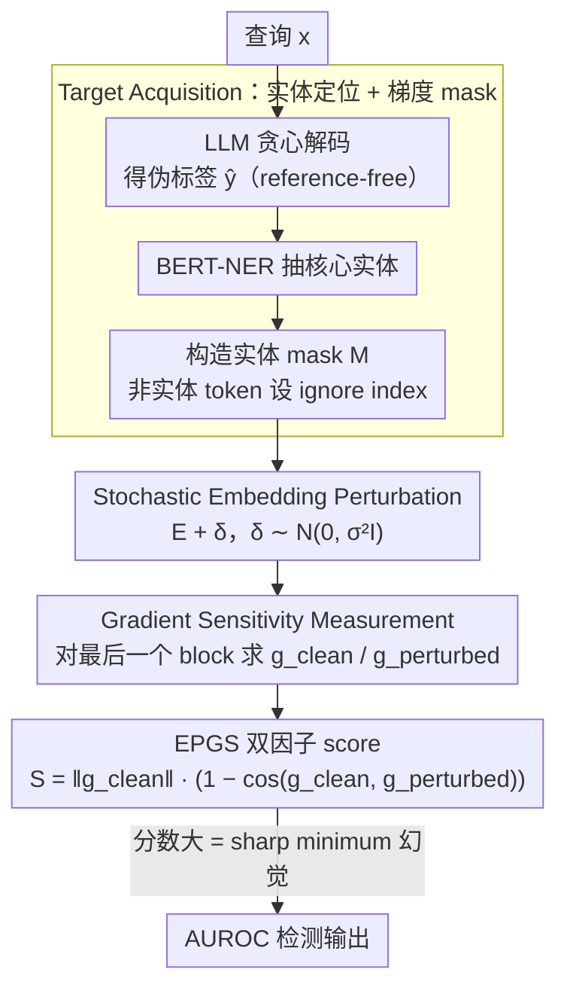

# From Flat Facts to Sharp Hallucinations: Detecting Stubborn Errors via Gradient Sensitivity

**会议**: ICML 2026  
**arXiv**: [2605.00939](https://arxiv.org/abs/2605.00939)  
**代码**: 无  
**领域**: 幻觉检测  
**关键词**: stubborn hallucination, loss landscape, Hessian, gradient sensitivity, embedding perturbation

## 一句话总结
本文把 LLM 幻觉检测从"看输出概率"切到"看 loss landscape 曲率"——在 embedding 加 Gaussian 噪声测量梯度方向与幅度的扰动，作为 Hessian 谱半径的廉价代理，在 12 个 model-dataset 组合上 AUROC 全面超越 entropy / Semantic Entropy / EigenScore 等基线。

## 研究背景与动机

**领域现状**：LLM 幻觉检测主流分两派：黑盒方法（LN-Entropy、Semantic Entropy、P(False) 等）多次采样看输出一致性；白盒方法（EigenScore、Effective Rank）看隐藏状态的协方差或秩。两派共同假设是"幻觉 = 不确定 = 高熵 / 表示坍塌"。

**现有痛点**：存在一类被作者命名为 **stubborn hallucination** 的错误——模型自信地输出错误事实、多次采样仍稳定收敛到同一答案。它们的输出分布像真知识一样低熵高置信，于是 entropy 类方法直接失效（Llama-2 SQuAD 上 Semantic Entropy AUROC 仅 $0.4839$，几乎随机猜）。EigenScore 等"静态表示分析"也 miss，因为隐藏状态本身没有坍塌。

**核心矛盾**：零阶量（输出概率）和事实正确与否**不等价**——模型可以"自信地记错"。问题根源在于现有方法都在测一阶以下的信息，而幻觉与事实真正的差异在更高阶几何性质上。

**本文目标**：（1）形式化定义 stubborn hallucination；（2）找一个能廉价计算、对其敏感的几何量；（3）证明该量是 Hessian 谱半径的合理代理。

**切入角度**：借用泛化理论的 flat vs sharp minima 假设——稳健事实由多种上下文冗余特征支持落在 flat minimum；stubborn 错误是稀疏 noisy pattern 的记忆 singularity 落在 sharp minimum。同样高置信度（零阶相似）但曲率不同（二阶分歧）。

**核心 idea**：在 embedding 上注入 Gaussian 噪声并测量梯度的幅度与方向漂移，作为局部 Hessian 谱半径的代理，从而区分 flat 事实与 sharp 幻觉。

## 方法详解

### 整体框架
EPGS（Embedding-Perturbed Gradient Sensitivity）想解决的是"模型自信地记错"这类零阶量看不出的幻觉，办法是把检测信号从输出概率换成 loss landscape 的局部曲率。整条流水线分三步走：先用外部 NER 把答案里的核心实体抠出来，构造一个只在实体 token 上计算 loss 的 mask（Target Acquisition）；再对输入 embedding 注入 Gaussian 噪声 $\delta \sim \mathcal{N}(0, \sigma^2 I)$（Stochastic Embedding Perturbation）；最后分别在 clean 和 perturbed 输入下对最后一个 Transformer block 的参数求梯度 $g_{\text{clean}}, g_{\text{perturbed}}$，把两者组合成一个 EPGS 分数（Gradient Sensitivity Measurement）。整个过程纯后验、无需训练，比真算 Hessian 便宜得多。

### 关键设计

**1. 几何视角的幻觉分类：把检测问题从概率域搬到曲率域**

entropy 类方法对 stubborn hallucination 完全失效，根子在于它们只看零阶量。作者先用一个 $\delta$-stability 条件把这件事讲透：只要输出在输入扰动下的 KL 漂移 $\mathbb{E}_\epsilon[D_{KL}(P_{\theta^*}(\cdot|x) \| P_{\theta^*}(\cdot|x+\epsilon))] \le \delta$，这个样本就算"稳定"，而 robust facts 和 stubborn hallucinations **同样满足**这个条件——它们在零阶上根本不可区分，所以看概率分布永远分不开。真正的差异藏在更高阶的几何里，于是作者提出 Curvature Hypothesis：稳健事实由多种上下文冗余特征支撑，落在 flat minima（$\lambda_{\max}(H)$ 小）；stubborn 错误是稀疏 noisy pattern 的记忆奇点，落在 sharp minima（$\lambda_{\max}(H)$ 大）；transient 错误则落在 unstable region（$\|\nabla\mathcal{L}\| > 0$ 或曲率各向异性）。这一步先把"旧方法为什么失效"说清楚，后面所有设计才有立足点。

**2. 输入-参数同构 + Hessian 代理：用一次额外 backward 换掉算不动的二阶量**

曲率的标准刻画是 Hessian 谱半径 $\lambda_{\max}(H)$，但在 LLM 上直接算根本不现实。作者用两步把它翻译成可行的实验量。Lemma 3.3 说明，对输入 embedding 加的小扰动 $\delta$ 总能找到一个等价的参数扰动 $\nu_\delta$（用最后一个 block 的 rank-1 weight update 来模拟），使得 $\mathcal{L}(\theta^*, E+\delta, \hat y) \approx \mathcal{L}(\theta^*+\nu_\delta, E, \hat y)$——扰动输入和扰动参数在 loss 上是同构的。Theorem 3.4 进一步在收敛点假设 $\nabla_\theta \mathcal{L}(\theta^*) = 0$ 下做二阶 Taylor 展开，得到 $\|\nabla_\theta \mathcal{L}(\theta^*; x+\epsilon, \hat y)\|_2 \lesssim \lambda_{\max}(H) \cdot \|\nu_\epsilon\|_2$。直观上，在 sharp minimum 里给输入加噪等同于把参数推上一面陡墙，梯度幅度立刻飙起来；flat minimum 里推不动，梯度几乎不变。于是"对输入加噪后看梯度涨多少"就成了 $\lambda_{\max}(H)$ 的廉价代理，而代价只是一次额外的反向传播。

**3. 幅度 × 方向漂移的双因子 score：一个公式同时抓 stubborn 和 transient**

光有曲率代理还不够，因为 transient 错误的标志是方向不稳定而非单纯曲率大。作者把分数定义成幅度与方向的乘积：

$$\mathcal{S} = \|g_{\text{clean}}\|_2 \cdot (1 - \cos(g_{\text{clean}}, g_{\text{perturbed}}))$$

前一项 $\|g_{\text{clean}}\|_2$ 反映局部曲率尺度，后一项 $1-\cos(\cdot)$ 反映方向波动——在高维空间里一个大的随机位移几乎必然正交于原方向，所以方向项对不稳定性特别敏感。三类样本因此被自然拉开：事实在 flat minimum，幅度小且方向稳，$\mathcal{S} \approx 0$；stubborn 在 sharp minimum，幅度大、方向被噪声打乱，$\mathcal{S}$ 大；transient 两项都顶满，$\mathcal{S}$ 最大。之所以用乘积而非只取其一，是因为单看幅度会被梯度量级的 scale 干扰，单看方向又丢掉了曲率尺度信息，乘积形式既保留物理量纲又更 robust。

### 损失函数 / 训练策略
完全后验、无需训练。NER 用预训练 BERT-base-NER 提实体；温度 $T=0.1$ 生成 pseudo-label；扰动尺度 $\sigma=0.1$；梯度只对最后一个 Transformer block 求；评估时阈值无关地报告 AUROC。所有实验跑在单卡 RTX 4090 上。

## 实验关键数据

### 主实验（General Hallucination，AUROC）
3 个模型 × 4 个数据集 = 12 个组合，EPGS 全部第一。

| 模型 | 数据集 | SE | EigenScore | **EPGS** |
|------|--------|------|-----------|----------|
| Llama-2-7B | TriviaQA | 0.7080 | 0.7224 | **0.7629** |
| Llama-3-8B | SVAMP | 0.9004 | 0.9371 | **0.9732** |
| Mistral-7B | TriviaQA | 0.7701 | 0.7760 | **0.8289** |
| Llama-3-8B | TriviaQA | 0.7082 | 0.7226 | **0.8127** |

### 消融实验（梯度提取位置 + Stubborn Subset）

| 配置 | Llama-2 SQuAD AUROC | 说明 |
|------|----------------------|------|
| Last Transformer Block（默认） | **最高** | 保留最终"信念"几何 |
| Middle Transformer Block | 下降 | 缺最终聚合 |
| Final Layer Norm / LLM Head | 接近随机 | 概率饱和把梯度掩盖 |

Stubborn subset（多次采样保留 high-consistency 子集，entropy 全失效）：

| 方法 | Llama-2 SQuAD | Llama-3 SQuAD |
|------|---------------|---------------|
| Semantic Entropy | 0.5842 | 0.5918 |
| EigenScore | 0.6003 | 0.5857 |
| **EPGS** | **0.7373** | **0.7816** |

### 关键发现
- Hessian 真值（power iteration 算 $\lambda_{\max}$）与 EPGS 相关系数 $r = 0.855$；stubborn 集合 $\lambda_{\max}$ 比 robust facts 大约 $2.5\times$，直接验证 Curvature Hypothesis。
- Reasoning task（SVAMP）上 EPGS 优势最大（0.9732 vs 0.9371），因为推理错误多为 transient 类型，方向漂移项 $(1-\cos)$ 把它们拉满。
- 梯度提取位置必须是 last Transformer block；LLM Head 因 softmax 饱和让梯度信号被压平，几乎随机。

## 亮点与洞察
- 把"为什么 entropy 类方法失效"用 sharp / flat minimum 的几何语言说清楚，是非常有解释力的视角切换。
- 用"输入扰动梯度 = Hessian 代理"绕开二阶计算，思路在 SAM 等训练期 curvature-aware 工作之外又拓展了一个**纯推理期**应用。
- 幅度 × 方向的双因子 score 既能区分 stubborn（sharp）也能区分 transient（unstable），单一公式覆盖两种典型错误。

## 局限与展望
- $\sigma=0.1$ 的扰动尺度对不同 model size / vocab 是否需要重新调？文中只给了一个值。
- 仅在 7B-8B 模型上验证，更大模型（70B+）的 last block gradient 是否会被 LayerNorm 压平没说。
- Stubborn 集合靠 high-consistency 过滤构造，存在采样估计噪声；若模型本来 high temperature 不稳定，stubborn 与 transient 界限模糊。
- 没有讨论与 retrieval-based 事实检验的组合（"检测 → 触发 RAG 修正"）落地路径。

## 相关工作与启发
- **vs Semantic Entropy / DSE**：依赖多次采样的输出多样性；EPGS 一次梯度即可，对 stubborn 不失效。
- **vs EigenScore / Effective Rank**：分析"静止状态"的 hidden state 协方差；EPGS 主动注入扰动，捕捉动态响应。
- **vs SAM (Sharpness-Aware Minimization)**：训练期利用 sharpness 做正则；EPGS 是推理期把同一几何量当检测信号。
- **vs Hessian-based uncertainty**：直接算 $\lambda_{\max}(H)$ 在 LLM 上不现实；EPGS 用输入梯度做廉价代理。

## 评分
- 新颖性: ⭐⭐⭐⭐⭐ "stubborn hallucination + sharp minimum"是个真正切换视角的概念。
- 实验充分度: ⭐⭐⭐⭐ 12 个组合 + stubborn subset + Hessian ground truth 都覆盖，但模型规模偏小。
- 写作质量: ⭐⭐⭐⭐ 理论与实验对照清晰，三阶段图示直观。
- 价值: ⭐⭐⭐⭐ 给 high-stakes 部署提供了对"自信错误"敏感的检测信号，实用性高。

<!-- RELATED:START -->

## 相关论文

- [\[CVPR 2026\] Mitigating Multimodal Hallucinations via Gradient-based Self-Reflection](../../CVPR2026/hallucination/mitigating_multimodal_hallucinations_via_gradient-based_self-reflection.md)
- [\[ACL 2026\] Detecting Hallucinations in SpeechLLMs at Inference Time Using Attention Maps](../../ACL2026/hallucination/detecting_hallucinations_in_speechllms_at_inference_time_using_attention_maps.md)
- [\[ACL 2026\] FinGround: Detecting and Grounding Financial Hallucinations via Atomic Claim Verification](../../ACL2026/hallucination/finground_detecting_and_grounding_financial_hallucinations_via_atomic_claim_veri.md)
- [\[ACL 2026\] TPA: Next Token Probability Attribution for Detecting Hallucinations in RAG](../../ACL2026/hallucination/tpa_next_token_probability_attribution_for_detecting_hallucinations_in_rag.md)
- [\[ICLR 2026\] LUMINA: Detecting Hallucinations in RAG System with Context-Knowledge Signals](../../ICLR2026/hallucination/lumina_detecting_hallucinations_in_rag_system_with_context-knowledge_signals.md)

<!-- RELATED:END -->
