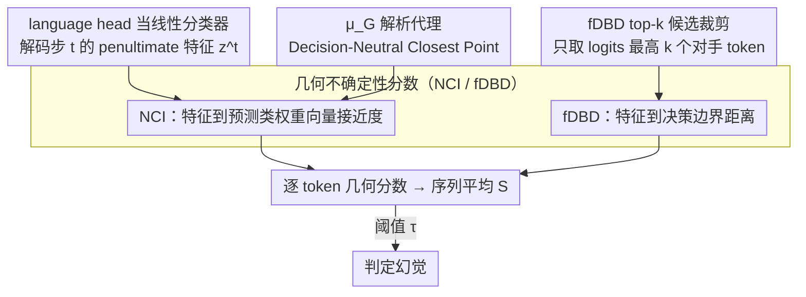

# From Out-of-Distribution Detection to Hallucination Detection: A Geometric View

**会议**: ICML 2026  
**arXiv**: [2602.07253](https://arxiv.org/abs/2602.07253)  
**代码**: 待确认  
**领域**: 幻觉检测  
**关键词**: 幻觉检测、OOD 检测、几何不确定性、决策边界、单样本无训练

## 一句话总结
本文把 LLM 的下一 token 预测视为一个超大词表上的分类任务，将两个轻量级 OOD 检测器 NCI（特征与权重向量的接近度）与 fDBD（特征到决策边界的距离）迁移过来，配合"训练特征均值的解析代理 $\mu_G$"和"只在 top-$k$ 候选 token 上算边界距离"两个适配，得到一个**无训练、单样本**的推理类幻觉检测器，在 CSQA / GSM8K / AQuA 上稳定优于困惑度、Semantic Entropy、SelfCheckGPT 等基线。

## 研究背景与动机

**领域现状**：LLM 幻觉检测目前分两条主线——一条训练分类器去识别幻觉（如 SAPLMA、INSIDE），对分布漂移敏感且训练代价高；另一条无训练方法（Semantic Entropy、SelfCheckGPT、Lexical Similarity 等）通过对**多个采样输出**做一致性比较来打分，避免训练但推理代价高。

**现有痛点**：无训练多样本方法在简短 QA 上效果不错，但**推理任务**里走不通——多步推理本身就允许多条有效路径，让"多个输出语义是否一致"这件事在概念上就难以判定，再加上每个问题要采样 N 条完整推理链，开销爆炸。

**核心矛盾**：推理任务同时要求**无训练**（避免分类器漂移）、**单样本**（避免多次采样）、**逐 token 高效**（每步都要算），现有三类方法没法同时满足。

**本文目标**：构造一个 training-free、single-sample、per-token 开销可控的推理类幻觉检测器。

**切入角度**：作者注意到 OOD 检测和幻觉检测本质都是在测"模型对当前预测有多不确定"。如果把 LLM 的 language head 看作一个 $|\mathcal{V}|$ 类的线性分类器，penultimate-layer 特征就是分类器输入，那么 OOD 文献里成熟的"特征与权重向量的几何关系"就能直接迁移过来——而且这种几何度量天生就是 per-token、single-sample 的。

**核心 idea**：把 OOD 检测器 NCI（特征接近其预测类的权重向量 → 不确定性低）和 fDBD（特征远离决策边界 → 不确定性低）搬到 LLM 上，再针对 LLM 的三个特性（训练统计量不可得、词表巨大、有随机解码）做最小化的解析/工程修补，逐 token 算分，再沿序列求平均当作幻觉分数。

## 方法详解

### 整体框架
本文要解决的是推理任务下的幻觉检测：既不能训练分类器（怕分布漂移），也不能多次采样（怕开销爆炸）。核心做法是把 LLM 的 language head 看成一个 $|\mathcal{V}|$ 类的线性分类器，penultimate-layer 特征 $\bm{z}^t$ 就是分类器输入，于是 OOD 文献里"特征相对权重向量、决策边界的几何位置"这套成熟的不确定性度量就能直接搬过来。推理时每个解码步 $t$ 算一个标量几何分数 $s(\bm{z}^t)$，整条输出走完取序列均值 $S=\frac{1}{T}\sum_t s(\bm{z}^t)$ 当作幻觉分数，再用阈值 $\tau$ 判定。整个流程不动权重、不需训练数据、单条回答只采样一次。

### 关键设计

**1. 几何不确定性分数：把 NCI / fDBD 迁到 language head 上**

幻觉检测要的是"模型对当前 token 有多不确定"，而 OOD 检测早已用特征几何把这件事量化好了，难点只是怎么对齐到 LLM 的 language head。把 head 看成线性分类器，预测 token 为 $\hat{c}=\arg\max_v \bm{w}_v^\top \bm{z}+b_v$。**NCI** 度量特征与预测类权重向量的接近度，$s_{\text{NCI}}(\bm{z})=\cos(\bm{w}_{\hat{c}}, \bm{z}-\bm{\mu}_G)\,\|\bm{w}_{\hat{c}}\|_2$，越大越贴近权重向量、不确定性越低；**fDBD** 度量特征到其他 token 决策边界的距离，用一阶近似 $\tilde{D}_f(\bm{z},c)=|(\bm{w}_{\hat{c}}-\bm{w}_c)^\top \bm{z}+(b_{\hat{c}}-b_c)|/\|\bm{w}_{\hat{c}}-\bm{w}_c\|_2$，距离越大越远离边界、不确定性越低。两个分数天生是 per-sample、per-step 的，正好满足推理类检测"单样本逐 token"的硬需求，而且都是单步 $O(d_{\text{model}})$ 复杂度，叠在正常 forward 后面几乎零开销。作者在 CSQA 上经验验证了这层迁移成立（Fig. 2）：幻觉回答的特征确实更靠近边界、更远离权重向量。

**2. 训练特征均值 $\mu_G$ 的解析代理：Decision-Neutral Closest Point**

NCI 公式里要用训练特征的全局均值 $\bm{\mu}_G$，可 LLM 的训练语料既私有又巨大，根本估不出来——这是把 OOD 工具搬到 LLM 时第一个卡死的环节。作者绕开数据，转而求一个"不看数据"的解析点：他们证明（Lemma 4.1）让 vocabulary 上 logits 方差最小的特征点 $\bm{z}_\star$ 就是一个最大不确定性点，且有闭式解 $\hat{\bm{z}}_\star = -(W^\top P W)^\dagger W^\top P \bm{b}$，其中 $P=I-\frac{1}{|\mathcal{V}|}\mathbf{1}\mathbf{1}^\top$。对零偏置 language head（Llama-3.2-3B 即如此），这个点直接退化成特征空间原点 $\bm{0}$。把 $\bm{z}_\star$ 代进 $\bm{\mu}_G$，整套 NCI 就完全不依赖训练数据。这一步不是细节而是关键钥匙：Table 1 上 CSQA + Llama-3.2-3B 用解析代理 AUROC=66.07，而用 CSQA 训练集估的经验均值只有 62.79，连 Perplexity 的 63.23 都不如——说明 LLM 训练特征压根不能用下游小数据集近似，只能走解析路线。

**3. fDBD 的 top-$k$ 候选集裁剪：只看真正的语义对手**

朴素 fDBD 要对词表里全部 $|\mathcal{V}|-1$ 个 token 都算边界距离再平均，问题有两个：大词表里 rare token、标点、数字的边界几乎总是很远，会把真正语义对手 token 的信号稀释成噪声；同时还吃 $O(d_{\text{model}}|\mathcal{V}|)$ 的算力。作者的做法是每步只取 logits 最高的 $k$ 个 token 组成 $\mathcal{K}_t$（排除 top-1，因为它就是预测 token 本身、距离为 0 无信息），用 $s_{\text{fDBD}}^k=\frac{1}{k}\sum_{c\in\mathcal{K}_t}\tilde{D}_f(\bm{z}^t,c)/\|\bm{z}^t-\bm{\mu}_G\|_2$ 算归一化平均边界距离，$k$ 在验证集上选。借助 Quickselect，单步复杂度从 $O(d_{\text{model}}|\mathcal{V}|)$ 降到期望 $O(d_{\text{model}}k+|\mathcal{V}|)$。这样既把"语境里真正可能被替换"的候选突出出来，又过滤了大量无关的远距离 token。Table 2 上 $k$ 从 1 扫到 10 万再到 All，全部 $k$ 都跑赢 Perplexity，峰值出现在 $k=1000$（AUROC 69.24，对比 All 的 68.15），呈倒 U 型——太小信息不足、太大被稀释。

### 损失函数 / 训练策略
**完全无训练**，没有任何参数更新。Perplexity 基线为 $\text{PPL}(\bm{y}|\bm{x})=\exp(-\frac{1}{T}\sum_t \log p(\bm{y}_t|\bm{x},\bm{y}_{<t}))$，本文沿用同一套"逐步打分 + 序列平均"模式，只是把分数从 log-prob 换成 $s_{\text{NCI}}$ 或 $s_{\text{fDBD}}^k$。评估指标 AUROC，threshold-free。

## 实验关键数据

### 主实验
设置：CSQA（commonsense, MCQ, 1221 题）、GSM8K（数学, free-form, 1319 题）、AQuA（数学, MCQ, 254 题），模型 Llama-3.2-3B-Instruct 与 Qwen-2.5-7B-Instruct，CoT 提示，greedy 解码。

| 模型 / 方法 | Single Sample | CSQA | GSM8K | AQuA |
|---|---|---|---|---|
| Llama-3.2-3B / Perplexity | ✓ | 63.23 | 69.63 | 72.85 |
| Llama-3.2-3B / SelfCheckGPT NLI | ✗ | 64.18 | 74.29 | 66.01 |
| Llama-3.2-3B / Semantic Entropy | ✗ | 60.61 | 64.40 | 64.71 |
| Llama-3.2-3B / **NCI** | ✓ | 66.07 | 76.32 | 74.41 |
| Llama-3.2-3B / **fDBD (selected $k$)** | ✓ | **69.24** | **76.36** | **76.20** |
| Qwen-2.5-7B / Perplexity | ✓ | 61.94 | 71.54 | 71.66 |
| Qwen-2.5-7B / SelfCheckGPT NLI | ✗ | 60.18 | 76.22 | 70.90 |
| Qwen-2.5-7B / **NCI** | ✓ | 71.60 | 75.83 | 78.19 |
| Qwen-2.5-7B / **fDBD (selected $k$)** | ✓ | **72.47** | **77.19** | **78.22** |

延迟（Llama-3.2-3B, CSQA, ms/token）：Standard 31.94，Perplexity 32.88，NCI 32.54，fDBD 32.71，几乎零开销。

### 消融实验

| 配置 | CSQA AUROC | 说明 |
|------|-----------|------|
| Perplexity 基线 | 63.23 | LLM 内置 confidence |
| NCI w/ 经验均值 $\bm{\mu}_G$（CSQA 训练集估） | 62.79 | 经验估计反而掉点 |
| NCI w/ **解析代理 $\bm{z}_\star$** | **66.07** | 解析代理胜出 +3.3 AUROC |
| fDBD $k=1$ | 68.64 | 只看 top-1 alternative |
| fDBD $k=100$ | 69.18 | |
| fDBD $k=1000$ | **69.24** | 峰值 |
| fDBD $k=10000$ | 68.87 | 开始稀释 |
| fDBD $k=$ All ($\approx 10^5$) | 68.15 | 全词表反而最差 |

随机解码鲁棒性（CSQA, Llama-3.2-3B, 5 seeds 均值）：temp=0.2/0.5/0.8/1.0 下，Perplexity 在 62-63 上下波动；NCI 稳定在 66-68；fDBD 稳定在 68-69，全程跑赢 Perplexity，证明虽然 NCI/fDBD 都定义在"最高 logit token"上，但**序列平均**让随机解码下的偶发错位被后续步骤自动追平。

### 关键发现
- 解析代理 $\bm{z}_\star$ 是把 OOD 方法搬到 LLM 上的**关键钥匙**——经验均值不仅没用，反而比 Perplexity 还差；说明 LLM 训练特征不能用下游小数据集估出来。
- top-$k$ 裁剪曲线呈倒 U 型，过小 ($k=1$) 信息不足、过大 (All) 被无关 token 稀释；峰值在 $k\sim 10^3$，提示"语义上真正的对手 token"集中在前千名内。
- 单样本几何方法在**数学推理**（GSM8K/AQuA）上尤其能打 Semantic Entropy / SelfCheckGPT 等多样本方法——后者要采样 N 次完整 CoT，NCI/fDBD 只跑一次推理，延迟几乎不增加（<1 ms/token）。

## 亮点与洞察
- **范式重述**：把"幻觉检测"和"OOD 检测"在概念上接起来非常自然——分类器对未见类的预测就是"分类版的幻觉"，但作者真正的贡献是把这件事**做实**：每一个 LLM 特性（训练数据不可见、词表巨大、随机解码）都对应一个具体的工程/解析修补，而不是停在类比层面。
- **Decision-Neutral Closest Point 是个可复用的工具**：任何依赖"训练特征均值"的 OOD/不确定性方法迁到 LLM 都会卡在这一步，作者给出的"logit 方差最小化 → 闭式解 → 零偏置时退化成原点"这条路径，可以直接照搬到 Mahalanobis、Energy 等其他 OOD 分数的 LLM 化里。
- **per-token 几何分数 + 序列平均**是个朴素但有效的桥：把分类范式下的"单点不确定性"通过算术平均扩展到序列，居然在随机解码下都稳定，提示对于推理任务，**累计的几何信号**比"逐步严格对齐"更重要。
- **延迟几乎为零**：32.71 vs 31.94 ms/token，意味着这个检测器可以默认嵌入生产推理 pipeline，不像 SelfCheckGPT 那样需要 N× 推理预算。

## 局限与展望
- 解析代理 $\bm{z}_\star$ 在零偏置 head（Llama）上是原点，但对有非零 bias 的模型（Qwen 系/MoE）效果是否仍最优，论文用 AUROC 间接验证但没分析 bias 大小与代理偏差的关系。
- 序列平均的简单聚合可能掩盖"局部高不确定性步"的信号（例如长 CoT 里只有一两个关键步骤错了），未来可考虑**max / top-percentile / 加权聚合**。
- 评估全部在 reasoning/QA 上，open-ended 长文本生成（摘要、creative writing）里 token-level 几何不确定性能否当幻觉信号还没验证。
- $k$ 需要在验证集上选，对没有标注验证集的新任务/新模型有冷启动成本；自适应 $k$（按 logits 分布熵动态决定）值得探索。

## 相关工作与启发
- **vs Semantic Entropy (Kuhn et al., 2023)**：SE 要采样多条回答再算语义熵，多样本、不适合长 CoT；本文单样本，几何信号直接来自 penultimate 特征。
- **vs SelfCheckGPT (Manakul et al., 2023)**：SelfCheck 也要多次采样再做一致性检查；本文一次推理足够，延迟近乎零。
- **vs Perplexity / Max P / P(True)**：同为单样本无训练，但 Perplexity/Max P 只用 logits 的标量摘要；本文进一步利用 penultimate **特征向量的几何位置**，信息更丰富，AUROC 在所有数据集/模型上都更高。
- **vs INSIDE / SAPLMA 等训练分类器**：那些方法学到的边界对分布漂移敏感且需要标注数据；本文 training-free、零标注。

## 评分
- 新颖性: ⭐⭐⭐⭐ OOD ↔ 幻觉的概念桥别人也提过，但首次把 NCI/fDBD 这种"特征几何"OOD 检测器搬到 LLM 并解决三个具体挑战
- 实验充分度: ⭐⭐⭐⭐ 3 数据集 × 2 模型 + 附录扩到 Qwen3-32B / base 模型 / MoE / 其他架构，加随机解码 5 seeds
- 写作质量: ⭐⭐⭐⭐ 三个挑战 → 三个解法的结构非常清晰，定义、定理、近似的呈现工整
- 价值: ⭐⭐⭐⭐ 延迟近零 + 无训练 + 单样本，工业可直接接入；同时给出了"OOD 工具迁 LLM"的可复用方法论

<!-- RELATED:START -->

## 相关论文

- [\[ICML 2026\] Automatic Layer Selection for Hallucination Detection](automatic_layer_selection_for_hallucination_detection.md)
- [\[ICML 2026\] Harnessing Reasoning Trajectories for Hallucination Detection via Answer-agreement Representation Shaping](harnessing_reasoning_trajectories_for_hallucination_detection_via_answer-agreeme.md)
- [\[CVPR 2026\] TriDF: Evaluating Perception, Detection, and Hallucination for Interpretable DeepFake Detection](../../CVPR2026/hallucination/tridf_evaluating_perception_detection_and_hallucination_for_interpretable_deepfa.md)
- [\[ACL 2026\] Enhancing Hallucination Detection via Future Context](../../ACL2026/hallucination/enhancing_hallucination_detection_via_future_context.md)
- [\[ICLR 2026\] Enhancing Hallucination Detection through Noise Injection](../../ICLR2026/hallucination/enhancing_hallucination_detection_through_noise_injection.md)

<!-- RELATED:END -->
