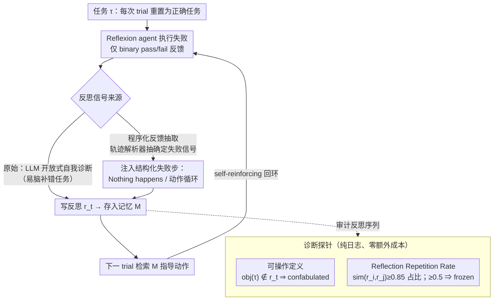

# Honest Lying: Understanding Memory Confabulation in Reflexive Agents

**会议**: ICML 2026  
**arXiv**: [2605.29463](https://arxiv.org/abs/2605.29463)  
**代码**: 无（论文未公开代码仓库）  
**领域**: 幻觉检测  
**关键词**: Reflexion, 记忆虚构, RRR, 反馈接地, 自我诊断失败

## 一句话总结
本文揭露 Reflexion 类 agent 一种系统性失败模式——"记忆虚构 (memory confabulation)"：agent 会把错误的任务理解写进反思记忆并跨 trial 反复使用，作者用 Reflection Repetition Rate (RRR) 量化该现象，并用程序化反馈抽取替代开放式自我诊断，把 ALFWorld 上正确对象提及率从 0% 拉到 86%、RRR 从 0.64 降到 0.10。

## 研究背景与动机
**领域现状**：Reflexion (Shinn et al., 2023) 等"反思型 agent"通过失败后让 LLM 写一段自然语言反思、再把反思拼到下一次 trial 上下文里来"学习"，不做任何梯度更新。该范式在 HumanEval 上把 GPT-4 的 pass@1 从 80% 拉到 91%，被认为是 LLM agent"内省式自我改进"的代表。ExpeL 等工作把单 task 反思推广到跨 task 共享规则库。

**现有痛点**：这条 pipeline 的**根本假设**是"agent 能正确诊断自己为何失败"。但作者发现在反馈信号稀疏（仅 pass/fail）+ 任务要求多步操作时，agent 会**自信地写错诊断**，并把错误诊断永久写入记忆——下一 trial 再去强化这个错误，形成 self-reinforcing false belief。这和 hallucination 不同：hallucination 是单次生成误差，confabulation 是**跨 trial 持续误用**。

**核心矛盾**：反思记忆设计上是"修复机制"，但实证上经常是"错误放大器"——尤其在 binary feedback 下，没有 step-level 信号支撑因果归因，反思就退化成同一段错话的复述。

**本文目标**：(1) 把这个失败模式形式化、可测量；(2) 跨域确认它不是 ALFWorld 个例；(3) 给出 cheap、不改 LLM 权重的缓解方案。

**切入角度**：作者借用认知科学里"confabulation"（reality monitoring 失败，把内部生成当成观察）的概念命名这个现象，并意识到**它在已有 Reflexion 日志里就能被检测出来**——只用 gamefile 名（含 ground-truth target object）+ 反思文本就够，不需要新跑实验。

**核心 idea**：用"反思之间的近似重复率"作为 frozen memory 探针，用"程序化抽取轨迹失败信号"替代 LLM 自我诊断，把反馈从无信号变成有信号。

## 方法详解

### 整体框架
论文的方法由三块组成：(1) **概念**：给出 memory confabulation 的可操作定义；(2) **诊断**：提出 RRR 指标作为 frozen memory 的 log-based 检测器；(3) **缓解**：用 grounded reflection 和 programmatic feedback extraction 两种干预，在不改模型权重、不增加 trial 数的前提下打破"frozen 记忆 → 重复错诊断 → 再失败"的死循环。三块绑成一个闭环——先证伪原假设、再量化伤害、再修复。

下图把这套"Reflexion 回环 + 诊断探针 + 接地干预"画在一起：上方是 agent 失败后自我诊断、写反思、存记忆、下一 trial 再检索的自强化回环（confabulation 就发生在这里）；左下两个探针只读日志就能审计这条回环冻没冻；缓解则发生在"反思信号来源"这个分叉上——把 LLM 开放式自省换成轨迹解析器抽出的确定失败信号。

### 关键设计

**1. Memory Confabulation 的可操作定义：把"脑补错任务"变成日志上能自动打的 boolean 标签**

要研究一个失败模式，第一步得能批量识别它，否则只能凭主观感觉。作者把"agent 在反思里脑补错了任务"这件事变成一个能在日志上 string check 的标签：对任务 $\tau$ 在第 $t$ 次失败时生成的反思 $r_t$（存入记忆 $M_{t+1}=M_t\cup\{r_t\}$），定义 $r_t$ 为 **confabulated** 当且仅当 $\mathrm{obj}(\tau)\notin r_t$，即任务描述里明示的目标物体压根没出现在反思文本里。$\mathrm{obj}(\tau)$ 直接从 ALFWorld gamefile 目录名抽取（如 `pick_cool_then_place_in_recep-Mug-None-CoffeeMachine-10` 里的 `Mug`），HumanEval 上换成"失败 assert 的具体测例"。之所以坚持用 string check 而不是再叫一个 LLM judge，是为了避开"用 LLM 评 LLM"的循环偏差；附带好处是所有现存的 Reflexion 日志立刻可复用，零新 API 成本。

**2. Reflection Repetition Rate (RRR) 与 frozen memory 阈值：一个标量看出记忆有没有在更新**

confabulation 的危害在于错诊断被反复复述、记忆"冻住"不再进步，所以作者需要一个能量化"记忆有没有在动"的探针。对环境的记忆 $M=\{r_0,\dots,r_n\}$，定义

$$\mathrm{RRR}=\frac{\big|\{r_i:i\geq 1,\ \exists j<i,\ \mathrm{sim}(r_i,r_j)\geq 0.85\}\big|}{|M|-1},$$

其中 $\mathrm{sim}$ 是 SequenceMatcher 字符相似度。$\mathrm{RRR}=0$ 表示所有反思都是新内容，$\mathrm{RRR}=1$ 表示除第 0 条外全是旧内容的近似复制；论文把 $\mathrm{RRR}\geq 0.5$ 定为 frozen environment。这个标量便宜、可复现、与成本脱钩，比直接问 LLM"反思有没有进步"靠谱得多，而且实证上 RRR 与 trials-to-solve 的 Spearman $r=0.808$（$p<0.0001$），说明它确实抓住了"记忆冻结拖慢解题"的本质。两个阈值都是经验拍的——0.85 对应"接近全文复用"，0.5 保证至少一半新反思是旧反思的近邻才报警。

**3. 程序化反馈抽取替代开放式自我诊断：用环境侧确定信号打破死循环**

前两步证实并量化了"frozen 记忆 → 重复错诊断 → 再失败"的死循环，根因是 binary feedback（仅 pass/fail）下没有 step-level 信号支撑因果归因，于是反思退化成同一段错话的复述。修复思路就直击根因：不再让 LLM 自己回想哪儿错了，而是写一个轨迹解析器自动抽出确定性的失败信号——ALFWorld 上识别 (a) 收到 "Nothing happens" 的动作、(b) 重复的动作循环，HumanEval 上对应失败的 `assert` 语句和异常类型——再把这些结构化失败步骤直接注入反思 prompt。作者还试了一个较弱的中间版本 grounded reflection：要求 LLM 按 `FAILED STEP / ROOT CAUSE / NEW PLAN` 三段式填模板，但失败步仍由 LLM 自己定位。对比结果印证了归因方向——只有程序化抽取（环境侧信号）才把正确对象提及率从 0% 拉到 86%、RRR 从 0.64 压到 0.10，本质上是把 HumanEval 的 unit-test feedback 范式迁移到了 ALFWorld。

### 损失函数 / 训练策略
没有训练。所有实验都在已发布的 Reflexion 日志 + gpt-3.5-turbo / gpt-4o-mini 上跑，重做的 16 个 frozen ALFWorld 环境用 10 次 trial 预算（原始为 15 次）。

## 实验关键数据

### 主实验
跨 ALFWorld、WebShop、HotpotQA、HumanEval 四个域复现 frozen memory 现象，再在 ALFWorld 16 个 frozen 环境上对比五种条件。

| 域 | 反馈类型 | Frozen 比例 | 平均 RRR |
|----|----------|--------------|-----------|
| ALFWorld | Binary | 32% (16/50) | 0.64 |
| WebShop | Binary | 82% (55/67) | 0.83 |
| HotpotQA | Binary | 46% (46/100) | 0.059 |
| HumanEval | Unit tests | 17% (4/23) | 0.59 |

| 条件 (16 frozen env) | 解决数 | 对象提及率 | 平均 RRR |
|----------------------|--------|-------------|----------|
| 原始 Reflexion (全 confabulated) | 0/16 | 0% (0/121) | 0.64 |
| 无记忆 ablation | 2/16 | — | — |
| Grounded reflection (三段式) | 2/16 | — | — |
| **Programmatic extraction** | **3/16** | **86% (134/156)** | **0.10** |
| gpt-4o-mini 替换 | 2/16 | 100% | 0.53 |

### 消融实验
| 关键对照 | 发现 | 含义 |
|----------|------|------|
| 16 frozen env 拆 memory-harmful vs task-hard | 2 个 (env_31, env_97) 在无记忆下 1 trial 解决，原版要 7–8 trials | 反思记忆**主动伤害**性能而非被动无用 |
| env_22 (Mug→CoffeeMachine) | 14/14 反思引用 tomato + microwave（完全错任务） | 错任务身份能跨 trial 稳定持续 |
| env_35 case study | grounded / no-mem 都 DNF；programmatic extraction 第 4 trial 解出 | 程序化信号能解锁仅靠自省解不掉的环境 |
| HumanEval 程序化扩展 | 18/18 反思包含具体 error type；RRR 0.59→0.44 | 该机制不限于 navigation，code generation 也成立 |
| gpt-4o-mini 升级 | 对象提及率 100% 但仅解 2/16 | 模型能力提升能消除 confabulation，但解不了能力本身的 gap |

### 关键发现
- **反馈粒度决定 confabulation 频率**：binary feedback 域（ALFWorld/WebShop/HotpotQA）frozen 率 32–82%，而 unit-test feedback 的 HumanEval 只有 17%，反向支持"反馈信号决定自我诊断质量"的假说。
- **WebShop 出现 symptom confabulation**：56% (121/218) frozen 反思只描述"点错了"，不诊断违反了哪个 size/color/price 约束——同一根因的不同表面形式。
- **能力 gap 与 confabulation 是两个独立轴**：14/16 任务即使去掉记忆也解不了，但 0/16 → 3/16 的提升来自 env_31/97/35 这种"能解但被记忆带偏"的样本；gpt-4o-mini 实验进一步分离这两个因素。
- **干预也有风险**：HumanEval/77 在程序化抽取后从"解决"退化为"未解"，提醒任何记忆干预都可能破坏原本 working 的解题路径。

## 亮点与洞察
- **概念落到指标**：把"memory confabulation"这种听起来很玄的现象，用 RRR + object mention rate 两个 log-only 指标变成可批量审计的工程问题，非常便于复用。
- **零成本复现**：所有发现都基于已发布的 Reflexion logs，不需要重跑实验就能拿到 134 environments × 4 domain 的证据，方法学上很省。
- **诊断与缓解对偶**：先用 RRR 找到 frozen 环境，再用程序化抽取喂回正确信号，闭环干净；这套"先量化失败模式、再针对性接地"的思路对所有 memory-augmented agent 工作都有迁移价值。
- **借用认知科学概念锚定问题**：confabulation 在心理学里就是"reality monitoring 失败"，对应 LLM agent 把生成当成观察的本质——命名得到位，便于跨学科交流。

## 局限与展望
- RRR 的相似度阈值 (0.85) 和 frozen 阈值 (0.5) 都是经验拍定，缺乏对其他任务族的鲁棒性扫描；语义重复（措辞不同但意思相同）会被 SequenceMatcher 漏掉。
- 程序化抽取依赖 "Nothing happens" / `AssertionError` 这种**领域可解析信号**，对开放式任务（写作、多轮对话）能不能定义出类似 hook 是开放问题。
- 实验主要在 gpt-3.5-turbo 上跑，gpt-4o-mini 的复现只局限于 ALFWorld 16 环境；对更强模型（Claude / GPT-5）confabulation 是否仍主导未知。
- 仅 16 个 frozen 环境的样本量较小，env_35 这种"被解锁"案例的 generalizability 需要更大规模验证。

## 相关工作与启发
- **vs Reflexion (Shinn 2023)**: 本文不是对 Reflexion 的替代，而是**外科手术式打补丁**——保留反思机制但替换信号源。Reflexion 的失败在 binary feedback 下显式暴露。
- **vs ExpeL (Zhao 2024)**: ExpeL 把单 task 反思蒸馏成全局规则库，本文指出这套架构会把**单条 confabulated 反思放大成全局错规则**，风险更高；本文方法对 ExpeL 这种 rule-library agent 同样适用。
- **vs Hallucination 综述 (Ji 2023)**: 把 memory confabulation 与 single-generation hallucination 显式区分——前者是 multi-trial、self-reinforcing，需要 memory-aware 评测，而非现有 hallucination benchmark。
- **vs Memory survey (Du 2026)**: 印证了 survey 中关于"reflective memory 风险 = 自我强化错误"的理论预期，给出第一个跨域实证 + 缓解方案。

## 评分
- 新颖性: ⭐⭐⭐⭐ 命名和形式化都是新的；缓解方案（程序化抽取）思想直接但论文之前没人系统化地试过。
- 实验充分度: ⭐⭐⭐⭐ 跨 4 域 + 5 种条件 + 不同模型对照很扎实；样本量稍小、阈值消融偏弱。
- 写作质量: ⭐⭐⭐⭐⭐ 论证链条清晰，case study (env_22/35) 让抽象现象具体可感。
- 价值: ⭐⭐⭐⭐ 对所有 memory-augmented LLM agent 都给出可立即采纳的诊断指标和落地缓解策略。

<!-- RELATED:START -->

## 相关论文

- [\[ICML 2026\] When Hallucination Costs Millions: Benchmarking AI Agents in High-Stakes Adversarial Financial Markets (CAIA)](when_hallucination_costs_millions_benchmarking_ai_agents_in_high-stakes_adversar.md)
- [\[CVPR 2026\] Understanding and Mitigating Hallucinations in Multimodal Chain-of-Thought Models](../../CVPR2026/hallucination/understanding_and_mitigating_hallucinations_in_multimodal_chain-of-thought_model.md)
- [\[CVPR 2026\] ELV-Halluc: Benchmarking Semantic Aggregation Hallucinations in Video Understanding](../../CVPR2026/hallucination/elv-halluc_benchmarking_semantic_aggregation_hallucinations_in_video_understandi.md)
- [\[ACL 2026\] Understanding New-Knowledge-Induced Factual Hallucinations in LLMs: Analysis and Interpretation](../../ACL2026/hallucination/understanding_new-knowledge-induced_factual_hallucinations_in_llms_analysis_and_.md)
- [\[CVPR 2026\] Understanding the Role of Hallucination in Reinforcement Post-Training of Multimodal Reasoning Models](../../CVPR2026/hallucination/understanding_the_role_of_hallucination_in_reinforcement_post-training_of_multim.md)

<!-- RELATED:END -->
