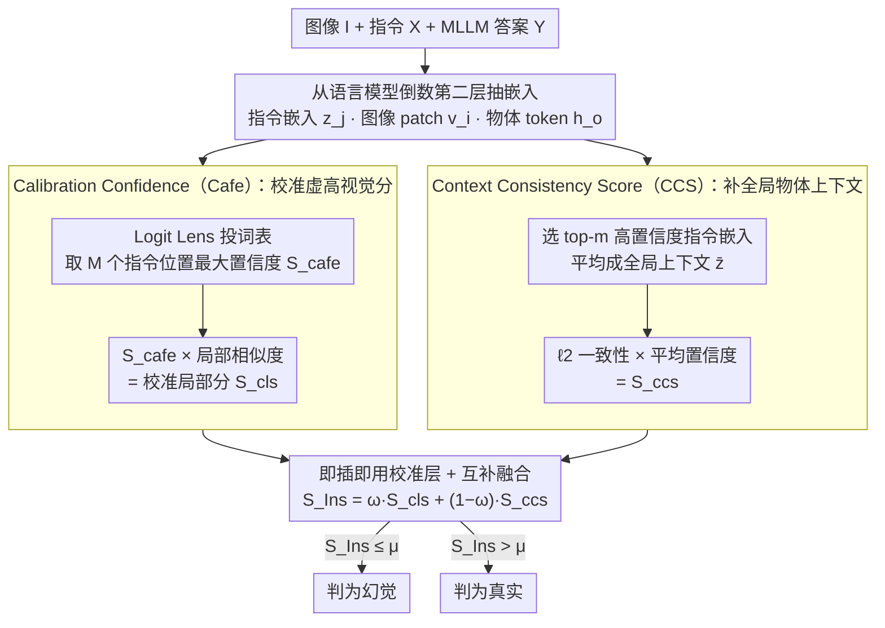

# Instruction Lens Score: Your Instruction Contributes a Powerful Object Hallucination Detector for Multimodal Large Language Models

**会议**: ICML 2026  
**arXiv**: [2605.12258](https://arxiv.org/abs/2605.12258)  
**代码**: https://github.com/Fraserlairh/Instruction-Lens-Score (有)  
**领域**: 幻觉检测  
**关键词**: 对象幻觉, 指令嵌入, Logit Lens, 训练无关检测, MLLM

## 一句话总结
本文发现 MLLM 中 instruction token 的中间层嵌入能天然过滤视觉端引入的误导信息，据此提出训练无关的 InsLen 分数（Calibrated Local Score + Context Consistency Score），在 5 个 MLLM × 4 个基准上把对象幻觉检测的 AUROC 拉高最多 13.81%。

## 研究背景与动机

**领域现状**：MLLM 的对象幻觉（生成图中不存在的物体）是部署可靠性的核心障碍。现有检测方法分两条线：一条靠 GPT-4 等外部模型打分，开销大；另一条挖模型内部信号，比如视觉 token 的注意力权重（SVAR）或答案 token 嵌入与图像 patch 嵌入的相似度（GLSIM）。

**现有痛点**：内部信号方法几乎全押注「视觉证据」——但视觉编码器或跨模态注意力会引入误导性视觉特征（比如把银色勺子认成银色刀子），导致幻觉对象反而获得虚高分数；patch-level 表征也只看局部，没法把全局物体上下文带进来。

**核心矛盾**：用「视觉证据」检测视觉端引入的「视觉幻觉」，本身就是同源信号检同源噪声。需要一条独立通路来 calibrate 视觉信号。

**本文目标**：(1) 找到能压制视觉误导信息的内部信号；(2) 同时提供 patch-级局部证据 + 全局上下文一致性。

**切入角度**：作者用 Logit Lens 把 instruction token 的中间层嵌入投到词表上，意外发现 instruction 嵌入对图中真实物体的置信度高、对幻觉物体（如图 1 里的「bag」）的置信度低。在 MSCOCO 上统计，instruction 嵌入给出的 AUROC 比 image 嵌入高 $\geq 8\%$。这一被忽略的过滤效应正好可以充当独立通路。

**核心 idea**：用 instruction embeddings 既 calibrate 视觉分数、又提供全局物体上下文，两条信号融合做幻觉检测。

## 方法详解

### 整体框架
输入是图像 $I$、用户指令 $\mathbf{X}$（默认「Please describe the image in detail.」）和 MLLM 生成的答案 $Y$。从 MLLM 语言模型的倒数第二层抽取所有 instruction token 嵌入 $\{\mathbf{z}_j\}_{j=1}^{M}$、所有 image patch 嵌入 $\{\mathbf{v}_i\}$ 和答案中每个物体 token 嵌入 $\mathbf{h_o}$。整个 InsLen 流程不做任何训练，对每个物体 token 计算两个互补分数 $S_{\rm cls}$（Calibrated Local Score）和 $S_{\rm ccs}$（Context Consistency Score），加权后得到 $S_{\rm Ins}(\mathbf{o})=\omega S_{\rm cls}+(1-\omega)S_{\rm ccs}$；用阈值 $\mu$ 二分类，低于阈值的视为幻觉。

### 关键设计

**1. Calibration Confidence（Cafe）：用指令侧的把握度校准虚高的视觉证据**

前面说过，纯视觉分数会被「银色勺子认成银色刀子」这种误导特征带偏，给幻觉对象虚高分。Cafe 的做法是另起一条独立通路来「投票」：对每个 instruction 嵌入 $\mathbf{z}_j$ 走 Logit Lens 投到词表，读出它给物体 token $\mathbf{o}$ 的概率，再在全部 $M$ 个 instruction 位置上取最大值，得到 $S_{\rm cafe}(\mathbf{o})=\max_{j}{\rm softmax}(\mathbf{W}_u\mathbf{z}_j/\tau)[\mathbf{o}]$（$\tau$ 为温度）。取最大值而非平均，是因为过滤效应的统计观察显示——只要任意一个 instruction 位置对该物体「有把握」，这个把握就值得信，不该被其他位置稀释。拿到 Cafe 后用**乘法**融进已有视觉分数，例如配合 Local Similarity Score 得到 $S_{\rm cls}(\mathbf{o})=S_{\rm cafe}(\mathbf{o})\cdot\frac{1}{K}\sum_k\cos(\mathbf{h_o},\mathbf{v}_k)$。之所以是乘法而不是加法，是因为 SVAR、Internal Conf、LSS 这些视觉分数量纲各不相同，乘法天然兼容、省去逐个调缩放系数的麻烦，相当于让指令侧的置信度去「打折」视觉侧的虚高分。

**2. Context Consistency Score（CCS）：把全局物体上下文带进来补局部证据的盲区**

视觉分数只看 patch 局部，碰上「银色勺子 vs 银色刀子」这类局部纹理高度相似的情形就分不开。CCS 利用 instruction 嵌入「是经 cross-attention 聚合整张图算出来的、本身就是全局视图」这一点来补盲：先把每个 instruction 嵌入投到词表，挑出对物体 token $\mathbf{o}$ 置信度最高的 top-$m$ 个嵌入 $\{\hat{\mathbf{z}}_n\}$ 求平均，得到全局物体上下文 $\overline{\mathbf{z}}=\frac{1}{m}\sum_n\hat{\mathbf{z}}_n$；再用归一化 $\ell_2$ 距离衡量答案中物体 token 嵌入 $\mathbf{h_o}$ 与该上下文的一致性 $S_{\rm con}(\mathbf{o})=\alpha-\|\mathbf{h_o}-\overline{\mathbf{z}}\|/\|\mathbf{h_o}\|$，最后乘上这些被选 instruction 嵌入对物体的平均置信度 $\overline{p}$ 得到 $S_{\rm ccs}=S_{\rm con}\cdot\overline{p}$。这里挑 top-$m$ 而非全部位置是为了滤掉与该物体无关的噪声 instruction；用 $\ell_2$ 而非 cosine，则是为了同时捕捉方向和幅值差异——纹理相似但尺度不同的混淆，方向上可能很接近，得靠幅值才能拉开。

**3. 即插即用的校准层 + 局部与全局两分数互补融合**

InsLen 不是要替换已有检测器，而是当一层正交的 calibration 叠加上去：Cafe 可以乘到 SVAR、Internal Conf、LSS 等任意视觉分数上，CCS 则提供视觉分数完全缺失的 object 级全局信号。两者一个抓 patch 级局部证据、一个抓 object 级全局上下文，恰好互补，于是用 $\omega\in[0,1]$ 把它们调和成最终分 $S_{\rm Ins}=\omega S_{\rm cls}+(1-\omega)S_{\rm ccs}$（默认 $\omega=0.4$、$\alpha=2$、$\tau=10$、$m=4$），再用阈值 $\mu$ 把低分判为幻觉。整套流程训练无关、不依赖任何外部模型，部署时只是让嵌入多过一遍 unembedding 矩阵，开销几乎可忽略，因此能直接接到现成 MLLM 上叠加增益。

### 损失函数 / 训练策略
本方法完全 training-free，所有嵌入直接从冻结 MLLM 的倒数第二层取（LLaVA 取第 31 层、Qwen3-VL 取第 35 层）。不引入任何新参数，只有 4 个超参 $\omega, \alpha, \tau, m$，对数十款 MLLM 共用一套设置。

## 实验关键数据

### 主实验
5 个 MLLM（LLaVA-1.5-7B、InstructBLIP-7B、mPLUG-Owl3-8B、LLaVA-OneVision1.5-8B、Qwen3-VL-8B）× 4 个基准（MSCOCO、Objects365、POPE、CLEVR），与 7 个 baseline（NLL、Entropy、Internal Conf、SVAR、Contextual Lens、EAZY、GLSIM）对比，全用 AUROC / AUPR。

| 模型 / 数据集 | 指标 | 最强 baseline | InsLen | 提升 |
|--------|------|------|----------|------|
| Qwen3-VL / MSCOCO | AUROC | 75.36 (SVAR) | 81.02 | +5.66 |
| LLaVA-1.5 / POPE | AUROC | 70.13 (GLSIM) | 83.94 | +13.81 |
| Qwen3-VL / Objects365 | AUROC | 70.84 (SVAR) | 77.44 | +6.60 |
| mPLUG-Owl3 / CLEVR | AUROC | 70.71 (SVAR) | 74.01 | +3.30 |

### 消融实验

| 配置 | LLaVA-1.5 AUROC | Qwen3-VL AUROC | 说明 |
|------|---------|---------|------|
| 仅 $S_{\rm local}$ | 74.20 | 65.43 | 纯视觉 baseline |
| 仅 $S_{\rm cafe}$ | 80.41 | 77.06 | 仅用 instruction 校准置信度 |
| $S_{\rm local}+S_{\rm cafe}$ (即 CLS) | 84.31 | 79.83 | Cafe 给视觉分数加 10 个点 |
| 仅 $S_{\rm con}$ | 80.69 | 71.94 | 仅全局一致性 |
| 仅 Conf. 加权 | 79.44 | 78.12 | 平均置信度本身就有信号 |
| 完整 InsLen | **86.93** | **81.02** | 四个组件全开 |

### 关键发现
- Cafe 是最大贡献项：LLaVA-1.5 上单独加 Cafe 可让任意视觉分数（SVAR/Internal Conf/LSS）平均涨 7–10 个 AUROC，验证「视觉端虚高」是核心痛点。
- CCS 和 CLS 高度互补：单用 CCS 在 LLaVA 上 80.69 AUROC，单用 CLS 84.31，合并后 86.93，说明 patch-级局部和 object-级全局确实捕获不同信号。
- 越长的 instruction 检测越好：在 LLaVA 上把指令加长后 AUROC 多 2.40%，因为更多 instruction 位置 → 更多内部视觉信息冗余备份。
- 推理开销极小：在 Qwen3-VL 上 InsLen 耗时 564.5ms，相比 19550ms 的答案生成只占 2.9%；远低于 EAZY 的 40293ms。
- 对 post-train 模型仍然有效：在 LLaVA-RLAIF-V（已大幅压制 easy hallucination，HR 仅 6.72%）上 InsLen 依然以 80.14 AUROC 比 GLSIM 高 7.78。

## 亮点与洞察
- 「instruction 嵌入比 image 嵌入更懂图像」这一观察反直觉但有统计支撑，且解释力强——视觉端误导信息在多层 attention 后被指令侧的语义先验「投票去噪」，这条 insight 完全可以迁移到视觉问答、grounding 等任务。
- Logit Lens + 选 top-$k$ 高置信度 token 的范式很轻量，未来可作为「内部诊断」工具复用在 VLM 调试、提示工程上。
- 用乘法做 calibration 是个被低估的小技巧——避免引入新的缩放系数，方法间组合时更稳。

## 局限与展望
- 作者承认 Logit Lens 只能把内部信号翻译成「字面 token」，而模型可能用同义词存信息（如 dog 存成 puppy），用生成答案的 token 选置信度可能漏掉部分语义。
- representation drift 问题对深层嵌入有影响，对不同架构 MLLM 表现差异较大（mPLUG-Owl3 vs LLaVA 提升幅度不同）。
- 本方法只检测「是不是幻觉」、不修复幻觉；如果配合 contrastive decoding 做闭环可能更有价值。
- 评估仅限静态图像描述任务，多轮对话、视频理解场景未验证。

## 相关工作与启发
- **vs GLSIM (Park & Li 2025)**：GLSIM 也融合全局-局部，但全局信号来自 image summary token；本文换用 instruction token，因为后者天然带过滤效应，POPE 上 AUROC 高 13.81。
- **vs SVAR (Jiang et al. 2025b)**：SVAR 用 attention ratio，仍属视觉证据；本文证明把 Cafe 乘到 SVAR 上能再涨 7.47 AUROC，互补而非替代。
- **vs EAZY (Che et al. 2025)**：EAZY 通过「zero out 图像 token」做对比，开销极大（40s+/句）；InsLen 训练无关 + 推理几乎免费，更适合在线部署。

## 评分
- 新颖性: ⭐⭐⭐⭐ instruction 嵌入做幻觉检测的视角新颖且有统计验证，但底层工具（Logit Lens、cosine sim）都是现成的
- 实验充分度: ⭐⭐⭐⭐⭐ 5 个 MLLM × 4 个基准 + post-trained 变体 + 指令长度敏感性 + 与多种视觉分数组合
- 写作质量: ⭐⭐⭐⭐ 公式清晰，但 Cafe 和 CCS 命名容易混淆，部分图表说明可以更直观
- 价值: ⭐⭐⭐⭐ 训练无关 + 即插即用 + 接近零开销，适合直接接入生产 MLLM 做幻觉门禁

<!-- RELATED:START -->

## 相关论文

- [\[ICML 2026\] Revis: Sparse Latent Steering to Mitigate Object Hallucination in Large Vision-Language Models](revis_sparse_latent_steering_to_mitigate_object_hallucination_in_large_vision-la.md)
- [\[AAAI 2026\] Beyond Hallucinations: A Composite Score for Measuring Reliability in Open-Source Large Language Models](../../AAAI2026/hallucination/beyond_hallucinations_a_composite_score_for_measuring_reliability_in_open-source.md)
- [\[AAAI 2026\] Verb Mirage: Unveiling and Assessing Verb Concept Hallucinations in Multimodal Large Language Models](../../AAAI2026/hallucination/verb_mirage_unveiling_and_assessing_verb_concept_hallucinations_in_multimodal_la.md)
- [\[ICLR 2026\] Dynamic Multimodal Activation Steering for Hallucination Mitigation in Large Vision-Language Models](../../ICLR2026/hallucination/dynamic_multimodal_activation_steering_for_hallucination_mitigation_in_large_vis.md)
- [\[ICML 2026\] Mitigating Hallucinations in Large Vision-Language Models via Causal Route Gating](mitigating_hallucinations_in_large_vision-language_models_via_causal_route_gatin.md)

<!-- RELATED:END -->
