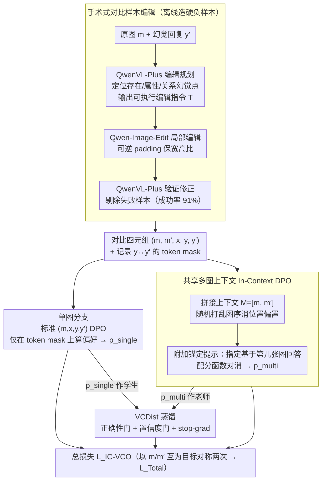

# Learning from Fine-Grained Visual Discrepancies: Mitigating Multimodal Hallucinations via In-Context Visual Contrastive Optimization

**会议**: ICML 2026  
**arXiv**: [2605.31312](https://arxiv.org/abs/2605.31312)  
**代码**: https://github.com/OPPO-Mente-Lab/IC-VCO (有)  
**领域**: 幻觉检测  
**关键词**: 多模态幻觉, 偏好优化, 视觉对比, DPO, 硬负样本

## 一句话总结
将原图与对比负图拼成共享多图上下文，再用锚定指令告诉模型该看哪张，从而让视觉偏好 DPO 的配分函数自动对齐、跑出理论一致的对比目标，并配合精细编辑生成的硬负样本显著降低 VLM 的多模态幻觉。

## 研究背景与动机

**领域现状**：用 DPO 对齐 VLM 是当下主流的后训练方式，但标准 DPO 只在文本端比较 $y$ 与 $y'$，把图像 $m$ 当成静态条件，因此并不显式监督“是否真正在看图”。为了向 DPO 注入视觉信号，近期工作（mDPO、V-DPO、S-VCO、SymMPO 等）引入“视觉偏好对”：固定文本回复 $y$，把正图 $m$ 与负图 $m'$ 互换形成 $r(m,x,y)\succ r(m',x,y)$，再走标准 DPO loss。

**现有痛点**：作者指出这条主流路线有两处硬伤。第一是**理论不一致**——DPO 之所以能消掉难处理的配分函数 $Z$，是因为正负样本共享同一条件；一旦把条件中的图像换掉，$Z(m,x)$ 和 $Z(m',x)$ 是两个不同分布上的归一化常数，根本无法对消，残留项 $\beta\log\frac{Z(m,x)}{Z(m',x)}$ 变成训练时无法控制的偏置。第二是**负样本太粗**：现有 $m'$ 大多来自图文合成或检索，会带来明显的全局风格漂移；模型只要捕捉这些低层差异就能轻松最小化 DPO loss，根本学不到细粒度视觉事实，典型的 shortcut learning。

**核心矛盾**：要在 DPO 框架里注入视觉监督，就得改变条件分布；但一旦条件分布变了，DPO 的理论保证就会被打破，同时负样本的“易区分”又会诱导捷径。两端互相拖累。

**本文目标**：拆成两个子问题：(a) 设计一个能消掉配分函数、保留 DPO 理论一致性的视觉偏好目标；(b) 生成视觉上几乎不可分辨的硬负样本，把对比信号集中在真正的语义差异上。

**切入角度**：作者注意到，只要让正负样本共享**同一个图像上下文**，配分函数就会自动一致。于是把原图和对比图同时塞进一个多图序列 $M=[m,m']$，再用“请基于第一张/第二张图回答”的锚定提示去指定目标图像，把视觉对比从“换条件”转成“同一条件下的文本偏好”，理论瑕疵消失。

**核心 idea**：用 In-Context Visual Contrastive Optimization（IC-VCO）把视觉对比放进共享多图上下文里跑 DPO，再用 Visual Contrast Distillation 把多图监督蒸馏回单图推理分支，最后用“外科手术式”图像编辑造硬负样本，三管齐下根治多模态幻觉。

## 方法详解

### 整体框架
IC-VCO 的输入是一个对比四元组 $(m, m', x, y, y')$：原图 $m$、与之仅在目标语义上有细微差异的负图 $m'$、共用提示 $x$、对应的正确回复 $y$ 与对比回复 $y'$。训练时三条流水同时运作。其一是**多图分支**：把 $[m, m']$ 串成上下文 $M$，在提示后附加位置锚定指令（“请基于第一张图回答”等）得到 $\hat{x}$，跑 DPO 让 $y\succ y'$；为消除位置偏置，每个样本随机打乱图序。其二是**单图分支**：保留标准的 $(m, x, y, y')$ 单图 DPO，保证推理阶段的能力。其三是 **VCDist 蒸馏**：把多图分支得到的偏好概率 $p_{\text{multi}}$ 当 soft target 反向校准单图分支 $p_{\text{single}}$，缩小训练–推理上下文落差。整体目标加上对称项后形成最终损失，配合“细粒度 token mask”进一步聚焦到被编辑的视觉证据。这套四元组里的负图 $m'$ 并非现成数据，而是由“手术式对比样本编辑”流水线在训练前离线造出来的。

### 关键设计

**1. 共享多图上下文的 In-Context DPO：用"换提示"代替"换图"，让配分函数自动对消**

前作的视觉偏好 DPO 都靠"换图"造对——固定文本回复，把正图 $m$ 和负图 $m'$ 互换——但这一换就让条件分布变了，公式上多出一项 $\beta\log\frac{Z(m,x)}{Z(m',x)}$ 偏置，它随样本任意漂移、扭曲决策面。这里的破解是不换条件、只换提示：把原图 $m$ 和负图 $m'$ 拼成图序列 $M=[m,m']$ 作为统一视觉条件，用锚定提示 $\hat{x}$（"请基于第一张图回答"）指定目标图像，于是视觉偏好 $r(m,x,y)\succ r(m',x,y)$ 被改写成同条件下的文本偏好 $r(M,\hat{x},y)\succ r(M,\hat{x},y')$，配分函数 $Z(M,\hat{x})$ 在正负项里完全对消，得到干净的 $p_{\text{multi}}=\sigma\big(\beta\log\tfrac{\pi_\theta(y\mid M,\hat{x})}{\pi_{\text{ref}}(y\mid M,\hat{x})}-\beta\log\tfrac{\pi_\theta(y'\mid M,\hat{x})}{\pi_{\text{ref}}(y'\mid M,\hat{x})}\big)$；同时构造对称对 $r(M,\hat{x}',y')\succ r(M,\hat{x}',y)$ 联合优化，并对每个样本随机打乱图序消除位置偏置。这是第一次让视觉偏好 DPO 站在和原始 DPO 同样的理论地基上。

**2. VCDist：把多图老师蒸馏回单图学生，但带可靠性门控**

训练用多图、推理却只有单图，这个 context gap 会让单图分支被多图训练带偏；可朴素 KL 又会把本来质量更高的单图分布拉低。VCDist 把多图偏好分布当老师、单图分支当学生，用双重门控筛信号：正确性门 $\mathbb{I}(p_{\text{multi}}>0.5)$ 滤掉不可信的老师，置信度门 $\mathbb{I}(p_{\text{single}}<\mathrm{sg}(p_{\text{multi}}))$ 只在学生比老师更不确定时才传梯度、避免"反向惩罚"，再加 stop-gradient 稳定优化，损失写成 $\mathcal{L}_{\text{VCDist}}=-\mathbb{E}\big[\mathbb{I}(\cdot)\big(\mathrm{sg}(p_{\text{multi}})\log p_{\text{single}}+(1-\mathrm{sg}(p_{\text{multi}}))\log(1-p_{\text{single}})\big)\big]$。最终总目标为 $\mathcal{L}_{\text{IC-VCO}}=\tfrac{1}{2}\big[\lambda_1(\mathcal{L}_{\text{Multi}}+\eta_1\mathcal{L}_{\text{MultiAnc}})+\lambda_2(\mathcal{L}_{\text{Single}}+\eta_2\mathcal{L}_{\text{SingleAnc}})+\gamma\mathcal{L}_{\text{VCDist}}\big]$。两道门保证"老师靠谱、学生确实需要"才学，弥合训练-推理落差又不伤单图能力。

**3. 手术式对比样本编辑：造分布几乎一致的硬负样本，逼模型看清语义而非风格**

旧法用合成/检索整张图当负样本，会带来全局风格漂移 $P(C_{ctx},U\mid m)\neq P(C_{ctx},U\mid m')$，模型只要抓这些低层差异就能最小化 DPO loss，根本学不到细粒度事实，是典型 shortcut。这里把图像生成因子分解为目标概念 $c_{tgt}$、上下文 $C_{ctx}$、环境 $U$，只做精细干预 $do(c_{tgt}\to c'_{tgt})$ 而维持 $\{C_{ctx},U\}_m\approx\{C_{ctx},U\}_{m'}$。流水线是：QwenVL-Plus 当"编辑规划器"识别 $y'$ 里的幻觉点（存在/属性/关系三类）并输出可执行编辑指令 $\mathcal{T}$；Qwen-Image-Edit 在保留宽高比的可逆 padding 下做局部修改；再让 QwenVL-Plus 验证编辑是否落地并修正措辞。同时记录 $y$ 与 $y'_{\text{new}}$ 的 token 级差异作为单图分支的 fine-grained mask，只在被编辑的视觉证据 token 上算偏好分。分布对齐后模型必须真正看清目标概念才能做对偏好判断，token mask 进一步把梯度集中到"真正被改"的位置。

### 损失函数 / 训练策略
最终目标 $\mathcal{L}_{\text{Total}}=\mathcal{L}_{\text{IC-VCO}}+\mathcal{L}'_{\text{IC-VCO}}$ 对称地以 $m$ 和 $m'$ 互为目标各跑一次。锚定项 $\mathcal{L}_{\text{SingleAnc}}$ 与 $\mathcal{L}_{\text{MultiAnc}}$ 沿用既有做法，防止 chosen 似然相对参考策略下滑。数据上以 SymMPO 的 21.4k 种子样本为底，最终产出 19,453 条编辑负样本，整体成功率 91%。

## 实验关键数据

### 主实验
在 LLaVA-NeXT-Interleave-Qwen-7B 上对比五种主流视觉偏好优化方法，分别用合成负样本与本文编辑负样本两套数据训练，五项幻觉/视觉理解基准的宏平均如下。

| 数据来源 | 方法 | Overall | HallusionBench aAcc | AMBER Attr | CRPE Exist | BLINK |
|----------|------|---------|---------------------|------------|------------|-------|
| — | LLaVA-NeXT-Interleave-Qwen-7B 基线 | 59.14 | 55.59 | 79.97 | 92.01 | 45.13 |
| 合成 | mDPO | 61.64 | 61.51 | 80.27 | 91.79 | 44.87 |
| 合成 | SymMPO | 61.50 | 60.79 | 80.41 | 91.83 | 44.88 |
| 合成 | **IC-VCO（本文）** | **62.83** | 61.94 | 81.81 | 93.16 | **48.93** |
| 编辑 | mDPO | 62.02 | 60.25 | 80.31 | 92.27 | 45.66 |
| 编辑 | SymMPO | 62.11 | 60.57 | 80.39 | 92.47 | 45.19 |
| 编辑 | **IC-VCO（本文）** | **63.35** | **63.51** | **82.24** | **94.15** | **49.44** |

在 LLaVA-OneVision-Qwen2-7B 上，IC-VCO 同样领先 SymMPO / S-VCO 等强基线，BLINK 与 HallusionBench fAcc 提升尤其明显。

### 消融实验
论文给出 IC-VCO 组件级消融，验证三件套缺一不可。

| 配置 | Overall | 说明 |
|------|---------|------|
| Full IC-VCO（多图+VCDist+编辑负样本+token mask） | 63.35 | 完整模型 |
| 仅合成负样本（去掉编辑） | 62.83 | 数据端硬负样本贡献约 0.5 分 |
| 去掉 VCDist | 下降 | 单图分支失去多图监督，HallusionBench 类幻觉指标退化最大 |
| 仅单图 DPO（去掉多图分支） | ≈ mDPO 水平 | 没有共享上下文 → 配分函数偏置回归 |

### 关键发现
- 编辑负样本不仅服务于 IC-VCO，对 mDPO/SymMPO/S-VCO 等老方法也都有正向提升（Overall +0.4~0.8），说明“数据硬度”是独立有效的改进维度。
- 在抗幻觉指标（HallusionBench fAcc/qAcc、AMBER Exist）和细粒度视觉推理（BLINK）上 IC-VCO 的相对提升最大，与“消掉理论偏置 + 强化细粒度对比”的动机一致。
- CRPE Relation 是个反例：IC-VCO 在该指标上略低于 mDPO/SymMPO，提示对关系类幻觉的局部编辑还不够细。

## 亮点与洞察
- “换条件 → 换提示”的视角切换是这篇最巧妙的地方：把视觉差异显式放进上下文，再让锚定指令承担“指哪张”的角色，DPO 公式一动不动，配分函数就回到对消轨道，这是绕过 mDPO/S-VCO 理论瑕疵的一条干净路径。
- VCDist 把多图分支视作老师、对单图分支做置信度门控蒸馏，对所有“训练用多图、推理用单图”的多模态偏好工作都有迁移价值，例如视频时序对比、跨视角一致性训练。
- 手术式编辑 + token-level mask 这套数据流水可独立拆出来用：只要任务里能定义“目标概念 vs 上下文”，就能把粗粒度负样本升级为硬负样本，对一切 contrastive 学习路线都是底层增益。

## 局限与展望
- 编辑流水重度依赖 QwenVL-Plus 与 Qwen-Image-Edit，91% 成功率意味着仍有约 9% 样本被丢弃，对低资源场景或非自然图（医学、遥感）能否复制需要再验证。
- 多图分支带来的训练成本和上下文长度翻倍，对超长高分辨率图像或更大模型规模的可扩展性论文未充分讨论。
- CRPE Relation 类幻觉提升有限，反映“关系”类语义编辑（涉及两物体的相对位置与交互）比“存在/属性”更难做出干净的局部干预，是该框架最需要补强的一块。

## 相关工作与启发
- **vs mDPO / S-VCO / SymMPO**：都是“换图造对”，但忽略了 $Z(m,x)\neq Z(m',x)$ 带来的偏置；IC-VCO 用共享上下文把配分函数消掉，理论上更干净。
- **vs V-DPO**：V-DPO 也尝试视觉偏好建模，但仍属单图条件比较；IC-VCO 把视觉对比显式塞进上下文并用锚定提示分流，能直接复用现成 LVLM 的 multi-image 输入接口，无需改动模型架构。
- **vs SymMPO 的合成负样本**：SymMPO 用文生图造负样本，全局风格偏移明显；本文用 Qwen-Image-Edit 做局部编辑，CLIP 相似度分布显著更集中于高相似区间，是 shortcut learning 的根因级解决。

## 评分
- 新颖性: ⭐⭐⭐⭐⭐ 一次性补齐视觉偏好 DPO 的“理论缺口”和“数据缺口”，思路统一且漂亮。
- 实验充分度: ⭐⭐⭐⭐ 五个基准 × 两套基模型 × 多种基线 + 数据源消融，唯一遗憾是模型规模仅做到 7B。
- 写作质量: ⭐⭐⭐⭐⭐ 公式推导与动机叙述紧密耦合，配分函数残差的图解尤其清晰。
- 价值: ⭐⭐⭐⭐⭐ VCDist 与手术式编辑两个独立模块都能即插即用，社区可直接复用。

<!-- RELATED:START -->

## 相关论文

- [\[NeurIPS 2025\] Mitigating Hallucination Through Theory-Consistent Symmetric Multimodal Preference Optimization](../../NeurIPS2025/hallucination/mitigating_hallucination_through_theory-consistent_symmetric_multimodal_preferen.md)
- [\[ICML 2026\] Finding the Correct Visual Evidence Without Forgetting: Mitigating Hallucination in LVLMs via Inter-Layer Visual Attention Discrepancy](finding_the_correct_visual_evidence_without_forgetting_mitigating_hallucination_.md)
- [\[CVPR 2025\] Stop Learning It All to Mitigate Visual Hallucination, Focus on the Hallucination Target](../../CVPR2025/hallucination/stop_learning_it_all_to_mitigate_visual_hallucination_focus_on_the_hallucination.md)
- [\[CVPR 2026\] Zina: Multimodal Fine-grained Hallucination Detection and Editing](../../CVPR2026/hallucination/zina_multimodal_fine-grained_hallucination_detection_and_editing.md)
- [\[CVPR 2026\] FINER: MLLMs Hallucinate under Fine-grained Negative Queries](../../CVPR2026/hallucination/finer_mllms_hallucinate_under_fine-grained_negative_queries.md)

<!-- RELATED:END -->
