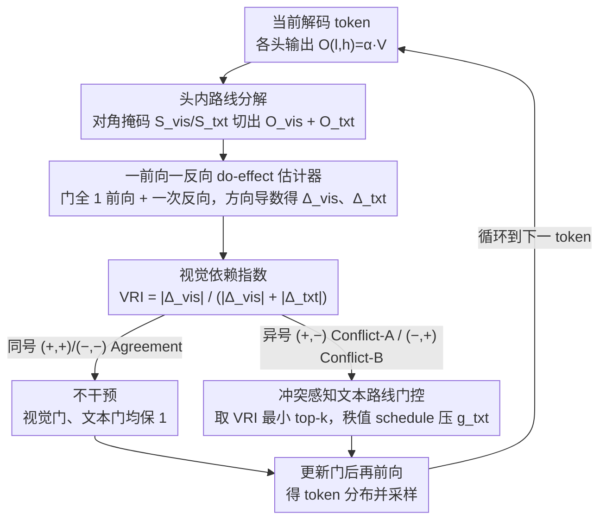

# Mitigating Hallucinations in Large Vision-Language Models via Causal Route Gating

**会议**: ICML 2026 Spotlight  
**arXiv**: [2605.24024](https://arxiv.org/abs/2605.24024)  
**代码**: 无  
**领域**: 幻觉检测  
**关键词**: LVLM 幻觉, 因果干预, 注意力头门控, 路线分解, 训练自由

## 一句话总结
CRG 把每个注意力头的输出沿视觉/文本两条路线做精确线性分解，用一前向一反向梯度估计两条路线对当前 token 的因果"do-effect"，再仅压制那些视觉与文本符号冲突且 VRI 偏低（即先验主导）的头的文本路线，从而在无需训练的前提下系统性削弱 LVLM 的语言先验幻觉。

## 研究背景与动机
**领域现状**：大型视觉语言模型（LVLM）已成为图像问答与描述生成的主流接口，但"幻觉"——生成与图像无关却语义通顺的内容——仍是部署最大的可靠性瓶颈。训练自由（training-free）的推理期干预因为不需要额外算力和数据成为热门方向，主流路线分两类：一类是 VCD/OPERA/MaskCD 等输出级解码策略，一类是 PAI/VTI 等基于注意力代理的内部干预。

**现有痛点**：解码级干预把模型当黑盒看，无法定位"是哪些组件让模型选择了不该选的 token"；而基于"视觉注意力占比"（VAR）的内部干预默认"注意力越多→视觉证据越强"，这一假设在 softmax 归一化和价值向量内容耦合下并不成立——同一个头的视觉注意力很大，但价值向量与梯度方向几乎正交，对决策仍可能没有正贡献。而且这类方法通常在头级别整体放缩，连同有用的视觉路线一起被压制。

**核心矛盾**：相关性度量（注意力质量）≠ 因果贡献（do-intervention 下决策得分的真实变化）。要真正定位"语言先验压过视觉证据"的头，必须做决策对齐的因果干预，而不是看注意力图。

**本文目标**：(1) 在不重训的前提下，给出一个能区分"视觉路线对决策的因果效应"和"文本路线对决策的因果效应"的工具；(2) 利用两者的符号冲突精准识别"先验主导"的头；(3) 只压文本路线、保留视觉路线，且与解码同步在线运行。

**切入角度**：观察到多头注意力的输出 $O_{l,h}=\alpha_{l,h}V_{l,h}$ 中，价值矩阵 $V_{l,h}$ 可以按视觉/文本 token 的索引集合做对角掩码精确分裂为 $O_{l,h}^{\mathrm{vis}}+O_{l,h}^{\mathrm{txt}}$。这意味着可以在不动 attention weights 的前提下，单独"do-intervene"任意一条路线。

**核心 idea**：把每个头内部劈成两条路线，量化两条路线分别对当前 token 决策的 do-effect，只对"视觉为正、文本为负"或"视觉为负、文本为正"的冲突头压制文本路线，把语言先验的影响逐 token 切掉。

## 方法详解

### 整体框架
CRG（Causal Route Gating）是一个嵌进解码循环的推理期模块，每生成一个 token 都跑三步：(1) 把每个头的输出按 token 模态精确分裂为视觉路线 $O^{\mathrm{vis}}_{l,h}$ 与文本路线 $O^{\mathrm{txt}}_{l,h}$；(2) 用一前向一反向梯度估计两条路线的因果效应 $\widehat{\Delta}^{\mathrm{vis}}_{l,h}$ 与 $\widehat{\Delta}^{\mathrm{txt}}_{l,h}$，并归一化得到视觉依赖指数 $\mathrm{VRI}_{l,h}$；(3) 按 $(\widehat{\Delta}^{\mathrm{vis}},\widehat{\Delta}^{\mathrm{txt}})$ 的符号将头划入 Agreement / Conflict-A / Conflict-B 三类，对冲突头按 VRI 取最小的 top-$k$ 用一个秩相关的平滑 schedule 单独压制文本门 $g^{\mathrm{txt}}_{l,h}$。模型权重、视觉路线、KV-cache 全程不变。

### 关键设计

**1. 头内路线精确分解 + 决策对齐的因果路线效应（CRE）：把"相关"换成"因果"**

VAR 之类的注意力质量代理只看权重不看值，还受 softmax 竞争污染——文本 logit 一降，VAR 就上升，可视觉证据其实没变。CRG 不看注意力图，而是直接问"如果关掉这条路线，决策得分会怎么变"。关键观察是头输出 $O_{l,h}=\alpha_{l,h}V_{l,h}$ 里的价值矩阵可以按 token 模态精确切开：用一对互补的对角选择矩阵 $S_{\mathrm{vis}},S_{\mathrm{txt}}$（满足 $S_{\mathrm{vis}}+S_{\mathrm{txt}}=I_L$、$S_{\mathrm{vis}}S_{\mathrm{txt}}=0$）掩掉非目标行，得到 $O^{\mathrm{vis}}_{l,h}=\alpha_{l,h}(S_{\mathrm{vis}}V_{l,h})$、$O^{\mathrm{txt}}_{l,h}=\alpha_{l,h}(S_{\mathrm{txt}}V_{l,h})$，恒等式 $O_{l,h}=O^{\mathrm{vis}}_{l,h}+O^{\mathrm{txt}}_{l,h}$ 严格成立，注意力权重和 $W^O_l$ 一点没动。给每条路线接一个标量门后，在单个头上做干预、其余头保持基线，用任务得分 $\ell$ 定义两条路线的 do-effect $\Delta^{\mathrm{vis}}_{l,h}=\ell(1,1)-\ell(0,1)$、$\Delta^{\mathrm{txt}}_{l,h}=\ell(1,1)-\ell(1,0)$（生成任务取 $\ell=\log p(y^*)$，二元 QA 取 $\ell=\log p(\mathrm{Yes})-\log p(\mathrm{No})$），再聚合成视觉依赖指数 $\mathrm{VRI}_{l,h}=|\Delta^{\mathrm{vis}}_{l,h}|/(|\Delta^{\mathrm{vis}}_{l,h}|+|\Delta^{\mathrm{txt}}_{l,h}|+\varepsilon)$ 用于排序。这样定位"语言先验压过视觉"的头就是看决策的真实变化，而非看注意力多少。

**2. 一前向一反向的一阶 do-effect 估计器：让因果干预跟解码同步在线跑**

精确两点 do-effect 要为每个 $(l,h)$ 各跑一次"门关掉"的前向，全模型代价是 $O(LH)$ 倍解码成本，根本没法在线。作者证明只要 $\ell$ 是门的可微函数，一阶展开就给出严格估计：正常做一次门全 1 的前向，缓存所有 $O^{\mathrm{vis}}_{l,h},O^{\mathrm{txt}}_{l,h}$；再对决策得分反向一次，拿到每个头 pre-$W^O_l$ 处的灵敏度 $G_{l,h}=\partial\ell/\partial\tilde O_{l,h}$，沿门轴的方向导数即 $\widehat{\Delta}^{\mathrm{vis}}_{l,h}=\langle G_{l,h},O^{\mathrm{vis}}_{l,h}\rangle$、$\widehat{\Delta}^{\mathrm{txt}}_{l,h}=\langle G_{l,h},O^{\mathrm{txt}}_{l,h}\rangle$，与精确 do-difference 的一阶项一致。KV-cache 全程不动，每 token 只多一次 backward。妙处在于下游只关心 sign 与 ranking 而非精确数值，与"粗略效应估计足以做近最优预算分配"的理论一致，所以这个粗估计完全够用。

**3. 冲突感知的文本路线门控（Conflict-A / Conflict-B + 秩值 schedule）：只切冲突头的文本路线，视觉门一律保 1**

有了两条路线的 do-effect 符号，就能把头分到四象限。同号（$+,+$ / $-,-$）是 Agreement，意味着两条路线一起把决策朝同一方向推，多半是模型在做正确的多模态融合，硬切会伤性能，所以不动；$(+,-)$ 记 Conflict-A（视觉支持、文本反对），视作文本噪声温和压制；$(-,+)$ 记 Conflict-B（视觉反对、文本支持），正是幻觉的最强特征，强力压制。具体在 $\mathcal{H}_A,\mathcal{H}_B$ 各取 VRI 最小的 top-$k$ 头组成 $\mathcal{S}$（VRI 低意味着这个头几乎只由文本驱动，典型的语言先验主导），升序赋秩归一化 $s_i=i/(|\mathcal{S}|-1)$，门值 $g^{\mathrm{txt}}_{(i)}=g_{\min}+(g_{\max}-g_{\min})\cdot\mathrm{clip}(s_i^\gamma,\epsilon,1-\epsilon)$，Conflict-A 用温和区间 $(0.5,1.0)$、Conflict-B 用强抑制区间 $(0,0.5)$。用秩值平滑过渡而非统一标量，避免"全砍到 0"或硬阈值带来的解码退化，也保住了真正在做 grounded reasoning 的头不被误伤。

### 损失函数 / 训练策略
完全训练自由：不更新任何参数，无监督信号，无额外训练阶段。所有超参（top-$k$、$\gamma$、$\epsilon$、$g_{\min/\max}^{A/B}$）在小验证集上一次性确定，跨模型固定不变；每 token 多一次 autograd backward 是唯一额外开销。具体地，对当前解码 token 先做一次门全 1 的标准前向得到 logits 并选出 $y^*$，缓存所有头的 $O^{\mathrm{vis}}_{l,h},O^{\mathrm{txt}}_{l,h}$ 与 pre-$W^O_l$ 张量；调用一次 backward 得到 $G_{l,h}$，按式 (3) 求出 $\widehat{\Delta}^{\mathrm{vis}/\mathrm{txt}}_{l,h}$ 与 $\widehat{\mathrm{VRI}}_{l,h}$；按算法 1 用秩值 schedule 给冲突头打门后，再用更新后的门做一次"真正用于解码"的前向得到 token 分布并采样。KV-cache 因为只改 $W^O_l$ 之前的标量门、不动 attention 内部结构而完全可复用，与标准 greedy / beam 解码兼容。

## 实验关键数据

### 主实验
在 LLaVA-1.5-7B、Qwen-VL-Chat、Qwen2.5-VL-7B-Instruct 三个 LVLM 上，五个基准（POPE、CHAIR、MME、MMHal-Bench、AMBER）系统超过 Regular、VCD、OPERA、PAI、VTI。

| 数据集 / 设定 | 指标 | Regular | 最强 baseline | CRG | 相对 Regular 提升 |
|---|---|---|---|---|---|
| POPE-Random / LLaVA-1.5-7B | Acc / F1 | 83.29 / 81.33 | VTI 89.50 / 88.89 | **90.30 / 89.51** | +7.01 / +8.18 |
| POPE-Adv / Qwen2.5-VL-7B | Acc / F1 | 82.79 / 83.15 | VTI 85.78 / 85.14 | **86.98 / 87.07** | +4.19 / +3.92 |
| CHAIR / LLaVA-1.5-7B | $C_S\downarrow$ / $C_I\downarrow$ / Recall↑ | 52.8 / 15.9 / 77.3 | VTI 37.6 / 12.9 / 79.3 | **34.2 / 11.2** / 77.8 | $C_S$ −18.6 |
| AMBER / LLaVA-1.5-7B | CHAIR↓ / F1↑ / Score↑ | 8.3 / 73.7 / 82.70 | — | **4.6 / 77.5 / 86.45** | Score +3.75 |

### 消融实验
| 配置 | POPE-Avg↑ | $C_S$↓ | MMHal↑ | MME↑ | 含义 |
|---|---|---|---|---|---|
| Regular | 81.37 | 52.8 | 2.23 | 1640 | 无干预基线 |
| CRG w/o A (仅 Conflict-B) | 中等 | 中等 | 中等 | 中等 | 只切语言先验主导头 |
| CRG w/o B (仅 Conflict-A) | 略低于 w/o A | 略高 | — | — | 只压噪声型文本路线 |
| **CRG (A+B)** | **最优** | **34.2** | **最优** | **最优** | 完整冲突感知策略 |

### 关键发现
- Conflict-B（视觉反对、文本支持）是幻觉的最强单一信号源，其单独干预收益大于 Conflict-A；但二者联合才能最大化幻觉削减且 MME 等综合能力不掉点，说明两类冲突在因果机制上是互补的。
- 图 3 的逐头可视化表明 VAR 与 VRI 在前几层模式相近、中层却出现明显错位：中层 VAR 几乎扁平而 VRI 仍有显著结构，验证"注意力质量不是决策相关视觉接地的可靠代理"的核心论断。
- 干预只动文本门、视觉门保持 1，使得 MME 在 Existence、Count、Position、Color 等接地敏感类目和 Commonsense Reasoning、Numerical Calculation 等高级推理类目同时提升，说明该方法在削幻觉的同时几乎不损伤一般多模态能力。
- 在 CHAIR 上 $C_S$ 从 52.8 降至 34.2（LLaVA-1.5-7B）、50.2 降至 32.4（Qwen-VL-Chat），同时 Recall 几乎不掉甚至上升（76.4→81.6），表明削幻觉不是靠"少说"而是"说对"。
- 在 AMBER 综合指标上 Score +3.75，其中 CHAIR↓ −3.7 与 F1↑ +3.8 同时获得，说明 CRG 同时改善了开放生成与判别两类幻觉评测维度。

## 亮点与洞察
- 用 $S_{\mathrm{vis}}+S_{\mathrm{txt}}=I_L$、$S_{\mathrm{vis}}S_{\mathrm{txt}}=0$ 的两条互补对角掩码把 $V_{l,h}$ 严格劈成两块，注意力权重和 $W^O_l$ 完全没动——这是整个方法在"完全不重训也不动 attention"的前提下还能做精确 do-intervention 的根本理由。
- "粗略一阶 do-effect 够用"的理论支撑 + 只需符号与排序的下游用法，让因果干预从离线分析工具变成可在线运行的解码组件，把因果方法的部署成本压到几乎与梯度反传相当，是非常巧妙的工程-理论结合。
- 把幻觉显式定义为 "视觉 $-$、文本 $+$" 的符号冲突，比"看视觉注意力比例"更贴近问题本质；同时还能区分 Conflict-A（文本噪声）与 Conflict-B（先验主导）并差异化干预，这种"先分类再差异化处置"的范式可直接迁移到其他需要削弱某条模态路径的多模态任务（如多模态对齐、模态丢失鲁棒性）。
- 文中第 4.2 节给出 VAR 的反事实分析（$\partial R/\partial s_k=-R\alpha_k<0$）显式说明"文本 logit 下降→VAR 上升"的虚假相关性，这是对"注意力即解释"长期假设的一次干净反例。

## 局限与展望
- 一阶估计在大门变动下偏差未被严格刻画，论文给出 Lipschitz 条件下的偏差界但实证仅做了 sign-consistency 验证；当模型规模/层数继续放大、单个头影响非线性更强时，是否需要二阶修正仍是开放问题。
- 推理期每 token 多一次 backward，作者声称"开销适中"但未对长生成场景给出绝对延迟数；在 batch 解码与 KV-cache 复杂的实际系统里这部分代价可能不容忽视。
- 门区间 $(g_{\min}^A,g_{\max}^A)=(0.5,1.0)$ 与 $(g_{\min}^B,g_{\max}^B)=(0,0.5)$ 是人工选取的二段化设计，跨模型/跨任务统一固定有简洁性但缺乏自适应；当未来 LVLM 头数与层数继续放大时，自动学习 top-$k$ 与门区间的动态版本可能进一步释放潜力。

## 相关工作与启发
- **vs VCD / OPERA / MaskCD**：解码级启发式只调输出分布、不触及内部机制，CRG 在头内细粒度做因果干预，定位能力强于黑盒解码控制。
- **vs PAI / VTI**：同属内部干预但前者在隐层做空间引导、后者做潜空间方向控制，CRG 把干预粒度下沉到"头内单条路线"，且用 do-effect 做选择而不是隐式表征距离。
- **vs VAR-style 选择（Jiang et al. 2025 等）**：用注意力质量代理选头并整头放缩，CRG 在理论与实验上指出 VAR 与决策相关视觉接地存在系统性错位，且头级放缩会连带压视觉路线。
- **vs CHG（Causal Head Gating）**：CHG 学习头级可微门，CRG 把因果干预从"头级学习门"推到"头内路线级解码期 do-effect"，无需训练且粒度更细。

## 评分
- 新颖性: ⭐⭐⭐⭐⭐ 第一次把"头内视觉/文本路线"作为因果干预的最小单元，并配上能在线运行的一阶估计器，路线级而非头级。
- 实验充分度: ⭐⭐⭐⭐ 五个基准、三种 LVLM、四种 baseline、完整消融与可视化对照 VAR/VRI；但缺更大模型与多语言/多模态扩展。
- 写作质量: ⭐⭐⭐⭐⭐ 从动机—理论—算法—实验链条非常清晰，公式排版与符号体系一致性高。
- 价值: ⭐⭐⭐⭐⭐ 训练自由、即插即用、不损一般多模态能力，对 LVLM 部署侧的幻觉控制有直接落地价值。

<!-- RELATED:START -->

## 相关论文

- [\[CVPR 2026\] CausalLens: Sensitivity-Guided Multi-Head Causal Intervention for Hallucination Mitigation in Large Vision-Language Models](../../CVPR2026/hallucination/causallens_sensitivity-guided_multi-head_causal_intervention_for_hallucination_m.md)
- [\[ACL 2026\] Mitigating Hallucinations in Large Vision-Language Models without Performance Degradation](../../ACL2026/hallucination/mitigating_hallucinations_in_large_vision-language_models_without_performance_de.md)
- [\[NeurIPS 2025\] Causal-LLaVA: Causal Disentanglement for Mitigating Hallucination in Multimodal Large Language Models](../../NeurIPS2025/hallucination/causalllava_causal_disentanglement_for_mitigating_hallucinat.md)
- [\[CVPR 2026\] HulluEdit: Single-Pass Evidence-Consistent Subspace Editing for Mitigating Hallucinations in Large Vision-Language Models](../../CVPR2026/hallucination/hulluedit_single-pass_evidence-consistent_subspace_editing_for_mitigating_halluc.md)
- [\[CVPR 2026\] Prefill-Time Intervention for Mitigating Hallucination in Large Vision-Language Models](../../CVPR2026/hallucination/prefill-time_intervention_for_mitigating_hallucination_in_large_vision-language_.md)

<!-- RELATED:END -->
