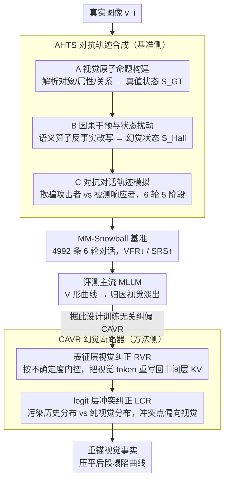

# MM-Snowball: Evaluating and Mitigating Hallucination Snowballing in Multimodal Multi-Turn Dialogue

**会议**: ICML 2026  
**arXiv**: [2606.00622](https://arxiv.org/abs/2606.00622)  
**代码**: https://frenkie-chiang.github.io/MM-Snowball (项目页)  
**领域**: 幻觉检测  
**关键词**: 多轮对话, 幻觉雪球, 视觉淡出, 训练无关纠正, 诊断基准

## 一句话总结
本文提出 MM-Snowball 基准（4992 条 6 轮对抗对话）系统刻画多模态大模型在长对话中"幻觉滚雪球"现象，并据此设计训练无关的 CAVR 方法，在表征层刷新视觉信号、在 logit 层裁决文本-视觉冲突，从而显著压平后段对话的性能塌陷曲线。

## 研究背景与动机
**领域现状**：多模态大模型（MLLM）在 VQA、caption、指令跟随等单轮任务上已被大量基准证明性能强劲，但真实部署场景几乎都是多轮对话——用户会基于模型先前的回答追问、修正、引导。POPE、HallusionBench、MMHal-Bench 等现有幻觉基准基本都局限在单轮 yes-no 或 MCQ 设定，最多扩展到"caption-then-question"的两轮模式。

**现有痛点**：当对话延长到 5–6 轮时，模型一旦在早期回答中犯错（错把"两只猫"说成"三只猫"），后续的每一轮都会把这个错误当成上下文事实继续推理，从而把局部感知失误放大成系统性认知妄想——作者将这种沿对话深度递推的幻觉级联命名为 *hallucination snowballing*。多轮对话基准要么用 PS 过的"假图"诱导幻觉、丢失了真实视觉分布（VisDiaHalBench），要么仅有 2 轮地平线、无法观察长期演化（MMHalSnowball）。

**核心矛盾**：单轮场景的缓解策略（如 VCD、OPERA、MemVR）都建立在"文本上下文是干净的"这一隐含假设上，但在长对话里上下文本身就被前几轮的幻觉污染过，再去对解码分布做局部修正反而强化了被污染的语言先验。问题的根本是模型在长对话中出现 *模态解耦*：推理引擎逐渐忽略视觉 token，转而追求与"脏文本历史"的内部一致性。

**本文目标**：（1）构造一个真正进化式、6 轮以上、面向真实图像的对话基准，让幻觉滚雪球的全过程可被精细测量；（2）给出训练无关、可挂载在主流 MLLM 上的纠偏方法，让模型在后段对话仍能锚回视觉事实。

**切入角度**：作者通过实验发现一条反直觉的"V 形"性能曲线——准确率在第 3–5 轮急剧下降，但当第 6 轮被显式提示"再仔细看一遍图像"时又显著回升。这说明视觉证据并未在权重层面被"遗忘"，而是被累积的污染文本压制，可以通过显式刷新视觉表征 / 干预 logit 重新激活。

**核心 idea**：用 *Adversarial Hallucination Trajectory Synthesis (AHTS)* 构造分阶段的 6 轮对抗对话基准 MM-Snowball；再用 *Conflict-Aware Visual Rectification (CAVR)*，同时在表征层和 logit 层"重锚"视觉，把单点缓解升级成对话级缓解。

## 方法详解

### 整体框架
论文分两条主线推进。**第一条主线 (基准侧)**：通过 AHTS 流水线对真实图像 $v_i$ 生成 4992 条 6 轮对话轨迹（共 29952 条 OE 问题）。流水线分三阶段：（A）*Visual Atomic Proposition Construction* 将图像解析为结构化语义单元，建立 ground-truth 状态 $S_{GT}$；（B）*Causal Intervention & State Perturbation* 通过语义算子在 $S_{GT}$ 上施加反事实扰动得到幻觉状态 $S_{Hall}$；（C）*Adversarial Dialogue Trajectory Simulation* 用一个"欺骗性攻击者"与一个"分叉响应者"演 6 轮戏，把对话推过 5 个认知阶段：感知锚定 → 对抗分叉 → 推理升级 → 系统幻觉 → 视觉纠正。**第二条主线 (方法侧 CAVR)**：训练无关纠正方法，在推理时挂在任意自回归 MLLM 之上，针对作者观察到的两类视觉淡出（visual fading）分别给出表征层和 logit 层的双机制干预，整体作为"幻觉断路器"。

### 关键设计

**1. AHTS 对抗轨迹合成：把"幻觉滚雪球"拆成可控、可标注、分阶段的对话轨迹**

雪球是个时序现象，要测它得让每一轮都可解析。AHTS 先用视觉原子命题把图像分解成对象/属性/关系三元组集合 $S_{GT}=\{(o_k,a_k,r_k)\}$，建立 ground-truth 状态；再用定义在三元组上的语义算子（属性替换、对象删除、关系反转）施加反事实扰动，得到幻觉状态 $S_{Hall}$；然后让两个角色演 6 轮戏——Deceptive Attacker 在第 3 轮注入与 $S_{Hall}$ 一致的误导性前提，Bifurcated Responder 就是被测 MLLM。每轮问题严格对齐五个认知阶段（感知锚定 → 对抗分叉 → 推理升级 → 系统幻觉 → 视觉纠正）中的某一个，整条轨迹长度可外推到 6 轮以上，最后用 Visual Fallacy Rate（VFR↓）和 Success Rate of Snowball（SRS↑）量化逐轮塌陷与级联成功率。之所以要显式的攻击者加阶段标签，是因为现有多轮基准要么轮数太短（≤2），要么把多轮拼成两个独立任务（caption+VQA），都刻画不出错误在对话内的连续传递；有了这套设计才能区分"模型抗住了对抗"和"模型只是错得不一样"。

**2. 表征层视觉纠正 RVR：在模型把图压住之前，就把视觉信号续回去**

作者发现 V 形曲线的底部对应中间层视觉 attention 显著下降——也就是视觉淡出（visual fading）发生在表征通道里，等到 logit 层再补救已经晚了。RVR 因此在生成的每一步监测选定中间层的 epistemic 不确定度信号 $U_\ell$（如该层 token 分布熵、或视觉/文本 attention 比的代理量），一旦 $U_\ell$ 越过阈值、怀疑视觉接地正在衰减，就把原始视觉 token 表征 $h_v$ 重新写回该层的 key-value 缓存（思想上扩展了 MemVR 的"视觉记忆再注入"），相当于强制模型在对话中段"再看一眼图"。整个过程不改参数、不引入训练。它解决的是 fading 本身，为后面的 logit 干预铺好干净的表征底子，否则 logit 层只是对一堆脏分布做局部修匀。

**3. logit 层冲突纠正 LCR：显式裁决"污染历史 vs 当前视觉锚点"**

多轮里更脏的来源其实不是语言先验，而是被前几轮幻觉污染过的对话历史本身，所以只对纯语言先验做对比解码（VCD/OPERA 那套）已经不够。LCR 构造两个分布——以完整对话历史为条件的 $p_\text{ctx}(y|x_{1:t})$ 和剥离污染历史、只留图像加当前问题的 $p_\text{vis}(y|v,q_t)$，找出二者高散度的 token 位置当作"冲突点"，并在这些位置按自适应权重把分布偏向视觉：

$$p_\text{out}(y) \propto p_\text{ctx}(y)^{1-\alpha_t}\, p_\text{vis}(y)^{\alpha_t}$$

其中 $\alpha_t$ 由 RVR 的不确定度信号驱动；没有冲突时 $\alpha_t \to 0$，避免对正常 token 过度干预。这样污染历史和视觉事实打架的地方，输出会被显式拉回视觉，而 RVR 与 LCR 一个管表征续命、一个管 logit 裁决，构成"幻觉断路器"。

### 损失函数 / 训练策略
CAVR 完全训练无关：不更新任何参数、不依赖偏好数据、不引入额外解码头，仅在推理路径上挂载 RVR 和 LCR 两个钩子，因此可即插即用到 Qwen2.5-VL、LLaVA、InternVL 等系列。基准侧无训练，只涉及合成与人工校验。

## 实验关键数据

### 主实验
作者在 MM-Snowball 上系统比较了开源与专有 MLLM 的 6 轮逐轮准确率，并以 VFR↓ / SRS↑ 总结幻觉行为。论文披露的关键定性结论：

| 评测维度 | 关键结论 |
|---------|---------|
| 6 轮准确率曲线 | 所有 baseline 均呈"V 形"——Turn 3 对抗分叉后准确率断崖式下降，Turn 6 视觉再提示后部分回升 |
| 中段塌陷 (Turn 3–5) | 主流 MLLM 准确率下降 15%–30%，对抗前提一旦引入即长期主导推理 |
| Turn 6 视觉再提示 | 模型 acc 回升 5%–15%，证明视觉证据未被遗忘而是被压制 |
| 跨模型规模 | 7B / 32B / 70B 级模型均无法免疫，更大模型只是塌陷点稍晚 |

CAVR 与现有缓解策略对比（基于论文披露的趋势性结论，定性汇总）：

| 缓解方法 | 单轮 VQA 效果 | MM-Snowball 长对话效果 |
|---------|--------------|----------------------|
| VCD (对比解码) | 有效 | 后段塌陷依旧明显 |
| OPERA (摘要 token 惩罚) | 有效 | 对污染历史无能为力 |
| MemVR (视觉再注入) | 有效 | 缓解但 Turn 5/6 仍显著下降 |
| **CAVR (本文)** | 有效 | **显著压平 V 形曲线，Turn 5/6 维持高视觉保真** |

### 消融实验
| 配置 | 关键现象 | 解读 |
|------|---------|------|
| Full CAVR | 后段对话 VFR 最低、SRS 最低 | 完整双机制最优 |
| 仅 RVR | 中段塌陷被部分阻止，但 logit 仍偏向脏历史 | 表征刷新解决"视觉淡出"但不解决冲突仲裁 |
| 仅 LCR | 冲突 token 被局部修匀，深层表征已退化 | logit 干预晚于表征衰减 |
| 无触发的恒开 RVR | 干扰正常 token、整体下降 | 必须由不确定度门控、按需触发 |

### 关键发现
- *视觉淡出（visual fading）是 snowballing 的主因*：作者通过 attention 分析与 Turn 6 视觉再提示实验，把"为什么会雪球"的根因从"模型忘了图"修正为"模型把图压住了"——这一区分直接决定缓解方法应该刷新表征而非重新输入图像。
- *V 形曲线的可恢复性* 表明任何只在最后一轮做后处理的方法都会高估自己的真实能力，应按逐轮报告 VFR/SRS 才能反映长对话稳健性。
- *训练无关 + 表征层 + logit 层* 的组合可以在不引入额外训练成本的前提下，让现有 MLLM 直接获得多轮鲁棒性，这是单轮 SOTA 缓解器普遍欠缺的属性。

## 亮点与洞察
- 把"幻觉滚雪球"显式拆成 5 个认知阶段并设计对抗对话角色，是一种把时序认知失败"工程化"为可标注事件的范式，比单纯堆轮数的多轮基准更有诊断价值。
- 用"Turn 6 视觉再提示导致 acc 回升"反证视觉信息未被遗忘——这一反事实实验直接颠覆了"长对话 = 模型忘了图"的朴素叙事，对未来缓解工作的设计方向有重塑作用。
- RVR + LCR 的"表征→logit"双层干预与 attention/不确定度门控耦合，是对 MemVR / VCD 等单层缓解器在长对话场景的自然推广，可被复用到其他需要持续视觉锚定的任务（如视觉对话 agent、具身指令跟随）。

## 局限与展望
- AHTS 用攻击者-响应者双角色合成对话，攻击者本身也是 LLM，其覆盖的对抗策略与真实用户的误导方式之间可能存在分布差距。
- 论文公开缓存内容主要至 Section 3 起始与基准方法概览，详细的 RVR/LCR 触发阈值与超参敏感性、不同 MLLM 架构的兼容性细节有限，复现实验时需要参考项目页代码。
- CAVR 仅在推理时干预，对于训练阶段就被打偏的模型（如轻视视觉的 instruction tuning 数据）只能"扶正"而无法"治本"；可考虑把 RVR 的不确定度信号用作训练时正则。
- 评测仅覆盖 6 轮，更长跨度（>10 轮）下 logit 偏置量级是否需要动态调整尚待验证。

## 相关工作与启发
- **vs MMHalSnowball (zhong2024)**: 同样关注雪球现象，但仅 2 轮 caption+VQA，缺乏连续对话；本文用 6 轮可扩展的进化对话+阶段标签，把"会不会犯错"升级为"什么时候开始崩、能不能自我纠正"。
- **vs VisDiaHalBench (cao2024)**: 同走多轮路线，但依赖编辑/合成图像，混入图像层伪影；本文坚持真实图像 + 视觉原子命题，因此测得的失败模式才能归因到对话级。
- **vs VCD / OPERA / MemVR**: 单轮缓解器都假设上下文是清洁的；本文揭示真实失败发生在"上下文被自身上一轮回答污染"的场景，CAVR 在表征层重锚 + logit 层冲突仲裁，把这套工具搬进了多轮设定。
- **启发**：未来视觉对话 agent、视频问答 agent 在长 horizon 任务中可借鉴"按不确定度门控的视觉表征再注入"思想，让模型在自由生成时仍周期性"回看证据"。

## 评分
- 新颖性: ⭐⭐⭐⭐ 第一个 6 轮可扩展的进化式多模态幻觉雪球基准 + 训练无关双层缓解
- 实验充分度: ⭐⭐⭐⭐ 覆盖开源/专有多家 MLLM 与多种现有缓解策略，可获取详情受公开内容限制
- 写作质量: ⭐⭐⭐⭐ 现象（V 形曲线）→ 归因（visual fading）→ 方法（RVR+LCR）→ 验证的论证链条清晰
- 价值: ⭐⭐⭐⭐ 对所有要落地多轮对话的 MLLM 都是直接可用的诊断+插件

<!-- RELATED:START -->

## 相关论文

- [\[AAAI 2026\] MUG: Multi-agent Undercover Gaming — Hallucination Removal via Counterfactual Test for Multimodal Reasoning](../../AAAI2026/hallucination/multi-agent_undercover_gaming_hallucination_removal_via_coun.md)
- [\[ICML 2026\] Learning from Fine-Grained Visual Discrepancies: Mitigating Multimodal Hallucinations via In-Context Visual Contrastive Optimization](learning_from_fine-grained_visual_discrepancies_mitigating_multimodal_hallucinat.md)
- [\[CVPR 2026\] KVSmooth: Mitigating Hallucination in Multi-modal Large Language Models through Key-Value Smoothing](../../CVPR2026/hallucination/kvsmooth_mitigating_hallucination_in_multi-modal_large_language_models_through_k.md)
- [\[ACL 2026\] Dialectic-Med: Mitigating Diagnostic Hallucinations via Counterfactual Adversarial Multi-Agent Debate](../../ACL2026/hallucination/dialectic-med_mitigating_diagnostic_hallucinations_via_counterfactual_adversaria.md)
- [\[ACL 2025\] Monitoring Decoding: Mitigating Hallucination via Evaluating the Factuality of Partial Response during Generation](../../ACL2025/hallucination/monitoring_decoding_mitigating_hallucination_via_evaluating_the_factuality_of_pa.md)

<!-- RELATED:END -->
