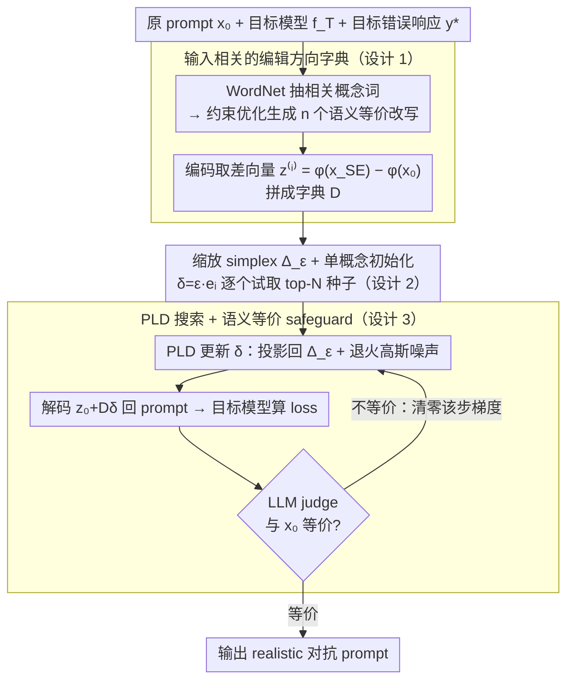

# REALISTA: Realistic Latent Adversarial Attacks that Elicit LLM Hallucinations

**会议**: ICML 2026  
**arXiv**: [2605.12813](https://arxiv.org/abs/2605.12813)  
**代码**: https://github.com/Buyun-Liang/REALISTA  
**领域**: 幻觉检测  
**关键词**: 幻觉诱导, latent space attack, 语义保持, simplex 约束, 概念编辑

## 一句话总结
REALISTA 在 LLM 隐空间里构造"输入相关的编辑方向字典"，把对抗 prompt 优化变成一个 simplex 约束下的连续问题，既保住了 SECA 这类离散方法的语义等价/连贯，又有 LARGO 那种连续方法的搜索灵活度，首次在 GPT-5 这类闭源推理模型 free-form 输出上诱发幻觉成功。

## 研究背景与动机

**领域现状**：LLM 哪怕在 benign user query 上也会幻觉。论文给的典型例子：模型能算对"Simplify $(2+5)^2-42$" 等于 7，但同义的"Compute the result after squaring the sum of 2 and 5, then subtracting 42"就答成 16。要系统地暴露这种失败，需要"realistic adversarial attack"——能诱发幻觉、又看起来像真实用户写的 prompt。

**现有痛点**：现有攻击二分天下，都缺一块。一类是离散 prompt 攻击（SECA 等），靠 LLM rephrase 候选 prompt 后挑表现最差的，能严格保证语义等价 + 连贯，但搜索空间被 rephrase 模型采样的有限候选锁死，多样性低；另一类是连续 latent attack（LARGO、Sheshadri 等），直接在 LLM hidden state 上加任意扰动，搜索空间够大但解码回 prompt 后语义往往跑偏——LARGO 实测 SEE（语义等价错误率）接近 100%。还有些用 fictional story 改 prompt 数字（"$-42$" 改 "$-33$"）诱出 16 的，那根本不是对原 prompt 的幻觉，只是改了题。

**核心矛盾**：搜索灵活度 vs 语义真实性。离散方法保住了真实性但搜索受限，连续方法搜索强但容易跑出"幻觉但不是同一个题"的虚假成功。

**本文目标**：在 LLM latent space 里搜，但把搜索限定在"语义等价"的子空间——具体说，限定在一组"interpretable editing direction"的线性组合上，每个方向都对应原 prompt 的一种语义等价 rephrase。

**切入角度**：Park / Zou 等的工作发现 LLM latent space 中高层语义概念近似线性可加。如果我能为每个原 prompt $x_0$ 准备一个"input-dependent dictionary"，每列是某种"同义改写"对应的方向 $z^{(i)} = \phi(x_{\text{SE}}^{(i)}) - \phi(x_0)$，那么对编辑系数 $\delta$ 做连续优化就既灵活又安全。

**核心 idea**：用"编辑方向字典 + 缩放 simplex 约束 + LLM 自身做 encoder/decoder"把幻觉诱导问题写成 $\min_\delta \mathcal{L}_{\text{hall}}(f_T(\psi(z_0 + D\delta)), y^*)$ s.t. $\delta \in \Delta_\varepsilon$。

## 方法详解

### 整体框架

REALISTA 要解决的是：怎么在 LLM 隐空间里自由搜索能诱发幻觉的对抗 prompt，却又保证搜出来的 prompt 始终和原 prompt 语义等价。它的做法是分两阶段。给定原 prompt $x_0$、目标模型 $f_T$、想诱出的错误响应 $y^*$，先为 $x_0$ 现场构一本"编辑方向字典"：用 WordNet + 概念优化生成 $n$ 个语义等价改写 $x_{\text{SE}}^{(i)}$，编码到 latent 后取差向量 $z^{(i)} = \phi(x_{\text{SE}}^{(i)}) - \phi(x_0)$ 拼成 $D^{(z_0)} \in \mathbb{R}^{L \times d \times n}$；然后在缩放 simplex $\Delta_\varepsilon$ 上优化系数 $\delta$，每步把 $z_0 + D\delta$ 用 LLM decoder $\psi$ 解码回 prompt、喂给目标模型算 loss、再用 LLM judge 验语义等价。这样"搜索"只发生在字典张成的语义等价子空间里，输出天然 realistic。

### 关键设计

**1. 输入相关的编辑方向字典：把搜索域 hard 约束到"语义等价子空间"**

LARGO 那类连续攻击的硬伤是直接在任意 latent direction 上扰动，没人保证扰动后还落在"能解码成有效 prompt"的区域，所以它解出来的东西 SEE 接近 100%（语义全跑偏了）。REALISTA 的对策是不让 $\delta$ 自由乱走，而是先为每个 $x_0$ 现构一组语义等价方向当基底。具体地，从 WordNet 抽出和 $x_0$ 相关的概念词，跑一个 constrained concept optimization（附录公式 12）让这些方向彼此正交化、与 $x_0$ 距离适中、且解码回去的 rephrase 真实有效；最后取 $z^{(i)} = c^{(i)} - z_0$ 当列拼成字典 $D^{(z_0)}$。一旦搜索被限制在 $z_0 + D\delta$ 上，几何上就自动停在 valid prompt manifold 附近——这正是 REALISTA 区别于 LARGO 的核心：语义约束不再是事后过滤，而是写进了搜索空间的参数化里。字典之所以要 input-dependent 而非用一组通用方向（如表示工程里的 happy/honesty 方向），是因为同一个抽象操作（如"反转"）在不同 prompt 上的具体 latent 实现差异巨大，通用方向套不准。

**2. 缩放 simplex 约束 + 单概念初始化：让每次攻击只动少数几个概念**

光有字典还不够，$\delta$ 若同时把所有概念方向都拉满，叠加起来照样会把语义搅崩。于是把 $\delta$ 限制在缩放 simplex $\Delta_\varepsilon = \{\delta \succeq 0 : \|\delta\|_1 \leq \varepsilon\}$ 上：用 $\ell_1$ norm 是因为它既能 bound 住各分量幅度、又天然是 sparsity proxy，逼着解只激活少数概念；强制非负是因为负方向经验上没有清晰语义、容易解码出 gibberish。经验规律是 $\delta$ 越小、激活概念越少，解码 prompt 就越贴近原语义，所以 simplex 等于把"语义等价"这件事几何化成了一个可优化的约束。又因为目标 $\mathcal{L}_\mathcal{T}$ 非凸、从 $\delta=0$ 起步常陷局部最优，初始化时为每个概念 $i$ 单独跑一遍 $\delta = \varepsilon \cdot e_i$ 解码，按 loss 取 top-$N$ 当种子点——把"只动一个概念"的 $n$ 个起点都试一遍，大幅提高找到好解的概率。表 3 印证了这套约束确实奏效：开源 LLM 上平均只激活 1-2 个概念，闭源推理模型上甚至 < 1 个。

**3. Projected Langevin Dynamics + 语义等价 safeguard：在平台状曲面上跳着搜，并守住等价底线**

decoder 是离散的——多个相邻的 $z$ 常解码出同一个 prompt $x$，导致优化曲面 piece-wise flat（大片区域梯度为 0），普通 PGD 步长根本没法调：太小卡在平台、太大直接跳飞。REALISTA 改用带噪的投影 Langevin 更新 $\delta_{k+1} \leftarrow \text{Proj}_{\Delta_\varepsilon}[\delta_k - \eta \tilde{\nabla}_\delta \mathcal{L}_\mathcal{T} + \sqrt{2\eta T}\,\xi_k]$，其中退火温度 $T = T_0 \cdot \gamma^k$、噪声 $\xi_k \sim \mathcal{N}(0, I)$；梯度因为 decode 离散而通过 Gumbel-Softmax 重参数化拿到。注入的高斯噪声让算法能从一块平台跳到下一个 region，退火则让后期逐渐收敛。最后一道闸是 safeguard：每步解码出 $x$ 后用 LLM judge 检查是否仍与 $x_0$ 等价，一旦判为不等价就把该步梯度信号清零、不许顺着这个方向继续走。这道 check 正是"REALISTic"名字的由来——硬保证最终交付的对抗 prompt 一定通过语义等价验证。

### 损失函数 / 训练策略

两种攻击 objective 对应两种部署场景。open-ended MCQA 下用 $\mathcal{L}_\mathcal{T}(\cdot) = -\log P_T(y^* \mid \cdot)$，$y^*$ 是错误选项的 token；free-form response 下改用 $\mathcal{L}_\mathcal{T}(\cdot) = -J(R_T(\cdot))$，$J$ 是一个 LLM-based 幻觉评分器。后者专为 GPT-5 这种既拿不到 logit、又不输出固定格式的闭源推理模型设计——此时梯度无法从目标模型直接回传，于是从开源 surrogate model 借梯度（gradient transfer），实验证明这种 transfer 居然真的有效。

## 实验关键数据

### 主实验

数据集 347 题 MMLU 子集（16 个 subject），ASR@30 = 30 次独立试一次能成功的比例。

| Target LLM | Raw | SECA | LARGO | ICD | **REALISTA** |
|------------|-----|------|-------|-----|--------------|
| Llama-3-3B ASR↑ | 45.48 | 79.61 | 84.71 | 90.77 | **97.11** |
| Llama-3-3B SEE↓ | 0.00 | 0.87 | 97.42 | 100.00 | 0.86 |
| Llama-3-8B ASR↑ | 54.40 | 82.97 | 57.92 | 87.32 | **93.60** |
| Llama-3-8B SEE↓ | 0.00 | 2.59 | 96.45 | 100.00 | 3.48 |
| Qwen-2.5-7B ASR↑ | 6.40 | 32.47 | 23.89 | 11.50 | **41.61** |

LARGO / ICD 的 ASR 看上去高，但 SEE 接近 100%（=完全改了语义，不算 realistic 攻击）。REALISTA 是唯一同时拿到高 ASR 和低 SEE 的方法，比 SECA 在 Llama-3 上高 10~20%。

| Reasoning LLM (free-form) | Raw | ICD | **REALISTA** | SECA/LARGO |
|---------------------------|-----|-----|--------------|------------|
| GPT-5-Nano ASR↑ | 4.02 | 6.32 | **23.61** | 不适用 |
| GPT-5-Mini ASR↑ | 2.01 | 2.57 | **20.72** | 不适用 |
| GPT-5-Mini SEE↓ | 1.58 | 100.00 | 0.72 | – |

SECA 和 LARGO 在 GPT-5 上根本跑不起来（一个需要 token-level logit + 固定格式，另一个需要 target 的 latent），REALISTA 通过 open-source surrogate 拿梯度成功 transfer。

### 消融实验

| 配置 | 关键发现 |
|------|----------|
| Top-20 active concepts | counterfactual / inverted / opposite 等"极性反转"类最常被激活；conditional / disjunctive 等"逻辑结构修改"类次之；imperative / elaborate 等"指令性 framing"也常见 |
| Active concepts per attack | 开源 LLM 上 1-2 个，闭源 reasoning model 上 < 1（很多攻击只用 0 个概念=维持原 prompt 也算成功） |
| 人工评估（100 样本） | REALISTA 的 SEE 在两个人类标注员处 ≈ 5%，和 LLM judge（5.27%）一致；LARGO 接近 100%，SECA 也是 5-11% |

### 关键发现
- 成功的"现实攻击"主要通过改 framing 和 logical structure 起作用，而不是改 factual content——这给 LLM defense 指了方向：要 robust 到 paraphrase 攻击就得 robust 到这些结构变换
- 攻击成功模式：极性反转最常出现，因为它保住了 entity 和 correctness criteria 但悄悄反转了 framing；逻辑结构修改（加 conditional / 加 disjunctive）通过扩大推理空间制造歧义
- gradient transfer 在 GPT-5 上居然有效，说明开源 surrogate 的 score landscape 和闭源 reasoning model 有相当大重叠
- 收敛性：开源 LLM 上约 100 步收敛，闭源 reasoning model 需要更多步因为 free-form 输出空间更大

## 亮点与洞察
- **"几何上把语义等价约束硬塞进搜索空间"**——之前的 latent attack 都把语义检查当 post-hoc filter（生成完再过滤），REALISTA 通过 dictionary parameterization 让"任意可行 $\delta$ 都对应语义等价 prompt"成为先验，效率高很多。这个思路可以迁移到 jailbreak、controllable generation 等任何"想在 latent 探索但要保某种约束"的问题
- **input-dependent dictionary** 比 input-agnostic 的 universal direction（如 representation engineering 的 happy/honesty 方向）更适合 attack 场景，因为同一个抽象方向（如"反转"）在不同 prompt 上的具体 latent 实现差异巨大
- **PLD 处理 piece-wise flat landscape** 是个工程小亮点——decoder 的离散性让梯度很多时候是 0，纯 PGD 会停滞，注入退火高斯噪声能跳出
- 把开源 surrogate 的梯度 transfer 到闭源推理模型，证明红队工具未来不需要"获得 target 内部"，对部署模型的安全评估有重要含义

## 局限与展望
- 字典构造依赖 WordNet + LLM 协作，对非英语 / 专业领域 prompt 的覆盖度未验证
- ASR@30 是 best-of-30，意味着真实部署里需要跑 30 次才有这个成功率，单次成功率没这么高
- 在 Qwen-2.5-14B 上 REALISTA 比 SECA 稍弱（27.24 vs 27.51），说明大模型对这种 paraphrase-based 攻击有一定鲁棒性
- simplex + 线性组合假设太强，作者自己也说未来要探索更丰富的非凸约束（类似 vision 里的 perceptual constraint）来表达更复杂的语义变换
- 成功攻击的 SEE 不是 0 而是 1-3%，说明 LLM judge 检查不完美，部分"通过 check"的 prompt 在人类看可能还是不太等价
- 评估指标 SEE / SCE 本身依赖 LLM judge，存在 self-bias 风险

## 相关工作与启发
- **vs SECA (Liang 2025b)**：都强制语义等价 + 连贯，但 SECA 只能在离散 LLM rephrase 候选中选，搜索狭窄；REALISTA 在连续 simplex 上跑，ASR 高 10-20% 且能 attack reasoning model
- **vs LARGO (Li 2025a)**：都在 latent 上做连续优化并 invert 回 prompt 空间，但 LARGO 没语义等价约束所以 SEE 接近 100%；REALISTA 的 dictionary 是关键差异
- **vs ICD (Zhang 2024)**：ICD 用 template-based 攻击直接 prompt 模型"hallucinate"，本质改了题，REALISTA 真正测试模型在等价 prompt 上的不一致性
- **vs Zou 2025 等 representation engineering**：都用 latent concept 线性组合，但 RE 主要做 alignment / safety steering，REALISTA 反过来做 attack；说明同一套工具正反两用

## 评分
- 新颖性: ⭐⭐⭐⭐ "把语义约束变成几何子空间"思路很 clean，但单个组件（latent linear concept、PLD、Gumbel reparam）都不算全新
- 实验充分度: ⭐⭐⭐⭐⭐ 4 个开源 + 2 个闭源 LLM、5 个 baseline、ASR@K 多个 K、人工评估、收敛分析、概念可视化都有
- 写作质量: ⭐⭐⭐⭐⭐ 公式与图示对照清晰，motivating example (2+5)² 一以贯之，算法 1 + Figure 2 把整个流程讲明白了
- 价值: ⭐⭐⭐⭐ 给红队提供了一个真正 realistic 的攻击工具，且能 transfer 到闭源模型，对 LLM safety 评估很有意义

<!-- RELATED:START -->

## 相关论文

- [\[NeurIPS 2025\] SECA: Semantically Equivalent and Coherent Attacks for Eliciting LLM Hallucinations](../../NeurIPS2025/hallucination/seca_semantically_equivalent_and_coherent_attacks_for_eliciting_llm_hallucinatio.md)
- [\[ICML 2026\] Revis: Sparse Latent Steering to Mitigate Object Hallucination in Large Vision-Language Models](revis_sparse_latent_steering_to_mitigate_object_hallucination_in_large_vision-la.md)
- [\[ICML 2026\] When Hallucination Costs Millions: Benchmarking AI Agents in High-Stakes Adversarial Financial Markets (CAIA)](when_hallucination_costs_millions_benchmarking_ai_agents_in_high-stakes_adversar.md)
- [\[ACL 2026\] Dialectic-Med: Mitigating Diagnostic Hallucinations via Counterfactual Adversarial Multi-Agent Debate](../../ACL2026/hallucination/dialectic-med_mitigating_diagnostic_hallucinations_via_counterfactual_adversaria.md)
- [\[ACL 2026\] 为什么 LLM 在结构化知识上产生幻觉：推理过程的机制分析](../../ACL2026/hallucination/why_llms_hallucinate_on_structured_knowledge_a_mechanistic_analysis_of_reasoning.md)

<!-- RELATED:END -->
