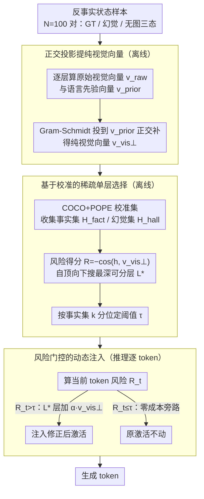

# Revis: Sparse Latent Steering to Mitigate Object Hallucination in Large Vision-Language Models

**会议**: ICML 2026  
**arXiv**: [2602.11824](https://arxiv.org/abs/2602.11824)  
**代码**: https://github.com/antgroup/Revis (有)  
**领域**: 幻觉检测  
**关键词**: 物体幻觉、潜空间引导、正交投影、稀疏干预、机制可解释

## 一句话总结
本文把 LVLM 幻觉重新定义为"被语言先验压制的视觉信息缺失"，用正交投影从原始视觉方向中剔除语言先验得到"纯视觉向量"，再用风险门控只在最优深度的单层做稀疏干预，免训练地把 CHAIRS 幻觉率降 ~19% 同时保住 MM-Vet 通用能力。

## 研究背景与动机
**领域现状**：LVLM 已经具备强多模态推理能力，但持续暴露的可靠性问题是"物体幻觉"——模型说出看似合理却图中并不存在的细节；现有缓解手段集中在训练时对齐（LLaVA-RLHF、HA-DPO、OPA-DPO）和推理时干预（对比解码 VCD/M3ID、logit 校正 AGLA/ONLY、激活引导 VTI）。

**现有痛点**：训练对齐重，依赖大规模偏好数据；对比解码至少要双倍前向才能压幻觉；logit 校正用启发式探针，鲁棒性差；唯一不重训也不双倍前向的 VTI 直接在所有层注入静态偏移，能把 CHAIRS 从 14% 降到 9%，但 MM-Vet 也从 70.18 跌到 56.38，几乎把通用推理打废。

**核心矛盾**：现有干预方向其实是"事实-幻觉"差分向量，看似指向视觉信息，实际还混入了"语言先验"（模型在没图时倾向于胡猜的方向）；只要把这种纠缠向量按强度 $\alpha$ 放大，就会同时放大语言先验，使模型在 $\alpha\approx0.7$ 时直接 collapse 成重复或空输出。

**本文目标**：在不重训、不双倍前向的前提下，找到一种"只激活视觉、不放大先验"的干预方式，并精确选择干预深度，让幻觉降低不再以通用能力为代价。

**切入角度**：作者用 5 类反事实状态（GT / 幻觉 / 无图GT / 无图幻觉 / 无图拒答）的 $[\text{EOS}]$ 隐藏状态来分析潜空间几何——深层确实可线性分离事实 vs 幻觉，但原始 $\mathbf{v}_{\text{raw}} = \mathbf{h}_{\text{gt}} - \mathbf{h}_{\emptyset\_\text{gt}}$ 与"语言先验向量" $\mathbf{v}_{\text{prior}} = \mathbf{h}_{\emptyset\_\text{hall}} - \mathbf{h}_{\emptyset\_\text{unk}}$ 在深层 cosine 相似度高，确认了纠缠是 VTI 崩盘的根因。

**核心 idea**：用 Gram-Schmidt 把 $\mathbf{v}_{\text{raw}}$ 投到 $\mathbf{v}_{\text{prior}}$ 的正交补，得到"纯视觉向量" $\mathbf{v}_{\text{vis}}^\perp$，再用基于校准集的逐层风险评分挑出最深可分离层 $L^\*$，并在推理时仅当"幻觉风险得分超阈值"时才注入修正——把干预做成"稀疏 + 单层 + 正交"的外科手术。

## 方法详解

### 整体框架
三阶段无训练 pipeline：阶段 1，用 $N=100$ 对样本算每层 $\mathbf{v}_{\text{raw}}^{(\ell)}$ 与 $\mathbf{v}_{\text{prior}}^{(\ell)}$，Gram-Schmidt 得 $\mathbf{v}_{\text{vis}}^{\perp(\ell)}$；阶段 2，在 COCO 100 张图上构造 POPE 式问答收集事实/幻觉隐状态集合，按风险得分 $R(\mathbf{h}) = -\cos(\mathbf{h}, \mathbf{v}_{\text{vis}}^{\perp(\ell)})$ 自顶向下搜索最深满足 $R(\mathcal{H}_{\text{hall}}) > R(\mathcal{H}_{\text{fact}})$ 的层 $L^\*$，并按事实集合的 $k$ 分位定阈值 $\tau$；阶段 3，推理每个 token 计算 $R_t$，若 $R_t>\tau$ 则在 $L^\*$ 层加 $\alpha\,\mathbf{v}_{\text{vis}}^{\perp(L^\*)}$，否则保持原激活。前两阶段离线一次性完成、把"往哪个方向修、在哪一层修"算好，第三阶段推理时才逐 token 决定"这一步要不要修"，三个阶段恰好对应下面三个关键设计。

### 关键设计

**1. 正交投影提纯视觉向量：从原始视觉方向里剔掉语言先验，得到一个「放大也不崩」的引导方向**

VTI 之所以一加强度就把通用能力打废，根因是它用的「事实-幻觉差分向量」里其实混着语言先验——模型没图时倾向胡猜的方向；强度 $\alpha$ 一放大，视觉和先验被一起放大，$\alpha\approx0.7$ 时模型就 collapse 成重复或空输出。Revis 的解法是把这两股力量在算子层面解耦：先按反事实状态定义原始视觉向量 $\mathbf{v}_{\text{raw}}^{(\ell)}=\mathbb{E}[\mathbf{h}_{\text{gt}}^{(\ell)}-\mathbf{h}_{\emptyset\_\text{gt}}^{(\ell)}]$ 和语言先验向量 $\mathbf{v}_{\text{prior}}^{(\ell)}=\mathbb{E}[\mathbf{h}_{\emptyset\_\text{hall}}^{(\ell)}-\mathbf{h}_{\emptyset\_\text{unk}}^{(\ell)}]$，再做 Gram-Schmidt 把前者投到后者的正交补：

$$\mathbf{v}_{\text{vis}}^{\perp(\ell)}=\mathbf{v}_{\text{raw}}^{(\ell)}-\frac{\mathbf{v}_{\text{raw}}^{(\ell)}\cdot\mathbf{v}_{\text{prior}}^{(\ell)}}{\|\mathbf{v}_{\text{prior}}^{(\ell)}\|^2}\mathbf{v}_{\text{prior}}^{(\ell)}$$

因果探针实验证明，这个纯视觉向量即便把 $\alpha$ 推到极大也保持生成稳定——正交化等于把「加视觉」和「加先验」彻底分开，于是激进强化视觉也不会触发崩溃。

**2. 基于校准的稀疏单层选择：只在一层动手，挑「最深 + 仍可分」的外科切入点**

t-SNE 分析显示事实和幻觉状态在浅层是混叠的、到深层才线性可分，所以干预层选错了等于白干，而全层注入又会累积偏差、拖垮通用能力。Revis 用一个校准集 $\mathcal{D}_{\text{cal}}$（COCO + POPE 式存在性问题）抽出每层的事实集 $\mathcal{H}_{\text{fact}}$ 和幻觉集 $\mathcal{H}_{\text{hall}}$，定义风险 $R(\mathbf{h})=-\cos(\mathbf{h},\mathbf{v}_{\text{vis}}^{\perp(\ell)})$，从最深层 $L$ 反向往 $1$ 搜，取首个满足 $R(\mathcal{H}_{\text{hall}})-R(\mathcal{H}_{\text{fact}})>0$ 的层作为 $L^\*$，再在该层事实集合上按 $k$ 分位定阈值 $\tau$。反向搜索保证选到的是「还能分清事实与幻觉的最深一层」，既有足够的几何可分性、又只动一层、零算力浪费。

**3. 风险门控的动态注入：只在模型「确实开始漂」时才修，平时是零成本旁路**

以往激活引导默认全程注入，连本来就对的 token 也一起污染。Revis 给注入加了个门：每步生成时算当前 token 的风险 $R_t=R(\mathbf{h}_t^{(L^\*)})$，得 $\lambda(t)=\alpha\cdot\mathbb{1}(R_t>\tau)$，只有风险超阈值才执行 $\tilde{\mathbf{h}}_t^{(L^\*)}=\mathbf{h}_t^{(L^\*)}+\lambda(t)\,\mathbf{v}_{\text{vis}}^{\perp(L^\*)}$，其余 token 原样不动。这样大部分时间 Revis 都是「零成本旁路」，只在少量高风险时刻加一次激活向量，计算几乎不增；门控思路和 mixture-of-experts 类似，但用在 hidden state 干预上，把「修幻觉」做成了潜空间里的稀疏外科手术。

### 损失函数 / 训练策略
完全免训练；唯二超参 $\alpha$（注入强度）与 $k$（事实分位阈值）按模型设置，主结果中 Qwen2.5-VL-7B 用 $\alpha=1.6,k=0.8$。

## 实验关键数据

### 主实验

| 数据集 | 指标 | 基线最佳 | Revis | 备注 |
|--------|------|----------|-------|------|
| POPE Random | F1 ↑ | 88.61 (VCD) | 91.43 | +2.82 |
| POPE Adversarial | F1 ↑ | 86.19 (VCD) | 87.63 | +1.44 |
| CHAIR | $C_S$ ↓ | 29.00 (AGLA) | 25.00 | 相对降低 ~14% |
| MME 总分 | ↑ | 2328.59 (AGLA) | 2345.30 | 同时通用能力小幅提升 |
| MM-Vet 总分 | ↑ | 70.18 (Regular) | 72.16 | VTI 56.38，本文 +1.98 |

### 消融实验

| 配置 | CHAIRS ↓ | MM-Vet ↑ | 说明 |
|------|---------|---------|------|
| Regular | 14.00 (max=64) | 70.18 | 原始解码 |
| VTI（纠缠向量+全层） | 9.00 | 56.38 | 幻觉降但通用能力崩 |
| $\mathbf{v}_{\text{raw}}$ 直接注入 | 在 $\alpha<0.4$ 时好于 VTI | $\alpha\approx 0.7$ 模型崩溃 | 验证纠缠是崩盘根因 |
| 正交向量 $\mathbf{v}_{\text{vis}}^\perp$ | 高 $\alpha$ 仍稳定 | MM-Vet 不掉 | 正交化 = 必要条件 |
| Revis 完整（正交+单层+门控） | 25.00 (max=512) | 72.16 | 最终方法 |

### 关键发现
- 把"事实 vs 幻觉差分向量"分解后发现，幻觉的真正根因是"语言先验"在深层挤压视觉信息；只要剔除语言先验分量，再激进的视觉强化也不会触发模型崩溃。
- 干预层不需多——单层 + 风险门控就足以击败全层注入的 VTI 和需要双倍前向的 VCD/M3ID。
- 七个不同 VLM 主干（Qwen2.5-VL 7B/32B、Qwen3-VL-8B、LLaVA-1.5、LLaVA-NeXT、InternVL3、InternVL3.5）上结论一致，说明"语言先验纠缠"是 LVLM 范式的通病而非个例。

## 亮点与洞察
- 用反事实状态空间（GT/幻觉/无图三态）显式定义"语言先验向量"，再用 Gram-Schmidt 把它剔除，是把机制可解释工具直接落到工程优化的漂亮范式。
- "单层 + 风险门控"思路与 mixture-of-experts 中的门控类似，但用在 hidden state 干预上几乎是零开销；这种"潜空间稀疏外科手术"框架可迁移到其他对齐/安全干预场景（如毒性、偏见）。
- 实验中观察到极端 $\alpha$ 下模型会输出 "image.jpg" 这类视觉占位符，提示纯视觉方向真的把模型推向"以图为主"的极端，是一个非常有说服力的因果证据。

## 局限与展望
- 干预层数被强行限制为 1，可能错过需要多层协同修正的复杂幻觉；未来可尝试稀疏多层选择。
- 校准集只有 100 张 COCO 图，跨域（医学、卫星、文档）泛化时阈值是否仍稳健需要验证。
- 风险门控用余弦相似度作为风险指标，未利用图像内容的细粒度信号；与对象级置信度结合可能进一步降低 false positive。

## 相关工作与启发
- **vs VCD/M3ID**：它们在 logit 层做对比解码，必须双倍前向；Revis 在 hidden 层做正交注入，几乎零额外开销。
- **vs AGLA/ONLY**：依赖启发式探针或辅助检测，超参敏感；Revis 用几何 + 风险得分原则化选层选阈值。
- **vs VTI**：同属潜空间引导，但 VTI 用纠缠向量 + 全层注入导致通用能力崩盘；Revis 通过"正交 + 稀疏"两板斧把幻觉和通用能力一起改善。
- **vs RLHF / DPO 对齐**：训练昂贵且依赖偏好数据；Revis 完全推理时介入，部署成本极低。

## 评分
- 新颖性: ⭐⭐⭐⭐⭐ "反事实状态 + 正交化 + 风险门控"组合首次把潜空间引导推到通用能力不掉的水平
- 实验充分度: ⭐⭐⭐⭐ 五数据集 × 七主干 × 多基线对照 + 因果探针，缺一些跨域评测
- 写作质量: ⭐⭐⭐⭐⭐ 从机制分析到方法到实验逻辑非常严密，图表配合到位
- 价值: ⭐⭐⭐⭐ 零训练、零额外前向、可即插即用，对 LVLM 上线场景非常实用

<!-- RELATED:START -->

## 相关论文

- [\[ICML 2026\] Adaptive Residual-Update Steering for Low-Overhead Hallucination Mitigation in Large Vision Language Models](adaptive_residual-update_steering_for_low-overhead_hallucination_mitigation_in_l.md)
- [\[CVPR 2026\] First Logit Boosting: Visual Grounding Method to Mitigate Object Hallucination in Large Vision-Language Models](../../CVPR2026/hallucination/first_logit_boosting_visual_grounding_method_to_mitigate_object_hallucination_in.md)
- [\[ICLR 2026\] Dynamic Multimodal Activation Steering for Hallucination Mitigation in Large Vision-Language Models](../../ICLR2026/hallucination/dynamic_multimodal_activation_steering_for_hallucination_mitigation_in_large_vis.md)
- [\[CVPR 2026\] VES-RFT: Rewarding Visual Evidence Sensitivity to Mitigate Hallucinations in Large Vision-Language Models](../../CVPR2026/hallucination/ves-rft_rewarding_visual_evidence_sensitivity_to_mitigate_hallucinations_in_larg.md)
- [\[ACL 2025\] Retrieval Visual Contrastive Decoding to Mitigate Object Hallucinations in Large Vision-Language Models](../../ACL2025/hallucination/retrieval_visual_contrastive_decoding_to_mitigate_object_hallucinations_in_large.md)

<!-- RELATED:END -->
