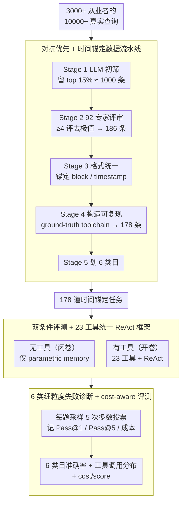

# When Hallucination Costs Millions: Benchmarking AI Agents in High-Stakes Adversarial Financial Markets (CAIA)

**会议**: ICML 2026  
**arXiv**: [2510.00332](https://arxiv.org/abs/2510.00332)  
**代码**: https://github.com/SurfAI/CAIA (有，含 Leaderboard 与 HuggingFace 数据集)  
**领域**: 幻觉检测  
**关键词**: 对抗性评测、加密货币、tool selection、Pass@k 陷阱、时间锚定基准

## 一句话总结
CAIA 用 17 个前沿大模型在 178 个时间锚定的加密货币真实任务上构建首个"对抗性高风险"agent 基准，发现：无工具时所有模型只有 12–28% 准确率（接近随机猜测），有工具时最强 GPT-5 也只到 67.4% vs. 人类入门分析师 80%；更致命的是模型 55.5% 的工具调用偏向"不可靠的网页搜索"而绕过权威链上数据，导致 Pass@k 指标系统性掩盖了"靠试错碰运气"的危险行为。

## 研究背景与动机

**领域现状**：过去一年大模型在 ICPC、IMO 等高难度封闭式 benchmark 上接连刷新纪录，让"自主部署 AI agent"显得万事俱备。但现有 benchmark（SWE-Bench、AppWorld、TheAgentCompany 等）几乎都假设"工具可用、信息可信、其他 agent 合作"，测量的是 *competence*（能力上限）而不是 *resilience*（在敌对环境下的生存能力）。

**现有痛点**：金融、治理、关键基础设施这些 agent 真正要去的领域满是主动欺骗、虚假信息、不可逆操作；一个能在 IMO 拿金牌的 agent 仍可能轻信钓鱼链接、买入被攻陷的资产。已有评测从来没有专门为"在被攻击者包围的环境里活下来"设计过；同时 Pass@k 这类成熟指标默认"多试几次就行"，但在高风险场景中第一次错就可能造成数百万美元不可逆损失。

**核心矛盾**：(1) 训练数据来自整齐的 Web2，部署环境却是充满恶意诱导的 Web3/真实金融市场；(2) benchmark 越来越难，但难度增加不等于鲁棒性增加；(3) Pass@5 等指标在受控任务里看是"探索胜利"，在不可逆决策里却是"瞎试碰对"。

**本文目标**：构造一个能直接量化 agent 在对抗+高风险+多源数据混杂条件下表现的 benchmark；并刻画当前 SOTA 模型的具体失败模式（特别是 tool selection 行为），把"对抗鲁棒性"提升为可衡量的、必须 pass 的部署前提。

**切入角度**：作者敏锐地把加密货币选作"天然实验室"——它同时具备(i) 攻击者活跃（蜜罐合约、闪贷、coordinated 社交工程）、(ii) 高风险（2024 全年 \$30B 损失，链上交易不可逆）、(iii) 可验证地面真相（区块链全透明且不可篡改）三个性质，是其他金融场景做不到的对抗评测的"三合一"。

**核心 idea**：用"对抗优先 + 真实金融损失 + 时间锚定 + 细粒度失败诊断"四位一体的设计，把 agent benchmark 从"能否完成"升级到"能否在主动敌对下安全完成"。

## 方法详解

### 整体框架
CAIA 想把 agent 评测从"能否完成任务"升级到"能否在主动敌对环境下安全完成"，为此它把加密货币选作天然对抗实验室，构造了 178 道时间锚定的真实分析任务。整条 pipeline 是：先从 3000+ 真实从业者的 10000+ 真实查询里，经 5 阶段流水线萃取出既真实、可验证、又抗训练数据污染的高质量题目；再让每个模型在"无工具（闭卷）"和"有工具（开卷，23 个专业工具 + 统一 ReAct 框架）"两种条件下各跑一遍，每题独立采样 5 次取多数投票，并同时报告 Pass@1/Pass@5、token 消耗与美元成本；最后把准确率拆成 6 个分析类目 + 工具调用分布 + cost/score，做部署级的细粒度失败诊断。

### 关键设计

**1. 5 阶段对抗优先 + 时间锚定数据流水线：让 ground truth 客观、可复现且抗污染**

传统静态 benchmark 的两个老毛病是容易被训练数据污染（contamination）、以及评测时出现"看着对但其实跑不出来"的题，CAIA 用一条 5 阶段流水线把这两点一起解决。Stage 1 用 LLM-as-judge 按主题相关性、答案是否存在、是否可锚定温度做初筛，从 1 万条查询里保留 top 15%（约 1000 条）；Stage 2 把这些题分配给 92 名领域专家，每题至少 4 评、去掉最高最低后取平均，挑出 top 200，去重后剩 186 条 prototype；Stage 3 统一改写格式，强制把每道题锚定到具体 block number 或 timestamp，使答案完全可复现；Stage 4 为每题构造"可复现 ground-truth toolchain"——不仅给标准答案，还给出到达该答案的工具调用链，凡是无法复现的整道剔除，最终落到 178 条；Stage 5 把题目划进 On-Chain Analysis (43.3%)、Project Discovery (27.5%)、Tokenomics (12.9%)、Overlap (7.9%)、Trend Analysis (4.5%)、General Knowledge (3.9%) 6 个类目，方便后面做分领域诊断。这套设计之所以有效，是因为区块链的不可篡改性让 ground truth 真正客观，而 block height/timestamp 锚定让答案唯一且可复现，从而绕开了传统金融 benchmark 必须在"专有数据"和"合成模拟"之间二选一的两难。

**2. 双条件评测 + 23 工具统一 ReAct 框架：把"模型知识"和"工具编排"解耦**

以前的 agent 评测常把工具能力、模型推理、prompt 工程混在一起，看不出真正的瓶颈在哪，CAIA 用两种条件把这两个能力维度拆开。无工具条件相当于闭卷考，强迫模型只用 parametric memory 答题，测的是基础理解；有工具条件相当于开卷考，提供 23 个工具（Etherscan / CoinGecko / DefiLlama 等链上分析平台、市场数据 API、web search、Python interpreter 等）。关键的工程约束是：作者特意保证"正确答案总能通过某个合适工具拿到"，于是挑战被完全定位到 *tool selection + synthesis*——失败不再可能归咎于"信息找不到"，只能归因到"没选对工具源"。所有有工具实验都跑在统一的 ReAct-style 框架里（标准 dispatch、result parsing、iterative reasoning），消除不同实现带来的差异，让模型之间真正可比。

**3. 6 类细粒度失败诊断 + cost-aware 评测：把单一准确率拆开，揭穿"试错碰运气"**

单一 accuracy 是一份"宽度为 0"的报告，既看不到"为什么错"也看不到"错的代价"，CAIA 因此把评测做成多维诊断。主指标用 5 轮多数投票，缓解大模型的采样方差；同时报告 Pass@1 和 Pass@5，并明确指出 Pass@k 在高风险场景里是"危险指标"——有工具版 DeepSeek R1 的 Pass@1 只有 26.4% 但 Pass@5 暴涨到 54.5%，说明它本质上是靠多次随机尝试碰对，而在不可逆决策里第一次错就 game over。每题还记录 token 消耗与美元成本，算出 cost/score，结果显示成本与准确率并不正相关（GPT-OSS 120B 性能逼近前沿，成本却比某些闭源模型低约 100 倍）。失败模式分析进一步发现：55.5% 的工具调用偏向不可靠的 web search，即便专门的链上 API 能直接给出真值，模型仍倾向被 SEO 优化的虚假信息和社交平台 manipulation 误导。把行为分布（工具选择偏好）、稳定性（多数投票 vs 单跑）、经济性（cost/score）合并起来看，才能给出 high-stakes 场景真正需要的部署级判断。

### 损失函数 / 训练策略
CAIA 是 benchmark 不是训练方法，不涉及损失函数。评测协议为：每题独立运行 5 次取 majority vote；human baseline 由 16 名来自大学区块链俱乐部和早期创业公司的初级分析师在分层 10% 子集上完成，平均准确率 80%。

## 实验关键数据

### 主实验
17 个模型（GPT-4.1/4o/5/o3/OSS-120B、Claude Sonnet/Opus 4/4.1、Gemini 2.5 Flash/Pro、Grok 4/Fast、DeepSeek R1/V3.1、Kimi K2、Llama 4 Maverick、Qwen 3 235B）双条件评测：

| 模型 | 无工具 多数投票 | 有工具 多数投票 | 有工具 Pass@5 | 有工具 成本 ($) |
|---|---|---|---|---|
| **GPT-5** | **0.275** | **0.674** | 81.5 (≈) | 0.021 |
| Claude Opus 4 | 0.135 | 0.573 | 71.9 | 1.114 |
| Claude Opus 4.1 | 0.135 | 0.563 | 69.0 | 0.936 |
| Claude Sonnet 4 | 0.118 | 0.567 | 66.9 | 0.229 |
| DeepSeek V3.1 | 0.157 | 0.492 | 71.2 | 0.022 |
| GPT-4.1 | 0.197 | 0.466 | 60.7 | 0.091 |
| Gemini 2.5 Pro | 0.225 | 0.449 | 61.2 | 0.041 |
| GPT-4o | 0.169 | 0.303 | 55.6 | 0.091 |
| **DeepSeek R1** | 0.208 | 0.174 | **54.5** | 0.012 |
| GPT-OSS 120B | 0.146 | (Pareto) | – | **0.0003** |
| **人类入门分析师** | – | **0.80** | – | – |

最大的反差：DeepSeek R1 有工具时 Pass@1=26.4% 但 Pass@5 暴涨到 54.5%，说明它实际上是在"瞎试"；GPT-OSS 120B 以 \$0.0003/query 接近前沿性能，是 cost-accuracy Pareto 前沿。

### 消融实验

| 维度 | 关键观察 | 说明 |
|---|---|---|
| 工具可用性 | 无工具 12–28% → 有工具最高 67.4% | 工具有用，但不是天花板的解释 |
| Tool 选择行为 | 55.5% 调用是 web search | 即使专业链上工具直接给答案，模型仍偏好不可靠源 |
| Pass@1 vs Pass@5 | 多模型 Pass@5 ≫ Pass@1 | 揭示 trial-and-error，高风险场景中等同于"赌博" |
| 类目分布 | On-Chain 43.3% / Project Disc. 27.5% / Tokenomics 12.9% | 链上交易分析占主体，最考工具调用 |
| 人类 baseline | 80% 对 GPT-5 67.4% | 即使最强模型 + 完整工具仍差 12.6pp |

### 关键发现
- **Tool selection catastrophe**：模型系统性偏好 web search（55.5%），即使专业链上工具直接给出真值仍如此；这意味着失败的根因不是"信息不够"而是"agent 无法把握信息源的可靠性梯度"，是架构级缺陷而非知识缺口。
- **Pass@k 在高风险场景下是误导指标**：Pass@5 与 Pass@1 的巨大鸿沟揭示了"看着多试就对"的伪能力——在金融、医疗、安全场景里第 1 次错就 game over，传统指标完全失真。
- **闭源 ≠ 必然更强**：GPT-OSS 120B 用 \$0.0003/query 跑出与多个闭源模型相当甚至更好的成绩，cost/score 比 Claude Opus 4 低近 1000 倍，对实际部署经济学冲击巨大。
- **Web2 训练背景的根本限制**：模型在 crypto 这类 Web3 场景下的失败是"训练分布外"导致的——他们没见过链上数据的结构、没经历过 SEO 攻击场景，这预示在 cybersecurity、content moderation 等其他对抗领域也会出现类似 collapse。
- **频率上的"幻觉"具有具体经济代价**：题目锚定到真实区块高度和金额，错误答案直接映射到具体可量化的资金损失，让 hallucination 从"看起来不对"变成"会赔多少钱"。

## 亮点与洞察
- **加密货币作为对抗性 testbed 的论证非常扎实**：作者把"为什么是 crypto"明确分解成 adversarial + irreversible + verifiable 三性质，论证一气呵成，是这篇 benchmark 论文最强的"motivation 写作模板"。
- **5 阶段流水线 + 92 专家审稿 + 3000+ 真实查询作种**：数据 curation 工作量大、专业性强，是 benchmark 真正有公信力的关键，远比"造合成题"更难复制。
- **明确把 tool selection 量化为可观察行为**：把"调用 23 个工具的频率分布"作为评测维度而不只是看准确率，是这篇论文给 agent 评测领域贡献的最深刻方法论。
- **Pass@k 批判**：明确指出 Pass@k 在高风险/不可逆决策场景中误导性强，呼吁用 majority vote + cost-aware 评测，是对整个 agent benchmark 社区的方法论纠偏。

## 局限与展望
- 178 道题相对小：虽然每道都经过专家审，但与 SWE-Bench (2294)、AppWorld (750) 等比规模仍偏小，统计噪声不可忽略；作者承诺持续更新缓解此问题。
- 仅限加密货币：虽然作者论证"crypto 是 adversarial 极端情形"，但其他领域的攻击模式（医学误诊、政治内容操纵）和 crypto 的链上欺骗不同构，迁移结论需要验证。
- 评测的对抗性目前主要体现在"信息环境本身敌对"上，没有针对模型 prompt-injection、jailbreak、tool poisoning 这些更主动的攻击；后续可扩展。
- ReAct 框架虽然统一了实现，但本身可能限制某些模型的发挥（如有些模型在 plan-then-execute 框架下更强）；不同 agentic scaffolding 的影响未隔离评估。
- Human baseline 仅 16 人 × 10% 子集 = 18 题/人，方差较大；80% 这个数字应被理解成 ballpark 而非精确门槛。
- 缺乏"对手随时间演化"的动态评测——adversary 会迭代手法，benchmark 需要 continuous update 才能保持锋利，作者承诺但未具体说明频率与机制。

## 相关工作与启发
- **vs SWE-Bench / AppWorld / TheAgentCompany**：这些 benchmark 测量受控环境下任务完成度，CAIA 第一次把"对抗性 + 高风险 + 不可逆"列为核心评测维度。
- **vs FinanceBench / FinQA**：传统金融 benchmark 大多用专有数据或合成模拟，CAIA 用区块链的透明+不可篡改特性彻底绕开了"专有 vs 合成"的两难。
- **vs τ-Bench / WebArena**：那些 benchmark 关注 tool-use 工程指标，CAIA 引入 tool selection 偏好分布作为新的行为度量。
- **启发**：(1) "答案可拿到但需要选对工具"这种设计可以推广到其他工具丰富的领域评测，强制把 evaluation 聚焦到 orchestration 能力；(2) Pass@k 应被 cost-aware + 首试准确率 + 行为分布三联指标替代，尤其在面向部署的评测中；(3) 把领域真实从业者查询作为 benchmark 种子，比合成数据更能反映实际能力。

## 评分
- 新颖性: ⭐⭐⭐⭐ Benchmark 主体新但"对抗+真实+时间锚定"每个元素单独都见过，关键是组合 + crypto 这个 testbed 的选择有深度。
- 实验充分度: ⭐⭐⭐⭐⭐ 17 个模型 × 双条件 × 5 次采样 × 6 类目 × 成本 + 人类 baseline，覆盖维度极广。
- 写作质量: ⭐⭐⭐⭐⭐ "Why crypto" 论证、"Tool selection catastrophe" 命名、"Pass@k 批判" 都很有传播力，几乎可以当政策白皮书用。
- 价值: ⭐⭐⭐⭐⭐ 直接给 LLM agent 部署到金融等高风险场景敲了警钟，对模型公司、监管、用户三方都有指导意义。

<!-- RELATED:START -->

## 相关论文

- [\[AAAI 2026\] When Hallucination Costs Millions: Benchmarking AI Agents in High-Stakes Adversarial Financial Markets](../../AAAI2026/hallucination/when_hallucination_costs_millions_benchmarking_ai_agents_in_high-stakes_adversar.md)
- [\[ICML 2026\] Honest Lying: Understanding Memory Confabulation in Reflexive Agents](honest_lying_understanding_memory_confabulation_in_reflexive_agents.md)
- [\[ICML 2026\] REALISTA: Realistic Latent Adversarial Attacks that Elicit LLM Hallucinations](realista_realistic_latent_adversarial_attacks_that_elicit_llm_hallucinations.md)
- [\[ICML 2026\] Automatic Layer Selection for Hallucination Detection](automatic_layer_selection_for_hallucination_detection.md)
- [\[ICML 2026\] From Out-of-Distribution Detection to Hallucination Detection: A Geometric View](from_out-of-distribution_detection_to_hallucination_detection_a_geometric_view.md)

<!-- RELATED:END -->
