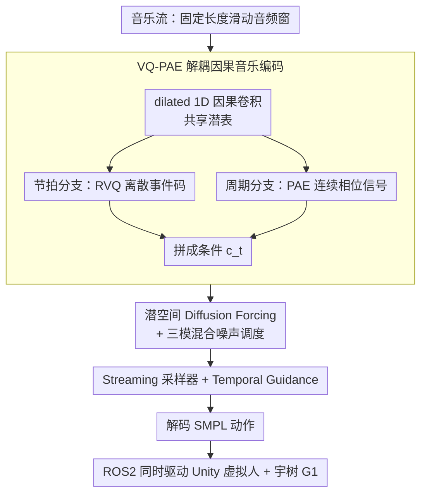

# DiscoForcing: A Unified Framework for Real-Time Audio-Driven Character Control with Diffusion Forcing

**会议**: ICML 2026  
**arXiv**: [2605.28491](https://arxiv.org/abs/2605.28491)  
**代码**: https://discoforcing.github.io/ (有)  
**领域**: 人体理解 / 音乐驱动动作生成 / 流式扩散  
**关键词**: 音频驱动角色控制, Diffusion Forcing, 流式生成, VQ-PAE, 时间引导

## 一句话总结
DiscoForcing 把"音乐 → 全身舞蹈"的离线生成问题改写成严格因果、有界延迟的流式问题，用一个 VQ-PAE 因果音乐编码器 + 潜空间 Diffusion Forcing + 混合时间噪声调度 + 时间引导采样，把音乐流实时翻译成可直接驱动 Unity 虚拟人和宇树 G1 人形机器人的 30 FPS 全身动作。

## 研究背景与动机
**领域现状**：现有 music-to-motion 体系（FACT、Bailando、EDGE、Lodge、MEGADance）几乎都是离线设定：要么能看到全曲未来上下文，要么用长时间窗，要么允许对历史做非因果回溯。这在离线指标上很漂亮，却完全不能直接放到 VR avatar、动画交互、人形机器人这种"音乐边播边来"的实时回路里。

**现有痛点**：把这些离线模型零改地拉到 streaming 上跑会同时出三类问题——节拍同步明显延迟、长 horizon 累积漂移和抖动、对突变（鼓点切入、风格切换、用户编辑）反应迟钝。原因不是工程没调好，而是 streaming 在结构上重新定义了任务：必须只用因果观察、必须一锤定音不能回头改、必须卡死每帧计算预算。

**核心矛盾**：流式音乐驱动控制天然有 stability vs responsiveness 的权衡。过度信任运动历史可以让动作平滑但反应慢；激进覆盖历史则反应快但容易跳变和抖动。叠加上自回归 rollout 的 exposure bias，小的预测误差会污染未来 conditioning history，在非平稳音乐下被放大。

**本文目标**：把音乐驱动角色控制写成 bounded-latency streaming motion generation——每一步给定因果音乐特征 $\mathbf{c}_t$ 和有限运动历史 $\mathbf{m}_{t-h:t-1}$，预测下一段短动作；同时建一套"模型 + 实时系统"配套，让 metric 评估和真实交互体验对齐。

**切入角度**：Diffusion Forcing (Chen et al., 2024a) 用 token-wise 异构噪声训练序列扩散，本身就更鲁棒于不完美的自回归历史；只需要把它专门改造成"潜空间 + 流式 + 音乐条件"的版本，再配合一个适合 streaming 的采样调度，就能直接吃掉 streaming 带来的结构性难题。

**核心 idea**：把 music encoder 设计成严格因果且解耦为节拍 token + 周期相位、把扩散主体改成潜空间 Diffusion Forcing 配混合噪声调度、在采样时用 Temporal Guidance 替代 CFG 让远处历史被主动"加噪稀释"——三件套联合解决因果性、长程稳定性、对突变的响应性。

## 方法详解

### 整体框架
DiscoForcing 要解决的是"音乐边播边来、动作必须立刻跟上"的流式控制问题，核心做法是把离线的 music-to-motion 改写成一条严格因果、每帧算力封顶的流水线。每个流式时刻 $t$，系统先从固定长度的滑动音频窗里抽出严格因果的条件特征，再在一个潜空间的尾部去噪窗里用 Diffusion Forcing 吐出当前帧的干净 latent，最后解码成 SMPL 动作经 ROS2 同时驱动 Unity 虚拟人和宇树 G1 物理人形，整体维持 30 FPS 的因果流式输出。

### 关键设计

**1. VQ-PAE 解耦因果音乐编码：让条件既因果又同时抓住"事件"和"相位"**

实时部署不能偷看未来，所以音乐编码必须严格因果；但音乐里同时存在两种性质完全不同的信息——鼓点切入、副歌进入这种离散"突变事件"，和拍子周期这种连续"相位流动"，用单一表示要么颗粒太粗丢掉节奏、要么被平滑掉触发感。VQ-PAE 因此把每个滑动窗 $\mathbf{w}_t$ 先过 dilated 1D 因果卷积得到共享潜表 $\mathbf{f}^{causal}=\mathrm{Conv1D}(\mathbf{w}_t)$，再显式拆成两路：节拍分支走残差向量量化 $\mathbf{f}^{vq}=\mathrm{RVQ}(\mathrm{FFN}_{vq}(\mathbf{f}^{causal}))$ 给出离散的风格/触发码；周期分支在频域估出幅度 $\mathbf{A}$、偏置 $\mathbf{B}$、频率 $\mathbf{F}$ 和相位 $\boldsymbol{\phi}=\tan^{-1}(\mathrm{FC}_{phase}(\mathbf{f}^{causal}))$，重构出平滑的相位对齐信号 $\mathbf{f}^{pae}(t)=\mathbf{A}\sin(2\pi(\mathbf{F}\cdot t-\boldsymbol{\phi}))+\mathbf{B}$，二者拼成最终条件 $\mathbf{c}_t=[\mathbf{f}_t^{vq};\mathbf{f}_t^{pae}]$。这种"离散事件 + 连续相位"的解耦在消融里把 FIDk 从 Librosa 手写特征的 25.49 降到 23.23、FIDg 从 13.30 降到 12.28，说明学到的语义条件比手工节拍特征更能撑起动作真实度。

**2. 潜空间 Diffusion Forcing + 三模混合噪声调度：让训练分布预演 streaming 时的噪声形态**

自回归 rollout 的麻烦在于推理时喂给模型的历史并不干净，而 vanilla Diffusion Forcing 只用 Random 调度训练，它见过的噪声 pattern 和 streaming 实际遇到的"过去基本干净、当前帧在去噪窗、远过去要被主动稀释"完全错位，于是流式跑起来就抖、就漂。DiscoForcing 先用 motion VAE 把 272 维 SMPL 帧压进潜空间（顺带隐式低通滤掉抖动、压低算力），为每个 token 定义独立噪声水平的概率路径 $p(\mathbf{x}_t^{k_t}|\mathbf{x}_t^0)=\mathcal{N}(\alpha_{k_t}\mathbf{x}_t^0,\sigma_{k_t}^2\mathbf{I})$，$k_t\in[0,1]$ 是 token-wise 扩散时间，再用 flow matching 学速度场 $\mathbf{v}_t=\dot\alpha_{k_t}\mathbf{x}_t^0+\dot\sigma_{k_t}\boldsymbol{\epsilon}_t$，损失只在 $k_t>0$ 的 token 上聚合。关键是训练时按类别分布从三种调度里抽：Random（$k_t\sim\mathcal{U}(0,1)$ 保留通用鲁棒性）、Monotonic（窗口 $[\tau-l,\tau]$ 内线性从 0 升到 1，对应正常滑窗去噪）、Trapezoid（在 Monotonic 基础上让远过去也带噪声，$k_t^{trap}=\max(k_t^{hist},k_t^{mono})$，对应启用引导时的历史加噪）。把这两种推理时真正出现的 pattern 写进训练分布，等于提前消除了 train-test gap。

**3. Streaming 采样器与 Temporal Guidance (TG)：把 stability-responsiveness 权衡变成一个旋钮**

流式真正要做的不是 CFG 假设的"在静态全局条件上去噪"，而是"在不断变化的历史上叠加不断变化的音乐条件"，所以采样既要卡死延迟，又要让新音乐有办法压过陈旧历史。采样器维护一个尾部长度 $l$ 的 FIFO 去噪窗，每个 streaming step $\tau$ 对窗内所有 token 跑一次 solver（步长 $\delta=1/l$ 保证每出一帧只做一次大步），左端去噪到 $k_t=0$ 就吐出成帧、右端补一个新的纯噪声 token。引导部分把 CFG 的"有 cond vs 无 cond"替换成"有音乐 cond + trapezoid 历史 vs 无 cond + monotonic 历史"：$\mathbf{v}^{guided}=\mathbf{v}_\theta(\hat{\mathbf{x}}^{k^{mono}},k^{mono},\varnothing)+\omega[\mathbf{v}_\theta(\hat{\mathbf{x}}^{k^{trap}},k^{trap},\mathbf{c})-\mathbf{v}_\theta(\hat{\mathbf{x}}^{k^{mono}},k^{mono},\varnothing)]$。对远过去施加 trapezoid 噪声，相当于在引导项里把与当前音乐冲突的高频运动先验过滤掉，于是引导尺度 $\omega$ 直接成了控制反应强度的旋钮——调大就即时跟上鼓点切入，调小就保住中近期上下文不跳变。消融上 TG 把 FIDk 从 23.23 进一步压到 18.87、FSR 从 0.097 降到 0.059、BAS 从 0.238 升到 0.244，全面碾过 CFG。

### 损失函数 / 训练策略
两阶段：先训 motion VAE，目标 $\mathcal{L}_{VAE}=\|\mathbf{m}_\mathcal{T}-\hat{\mathbf{m}}_\mathcal{T}\|_2^2+\lambda D_{KL}(q(\mathbf{z}|\mathbf{m})\|\mathcal{N}(0,I))$；再冻住 VAE 训 Diffusion Forcing transformer，目标 $\mathcal{L}_{DF}=\mathbb{E}_{k_\mathcal{T},\mathbf{z}_\mathcal{T},\boldsymbol{\epsilon}_\mathcal{T}}[\|\mathbf{v}_\theta(\mathbf{x}^{k_\mathcal{T}}_\mathcal{T},k_\mathcal{T},\mathbf{c})-\mathbf{v}_\mathcal{T}\|_\mathcal{K}^2]$，masked 范数只算 $k_t>0$ 的 token。推理用 10 步去噪保证 30 FPS。

## 实验关键数据

### 主实验

| 数据集 | 指标 | DiscoForcing | 之前最佳 (方法) | 提升 |
|--------|------|------|----------|------|
| FineDance | FIDk ↓ | 23.84 | 50.00 (Lodge/MEGA) | −52% |
| FineDance | FIDg ↓ | 8.62 | 13.02 (MEGA) | −34% |
| FineDance | FSR ↓ | 0.142 | 0.028 (Lodge) | 略劣 |
| FineDance | BAS ↑ | 0.225 | 0.226 (Lodge/MEGA) | 持平 |
| AIST++ | FIDk ↓ | 18.87 | 25.89 (MEGA) | −27% |
| AIST++ | FIDg ↓ | 11.57 | 9.62 (Bailando) | 略劣 |
| AIST++ | BAS ↑ | 0.244 | 0.242 (Lodge) | +0.002 |

DiscoForcing 在两个数据集的运动质量主指标 FIDk 上大幅领先，BAS 与最佳节拍方法持平，且是表中唯一兼具 online / long-horizon / music-transition / physical platform / user-interactive 五项能力的系统。

### 消融实验（AIST++）

| 配置 | FIDk ↓ | FSR ↓ | BAS ↑ | 延迟 (ms/帧) | 说明 |
|------|--------|-------|-------|--------------|------|
| 263d (HumanML3D) | 26.47 | 0.060 | 0.245 | 26.60 | 缺关节旋转，需 IK 后处理 |
| 272d (本文) | 25.49 | 0.115 | 0.247 | 26.68 | 直接前向运动学，可实时重定向 |
| Librosa 编码 | 25.49 | 0.115 | 0.247 | 26.68 | 手写节拍特征 |
| VQ-PAE 编码 | 23.23 | 0.097 | 0.238 | 26.73 | 学到语义条件 |
| CFG 引导 | 23.23 | 0.097 | 0.238 | 26.73 | 标准无条件 dropout |
| Temporal Guidance | **18.87** | **0.059** | **0.244** | 26.26 | 历史 trapezoid 加噪 |
| 5 步去噪 | 28.63 | 0.062 | 0.242 | 14.02 | 过快导致掉真实感 |
| 10 步 (本文) | 18.87 | 0.059 | 0.244 | 26.26 | 30 FPS 实时甜点 |
| 100 步 | 17.58 | 0.080 | 0.248 | 261.91 | 边际收益小且违反实时约束 |

### 关键发现
- 三个核心模块的相对贡献：Temporal Guidance > VQ-PAE > 272d 表示。其中 TG 单独把 FIDk 从 23.23 降到 18.87（−19%）且同时改善 FSR 和 BAS，是最关键的一击，说明流式场景下"如何处理历史"比"如何编码音乐"更重要。
- 10 步去噪是延迟-质量帕累托甜点：从 5 → 10 步质量大跳，从 10 → 100 步只有 FIDk −7% 而延迟翻 10 倍。这给后续工作划了一条清晰边界——继续堆步数 ROI 极低。
- BAS（节拍对齐）这个长期被音乐生成圈子刷的指标，DiscoForcing 仅"持平"主流方法（0.225 vs 0.226）；但作者强调在 streaming 设定下 baseline 实际是"作弊"使用了未来上下文，因此持平已经是结构性胜利。

## 亮点与洞察
- **Temporal Guidance 替代 CFG 的范式迁移**：CFG 假设条件是静态全局变量，TG 把"远过去历史"看成另一种可控的"条件强度"。这把 streaming generation 的核心矛盾 stability vs responsiveness 直接化成一个 $\omega$ 旋钮，启发了任何"动态条件 + 自回归历史"型生成任务（流式视频、流式 TTS、机器人策略）的引导设计。
- **训练噪声调度要预演推理 pattern**：vanilla Diffusion Forcing 只用 Random 调度训出来的模型在 streaming 上不稳，是因为它从没见过"过去干净、未来加噪、远过去 trapezoid 加噪"这种推理时实际出现的组合。这条经验普适：训练分布要主动覆盖部署调度，不能寄希望于泛化。
- **deployment-faithful evaluation**：作者反复强调"matched causality and latency"，并真的端到端搭了 Unity + 宇树 G1 的双前端。这种"benchmark + 真实交互系统"的双轨设计应该成为流式生成模型的新标配，否则会复制 offline 时代的"指标好看但拉到实时全崩"。

## 局限与展望
- 作者承认的局限：在分布外（极端节拍切换、噪声音乐）的鲁棒性、更丰富的用户控制信号、更强的物理可行性约束、更广的真实世界测试都还待加强。
- 自己观察：FSR（脚滑率）在 FineDance 上 0.142 远高于 Lodge 的 0.028，说明流式约束下脚部接触一致性还没解决；FIDg 在 AIST++ 上也劣于离线 Bailando 9.62，几何层面的舞蹈语汇仍有差距。同时 30 FPS 的 26 ms 单帧预算严格依赖 10 步去噪，换更大模型或更高分辨率动作时是否还稳定有待验证。
- 物理人形那条链路细节给得很少：GMR 重定向、WBC 跟踪策略的稳定性其实可能是端到端体验里最薄弱的一环，论文没给量化指标。
- 改进思路：把脚部接触和物理可行性写进 Diffusion Forcing 的训练目标（接触损失或物理 simulator-in-the-loop），把 $\omega$ 做成基于音乐变化率的自适应而不是固定值，把 Temporal Guidance 扩展到带轻量未来 buffer（如 100 ms lookahead）的"软因果"版本应该能进一步逼近离线质量同时不破坏交互感。

## 相关工作与启发
- **vs Bailando / FACT (autoregressive transformer)**：他们用 token-level AR 在长 rollout 上累积漂移、节拍变弱；本文用 Diffusion Forcing 的 token-wise 异构噪声 + 潜空间 VAE 同时治 exposure bias 和高频抖动，长 horizon 稳定性显著提升。
- **vs EDGE / Lodge (offline diffusion)**：他们靠未来音频上下文和非因果回溯获得全曲一致性；本文在严格因果下用 Hybrid Schedule + TG 弥补缺失的未来信息，更适合真实交互。
- **vs MEGADance (MoE Mamba-Transformer)**：路线是"换更强骨干"提升表达力；本文路线是"骨干一般但把流式条件管理做对"，在 FIDk 上以更小模型反超 MEGA。这两条路线正交，可以叠加。
- **vs Self Forcing / Rolling Forcing**：同样关注 streaming diffusion，但都假设全局条件静态或缓变；本文把"非平稳的实时音乐流"作为一等公民，给出了 streaming + 动态条件场景的可行模板。

## 评分
- 新颖性: ⭐⭐⭐⭐ 把 Diffusion Forcing 改造到流式音乐驱动控制 + TG 替代 CFG 是清晰且可迁移的组合创新，单点突破程度足够。
- 实验充分度: ⭐⭐⭐⭐ FineDance + AIST++ 双数据集、完整消融、延迟数据齐全；扣分项是物理人形那条链路缺少量化评估。
- 写作质量: ⭐⭐⭐⭐⭐ 问题陈述、动机、矛盾、方法三段式叙述非常清晰，公式与算法伪代码配套，是 streaming generation 论文的范本。
- 价值: ⭐⭐⭐⭐⭐ 不仅给出 SOTA 数字，更给出一套"模型 + 实时系统 + 双前端部署"的完整范式，对动画 / VR / 人形机器人都是立即可用的工程参考。

<!-- RELATED:START -->

## 相关论文

- [\[ACL 2026\] Hybrid Autoregressive-Diffusion Model for Real-Time Sign Language Production](../../ACL2026/human_understanding/hybrid_autoregressive-diffusion_model_for_real-time_sign_language_production.md)
- [\[CVPR 2026\] UniLS: End-to-End Audio-Driven Avatars for Unified Listening and Speaking](../../CVPR2026/human_understanding/unils_end-to-end_audio-driven_avatars_for_unified_listening_and_speaking.md)
- [\[ECCV 2024\] FreeMotion: A Unified Framework for Number-free Text-to-Motion Synthesis](../../ECCV2024/human_understanding/freemotion_a_unified_framework_for_number-free_text-to-motion_synthesis.md)
- [\[NeurIPS 2025\] MOSPA: Human Motion Generation Driven by Spatial Audio](../../NeurIPS2025/human_understanding/mospa_human_motion_generation_driven_by_spatial_audio.md)
- [\[CVPR 2026\] ReMoGen: Real-time Human Interaction-to-Reaction Generation via Modular Learning from Diverse Data](../../CVPR2026/human_understanding/remogen_real-time_human_interaction-to-reaction_generation_via_modular_learning_.md)

<!-- RELATED:END -->
