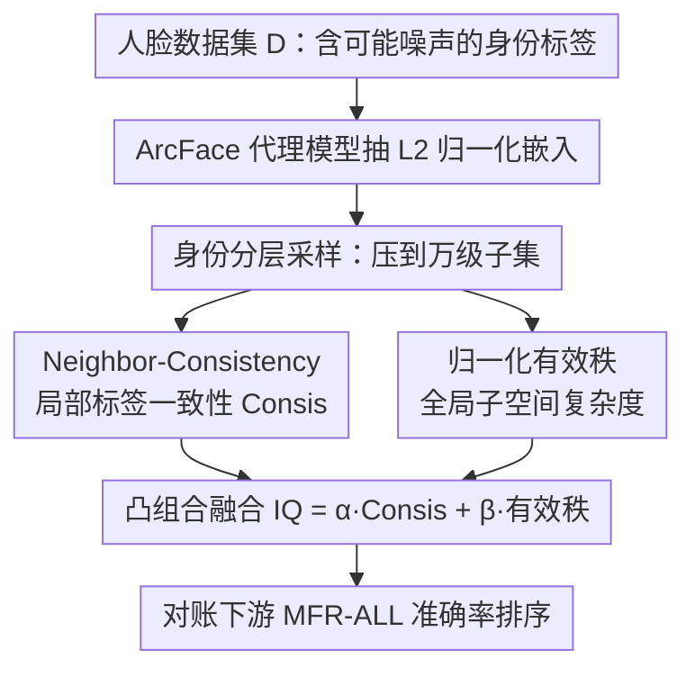

# Efficient, Validation-Free Intrinsic Quality Estimation for Large-Scale Face Recognition Datasets

**会议**: ICML 2026  
**arXiv**: [2605.29720](https://arxiv.org/abs/2605.29720)  
**代码**: 无  
**领域**: 人脸识别 / 数据集质量评估 / 表示学习诊断  
**关键词**: 内在质量、有效秩、邻域一致性、人脸识别数据集、免验证集评估

## 一句话总结
提出 Intrinsic Quality (IQ)：用代理模型抽出嵌入后，把"邻域标签一致性 Consis"和"归一化谱熵有效秩 $\tilde{r}_{\mathrm{ent}}$" 加权融合，在不做完整训练、不要干净验证集的前提下给百万级人脸识别数据集打"可训练性"分数，在 WebFace4/12/42M 和注入噪声的设定上与下游 MFR-ALL 验证准确率排名一致性达到 Spearman = 1.0。

## 研究背景与动机

**领域现状**：现代人脸识别（FR）训练高度依赖百万级弱监督网络数据（MS-Celeb-1M、VGGFace2、WebFace260M/42M），配合 ArcFace 这类角度间隔分类损失，性能与数据规模强耦合，研究范式正从"模型中心"转向"数据中心"。

**现有痛点**：要判断一个数据集变体值不值得砸算力扩大训练，传统做法只有两条：跑一遍完整训练看下游验证集准确率，或者依赖一份干净 held-out 验证集。前者动辄数千 GPU·h，后者在隐私/授权限制下根本拿不到；同时 WebFace 这类自动清洗 pipeline 还有残留噪声、身份合并/分裂、长尾。训练时去噪方法（Co-Mining、Global-Local GCN 等）能缓解但本质还是要训练才能验证。

**核心矛盾**：弱监督网络数据里有一个关键混淆——全局谱复杂度（有效秩）在"良性扩数据"和"标签被污染"两种相反情形下都会增加，所以仅靠一个全局指标（如 RankMe）无法区分"更多元"和"更脏"。需要一个能同时拆开这两种来源的诊断信号。

**本文目标**：在不做完整训练、不依赖干净验证集、不调数据集相关超参的前提下，提供一个能对候选 FR 数据集排序的"可训练性"代理指标，并验证它与下游 MFR-ALL 验证准确率的相关性和排序一致性。

**切入角度**：作者观察到，局部信号（k-NN 邻域内的标签一致率）和全局信号（嵌入协方差谱的有效秩）对"扩数据"和"加噪"的响应方向不同——干净扩数据下邻域一致性几乎不动而谱在张开，加噪下谱依然在张开但邻域一致性塌掉。两者构成互补的二维平面，能从几何上把两种 regime 分开。

**核心 idea**：用"局部 Consis × 全局归一化有效秩"的凸组合作为数据集级别的内在质量分，让 Consis 充当抑制噪声引起的"假复杂度"的修正项。

## 方法详解

### 整体框架
要解决的问题是：在不跑完整训练、不依赖干净验证集的前提下，给一个带（可能有噪声的）身份标签的人脸训练集 $\mathcal{D}=\{(x_i,y_i)\}_{i=1}^N$ 打一个标量"可训练性"分数 IQ，用来在多个候选数据集变体之间排序。作者把"要不要扩这份数据"这个昂贵的训练问题，转成对代理嵌入做两个互补几何统计再融合的问题——先在 $\mathcal{D}$ 上用 ArcFace 训一个轻量代理模型抽出 $\ell_2$ 归一化嵌入，再做身份分层采样把计算量压到万级，然后分别量出"局部标签一致性"和"全局子空间复杂度"两个方向相反的信号，最后凸组合成一个分数去对账下游 MFR-ALL 的真实准确率。

### 关键设计

**1. Neighbor-Consistency：用局部标签一致性探噪声**

针对的痛点是弱监督网络数据里的标签翻转和身份 merge/split——它们破坏的是"邻域内同身份"这种局部结构，而全局谱看不出来。具体做法是对每个采样嵌入 $e_i$ 按余弦相似度取 $k$ 近邻（排除自身，默认 $k=10$），算邻域里与 $y_i$ 同标签的比例 $c_i=\frac{1}{k}\sum_{j\in\mathcal{N}_k(i)}\mathbf{1}\{y_j=y_i\}$，再对子集取平均得到 $\bar c$。它之所以有效，是因为干净扩数据几乎不会让"局部紧凑簇"散开，但污染会直接把邻域里的同标签比例打下来，所以 $\bar c$ 对"是否被污染"敏感、对"是否变大"几乎不动，恰好补上全局谱复杂度看不出方向的那一维。

**2. 归一化有效秩 $\tilde{r}_{\mathrm{ent}}$：用谱熵量全局子空间张开程度**

这一项要刻画"嵌入到底铺开了多少维度"，反映数据多样性与表示丰富度。做法是对子集嵌入去均值后算协方差 $C=\frac{1}{n}\tilde E^\top \tilde E$，把特征值 $\{\lambda_\ell\}$ 归一化为概率 $p_\ell$，按 Roy & Vetterli 的谱熵有效秩定义算 $r_{\mathrm{ent}}=\exp\left(-\sum_\ell p_\ell\log p_\ell\right)$，再做对数归一化 $\tilde{r}_{\mathrm{ent}}=\log r_{\mathrm{ent}}/\log Q$（$Q=\min(n,d)$）让不同 $(n,d)$ 下可比并压缩近饱和区。良性扩数据会让谱从一两个主方向铺向更多方向、$\tilde{r}_{\mathrm{ent}}$ 单调上升；但噪声同样会注入"虚假方差"把谱拍平、推高有效秩——所以它单独用方向是歧义的，这正是必须叠 Consis 的根本原因。

**3. 凸组合融合 IQ：让一致性修正假复杂度**

最后把局部与全局两个信号合成单一标量 $\mathrm{IQ}=\alpha\cdot\bar c+\beta\cdot\tilde{r}_{\mathrm{ent}}$（$\alpha+\beta=1$），全程固定 $\alpha=0.2,\beta=0.8$，所有数据集/噪声率/proxy 都不调。权重偏向 $\tilde{r}_{\mathrm{ent}}$ 是因为干净扩数据 regime 下 Consis 接近饱和、动态范围小，需要靠子空间扩张来区分；而在污染 regime 下 Consis 会反向拉一把，避免 $\tilde{r}_{\mathrm{ent}}$ 被假复杂度骗高。关键是这个权重不是 per-dataset 调出来的——5.4 节对 $\beta$ 做 sweep 证明存在一大段高相关平台而非尖峰最优。

### 损失函数 / 训练策略
代理模型 $f_\theta$ 直接用标准 ArcFace 在 $\mathcal{D}$ 上训练（ResNet-50 或 ResNet-100，$d=1024$），主线趋势分析固定 ResNet-100；IQ 本身不含可学习参数，只是嵌入几何上的事后统计。

## 实验关键数据

### 主实验：干净扩规模 + 注入噪声

干净扩规模（WebFace 4M → 12M → 42M）下 IQ 与下游 MFR-ALL 同向上升；在 WebFace12M 上按 {2%, 5%, 10%, 20%, 40%} 注入闭集标签翻转后，下游准确率单调掉，$\tilde{r}_{\mathrm{ent}}$ 反而被噪声推高，但 Consis 大幅下塌，IQ 能跟住下游排序。

| 数据集 | 噪声 | Acc(MFR-ALL) | $\tilde{r}_{\mathrm{ent}}$ | Consis | IQ |
|--------|------|--------------|----------------------------|--------|-----|
| WebFace4M | 0 | 90.36 | 0.882 | 0.980 | 0.902 |
| WebFace12M | 0 | 94.37 | 0.916 | 0.987 | 0.930 |
| WebFace42M | 0 | 96.26 | 0.964 | 0.986 | 0.968 |
| WebFace12M | 5% | 94.21 | 0.927 | 0.897 | 0.921 |
| WebFace12M | 20% | 90.76 | 0.959 | 0.676 | 0.903 |
| WebFace12M | 40% | 72.01 | 0.994 | 0.401 | 0.875 |

### 与外部 validation-free baseline 对比（scaling+noise 并集）

| 指标 | Spearman | Pearson | Kendall τ |
|------|----------|---------|-----------|
| RankMe | 0.418 | 0.752 | 0.300 |
| ER-only ($\tilde{r}_{\mathrm{ent}}$) | 0.286 | 0.398 | 0.190 |
| Consis-only ($\bar c$) | 0.607 | 0.491 | 0.429 |
| **IQ (ours)** | **1.000** | **0.891** | **1.000** |

### 关键发现
- 谱复杂度单独用具有方向歧义：WebFace12M 40% 噪声下 $\tilde{r}_{\mathrm{ent}}=0.994$ 是全表最高，但下游只有 72.01%，正好印证"噪声也会推高有效秩"，这是 RankMe / ER-only 失效的根因。
- $\beta$ 敏感性 sweep 显示在很宽的区间里 Spearman/Pearson 都接近 IQ 的峰值，说明权重不是调出来的；采样规模从 2k 到 100k 的稳定性表也显示 $\tilde{r}_{\mathrm{ent}}$ 和 Consis 在 ≥10k 后基本收敛，估计成本可控。
- ResNet-50 vs ResNet-100 两个 proxy 下绝对值会平移但跨数据集的相对排序保持一致，说明 IQ 捕捉的是数据集内在结构而非 proxy 架构 artifact。
- 在 WebFace12M / HighVar / LowVar 三个 12M 子集排序实验上，IQ 也保持了下游准确率的排名（HighVar 94.45 > 12M 94.37 > LowVar 93.04，IQ 0.932 > 0.930 > 0.913），支持其作为"先排序再训"的实际用途。

## 亮点与洞察
- "全局谱复杂度在扩数据和加噪两种相反 regime 下都会升"这一观察非常干净，揭示了为什么近年单一谱类指标（RankMe / 有效秩）在弱监督数据上会失灵；用一个局部 k-NN 一致率就把这一对方向拆开，几何上对应 $(\tilde{r}_{\mathrm{ent}}, \mathrm{Consis})$ 平面里两条不同的轨迹，思路简洁可视。
- 整套指标全程固定权重 $\alpha=0.2,\beta=0.8$ 不做 per-dataset 调参，且 $\beta$ 存在大段高相关平台而非尖峰，这种"无需调参"的特性让它在真实数据迭代场景里更可信。
- "用轻量代理 + 身份分层 10k 子集"把成本压到百万级数据可用，且 IQ 本身不需要训练，只是嵌入的事后统计——这种"诊断与训练解耦"的范式可以直接迁移到其他强依赖弱监督大数据的领域（如检索、re-ID、视频身份理解），只要存在"局部标签同质性 + 全局子空间张开"这对互补轴。
- per-sample $c_i$ 的分布信息（噪声下从近饱和的尖峰偏移到长尾分散）天然提供数据 debug 视角，可以反过来指导自动清洗——这是把诊断变成 cleaning loop 的可行入口。

## 局限性 / 可改进方向
- 完全依赖 proxy 嵌入：极弱 proxy 或强 domain shift 会让 IQ 失真；论文没有给出 proxy 应达到的最低能力门槛，实际部署时缺少明确判据。
- 噪声模型过于人工：实验只用了均匀闭集标签翻转，没有覆盖 web 数据里更现实的 identity merge/split、近重复簇、视觉相似身份的结构化混淆和长尾偏置，所以"IQ 跑赢 RankMe"的强结论严格来说只在受控噪声下成立。
- 下游评测只验了 MFR-ALL 一个 benchmark，"可训练性"定义本身就被绑死在一套固定训练+评测协议上，跨 benchmark / 跨架构的泛化只是猜想；论文也明确说 IQ 不是"通用数据集质量分"。
- 主线相关性表里 IQ 的 Spearman/Kendall τ 同时打到 1.000 比较可疑——可能与所对照设置数量有限、单调性容易满分有关，若把更多 mixed regime 点（更细的 noise grid + 不同 base scale）加进来，应该重新评估这一数字的稳健性。

## 相关工作与启发
- **vs RankMe (Garrido et al., 2023)**：RankMe 也是 validation-free 的有效秩类指标，但只看全局谱；本文实验显示 RankMe Spearman 0.418 vs IQ 1.000，差距来自 RankMe 在污染情形被"假复杂度"骗高，本质上证明了"光看谱不够，必须叠局部一致性"。
- **vs SER-FIQ / MagFace 等图像级质量**：那一脉是 sample-level 的可识别度评分，目标是"挑好图"；本文是 dataset-level 的可训练性评分，目标是"挑好数据集"，两者粒度互补，可结合用于数据 curation。
- **vs Co-Mining / Global-Local GCN / RepFace 等噪声鲁棒训练**：这些是训练时缓解噪声，仍然要把训练跑完才能知道数据集变体好不好；IQ 把判断前置到训练前，是诊断而非治疗，可以作为它们的预筛选模块。
- **vs LEEP / TransRate 等迁移学习预测指标**：思路同源（用低成本内在信号预测下游），但 LEEP/TransRate 是 source-target 任务对的可迁移度，IQ 是同 task 下数据集变体的可训练度；同时它显式处理弱监督标签噪声这一 FR 特有困难。

## 评分
- 新颖性: ⭐⭐⭐⭐ 把"全局谱复杂度在扩规模/加噪两种情形下都上升"这个 confounder 显式拆出，并用 k-NN 局部一致性补上，洞察清晰；融合本身不复杂但角度新。
- 实验充分度: ⭐⭐⭐ 在 WebFace4/12/42M 上做了扩规模、6 级注入噪声、proxy 鲁棒性、采样稳定性、$\beta$ 敏感性和子集排序，覆盖到位，但只用了一个下游 benchmark 且噪声模型偏理想化。
- 写作质量: ⭐⭐⭐⭐ 动机—假设—两信号—融合—验证链路非常顺，每个设计都给了"为什么需要它"的论证；表格命名和符号一致，对 confounder 的反复强调让读者很容易抓住主线。
- 价值: ⭐⭐⭐⭐ 在百万级 FR 数据集成本敏感的工程语境下提供了一个轻量诊断工具，"先打分再训"的范式对数据驱动 FR pipeline 直接可用，思路也能外推到其它弱监督大数据领域。

<!-- RELATED:START -->

## 相关论文

- [\[CVPR 2026\] OpenT2M: No-frill Motion Generation with Open-source, Large-scale, High-quality Data](../../CVPR2026/human_understanding/opent2m_no-frill_motion_generation_with_open-source_large-scale_high-quality_dat.md)
- [\[CVPR 2026\] LCA: Large-scale Codec Avatars - The Unreasonable Effectiveness of Large-scale Avatar Pretraining](../../CVPR2026/human_understanding/lca_large-scale_codec_avatars_the_unreasonable_effectiveness_of_large-scale_avata.md)
- [\[CVPR 2026\] ImmerIris: A Large-Scale Dataset and Benchmark for Off-Axis and Unconstrained Iris Recognition in Immersive Applications](../../CVPR2026/human_understanding/immeriris_a_large-scale_dataset_and_benchmark_for_off-axis_and_unconstrained_iri.md)
- [\[CVPR 2026\] Reference-Free Image Quality Assessment for Virtual Try-On via Human Feedback](../../CVPR2026/human_understanding/reference-free_image_quality_assessment_for_virtual_try-on_via_human_feedback.md)
- [\[ICCV 2025\] LVFace: Progressive Cluster Optimization for Large Vision Models in Face Recognition](../../ICCV2025/human_understanding/lvface_progressive_cluster_optimization_for_large_vision_models_in_face_recognit.md)

<!-- RELATED:END -->
