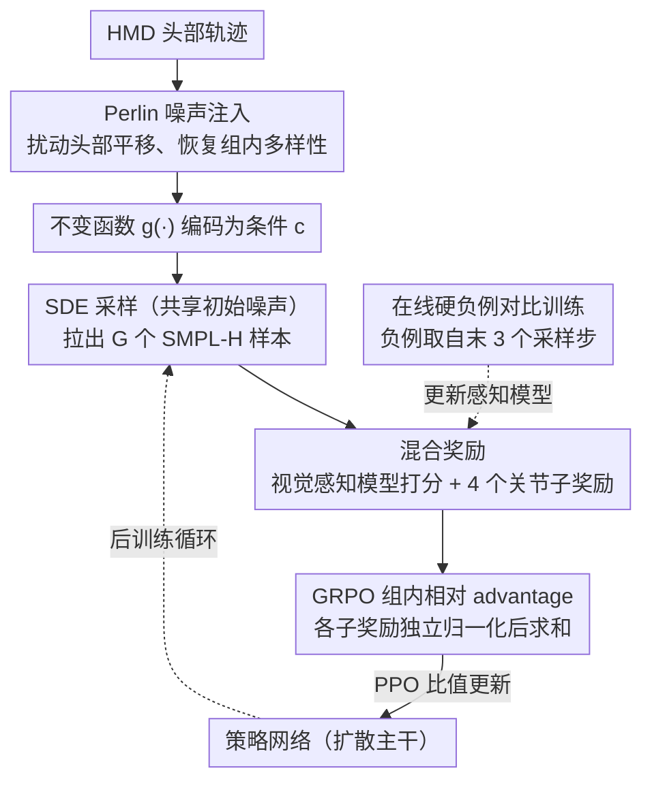

# MotionGRPO: Overcoming Low Intra-Group Diversity in GRPO-Based Egocentric Motion Recovery

**会议**: ICML 2026  
**arXiv**: [2605.05680](https://arxiv.org/abs/2605.05680)  
**代码**: https://github.com/3DAgentWorld/MotionGRPO/ (有)  
**领域**: 人体理解 / 第一人称 3D 动作恢复 / 扩散模型 + 强化学习  
**关键词**: 全身动作恢复、HMD、GRPO、扩散模型、Perlin 噪声注入

## 一句话总结
MotionGRPO 把 head-mounted 设备的第一人称全身动作恢复转化为扩散采样上的 MDP，用 GRPO 配合"轨迹条件感知模型 + 4 个 joint-level 子奖励"的混合奖励做后训练；同时识别出"输入条件太强、组内样本几乎一样导致 advantage 方差消失"这一致命瓶颈，并用 Perlin 噪声注入条件来恢复组内多样性，在 AMASS/RICH 上把 MPJPE 从 EgoAllo 的 124.985 mm 降到 114.207 mm。

## 研究背景与动机
**领域现状**：第一人称（HMD）全身动作恢复主流是基于 head SLAM 信号的扩散模型（EgoEgo、EgoAllo 等），用条件扩散去模拟"可能的人体动作分布"，再从纯高斯噪声反向采样。

**现有痛点**：（1）扩散目标本质是分布匹配，缺乏对单个关节位置的强约束，预测出来经常关节位置偏移、脚滑、地面穿透、抖动；（2）这些视觉/几何瑕疵又无法在扩散框架内简单加 loss——早期 timestep 还都是噪声，硬加 joint loss 会震荡；（3）已有 RL 方案（PPO 在物理模拟器里训练）不稳定且算力惊人。

**核心矛盾**：要么走分布匹配（精度差），要么走 RL（不稳定/贵）。GRPO 看似是省 value-net 的优雅 RL，但作者发现"动作恢复任务条件太强 → 组内输出几乎相同 → advantage std≈0 → 梯度消失"，让 vanilla GRPO 直接失效。

**本文目标**：（1）把 GRPO 引入扩散动作恢复并设计有意义的混合奖励；（2）破解"低组内多样性 → 梯度消失"这一新瓶颈。

**切入角度**：作者把扩散采样视为多步 MDP，状态是 $(c,t,x_t)$、动作是 $x_{t-1}$，sparse reward 只在 $t=0$ 给；并提出"强 condition 是输出 diversity 的根因，所以要在 condition 上注入噪声"这一逆向思路。

**核心 idea**：用 SDE-based 扩散采样 + 共享初始噪声拉出一组样本，奖励层面用感知模型 + 4 个 joint metric，再用时空平滑的 Perlin 噪声扰动头部条件来恢复 GRPO 所需的组内方差。

## 方法详解

### 整体框架
MotionGRPO 解决的是 HMD 第一人称全身动作恢复，做法是把整个扩散采样过程看成一个多步 MDP，然后在预训练好的 EgoAllo 上做强化学习后训练。输入是 HMD 的 CPF 头部轨迹 $\mathbf{H}_{cpf}^{1:T}=\{R^{1:T},\tau^{1:T}\}$，经 EgoAllo 的 invariant function $g(\cdot)$ 转成 condition $\mathbf{c}$，扩散主干用 transformer 输出 SMPL-H 表示 $\mathbf{M}=\{\Theta,\beta\}$。后训练阶段，模型先对每个 condition 用 SDE 反向采样配合共享初始噪声拉出一组样本，再用"学习的视觉感知模型 + 4 个 joint 级几何度量"给每个样本打分，按 GRPO 的组内相对归一化算 advantage 并用 PPO-style importance ratio 更新策略；与此并行，它在头部条件上注入 Perlin 噪声来把组内方差重新撑起来，避免 GRPO 失效。

### 关键设计

**1. 混合奖励：学习的视觉感知模型 + 4 个 joint 子奖励，同时管"自然"和"准"**

扩散目标本质是分布匹配，对单个关节没有强约束，预测结果常出现脚滑、穿模、抖动这类几何瑕疵，而这些伪影又无法在扩散框架里简单加 loss。MotionGRPO 借 GRPO 能优化不可微目标的特性，把奖励拆成两路。视觉级用一个 trajectory-conditioned 感知模型 $\phi$（spatial-attention + temporal-attention transformer），输入 SMPL-H skeleton + head trajectory，输出 plausibility 分数，对应奖励 $\mathcal{R}_{vis}=\exp(\omega_{vis}\cdot s)$，专门抓"看上去就别扭"的 foot skating / jitter / 穿模。joint 级则直接对齐 GT，含四项：$\mathcal{R}_{rot}$（局部旋转 L1）、$\mathcal{R}_{pos}$（全局位置 L2）、$\mathcal{R}'_{pos}$（per-frame Procrustes 对齐后位置 L2）、$\mathcal{R}_{vel}$（速度差 L2），均用 $\exp(-\omega\cdot\text{err})$ 压到 $(0,1]$。

关键在归一化方式：每个子奖励独立做组内相对归一化得到各自的子 advantage，再相加 $\hat A_i=\sum_k \hat A_{i,k}$，总奖励 $\mathcal{R}_{total}=\mathcal{R}_{vis}+\mathcal{R}_{joint}$（其中 $\mathcal{R}_{joint}=\mathcal{R}_{rot}+\mathcal{R}_{pos}+\mathcal{R}'_{pos}+\mathcal{R}_{vel}$）。这样视觉自然性和关节精度被同一套 GRPO 优化器一起塞进策略，消融也证明只留单路都不如双路。

**2. 在线硬负例对比训练，让感知模型不被策略攻击**

如果感知打分模型静态训完就冻住，策略很快会找到它的漏洞做 reward hacking，让分数虚高。MotionGRPO 让感知模型随策略一起演化：正样本是 (GT motion, head)，硬负样本不是手工加噪声，而是从当前 policy 最后 3 个 sampling timestep 实时采出来——这些样本结构上很接近 GT，却带着策略当下的 typical 瑕疵，因此恰好是"难分但该判低分"的样本。训练用 InfoNCE，温度 $\delta=0.07$：

$$\mathcal{L}_{NCE}=-\mathbb{E}\log\frac{\exp(\phi(J^+|H^+)/\delta)}{\exp(\phi(J^+|H^+)/\delta)+\sum_i\exp(\phi(J_i^-|H_i^-)/\delta)}$$

负例随策略一起更新，奖励信号才能持续保持区分度，本质上是把"online preference model"的自博弈思路落到动作恢复里。

**3. Perlin 噪声注入头部条件，破除低组内多样性这一 GRPO 死结**

这是全文最关键的诊断。motion recovery 由强条件 $\mathbf{c}$ 主导，同一条件下采出的一组样本几乎一模一样，于是 advantage 公式 $\hat A_i=(\mathcal{R}_i-\mu)/\sigma$ 在 $\sigma\to 0$ 时数值爆炸、梯度消失，vanilla GRPO 直接训不动。解法是在头部 translation 上注入时间连续的 Perlin 噪声 $\mathcal{P}(t)$ 得到扰动输入 $\tilde{\mathbf{H}}=\{R,\tau+\lambda\mathcal{P}(t)\}$，再过 $g(\cdot)$ 得到略偏分布外的扰动 condition，让策略面对的输入有了差异，输出方差自然回升、$\sigma$ 重新非零。

之所以选 Perlin 而不是高斯白噪声，是因为白噪声会引入高频抖动、破坏头部轨迹的时间平滑性，与人头运动的物理先验冲突；Perlin 噪声天然平滑、频谱可控，能在不违反物理合理性的前提下扩出一圈"近邻条件"。消融里缩放系数 $\lambda$ 存在最佳值——太小撑不出 diversity，太大破坏先验，印证它是"恰到好处的扰动"。

### 损失函数 / 训练策略
GRPO 目标为 $\mathcal{J}_{GRPO}(\theta)=\mathbb{E}\left[\frac{1}{G}\sum_i\frac{1}{n}\sum_t \frac{\pi_\theta(o_{i,t}|\mathbf{c})}{\pi_{old}(o_{i,t}|\mathbf{c})}\hat A_i\right]$（省略 clip 与 KL），reward 只在 $t=0$ 的 sparse 处给出。算法外层循环为：采一个 batch → 复制旧策略 → 在头部条件上注入 Perlin 噪声扰动 → 共享初始噪声做 SDE 采样拉出 $G$ 个样本 → 算各子奖励的 $\mu/\sigma$ → 求 advantage → 跨 $n$ 个 sampling step 做 importance-weighted 更新；感知模型与策略交替/并行更新。

## 实验关键数据

### 主实验

| 数据集 | 方法 | MPJPE↓(mm) | PA-MPJPE↓(mm) | MPJVE↓(mm) | MPJRE↓(°) | Jitter↓ | GP↓(m) | FS↓(m) |
|--------|------|-----------|---------------|-------------|------------|---------|--------|--------|
| AMASS | EgoEgo | 177.231 | 152.125 | 588.661 | 9.457 | 2.643 | 1.331 | 1.241 |
| AMASS | EgoAllo | 124.985 | 103.958 | 553.221 | 8.777 | 2.394 | 1.143 | 1.290 |
| AMASS | EgoAllo$^\aleph$（带 test-time 优化） | 121.651 | 101.034 | 483.471 | 8.728 | 1.455 | 1.099 | 0.479 |
| AMASS | **MotionGRPO** | **114.207** | **95.512** | 531.217 | **8.413** | 2.000 | **0.901** | 1.169 |
| AMASS | **MotionGRPO$^\aleph$** | **111.776** | **93.702** | **461.702** | **8.330** | **1.309** | 0.963 | **0.399** |
| RICH | EgoAllo | 192.686 | 172.724 | 506.992 | 12.734 | 4.135 | 4.145 | 1.094 |
| RICH | **MotionGRPO$^\aleph$** | **184.992** | **167.032** | **378.423** | **11.886** | **1.614** | **3.156** | **0.199** |

### 消融实验

| 配置 | 关键指标 | 说明 |
|------|---------|------|
| Vanilla GRPO（无 Perlin 噪声） | 组内 diversity 几乎为 0，advantage std≈0，loss 不下降 | 直接验证"低组内多样性 → vanishing gradient"假设 |
| 只用视觉奖励 / 只用 joint 奖励 | 视觉级看起来好但 MPJPE 提升有限 / 反之；两者结合最优 | 混合奖励必要 |
| 在线硬负例 vs 静态噪声负例 | 在线硬负例使感知模型对 policy-typical 瑕疵更敏感，长期奖励更稳 | 防止 reward hacking |
| Perlin noise 缩放 $\lambda$ | $\lambda$ 太小 diversity 不够、太大破坏先验，存在最佳值 | 表明 Perlin 是"恰到好处的扰动" |

### 关键发现
- "低组内多样性 → advantage 方差消失"是把 GRPO 从 generation 任务搬到 reconstruction 任务时几乎必然出现的死结，本文是首批正面提出并解决的工作之一。
- 学习的视觉感知模型 + 显式 joint metric 的组合，比单纯加几个手工 loss 项更能压住 jitter/foot skate/穿模这种"看上去就别扭"的伪影。
- 测试时优化（标 $\aleph$）能进一步把 Jitter 从 2.0 砍到 1.3、FS 从 1.17 砍到 0.40，说明 MotionGRPO 后训练 + EgoAllo 的 test-time refinement 是互补的。

## 亮点与洞察
- 把"GRPO 在 reconstruction 任务上失败的具体数学原因"讲透——advantage 公式分母 $\sigma\to 0$，这一论证清晰、可复用到任何 RL+条件强约束任务。
- 用 Perlin 噪声而不是高斯，是非常 domain-aware 的选择：保留时间平滑性 = 保留人头运动的物理先验，避免训练信号自我矛盾。
- 在线 contrastive reward model 把"reward hacking"问题用 self-play 思路解掉，思路可平移到 video generation、TTS 等评分难的扩散任务。
- 整体设计是 RL 后训练叠在扩散预训练上、感知 reward + 几何 reward 双轨——这是当下"diffusion + RLHF"流派在结构化任务上的范式样板。

## 局限与展望
- 评估主要在合成 device pose（AMASS）和半真实数据（RICH）上，对真实 Project Aria 长时序、多人、强光线变化的复杂场景未做大规模验证。
- Perlin 噪声尺度 $\lambda$ 是手调超参，没有自适应调节机制，过大可能破坏物理先验、过小则恢复不到足够 diversity。
- 感知模型在线对比训练的稳定性依赖 policy 演化速度；如果 policy 跑得过快，负样本质量可能跟不上。
- 当前只用 head 轨迹，没充分利用可选的 egocentric image 或 hand observation；与多模态融合的潜力未挖尽。
- 视觉指标里 FS 显著降到 0.4 m 看起来仍有改进空间，离真正"看不到脚滑"的体感仍差。

## 相关工作与启发
- **vs EgoAllo (Yi et al., 2025)**: MotionGRPO 把 EgoAllo 当作 base policy，仅做 RL 后训练就拿到 MPJPE 约 8% 降幅；说明 EgoAllo 的预训练 prior 还有大量未释放潜力。
- **vs PPO 在物理模拟器中训练**: 传统 RL 物理 sim 慢且不稳定；GRPO 省 value-net，结合扩散 SDE 采样直接在动作空间里训，效率高得多。
- **vs DDPO / DPO for image generation**: 同样是把扩散转 MDP + RL，但 image generation 天然多样，本文核心 contribution 反而是"补回 diversity"，呈现 reconstruction vs generation 的根本差异。

## 评分
- 新颖性: ⭐⭐⭐⭐ 首批把 GRPO 引入扩散 motion recovery 的工作，并真正诊断+解决"低组内多样性"问题；Perlin 注入策略与在线感知 reward 的组合都很有想法。
- 实验充分度: ⭐⭐⭐⭐ AMASS/RICH 主比较 + ADT 真实测试 + 多个消融，但缺与 PPO/物理模拟器、DPO 等其它 RL 路线的直接对比。
- 写作质量: ⭐⭐⭐⭐ 把"GRPO 为什么失败"用 advantage 公式讲清楚，pipeline 图与算法伪代码齐备；reward 公式较多，对读者有一定门槛。
- 价值: ⭐⭐⭐⭐ 对 VR/AR 全身追踪、扩散 + RL 后训练范式都有直接借鉴价值；代码开源进一步降低复现门槛。

<!-- RELATED:START -->

## 相关论文

- [\[CVPR 2026\] Mocap-2-to-3: Multi-view Lifting for Monocular Motion Recovery with 2D Pretraining](../../CVPR2026/human_understanding/mocap-2-to-3_multi-view_lifting_for_monocular_motion_recovery_with_2d_pretrainin.md)
- [\[CVPR 2026\] EgoPoseFormer v2: Accurate Egocentric Human Motion Estimation for AR/VR](../../CVPR2026/human_understanding/egoposeformer_v2_accurate_egocentric_human_motion_estimation_for_arvr.md)
- [\[CVPR 2026\] Natural Human Motion Recovery by Aligning High-Order Temporal Dynamics from Monocular Videos](../../CVPR2026/human_understanding/natural_human_motion_recovery_by_aligning_high-order_temporal_dynamics_from_mono.md)
- [\[CVPR 2025\] HumanMM: Global Human Motion Recovery from Multi-shot Videos](../../CVPR2025/human_understanding/humanmm_global_human_motion_recovery_from_multi-shot_videos.md)
- [\[CVPR 2026\] Forecasting 3D Scanpaths in Egocentric Video](../../CVPR2026/human_understanding/forecasting_3d_scanpaths_in_egocentric_video.md)

<!-- RELATED:END -->
