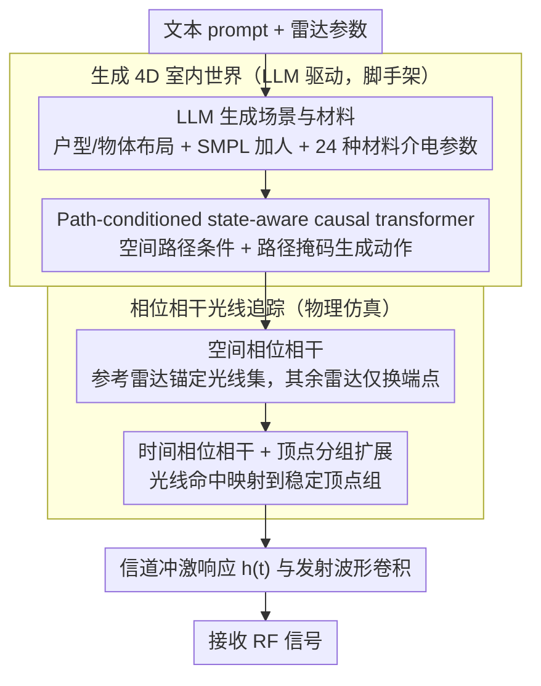

# WaveVerse: Scalable RF Simulation in Generative 4D Worlds

**会议**: ICML 2026  
**arXiv**: [2508.12176](https://arxiv.org/abs/2508.12176)  
**代码**: 已开源（论文 webpage 提供）  
**领域**: 信号与通信 / 射频感知 / 仿真数据生成  
**关键词**: RF 感知, 毫米波, 相位相干光线追踪, 4D 世界生成, 人体动作生成

## 一句话总结
WaveVerse 把 LLM 驱动的"4D 室内场景+人体动作"生成与一套保留时空相位相干性的物理光线追踪器拼成一条 prompt 到 RF 信号的流水线，用合成数据显著提升 RF 成像与活动识别下游任务，且性能随仿真量持续上涨而不像已有方法那样饱和。

## 研究背景与动机
**领域现状**：RF（射频/毫米波）感知是计算机视觉之外一条隐私友好、抗遮挡、抗低能见度的感知路线，已用于 3D 成像、人体活动识别、呼吸/睡眠监测等任务。但 RF 数据采集要覆盖足够多的房间布局、人群差异和动作类型，硬件昂贵；不同 RF 系统的带宽/天线阵列/调制方式各异，数据几乎不可跨系统复用，导致 RF 圈始终缺少 ImageNet 这种统一基准。

**现有痛点**：已有缓解方案分两支——纯物理仿真（Vid2Doppler、midas 等）只建模信号与人体的交互而忽略环境多径反射，可多径恰恰是制约 RF 泛化的主因；学习式合成（RF Genesis、RF-Diffusion）能模拟更真实的信号但依赖大量真实数据训练，又被绑死在特定雷达配置上，换硬件就要重训。专业全波解算器 HFSS 精度高但单次仿真>1 小时，根本无法 scale 到动态室内场景。

**核心矛盾**：要 scale，就得低成本地把"多样环境×多样动作×多种雷达硬件"全自动量产；要可学，就得保留 RF 真正区分目标所依赖的相位信息——已有仿真器要么在环境上偷工，要么在相位上偷工，二者不可得兼。

**本文目标**：拆成两个子问题。(1) 怎样让 LLM 一句话生成的房间里"住进去"行为多样且空间合理的人，但又不必手画时间戳精确的轨迹？(2) 怎样在房间几何上做光线追踪，能让相邻雷达位置之间、同一雷达相邻时刻之间的相位都是连续可比的？

**切入角度**：作者把动作生成的条件从"时间索引 trajectory"放宽到"空间路径 path"——只指定走哪条线，不指定何时到哪儿；信号仿真则放弃图形学中"随机采样光线"的常规做法，改用以参考雷达为锚点的固定光线集合，再几何变换到各雷达，保证表面交点稳定。

**核心 idea**：用 path-conditioned 自回归 transformer 解锁可扩展的环境感知动作生成，再用 phase-coherent ray tracing 把"图形学采样"换成"通信学传播路径"，两者拼成生成-仿真混合流水线 WaveVerse。

## 方法详解

### 整体框架
WaveVerse 要解决的是"一句话+一组雷达参数怎样变成一段相位可用的 RF 接收信号"。它把这件事拆成生成和仿真两半：前半用 LLM 把文本拼成带人、带动作、带材料的 4D 室内世界，后半用一套保留相位相干性的光线追踪器把这个世界"照"成信号。具体地，文本先经 (Yang et al., 2024) 的 floor plan/object placement 生成器变成带语义的网格化室内环境，再用 SMPL 加人（shape 参数由微调过的 BodyShapeGPT 从文本推断）；LLM 给出动作描述和起止点，路径规划补出 $L=64$ 个 2D 路点，由 state-aware causal transformer 生成一段 VQ-VAE 编码的动作 token；LLM 再为每个物体指派 24 种材料之一并绑定介电常数与电导率。拿到这个随时间运动的世界后，phase-coherent ray tracer 在给定 Tx/Rx 位置、姿态、增益、频段、采样率下输出信道冲激响应 $h(t)=\sum_k a_k G_{\text{Tx}}(\theta_k) G_{\text{Rx}}(\varphi_k)\delta(t-\tau_k)$，与发射波形卷积即得接收信号。

### 关键设计

**1. Path-conditioned state-aware causal transformer：把动作生成的约束从"时间轴"松到"空间路径"**

已有方法用 time-indexed trajectory 同时约束"哪走、何时到、什么速度"，既要逐帧标注又过度约束了生成多样性。本文改成只给一条空间路径（指定走哪条线，不指定何时到哪儿），把节奏和风格交还给生成模型。实现上动作被 VQ-VAE 量化成 token $X=[m_1,\dots,m_n,m_{\text{end}}]$，文本走 CLIP、2D 路点走 MLP 位置编码器，拼成条件 $c$。为了在松约束下仍不偏离路径，作者借强化学习"状态-动作"的视角把 next-token 概率从 $P(m_n\mid c, m_{<n})$ 改写为 $P(m_n\mid c, m_0, s_0, \dots, m_{n-1}, s_{n-1})$，其中 $s_i$ 是该 token 结束帧人体骨盆的 2D 位置，让每一步预测都锚在当前空间状态上；同时训练时以比例 $r\in[r_{\min},r_{\max}]$ 随机屏蔽连续若干 waypoint（实测 $[0.5,0.9]$、段长 5 点最佳），逼模型不要只盯着路径而忽略文本。两条改动职责正交：state 管住路径跟踪，mask 管住文本对齐。

**2. 空间相位相干光线追踪 (Spatial Phase Coherence)：让相邻雷达的相位差只来自几何，不来自采样噪声**

图形学的传统做法是每个雷达独立随机采样光线，结果两个几乎重合的雷达位置打到的表面点却完全不同，相位差里混进随机噪声，beamforming 出来全是鬼影。本文改为给 $N$ 个不同位姿 $(\mathbf{t}_n,\mathbf{r}_n)$ 的雷达共享一套"锚定"光线：以所有雷达的几何中心 $(\mathbf{t}_0,\mathbf{r}_0)$ 为参考雷达，在球面上均匀发射得到参考路径 $\mathcal{P}_k=[\mathbf{t}_0,\mathbf{p}_1,\dots,\mathbf{p}_{D_k},\mathbf{r}_0]$ 并记录每条路径在表面的交点序列。对其余雷达，只把端点换成各自的 $(\mathbf{t}_n,\mathbf{r}_n)$、中间反射点 $\mathbf{p}_d$ 原样保留，再做遮挡检查剔除阻塞路径，最后按新几何重算每条路径的延迟 $\tau_k$、衰减、相位、AoD、AoA。这样表面交点同源、相位差只由端点几何决定，相邻雷达的相位差就严格对应几何路径差，beamforming 才能聚焦；顺带还省掉了 $N-1$ 次冗余光追。

**3. 时间相位相干 + 顶点分组扩展 (Temporal Phase Coherence)：让动态人体上的相位连续演化**

人体网格随帧变形时，若每帧在身体上随机采样，$t_1,t_2$ 会击中完全不同的小块皮肤，相位曲线断裂，Doppler 估计和呼吸感知所需的 $\mu$m–mm 级相位变化也就丢了。本文把 SMPL 的 $M$ 个顶点按身体部位划成 $G$ 组（语义/空间相干），定义分组函数 $\mathcal{G}:\mathcal{V}\to\{1,\dots,G\}$，用一组身体部位充当"连续表面代理"。每帧 $t$ 光追命中 $\mathbf{p}_d^{(t)}$ 后，取该面固定代表顶点 $\hat{\mathbf{p}}_d^{(t)}$ 查组，把这条路径扩展成"将 $\mathbf{p}_d^{(t)}$ 替换为同组内所有 $\mathbf{v}_m$"的一束路径，逐条做遮挡校验得到 $N_{\text{valid}}$ 条有效路径，并把每条衰减除以 $N_{\text{valid}}$ 守住能量。为防高阶反射指数爆炸，只对 Tx 第一跳做扩展（实测单弹路径主导接收能量）。锁定一组顶点后相位才能稳定演化，支撑呼吸、微动这类亚毫米相位信号的反演。

### 损失函数 / 训练策略
动作 token VQ-VAE 用标准重建+codebook 损失；causal transformer 用 next-token cross-entropy，外加 path-masking 数据增广（masking ratio $r\in[0.5,0.9]$、连续段长 5 个点）。光追侧无可学参数，纯物理；介电参数库由 LLM 提议、再人工保留落在文献范围内的项目，最终得到 24 种材料。

## 实验关键数据

### 主实验：动作生成基准（HumanML3D，14,616 条带 caption 动作）

| 方法 | 架构 | R-Prec ↑ | FID ↓ | Path Err ↓ | Ending Err ↓ |
|--------|------|------|----------|------|------|
| Ground Truth | – | 0.797 | 0.002 | 0 | 0 |
| MDM | Diffusion | 0.719 | 0.295 | 0.547 | 0.666 |
| OmniControl | Diffusion | 0.751 | 0.319 | 0.239 | 0.330 |
| MotionLCM | Diffusion | 0.739 | 0.754 | 0.315 | 0.468 |
| T2M-GPT | AR | 0.691 | 0.377 | 0.406 | 0.545 |
| **WaveVerse** | AR | **0.755** | **0.238** | **0.208** | **0.325** |

WaveVerse 在文本对齐 (R-Prec)、动作质量 (FID)、路径跟踪、终点误差四项上同时居首/并列首位，且明显优于自己的 backbone T2M-GPT，说明提升来自 state+mask 而非 AR 本身。

### 消融：state-aware causal transformer 组件

| 配置 | R-Prec ↑ | FID ↓ | Path Err ↓ | Ending Err ↓ |
|------|---------|------|---------|---------|
| Full | 0.755 | 0.238 | 0.151 | 0.287 |
| w/o Mask | 0.643 | 0.747 | 0.192 | 0.325 |
| w/o State | 0.757 | 0.422 | 0.250 | 0.460 |
| w/o Both | 0.691 | 0.377 | 0.274 | 0.528 |

去 mask 主要伤文本对齐和质量（R-Prec 掉 14.8%、FID 涨 3 倍），去 state 主要伤路径跟踪（Path Err 升 65%、Ending Err 升 60%）；两者职责正交，缺一不可。掩码率 $[0.5,0.9]$、段长 5 点为最佳；段长加到 15 点后 R-Prec 反升到 0.776 但 Path Err 翻倍，论文取 5 点的平衡解。

### 信号保真度对比

- **空间相位**：1,200 个圆形阵位 panoramic 成像，加入空间相干后图像清晰且能看到多径鬼影（说明仿真捕获了多径），而 baseline 全是噪点。
- **时间相位**：用 (Li et al., 2024) 的真实呼吸信号驱动 SMPL，重建胸口距离曲线 RMSE 从 0.14 → 0.08、DTW 从 12.68 → 8.89。
- **vs 真实信号**：人在墙前走动，range–time 谱图相比 mmWave 真实采集达到 28.63 dB PSNR / 93.65% 能量相似度。
- **vs HFSS**：16 个室内 setup、range–angle heatmap 平均 33.57 dB PSNR、归一化 RMSE 仅 2.12%，而 WaveVerse 每个 case 不到 1 秒，HFSS 需 1+ 小时。

### 下游任务（数据增广，关键发现）

| 任务 | baseline | +1× sim | +2× sim | +4× sim | 全真实 4× | 全部混合 |
|--------|------|------|------|------|------|------|
| RF 成像 MAE (cm) ↓ | 20.10 | 19.29 | 19.12 | **18.08** | – | best |
| RF 成像 Standard RT MAE ↓ | 20.10 | 21.45 | 21.89 | 22.28 | – | – |
| 活动识别 acc | 31.6% | 49.8% | 61.4% (+9× sim) | **71.6%** (+19× sim) | 75.6% | **81.0%** |
| RF Genesis acc | 31.6% | 46.6% | 55.8% | 54.6% | – | – |

### 关键发现
- WaveVerse 的合成数据**随量持续上涨**，而 Standard RT、RF Genesis 都会饱和甚至变差——可见"物理保真+相位相干"是数据可扩展性的关键瓶颈，而非数据量本身。
- 4× 合成数据补齐了 4× 真实数据 73.33% 的 90th-percentile 误差降幅，且 PSNR 反超真实数据，说明仿真在"高质量像素比例"上比真采更稳。
- 场景生成成功率 95.83% / 120 trial，平均碰撞深度 12.23 cm、碰撞帧比例 2.35%，说明 path 条件下生成的动作物理上是合理的。

## 亮点与洞察
- **把"采样"换成"几何"**：参考雷达做一次球面均匀采样、其它雷达只换端点的做法相当于把图形学的随机采样替换成通信学的固定传播路径，既消除噪声、又顺手砍掉 $N-1$ 次冗余光追，是把"相位友好"和"算力友好"一并解决的关键 trick，可迁移到任何需要稳定相位的多视点信号仿真（声呐、Lidar 干涉测量）。
- **顶点分组扩展**：把"光线击中一个三角面"变成"击中一组语义顶点"，是从图形学"点采样"到通信学"面积分"的折中近似，避免了完整面积分的代价又保住了时间连续性，思想类比 NeRF 中 frustum 替代点查询。
- **path 而非 trajectory**：在文本到动作生成里把时间维度从条件里彻底拿走，让自回归模型自己决定步频和时长，配合 state 条件保证可控性——这一抽象层级的下移，对所有"需要长程空间一致性"的生成任务（自动驾驶轨迹、机器人导航 demo）都值得借鉴。
- **LLM 介电常数 + 物理过滤**：让 LLM 提议材料库再用物理上界过滤的工作流，是把 LLM 知识与物理约束结合的范式样本，避免了"LLM 随口编"和"人工标注成本爆炸"两端。

## 局限与展望
- 仿真只对 Tx 第一跳做顶点分组扩展，承认这是为避免高阶反射指数爆炸的工程妥协；金属类强散射、镜面多次反射场景里可能损失保真度。
- 介电材料库只有 24 种，复杂表面（地毯、玻璃幕墙、人体衣物）会被强行归入近邻材料，对高频段（>77 GHz）误差会放大。
- 动作生成仅在 HumanML3D 上评估，且场景碰撞率 2.35% 不算 0，物理穿模仍偶发；论文未深入讨论复杂多人交互（仅 single-person）。
- 流水线高度依赖 LLM 做"场景描述→layout / 材料 / 动作 描述"的拆解，LLM 偏差会通过场景多样性偏差直接传到 RF 数据偏差，作者在 Impact 段也承认这点。
- 当前仅在 mmWave 雷达上展示，对 sub-6 GHz Wi-Fi 感知、UWB 等更复杂多径环境尚未验证；雷达硬件 grasp 看起来很 flexible，但实测大多在 60–77 GHz 段。

## 相关工作与启发
- **vs RF Genesis (Chen & Zhang, 2023)**：他们用光追+扩散模型，必须先有大量真实数据训练，且雷达配置写死；WaveVerse 全物理、对硬件参数解析支持，活动识别上 19× 合成数据时 WaveVerse 持续提升到 71.6%、RF Genesis 反掉到 54.6%。
- **vs Standard Ray Tracing (Ren et al., 2024; Chen et al., 2025)**：同样光追但忽略时空相位相干；本文证明这是 RF 成像中合成数据反而伤性能的元凶（MAE 从 20.10 升到 22.28）。
- **vs HFSS (Stolarski et al., 2018)**：商用全波解算精度上限，但慢 3 个量级以上；WaveVerse 33.57 dB PSNR 已逼近，速度差距换来 scale。
- **vs OmniControl / MotionLCM**：trajectory-conditioned 动作生成 SOTA，但需逐帧位置；WaveVerse 用 path 把对齐难度从"逐帧匹配"降为"全程贴近一条线"，更适合自动化场景。
- **vs (Yi et al., 2024; Liu et al., 2024) 场景内动作生成**：要么没文本条件、要么需要 time-indexed joint poses，扩展性差。

## 评分
- 新颖性: ⭐⭐⭐⭐⭐ 第一个把 path-conditioned LLM 4D 生成与相位相干光追拧成完整 prompt→RF 流水线的工作，跨越图形学/通信/动作生成三个领域。
- 实验充分度: ⭐⭐⭐⭐⭐ 动作生成 4 baseline、光追 3 个相位 benchmark、与真实采集和 HFSS 两条 ground truth 对照、外加 2 个真实下游任务的 scaling 曲线。
- 写作质量: ⭐⭐⭐⭐ 思路清晰、问题动机层层推导；公式与术语对 RF 圈外读者门槛略高，相位相干小节用 Fig.4 才容易看懂。
- 价值: ⭐⭐⭐⭐⭐ 给数据稀缺的 RF 感知社区提供了类似"NeRF + ImageNet"的合成基建，可显著降低后续工作的硬件门槛，影响面跨越医疗、导航、人机交互。

<!-- RELATED:START -->

## 相关论文

- [\[CVPR 2026\] LaScA: Language-Conditioned Scalable Modelling of Affective Dynamics](../../CVPR2026/human_understanding/lasca_language-conditioned_scalable_modelling_of_affective_dynamics.md)
- [\[ICCV 2025\] EgoAgent: A Joint Predictive Agent Model in Egocentric Worlds](../../ICCV2025/human_understanding/egoagent_a_joint_predictive_agent_model_in_egocentric_worlds.md)
- [\[CVPR 2026\] HUM4D: A Dataset and Evaluation for Complex 4D Markerless Human Motion Capture](../../CVPR2026/human_understanding/hum4d_markerless_motion_capture.md)
- [\[CVPR 2025\] Quaffure: Real-Time Quasi-Static Neural Hair Simulation](../../CVPR2025/human_understanding/quaffure_real-time_quasi-static_neural_hair_simulation.md)
- [\[ECCV 2024\] Diffusion Model is a Good Pose Estimator from 3D RF-Vision](../../ECCV2024/human_understanding/diffusion_model_is_a_good_pose_estimator_from_3d_rf-vision.md)

<!-- RELATED:END -->
