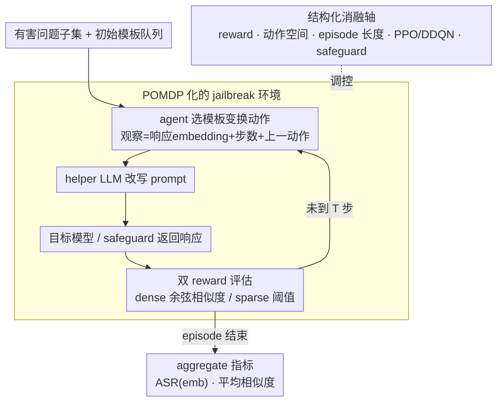

# A Systematic Investigation of RL-Jailbreaking in LLMs

**会议**: ICML 2026  
**arXiv**: [2605.07032](https://arxiv.org/abs/2605.07032)  
**代码**: 无公开代码 / 未确认  
**领域**: LLM安全  
**关键词**: LLM安全、自动化红队、强化学习、越狱评测、奖励设计  

## 一句话总结
这篇论文把 RL-based LLM jailbreaking 当作一个可拆解的 POMDP 系统来研究，发现奖励函数、episode 长度和训练问题数量等环境定义因素，比单纯换 RL 算法更大程度决定自动化红队成功率。

## 研究背景与动机
**领域现状**：LLM 越来越多地被用作 agent，能够调用工具、规划多步任务并处理高风险场景。安全评估也从手写 prompt、静态 jailbreak 模板，逐步走向自动化红队和多轮交互攻击。

**现有痛点**：已有 RL jailbreaking 工作常把 RL agent 当成黑盒攻击器，只报告能否绕过目标模型或 safeguard，却较少解释成功来自哪里。reward、action space、episode length、训练数据规模、RL 算法这些组件混在一起，导致防守方很难判断应该强化哪一环。

**核心矛盾**：RL 的优势在于序列决策和探索，但 LLM safety 环境中的反馈稀疏、动作是自然语言模板变换、目标模型和 safeguard 又会共同改变可观察状态。若没有组件级分析，攻击成功率既难复现，也难转化为防御启发。

**本文目标**：论文不是提出更强的 jailbreak 方法，而是系统拆解已有 RL-jailbreaker 框架，量化环境 formalization 和 algorithmic design 对 adversarial success 的影响。

**切入角度**：作者采用 RL-centric 视角，把目标 LLM、helper LLM、prompt/response safeguard 和有害问题集合组成一个环境，把 adversary 视作在该环境里学习模板变换策略的 agent。

**核心 idea**：把 RL jailbreaking 拆成 reward、action、episode、数据量和算法等可控轴逐项消融，用 aggregate 指标理解自动化红队为何有效。

## 方法详解
论文的核心是一套实验性分解框架。作者沿用已有 RL-jailbreaker 设定：agent 不直接生成完整有害内容，而是选择模板变换动作；helper model 根据动作改写模板；改写后的 prompt 被送入目标模型或 safeguard；环境用输出与参考语义的相似度给出反馈。论文避免把重点放在具体成功 prompt，而是报告统计指标和组件影响。

### 整体框架
环境被形式化为 POMDP。隐藏状态包括目标 LLM、safeguard 和当前 prompt 模板的内部配置；agent 只能观察由当前文本响应编码出的向量、步数、终止标志和上一动作编号。动作空间是有限离散的模板变换集合。每个 episode 从有害问题子集和初始模板队列开始，agent 最多交互 $T$ 步；每步选择一个模板变换，helper LLM 执行改写，然后目标模型或 safeguard 返回响应。

实验目标模型包括 Llama-3.2-1B/3B-Instruct、Qwen3-4B-Instruct-2507 和 Tiny-aya-global；防御环境还加入 Llama-Guard 或 ShieldGemma 的 prompt/response 两侧过滤。训练数据来自 AdvBench 子集，包含 harmful question 和来自未对齐 Vicuna 的参考回答。论文用 55 个随机种子，并报告 bootstrap 95% 置信区间。

### 关键设计
**1. POMDP 化的 jailbreak 环境：把红队交互变成可逐项消融的标准 RL 问题。** 已有 RL-jailbreaker 多把 agent 当黑盒攻击器，reward、动作空间、episode 长度、训练数据和算法混在一起，攻成功了也说不清是哪一环起作用。本文先把多轮红队交互形式化为 POMDP：隐藏状态是目标 LLM、safeguard 与当前模板配置，agent 只能观察一个由当前响应的 embedding、时间步、终止标志和上一动作编号拼成的向量，动作则限定在一个固定的离散模板变换集合里——选一个变换，helper LLM 据此改写 prompt，目标模型或 safeguard 再返回响应和 reward。把环境边界这样定死之后，reward、动作、episode 才能被单独替换、逐轴消融，成功率也才可能归因到具体组件，而不是笼统地归给“模型本来就脆弱”。

**2. 双 reward 评估：用 dense 与 sparse 两种信号对照，看反馈形态如何左右学习。** dense reward 取模型输出与参考回答 embedding 的平均余弦相似度，给出连续的塑形信号；sparse reward 只在相似度超过阈值、且输出不含明显拒绝词时才给一次正反馈。两者的差别很关键：面对强拒绝模型，sparse reward 会长时间为零，credit assignment 极其困难；dense reward 能持续提供方向，但连续相似度也可能把 agent 引向“像、却并未真正越狱”的输出。这一对照正是全文“环境定义比换算法更重要”的核心证据——多数目标模型上 dense reward 的成功率最高。

**3. 结构化消融轴：把成功因素拆到可复现维度，把“会被攻破”变成“该加固哪一环”。** 只报一个总 ASR 只能说明模型会被攻破，却不能告诉防守方该优先收紧交互长度、奖励代理、数据覆盖还是算法。于是作者沿动作空间大小、episode 长度、reward shaping bonus、训练问题数量、PPO vs DDQN、以及 safeguard 组合逐轴独立变化，并用 55 个随机种子加 bootstrap 95% 置信区间报告结果。正是这套消融得出了那些可指导防御的结论：reward 密度和 episode 长度比换算法更决定成功率、20 个训练问题反而优于 5 个和 520 个、在有限交互预算下扩大动作空间反而更难攻击。

### 损失函数 / 训练策略
PPO 和 DDQN 都使用两层前馈网络实现 policy 或 Q-function。PPO 作为已有 RL-jailbreaker 的主力算法，DDQN 用来测试 value-based 方法是否也适合这个红队环境。所有主要结果用 55 个种子，指标包括平均 cosine similarity 和 embedding-based ASR，后者要求语义相似度达到阈值且输出不含常见拒绝词。论文明确不使用 LLM-as-a-judge，因为对抗场景下 judge 的可靠性容易退化。

## 实验关键数据

### 主实验
主表对比原始 harmful prompt baseline、sparse reward RL 和 dense reward RL。下面保留最能说明趋势的 ASR(emb) 与平均相似度。

| 目标模型 | 配置 | ASR(emb) | Avg. Cosine Sim. | 结论 |
|--------|------|----------|------------------|------|
| Llama-3.2-1B | Baseline | 13.75% | 0.58 | 静态输入大多被拒绝 |
| Llama-3.2-1B | Sparse Reward | 32.4% | 0.61 | RL 明显提高成功率 |
| Llama-3.2-1B | Dense Reward | 36.8% | 0.63 | dense 信号最好 |
| Llama-3.2-3B | Baseline | 25.0% | 0.54 | 安全对齐仍有缺口 |
| Llama-3.2-3B | Dense Reward | 35.2% | 0.61 | dense reward 稳定提升 |
| Qwen3-4B | Baseline | 16.3% | 0.41 | baseline 最低 |
| Qwen3-4B | Sparse Reward | 63.1% | 0.65 | sparse 在该模型上最强 |
| Tiny-aya-global | Baseline | 38.8% | 0.64 | 初始脆弱性较高 |
| Tiny-aya-global | Sparse Reward | 59.2% | 0.68 | 短路径漏洞更容易被 sparse 捕捉 |

### 消融实验
| 配置 | 关键指标 | 说明 |
|------|---------|------|
| Dense reward + safeguard | 多数 target-safeguard 组合优于 sparse | 多层防御让反馈更稀疏，dense reward 提供更稳定学习信号 |
| 扩展 action space | PPO / DDQN 均低于原始 action space | 更多变换增加探索和 credit assignment 难度，不等于更强攻击 |
| Episode length | Llama 更受益于 20/50 步，Qwen 更偏好 5 步 | 最优交互长度与目标模型安全机制有关 |
| Reward bonus | bonus=10/20 没有明显收益 | 原始 dense reward 已足够，高幅度离散奖励可能扰乱优化 |
| 训练问题数量 | 20 个问题优于 5 个和 520 个 | 太少会过拟合，太多会让模式更杂，适中覆盖更利于学习 |
| DDQN vs PPO | DDQN 表现接近 PPO | value-based RL 是可行但未充分探索的红队方向 |

### 关键发现
- 环境 formalization 是主导因素：reward density 和 episode horizon 往往比换算法更影响成功率。
- 更大的动作空间并不总是好事，尤其在有限交互预算下，扩展动作会放大探索难度。
- 不同目标模型的脆弱性形态不同：有些需要长交互逐步绕过，有些短交互就能触发失败模式。
- Safeguard 不是单一屏障；不同 guard 的拦截能力差异明显，ShieldGemma 在实验中通常更难绕过。

## 亮点与洞察
- 论文把攻击研究转成“机制审计”，这比单纯追求更高 ASR 更有防御价值，因为它告诉我们哪些环境设计会放大自动化攻击能力。
- 不依赖 LLM-as-a-judge 是一个稳健选择。对抗文本会专门欺骗 judge，用 embedding 和拒绝词规则虽不完美，但更可控、更容易复现。
- “20 个训练问题最好”这个结果很有启发：红队训练并非数据越多越强，过宽的数据分布可能稀释可迁移的攻击策略。

## 局限与展望
- 评测只覆盖小规模 open-weight LLM，没有验证闭源模型、大模型和多模态模型；结论不能直接外推到真实部署系统。
- ASR(embedding) 仍是代理指标，可能把语义相似但实际危害不同的输出混在一起，也可能漏掉更隐蔽的违规内容。
- 论文以组件独立消融为主，尚未充分研究 reward、episode length、safeguard 类型之间的交互效应。
- 从防御角度看，后续可以把这些发现用于 co-evolutionary self-play，让攻击 agent 和 mitigation agent 共同训练，但需要严格控制双用途风险。

## 相关工作与启发
- **vs 手写 jailbreak / prompt engineering**: 传统方法依赖人工经验，本文关注自动化序列决策；优势是可系统搜索，风险是滥用门槛降低。
- **vs RLHF / attacker LLM fine-tuning**: 许多工作用 PPO 微调攻击模型，本文更像对模板搜索 agent 的环境机制审计，计算和解释边界更清楚。
- **vs safeguard evaluation**: 普通 safeguard benchmark 多是静态输入，本文显示多轮优化会暴露新的鲁棒性缺口，因此部署评测应包含 sequential adversary。
- **启发**: 做 LLM 安全评估时，不应只问“模型是否拒绝单个 prompt”，还要问“在给定交互预算和奖励代理下，自动化 agent 能否逐步逼近失败状态”。

## 评分
- 新颖性: ⭐⭐⭐⭐☆ 新方法不是重点，但把 RL-jailbreaking 系统性拆解这一点很有价值。
- 实验充分度: ⭐⭐⭐⭐☆ 消融维度丰富、种子数多；不足是模型规模和真实部署覆盖有限。
- 写作质量: ⭐⭐⭐⭐☆ 结构清楚，安全边界有说明；部分图表结果需要结合正文理解。
- 价值: ⭐⭐⭐⭐☆ 对红队评测和 safeguard 设计都有直接启发，但实际应用必须谨慎控制双用途风险。

<!-- RELATED:START -->

## 相关论文

- [\[ICML 2026\] EvoGM: Learning to Merge LLMs via Evolutionary Generative Optimization](evogm_learning_to_merge_llms_via_evolutionary_generative_optimization.md)
- [\[ICML 2026\] Esoteric Language Models: A Family of Any-Order Diffusion LLMs](esoteric_language_models_a_family_of_any-order_diffusion_llms.md)
- [\[ICML 2026\] SpatialReward: Bridging the Perception Gap in Online RL for Image Editing via Explicit Spatial Reasoning](spatialreward_bridging_the_perception_gap_in_online_rl_for_image_editing_via_exp.md)
- [\[ICML 2026\] Principled RL for Flow Matching Emerges from the Chunk-level Policy Optimization](principled_rl_for_flow_matching_emerges_from_the_chunk-level_policy_optimization.md)
- [\[ICLR 2026\] EditScore: Unlocking Online RL for Image Editing via High-Fidelity Reward Modeling](../../ICLR2026/image_generation/editscore_unlocking_online_rl_for_image_editing_via_high-fidelity_reward_modelin.md)

<!-- RELATED:END -->
