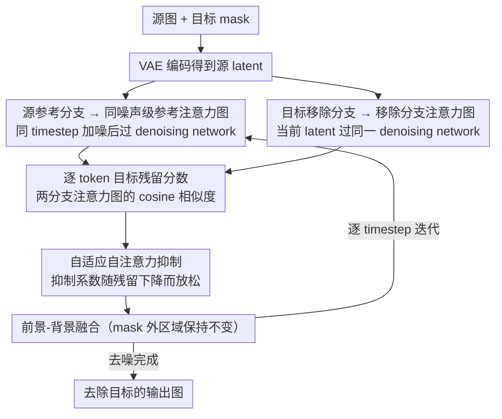

# AdaEraser: Training-Free Object Removal via Adaptive Attention Suppression

**会议**: ICML 2026  
**arXiv**: [2605.15921](https://arxiv.org/abs/2605.15921)  
**代码**: 无  
**领域**: 图像生成 / 扩散图像编辑  
**关键词**: 目标移除, 训练无关编辑, 自注意力抑制, 扩散模型, 图像修复  

## 一句话总结
AdaEraser 用“目标残留程度”自适应调节扩散模型 self-attention 抑制强度，在不训练新模型的情况下同时提升目标删除完整性和背景重建质量，并在 Mulan 与 OABench 上超过训练式和 training-free object removal 方法。

## 研究背景与动机
**领域现状**：扩散模型已经成为图像生成和编辑的主流基础模型。目标移除通常被视为 inpainting 的特殊形式：用户给出图像和 mask，模型要删除 mask 内目标，同时让空洞区域与周围背景自然衔接。

**现有痛点**：训练式 object removal 方法依赖专门数据集、adapter 或微调，成本较高；training-free 方法则尝试直接利用预训练扩散模型的 generative prior。近期强方法如 AttentiveEraser 会在 self-attention 中阻断图像 token 对目标区域 token 的注意力，能删掉目标，但容易破坏 mask 内背景生成，因为背景修复本身也需要区域内外的全局 self-attention。

**核心矛盾**：目标移除同时包含两个目标：压制目标概念、恢复合理背景。强抑制有利于删除目标，却会让背景缺少上下文；弱抑制保留生成能力，却可能让目标残留。固定强度或整块区域统一抑制都难以处理不同 token、不同 timestep、不同 layer 的变化。

**本文目标**：设计一个无需训练的自适应 self-attention 调制方法，在目标仍然明显时强抑制，在目标逐渐消失后放松抑制，让预训练扩散模型重新发挥背景生成能力。

**切入角度**：作者观察到，目标区域 token 的 self-attention map 会随着 denoising 逐步反映语义内容；同一 token 在原图参考分支和移除分支中的 attention map 相似度，与该 token 对应目标概念是否仍存在高度相关。

**核心 idea**：用原图参考 attention map 和当前移除过程 attention map 的 token-wise cosine similarity 作为 presence score，再把 $1-p(i)$ 转成每个 key token 的 adaptive suppression coefficient。

## 方法详解
AdaEraser 不改变扩散模型参数，也不训练额外网络。它在每个 denoising step 同时跑一个 source reference 分支和一个 target removal 分支：source 分支把原图 latent 加到同一噪声级别后过一次 denoising network，用来得到参考 self-attention map；target 分支则执行目标移除。两个分支的 attention map 在同一 timestep、同一 layer、同一 token 上比较，从而估计目标残留。

### 整体框架
给定源图 $I^{src}$ 和目标 mask $M$，先用 VAE encoder 得到 latent $x_0^{src}$。对每个 timestep $t$，source 分支构造 $x_t^{src}=\sqrt{\bar\alpha_t}x_0^{src}+\sqrt{1-\bar\alpha_t}\epsilon$，并用 denoising network 提取 self-attention maps $SA^{src}_{t,l}$。target 分支从加噪源图初始化，得到当前 $x_t^{tgt}$，通过同一个 denoising network 得到 $SA^{tgt}_{t,l}$。

对 mask 内每个 token $i$，方法计算 $p(i)=Sim(SA^{tgt}_{t,l}(i),SA^{src}_{t,l}(i))$。如果 target 分支的 attention map 仍像原图中的目标 token，说明目标概念残留较强；如果相似度下降，说明该位置更像背景或新内容。随后令 $\eta(i)=1-p(i)$，并把它乘到 self-attention softmax 的 key token 权重上。最后，方法沿用 foreground-background blending，用 mask 保留非编辑区域的一致性。整条流水线按下图在每个 denoising step 上循环：

### 关键设计

**1. 同噪声级参考注意力图**：presence 分数要拿当前去噪状态去对比“目标还在时注意力本该长什么样”，而 self-attention map 与噪声强度强相关——参考若取错噪声级，分数就会混入噪声尺度差异而非语义残留。AdaEraser 因此既不做完整 DDIM inversion、也不固定取某一噪声层，而是在每个 timestep 都用同一噪声级别的源 latent 过一次 denoising network，得到与移除分支严格同 $t$、同 layer 的参考 $SA^{src}_{t,l}$。消融里换成固定低噪声 $x_1$、中噪声 $x_{T/2}$、高噪声 $x_T$ 作参考都不如逐步对齐的 $x_t$，印证了噪声级对齐才能给出稳定的残留信号。

**2. 逐 token 目标残留分数（presence score）**：目标在 latent 里无法直接检测，而原图 token 与去噪过程 token 又处于不同特征空间、不能直接比。关键观察是 self-attention map 经 Softmax 归一化后跨分支可比，于是对 mask 内每个 token $i$ 把两分支的注意力图 flatten 后算 cosine similarity 得到 $p(i)$——它不声称是严格语义概率，只作一个相对控制指标。之所以做到 token 粒度而非整块区域平均：同一目标的头部、身体、尾部 token 的 self-attention pattern 各不相同，区域平均会抹掉这种差异；消融中 token-wise 也确实优于 region-based 与 timestep-based。

**3. 自适应自注意力抑制**：强抑制能删干净目标却破坏 mask 内背景生成，弱抑制保住生成能力却让目标残留——固定强度无法兼顾。AdaEraser 用残留分数动态调节：对 mask 内 key token 取 $\eta(i)=1-p(i)$、其余 token 取 $\eta(i)=1$，把注意力改写成 $\widetilde{SA}(i)=\eta(i)\exp(QK_i^\top/\sqrt d)/\sum_j\eta(j)\exp(QK_j^\top/\sqrt d)$，相当于给目标相关 key 加一个单调 logit bias。目标还在（$p$ 高）时 $\eta$ 小、强抑制；目标基本消失（$p$ 低）后 $\eta\to1$、放手让预训练模型正常生成背景。相比 AttentiveEraser 的硬阻断，它在“删除目标”和“重建背景”之间做到了逐步的动态折中。

### 损失函数 / 训练策略
AdaEraser 是 training-free 方法，没有额外训练损失。推理时使用预训练 text-to-image diffusion model 的 VAE、denoising UNet 和 decoder。论文主实验使用 SDXL 作为 backbone，空 prompt 作为文本条件。额外开销来自 source/target 两个 latent 的并行 denoising 和 presence score 计算，作者通过 concatenate 并行处理，使开销相对 AttentiveEraser 维持在约 15% 内。

## 实验关键数据

### 主实验
论文在 Mulan 和 OABench 两个 object removal benchmark 上比较训练式与 training-free 方法。AdaEraser 在 FID、LPIPS、PSNR、ReMOVE、CFD 和人类排序 AHR 上都取得最好或最优结果。

| 方法 | 是否训练 | Mulan FID↓ | Mulan PSNR↑ | Mulan ReMOVE↑ | Mulan AHR↑ | OABench FID↓ | OABench PSNR↑ | OABench ReMOVE↑ | OABench AHR↑ |
|------|----------|------------|-------------|---------------|------------|--------------|---------------|-----------------|--------------|
| AttentiveEraser | 否 | 54.040 | 22.7771 | 0.9000 | 5.46 | 40.373 | 23.2670 | 0.8215 | 5.43 |
| RORem | 是 | 53.470 | 23.5275 | 0.9048 | 6.22 | 39.215 | 23.4126 | 0.8281 | 6.23 |
| OmniPaint | 是 | 59.996 | 21.4493 | 0.8706 | 5.07 | 38.903 | 22.9257 | 0.7991 | 4.59 |
| AdaEraser | 否 | 51.108 | 23.5871 | 0.9065 | 7.08 | 38.472 | 23.5047 | 0.8316 | 6.81 |

### 消融实验
核心消融围绕 suppression strategy 和 reference selection。结果说明 token-wise 自适应和同 timestep reference 都是必要设计。

| 配置 | FID↓ | PSNR↑ | ReMOVE↑ | CFD↓ | 说明 |
|------|------|-------|---------|------|------|
| Timestep-based suppression | 38.831 | 23.4697 | 0.8263 | 0.2517 | 只按时间线性衰减，缺少语义感知 |
| Region-based suppression | 38.945 | 23.4674 | 0.8261 | 0.2499 | 整个 mask 一个分数，缺少 token 细粒度 |
| Token-wise suppression | 38.472 | 23.5047 | 0.8316 | 0.2450 | 本文方法，指标最好 |
| Reference $x_1^{src}$ | 38.595 | 23.4262 | 0.8223 | 0.2658 | 固定低噪声参考不如逐步对齐 |
| Reference $x_T^{src}$ | 38.829 | 23.4808 | 0.8241 | 0.2507 | 固定高噪声参考不稳定 |
| Reference $x_{T/2}^{src}$ | 38.713 | 23.4872 | 0.8262 | 0.2514 | 中等噪声参考仍不如同 timestep |
| Reference $x_t^{src}$ | 38.472 | 23.5047 | 0.8316 | 0.2450 | 噪声级对齐带来最好 presence score |

### 关键发现
- AdaEraser 的优势不是来自新训练数据，而是更好地使用预训练扩散模型内部 self-attention 动态。
- 对比 AttentiveEraser，AdaEraser 的推理时间从 13.98s 增到 15.41s，显存从 7966 MiB 到 9014 MiB，代价相对有限。
- presence score 在 timestep 上逐步下降，且不同 layer/token 有不同下降模式，这支持 token-wise adaptive 而不是全局 schedule。
- 方法对略松的 mask 较鲁棒，但 incomplete mask 会让物体阴影、反射或未覆盖部位残留。

## 亮点与洞察
- 这篇论文抓住了 object removal 的真实矛盾：不是越抑制越好，而是要在目标还存在时抑制、目标消失后放手让背景生成。
- 用 self-attention map 相似度做代理信号很巧妙，因为 Softmax 后的 attention map 在不同分支之间可比较，比直接检测 noisy latent 里的物体更稳定。
- token-wise 设计避免了 mask 内“一刀切”。对大物体、多部件物体或局部纹理复杂场景，这一点尤其重要。
- 附录给出的 KL-regularized interpretation 让 attention reweighting 不只是工程 trick，而可以理解为一种带语义惩罚的 attention 分布调整。

## 局限与展望
- presence score 是 heuristic proxy，不是严格语义概率。在相似纹理、重复背景或多个同类物体重叠时，attention 相似度可能不够区分目标与背景。
- 方法依赖 mask 质量。mask 漏掉阴影、反射或物体边缘时，AdaEraser 只能处理被明确标出的区域。
- 高度蒸馏的少步扩散模型上效果下降，因为方法依赖多步 denoising 中 attention 动态的逐渐演化。
- 未来可以结合自动 mask 扩展、结构约束或 scene-level prior，改善复杂结构背景恢复和 under-masked 情况。

## 相关工作与启发
- **vs AttentiveEraser**: AttentiveEraser 强行阻断目标区域 attention，删得干净但容易让背景失真；AdaEraser 根据残留动态调节强度，背景质量更好。
- **vs RORem / SmartEraser 等训练式方法**: 这些方法依赖专门数据和训练；AdaEraser 不训练也能超过它们，说明预训练扩散模型中已有足够 object/background prior。
- **vs text-driven suppression**: 仅操纵 cross-attention 或 text embedding 对小目标、多个相似目标不稳定；本文直接看 image token self-attention，定位更细。
- **启发**: 对 training-free diffusion editing，内部 attention 的时间演化可以作为控制信号，不一定需要额外分类器或分割器。

## 评分
- 新颖性: ⭐⭐⭐⭐ 用 token-wise attention similarity 做 adaptive suppression，设计简洁有效。
- 实验充分度: ⭐⭐⭐⭐⭐ 指标、用户研究、消融、效率、mask 质量和跨 backbone 分析都较完整。
- 写作质量: ⭐⭐⭐⭐ 动机和图示清楚，理论附录是解释性而非严格保证，主文表格较密。
- 价值: ⭐⭐⭐⭐⭐ 对 training-free 图像编辑和扩散模型 attention 控制很有实用价值。

<!-- RELATED:START -->

## 相关论文

- [\[CVPR 2026\] Precise Object and Effect Removal with Adaptive Target-Aware Attention](../../CVPR2026/image_generation/precise_object_and_effect_removal_with_adaptive_target-aware_attention.md)
- [\[CVPR 2026\] Object-WIPER: Training-Free Object and Associated Effect Removal in Videos](../../CVPR2026/image_generation/object-wiper_training-free_object_and_associated_effect_removal_in_videos.md)
- [\[ICML 2026\] CLEAR: Context-Aware Learning with End-to-End Mask-Free Inference for Adaptive Video Subtitle Removal](clear_context-aware_learning_with_end-to-end_mask-free_inference_for_adaptive_vi.md)
- [\[AAAI 2026\] Melodia: Training-Free Music Editing Guided by Attention Probing in Diffusion Models](../../AAAI2026/image_generation/melodia_training-free_music_editing_guided_by_attention_probing_in_diffusion_mod.md)
- [\[CVPR 2026\] HAM: A Training-Free Style Transfer Approach via Heterogeneous Attention Modulation for Diffusion Models](../../CVPR2026/image_generation/ham_a_training-free_style_transfer_approach_via_heterogeneous_attention_modulati.md)

<!-- RELATED:END -->
