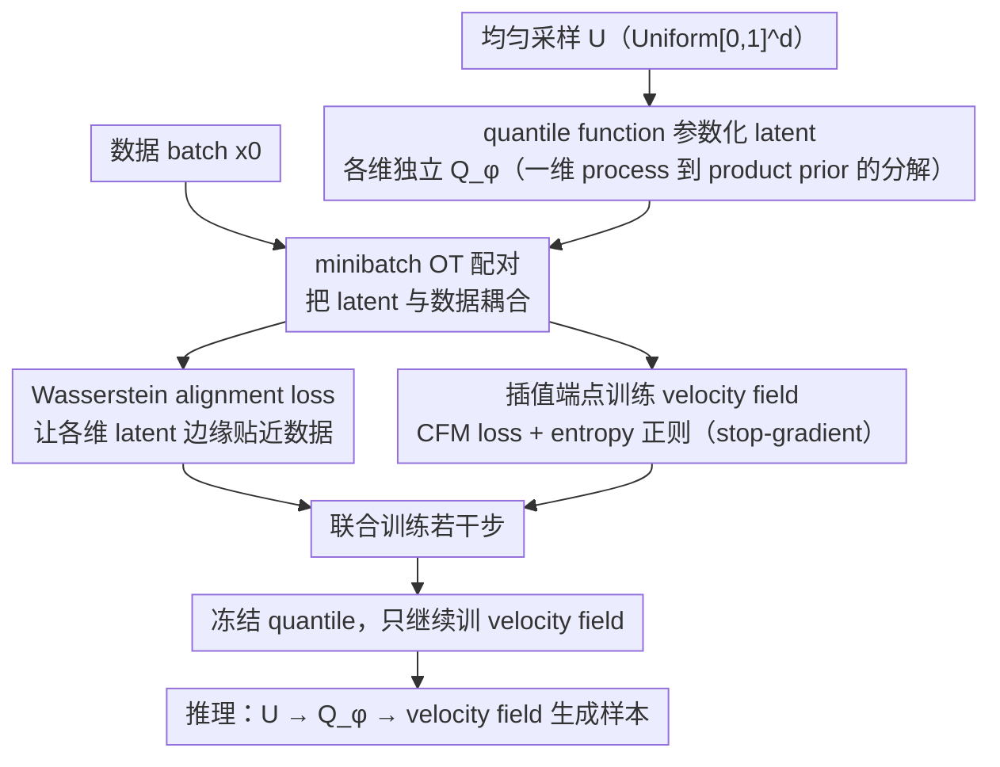

# Adapting Noise to Data: Generative Flows from Learned 1D Processes

**会议**: ICML 2026  
**arXiv**: [2510.12636](https://arxiv.org/abs/2510.12636)  
**代码**: https://github.com/TUB-Angewandte-Mathematik/Adapting-Noise  
**领域**: 图像生成 / Flow Matching  
**关键词**: flow matching, 数据自适应噪声, quantile function, 非高斯先验, 重尾生成建模  

## 一句话总结
本文认为 flow/diffusion 模型默认高斯 latent 并不总适合数据分布，提出用可学习的一维 quantile functions 构造数据自适应 product prior，在 flow matching 中联合学习噪声和速度场，从而缩短 transport path 并改善重尾天气数据和低容量图像生成表现。

## 研究背景与动机
**领域现状**：flow matching、diffusion 和 consistency-style 模型通常从简单 latent/noise 分布出发，再学习把 latent 推到数据分布的速度场或 score。默认选择几乎总是高斯，因为采样方便、理论成熟、各维独立。

**现有痛点**：高斯 latent 对重尾、紧支撑或强边缘结构的数据不一定合适。对于 heavy-tailed weather、Neal's funnel 这类目标，高斯起点会带来很长的 transport path，模型需要用速度场同时处理边缘 tail behavior 和跨维依赖。已有 heavy-tailed diffusion 会手动选 Student-t 或 alpha-stable noise，但尾部参数需要调，且不一定匹配每个维度的数据边缘。

**核心矛盾**：latent 需要足够简单以便采样和训练，又需要足够贴近数据边缘结构以降低 flow 学习难度。如果直接学习完整高维 prior，可能把相关性也塞进 latent，复杂且不稳定；如果固定高斯，又浪费模型容量处理本可由边缘 prior 解释的结构。

**本文目标**：学习一个仍然独立、可采样、轻量的 latent distribution，但让每个维度的边缘分布能适配数据，从而把跨维相关性交给 velocity field，边缘 support/tail 交给 quantile prior。

**切入角度**：一维分布可以由 quantile function 完整表示，且 Wasserstein-2 距离在一维上等价于 quantile functions 的 $L_2$ 距离。作者用 rational quadratic spline 参数化每个维度的 quantile，让 product latent 保持简单，同时可表达重尾、紧支撑和多峰边缘。

**核心 idea**：用一维 quantile functions 学习数据自适应噪声 $\mathbf{Q}_\phi(\mathbf{U})$，通过 Wasserstein alignment 和 flow matching loss 与速度场联合优化。

## 方法详解
论文先建立一个更一般的观点：高维 noising process 可以由独立的一维过程拼接而成，只要每个一维过程有可访问的 velocity field，就可以构造多维 flow matching 的 conditional velocity。随后作者把一维过程进一步写成 quantile process，让最终 latent 分布可学习。

### 整体框架
传统 flow matching 常用线性插值 $X_t=(1-t)X_0+tX_1$，其中 $X_1$ 来自高斯噪声。本文把 $X_1$ 替换成 $\mathbf{Q}_\phi(\mathbf{U})=(Q^1_\phi(U^1),\ldots,Q^d_\phi(U^d))$，其中 $U^i\sim\mathcal{U}(0,1)$。每个 $Q^i_\phi$ 是一维单调 quantile function，保证输出分布合法。

学习时，方法从数据 batch 和 quantile latent batch 之间计算 minibatch OT assignment，用这个 coupling 同时做两件事：一方面最小化 latent 与数据的 Wasserstein alignment loss，另一方面用 OT-coupled endpoints 训练 velocity field。训练若干步后冻结 quantile，只继续优化速度场，因此推理阶段几乎没有额外成本。

方法还讨论了更一般的一维 process，如 Kac process 和 MMD gradient flow，以及如何用 quantile interpolants 接到 few-step/IMM 类方法里。但主实验集中在最直接的 learned static quantile prior。训练流水线如下图：数据路与均匀 latent 路在 minibatch OT 处汇合，随后联合优化 quantile 与 velocity field，训足后冻结 quantile。

### 关键设计

**1. 一维 process 到高维 product prior 的分解**：想引入非高斯 latent，却不想手工设计高维噪声 PDE。作者令多维噪声 $\mathbf{N}_t=(N_t^1,\ldots,N_t^d)$ 的各维独立、每维有一维 velocity $v_t^i$，那高维 velocity 按分量拼接即可，而跨维相关性不由噪声承担、交给 learned velocity field。这么分工的好处是：Kac、uniform/MMD 这些一维过程在高维未必能直接定义，分量化构造让它们能用于任意维生成建模，同时 latent 保持独立、简单、可采样。

**2. quantile function 参数化 latent**：要让每维 latent 的边缘自动适配数据的 scale、support 和 tail，又不能太复杂。方法用 rational quadratic spline 表示 $Q^i_\phi$，用单调性约束保证它是合法 quantile；采样时只需先采 $U^i\sim\mathcal{U}(0,1)$ 再过 $Q^i_\phi$。选 quantile 是因为它对一维分布是通用表示，且天然与 Wasserstein-2 对齐（一维 $W_2$ 等价于 quantile functions 的 $L_2$ 距离）；相比手调 Student-t 的自由度，它能按维学出不同的尾部行为。

**3. Wasserstein alignment 与 FM 联合训练**：只靠 FM loss 学 latent 容易退化——quantile 会靠缩小端点位移来投机地压低 loss。为此目标函数取 $\mathcal{L}(\theta,\phi)=\mathcal{L}_{CFM}(\theta,\phi)+\lambda\mathcal{L}_{AN}(\phi)-\beta\mathcal{R}(\phi)$：$\mathcal{L}_{AN}=W_2^2(\mu_0,\nu_\phi)$ 直接做边缘匹配，$\mathcal{R}$ 是 log-det/entropy 正则；同一个 minibatch OT coupling 同时用于 alignment 和 OT-FM；velocity 目标用 $\mathrm{sg}(\mathbf{y}-\mathbf{x})$ stop-gradient，让 quantile 只能通过插值状态拿到梯度。这样 Wasserstein alignment 提供直接的边缘匹配信号，entropy 正则防高维小 batch 下 quantile collapse，stop-gradient 防 trivial collapse。训练若干步后冻结 quantile，之后只优化速度场，推理几乎无额外开销。

### 损失函数 / 训练策略
实践中每个 batch 采数据 $\{\mathbf{x}_i\}$ 和 uniform latent $\{\mathbf{u}_j\}$，计算 $\mathbf{y}_j=\mathbf{Q}_\phi(\mathbf{u}_j)$，再求最小化 $\|\mathbf{x}_i-\mathbf{y}_j\|^2$ 的 assignment。对被匹配的端点，插值 $\mathbf{z}_j=(1-t_j)\mathbf{x}_{P(j)}+t_j\mathbf{y}_j$，速度目标是 $\mathrm{sg}(\mathbf{y}_j-\mathbf{x}_{P(j)})$。stop-gradient 防止 quantile 通过缩小 endpoint displacement 来投机地降低 FM loss。

quantile 参数量很小：例如 CIFAR-10 上 $d=3072$、32 个 spline bins 时约 30 万参数，远小于 U-Net。论文报告 joint training 时约 2.7% overhead，冻结 quantile 后约 0.5% overhead。

## 实验关键数据

### 主实验
最有说服力的主结果来自 HRRR-mini 天气数据。该数据的总降水量具有强重尾，指标都围绕极端事件频率、极端强度和尾部分布拟合。

| 指标 | Gaussian baseline↓ | Student-t baseline↓ | Quantile (Ours)↓ | 解读 |
|------|--------------------|---------------------|------------------|------|
| Extreme event frequency error | 0.9689 | 0.8859 | 0.7550 | learned quantile 更能生成极端降水事件 |
| Extreme event magnitude error | 0.2455 | 0.1482 | 0.0634 | 极端事件强度最明显改善 |
| Spectral distance | 3.1836 | 2.0719 | 1.1063 | 空间频谱更接近真实天气场 |
| Tail KS distance | 0.2067 | 0.1014 | 0.0393 | 尾部分布拟合优于手调 Student-t |
| Kurtosis deviation | 4.930 | 2.890 | 1.588 | 峰度偏差降低 |
| Skewness deviation | 1.157 | 0.830 | 0.580 | 偏度偏差降低 |

图像生成上，MNIST 的边缘结构强，learned latent 在低容量 U-Net 下显著降低 FID；CIFAR-10 因空间/通道相关性强，product prior 改善较小但仍可保持竞争力。使用更大 55M 参数模型时，quantile prior FID 为 3.25，高斯为 3.37。

### 消融实验
CIFAR-10 上作者扫描 entropy 正则强度 $\beta$。多数设置在 20-step 和 100-step Euler sampling 下优于高斯 baseline，说明 quantile learning 稳定性较好，但正则过强也会退化。

| 配置 | FID @ 20 steps↓ | FID @ 100 steps↓ | 说明 |
|------|-----------------|------------------|------|
| Quantile, $\beta=0.2$ | 7.81 | 4.75 | 已优于 baseline |
| Quantile, $\beta=0.3$ | 7.48 | 4.53 | 20-step 最好 |
| Quantile, $\beta=0.5$ | 7.66 | 4.49 | 100-step 接近最好 |
| Quantile, $\beta=0.8$ | 7.77 | 4.42 | 100-step 最好 |
| Quantile, $\beta=1.0$ | 8.35 | 4.66 | 正则偏强，20-step 退化 |
| Gaussian baseline | 8.42 | 4.63 | 默认高斯起点 |

### 关键发现
- learned quantile 对重尾数据最有价值。HRRR 中所有 tail-centric 指标都明显优于 Gaussian 和 Student-t，说明按维度自动学习尾部比手调分布更稳。
- product prior 不负责学习跨维相关性，因此 CIFAR-10 上提升较小是预期结果；它主要减轻边缘分布和 support/tail 的负担。
- 在 checkerboard 和 funnel 这类低维例子里，learned latent 明显缩短 transport path，速度场更快收敛。
- 正则项 $\beta$ 是稳定训练的关键。没有合适的 entropy/log-det 约束，高维小 batch 下 quantile 可能过度收缩或产生不稳定梯度。

## 亮点与洞察
- 论文把“噪声分布选择”从手工超参数变成可学习对象，同时仍保持 latent 简单可采样，这是很实用的折中。
- quantile function 是一个优雅切入点：一维表达力强、单调性可控、Wasserstein 几何明确，避免了学习完整高维 prior 的复杂性。
- 将同一个 minibatch OT coupling 同时用于 alignment 和 OT-FM 很经济，减少了额外算法部件。
- 对重尾科学数据的实验比单纯图像 FID 更能体现方法价值，因为高斯 prior 的局限在极端事件建模中会被放大。

## 局限与展望
- learned latent 是 product distribution，不能直接表示维度间相关性。对自然图像这类相关性主导的数据，收益有限。
- 高维下 quantile learning 的信号来自 minibatch OT，batch size 固定时可能有噪声，需要正则和冻结策略稳定训练。
- 论文尚未系统测试更高维、更大分辨率或 text-to-image 条件生成，能否在大规模 diffusion 系统中保持收益还需验证。
- 未来可以学习 time-dependent quantile process，优化整条 path 而不只是 endpoint prior；也可以探索 conditional quantile，用类别或文本条件调节 latent 边缘。

## 相关工作与启发
- **vs Gaussian diffusion/FM**: 标准高斯简单但轻尾，对重尾目标不匹配；本文用 learned quantile 自动调 tail/support。
- **vs Student-t / alpha-stable noise**: 重尾噪声需要人工选择 family 和参数；本文直接从数据学习每维 quantile，避免手调自由度。
- **vs normalizing-flow prior**: 完整 flow prior 表达力更强但复杂；本文刻意限制为 product prior，把相关性交给 velocity field，保持训练轻量。
- **启发**: 对生成模型而言，path 和 prior 不应总是默认高斯。先让 latent 捕捉简单边缘结构，再让主网络建模依赖关系，可能是更高效的分工。

## 评分
- 新颖性: ⭐⭐⭐⭐⭐ 用 quantile functions 学数据自适应噪声，并系统接入 FM/一维 process 框架，思想很完整。
- 实验充分度: ⭐⭐⭐⭐ 合成、图像、天气数据覆盖面广，但大规模条件生成验证不足。
- 写作质量: ⭐⭐⭐⭐ 理论框架丰富，主线清楚，但附录和符号较多，阅读门槛偏高。
- 价值: ⭐⭐⭐⭐⭐ 对 flow matching、扩散 prior 设计和重尾科学生成建模都有较强启发。

<!-- RELATED:START -->

## 相关论文

- [\[ICML 2026\] The Coupling Within: Flow Matching via Distilled Normalizing Flows](the_coupling_within_flow_matching_via_distilled_normalizing_flows.md)
- [\[ICML 2026\] Path-Coupled Bellman Flows for Distributional Reinforcement Learning](path-coupled_bellman_flows_for_distributional_reinforcement_learning.md)
- [\[CVPR 2026\] Improved Mean Flows: On the Challenges of Fastforward Generative Models](../../CVPR2026/image_generation/improved_mean_flows_on_the_challenges_of_fastforward_generative_models.md)
- [\[NeurIPS 2025\] Flow Matching Neural Processes](../../NeurIPS2025/image_generation/flow_matching_neural_processes.md)
- [\[ICML 2025\] Normalizing Flows are Capable Generative Models](../../ICML2025/image_generation/normalizing_flows_are_capable_generative_models.md)

<!-- RELATED:END -->
