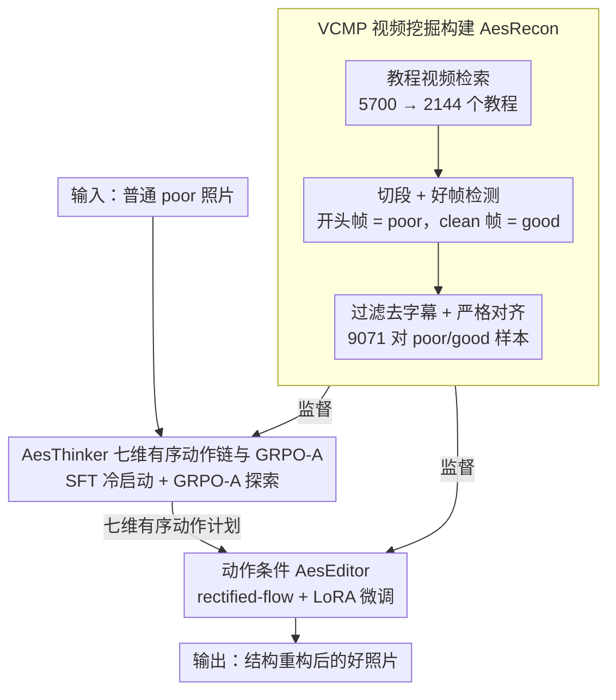

# AesFormer: Transform Everyday Photos into Beautiful Memories

**会议**: ICML 2026  
**arXiv**: [2605.22126](https://arxiv.org/abs/2605.22126)  
**代码**: https://github.com/PKU-ICST-MIPL/AesFormer_ICML2026  
**领域**: 图像生成 / 图像编辑  
**关键词**: 美学照片重建, 图像编辑, 结构重构, GRPO-A, AesRecon  

## 一句话总结
AesFormer 将日常照片美化定义为 Aesthetic Photo Reconstruction，通过先生成摄影动作计划再执行结构编辑的两阶段框架，把构图、视角和姿态等拍摄时错误转化为可执行编辑，并在 AesRecon 上显著优于开源编辑器、接近 Nano Banana Pro。

## 研究背景与动机
**领域现状**：照片后处理长期分成两类：一类是 retouching，主要调整曝光、对比度、色彩和整体风格；另一类是人像增强，主要做皮肤、面部和细节修饰。近年的扩散和 flow-matching 图像编辑模型已经能根据文本指令修改图像，但更多关注语义一致性和指令跟随。

**现有痛点**：很多普通照片的问题不是颜色不好，而是拍摄瞬间的结构决策不佳，例如主体位置偏、背景干扰、视角破坏纵深、姿态僵硬或构图失衡。传统 retouching 不能重拍构图，通用图像编辑器即使收到“更好看”这样的指令，也往往只能做局部外观调整，难以诊断并修复摄影结构问题。

**核心矛盾**：APR 要求模型一边保持人物身份和场景语义，一边重构构图、视角、姿态、景深等结构属性。它既不是简单美颜，也不是任意生成新图，而是要在“保真”和“美学重拍”之间找到平衡。

**本文目标**：作者提出 Aesthetic Photo Reconstruction 任务，构建严格对齐的 poor/good 图像对数据集，并训练一个能先理解摄影美学、再落地执行结构编辑的系统。

**切入角度**：论文把问题拆成两个模型：AesThinker 负责像摄影师一样分析输入照片并输出有顺序的编辑动作；AesEditor 负责把这些动作变成像素层面的结构重构。这样避免让一个图像编辑器同时承担美学诊断和复杂执行。

**核心 idea**：用摄影教程视频挖出 before/after 对，学习“从差照片到好照片”的动作计划，再用动作条件编辑器执行这些计划，把审美规划和图像重建解耦。

## 方法详解
AesFormer 的核心由数据、规划和编辑三部分组成。数据侧用 VCMP 从教程视频中挖出 AesRecon；规划侧训练 AesThinker 产生七个摄影维度上的有序动作；编辑侧训练 AesEditor 根据动作执行结构重构。

### 整体框架
输入是一张普通用户拍摄的 poor 照片。Stage 1 的 AesThinker 先读取照片和提示，输出一条有序动作计划，覆盖 aspect ratio、framing/composition、camera viewpoint、subject placement、pose/action、focus/depth-of-field、color/light 七个渐进维度。Stage 2 的 AesEditor 接收原图和动作计划，在 flow-matching 编辑器上生成重构后的照片。训练时，动作监督来自 AesRecon 中 poor/good 对以及教程视频文本线索；编辑监督来自严格对齐的 poor/good/动作三元组。整个 pipeline 由数据、规划、编辑三块串起，分别对应下面三个关键设计。

### 关键设计

**1. VCMP 视频挖掘构建 AesRecon：把"同主体同场景"的成对训练数据从教程视频里挖出来**

APR 的训练数据要求很苛刻——必须是同一主体、同一场景下的 poor/good 对，且美学差异要来自构图、姿态等拍摄结构，而非换人换景或调色，这种成对样本在现有图像集里几乎不存在。VCMP 抓住"摄影教程视频天然记录了同一拍摄事件从差拍到好拍的全过程"这一点：先用摄影教学关键词从 Rednote、TikTok、YouTube 检索 5,700 个候选视频，去重并剔除广告、纯展示、无分步演示的内容后留下 2,144 个教程；对每个拍摄事件按 2 fps 采帧，用 Qwen2.5-VL-72B 找出干净的 good frame、把事件开头帧当作 poor image，构成粗对。随后经三道精修——用画质/美学打分器和 VLM 滤掉低质 good 图、用 Qwen-Image-Edit 去掉 poor 图上的字幕和相机 UI（并让 GPT-4o 核验去除后场景与身份不变）、最后用 VLM 严格校验同人同景同事件——最终得到 9,071 对严格对齐样本。多阶段过滤之所以必需，是因为原始视频里夹杂广告、转场模糊和满屏叠加 UI，不清洗就无法变成可训练的结构差异对。

**2. AesThinker 的七维有序动作链与 GRPO-A：把模糊的"更好看"翻译成可执行、有先后的摄影动作**

通用编辑器收到"让照片更美"这类指令时无从下手，因为它既不知道这张照片结构上差在哪、也不知道该按什么顺序改。AesThinker 把美学规划落成一条七维有序动作链：aspect ratio → framing/composition → camera viewpoint → subject placement → pose/action → focus/depth-of-field → color/light，从全局构图逐级推进到局部光色。这个顺序不是随意排的——这些决策虽大体可分离，却存在单向依赖（如主体位置没定好之前谈景深关系就是病态的），固定顺序能稳住规划、得到可分解的动作空间。训练分两步：先用 GPT-5.2 依据 poor/good/文本线索蒸馏 ground-truth 动作、让 Gemini 3 校验完整性与七维顺序，再 SFT 冷启动 Qwen3-VL-8B。但只靠 SFT 会过拟合单条标注轨迹，而摄影审美本质是多解的（同一张照片换构图、换姿态、换景深都可能变好），单轨迹监督天生不完整。于是再用 GRPO-A 强化：对每张 poor 图采样多条动作计划，按"格式奖励 + 与参考动作的语义对齐奖励 + 创造性/美学提升奖励"组成总 reward（对齐和创造性由 Qwen2.5-VL-32B 作为 training-free reward model 打分，并对分数 token 取期望得到连续信号），用组内相对优势更新策略，从而鼓励多样但仍可执行的方案，突破 SFT 的单轨迹模仿。

**3. 动作条件 AesEditor：把高层摄影动作可靠地落到像素级的结构重构上**

上游有了动作计划，还需要一个真能把"改善构图/视角/姿态"稳定映射成像素变化的执行器——通用编辑器会听指令，却不一定会把这类结构性指令做对。AesEditor 以 Qwen-Image-Edit-2511 为底座，冻结多模态 encoder 和 VAE、只对 MMDiT 做 LoRA 微调；给定 poor image、good reference 和动作序列，在 rectified-flow 框架里学习动作条件的速度场，预测 $v_t=x_0-x_1$，推理时就按 AesThinker 输出的动作生成重构结果。用 APR 三元组（poor/good/动作）微调后，编辑器学到的正是"摄影动作 ↔ 结构重构"之间的对应关系，而不只是泛泛的指令跟随。

### 损失函数 / 训练策略
Stage 1(a) 使用标准自回归 SFT，最大化动作序列在输入照片和提示下的条件概率。Stage 1(b) 使用 GRPO-A：对同一输入采样多条动作序列，按组内 reward 标准化得到 advantage，并加 KL 到 reference policy；reward 权重为 $\lambda_f=0.1$、$\lambda_a=0.5$、$\lambda_c=0.4$。Stage 2 使用 flow-matching 损失 $\mathcal{L}_{edit}=\mathbb{E}\|v_\psi(x_t,t,h)-v_t\|_2^2$。实验在 10 张 NVIDIA A40 48GB GPU 上完成。

## 实验关键数据

### 主实验
| 方法 | Thinker | GPT-4o胜过Poor↑ | Human胜过Poor↑ | GPT-4o胜过Good↑ | Human胜过Good↑ | ArtiMuse↑ | LAION-V2↑ | Q-ALIGN↑ |
|------|---------|-----------------|-----------------|-----------------|-----------------|-----------|-----------|----------|
| Nano Banana Pro | None | 54.44 | 72.55 | 16.67 | 21.95 | 50.90 | 5.59 | 3.24 |
| FLUX.1 Kontext | None | 12.96 | 5.88 | 2.66 | 3.66 | 38.34 | 5.07 | 2.83 |
| Bagel | None | 12.40 | 17.65 | 7.75 | 12.20 | 37.69 | 4.94 | 2.58 |
| Step1X-Edit-v1.1 | None | 15.28 | 11.76 | 13.84 | 13.41 | 37.14 | 5.33 | 3.37 |
| Qwen-Image-Edit-2511 | None | 16.50 | 9.80 | 7.64 | 12.20 | 46.65 | 5.44 | 3.20 |
| AesFormer | AesThinker | 65.33 | 68.63 | 26.25 | 24.39 | 47.76 | 5.60 | 3.51 |

### 消融实验
| 配置 | GPT-4o胜过Poor↑ | GPT-4o胜过Good↑ | ArtiMuse↑ | LAION-V2↑ | Q-ALIGN↑ | 说明 |
|------|-----------------|-----------------|-----------|-----------|----------|------|
| Baseline (Edit-2511) | 16.50 | 7.64 | 46.65 | 5.44 | 3.20 | 只用基础编辑器 |
| S1a shuffle | 58.69 | 18.60 | 46.16 | 5.49 | 3.36 | 打乱七维动作顺序，性能低于有序链 |
| S1a | 61.04 | 24.58 | 47.70 | 5.58 | 3.48 | 只加入 SFT AesThinker |
| S1a + S2 | 61.13 | 24.14 | 47.74 | 5.58 | 3.46 | 加入动作条件编辑器，但没有 GRPO-A |
| S1a + S1b + S2 | 65.33 | 26.25 | 47.76 | 5.60 | 3.51 | 完整 AesFormer，GRPO-A 带来进一步提升 |

### 关键发现
- APR 对通用开源编辑器很难：FLUX、Bagel、Step1X、Qwen-Image-Edit 的 GPT-4o win rate vs. poor 大多只有 12–17%，说明它们很少真正改善结构美学。
- AesFormer 的 GPT-4o win rate vs. poor 达到 65.33%，超过 Nano Banana Pro 的 54.44%；human win rate vs. good 为 24.39%，也略高于 Nano Banana Pro 的 21.95%。这说明专门的 APR 数据和规划-编辑解耦能缩小开源系统与强闭源系统的差距。
- 外接通用 Thinker 不稳定。表 1 中给 FLUX、Bagel、Step1X、Qwen-Image-Edit 接 Qwen3 或 GPT-4o planner 并没有稳定提升，有时反而下降，说明问题不是“缺一个提示词生成器”，而是 planner 和 editor 都需要 APR 专门对齐。
- 七维顺序是重要归纳偏置。shuffle 后 GPT-4o win rate vs. poor 从 61.04 降到 58.69，说明先全局构图再局部姿态/光色的顺序确实帮助模型形成摄影工作流。

## 亮点与洞察
- 论文把“照片更美”拆成结构性摄影决策，而不是让模型泛泛生成审美描述。这让 APR 从主观口号变成可训练、可评估的 action-conditioned editing 任务。
- 用教程视频挖数据很聪明：教程天然包含 before/after、动作解释和同一拍摄事件，比从静态图像集合硬配 poor/good 更可靠。
- GRPO-A 的 reward 设计兼顾格式、对齐和创造性，比较符合美学任务的多解性质。它不是奖励唯一正确答案，而是奖励可执行且能带来美学收益的方案。
- AesFormer 的失败/成功对比说明，强编辑能力不等于摄影美学能力。编辑器需要知道“如何改像素”，但更需要上游 planner 知道“为什么这样改”。

## 局限与展望
- AesRecon 来自教程视频，风格和题材可能偏向教程创作者常用的人像、街拍和社交媒体摄影；对新闻、纪实、商业棚拍或非人像场景的覆盖还不明确。
- 评价大量依赖 GPT-4o 和审美打分器，虽然有人类子集验证，但美学偏好仍可能受 evaluator 偏差影响。更细的用户研究会更有说服力。
- Nano Banana Pro 只在 10% 测试子集上评估，API 成本限制使闭源对比不是完全等量。
- 结构重构可能改变真实记录，尤其在纪实照片中会带来真实性和伦理问题。后续需要可控编辑强度、变化解释和 provenance 标记。

## 相关工作与启发
- **vs photo retouching**: Retouching 主要调色调光，能改善观感但不能改变拍摄时的构图和视角；AesFormer 直接面向结构重构。
- **vs portrait enhancement**: 人像增强关注皮肤、面部和细节，通常是 appearance-centric；APR 更关注主体位置、姿态、景深和场景关系。
- **vs instruction image editing**: 通用编辑模型需要用户给出明确指令；AesFormer 自己先诊断照片问题并生成动作计划，更接近“摄影助手”。
- **vs EditThinker / iterative editing agents**: 相关工作强调编辑推理或多轮工具使用；本文的特色是为摄影美学定义了有序动作空间和严格对齐的数据来源。

## 评分
- 新颖性: ⭐⭐⭐⭐ APR 任务定义、教程视频挖掘和七维摄影动作链组合得比较新，GRPO-A 是合理但不算颠覆的增强。
- 实验充分度: ⭐⭐⭐⭐ 有新 benchmark、闭源/开源对比、自动和人工评估、阶段消融；但闭源模型只评 10% 子集。
- 写作质量: ⭐⭐⭐⭐ 故事线清楚，从数据瓶颈到规划-编辑解耦自然展开，表格解释也充分。
- 价值: ⭐⭐⭐⭐ 对图像编辑从“遵循指令”走向“审美诊断与主动修复”很有启发，数据构建方法也可复用。

<!-- RELATED:START -->

## 相关论文

- [\[CVPR 2025\] Memories of Forgotten Concepts](../../CVPR2025/image_generation/memories_of_forgotten_concepts.md)
- [\[CVPR 2025\] h-Edit: Effective and Flexible Diffusion-Based Editing via Doob's h-Transform](../../CVPR2025/image_generation/h-edit_effective_and_flexible_diffusion-based_editing_via_doobs_h-transform.md)
- [\[AAAI 2026\] Beautiful Images, Toxic Words: Understanding and Addressing Offensive Text in Generated Images](../../AAAI2026/image_generation/beautiful_images_toxic_words_understanding_and_addressing_offensive_text_in_gene.md)
- [\[ICML 2026\] SpatialReward: Bridging the Perception Gap in Online RL for Image Editing via Explicit Spatial Reasoning](spatialreward_bridging_the_perception_gap_in_online_rl_for_image_editing_via_exp.md)
- [\[ICML 2026\] 统一不同生成顺序的掩码扩散模型](unifying_masked_diffusion_models_with_various_generation_orders_and_beyond.md)

<!-- RELATED:END -->
