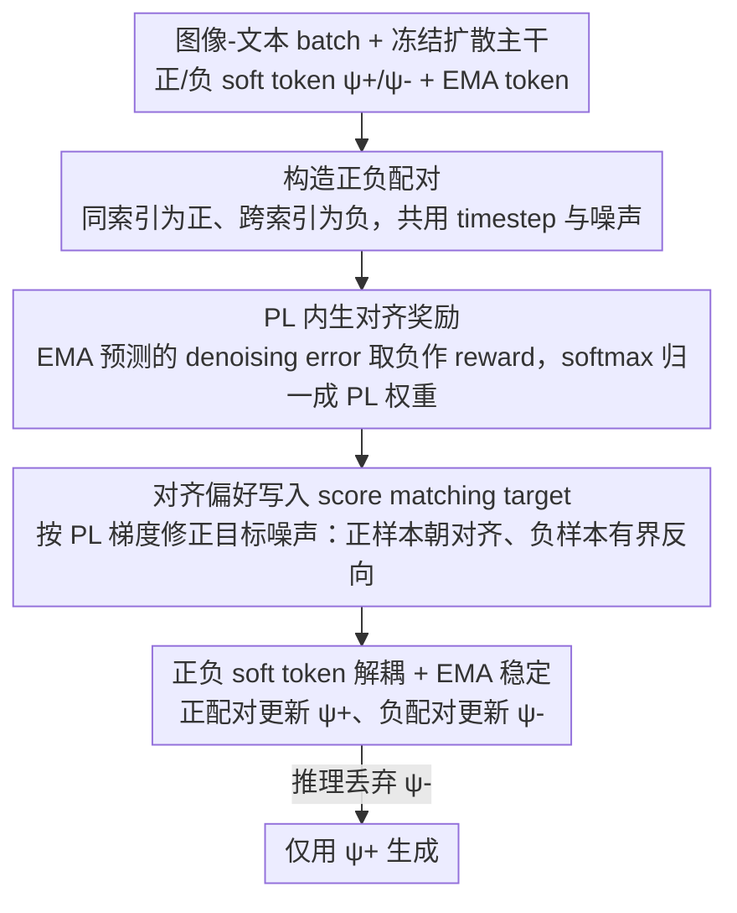

# Alignment-Guided Score Matching for Text-to-Image Alignment in Diffusion Models

**会议**: ICML 2026  
**arXiv**: [2605.30038](https://arxiv.org/abs/2605.30038)  
**代码**: 无公开代码；项目页: https://jaayeon.github.io/AGSM/  
**领域**: 图像生成 / 扩散模型 / 文本图像对齐  
**关键词**: 文本图像对齐、扩散模型、score matching、soft token、Plackett-Luce  

## 一句话总结
这篇论文提出 Alignment-Guided Score Matching，用 reward-free 的 Plackett-Luce 对齐奖励把正负文本-图像匹配信号直接写入扩散 score matching 目标，通过训练轻量 soft tokens 改善 T2I 语义对齐，同时缓解 SoftREPA 常见的重复生成和计数错误。

## 研究背景与动机
**领域现状**：SD1.5、SDXL、SD3 等扩散模型已经能生成高保真图像，但复杂文本约束下仍容易漏属性、错数量、错关系。后训练方法通常用人类偏好数据或外部 reward model 做 diffusion RL / DPO，提升美学或偏好分数。

**现有痛点**：reward-based 方法高度依赖 reward 质量和偏好数据，且不一定直接解决 diffusion process 内部的文本-图像表示对齐。SoftREPA 这类 reward-free 方法尝试优化 soft text tokens，用对比学习提高文本图像表征互信息，但其负样本项会不断推高 mismatched pair 的 denoising error，容易把 soft token 推向 off-manifold 区域，表现为重复物体、过计数和语义不连贯。

**核心矛盾**：文本图像对齐需要利用正负配对信号，但不能像普通 contrastive loss 那样无限惩罚负样本。扩散模型的 score matching 本来要求预测噪声保持在合理 denoising dynamics 中，如果负样本被推得过远，训练目标会改善表面对比损失，却破坏生成质量。

**本文目标**：作者希望保留 SoftREPA 的轻量、reward-free 和 soft-token 优势，同时把对比推拉改写成有界、归一化、直接作用于 score matching target 的引导项，从而在不训练全模型、不依赖外部 reward 的情况下提升 T2I 对齐。

**切入角度**：论文借鉴 Diffusion-DPO/DSPO 的思想，把偏好建模放到 diffusion score 层面。但不同于使用人类偏好，这里用模型自身的 denoising log-likelihood 构造 alignment reward，并用 Plackett-Luce 模型处理一个正文本和多个 in-batch 负文本。

**核心 idea**：把“正样本应该朝更高对齐 reward 移动、负样本应该被有界地推离”写成 score matching 的目标噪声修正，而不是用无界 contrastive loss 直接拉大负样本 denoising error。

## 方法详解
AGSM 冻结扩散模型主体，只训练少量 soft tokens。训练时，一个 batch 中图像 $x_i$ 与其原始文本 $c_i$ 构成正样本，与其他文本 $c_j$ 构成负样本。模型不再只让 positive pair 的 denoising prediction 靠近真实噪声，而是根据 PL reward 梯度修改目标噪声：正样本目标朝更对齐方向偏移，负样本目标朝相反方向偏移，但偏移由归一化权重控制，不会无限发散。

### 整体框架
输入是图像-文本数据集、冻结扩散 backbone、正/负 soft tokens $\psi^+$ 和 $\psi^-$、EMA soft tokens 以及 guidance scales $\gamma^+$、$\gamma^-$. 每轮训练采样一个 batch，把同索引 $(x_i,c_i)$ 作为正配对，把跨索引 $(x_i,c_j)$ 作为负配对；对所有配对使用相同 timestep 和噪声，计算当前 soft token 与 EMA soft token 下的噪声预测。EMA 预测用于估计 denoising error 形式的 alignment reward，再经 softmax 得到 PL 权重，最后构造目标噪声并更新对应 soft token。推理时丢弃负 token，只用正 soft tokens 参与 conditional 和 unconditional generation。

### 关键设计

**1. PL 内生对齐奖励：不靠外部 reward 也能给多候选文本打分**

这一步要解决的是“对齐信号从哪来”——reward-based 方法依赖外部 reward model 或人类偏好标注，成本高且未必对准扩散过程内部的文本图像对齐。AGSM 干脆用扩散模型自己的去噪能力当 reward：把 reward 定义为 reverse transition 的期望 log-likelihood，等价实现成负的 denoising error $r(x_t,c)=-\frac{A(t)}{2}\|\epsilon_{\theta}^{\hat{\psi}}(x_t,t,c)-\epsilon\|_2^2$——文本越匹配图像、去噪预测越准、reward 越高。再套 Plackett-Luce（PL）模型 $p(z=1|x_t,c)=\frac{\exp(r(x_t,c))}{\sum_i\exp(r(x_t,c_i))}$，算出“当前文本比同 batch 其他候选更匹配这张图”的概率。选 PL 而非 pairwise Bradley-Terry，是因为一张图在 batch 里对应一个正文本、多个负文本，PL 天然支持“一对多”归一化，比只能两两比较的 BT 更贴合 in-batch negative 的场景。

**2. 把对齐偏好写入 score matching target：负样本有界修正而非无限推远**

有了 PL 概率，关键问题是怎么用它——SoftREPA 在表征层做 contrastive 推拉，但它对负样本的惩罚没有上界，会把 soft token 推到 off-manifold，表现成重复、过计数。AGSM 改成在 score 层动手：正配对的目标分布偏向 $p_t^+(x_t|c)\propto p_t(x_t|c)\,p(z=1|x_t,c)^{\gamma^+}$，负配对偏向 $p_t^-(x_t|c)\propto p_t(x_t|c)\,p(z=1|x_t,c)^{-\gamma^-}$。对它们取梯度，目标 score 就等于原始 diffusion score 加上 $\gamma_z\nabla\log p(z=1|x_t,c)$，落到噪声预测上即是在真实噪声上加减一个由 PL reward 差分构成的修正项。这样负样本不再被无限推坏，而是沿一个归一化、有界的 preference gradient 微调；整个训练形式仍是 score matching，因此和扩散模型原本的去噪动力学保持一致，稳定性远好于无界 contrastive。

**3. 正负 soft token 解耦 + EMA 稳定：训练用负 token、推理只留正 token**

如果用一个共享 soft token 同时承接正、负配对的梯度，正语义增强和负语义抑制会互相打架——实验里这会把 ImageReward 从 103 砸到 47、CLIP 也跟着掉。AGSM 因此让正配对只更新 $\psi^+$、负配对只更新 $\psi^-$，两个 token 各管一摊；同时 reward 估计和目标修正都用 EMA soft token 的预测，避免训练早期 token 还没学好时引入的噪声反过来污染目标。另一处经验在采样阶段：负 token 若进入 CFG 的 unconditional 分支会过度抑制背景和细节、反而损害多样性，所以推理时直接丢掉 $\psi^-$、只用 $\psi^+$ 参与 conditional 与 unconditional 生成。“训练时用负 token 划边界、推理时不用”是稳定性与生成质量之间的折中。

### 损失函数 / 训练策略
主损失仍是噪声预测的平方误差，但目标从真实噪声 $\epsilon_t$ 变为对齐修正后的 $\epsilon_{\mathrm{tgt}}$。SD1.5 和 SDXL 使用 $\gamma^+=1,\gamma^-=1$，SD3 使用 $\gamma^+=1,\gamma^-=0.1$；batch size 为 16，对每个正配对有 3 个 in-batch negative。SD1.5 和 SD3 训练 100k iterations，SDXL 训练 1k iterations；优化器为 AdamW，学习率 $10^{-3}$，权重衰减 $10^{-4}$。SD1.5/SDXL 在 UNet Down/Middle blocks 上加 soft tokens，SD3 在上层 5 个 transformer layers 上训练 soft tokens。

## 实验关键数据

### 主实验
T2I 生成在 COCO-val 5K 和 GenEval 上评估。AGSM 的特点不是所有偏好分数都压过 SoftREPA，而是在明显改善 SoftREPA 失败项的同时取得更好的 FID trade-off。

| 模型 / 方法 | ImageReward | CLIP | HPSv2 | FID | GenEval Mean | Counting | 结论 |
|-------------|-------------|------|-------|-----|--------------|----------|------|
| SD1.5 | 17.72 | 26.40 | 25.08 | 24.59 | - | - | 原始模型对齐较弱 |
| SD1.5 + SoftREPA | 40.02 | 27.09 | 26.05 | 29.25 | - | - | 偏好分数高，但 FID 明显变差 |
| SD1.5 + Ours | 34.50 | 27.23 | 25.66 | 25.94 | - | - | CLIP 更高，FID 比 SoftREPA 好很多 |
| SDXL | 75.06 | 26.76 | 27.35 | 24.69 | - | - | 强 baseline |
| SDXL + Ours | 84.22 | 26.86 | 27.96 | 24.83 | - | - | 提升对齐，几乎不牺牲 FID |
| SD3 | 94.27 | 26.30 | 28.09 | 31.59 | 0.68 | 0.56 | 原始 SD3 已较强 |
| SD3 + SoftREPA | 108.50 | 26.91 | 28.91 | 36.21 | 0.70 | 0.29 | ImageReward 高，但计数严重退化 |
| SD3 + Ours | 103.30 | 27.00 | 28.22 | 34.08 | 0.72 | 0.64 | 计数从 0.29 提到 0.64，缓解过计数/重复 |

### 消融实验
论文围绕训练策略、采样策略、负 guidance scale、PL vs BT 和与 diffusion RL 的互补性做了分析。

| 配置 | 关键指标 | 说明 |
|------|----------|------|
| 只训练 $\psi^+$ on $\mathcal{D}^+$ | ImageReward 94.79，CLIP 26.93，FID 34.46 | 只用正样本已有收益，但没有充分利用负配对信息 |
| shared $\psi$ on $\mathcal{D}^+,\mathcal{D}^-$ | ImageReward 47.33，CLIP 25.68，FID 31.20 | 正负信号冲突，生成质量/对齐均退化 |
| separate $\psi^+,\psi^-$ (Ours) | ImageReward 103.30，CLIP 27.00，FID 34.08 | 正负 token 解耦是关键 |
| 推理使用 $\psi^+,\psi^-$ | ImageReward 84.53，FID 36.47 | 负 token 用于 unconditional 分支会过度抑制视觉细节 |
| 推理只用 $\psi^+$ (Ours) | ImageReward 103.30，FID 34.08 | 训练时用负 token，推理时不用更稳 |
| SD3 $\gamma^-=0$ | ImageReward 94.79 | 没有负引导时收益有限 |
| SD3 $\gamma^-=0.1$ | ImageReward 103.30，CLIP 27.00 | 负引导适中最好 |
| BT loss | ImageReward 29.67，CLIP 27.13，FID 24.76 | pairwise 形式不如多负样本 PL |
| PL loss (Ours) | ImageReward 34.50，CLIP 27.23，FID 25.94 | 多候选归一化更适合 in-batch negatives |

### 关键发现
- SoftREPA 的训练 loss 会继续下降，但 validation ImageReward 后期反而下降，说明 contrastive objective 存在过优化；AGSM 后期更稳定，不需要强依赖 early stopping。
- 图像编辑上，AGSM 能在 CLIP alignment 和背景 LPIPS 之间形成更好的 Pareto front。以 SD3 RF-Inversion 为例，加入 AGSM 后 ImageReward 从 128.0 提到 132.3，CLIP/Whole 从 27.26 提到 29.07，SSIM 也略升。
- AGSM 与 DiffusionDPO、SPO、InPO 互补。比如 SD1.5 上 DiffusionDPO ImageReward 29.09，加入 AGSM 后 42.47；InPO 从 62.12 提到 67.95。
- 长 prompt 上也有效。UniGenBench++ 中 SD3 base ImageReward 82.33，SoftREPA 90.63，AGSM 98.01，同时 CLIP、PickScore、HPSv2 都最高。

## 亮点与洞察
- 论文很准确地指出 SoftREPA 的症结：负样本不是越远越好。在扩散模型中，把 mismatched pair 的 denoising error 无限推大，会破坏 score manifold，最终表现成重复和过计数。
- AGSM 的一个漂亮点是把对齐当作 score target 的方向修正，而不是额外加一个表征损失。这让方法和 diffusion training dynamics 更一致，也解释了为什么训练稳定性更好。
- 正负 soft token 的设计很实用：训练时需要负样本提供对齐边界，但推理时不应该让负 token 参与 CFG 去“删掉”内容。这个经验对其他 soft prompt / adapter 式生成模型后训练也有借鉴价值。

## 局限与展望
- 方法主要训练 soft tokens，容量轻量但也限制了可修正范围。对于需要大幅改变模型知识或构图能力的复杂关系，soft token 可能不够。
- AGSM 仍依赖现有 benchmark 的自动指标，如 ImageReward、CLIP、HPSv2、GenEval；这些指标不能完全代表真实人类偏好或安全性。
- 负样本来自 batch 内文本错配，虽然高效，但不一定覆盖最难的语义混淆。未来可以构造 hard negatives，如只改数量、颜色、空间关系的近邻文本。
- 推理时只用正 token 是经验最优，但负 token 是否能在更细粒度控制、概念擦除或安全过滤中发挥作用，还值得单独探索。

## 相关工作与启发
- **vs SoftREPA**: SoftREPA 用 contrastive learning 优化 soft tokens，简单高效但会过度惩罚负样本；AGSM 把正负指导转成有界 score matching 修正，减少重复和计数失败。
- **vs Diffusion-DPO / DSPO**: Diffusion-DPO 和 DSPO 依赖人类偏好或偏好对建模；AGSM 使用内生 denoising likelihood 构造 reward-free 对齐信号，目标更偏表示/文本图像对齐。
- **vs CaPO / RankDPO / InPO**: 这些方法主要做 preference optimization，AGSM 可作为 soft-token 模块叠加到它们上面，实验显示能进一步提高 COCO-val 指标。
- **vs negative prompt / CFG**: AGSM 的负分支类似给 mismatched text 一个 repulsive direction，但它发生在训练的 score target 中，而不是推理时手写负提示词，因此更稳定也更可学习。

## 评分
- 新颖性: ⭐⭐⭐⭐ 将 PL 偏好建模、score matching 和正负 soft token 结合，用 reward-free 方式解决 SoftREPA 负样本过推问题，思路清晰。
- 实验充分度: ⭐⭐⭐⭐⭐ 覆盖 SD1.5、SDXL、SD3，T2I、长 prompt、图像编辑、diffusion RL 组合和多组消融，验证很全面。
- 写作质量: ⭐⭐⭐⭐ 方法推导较密，但从 SoftREPA 失败到 AGSM 修正的逻辑顺畅，图表支撑充分。
- 价值: ⭐⭐⭐⭐ 对扩散模型轻量后训练和文本图像对齐很有实用价值，尤其适合与现有偏好优化方法组合。

<!-- RELATED:START -->

## 相关论文

- [\[ICML 2026\] Pareto-Guided Optimal Transport for Multi-Reward Alignment](pareto-guided_optimal_transport_for_multi-reward_alignment.md)
- [\[ICML 2026\] Restoring Initial Noise Sensitivity in Text-to-Image Distillation via Geometric Alignment](restoring_initial_noise_sensitivity_in_text-to-image_distillation_via_geometric_.md)
- [\[ICML 2026\] AG-REPA: Causal Layer Selection for Representation Alignment in Audio Flow Matching](ag-repa_causal_layer_selection_for_representation_alignment_in_audio_flow_matchi.md)
- [\[CVPR 2025\] Diff2Flow: Training Flow Matching Models via Diffusion Model Alignment](../../CVPR2025/image_generation/diff2flow_training_flow_matching_models_via_diffusion_model_alignment.md)
- [\[ICML 2026\] Rao-Blackwellized Score Matching on Manifolds](rao-blackwellized_score_matching_on_manifolds.md)

<!-- RELATED:END -->
