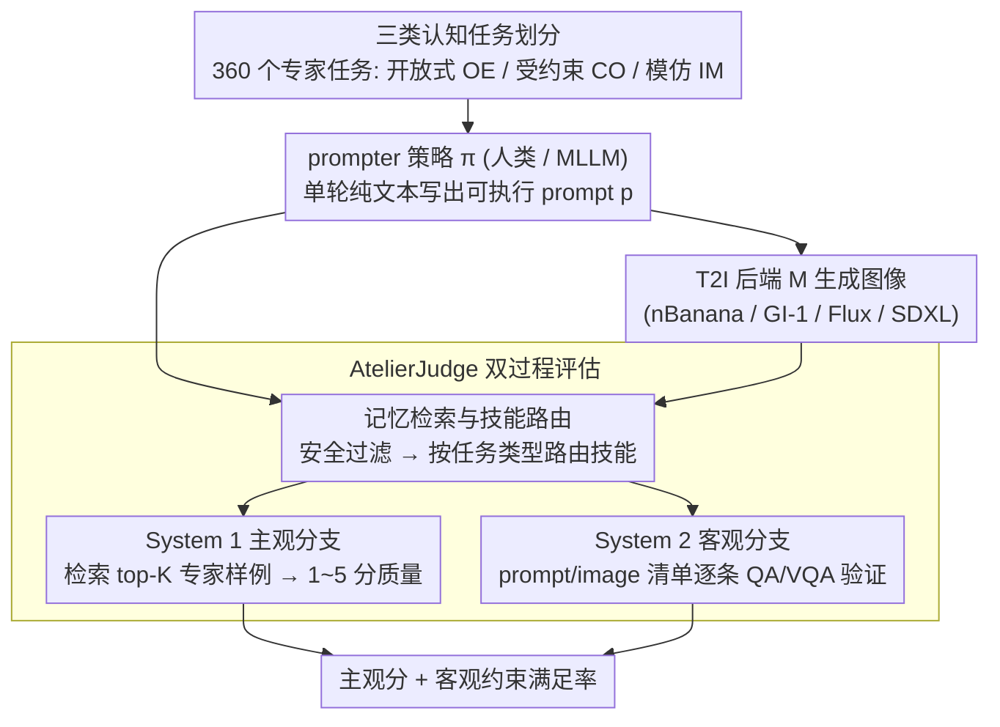

# AtelierEval: Agentic Evaluation of Humans & LLMs as Text-to-Image Prompters

**会议**: ICML2026  
**arXiv**: [2605.22645](https://arxiv.org/abs/2605.22645)  
**代码**: 论文说明已发布工具与数据，但缓存正文未给出仓库 URL  
**领域**: 图像生成 / T2I 评测  
**关键词**: 文本到图像, 提示词能力评测, Agent-as-a-Judge, 多模态大模型, 人机对比  

## 一句话总结
AtelierEval 首次把文本到图像流程中的“提示词编写者”作为评测对象，用 360 个专家任务、三类认知任务和 AtelierJudge agentic evaluator 系统量化人类与 MLLM 的提示词能力，并发现图像模仿式 prompting 往往比纯文本规划式 prompting 更可靠。

## 研究背景与动机
**领域现状**：文本到图像系统越来越强，用户输入通常不会直接进入生成模型，而是先经过人类 prompt engineer 或 MLLM 中间层转写成更可执行的 prompt。很多商业系统已经把 MLLM 作为隐式 middleware，也有高级创作者显式使用 MLLM 来拆解画面、风格和约束。

**现有痛点**：主流 T2I benchmark 基本都固定 prompt，然后评测生成模型本身。这样会忽略上游 prompter 的能力：同一个用户意图，如果由不同人或不同 MLLM 翻译成 prompt，最终图像质量和约束满足率可能差异很大。

**核心矛盾**：现有评测把“模型能不能执行 prompt”和“prompter 能不能把意图翻译成 prompt”混在一起。Prompt optimizer 也常在已有 prompt 上做局部润色，而不是评估从抽象意图到可执行 prompt 的通用翻译能力。

**本文目标**：论文希望建立一个统一 benchmark，专门测量人类和 MLLM 作为 T2I prompter 的内在能力，并且能同时评估主观美学质量和客观约束满足情况。

**切入角度**：作者把 prompting proficiency 形式化为策略 $\pi: I \rightarrow p$ 的能力，其中 $I$ 是用户意图，$p$ 是可执行 prompt，T2I 后端 $M$ 负责把 prompt 生成图像。评测目标不是固定 prompt 下哪个模型更强，而是 prompter 策略能否跨任务、跨后端稳定把意图转译好。

**核心 idea**：用认知科学启发的任务划分覆盖三种 prompting 能力，再用一个带技能路由和记忆检索的 AtelierJudge 同时做主观评分与客观 checklist 验证。

## 方法详解
AtelierEval 的核心贡献由两部分组成：一个面向 prompter 的 benchmark，以及一个可规模化评分的 agentic evaluator。Benchmark 负责生成足够真实、足够可诊断的任务；AtelierJudge 负责把每个 prompt-image pair 拆成主观质量和客观约束两条线分别评估。

### 整体框架
AtelierEval 包含 360 个专家设计任务，每类任务 120 个，覆盖 Open-ended Creation、Constrained Creation 和 Imitation 三个类别。OE 测试从抽象、叙事化需求中提取氛围、主题和风格；CO 测试在明确多约束下组织 prompt；IM 测试看图反推 prompt，把视觉内容编码成文字。

任务构造基于两组 challenge primitives：语义理解类包含 S1 抽象意图、S2 受众意图、S3 隐含风格、S4 语义否定；约束实现类包含 C1 属性绑定、C2 空间关系、C3 数量、C4 文本、C5 硬约束。专家把这些 primitives 组合进真实 T2I 应用场景，并用 24 个标签覆盖对象、角色、环境、风格、结构和主题。

交互协议被严格统一为 single-turn、纯文本 prompt。人类通过简化的 Gradio UI 输入 prompt，MLLM 通过标准 API 接收相同任务说明并输出 prompt。没有即时图像反馈，也不允许多轮 refinement，从而尽量隔离“第一次把意图翻译成 prompt”的能力。

### 关键设计
1. **三类认知任务划分：把提示词能力拆成可诊断的维度**

	现有 T2I benchmark 只给一个总分，看不出某个 prompter 到底强在创意扩展、约束执行还是看图复述哪一环——单一任务类型会把这几种本质不同的能力混在一起。作者借 Structure of Intellect 认知理论，把 prompter 策略 $\pi: I \to p$ 拆成三种构造性认知操作并各配 120 个专家任务（共 360 个）：开放式创作（OE，对应发散生产 divergent production）要求从抽象、叙事化需求中扩展出完整画面的氛围、主题与风格；受约束创作（CO，对应收敛生产 convergent production）要求在多条明确约束下组织 prompt；模仿（IM，对应认知 cognition）则看图反推 prompt、把视觉内容编码成文字。三类任务对应的失败模式各不相同，因此能直接读出人类和模型各自的能力短板，而不是只给一个笼统排名。

2. **AtelierJudge 双过程评估：主观与客观解耦**

	纯 MLLM judge 有个老毛病——容易把“好看”误当成“符合约束”，于是一张漂亮但漏掉文本、数量或空间要求的图也能拿高分（high-quality hallucination）。AtelierJudge 借 Dual-Process Theory 把评分拆成两条并行支路，分别作用在 prompt 和图像上：System 1 主观支路用一组 memory-augmented 的主观技能，对清晰度、创意展开、术语能力、意图形式化、氛围、构图、色光、技术瑕疵等维度打 1~5 分；System 2 客观支路则把每条任务约束拆成独立 checkpoint，用 prompt/image 配对清单（checklist）以 QA/VQA 方式逐条核验“约束有没有写进 prompt、有没有在图像里实现”。两条支路解耦后，分析性的约束核验不再被整体观感带偏，漂亮却违约的图也就不会被误判成整体优秀。

3. **记忆检索与技能路由：用专家样例锚定分数**

	直接让 MLLM 打分会普遍偏高、尤其分不清 4 分和 5 分，主观维度的分数梯度被压扁。AtelierJudge 给每个主观技能绑定一份专家标注的 gold exemplar memory，评分时用文本或图像 embedding 检索 top-K 相似样例，再结合评分准则和样例 rationale 给分——相当于给 evaluator 一个“本任务附近”的评分锚点，把被压扁的分数梯度重新拉开。整个流程先过安全过滤，再按任务类型把 prompt/image、主观/客观技能并行路由调度，使同一套 evaluator 能适配三类任务。消融显示，语义相似检索把 Spearman 排名相关从 zero-shot 的 0.56 提到 0.79，是评分逼近专家的关键，而非单纯换一个更强的 MLLM。

### 损失函数 / 训练策略
这篇论文不是训练新生成模型，而是设计评测协议和自动评分系统。主观指标使用 MAE、Within-1 accuracy 和 Spearman $\rho$ 对齐专家评分；客观指标使用 checkpoint-level Acc 和 F1；benchmark 结果则汇总 prompt-side / image-side subjective score 与 objective satisfaction rate。

在主实验中，每个 prompter-task pair 生成一个自然语言 prompt，每个 prompt 在每个 T2I 后端上生成 4 张图像，并保留 AtelierJudge 评分最高的 top-1 图像用于聚合。附录稳定性分析表明，增加 prompt 数或图像数后主观分和客观准确率曲线基本持平，因此一个 prompt、四张图的设置在成本和稳定性之间比较合理。

## 实验关键数据

### 主实验
实验分两层。第一层验证 AtelierJudge 是否接近专家评分；第二层用 AtelierEval 比较 8 个 MLLM、48 名人类用户和 4 个 T2I 后端。人类分为 24 名 novice 和 24 名 skilled users，T2I 后端包括 nBanana、GI-1、Flux Pro 和 SDXL。

| 实验对象 | 指标 | 关键数值 | 结论 |
|--------|------|------|------|
| Subjective meta-eval, GPT-5.4 | MAE / W1-A / Spearman $\rho$ | 0.33 / 0.95 / 0.81 | 接近人类专家 $\rho=0.83$，远高于 base $\rho=0.55$ |
| Objective meta-eval, GPT-5.4 | Overall Acc / F1 | 95.5% / 93.9% | prompt 与 image checklist 都达到高可靠性 |
| Prompt objective, skilled human | 平均 prompt Obj. | 80.6% | skilled human 在明确写入约束方面明显强 |
| Image objective, skilled human | 平均 Image Obj. | 76.7% | 人类 skilled prompt 在图像约束实现上也最高 |
| nBanana backend, skilled human | Obj. | 84.9% | 强 middleware 后端配合 skilled human 达到最高客观表现 |
| T0 MLLMs vs novice humans | 多后端综合 | T0 MLLMs 通常高于 novice humans | MLLM 已能显著提升普通用户 prompting 起点 |

### 消融实验
| 配置 | 关键指标 | 说明 |
|------|---------|------|
| Zero-shot judge | MAE 0.72, W1-A 0.64, $\rho=0.56$ | 直接评分偏乐观且区分度差 |
| Fixed Few-shot | MAE 0.55, W1-A 0.81, $\rho=0.68$ | 有统一标尺，但缺少任务相关校准 |
| Random Retrieval | MAE 0.61, W1-A 0.75, $\rho=0.62$ | 随机样例不稳定，可能引入噪声 |
| Similarity Retrieval | MAE 0.34, W1-A 0.93, $\rho=0.79$ | 语义相似样例最能提高专家一致性 |
| K=1 | MAE 0.56, W1-A 0.83, $\rho=0.63$ | 单个样例不足以校准复杂维度 |
| K=3 | MAE 0.34, W1-A 0.93, $\rho=0.79$ | 论文采用的最佳 retrieval 数量 |
| K=4 | MAE 0.35, W1-A 0.91, $\rho=0.78$ | 更多样例带来上下文噪声，收益下降 |
| CO on GI-1 | Direct 69.6%, GPT-5.2 novice 47.2%, skilled human 81.5% | 外部 MLLM 推理会与强 middleware 发生逻辑冲突 |
| IM on GI-1 | GPT-5.2 skilled 76.5%, Gem-3 skilled 77.5%, human skilled 70.4% | 看图模仿式 prompting 中 MLLM 反超 skilled human |

### 关键发现
- AtelierJudge 的记忆检索是核心，不只是“换一个更强 MLLM”。相似 exemplar 能显著降低 MAE，并把 Spearman 排名相关从 zero-shot 的 0.56 提到 0.79。
- 强 T2I middleware 会压缩不同 prompter 的主观图像质量差距。GI-1 和 nBanana 让图片看起来普遍不错，但这不等于约束都被正确满足。
- Constrained Creation 中出现“约束悖论”：在 GI-1 这类强 middleware 上，直接输入任务描述的 CO objective 反而有 69.6%，外部 MLLM reasoning 降到 45%-49% 区间，说明两个推理/重写系统可能互相冲突。
- Skilled humans 在硬约束 prompt 编写上仍很强，尤其 CO 任务中的 objective 分数明显领先。MLLM 的词汇和视觉编码强，但不一定能适应某个后端的内部重写机制。
- Imitation 任务揭示了未来方向：当有参考图像时，MLLM 可以细粒度识别视觉结构并转成 prompt，T0 MLLM 在 GI-1 上甚至超过 skilled human，支持 image-augmented prompting。

## 亮点与洞察
- 论文把 T2I 评测对象从“图像生成模型”前移到“prompter”，这个问题定义很重要。许多生成失败不是模型单方面失败，而是用户意图没有被稳定转写成可执行 prompt。
- 三类任务设计很有解释力：OE 测创意扩展，CO 测约束整合，IM 测视觉编码。它们对应的错误模式不同，因此能指导 prompt 教育和 agent 设计。
- AtelierJudge 的主客观解耦避免了常见评测陷阱。一个图像可以审美上漂亮但漏掉文本、数量或空间约束；分开打分才能看见这类 high-quality hallucination。
- “mimicry over planning” 是最有启发的实验结论。与其让 agent 纯文本规划复杂画面，不如让它先检索或观察视觉样例，再把图像结构迁移到目标需求中。
- 论文没有把人类和 MLLM 的比较简化成谁更强，而是指出 skilled human、T0 MLLM 和 T2I middleware 在不同任务上会产生不同互动关系。

## 局限与展望
- 人类实验样本集中在当前 T2I 活跃用户群体附近，存在人口统计偏差。AtelierJudge 的专家记忆也可能继承这些审美和文化偏好。
- Benchmark 限定为 single-turn、纯文本到图像，不覆盖多轮迭代、视觉反馈、工具调用、搜索式 prompt optimization 或人机协作工作流。
- 任务难度尚无客观统一指标。论文平衡了 challenge primitive 类型和数量，但没有显式建模哪些组合对人类或模型更难。
- 自动 evaluator 虽然有安全过滤和专家校准，但仍不应在高风险创作评价、劳动评价或商业纠纷中作为唯一依据。
- 未来可以扩展到 image-augmented prompting、人类-LLM 协作、多轮交互评测，以及能同时当 prompter 和 generator 的统一多模态模型。

## 相关工作与启发
- **vs 固定 prompt 的 T2I benchmarks**: 传统 benchmark 测模型执行能力，AtelierEval 测上游 prompt translation 能力。两者互补，但不能互相替代。
- **vs prompt optimization**: Prompt optimizer 常从已有 prompt 出发做模型特定润色，AtelierEval 关注从 intent 到 prompt 的通用能力，更接近真实创作入口。
- **vs CLIPScore / VQA-based evaluator**: 传统自动指标对复杂空间关系、文本渲染和审美细节相关性弱，AtelierJudge 用技能拆分和记忆校准提高解释性。
- **vs MLLM-as-a-Judge**: 普通 MLLM judge 容易自偏好和打高分，AtelierJudge 通过 retrieval memory、subjective/objective 解耦和 checklist 降低偏差。
- **启发**: 以后做 T2I agent 不应只优化最终图像分数，还要评估 agent 是否真正理解用户意图、是否能显式写入约束，以及是否能利用视觉样例降低纯文本规划负担。

## 评分
- 新颖性: ⭐⭐⭐⭐⭐ 把 prompter 作为独立评测对象并设计统一人机 benchmark，很有开创性。
- 实验充分度: ⭐⭐⭐⭐⭐ 覆盖 360 任务、8 个 MLLM、48 名人类、4 个 T2I 后端，并有 evaluator meta-eval、消融和稳定性分析。
- 写作质量: ⭐⭐⭐⭐☆ 主线清楚、信息量大，但模型名和表格非常密集，读起来需要反复对照。
- 价值: ⭐⭐⭐⭐⭐ 对 T2I 工具、prompt education、prompting agent 和自动评测都有直接参考价值。

<!-- RELATED:START -->

## 相关论文

- [\[CVPR 2026\] Agentic Retoucher for Text-To-Image Generation](../../CVPR2026/image_generation/agentic_retoucher_for_texttoimage_generation.md)
- [\[CVPR 2026\] OctoT2I: A Self-Evolving Agentic Text-to-Image Router](../../CVPR2026/image_generation/octot2i_a_self-evolving_agentic_text-to-image_router.md)
- [\[ICML 2026\] WISE: A World Knowledge-Informed Semantic Evaluation for Text-to-Image Generation](wise_a_world_knowledge-informed_semantic_evaluation_for_text-to-image_generation.md)
- [\[CVPR 2026\] Vinedresser3D: Agentic Text-guided 3D Editing](../../CVPR2026/image_generation/vinedresser3d_agentic_text-guided_3d_editing.md)
- [\[CVPR 2026\] GenColorBench: A Color Evaluation Benchmark for Text-to-Image Generation](../../CVPR2026/image_generation/gencolorbench_a_color_evaluation_benchmark_for_text-to-image_generation.md)

<!-- RELATED:END -->
