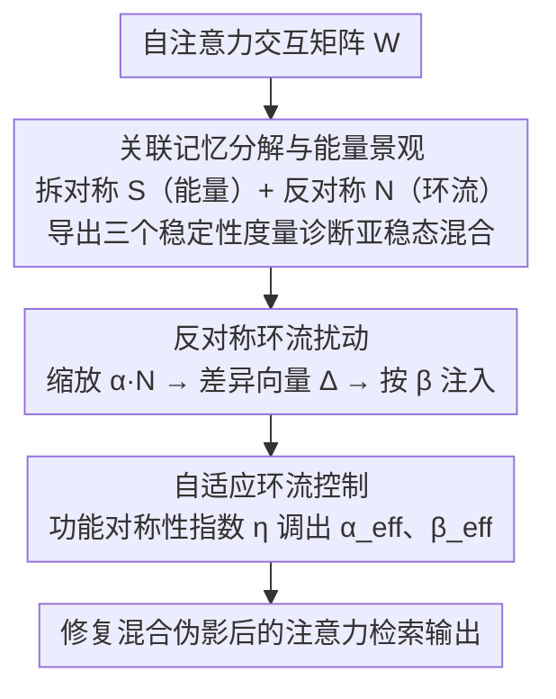

# Balancing Fidelity and Diversity in Diffusion Models via Symmetric Attention Decomposition: Hopfield Perspective

**会议**: ICML 2026  
**arXiv**: [2605.27476](https://arxiv.org/abs/2605.27476)  
**代码**: https://github.com (有)  
**领域**: 扩散模型  
**关键词**: 注意力分解, Hopfield网络, 保真度-多样性权衡, 偏对称扰动, 关联记忆  

## 一句话总结
将扩散模型中 $\mathbf{QK}^\top$ 注意力矩阵分解为对称分量（能量景观）和反对称分量（环流动力学），据此推导 Hopfield 风格的稳定性度量来诊断亚稳态混合，并通过调控反对称分量实现无需训练的保真度-多样性可控权衡。

## 研究背景与动机

**领域现状**：扩散模型（DDPM、SDXL 等）已成为图像生成的主流范式，其成功很大程度上依赖于注意力机制在去噪过程中建立全局上下文和长程依赖。注意力使得模型能够在空间位置间建立丰富的组合性关联，提升生成的多样性和新颖性。

**现有痛点**：然而，全局连接也容易导致语义泄露——不同物体的材质、纹理被不当混合（如两个物体之间的材质混融），产生结构不连贯的伪影。关键在于，这种有益的上下文整合与有害的语义泄露共享同一底层机制，难以区分。

**核心矛盾**：生成的保真度（fidelity）与多样性（diversity）之间存在根本性的 trade-off。高稳定性检索倾向于收敛到重复的视角和特征，牺牲多样性；而低稳定性检索虽然带来多样性，却伴随结构碎片化和伪影。现有方法缺乏理论工具来（1）识别注意力何时陷入亚稳态混合，以及（2）可控地调节这种权衡。

**本文目标**：建立一个原则性的框架来分析注意力矩阵的内部结构，定量诊断亚稳态混合，并提供一个无需训练的可调旋钮来控制保真度-多样性权衡。

**切入角度**：作者观察到 $\mathbf{QK}^\top$ 在形式上等价于经典 Hopfield 网络的关联记忆矩阵。将其分解为对称和反对称两部分后，对称部分定义了能量景观（决定检索稳定性），反对称部分驱动环流动力学（可打破亚稳态）。这与经典非对称 Hopfield 网络中"增加不对称性导致吸引子指数级减少"的理论完美对接。

**核心 idea**：用注意力矩阵的对称-反对称分解来诊断生成质量，并通过缩放反对称分量作为"环流旋钮"在推理时调控保真度-多样性权衡。

## 方法详解

### 整体框架
方法要解决的是扩散模型自注意力里"有益的上下文整合"和"有害的语义泄露"共用同一套 $\mathbf{QK}^\top$ 机制、难以分离的问题。核心做法是把注意力矩阵当作 Hopfield 关联记忆来读：先把交互矩阵拆成对称（决定能量景观、检索是否稳定）和反对称（驱动环流、能打破亚稳态）两半，用对称半推出几个稳定性度量来诊断当前检索状态，再在推理时缩放反对称半注入可控的环流扰动来修复混合伪影。整个流程不训练，只在前向时改写注意力矩阵。

### 关键设计

**1. 关联记忆分解与能量景观：把非对称注意力拆成可分析的两半**

经典 Hopfield 理论只对对称连接矩阵有定义，而扩散模型里的 $\mathbf{QK}^\top$ 一般是非对称的，没法直接套用能量稳定性分析。本文先定义交互权重矩阵 $\mathbf{W} = \mathbf{W}_Q \mathbf{W}_K^\top$，再把它劈成对称部分 $\mathbf{S} = (\mathbf{W} + \mathbf{W}^\top)/2$ 和反对称部分 $\mathbf{N} = (\mathbf{W} - \mathbf{W}^\top)/2$，于是 $\mathbf{QK}^\top = \mathbf{XSX}^\top + \mathbf{XNX}^\top$ 自然分成两块。其中对称块定义了 Hopfield 能量 $E_\mathbf{X}(\xi) = -\frac{1}{2}\xi^\top \mathbf{M}_{\text{sym}}(\mathbf{X})\xi$，反对称块在二次型里恒为零（$\xi^\top \mathbf{M}_{\text{skew}} \xi = 0$）因而不改变能量、只负责驱动环流。这样一来能量稳定性和环流动力学被彻底解耦：对称半捕捉全局物体结构，反对称半捕捉细粒度的不规则细节。基于对称半进一步推出三个 Hopfield 风格的稳定性度量——能量 $E_\mathbf{X}$、不稳定比例 $r_\mathbf{X}$、对齐分数 $\mathbf{Align}_\mathbf{X}$，用来定量诊断注意力是否陷入了亚稳态混合。

**2. 反对称环流扰动：用一个标量旋钮打破亚稳态**

诊断出问题后需要一个能修复伪影、又不破坏好结构的干预手段。本文借用经典结论"非对称 Hopfield 网络里增加不对称性会让吸引子数量指数级减少"，把反对称分量当成可调旋钮：对它乘上缩放因子 $\alpha$ 得到扰动后的检索 $\Xi_\alpha = \Phi(\mathbf{XSX}^\top + \alpha \cdot \mathbf{XNX}^\top) \mathbf{X}$，再算出它与原检索的差异向量 $\Delta = \Xi_\alpha - \Xi$，最后按混合系数 $\beta$ 注入回去 $\Xi_{\text{blended}} = \Xi + \beta \Delta$。$\alpha$ 控制环流扰动的强度，$\beta$ 控制注入比例。适度的环流注入能把语义泄露造成的亚稳态混合"搅散"，从而修复材质混融一类的伪影；但注入过头又会破坏已经成立的良好结构，所以这两个标量构成了保真度-多样性权衡的可调旋钮。

**3. 自适应环流控制：按样本状态决定扰动强度**

固定一组 $(\alpha, \beta)$ 对所有样本一刀切是次优的——低质量样本需要更强的环流修正，高质量样本本就处在好的工作点、被过度扰动反而变差。为此本文定义功能对称性指数 $\eta_\mathbf{M}(\mathbf{X}) = (\|\mathbf{M}_{\text{sym}}\|_F^2 - \|\mathbf{M}_{\text{skew}}\|_F^2) / (\|\mathbf{M}_{\text{sym}}\|_F^2 + \|\mathbf{M}_{\text{skew}}\|_F^2)$ 来衡量当前检索有多"对称主导"，再用它把缩放和混合都改成自适应的：有效缩放 $\alpha_{\text{eff}} = (\alpha - 1)\bar{\eta}_\mathbf{M}$、有效混合 $\beta_{\text{eff}} = \beta(1 - \bar{\eta}_\mathbf{M})$（$\bar{\eta}_\mathbf{M}$ 为跨 batch 与 head 的均值）。直观上，对称主导（$\eta$ 大）意味着检索已稳定、就少扰动；反之低性能样本拿到更强的环流修正。实验中这一机制在过度扰动设置下尤其关键，能把静态方法的崩溃拉回甚至超过 baseline。

## 实验关键数据

### 主实验
在 SDXL 上使用 1K COCO2014 提示词生成 10K 样本，评估稳定性度量与外部指标的关联，以及环流扰动的效果。

| 指标 | Baseline | $\alpha{=}1.05, \beta{=}5$ | $\alpha{=}1.10, \beta{=}5$ | $\alpha{=}1.15, \beta{=}4$ |
|------|----------|---------------------------|---------------------------|---------------------------|
| Aesthetic Score ↑ | 5.644 | 5.670 | 5.717 | 5.704 |
| ImageReward ↑ | 0.546 | 0.558 | 0.442 | 0.445 |
| CLIPScore ↑ | 0.264 | 0.263 | 0.259 | 0.260 |
| $\mathbf{Align}_\mathbf{X}$ | 0.669 | 0.651 | 0.650 | 0.637 |

### 消融实验：低质量子集修复效果
对各指标最差 20% 基线样本，施加扰动 $(\alpha{=}1.05)$ 后的配对变化量 $\Delta$：

| 目标子集 | $\Delta$ Aesthetic | $\Delta$ ImageReward | $\Delta$ CLIPScore |
|----------|-------------------|---------------------|-------------------|
| 最差 20% Aesthetic | +0.166 | +0.043 | +0.004 |
| 最差 20% ImageReward | +0.022 | +0.453 | +0.004 |
| 最差 20% CLIPScore | +0.019 | +0.116 | +0.0065 |

### 自适应控制 vs 静态控制（350 COCO 样本）

| 方法 | IR ↑ | CLIP ↑ | HPS ↑ | AES ↑ |
|------|------|--------|-------|-------|
| Baseline | 0.487 | 0.264 | 0.270 | 5.64 |
| 静态适度 $(\alpha{=}1.05, \beta{=}3)$ | 0.546 | 0.262 | 0.273 | 5.66 |
| 自适应适度 | 0.522 | 0.264 | 0.272 | 5.64 |
| 静态过度 $(\alpha{=}1.20, \beta{=}5)$ | -1.486 | 0.207 | 0.157 | 5.23 |
| **自适应过度** | **0.568** | **0.264** | **0.274** | **5.65** |

### 关键发现
- 稳定性度量与外部质量指标存在显著 Spearman 相关：$\mathbf{Align}_\mathbf{X}$ 与 Aesthetic Score 正相关（$\rho = +0.296$），与 LPIPS 多样性负相关（$\rho = -0.297$），验证了保真度-多样性 trade-off
- 对低质量子集（最差 20%），环流扰动带来一致性提升；对高质量子集（最优 20%），过度扰动反而降低质量，呈现状态依赖的修复特性
- 自适应控制在过度扰动设置下表现突出：静态方法 ImageReward 暴跌至 -1.486，而自适应方法恢复至 0.568，甚至超过 baseline
- 与全局注意力温度缩放 $\mathbf{QK}^\top / \tau$ 相比，环流扰动能更选择性地抑制弱支持的混合伪影，而不产生不当的结构复制（如多余的肢体）

## 亮点与洞察
- **对称-反对称分解的洞察力**：将 $\mathbf{QK}^\top$ 视为关联记忆矩阵并做对称分解，建立了注意力与 Hopfield 网络之间的桥梁。对称分量捕捉全局物体结构，反对称分量捕捉细粒度不规则细节，这一发现可迁移到任何基于 Transformer 的生成模型分析中
- **无需训练的推理时可控生成**：仅通过两个标量参数 $(\alpha, \beta)$ 在推理时修改注意力矩阵即可调控生成质量，无需额外训练或微调。这种轻量级干预思路可推广到 LLM 和其他 Transformer 架构
- **自适应控制避免过修正**：利用功能对称性指数 $\eta_\mathbf{M}$ 实现样本级自适应扰动，解决了固定超参对所有样本"一刀切"的问题，在过度扰动设置下展现出显著的鲁棒性优势

## 局限与展望
- 实验主要在 SDXL UNet 架构上验证，尚未扩展到 DiT（如 FLUX）等最新的 Transformer 架构扩散模型
- 自适应控制的聚合策略（跨 batch 和 head 的均值）较为简单，可能存在更优的头级别或层级别的自适应策略
- 目前仅考虑了自注意力，交叉注意力中的 $\mathbf{QK}^\top$ 同样存在对称-反对称结构，值得进一步探索
- 该理论框架可天然扩展到 LLM 的注意力分析中，检测和调控文本生成中的"亚稳态"行为

## 相关工作与启发
- Ramsauer et al. (2021) 将自注意力形式化为现代 Hopfield 网络的检索步骤，本文在此基础上引入特征级（而非 token 级）的关联记忆视角
- Singh et al. (1995) 发现非对称 Hopfield 网络中增加不对称性导致吸引子指数级减少，直接启发了本文的环流扰动机制
- Hwang et al. (2019) 研究了连接矩阵对称度对吸引子结构的影响，为自适应控制中的 $\eta_\mathbf{M}$ 设计提供了理论依据

<!-- RELATED:START -->

## 相关论文

- [\[NeurIPS 2025\] T2SMark: Balancing Robustness and Diversity in Noise-as-Watermark for Diffusion Models](../../NeurIPS2025/image_generation/t2smark_balancing_robustness_and_diversity_in_noise-as-watermark_for_diffusion_m.md)
- [\[ICML 2026\] Enhancing Membership Inference Attacks on Diffusion Models from a Frequency-Domain Perspective](enhancing_membership_inference_attacks_on_diffusion_models_from_a_frequency-doma.md)
- [\[ICML 2026\] Stable Velocity: A Variance Perspective on Flow Matching](stable_velocity_a_variance_perspective_on_flow_matching.md)
- [\[ICML 2025\] Efficient Diffusion Models for Symmetric Manifolds](../../ICML2025/image_generation/efficient_diffusion_models_for_symmetric_manifolds.md)
- [\[ICML 2026\] Offline Multi-agent Reinforcement Learning via Sequential Score Decomposition](offline_multi-agent_reinforcement_learning_via_sequential_score_decomposition.md)

<!-- RELATED:END -->
