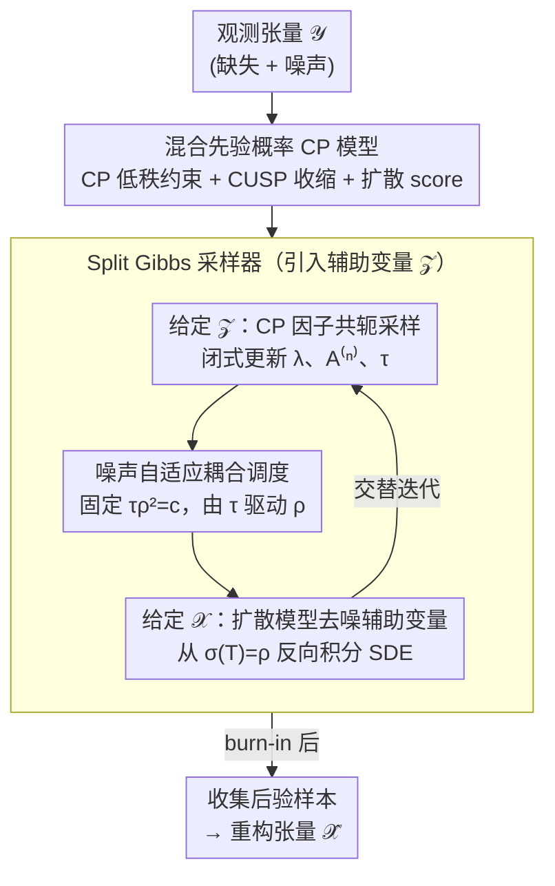

# Bayesian Tensor Decomposition with Diffusion Model Prior

**会议**: ICML2026  
**arXiv**: [2606.03212](https://arxiv.org/abs/2606.03212)  
**代码**: [GitHub](https://github.com/taozerui/DiffBCP)  
**领域**: 图像恢复  
**关键词**: 张量分解, 扩散模型先验, 贝叶斯推断, 图像修复, 自动秩选择  

## 一句话总结

DiffBCP 将预训练扩散模型作为隐式数据先验注入贝叶斯 CP 张量分解，通过 split Gibbs 采样器实现可处理的后验推断，在图像修复和去噪任务上全面超越传统和深度张量分解基线（FFHQ 上 PSNR 最高提升 +2.33 dB）。

## 研究背景与动机

**领域现状**：低秩张量分解（TD）是多维数据分析的经典工具，通过将高阶张量分解为小因子的收缩来实现高效表示和压缩。在数据完整、干净时，即使最简单的 CP 分解也能取得不错效果。

**现有痛点**：当观测数据存在严重缺失或噪声时，低秩假设作为唯一的结构先验变得不充分。现有方法通常添加手工设计的先验（如稀疏性、平滑性），但这些先验仍无法充分捕捉真实数据的丰富统计特征。非线性 TD 方法（如 DeepTensor）引入深度网络结构但缺乏概率建模框架，而使用固定去噪网络作为先验的方法（如 GLON）在高缺失率下不稳定。

**核心矛盾**：现有最强的数据驱动先验——扩散模型——无法直接与张量分解和可处理的后验推断兼容。扩散先验是隐式定义的（通过 score function），与 CP 因子的似然函数和低秩约束耦合在一起，导致标准采样方法失效。

**本文目标**：设计一个概率框架，将结构性低秩先验与学习到的扩散模型先验统一到贝叶斯张量分解中，同时实现自动秩选择和可处理的后验采样。

**切入角度**：作者观察到似然项中噪声精度 $\tau$ 和耦合参数 $\rho$ 总是联合出现，因此令 $\tau \rho^2 = c$（常数），当 $\tau$ 在采样中被推断时，$\rho$ 自动调整以维持似然和耦合项之间的相对尺度。

**核心 idea**：用辅助变量将联合分布解耦为"CP 因子共轭更新 + 扩散模型引导去噪"两个独立子步骤，实现混合先验的贝叶斯张量分解。

## 方法详解

### 整体框架

DiffBCP 要解决的问题是：从一张带缺失和噪声的观测张量 $\mathscr{Y}$（如部分像素丢失的含噪图像）恢复出干净完整的张量 $\mathscr{X}$。它的核心思路是把"低秩 CP 分解"和"预训练扩散模型"这两个互补的先验塞进同一个贝叶斯模型里，再用一个引入辅助变量的 split Gibbs 采样器，把原本纠缠在一起的复杂后验拆成"CP 因子共轭采样"和"扩散去噪"两个能各自求解的子步骤交替进行。每轮迭代先用闭式共轭分布更新所有 CP 因子，再用扩散模型对辅助变量做一次去噪，经过 burn-in 后收集后验样本作为最终重构。

### 关键设计

**1. 混合先验概率 CP 模型：低秩骨架 + 扩散纹理**

低秩先验擅长捕捉数据的全局结构却画不出纹理细节，扩散先验能拟合丰富的真实数据分布却缺乏低秩归纳偏置——尤其在高缺失率下单靠任何一方都不够。DiffBCP 把两者写进同一个联合分布 $p(\mathscr{Y}, \mathscr{X}, \boldsymbol{\lambda}, \mathbf{A}^{(1:N)}, \tau)$，里面叠了三类先验：用 $p(\mathscr{X} | \mathbf{A}, \boldsymbol{\lambda}) = \delta(\mathscr{X} - \mathrm{CP}(\boldsymbol{\lambda}, \mathbf{A}^{(1:N)}))$ 把重构张量硬约束在 CP 低秩流形上；用 CUSP 收缩过程先验 $\lambda_r | \theta_r \sim \mathcal{N}(0, \theta_r)$ 让分量权重随秩序号 $r$ 增大被逐渐收缩到近零，从而自动确定有效秩；再用预训练扩散模型的 score $\nabla_{\mathscr{X}_t} \log p(\mathscr{X}_t; \sigma(t)) = s_\psi(\mathscr{X}_t, t)$ 作为重构张量的隐式数据先验。作者还从理论上证明 CUSP 先验让第 $r$ 个分量的尾概率以 $(\beta/(1+\beta))^r$ 的速率衰减，保证了收缩的有效性。

**2. Split Gibbs 采样器：把隐式先验拆出来单独去噪**

难点在于扩散先验是隐式定义的（只能拿到 score），它和 CP 似然、低秩约束耦合在一起后，Langevin 采样器算不出梯度，直接对联合分布采样不可行。DiffBCP 的做法是引入一个辅助变量 $\mathscr{Z}$ 并加入耦合项 $\phi(\mathscr{Z}, \mathscr{X}; \rho) = \frac{1}{2\rho^2}\|\mathscr{Z} - \mathscr{X}\|_F^2$，把困难的联合采样切成两个各自可解的子问题：给定 $\mathscr{Z}$ 时，$\boldsymbol{\lambda}$、$\mathbf{A}^{(n)}$、$\tau$ 都有闭式共轭分布可以直接采样；给定 $\mathscr{X}$ 时，辅助变量的更新恰好等价于一个以 $\mathscr{X}$ 为观测、噪声水平为 $\rho$ 的去噪问题，于是用扩散模型的 SDE 从 $\sigma(T) = \rho$ 反向积分到 $t=0$ 即可。理论上当 $\rho \to 0$ 时这个平滑后验会以 TV 距离趋零收敛到原始后验，但 $\rho$ 太小又会让去噪本身更困难，因此存在一个 bias-variance 权衡（Theorem 3.4 给出了偏差界）。

**3. 噪声自适应耦合调度：让 τ 自己驱动 ρ**

耦合参数 $\rho$ 直接控制上面那个权衡，而 PnP-DM 这类方法靠确定性退火手调 $\rho$，对 $\rho_{\min}$ 的取值极其敏感，调度选错性能就崩。DiffBCP 利用全贝叶斯框架的便利，固定 $\tau \rho^2 = c$（$c$ 为常数超参），让 $\rho$ 跟着噪声精度 $\tau$ 走——因为 $\tau$ 本来就在每轮 Gibbs 迭代里从共轭 Gamma 分布 $\tau | \cdots \sim \mathrm{Gamma}(\alpha_0 + |\Omega|/2, \kappa_0 + \frac{1}{2}\sum(y - x)^2)$ 中被自动推断出来，于是 $\rho$ 随之自适应调整。等于把退火调度从手工设定改成了从数据中学习，自然比固定退火策略更稳健。

## 实验关键数据

### 主实验（FFHQ + ImageNet 图像修复去噪）

在 256×256 图像上评估，每个数据集随机选取 128 张测试图像，添加 $\sigma=0.05$ 高斯噪声：

| 数据集 / 掩码 | 指标 | DiffBCP | DeepTensor (最强基线) | BCP | 提升 |
|---------------|------|---------|----------------------|-----|------|
| FFHQ / Uniform(0.7) | PSNR↑ | **32.13** | 28.23 | 26.28 | +3.90 |
| FFHQ / Uniform(0.9) | PSNR↑ | **28.28** | 26.11 | 21.61 | +2.17 |
| FFHQ / Stripe | PSNR↑ | **27.91** | 26.44 | 9.26 | +1.47 |
| FFHQ / Irregular | PSNR↑ | **30.34** | 28.01 | 22.64 | +2.33 |
| ImageNet / Uniform(0.7) | PSNR↑ | **28.95** | 26.03 | 24.34 | +2.92 |
| ImageNet / Irregular | PSNR↑ | **27.02** | 25.16 | 21.33 | +1.86 |
| ImageNet / 平均 | SSIM↑ | **78.92** | 66.50 | — | +12.42 |

DiffBCP 在所有数据集和掩码类型上均取得最优，LPIPS 也全面领先（如 FFHQ Irregular: 15.98 vs DeepTensor 26.19）。GLON 在高缺失率下极不稳定，常收敛到全零。

### 高分辨率 OOD 图像实验

在 2048×2048 分布外图像上评估（扩散先验在 256×256 上训练）：

| 图像 / 掩码 | 指标 | DiffBCP | PuTT | BCP |
|-------------|------|---------|------|-----|
| Marseille / Uniform(0.9) | PSNR↑ | **20.15** | 19.63 | 16.94 |
| Tokyo / Uniform(0.95) | PSNR↑ | **18.90** | 18.33 | 16.90 |
| Westerlund / Irregular | PSNR↑ | **25.27** | 24.38 | 22.26 |
| Tokyo / Irregular | SSIM↑ | **51.38** | 45.03 | 40.40 |

即使在严重分布偏移下，DiffBCP 仍优于 PuTT，低秩结构提供的归纳偏置部分补偿了分布不匹配。PnP-DM 在高分辨率图像上完全失败。

## 亮点与洞察

- 首个将预训练扩散模型作为数据先验引入贝叶斯张量分解的完全概率框架，扩展了 plug-and-play 范式到张量分解领域
- CUSP 先验实现双向秩自适应：收缩冗余分量并在需要时添加新分量，对初始秩的设定鲁棒
- 低秩约束使后验分布更容易采样（mixing 更快），同时为 OOD 泛化提供结构性归纳偏置
- 理论分析给出了 split Gibbs 采样器的偏差界（Theorem 3.4），揭示了 $\rho$ 选择中 bias-variance 的 trade-off

## 局限性 / 可改进方向

- 性能依赖于底层信号的低秩结构假设，当数据不满足低秩时 CP 模块的贡献消失
- 当前实现需要处理完整张量，对超大张量内存开销较高；随机 mini-batch 更新是改进方向
- 仅使用 CP 分解，未探索 tensor train 或 tensor ring 等可能更适合特定数据模式的分解形式
- 仅在图像修复和去噪上验证，尚未扩展到压缩感知、超分辨等其他逆问题

## 相关工作与启发

- **PnP-DM (Wu et al., 2024)**：同样基于 split Gibbs 采样器使用扩散先验，但无张量分解结构约束，在高分辨率和高缺失率下不稳定
- **DPS (Chung et al., 2023)**：扩散后验采样，但采用近似梯度引导而非精确贝叶斯推断
- **GLON (Zhao et al., 2022)**：TD + 预训练去噪网络，但去噪器远不如扩散模型强大且框架非概率化
- **DeepTensor (Saragadam et al., 2024)**：深度网络结构的 TD，生成更细粒度细节但存在伪影
- 启发：将强大的生成先验注入传统结构化模型的思路可推广到其他结构化信号恢复问题

## 评分
- 新颖性: 8/10 — 首次将扩散模型先验整合到贝叶斯张量分解中，理论和算法设计均有创新
- 实验充分度: 8/10 — 覆盖多数据集、多掩码类型、OOD 和高分辨率场景，含理论分析和消融
- 写作质量: 8/10 — 数学推导清晰，理论与实验结合紧密
- 价值: 7/10 — 打开了张量分解 + 生成模型的新方向，但实际应用场景相对有限

<!-- RELATED:START -->

## 相关论文

- [\[CVPR 2026\] Reparameterized Tensor Ring Functional Decomposition for Multi-Dimensional Data Recovery](../../CVPR2026/image_generation/reparameterized_tensor_ring_functional_decomposition_for_multi-dimensional_data_.md)
- [\[ICCV 2025\] Transformed Low-rank Adaptation via Tensor Decomposition and Its Applications to Text-to-image Models](../../ICCV2025/image_generation/transformed_low-rank_adaptation_via_tensor_decomposition_and_its_applications_to.md)
- [\[AAAI 2026\] Conditional Diffusion Model for Multi-Agent Dynamic Task Decomposition](../../AAAI2026/image_generation/conditional_diffusion_model_for_multi-agent_dynamic_task_dec.md)
- [\[CVPR 2026\] From Inpainting to Layer Decomposition: Repurposing Generative Inpainting Models for Image Layer Decomposition](../../CVPR2026/image_generation/from_inpainting_to_layer_decomposition_repurposing_generative_inpainting_models_.md)
- [\[ICML 2026\] Balancing Fidelity and Diversity in Diffusion Models via Symmetric Attention Decomposition: Hopfield Perspective](balancing_fidelity_and_diversity_in_diffusion_models_via_symmetric_attention_dec.md)

<!-- RELATED:END -->
