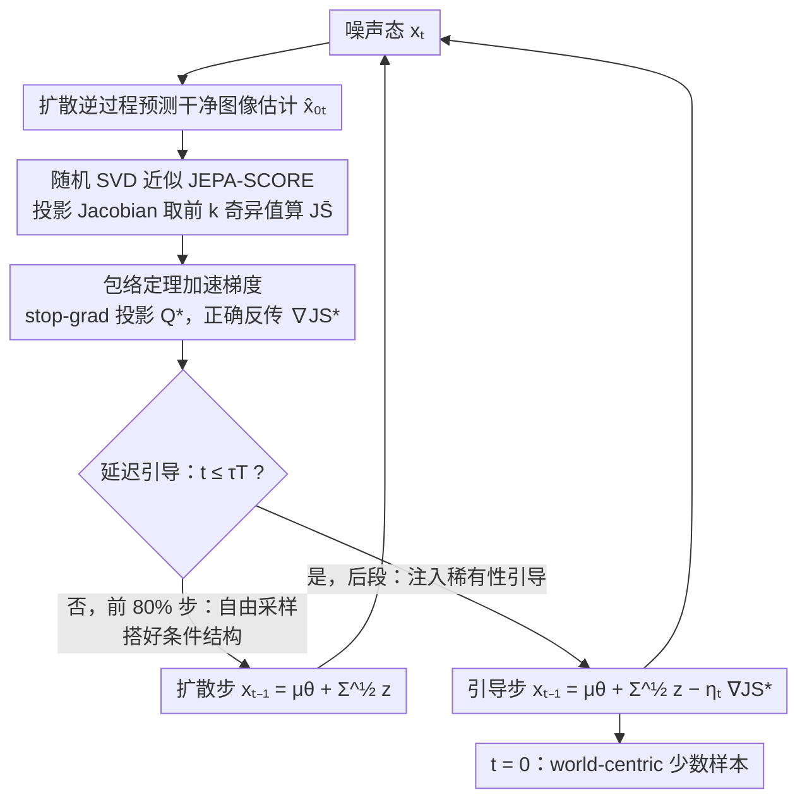

# Beyond Generative Priors: Minority Sampling with JEPA-Guided Diffusion

**会议**: ICML2026  
**arXiv**: [2605.24631](https://arxiv.org/abs/2605.24631)  
**代码**: https://github.com/soobin-um/jepa-guidance  
**领域**: 图像生成  
**关键词**: 少数样本生成, 扩散模型, JEPA, 世界模型先验, 随机SVD  

## 一句话总结

提出 JEPA Guidance，利用 JEPA（如 DINOv2）编码器的隐式密度信号引导扩散模型采样，将少数样本（minority sample）的定义从"生成模型先验下的低密度"转变为"世界先验下的低密度"，在无条件、类条件和文生图场景均实现更具语义意义的稀有样本生成。

## 研究背景与动机

**领域现状**：少数样本生成（minority sampling）旨在生成数据流形上低密度区域的实例，在医学诊断、异常检测和创意 AI 等领域有广泛需求。扩散模型凭借对复杂分布的建模能力，已成为该任务的主要框架，现有方法包括 classifier-guided、self-contained minority guidance 等。

**现有痛点**：所有现有方法都将"少数样本"定义为生成模型自身学到的密度 $p_\theta$ 下的低密度样本。这种 **generator-centric** 定义本质上绑定于训练数据，导致生成的"稀有样本"仅在特定模型下罕见（如白色背景上的狗），并不对应真实世界中语义上的稀有。

**核心矛盾**：生成器先验 $p_\theta$ 只捕捉了特定训练集的分布，无法反映更广泛的真实世界语义。当我们需要"世界级别"的稀有样本时（如隐身飞机、非典型人物），generator-centric 方法完全无能为力。

**本文目标**：将少数样本的定义从 generator-centric 转变为 **world-centric**——用独立于生成模型的世界先验来衡量稀有性，并在扩散采样中实现这一目标。

**切入角度**：JEPA（Joint-Embedding Predictive Architecture）如 DINOv2 在大规模数据上训练，其表征隐式编码了数据密度（JEPA-SCORE），可作为世界先验的自然代理。

**核心 idea**：用 JEPA 编码器的 Jacobian 奇异值来估计世界先验下的密度，通过随机 SVD 高效近似并以梯度引导扩散采样走向低密度区域，实现 world-centric minority sampling。

## 方法详解

### 整体框架

这篇论文要把"稀有"从生成器自己说了算，换成由一个外部世界先验来评判，而落地的抓手就是让 JEPA 编码器在扩散采样的每一步都"投票"。给定预训练扩散模型 $\epsilon_\theta$ 和 JEPA 编码器 $f_\phi$（如 DINOv2），逆过程每走一步都从当前噪声态预测出干净图像估计 $\hat{x}_{0|t}$，间歇性地计算它的 JEPA-SCORE，再用这个分数的负梯度把采样往世界先验下的低密度区域推。整套流程不训练任何东西，只在推理时复用现成模型，采样更新写成 $x_{t-1} = \mu_\theta(x_t, t) + \Sigma_\theta^{1/2} z - \eta_t \nabla_{x_t} \text{JS}^*(\hat{x}_{0|t})$——前两项是原本的扩散步，最后一项才是把样本拽向稀有区的力。

> JEPA-SCORE 是这里的核心自定义指标：它把编码器 Jacobian $J_f(x) \in \mathbb{R}^{d \times n}$ 所有奇异值的对数加起来，$\text{JS}(x) = \sum_{i=1}^r \log(\sigma_i(J_f(x)))$。直觉上 Jacobian 的奇异值刻画了编码器在该点附近对输入扰动的敏感度，密度高的区域表征被压得很平、奇异值小，密度低（稀有）的区域则相反，所以 JS 越低代表该样本在世界先验下越稀有，引导方向就是让 JS 下降。

### 关键设计

**1. 随机 SVD 近似 JEPA-SCORE：把一个原本算不动的密度信号压到能用**

原始 JEPA-SCORE 要对 Jacobian $J_f(x) \in \mathbb{R}^{d \times n}$ 做完整 SVD，而扩散采样每一步都得算一次，直接做的 $O(dn)$ 代价在迭代里根本扛不住。方法改用随机 SVD：先构造一个低秩投影矩阵 $Q \in \mathbb{R}^{d \times l}$（$l \ll d$），把 Jacobian 压成 $\tilde{J}_f = Q^\top J_f \in \mathbb{R}^{l \times n}$，再只取前 $k$ 个奇异值近似那串对数和，复杂度从 $O(dn)$ 降到 $O(ln)$。这一步不是凭感觉砍，论文给出了近似误差的上界 $\text{JS} - \bar{\text{JS}} \leq \mathcal{E}_{\text{RSVD}} + \mathcal{E}_{\text{Trunc}}$（Proposition 4.1），把随机投影误差和截断误差都框住；实验里 $k \approx 10$ 就足够逼近真值，于是一个理论上代价高昂的密度信号被压到了可以塞进采样循环的水平。

**2. 包络定理加速梯度：让稀有性这股引导力反传得起**

光能算 JS 还不够，引导要的是 $\bar{\text{JS}}(\hat{x}_{0|t})$ 对 $x_t$ 的梯度，而麻烦在于投影矩阵 $Q$ 本身是从 $J_f(\hat{x}_{0|t})$ 里算出来的、间接依赖 $x_t$——朴素实现要穿过整个随机 SVD 的计算图反传，内存直接爆掉。方法搬出包络定理（Envelope Theorem）：当内层随机 SVD 已经取到最优投影 $Q^*$ 时，可以把它当常数 stop-gradient 掉，梯度写成 $\text{JS}^* = \sum_{i=1}^k \log(\tilde{\sigma}_i(\text{sg}(Q^{*\top}) J_f))$。这一步的关键是它不是为省事而牺牲精度的近似——包络定理保证在最优点处这样得到的一阶梯度仍然正确，等于免费拿掉了对 SVD 过程的反传开销。

**3. 延迟引导（Deferred Guidance）：避开 JEPA 看不懂噪声图、也顺手接通条件生成**

JEPA 编码器是在干净图像上训练的，可扩散早期的 $\hat{x}_{0|t}$ 还是一团模糊噪声，硬塞进去算密度等于让编码器看不认识的东西，引导信号没意义。方法干脆把 JEPA 引导推迟到中间时步 $\tau T$（默认 $\tau = 0.8$）之后才介入：前 $80\%$ 的步数让扩散模型自己自由采样、把条件结构（文本/类别对应的内容）先搭好，后段再用 JS 梯度把样本往低密度区拽。消融印证了这点——不延迟（$\tau = 1.0$）时质量和文本对齐都明显塌掉。更巧的是，延迟还顺带解决了条件兼容问题：JEPA 编码器本身完全不感知文本或类别，但因为条件信息早在前期采样里就融进图像了，后期只管"在已有条件下找稀有"，于是这套 condition-agnostic 的引导天然扩展到了类条件和文生图场景。

## 实验关键数据

### 主实验——无条件与类条件生成

| 数据集 | 方法 | cFID ↓ | sFID ↓ | Prec ↑ | Rec ↑ | JEPA-SCORE ↓ |
|--------|------|--------|--------|--------|-------|--------------|
| CelebA 64² | ADM | 12.11 | 6.35 | 0.85 | 0.57 | -221.67 |
| CelebA 64² | SGMS | 61.76 | 20.42 | 0.62 | 0.84 | -171.85 |
| CelebA 64² | **Ours** | **8.50** | **4.94** | **0.82** | 0.65 | **-300.79** |
| ImageNet 256² | ADM | 26.44 | 9.70 | 0.95 | 0.51 | -102.01 |
| ImageNet 256² | BnS | 32.01 | 10.61 | 0.92 | 0.56 | -125.77 |
| ImageNet 256² | **Ours** | **18.33** | **7.62** | 0.92 | **0.68** | **-241.62** |

### 文生图生成

| 模型 | 方法 | CLIP ↑ | PickScore ↑ | ImageReward ↑ | JEPA-SCORE ↓ |
|------|------|--------|-------------|---------------|--------------|
| SDv1.5 | DDIM | 31.52 | 21.49 | 0.21 | -292.27 |
| SDv1.5 | MinorityPrompt | 31.56 | 21.32 | 0.24 | -322.33 |
| SDv1.5 | **Ours** | 31.46 | **21.50** | 0.22 | **-355.40** |
| SDXL-Lightning | DDIM | 31.57 | 22.68 | 0.73 | -283.04 |
| SDXL-Lightning | MinorityPrompt | 31.36 | 22.62 | 0.71 | -302.17 |
| SDXL-Lightning | **Ours** | 31.52 | 22.63 | 0.73 | **-337.88** |

### 消融实验

| 配置 | CLIP ↑ | PickScore ↑ | JEPA-SCORE ↓ | 说明 |
|------|--------|-------------|--------------|------|
| $\tau = 1.0$（不延迟） | 31.26 | 21.33 | -356.22 | 质量严重下降 |
| $\tau = 0.9$ | 31.31 | 21.42 | -356.72 | 略有改善 |
| $\tau = 0.8$（默认） | 31.40 | 21.46 | -360.82 | 质量与稀有性最佳平衡 |
| $k = 3$ | 31.56 | 22.59 | -325.35 | 秩不足 |
| $k = 9$（默认） | 31.52 | 22.59 | -344.85 | 足够有效 |
| $k = 15$ | 31.53 | 22.58 | -335.28 | 边际收益递减 |

### 下游应用——数据增强分类

| 训练数据 | Acc ↑ | F1 ↑ | Prec ↑ | Rec ↑ | 增强量 |
|----------|-------|------|--------|-------|--------|
| CelebA trainset | 0.898 | 0.746 | 0.815 | 0.710 | — |
| + SGMS | 0.903 | 0.757 | 0.822 | 0.724 | 50K |
| + BnS | 0.902 | 0.755 | 0.819 | 0.723 | 50K |
| + **Ours** | **0.902** | **0.775** | **0.824** | **0.731** | **30K** |

## 亮点与洞察

- **范式转换**：将 minority sampling 从"在生成器分布下找罕见"重新定义为"在世界先验下找罕见"，概念上更合理——generator-centric 的稀有可能只是训练集偏差，world-centric 的稀有才反映真实语义
- **理论与工程并重**：随机 SVD 近似有严格误差上界（Proposition 4.1），包络定理保证梯度正确性，不是 ad-hoc hack
- **condition-agnostic 设计**：JEPA 编码器不需要知道条件信息（文本/类别），通过延迟引导自然兼容条件生成，设计极为优雅
- **数据效率**：下游分类中仅用 30K 增强样本超越 50K 的 baseline，说明世界先验下的稀有样本信息量更高

## 局限性 / 可改进方向

- 每个引导步需要计算 Jacobian + 随机 SVD，引入额外计算开销，可探索摊销化或更高效近似
- 世界先验的质量取决于 JEPA 编码器的训练数据和能力，换用不同编码器会改变"稀有"的定义
- 仅探索了 DINOv2/MetaCLIP 等编码器，未验证 V-JEPA 等视频模型或其他模态
- 反转引导方向可生成高密度样本强化偏见，存在双用途风险

## 相关工作与启发

- **Minority Sampling 系列**（Sehwag et al., Um et al.）：从 classifier-guided → self-contained → guidance-free 的演进，本文突破了"只能在生成器先验下定义少数"的根本限制
- **JEPA-SCORE**（Balestriero et al., 2025）：证明 JEPA 表征隐式编码数据密度，本文将其从后验排序工具升级为在线采样引导信号
- **DINOv2**（Oquab et al., 2023）：1.42 亿图像训练的 ViT 编码器，充当世界先验的代理
- **启发**：可将此框架推广到其他需要"定义什么是稀有"的场景，如公平性、鲁棒性测试、创意内容生成

## 评分
- 新颖性: 9/10 — 从 generator-centric 到 world-centric 的范式转换，概念贡献突出
- 实验充分度: 8/10 — 覆盖无条件/类条件/文生图/下游应用，消融详尽
- 写作质量: 9/10 — 概念清晰，理论推导严谨，图示直观
- 价值: 8/10 — 为 minority sampling 打开新方向，但计算开销限制实际规模化

<!-- RELATED:START -->

## 相关论文

- [\[ICLR 2026\] Beyond Confidence: The Rhythms of Reasoning in Generative Models](../../ICLR2026/image_generation/beyond_confidence_the_rhythms_of_reasoning_in_generative_models.md)
- [\[CVPR 2025\] Learning Visual Generative Priors without Text](../../CVPR2025/image_generation/learning_visual_generative_priors_without_text.md)
- [\[ICML 2026\] Threshold-Guided Optimization for Visual Generative Models](threshold-guided_optimization_for_visual_generative_models.md)
- [\[CVPR 2026\] Efficient Weighted Sampling via Score-based Generative Models](../../CVPR2026/image_generation/efficient_weighted_sampling_via_score-based_generative_models.md)
- [\[CVPR 2026\] PhyCo: Learning Controllable Physical Priors for Generative Motion](../../CVPR2026/image_generation/phyco_learning_controllable_physical_priors_for_generative_motion.md)

<!-- RELATED:END -->
