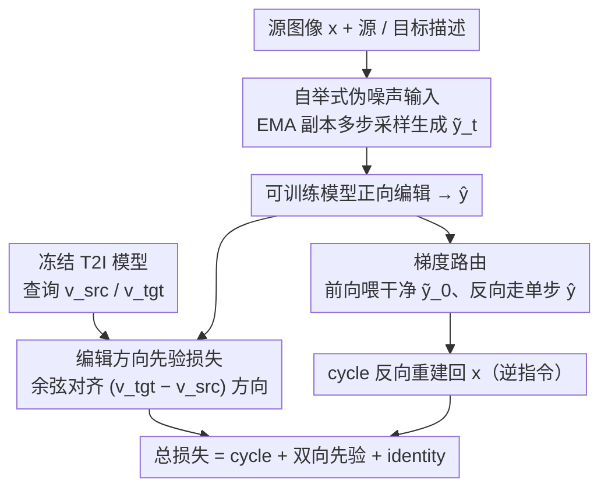

# Bootstrap Your Generator: Unpaired Visual Editing with Flow Matching

**会议**: ICML2026  
**arXiv**: [2606.03911](https://arxiv.org/abs/2606.03911)  
**代码**: https://research.nvidia.com/labs/par/byg/ (项目页)  
**领域**: 图像生成  
**关键词**: 无配对训练, flow matching, 图像编辑, 视频编辑, cycle consistency  

## 一句话总结
提出 Bootstrap Your Generator (ByG)，一个无需配对数据的 flow matching 编辑训练框架，通过从冻结基础模型提取编辑方向先验 + cycle consistency 保持源结构 + 梯度路由弥合训练-推理差距，在图像和视频编辑上超越百万级配对数据训练的监督基线。

## 研究背景与动机

**领域现状**：当前主流视觉编辑方法（如 FLUX-Kontext、Qwen-Image-Edit、Ditto）依赖大规模配对数据集（百万级 source-target 对）进行有监督训练，编辑效果优秀但数据获取成本极高。

**现有痛点**：配对数据的收集在长尾编辑场景（如将卡通转为写实、改变液体粘度）和视频编辑中几乎不可行——根本不存在 before-after 对。零样本方法（如 FlowEdit）不需要配对数据但编辑质量有限；NP-Edit 虽避免了配对数据，但依赖外部 VLM 反馈模型，且难以扩展到多步生成模型和视频。

**核心矛盾**：有监督方法需要配对数据但配对数据难以规模化收集；无监督方法摆脱了配对数据但缺乏有效的训练信号。对于 flow matching 模型还有额外挑战：标准训练需要对 ground truth 输出加噪作为输入，没有配对数据就没有合法的训练输入；且训练在噪声中间态上进行，而 cycle consistency 等损失需要干净的完全去噪输出。

**本文目标**：设计一个无需任何配对数据和外部模型的通用框架，仅利用预训练生成模型自身的知识来训练 flow matching 编辑模型。

**核心 idea**：视觉编辑有两个目标——遵循编辑指令 + 保持源内容不变。前者通过冻结 T2I 基础模型的速度场差值提取编辑方向信号，后者通过 cycle consistency 约束实现，再用梯度路由（STE 变体）解决训练时噪声预测与推理时干净输出之间的 gap。

## 方法详解

### 整体框架
ByG 要解决的核心难题是：没有 source-target 配对数据时，怎么把一个预训练 T2I 模型微调成既听话又保结构的编辑模型。它的破局思路是让模型"自己教自己"——用编辑模型的 EMA 副本生成训练所需的噪声输入，用冻结的 T2I 模型提供"该往哪个方向编辑"的先验，再用正向编辑+反向重建的 cycle 约束逼模型保住源内容。三股信号合成总损失 $\mathcal{L} = \mathcal{L}_{\text{cycle}} + \lambda_{\text{prior}}(\mathcal{L}_{\text{prior}}^{\text{fwd}} + \mathcal{L}_{\text{prior}}^{\text{rev}}) + \lambda_{\text{id}}\mathcal{L}_{\text{id}}$，整个训练只需源图像和它的 source/target caption。

### 关键设计

**1. 自举式伪噪声输入：补上 flow matching 缺失的训练输入**

flow matching 的标准训练要对 ground truth 输出加噪当输入，可无配对场景里根本没有目标图像 $\mathbf{y}$，也就拿不到合法的噪声输入——这是个"没有好输入就训不出好模型、训不出好模型又造不出好输入"的鸡生蛋死循环。ByG 维护一份编辑模型的 EMA 副本来打破它：每步训练时 EMA 模型从纯噪声（$t=1$）采样 $n$ 步到时间步 $t$，产出伪噪声输入 $\tilde{\mathbf{y}}_t$ 喂给可训练模型。EMA 副本本身平滑了训练波动，且随着主模型变强它生成的输入也越来越好，形成自举式的正反馈循环。消融里去掉自举后 Edit Success 从 8.32 暴跌到 5.52，正是因为训练输入分布与推理时严重不匹配。

**2. 编辑方向先验损失：在无监督下给出"听指令"的信号**

无配对意味着没有监督告诉模型"编辑后该长什么样"，指令遵循的训练信号从哪来？ByG 从冻结 T2I 模型里榨取：拿同一个噪声输入分别用源描述 $p_{\text{src}}$ 和目标描述 $p_{\text{tgt}}$ 查询，得到两个速度场 $\mathbf{v}_{\text{src}}$、$\mathbf{v}_{\text{tgt}}$。关键在于不直接让编辑模型去匹配 $\mathbf{v}_{\text{tgt}}$——那会把模型拉向 T2I 的无条件重建、造成内容漂移；而是只约束"编辑方向"对齐，用余弦损失 $\mathcal{L}_{\text{dir}} = 1 - \cos(\mathbf{v}_{\text{fwd}} - \mathbf{v}_{\text{src}},\; \mathbf{v}_{\text{tgt}} - \mathbf{v}_{\text{src}})$ 让模型的速度变化方向跟 T2I 的差值方向 $\mathbf{v}_{\text{tgt}} - \mathbf{v}_{\text{src}}$ 一致，再补一个 MSE 项 $\alpha\|\mathbf{v}_{\text{fwd}} - \mathbf{v}_{\text{tgt}}\|^2$ 防止速度范数爆炸。这个差值形式把文本带来的语义变化单独隔离出来，幅度不管、只管方向，剩下的共有结构交给 cycle consistency 去守。消融显示只留 MSE 而去掉方向项会带来更强的源漂移。

**3. 梯度路由：弥合训练单步预测与推理多步输出的鸿沟**

cycle 的反向 pass 需要先把正向编辑结果当条件再重建回源图，可训练时只能拿单步预测 $\hat{\mathbf{y}}$ 当条件，它相比推理时多步采样的干净输出 $\tilde{\mathbf{y}}_0$ 又糊又偏——模型一旦发现条件是模糊的，干脆学会忽略它。ByG 把直通估计器（STE）适配到连续去噪场景来解这个 train-test mismatch：前向传播喂干净估计 $\tilde{\mathbf{y}}_0$（来自 EMA 完整采样，匹配推理分布），反向传播却让梯度绕过 $\tilde{\mathbf{y}}_0$、改流过单步预测 $\hat{\mathbf{y}}$，用 $\hat{\mathbf{y}}^{\text{hyb}} = \text{sg}(\tilde{\mathbf{y}}_0) + (\hat{\mathbf{y}} - \text{sg}(\hat{\mathbf{y}}))$ 实现（$\text{sg}$ 是 stop-gradient）。这样模型看到的是干净图像、不会学会偷懒，梯度却依然能回流去更新前向编辑。消融里去掉梯度路由后源保持从 7.62 降到 7.18，编辑虽更激进但开始牺牲源内容。

### 损失函数 / 训练策略
总损失四项协同：cycle 重建损失（正向 $\mathbf{x} \to \hat{\mathbf{y}}$ 编辑后用逆指令 $\bar{c}$ 反向重建回 $\mathbf{x}$）守源结构、双向先验损失（正向与反向 pass 都施加方向对齐）管指令遵循、identity 损失（源图同时当输入和条件时应原样输出）防止模型丢弃条件信息。三类正则缺一不可——消融显示去掉全部正则会直接崩塌成恒等映射（Edit Success 仅 0.63）。视频编辑无需改架构，把所有损失直接套到视频 latent 上即可。

## 实验关键数据

### 主实验——视频编辑用户研究

| 编辑方向 | ByG 胜率 | Ditto 胜率 | 投票数 |
|----------|---------|-----------|--------|
| 卡通 → 写实 | **80.5% ± 2.9%** | 19.5% | 119 |
| 写实 → 卡通 | **70.0% ± 5.4%** | 30.0% | 119 |
| OOD 3D-CGI | **85.0%** | 15.0% | — |
| 总体 | **75.3% ± 2.2%** | 24.7% | 238 |

ByG 仅用 ~330 个无配对视频训练，Ditto 用百万级配对视频训练。Binomial test $p < 3 \times 10^{-15}$。

### 视频编辑定量指标

| 方法 | CLIP dir ↑ | DINO Sim. ↑ | Motion Fid. ↑ | Dyn. Deg. ↑ | Aesthetic ↑ | Temp. Flicker ↑ |
|------|-----------|------------|--------------|------------|------------|----------------|
| **ByG** | **0.104** | **0.718** | **0.715** | **0.597** | 0.574 | 0.967 |
| Ditto | 0.091 | 0.536 | 0.616 | 0.560 | **0.585** | **0.972** |

### 长尾风格编辑（6 种未见风格：GTA V / Minecraft / 美漫 / Low-poly / Voxel / Lego）

| 方法 | Style→Photo Semantic ↑ | Overall ↑ | Photo→Style Semantic ↑ | Overall ↑ |
|------|----------------------|-----------|----------------------|-----------|
| **ByG** | **7.67** | **8.30** | **5.22** | **6.33** |
| Kontext (监督) | 6.87 | 7.85 | 3.97 | 6.00 |
| Qwen-Image-Edit (监督) | 6.86 | 7.75 | 4.87 | 5.17 |
| FlowEdit (零样本) | 4.27 | 6.20 | 1.46 | 3.64 |

### 消融实验

| 配置 | Edit Success ↑ | Source Pres. ↑ | 说明 |
|------|---------------|---------------|------|
| 完整模型 | 8.317 | 7.617 | 编辑成功与源保持最佳平衡 |
| 去掉梯度路由 | 8.917 | 7.183 | 编辑更激进但源保持下降 |
| 去掉 cycle loss | 8.983 | 7.233 | 同上，失去源保持约束 |
| 去掉方向损失 | 8.400 | 7.233 | 仅 MSE 导致更强源漂移 |
| 去掉自举 | 5.517 | 7.050 | 分布不匹配，两项均降 |
| 去掉正则化 | 0.633 | 9.767 | 崩塌为恒等映射 |

## 亮点与洞察
- **核心创新**：首个无需配对数据和外部模型的 flow matching 编辑训练框架，三个组件（自举、方向先验、梯度路由）互补解决了无监督训练的三个基本挑战
- **梯度路由**是关键技术亮点：将 STE 适配到连续去噪设置，用干净图像做前向条件、用噪声预测传梯度，巧妙消除 train-test gap
- **泛化能力突出**：训练时未见的 3D-CGI 风格上仍有 85% 胜率；6 种完全未训练的风格均超越监督基线
- **极度数据高效**：视频编辑仅用 ~330 个无配对视频即超越百万级配对数据训练的 Ditto

## 局限性 / 可改进方向
- 继承基础模型的知识边界和偏见——若 T2I 模型不理解目标域则编辑失效
- **物体移除**表现弱（GEdit-Bench 仅 1.91 vs Kontext 6.94）：target caption 仅"不提及"被移除物体，缺乏显式移除信号
- 文本编辑能力也弱（2.10 vs 5.44），同样源于 caption 监督的局限性
- 自举+EMA 增加了训练计算成本（需多步采样生成伪输入）

## 相关工作与启发
- **CycleGAN** (Zhu et al., 2017)：cycle consistency 的经典来源，但仅支持两域转换不支持开放指令编辑
- **NP-Edit** (Kumari et al., 2025)：无配对但依赖外部 VLM 反馈 + 单步蒸馏，难以扩展到多步模型和视频
- **DDS** (Hertz et al., 2023)：像素空间优化的编辑方向对比，ByG 改为用单状态双 prompt 查询提取编辑方向
- **STE** (Bengio et al., 2013)：ByG 的梯度路由源自 STE，但从离散量化适配到了连续去噪设置

## 评分
- 新颖性: 9/10 — 首个将自举 + 方向先验 + STE 梯度路由组合为无配对 flow matching 编辑框架
- 实验充分度: 9/10 — 图像+视频双模态，长尾+通用双基准，用户研究+自动评测+消融全面覆盖
- 写作质量: 9/10 — 方法逻辑链清晰，问题-方案对应严密
- 价值: 8/10 — 大幅降低编辑模型的数据门槛，但物体移除/文字编辑等配对数据优势场景仍有明显短板

<!-- RELATED:START -->

## 相关论文

- [\[ICML 2026\] Shifting the Breaking Point of Flow Matching for Multi-Instance Editing](shifting_the_breaking_point_of_flow_matching_for_multi-instance_editing.md)
- [\[ICML 2026\] A Kinetic Energy Perspective of Flow Matching](a_kinetic_energy_perspective_of_flow_matching.md)
- [\[ICML 2026\] Principled RL for Flow Matching Emerges from the Chunk-level Policy Optimization](principled_rl_for_flow_matching_emerges_from_the_chunk-level_policy_optimization.md)
- [\[CVPR 2026\] BiFM: Bidirectional Flow Matching for Few-Step Image Editing and Generation](../../CVPR2026/image_generation/bifm_bidirectional_flow_matching_for_few-step_image_editing_and_generation.md)
- [\[ICML 2026\] Stable Velocity: A Variance Perspective on Flow Matching](stable_velocity_a_variance_perspective_on_flow_matching.md)

<!-- RELATED:END -->
