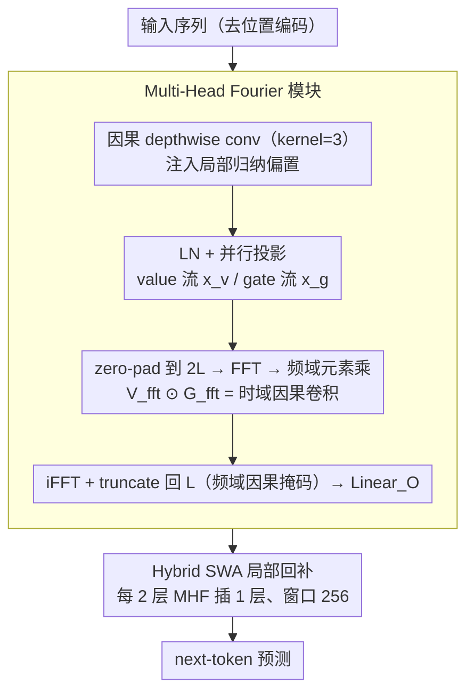

# Caracal: Causal Architecture via Spectral Mixing

**会议**: ICML 2026  
**arXiv**: [2605.00292](https://arxiv.org/abs/2605.00292)  
**代码**: 见论文 Appendix E  
**领域**: LLM效率 / 序列建模 / 长上下文  
**关键词**: FFT、注意力替代、因果建模、长序列、SSM 对比

## 一句话总结
Caracal 用 $\mathcal{O}(L \log L)$ 的多头傅立叶（MHF）模块替换 Transformer 的 $\mathcal{O}(L^2)$ 注意力，通过"pad-FFT-multiply-iFFT-truncate"实现频域内的严格因果掩码，并完全去掉位置编码，仅用标准 FFT 算子（不依赖 Mamba 那样的 CUDA kernel）就在 Tiny→Large 全尺度上与 Llama / Mamba / Mamba-2 / Jamba 性能相当。

## 研究背景与动机
**领域现状**：长序列建模有两条主流路线 —— Transformer 的注意力（强表达力但 $\mathcal{O}(L^2)$ 复杂度且需位置编码）；以 Mamba 为代表的 SSM（线性复杂度但靠定制 CUDA 内核，可移植性差）。傅立叶系（FNet、AFNO、SPECTRE）有 $\mathcal{O}(L \log L)$ 复杂度，但因频域因果掩码难写，几乎都局限在 encoder-only。

**现有痛点**：(1) sparse attention（Longformer/BigBird）牺牲信息覆盖；(2) RoPE/YaRN/ALiBi 等位置编码都是"打补丁"，外推性总有上限；(3) Mamba 类要写 SSD-style 算子，门槛高、调试困难、不同 GPU 上行为不一致；(4) 已有谱方法（FNet、Hyena）要么不因果要么 filter 是静态 position-based 的，缺乏 data-dependent mixing。

**核心矛盾**：自回归生成的因果性约束与 FFT 的"全局原子运算"天然冲突 —— 注意力可以中途把 weight 矩阵的 upper-triangle 置零，但 FFT 没有显式权重矩阵可掩。要因果就只能改输入（对每个 $t$ 跑长度 $t$ 的 FFT），结果反而比 $\mathcal{O}(L^2)$ 还慢（$\mathcal{O}(L^2 \log L)$）。

**本文目标**：(1) 让 FFT-based mixing 在自回归训练里做到单次并行 forward 也保持因果；(2) 去掉位置编码并保持外推能力；(3) 只用标准 torch/numpy FFT 算子，不要 Mamba 那样的硬件依赖；(4) 引入 data-dependent gating 弥补 FFT 静态权重的表达力短板。

**切入角度**：作者从"频域乘法 = 时域因果卷积"的等价性出发：把输入 pad 到 $2L$ → 做 FFT → 元素乘 → iFFT → truncate 回 $L$，整条流水在数学上等价于一次严格因果卷积，但所有步骤都用并行 FFT 完成。

**核心 idea**：把注意力替换成"内容自适应卷积核 × FFT 加速 × 频域因果"的统一模块，并保留少量 sliding-window attention 用于局部精度。

## 方法详解

### 整体框架
Caracal 要解决的是"如何让 $\mathcal{O}(L \log L)$ 的 FFT 混合在自回归生成里保持严格因果"这个老大难。它的做法是把 GPT-2 几乎原样保留（Feed-forward / LN / 残差不动，可直接复用 Transformer 生态），只换两处：把全局 masked multi-head attention 替换为频域混合的 MHF 模块，并彻底删掉位置编码。为补上 FFT 在局部精度上的短板，每两层 MHF 之后插一层窗口 256 的 Sliding-Window Attention，整体复杂度落在 $\mathcal{O}(L \log L + L \cdot W)$。

### 关键设计

**1. Multi-Head Fourier 模块：用频域乘法做 $\mathcal{O}(L \log L)$ 的内容自适应混合**

注意力的本质是"query/key 算出的 data-dependent 权重对 value 求和"，但 $\mathcal{O}(L^2)$ 且必须配位置编码；MHF 把这套权重和改写成"由 gate 流当卷积核的 data-dependent 权重和"，从而既保留 selectivity 又避开了 SSM 的串行 scan，全程只用标准 FFT 算子。具体是 4 步流水线：先用一个因果 depthwise 1D conv（kernel=3）注入局部归纳偏置，弥补移除位置编码后丢掉的局部模式；接着 LayerNorm 后并行投影出 value 流 $x_v = \text{Linear}_V(x_{norm})$ 和 gate 流 $x_g = \text{Conv1d}_{G2}(\sigma(\text{Linear}_{G1}(x_{norm})))$，其中 gate 流的 group conv 按 $n_{head}$ 分组以实现 intra-head 通道交互；然后把序列 zero-pad 到 $N=2L$ 做 FFT 得到 $V_{fft}, G_{fft}$，在频域元素乘 $X_{fft} = V_{fft} \odot G_{fft}$，这一步在时域上正好等价于因果卷积 $r_t = \sum_{j=0}^{t} v_j g_{t-j}$；最后 iFFT 并 truncate 回长度 $L$，再过 $\text{Linear}_O$ 输出。gate 流由输入动态生成的卷积核，正是它把"静态 Fourier filter"升级成了 content-aware mixing。

**2. 频域因果掩码：pad-FFT-multiply-iFFT-truncate 的几何安排**

纯 FFT 想做因果是数学硬骨头——它没有像注意力那样的显式权重矩阵可掩，唯一直接的办法是对每个 $t$ 单独跑长度 $t$ 的 FFT，反而比 $\mathcal{O}(L^2)$ 更慢。作者用一个 DSP 老技巧绕过：把长度 $L$ 的序列右侧 zero-pad 到 $2L$，做 FFT、乘 gate、iFFT 之后只保留前 $L$ 个元素。$2L$ 长 FFT 本对应圆卷积，但被 truncate 到前 $L$ 维时恰好退化为线性卷积 $r_t = \sum_{j=0}^{t} v_j g_{t-j}$，对未来 token 的依赖被自动截掉。本质上是用 $2\times$ 序列长度换来"一次并行 forward 就完成因果卷积"，训练时不必为每个位置重跑 FFT，因果性问题被转化成了 padding/truncation 的几何摆放。

**3. 去位置编码 + Hybrid SWA 局部回补：让位置感知内置于架构**

现代位置编码（RoPE、YaRN、ALiBi）越做越复杂却始终解决不了外推的根本问题，于是 Caracal 干脆全部删掉——FFT 的基 $e^{-i \frac{2\pi}{L} tj}$ 本身就内置了序列位置信息，下游的 SWA 层同样不需要 PE，理论上更适配任意长上下文。但纯 MHF 在局部分辨率上偏弱（消融里 ARC-c 掉点），所以按 MHF:SWA = 2:1 的比例插入 Sliding-Window Attention：窗口 256、用 FlashAttention 实现以控制成本，专门兜住短语级的局部模式，与 MHF 的全局长程依赖互补。

### 损失函数 / 训练策略
沿用标准 next-token prediction CE loss，没有任何架构外的辅助损失。训练采用 GPT-3 风格的 hyperparam 设置，规模从 Tiny 63M sweep 到 Large 724M；为公平对比，所有 baseline 都启用各自的硬件优化 kernel（Mamba 用 mamba_ssm、Llama 用 FlashAttention）。

## 实验关键数据

### 主实验
9 项 zero-shot common-sense 推理 + LM 评测（LMB / Hellaswag / ARC-e/c / Wino / BoolQ / PIQA / SIQA），4 个尺寸全 sweep：

| Size | Model | LMB ppl↓ | Avg acc↑ |
|------|-------|----------|----------|
| Tiny | Llama (64M) | 164.19 | 40.87 |
| Tiny | Mamba (66M) | 129.88 | 41.12 |
| Tiny | **Caracal (63M)** | 219.90 | **41.14** |
| Small | Llama (124M) | 79.94 | 43.02 |
| Small | Mamba (129M) | 86.33 | 43.60 |
| Small | Mamba2 (125M) | 100.76 | 42.64 |
| Small | **Caracal (120M)** | 92.05 | 43.35 |
| Medium | Llama (360M) | 32.65 | 47.07 |
| Medium | **Caracal (345M)** | 38.50 | 46.47 |
| Large | Llama (757M) | 24.92 | 48.73 |
| Large | **Caracal (724M)** | 29.39 | 49.01 |

Caracal 在所有 size 上 Avg accuracy 与 Llama / Mamba / Jamba 同档，Large 上 49.01 略超 Llama 的 48.73。

### 消融实验
与更广泛 baseline 在 345M 参数、15B token、4096 上下文设定下对齐：

| Model | LMB ppl↓ | Avg acc↑ |
|-------|----------|----------|
| Transformer++ | 41.08 | 42.92 |
| RetNet | 49.73 | 42.54 |
| GLA | 43.02 | 44.09 |
| Mamba | 40.21 | 43.59 |
| Gated DeltaNet | 30.94 | 45.42 |
| Moneta | 29.31 | 46.45 |
| Yaad | 29.11 | 45.94 |

Caracal 与 Mamba / DeltaNet 同处第一梯队，明显优于早期 Transformer++/RetNet。

### 关键发现
- **算法上的"中间方案"取代硬件 trick**：用 $\mathcal{O}(L \log L)$ 换 SSM 的 $\mathcal{O}(L)$，性能不掉但实现复杂度大幅降低，所有运算都是标准 FFT 算子。
- **Tiny 上 LMB ppl 偏高 (219.90)** 是 Caracal 的弱点 —— 小模型容量下 dynamic gating 拟合不充分；但 Avg acc 仍并列第一，说明 ppl ≠ task 表现。
- **去掉位置编码不掉点**说明 FFT 基的隐式位置信息足够，给长上下文外推留下空间（论文未做直接外推实验，是个明显缺口）。
- **SWA 是必要的**：消融显示纯 MHF 在 ARC-c 上偏弱，加入 2:1 比例的 SWA 后局部能力补齐。

## 亮点与洞察
- **数学优雅的因果性 trick**：pad-2L → FFT → multiply → iFFT → truncate 是经典 DSP 技巧的复用，但在生成式 LM 上下文里被首次完整论证、并配套了 data-dependent gating，把多年来 Fourier-based generative model 的"老大难"问题翻过去了。
- **"内容自适应卷积核"的统一视角**：把 attention、SSM、FFT 都看作 $r_t = \sum_j w_{tj} v_j$ 的不同 weight 来源 —— attention 是 query/key 算的，S4 是 static，Mamba 是 input-dependent state，Caracal 是 gate-generated content-aware filter。这种 framing 让人能清楚理解三类架构的本质异同。
- **硬件无关**是真正的工程价值。可以即插即用部署到任何带 FFT 的硬件（包括 TPU、专用 NPU），不像 Mamba 那样被绑死到 NVIDIA GPU。
- 整体思路（"频域乘法 + 因果 padding"）可迁移到：speech autoregressive、长视频生成、protein generation 等所有需要因果性 + 长上下文的任务。

## 局限与展望
- **作者自己承认理论 $\mathcal{O}(L \log L)$ 慢于 SSM 的 $\mathcal{O}(L)$**，在 100k+ token 极长上下文下还是吃亏；论文也没做百万 token 级实验。
- **没有显式 length extrapolation 实验**，"FFT 基天然带位置"的卖点只是理论论证，没有 50k→200k 这种 zero-shot 拉长的对比。
- **2L padding 浪费一半算力**：实际 wall-clock throughput 是否真比 FlashAttention 强，要看具体 FFT 实现，论文没汇报针对短上下文 (1k–4k) 的真实速度对比。
- 改进方向：(a) 用 RFFT (real FFT) 进一步减半算力；(b) 探索更激进的 MHF:SWA 比例（如 4:1）做超长上下文；(c) 把这套用到 image autoregressive 上做 sub-quadratic 自回归 ViT。

## 相关工作与启发
- **vs Mamba/Mamba-2**：同样是 attention 替代品，但 Caracal 不需要硬件 kernel，可移植性强；性能在中小模型上打平。
- **vs Hyena**：Hyena 也用 FFT，但 filter 是 position-based (由 MLP 从 $t$ 生成)，不是 content-aware；Caracal 的 gate 流由 input 动态生成，更接近 Mamba 的 selectivity。
- **vs FNet / FNO / AFNO**：那些纯 encoder 模型完全不因果，无法做生成；Caracal 是首批严格因果的 FFT replacement。
- **vs Monarch Mixer**：M2 用 GEMM 近似卷积追求硬件利用率，Caracal 用标准 FFT 追求实现简单；二者取舍不同。
- **vs FlashButterfly / SPECTRE**：FlashButterfly 是 static global kernel，没有外推能力；SPECTRE 用 fixed sliding window 切断长程依赖；Caracal 通过 dynamic filter 解决这两个问题。

## 评分
- 新颖性: ⭐⭐⭐⭐ 频域因果 + content-aware gating 的组合首次完整落地于自回归 LM，单独看每个零件都不算全新但拼出了优雅的新架构。
- 实验充分度: ⭐⭐⭐ 4 个尺寸 sweep + 多 baseline 对比扎实，但缺真实长上下文 (≥32k) 与训练 throughput 的硬数据。
- 写作质量: ⭐⭐⭐⭐⭐ 从注意力/FFT 第一性原理推到因果掩码困境，再到 pad-truncate trick，论证链条清晰，是一篇极适合教学的架构论文。
- 价值: ⭐⭐⭐⭐ 给"非 NVIDIA 硬件"用户提供了一个真正 portable 的 SSM 替代方案，工业落地友好。

<!-- RELATED:START -->

## 相关论文

- [\[ICML 2026\] Spectral Guidance for Flexible and Efficient Control of Diffusion Models](spectral_guidance_for_flexible_and_efficient_control_of_diffusion_models.md)
- [\[ICML 2026\] Local Hessian Spectral Filtering for Robust Intrinsic Dimension Estimation](local_hessian_spectral_filtering_for_robust_intrinsic_dimension_estimation.md)
- [\[ICML 2026\] Learning General Causal Structures with Hidden Dynamic Process for Climate Analysis](learning_general_causal_structures_with_hidden_dynamic_process_for_climate_analy.md)
- [\[ICML 2026\] AG-REPA: Causal Layer Selection for Representation Alignment in Audio Flow Matching](ag-repa_causal_layer_selection_for_representation_alignment_in_audio_flow_matchi.md)
- [\[ICCV 2025\] Spectral Image Tokenizer](../../ICCV2025/image_generation/spectral_image_tokenizer.md)

<!-- RELATED:END -->
