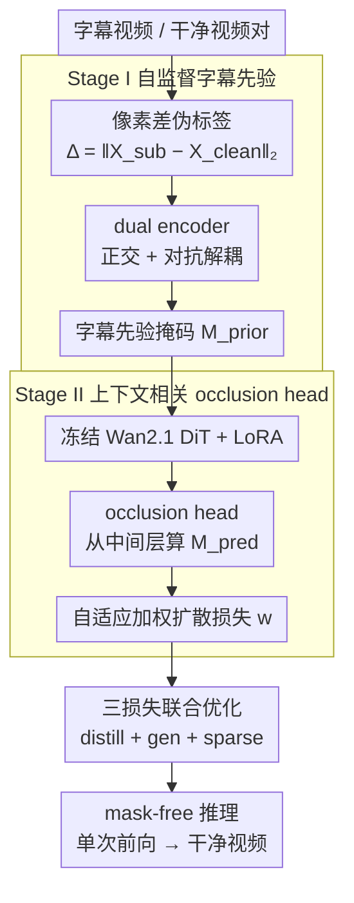

# CLEAR: Context-Aware Learning with End-to-End Mask-Free Inference for Adaptive Video Subtitle Removal

**会议**: ICML 2026  
**arXiv**: [2603.21901](https://arxiv.org/abs/2603.21901)  
**代码**: https://github.com/silent-commit/CLEAR (有)  
**领域**: 视频生成 / 视频 inpainting / 字幕擦除  
**关键词**: 视频字幕去除、扩散模型、LoRA、自监督先验、mask-free 推理

## 一句话总结
本文针对视频字幕擦除提出 CLEAR：两阶段训练（Stage I 用 dual encoder + 正交解耦学自监督字幕先验掩码；Stage II 在 Wan2.1 视频扩散模型上加 LoRA + occlusion head 做自适应加权），推理完全不需要任何 mask 或文本检测器，仅训练 0.77% 参数就在中文测试集上把 PSNR 推到 26.80 dB（比最强基线 +6.77 dB），并零样本泛化到 6 种语言。

## 研究背景与动机
**领域现状**：当前视频字幕擦除主要基于 mask-guided 视频扩散 inpainting（DiffuEraser、EraserDiT、MiniMax-Remover），在每一帧都依赖外部文本检测/分割提供精确二值 mask 作为条件。

**现有痛点**：(L1) 训练效率低——全参数训练 + 逐帧 mask 标注，标注本身要靠人工或专门分割模型贯穿长视频；(L2) 推理脆弱——上线后还要持续跑文本检测/跟踪，一旦检测失败就出现闪烁、残影或漂移；(L3) 先验利用静态——辅助先验（heatmap、optical flow）被均匀加权使用，忽视字幕在不同帧、不同区域的可靠性差异。

**核心矛盾**：视频字幕同时具有时序连续性、多样位置/字体、与摄像机/物体运动复杂耦合，需要 (K1) 参数高效 + 无需 mask 标注，(K2) 完全 mask-free 端到端推理，(K3) 自适应权衡先验质量；而现有方法每一条都做不到。

**本文目标**：构造一个在训练阶段可以从带字幕/干净视频对里**自监督**学到字幕先验、在推理阶段**完全无 mask**、且对字幕区域**动态自适应**加权的框架。

**切入角度**：利用"带字幕帧 - 干净帧"的像素差作为弱监督伪标签（噪声很大但便宜），通过双编码器 + 正交约束把字幕信息隔离出来；再让扩散模型自己用 occlusion head 边生成边校正先验。

**核心 idea**：把"识别字幕掩码"的能力在训练时显式蒸馏到 LoRA 微调后的 DiT 中间层，使得推理时只需要把字幕视频塞进去——内部隐式生成 $\mathcal{M}^{pred}$，外部完全 mask-free。

## 方法详解

### 整体框架
CLEAR 要解决的是"视频字幕擦除必须依赖外部 mask"这个老问题，办法是把"识别字幕在哪"的能力在训练阶段就内化进一个视频扩散模型，推理时只塞进字幕视频本身、不挂任何文本检测器。整个流程拆成两阶段：第一阶段用"带字幕帧 - 干净帧"的像素差当便宜的弱监督，自监督学出一个字幕先验掩码 $\mathcal{M}^{prior}$；第二阶段冻结 Wan2.1-Fun-V1.1-1.3B 这个视频 DiT，只加一小撮 LoRA 和一个轻量 occlusion head，让模型边生成边在中间层隐式预测字幕掩码 $\mathcal{M}^{pred}$ 并据此自适应加权扩散损失。训练完字幕擦除的知识被吸进 LoRA 改造过的 attention，推理就是单次前向出干净视频。

### 关键设计

**1. Stage I 自监督字幕先验：用像素差伪标签 + 正交解耦换掉人工 mask 标注**

痛点是逐帧 mask 标注既贵又脆，但"带字幕视频 / 干净视频"成对数据相对好拿。于是这里用像素差 $\Delta_t=\|\mathbf{X}^{sub}_t-\mathbf{X}^{clean}_t\|_2$ 配上 per-frame 的 mean+std 阈值生成伪标签——便宜，但被光照、半透明字幕、运动模糊污染得很厉害，单跑一个 BCE 根本学不出干净掩码。CLEAR 的对策是上双编码器加三重约束：dual ResNet-50（$E_{\text{sub}},E_{\text{content}}$，只用 ImageNet 预训练）在 1/8 分辨率分别抽字幕特征 $F^{sub}$ 和内容特征 $F^{content}$，正交损失 $\mathcal{L}_{\text{ortho}}=\frac{1}{T H' W'}\sum\langle F^{sub}, F^{content}\rangle^2$ 强制两路无关，判别器再用 $\mathcal{L}_{\text{adv}}$ 防止内容信息泄漏到字幕路；最后只允许解码器从 $F^{sub}$ 出 $\mathcal{M}^{prior}$，同时要求 $F^{content}$ 单独就能重建干净帧。这套"正交 + 对抗 + 重建"本质上是在逼字幕特征独自承载所有帧间差异，掩码 head 因此学的是抽象的"遮挡模式"而非某种字体的笔画形状，这正是后面只用中文训练却能零样本擦掉 6 种语言字幕的根源。

**2. Stage II 上下文相关 occlusion head：让扩散模型边生成边判断字幕难度并自适应加权**

朴素做法是把 Stage I 先验直接当 mask 条件塞给 DiT，但那个先验本身带噪、且对不同帧不同区域的可靠性是不一样的，硬条件会把噪声放大。CLEAR 改成在 DiT encoder 中间层挂一个 2.1M 参数的 occlusion head $\mathcal{H}(\mathbf{h}_{enc})=\mathrm{Conv}^1_{1\times 1}(\mathrm{SiLU}(\mathrm{Conv}^{64}_{3\times 3}(\mathbf{h}_{enc})))$，从激活里算出 $\mathcal{M}^{pred}=\sigma(\mathcal{H}(\mathbf{h}_{enc}))$，相当于让模型同时看 latent 噪声、DiT 高级语义和扩散时间步三种信号去现场校准先验。预测出的掩码不直接当条件，而是去调制扩散损失的逐位置权重 $w_{i,j,t}=(1+\alpha(k)\cdot\mathcal{M}^{pred}_{i,j,t})\cdot(\epsilon^{gen}_{i,j,t}+\delta)^\gamma$：前半段是 spatial emphasis，在预测的字幕区域抬权重；后半段借了 RetinaNet 的 focal 思路，按重建误差给难区加权，让平坦背景少占梯度、字幕硬区多占。系数 $\alpha(k)$ 在 $\alpha_{\min}=5,\alpha_{\max}=15$ 间按三角调度来回振荡以避开局部最优。关键一笔是 $\mathcal{M}^{pred}$ 不做 detach——扩散损失 $\mathcal{L}_{\text{gen}}$ 的梯度能直接回流到 head，高重建误差区会被推高权重、低误差区被压低，形成一个无需 GT mask 的自校正闭环。

**3. 三损失联合优化：把"该擦哪里"的知识吸进 LoRA，实现 mask-free 推理**

只蒸馏先验会把 Stage I 的噪声继承下来；只靠生成反馈又容易让 head 输出 trivial（全 0 或 uniform）。所以 Stage II 用三股信号互相牵制：$\mathcal{L}_{stage2}=\mathcal{L}_{distill}+\mathcal{L}_{gen}+0.1\cdot\mathcal{L}_{sparse}$，其中 $\mathcal{L}_{distill}$ 用 SmoothL1 让 $\mathcal{M}^{pred}\approx\mathcal{M}^{prior}$ 但容忍 1 单位偏差（给结构、又留出修正空间），$\mathcal{L}_{gen}$ 是上面被 $w$ 加权的标准扩散 $\epsilon$ 损失（管生成质量），$\mathcal{L}_{sparse}$ 由 L1 sparsity 加 $D_{KL}(\mathcal{M}^{pred}\|\mathcal{M}^{prior})$ 组成，前者防掩码退化成 uniform、后者防它漂离先验分布。三损失各管一头，最终把 LoRA（rank=64，注入到 q,k,v,o 与 ffn.0/2）和 head 训到"哪些区域该被擦"已经写进 attention 模式里。这样推理时（Alg.1）$\mathcal{M}^{pred}$ 只是个内部量、从不输出，单输入字幕视频经 DiT+LoRA 一次前向、DDIM 5 步、VAE 解码就直接出干净视频，全程没有任何外部文本检测/分割模块，cascading error 也随之消失。

### 损失函数 / 训练策略
Stage I：$\mathcal{L}_{stage1}=\mathcal{L}_{ortho}+0.5\mathcal{L}_{adv}+\mathcal{L}_{region}+0.1\mathcal{L}_{recon}$，AdamW lr=$2\times 10^{-5}$，1 epoch（约 70 min）。Stage II：上式 $\mathcal{L}_{stage2}$，AdamW lr=$1\times 10^{-4}$，gradient clipping=1.0，1 epoch ≈ 1 天（8×A800）。LoRA rank=64，应用到 q,k,v,o 与 ffn.0/2；$\gamma=0.8,\delta=10^{-6}$；Stage II 数据 500 视频 × 81 连续帧。

## 实验关键数据

### 主实验（中文字幕测试集，400 样本）

| Method | PSNR↑ | SSIM↑ | LPIPS↓ | VFID↓ | TWE↓ | Flow Var↓ | s/frame↓ |
|--------|-------|-------|--------|-------|------|-----------|---------|
| ProPainter | 17.24 | 0.658 | 0.329 | 98.46 | 1.286 | 0.885 | 2.36 |
| MiniMax-Remover | 20.03 | 0.773 | 0.166 | 95.39 | 4.222 | 0.415 | 4.90 |
| DiffuEraser | 17.85 | 0.672 | 0.458 | 72.51 | 1.523 | 0.630 | 3.47 |
| **CLEAR (mask-free)** | **26.80** | **0.894** | **0.101** | **20.37** | **1.227** | **0.029** | 4.86 |

PSNR +6.77 dB、VFID -74.7%、Flow Variance -93.0%；所有基线都要外部 mask，而 CLEAR 只输入字幕视频本身。

### 消融实验

| Configuration | PSNR↑ | VFID↓ | TWE↓ |
|---------------|-------|-------|------|
| Baseline (LoRA-only) | 21.62 | 34.74 | 1.320 |
| + M1: Stage I prior + focal weighting | 23.11 | 38.21 | 1.303 |
| + M2: Context Distillation | 24.72 | 31.73 | 1.279 |
| + M3: Context-Aware Adaptation | 25.09 | 31.56 | 1.257 |
| + M4: Context Consistency (CLEAR) | **26.80** | **20.37** | **1.227** |

| Inference setting | PSNR↑ | VFID↓ | s/frame |
|-------------------|-------|-------|---------|
| steps=5 (default) | 26.80 | 20.37 | 4.86 |
| steps=10 | 29.43 | 35.70 | 9.92 |
| cfg=1.2 | 29.65 | 40.71 | 4.86 |
| lora_scale=0.5 | 25.17 | 63.02 | 4.86 |
| lora_scale=1.5 | 27.94 | 42.16 | 4.86 |

### 关键发现
- 累计 5.18 dB PSNR 增益来自四个模块叠加，consistency regularization (M4) 单独提供最大 VFID 下降（-35.5%），说明"防 $\mathcal{M}^{pred}$ 退化"对 perceptual 质量极关键。
- steps=10 PSNR 更高但 VFID 反而劣化（35.70 vs 20.37），暗示更多去噪步引入伪迹，5 步是默认最优。
- LoRA scale 0.5 严重欠擦除（LPIPS +82%），1.5 过平滑——1.0 是甜点；CFG=1.0 平衡 fidelity 与 perceptual。
- 零样本跨语言：训练只用中文字幕，对英语/韩语/法语/日语/俄语/德语都能干净擦除——验证了"学的是抽象遮挡模式而非字符特征"。

## 亮点与洞察
- **像素差伪标签 + 正交解耦**：把昂贵的 mask 标注用"带字幕/干净视频对"的像素差替代，再用正交 + 对抗约束硬把字幕信息单独剥到一个 encoder 里，这一套自监督流程让 500 对视频就足以学出可泛化到 6 种语言的字幕先验，是数据效率上的好示范。
- **gradient flow through $\mathcal{M}^{pred}$ 实现自校正**：很多 attention/mask 加权方法都把 mask detach 防止干扰主任务，本文反其道而行——故意让扩散损失的梯度回流到 head，使得"高重建误差区"获正梯度抬高 $\mathcal{M}^{pred}$、"低误差区"获负梯度降低权重，形成无需 GT mask 的反馈闭环。
- **mask-free 推理的工程价值极高**：去掉文本检测/分割依赖等于砍掉一整条易碎的子管线（OCR 误检、tracking drift 全消失），同时 0.77% 可训练参数 + 单 epoch 训练对实际部署友好；推理一次完成 sub→clean 映射的端到端体验也避免了 cascading error。

## 局限与展望
- 只在中文字幕训练数据上做主实验（160K 训练对、400 测试），其他语言只给定性可视化，定量泛化能力未量化。
- 5 步 DDIM 在 1280×720 分辨率下 4.86 s/frame，离实时还有距离；作者提"real-time inference optimization" 但未给出方案。
- 依赖 Wan2.1-Fun-V1.1-1.3B 作为 backbone，对其他视频扩散模型（HunyuanVideo、Sora 系）的迁移性未验证。
- 自监督先验对"动画字幕、艺术字、极端半透明字幕"是否依然有效需要更多 stress test；M1 只贡献 +1.49 dB 但 VFID 反升（38.21）暗示先验本身仍带噪声，三损失系统才能扛住。

## 相关工作与启发
- **vs DiffuEraser / EraserDiT / MiniMax-Remover**：三者都需外部 mask + 全参数训练；本文 0.77% 参数 mask-free 推理 +6.77 dB PSNR，是"训练标注 + 推理依赖 + 参数效率"三方面的全面解耦。
- **vs ProPainter**：基于 optical flow 传播的传统方法，PSNR 17.24 远落后；说明现代视频扩散先验对字幕这种"高频局部遮挡"已是必要工具。
- **vs Image-based STR (EraseNet/ViTEraser)**：图像方法没有时序一致性约束；CLEAR 的 Flow Variance 0.029（比 ProPainter 0.885 低 33×）证明端到端视频扩散 + LoRA 的时间稳定性优势。
- **idea 可迁移**：dual encoder + 正交解耦 + 像素差伪标签的自监督先验流程可直接搬到其它"局部遮挡擦除"任务（水印去除、logo 抹除、视频 censor 修复），focal-weighted diffusion loss 在 inpainting 一般场景也值得复用。

## 评分
- 新颖性: ⭐⭐⭐⭐ 自监督正交解耦 + gradient-flow occlusion head + 完全 mask-free 推理三点叠加在视频字幕擦除上是新组合，但单项技术（LoRA、自监督 prior）相对成熟。
- 实验充分度: ⭐⭐⭐⭐ 数值上 PSNR/VFID/temporal/flow 多维度对比 + 4 模块逐步消融 + 推理超参分析齐全，但跨语言部分缺定量。
- 写作质量: ⭐⭐⭐⭐ 三个 limitation (L1-L3) 与三个 capability (K1-K3) 一一对应，方法图、算法 box、表格组织清晰。
- 价值: ⭐⭐⭐⭐ 真正解决了视频字幕擦除部署中的"必须有 mask"痛点，0.77% 参数 + mask-free 推理对产品级应用价值很高。

<!-- RELATED:START -->

## 相关论文

- [\[ICML 2026\] End-to-End Autoregressive Image Generation with 1D Semantic Tokenizer](end-to-end_autoregressive_image_generation_with_1d_semantic_tokenizer.md)
- [\[ICML 2026\] AdaEraser: Training-Free Object Removal via Adaptive Attention Suppression](adaeraser_training-free_object_removal_via_adaptive_attention_suppression.md)
- [\[ICCV 2025\] End-to-End Multi-Modal Diffusion Mamba](../../ICCV2025/image_generation/end-to-end_multi-modal_diffusion_mamba.md)
- [\[NeurIPS 2025\] LinEAS: End-to-end Learning of Activation Steering with a Distributional Loss](../../NeurIPS2025/image_generation/lineas_end-to-end_learning_of_activation_steering_with_a_distributional_loss.md)
- [\[CVPR 2026\] DeCo: Frequency-Decoupled Pixel Diffusion for End-to-End Image Generation](../../CVPR2026/image_generation/deco_frequency-decoupled_pixel_diffusion_for_end-to-end_image_generation.md)

<!-- RELATED:END -->
