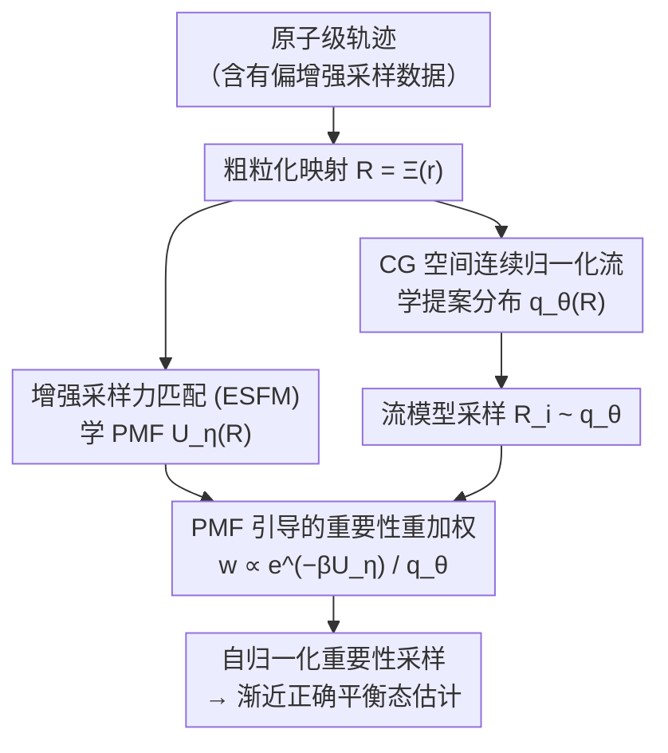

# Coarse-Grained Boltzmann Generators

**会议**: ICML 2026  
**arXiv**: [2602.10637](https://arxiv.org/abs/2602.10637)  
**代码**: https://github.com/tummfm/cg-bg  
**领域**: 科学计算 / 分子模拟  
**关键词**: Boltzmann Generator, 粗粒化建模, 重要性采样, 平均力势, 归一化流  

## 一句话总结
提出 Coarse-Grained Boltzmann Generators (CG-BGs)，在粗粒化坐标空间中结合归一化流生成模型和学到的平均力势 (PMF) 进行重要性采样，以远低于原子级 BG 的计算成本实现渐近正确的分子平衡态采样。

## 研究背景与动机

**领域现状**：从 Boltzmann 分布中采样平衡态分子构型是统计物理中的核心难题。Boltzmann Generator (BG) 通过精确似然生成模型与重要性采样相结合来应对此问题，能够生成提案样本并进行重加权以得到无偏估计。同时，粗粒化 (CG) 方法通过降低自由度来处理更大的分子系统。

**现有痛点**：原子级 BG 在维度增长时面临两大瓶颈——(1) 生成分布与目标分布的重叠度下降导致重要性权重方差爆炸，重加权失效；(2) Jacobian 行列式计算随维度急剧增长。另一方面，Boltzmann Emulator 虽通过粗粒化降维提升了可扩展性，但省略了重加权步骤导致无法纠正分布偏差，且依赖难以获得的长时间无偏模拟数据训练。

**核心矛盾**：BG 有重加权机制但难以扩展到大系统；CG Emulator 可扩展但没有纠偏机制——两者的优势互补但未被整合。

**本文目标**：在粗粒化坐标空间中实现带重要性采样的生成建模，同时从快速收敛的增强采样数据中学习目标能量函数。

**切入角度**：粗粒化坐标下的边缘分布 $p(\mathbf{R})$ 同样可以写成 Boltzmann 形式 $p(\mathbf{R}) \propto e^{-\beta U(\mathbf{R})}$，其中 $U(\mathbf{R})$ 是平均力势 (PMF)。如果能学到 PMF，就可以在低维 CG 空间中复用 BG 的重要性采样框架。

**核心 idea**：用增强采样力匹配 (ESFM) 从快速收敛的有偏轨迹中学 PMF，用归一化流在 CG 空间生成提案分布，用学到的 PMF 做重要性重加权，形成完整的 CG-BG 框架。

## 方法详解

### 整体框架
CG-BG 要解决的是「BG 能重加权却扩不到大系统、CG Emulator 能扩展却没法纠偏」这对矛盾，做法是把整个 BG 框架搬到低维粗粒化坐标空间里跑。原子级轨迹（甚至是有偏的增强采样数据）先经粗粒化映射 $\mathbf{R} = \Xi(\mathbf{r})$ 降到 CG 坐标，然后并行训练两个部件：一个连续归一化流 $q_\theta(\mathbf{R})$ 负责生成提案构型，一个神经网络 PMF $U_\eta(\mathbf{R})$ 负责给出目标能量。推理时流模型采样、PMF 算重要性权重 $w(\mathbf{R}) \propto e^{-\beta U_\eta(\mathbf{R})} / q_\theta(\mathbf{R})$，再用自归一化重要性采样把有偏提案纠成渐近正确的平衡态估计。

### 关键设计

**1. 增强采样力匹配 (ESFM)：用有偏数据学到正确的 PMF**

PMF 的痛点是标准力匹配要求收敛的无偏平衡态轨迹，而这种轨迹在亚稳态之间过渡缓慢、采集成本极高。ESFM 绕开这点，靠的是纤维分布不变性：在 CG 坐标上施加任意偏置势 $V(\mathbf{R})$ 时，给定 $\mathbf{R}$ 的原子级条件分布不变，即 $p_V(\mathbf{r}|\mathbf{R}) = p(\mathbf{r}|\mathbf{R})$。既然条件分布没变，投影力的条件均值（也就是平均力）在有偏采样下也不变，于是力匹配的回归目标完全不受偏置干扰。训练损失为 $\mathcal{L}_{\mathrm{ESFM}}(\eta) = \mathbb{E}_{\mathbf{r} \sim \mathcal{D}_{\mathrm{bias}}}[\|\nabla_{\mathbf{R}} U_\eta(\Xi(\mathbf{r})) + \mathcal{F}_{\mathrm{proj}}(\mathbf{r})\|^2]$，其中投影力从无偏的原子势重新计算（偏置只用来加速采样、不进损失）。这样就能用 well-tempered metadynamics 这类快速覆盖过渡区域的增强采样数据来训 PMF，而它与标准力匹配享有相同的全局最优解，得到的分布 KL 散度还受力误差平方的上界约束。

**2. CG 空间连续归一化流：低维里生成提案分布**

提案分布要尽量贴合目标边缘分布，否则重要性权重方差会爆炸。CG-BG 用 Flow Matching 训练神经向量场 $v_\theta(t, \mathbf{x})$，沿线性插值路径 $\mathbf{x}_t = (1-t)\mathbf{x}_0 + t\mathbf{x}_1$ 回归目标向量场来学 $q_\theta(\mathbf{R})$。关键在于流模型直接在 CG 空间操作，维度远小于原子级——例如丙氨酸六肽从 72 个原子降到 Core Beta 映射下的少量珠子。维度一降，生成分布与目标分布的重叠度立刻改善，重要性权重方差更低、ESS 更高，同时推理时的 Jacobian 行列式计算成本也大幅下降，正好对症原子级 BG 随维度增长的两大瓶颈。

**3. PMF 引导的重要性重加权：把提案纠成渐近正确**

Boltzmann Emulator 直接拿 $q_\theta$ 估可观测量，没有纠偏机制，分布偏差无法修正。CG-BG 把学到的 PMF 当作目标能量函数，对流模型采的每个样本 $\mathbf{R}_i \sim q_\theta$ 计算重要性权重 $w(\mathbf{R}_i) \propto e^{-\beta U_\eta(\mathbf{R}_i)} / q_\theta(\mathbf{R}_i)$，再用自归一化估计量算可观测量，从而恢复了 BG 的重加权能力。重加权质量用归一化有效样本量 $\mathrm{ESS} = (\sum w_i)^2 / (B \sum w_i^2)$ 衡量（$B$ 为批大小），并对权重做截断以抵抗 MLP 外推异常和生成伪影。由于 PMF 是从显式溶剂数据学来的，它还能捕获隐式溶剂模型表达不了的溶剂介导效应——这正是原子级 BG 受限于隐式溶剂精度上限而 CG-BG 能突破的原因。

### 训练策略
两个部件分阶段独立训练、推理时再组合：PMF 网络用 ESFM 损失在有偏或无偏的原子级轨迹上训，归一化流用 Conditional Flow Matching 损失在 CG 坐标数据上训，二者互不依赖可并行进行。

## 实验关键数据

### 主实验

在丙氨酸二肽 (22 原子)、三肽 (42 原子)、六肽 (72 原子) 上评估，以显式溶剂 MD 模拟为参考标准。

| 模型 | JS 散度 (↓) | PMF 误差 (↓) | ESS (↑) |
|------|------------|-------------|---------|
| CG-BG Heavy Atom | 0.0048 | 0.2005 | 0.5112 |
| CG-BG Heavy Atom (有偏数据) | 0.0063 | 0.2277 | 0.4115 |
| CG-BG Core Beta | 0.0052 | 0.2210 | 0.5528 |
| CG-BG Core Beta (有偏数据) | 0.0057 | 0.2093 | 0.4818 |
| 隐式溶剂 GB (OBC1) | 0.0157 | 0.3709 | — |
| 隐式溶剂 GB (OBC2) | 0.0182 | 0.4028 | — |

### 计算效率对比（丙氨酸二肽，$10^4$ 样本）

| CG 映射 | 训练时间 | 推理时间 | 总时间 |
|---------|---------|---------|--------|
| Core Beta | 0.45h | 0.95min | 0.47h |
| Heavy Atom | 0.80h | 3.78min | 0.86h |
| All Atom (仅溶质) | 2.55h | 14.91min | 2.80h |

### 更大体系验证（三肽 & 六肽）

| 模型 | 三肽 JS (↓) | 三肽 PMF (↓) | 三肽 ESS (↑) | 六肽 JS (↓) | 六肽 PMF (↓) | 六肽 ESS (↑) |
|------|------------|-------------|-------------|------------|-------------|-------------|
| CG-BG Core Beta | 0.0060 | 0.2112 | 0.4212 | 0.0100 | 0.3646 | 0.1231 |
| CG-BG Heavy Atom | 0.0056 | 0.1957 | 0.3201 | — | — | — |
| 隐式溶剂 GB (OBC2) | 0.0932 | 1.0274 | — | 0.1652 | 1.8401 | — |

### 关键发现
- CG-BG 重加权后在所有指标上显著优于隐式溶剂基线，尤其在三肽和六肽等更大体系中差距扩大（六肽 JS 散度 0.0100 vs 0.1652）
- 粗粒化分辨率存在精度-效率 trade-off：Core Beta 映射 ESS 更高（分布重叠更好）但重加权后精度略低于 Heavy Atom 映射
- 从 10ns 有偏数据训练的 CG-BG 与 500ns 无偏数据训练版本精度接近，证明了 ESFM 对数据效率的提升
- 原子级 BG 只能达到隐式溶剂精度上限，而 CG-BG 通过从显式溶剂数据学 PMF 突破了这一限制

## 亮点与洞察
- **纤维分布不变性的巧妙利用**：CG 偏置势不改变给定 CG 坐标下的原子级条件分布，使得力匹配目标在有偏采样下等价——这个理论保证使得用增强采样的快速收敛数据替代昂贵的无偏轨迹成为可能
- **无模拟 PMF 评估**：学好一个提案分布后可以通过切换不同 PMF 的重要性权重一次性评估多个候选 CG 力场，无需为每个模型单独跑 MD——这是对 CG 力场开发工作流的显著加速
- **粗粒化 + 重加权的互补设计**：粗粒化解决了维度问题使 ESS 可控，重加权解决了分布偏差问题保证渐近正确——这种将降维与纠偏正交分解的思路可迁移到其他高维采样问题

## 局限与展望
- 依赖预定义的集体变量（CG 映射和增强采样的 CV 选择），对复杂体系可能难以确定合适的 CV
- 当前实验仅在丙氨酸短肽（≤72 原子）上验证，更大的蛋白质体系效果待验
- 六肽的 ESS 已降至 0.1231，随体系增大重要性采样效率可能进一步下降
- 未来方向包括结合自动 CV 发现方法、引入可迁移生成模型架构、以及探索基于能量的训练替代 Flow Matching

## 相关工作与启发
- **Boltzmann Generator** (Noé et al., 2019)：原子级 BG 框架，通过归一化流 + 重要性采样实现平衡态采样，但受维度限制
- **Boltzmann Emulator** (Lewis et al., 2025)：CG 空间生成模型但无重加权，依赖收敛数据
- **ESFM** (Chen et al., 2026)：增强采样力匹配理论基础，证明了 CG 偏置下力匹配等价性
- **TarFlow / ECNF++** (Tan et al., 2025b)：改进的原子级 BG 架构，但仍受限于隐式溶剂精度

<!-- RELATED:START -->

## 相关论文

- [\[NeurIPS 2025\] BoltzNCE: Learning Likelihoods for Boltzmann Generation with Stochastic Interpolants](../../NeurIPS2025/image_generation/boltznce_learning_likelihoods_for_boltzmann_generation_with_stochastic_interpola.md)
- [\[NeurIPS 2025\] Flatten Graphs as Sequences: Transformers are Scalable Graph Generators](../../NeurIPS2025/image_generation/flatten_graphs_as_sequences_transformers_are_scalable_graph_generators.md)
- [\[NeurIPS 2025\] Progressive Inference-Time Annealing of Diffusion Models for Sampling from Boltzmann Densities](../../NeurIPS2025/image_generation/progressive_inference-time_annealing_of_diffusion_models_for_sampling_from_boltz.md)
- [\[CVPR 2025\] Community Forensics: Using Thousands of Generators to Train Fake Image Detectors](../../CVPR2025/image_generation/community_forensics_using_thousands_of_generators_to_train_fake_image_detectors.md)
- [\[CVPR 2026\] SliderEdit: Continuous Image Editing with Fine-Grained Instruction Control](../../CVPR2026/image_generation/slideredit_continuous_image_editing_with_fine-grained_instruction_control.md)

<!-- RELATED:END -->
