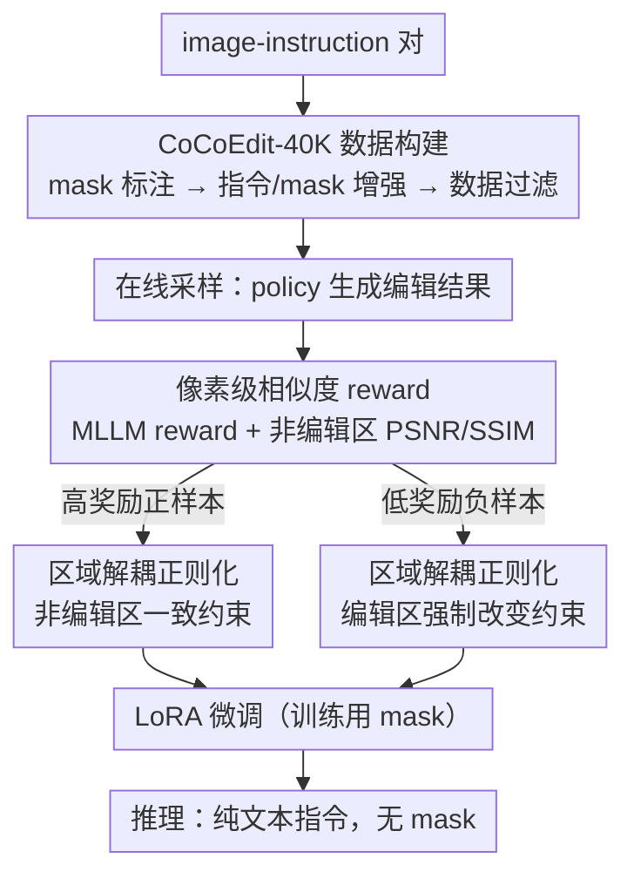

# CoCoEdit: Content-Consistent Image Editing via Region Regularized Reinforcement Learning

**会议**: ICML 2026  
**arXiv**: [2602.14068](https://arxiv.org/abs/2602.14068)  
**代码**: https://github.com/CoCoEdit (有)  
**领域**: 图像生成 / 指令式图像编辑 / RL 后训练  
**关键词**: 内容一致性编辑、像素级相似度 reward、区域正则化、DiffusionNFT、FLUX/Qwen-Image-Edit

## 一句话总结
本文针对"编辑模型常在不该改的区域乱改"这一痛点，构造 CoCoEdit-40K 局部编辑数据集 + 提出 pixel-level 相似度 reward 补充 MLLM reward + 设计区域正则化 RL 目标（高奖励样本约束非编辑区一致、低奖励样本强迫编辑区做出改变），把 FLUX.1 Kontext 和 Qwen-Image-Edit 同时在编辑得分和 PSNR/SSIM 上提升，打破现有"提编辑能力必伤一致性"的 trade-off。

## 研究背景与动机
**领域现状**：现代指令式编辑模型（FLUX.1 Kontext、Qwen-Image-Edit、Step1X-Edit、BAGEL、OmniGen2）凭海量数据 + 强生成 backbone 已能很好理解指令；近期 Edit-R1、MotionNFT 等用 RL（DPO/PPO/GRPO/DiffusionNFT）+ MLLM reward 做后训练进一步推动编辑得分。

**现有痛点**：(i) 编辑模型在该编辑的区域做得不错，但**非编辑区**经常被无意修改——例如改前景人物时背景的枕头消失；(ii) 现有 RL 后训练只用 MLLM reward，而 MLLM 对细粒度的非编辑区像素差异不敏感，反而把编辑模型推向"为了高分而剧烈改图"，PSNR 显著下降（Edit-R1 把 FLUX 的 PSNR 砍掉 5.15 dB）。

**核心矛盾**：编辑能力（MLLM Score）和内容一致性（PSNR）在现有训练目标下是冲突的：MLLM reward 是空间无关的标量、对小改动不敏感；用它做 RL 必然牺牲一致性。

**本文目标**：构造一个能同时驱动 (i) 准确编辑、(ii) 严格保留非编辑区 的后训练框架，无需在推理时额外提供 mask（保持与基线公平），并配套修改 benchmark 让一致性可被量化评估。

**切入角度**：(a) 用 MLLM + SAM2 离线标注每个训练样本的 editing mask + 改写指令；(b) 在 reward 端补一个 pixel-level 相似度 reward（masked PSNR/SSIM）让 MLLM 看不见的细节差异被量化；(c) 在 loss 端用 mask 把 latent 分成编辑区和非编辑区，对正负样本分别施加区域级正则化。

**核心 idea**：把"非编辑区一致性"这件事**同时**作为 reward 和 region-aware regularizer 注入 RL 后训练，并让高奖励样本（编辑成功）保非编辑区、低奖励样本（欠编辑）反向逼编辑区做改变——形成正负双向修正闭环。

## 方法详解

### 整体框架
要解决的是"编辑模型乱改非编辑区"，而根因在于现有 RL 后训练只盯着空间无关的 MLLM 标量奖励、看不见非编辑区的细节漂移。CoCoEdit 把"非编辑区一致性"同时塞进奖励端和正则端，跑一个每 iteration 三步走的 RL 循环：先离线把普通 image-instruction 数据升级成带 mask 的三元组，再在线采样并用"MLLM reward + 像素 reward"评分、用区域正则化对正负样本分别施加空间约束，最后只在训练用 mask、推理时纯文本指令直接 LoRA 加载。下面按三个关键设计展开。

### 关键设计

**1. CoCoEdit-40K：按"条件信号质量"而非"GT 质量"过滤的 RL 友好数据**

后面的像素 reward 和区域正则化两个设计都依赖准确的 mask，而 OmniEdit/ImgEdit 原本只有 image-instruction 对，所以第一步先用一条数据 pipeline 把它升级成 (image, mask, refined instruction) 三元组。流程分三步：先做 Mask Annotation，用 Qwen2.5-VL-72B 出 bbox、SAM2 出 mask；再做 Instruction & Mask Augmentation，让 MLLM 把简短指令扩成含空间位置和物体属性的 refined instruction，并对 replace/motion 这类会生成新内容的编辑做 mask dilation 把新内容也圈进去；最后做 Data Filtering，按 instruction clarity / mask accuracy / target prominence 三个维度打分留高分样本。

关键区别在于过滤标准：传统编辑数据集为适配 SFT 会过滤"GT 编辑图像好不好看"，但 RL 不学 ground-truth pixel、而是靠 reward 自己探索，真正需要的是"指令清晰 + mask 准"——只有这两样过硬，policy 才能在每个样本上拿到精确的区域奖励和区域约束。换句话说，这套数据策略是和 RL 目标耦合设计的，也正因如此后面消融里它在 SFT 下并不增益。

**2. 像素级相似度 reward $r_{sim}$：把 MLLM 看不见的非编辑区漂移变成可优化信号**

痛点在于 MLLM reward 是一个空间无关的标量，对"姿态相同但背景细节微变"几乎给同分（Fig.5 的例子里背景枕头消失了但 MLLM 不扣分），于是 RL 训完非编辑区会悄悄漂移。CoCoEdit 在奖励端补一项像素级相似度：给定输入条件 $\hat c_I$、采样输出 $\hat x_0$ 和 editing mask $m$，只在**非编辑区**计算 $\mathrm{PSNR}_m$ 与 $\mathrm{SSIM}_m$，把 PSNR 归一化到 $[0,1]$ 与 SSIM 同尺度后取均值得到 $r_{sim}$，最终奖励为 $r=\mathrm{op}(\lambda_{mllm}\, r_{mllm}+\lambda_{sim}\, r_{sim})$，其中 $\mathrm{op}(\cdot)$ 是 optimality 转换。这样"保住非编辑区"就成了一个可微的优化目标，而不再被 MLLM 忽略。

不过权重必须偏向 MLLM 一侧：默认取 $\lambda_{mllm}=0.8,\lambda_{sim}=0.2$；一旦把像素权重加到 $\lambda_{sim}=0.5$，模型会走向极端——为了拿满一致性分干脆完全不编辑，PSNR 暴涨但编辑得分崩塌。

**3. 区域解耦正则化 $L_{ner}^+$ 与 $L_{er}^-$：用正负样本分治避免两个相反目标互掐**

光有标量奖励还不够，因为它没有空间信息，没法分别约束"编辑区要变、非编辑区要像"——这两个目标一旦塞进同一个 loss 就会冲突。CoCoEdit 借 DiffusionNFT 的 $x$-prediction 公式拿到正策略输出 $x_\theta^+(x_t\mid c)$ 和负策略输出 $x_\theta^-(x_t\mid c)$，用下采样后的 mask $\tilde m$ 定义两个投影算子 $P_{ner}(z)=z\odot\tilde m$ 和 $P_{er}(z)=z\odot(1-\tilde m)$，再把两类约束分派给不同样本。对**高奖励（正）样本**（编辑已经做对了），用 $L_{ner}^+=\max(0,\, d(x_\theta^+, c_I)_{\tilde m}-\tau^+)$ 逼它在非编辑区与输入 latent 相似，hinge 阈值 $\tau^+$ 容忍小偏差；对**低奖励（负）样本**（编辑没做到位），用 $L_{er}^-=\max(0,\, \tau^- - d(x_\theta^-, c_I)_{1-\tilde m})$ 反向逼它在编辑区与输入拉开大于 $\tau^-$ 的差距、防止欠编辑。

这样的分治之所以有效，是因为同一个 loss 在不同样本上传递的是方向相反的梯度：正样本被告知"别破坏其他地方"、负样本被告知"赶紧改该改的地方"，互补而不打架；而且它和 NFT 的 implicit positive/negative policy 框架天然契合，正负策略本来就成对存在，直接挂上区域正则项即可。

### 损失函数 / 训练策略
总目标按奖励对正负分支加权：$\mathcal{L}(\theta)=\mathbb{E}[r\cdot(\mathcal{L}^+ + \lambda_{ner}L_{ner}^+)+(1-r)\cdot(\mathcal{L}^- + \lambda_{er}L_{er}^-)]$，基础项 $\mathcal{L}^\pm=\|x_\theta^\pm-x_0\|_2^2$，正负策略由 NFT 的 $v_\theta^\pm = (1\mp\beta)v^{old}\pm\beta v_\theta$ 得到。训练用 LoRA rank=32，FLUX.1 Kontext 与 Qwen-Image-Edit 各自微调，8×A800、batch 3、group 12、1K 步，VRAM ≈ 70 GB（与 Edit-R1 持平），每步 ≈ 12 min（比 Edit-R1 多 2 min）。

## 实验关键数据

### 主实验（GEdit-Bench-EN，加入 PSNR/SSIM/LPIPS/DINO + Rank）

| Method | Overall↑ | PSNR↑ | SSIM↑ | LPIPS↓ | DINO↑ | Human Rank↓ |
|--------|---------|-------|-------|--------|-------|-------------|
| FLUX.1 Kontext | 6.286 | 24.168 | 0.825 | 0.150 | 0.871 | 2.1 |
| w/ Edit-R1 | 7.113 | 19.013 | 0.716 | 0.214 | 0.804 | 2.6 |
| **w/ CoCoEdit** | 6.939 | **25.331** | **0.874** | **0.139** | **0.882** | **1.6** |
| Qwen-Image-Edit | 7.560 | 19.488 | 0.662 | 0.185 | 0.831 | 2.7 |
| w/ Edit-R1 | 7.746 | 18.441 | 0.639 | 0.214 | 0.804 | 3.3 |
| w/ MotionNFT | 7.711 | 18.709 | 0.642 | 0.201 | 0.813 | 2.9 |
| **w/ CoCoEdit** | **7.754** | **22.283** | **0.774** | **0.162** | **0.852** | **1.4** |

在 Qwen-Image-Edit 上 CoCoEdit 同时拿下最高编辑得分（7.754）和最高 PSNR（22.283，+2.8 dB），而 Edit-R1/MotionNFT 编辑得分提升但 PSNR 反而下降。ImgEdit-Bench 上 PSNR +1.16 dB / +1.49 dB，Overall 同步提升。

### 消融实验

| Setting | GEdit Overall↑ | GEdit PSNR↑ | ImgEdit Overall↑ | ImgEdit PSNR↑ |
|---------|--------------|-------------|-----------------|----------------|
| Qwen-Image-Edit (base) | 7.560 | 19.488 | 3.70 | 17.635 |
| w/ SFT on 40K (含一致性 loss) | 7.219 | 20.293 | 3.61 | 18.048 |
| w/ RL on 120K | 7.723 | 22.204 | 3.79 | 19.201 |
| **w/ RL on 40K (CoCoEdit)** | **7.754** | 22.283 | 3.79 | 19.125 |

| Reward 配比 | 现象 |
|------------|------|
| $\lambda_{mllm}=0.5,\lambda_{sim}=0.5$ | 编辑得分崩塌、PSNR 暴涨 → 模型完全不编辑 |
| $\lambda_{mllm}=0.8,\lambda_{sim}=0.2$ | 编辑稳步上升、一致性有上限 |
| + 区域正则化（默认） | 编辑得分进一步提升 + 收敛更快 |

### 关键发现
- 40K 高质量数据已足够 RL 收敛，3× 扩到 120K 几乎无增益（7.754 vs 7.723），印证 RL 看重质量而非规模。
- SFT 即使加一致性 loss 也只小幅提 PSNR、Overall 反降（7.219 < 7.560），说明 CoCoEdit-40K 不是为 SFT 设计——增益主要来自 RL 算法本身 + region regularizer，而非数据。
- Edit-R1 在 FLUX 上把 PSNR 砍掉 5.15 dB，在 Qwen 上砍 1.04 dB；MotionNFT 类似——验证了"现有 RL 后训练偏向编辑能力而牺牲一致性"这一核心动机。
- 全局编辑（style/tone/extract）虽未训练但保持竞争力，甚至 Style 上略胜（Qwen 6.992 vs 6.666）；像素一致性训练副作用是利好结构保持的全局风格变换。

## 亮点与洞察
- **reward 与 regularizer 双管齐下的设计哲学**：MLLM reward 看大方向、像素 reward 看细节、区域正则化按正负样本分别管空间约束——三个信号在不同维度互补，避免任何一个信号过强带来副作用（纯像素 reward 会让模型不编辑、纯 MLLM reward 会让模型乱编辑）。
- **正负样本分治的区域正则化**：把"非编辑区一致"放在正样本上、"编辑区必须改变"放在负样本上，是利用 DiffusionNFT 框架 implicit positive/negative policy 的巧思——同一个 loss 在不同样本上传递相反方向的梯度，实现自动 trade-off。
- **数据策略思想可迁移**：传统编辑数据集按"GT 图像质量"过滤适配 SFT；本文按"条件信号（指令 + mask）质量"过滤适配 RL——把数据筛选与训练范式对齐，这一思路在其他 RL 后训练任务（视频编辑、3D 编辑）同样适用。
- **mask 训练用、推理不用的对齐做法**：相比 FireEdit 等推理时也要 mask 的方法，CoCoEdit 推理纯指令，能与 baseline 公平比较——是一个易被实践者忽视但很重要的设计抉择。

## 局限与展望
- 仅在 FLUX.1 Kontext 和 Qwen-Image-Edit 上验证，其他大编辑模型（Step1X-Edit、OmniGen2、BAGEL）是否需要重新训 LoRA 未试。
- 训练数据全是 local editing，对 global style/tone 虽未严重退化但也无显著提升；motion 类编辑只在 Qwen 上提升明显。
- 区域正则化阈值 $\tau^\pm$ 是 adaptive 但需 type-specific 调参（Appendix B.3），不同编辑类别的最优 $\tau$ 可能不同；超大编辑（如 90% 区域 replace）下 mask 退化为全 1，region regularizer 失效。
- 训练时需 MLLM-as-reward（Qwen2.5-VL-32B 独立服务器），训练成本仍偏高；负价情感/极端指令下 reward 噪声会放大欠编辑风险。

## 相关工作与启发
- **vs Edit-R1 (UniWorld-V2)**：同样基于 DiffusionNFT 做 image editing RL，但 Edit-R1 用图像生成数据集且只有 MLLM reward；CoCoEdit 改用 image editing 数据 + 像素 reward + 区域正则化，PSNR 比 Edit-R1 提升 6.3 dB（FLUX 25.33 vs 19.01）。
- **vs MotionEdit / MotionNFT**：MotionNFT 加 motion 对齐 reward 提升运动编辑能力；CoCoEdit 提供更通用的一致性框架，在 Motion 类别（Qwen 7.758 vs MotionNFT 7.760）持平且其他类全面领先。
- **vs DPO / PPO / GRPO**：本文用 DiffusionNFT 框架避开 policy gradient（DanceGRPO、Flow-GRPO 也走 GRPO 路线），证明在 image editing 这种"奖励信号有噪声 + 区域感很强"的场景下，对比正负策略 + 区域正则化比纯 PG 更稳。
- **vs SeedEdit / Step1X-Edit / LongCat-Image**：这些是大规模数据训练的强 baseline；CoCoEdit 不需要从头大规模训练，只用 40K + 1K iterations RL 后训练就能把已有顶级模型再推一档，对资源有限的研究者非常友好。

## 评分
- 新颖性: ⭐⭐⭐⭐ pixel-level reward 补 MLLM + 正负样本分治的区域正则化是该子方向首次明确提出的组合，DiffusionNFT 的应用也很巧。
- 实验充分度: ⭐⭐⭐⭐ 两大基线模型 × 两大 benchmark × 多 baseline + 局部/全局编辑 + 数据规模 / SFT 消融 + 人评，覆盖很全。
- 写作质量: ⭐⭐⭐⭐ "三步循环"流程清晰，正负样本分治的 motivation 推导自然，限制和效率分析诚实。
- 价值: ⭐⭐⭐⭐⭐ 实际解决了大编辑模型部署时"乱改背景"的痛点，且能即插即用到现有 SOTA 模型上同时提升编辑质量和一致性，工业应用价值极高。

<!-- RELATED:START -->

## 相关论文

- [\[CVPR 2026\] Leveraging Verifier-Based Reinforcement Learning in Image Editing](../../CVPR2026/image_generation/leveraging_verifier-based_reinforcement_learning_in_image_editing.md)
- [\[ICML 2026\] Path-Coupled Bellman Flows for Distributional Reinforcement Learning](path-coupled_bellman_flows_for_distributional_reinforcement_learning.md)
- [\[ICML 2026\] Offline Multi-agent Reinforcement Learning via Sequential Score Decomposition](offline_multi-agent_reinforcement_learning_via_sequential_score_decomposition.md)
- [\[ECCV 2024\] RegionDrag: Fast Region-Based Image Editing with Diffusion Models](../../ECCV2024/image_generation/regiondrag_fast_region-based_image_editing_with_diffusion_models.md)
- [\[ICML 2026\] Content-Style Identification via Differential Independence](content-style_identification_via_differential_independence.md)

<!-- RELATED:END -->
