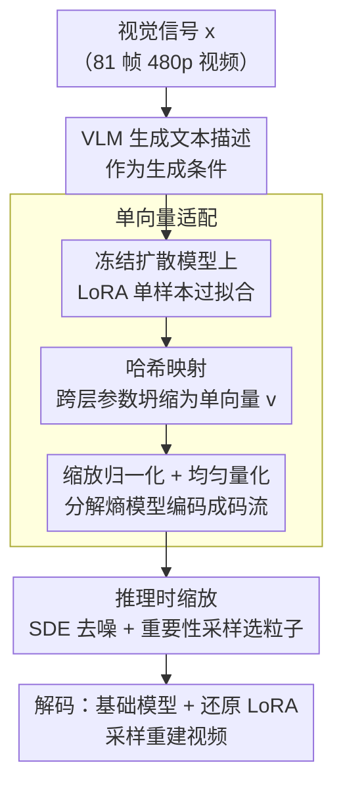

# Compression as Adaptation: Implicit Visual Representation with Diffusion Foundation Models

**会议**: ICML 2026  
**arXiv**: [2603.07615](https://arxiv.org/abs/2603.07615)  
**代码**: 有 (官方)  
**领域**: 图像生成/视觉压缩  
**关键词**: 隐式表示, 扩散模型, 视觉压缩, LoRA, 推理时缩放  

## 一句话总结
将视觉信号编码为冻结扩散基础模型上的低秩适配参数（LoRA），并通过哈希映射压缩为单个紧凑向量，在极低码率下实现强感知质量的视频压缩，同时支持推理时缩放和生成式编辑。

## 研究背景与动机

**领域现状**：大规模视觉生成模型（如 Wan-2.1、Qwen）通过海量数据训练获得了丰富的视觉知识，但视觉信号本身仍以像素、潜变量或 token 等外部显式表示存在，无法直接利用模型内部学到的先验知识。传统视频压缩（H.265/H.266）和神经编解码器通过 VAE 将信号编码为显式潜码，信号特定信息完全存储在潜码中，解码器跨信号共享但不包含信号信息。

**现有痛点**：隐式神经表示（INR）虽然能将信号参数化为小型 MLP，但这些网络从零训练，与大规模预训练模型的视觉知识完全脱耦，压缩能力受限。即使近期有将 INR 与扩散过程结合的工作，仍无法真正利用基础模型中编码的高层语义先验。

**核心矛盾**：显式表示将"信号是什么"和"模型知道什么"割裂开来，导致表示冗余——模型已经"知道"自然图像/视频长什么样，但压缩时无法利用这些知识。

**本文目标**：不再压缩"视觉信号是什么"，而是压缩"如何生成该视觉信号"——将视觉信号表示为扩散模型的生成函数，用最少的参数偏差描述从预训练模型到目标信号的适配过程。

**核心 idea**：用 LoRA 对冻结扩散模型做单样本微调，将适配参数通过伪随机哈希映射到单个向量 $\mathbf{v} \in \mathbb{R}^{1 \times k}$，再施加熵约束量化，实现 81 帧视频压缩为一个紧凑向量。

## 方法详解

### 整体框架
本文要解决的是极低码率下的感知视频压缩，核心转变是不再压缩"视觉信号是什么"，而是压缩"如何让一个已有的扩散基础模型生成出这个信号"。给定一个视觉信号 $x$（如 81 帧 480p 视频），先用 VLM 生成文本描述作为条件，在冻结的视频扩散模型上对一组 LoRA 参数做单样本过拟合；再把这些参数哈希压缩成单个向量并量化熵编码成码流，解码端用同一基础模型加上还原的 LoRA 权重采样重建视频。

### 关键设计

**1. 单向量适配：把整个 LoRA 压成一个向量**

适配过程本身会引入新参数，如果这些参数太多就失去了压缩意义，这是隐式表示落地的第一个痛点。对每个预训练权重矩阵 $\mathbf{W}_0 \in \mathbb{R}^{m \times n}$，LoRA 引入低秩更新 $\Delta\mathbf{W} = \mathbf{AB}$（$r \ll \min(m,n)$），但大模型层数多，逐层累加后总参数量仍然可观。本文借鉴哈希技巧（Chen et al., 2015），用一个 PRNG 生成固定的随机投影，把所有层的 LoRA 参数统一映射到单个共享向量 $\mathbf{v} \in \mathbb{R}^{1 \times k}$，强制跨层参数共享，真正需要传输的信息就坍缩成这一个向量。随后引入可学习缩放参数 $s$ 做归一化后再均匀量化（训练时用加性均匀噪声替代取整以保持可导），并用分解熵模型估计码率，把每参数约束到 1-3 bit。这样一个 81 帧视频最终只需一个向量表示，标题与熵模型参数的开销不到总码率的 1%，实现了极致的码率压缩。

**2. 推理时缩放：编码后仍可用算力换质量**

显式码流一旦写定就无法再优化，而本文的表示本身是生成过程的一部分，这给了它一个独特机会——编码后还能继续调控输出。具体做法是编码端改用 SDE 去噪，每步通过共享 PRNG 生成 $M$ 个候选粒子；因为编码端握有原始信号 $x$，它可以算出最优去噪核 $p^*(x_{t_{n-1}}|x_{t_n})$，以此为目标对模型预测核 $p(x_{t_{n-1}}|x_{t_n})$ 做重要性采样，挑出权重 $w^{(m)} \propto p^*(x_{t_{n-1}}^{(m)})/p(x_{t_{n-1}}^{(m)})$ 最大的那个粒子。这里只需额外传输每步的选择索引这点侧信息，解码端用相同 PRNG 就能复现同样的采样轨迹。缩放可以沿两个轴展开：每步候选数（只增加编码端计算）和去噪步数（编解码端都增加）。这一过程等价于相对熵编码（Diff-C），适配后的扩散模型作为更强的先验，进一步降低了编码复杂度。

**3. 最小描述长度视角：训练目标天然找最简生成函数**

为什么"只编码与预训练模型的偏差"是合理的，本文从信息论给出了解释。预训练模型在 SDE 轨迹空间上定义了一个路径测度 $\mathbb{P}$，适配后的模型定义 $\mathbb{P}'$，压缩的理想目标是在约束终态 $x_0 = x$ 的前提下最小化 $D_{\text{KL}}[\mathbb{P}' \| \mathbb{P}]$，其最优解正是 $\mathbb{P}$ 在终态条件下的 Doob's-$h$ 变换。当预训练模型足够好时，最小化 flow-matching 目标 $\mathcal{L}_{\text{FM}}(\theta) = \mathbb{E}_{t,\epsilon}[\|v_\theta(x_t, t) - (\epsilon - x)\|^2]$ 恰好恢复这个解。换句话说，训练过程会自动寻找与预训练模型偏差最小的生成函数，从而最大程度地复用模型已有的视觉先验——这为"压缩即适配"提供了理论支撑。

## 实验关键数据

### 主实验：UVG 感知视频压缩

| 方法 | 码率 (bpp) | DISTS ↓ | FVD ↓ | PSNR ↑ |
|------|-----------|---------|-------|--------|
| H.265/HM | ~0.015 | 较高 | 较高 | ~30 |
| H.266/VTM | ~0.015 | 中等 | 中等 | ~32 |
| DCVC-RT (MSE) | ~0.012 | 中等 | 中等 | ~31 |
| GLC-Video (感知) | ~0.012 | 中等 | 中等 | ~28 |
| **VOV (本文)** | ~0.011 | **最优** | **最优** | ~24 |
| **VOV + Scaling** | ~0.011 | **更优** | **更优** | ~26 |

> VOV 在 DISTS 和 FVD 感知指标上显著优于所有基线，尤其在极低码率下视觉质量远超传统编解码器。PSNR 偏低是因为生成式重建优先保证感知质量而非像素精确对齐。

### 消融实验：推理时缩放策略

| 缩放配置 | 去噪步数 | 每步候选数 | DISTS ↓ | 效果 |
|----------|---------|-----------|---------|------|
| 无缩放 (ODE) | 50 | 1 | 基线 | 无改善 |
| 仅增步数 | 100 | 1 | ≈基线 | 几乎无效 |
| 多候选 + 少步 | 100 | $2^{18}$ | 显著提升 | 仅编码端增加计算 |
| 多候选 + 多步 | 1000 | $2^{10}$ | 显著提升 | 编解码端均增加计算 |

### 关键发现
- **单向量维度 $k$ 与 LoRA 秩的非直觉交互**：固定向量大小时，增大 LoRA 秩反而导致重建质量下降——高秩适配引入更密集纠缠的参数更新，在固定大小哈希方案下难以保留
- **推理时缩放的两条路径可互换**：将每步候选数从 $2^{10}$ 增到 $2^{18}$ 的增益，与简单地将去噪步数翻倍的增益相当，但后者需更多网络评估
- **纯缩放（无适配）也可压缩**：直接用原始预训练模型做推理时缩放也能实现强压缩，但编解码成本高得多；LoRA 适配使解码轻量化
- **压缩与生成的统一**：适配后的模型可通过修改文本提示实现个性化编辑（改颜色、合并图像、改分辨率），但可能引入训练数据偏差（如改发色时面部特征也变化）

## 亮点与洞察
- **"压缩即适配"的范式转换**：将压缩问题重新定义为在预训练模型上的最小偏差适配，天然利用基础模型的视觉先验。这个思路可迁移到任何有强预训练模型的模态（音频、3D 等）
- **函数式表示的可控性**：与固定码流不同，隐式表示编码后仍可通过推理时缩放、早停等手段调控输出质量——这为"编码一次，多种质量解码"提供了可能
- **哈希映射实现极致压缩**：用 PRNG 生成的固定随机投影将数千维 LoRA 参数映射到单个向量，概念简洁但效果惊人——81 帧视频变成一个向量

## 局限与展望
- **受限于基础模型能力**：重建时偶尔出现语义不匹配（特别是视频中的文字），模型容量直接决定压缩上限
- **编码速度慢**：单样本过拟合 + 推理时缩放使编码成本较高，与 INR 类方法有相同痛点
- **哈希映射的局限**：随机投影可能无法有效捕获适配参数间的相关性，学习式的均摊编码器/解码器（向量↔LoRA）是明确的改进方向
- **个性化编辑存在偏差**：修改提示词时可能引入训练数据中的统计偏差（如种族关联），需要更好的解耦方法

## 相关工作与启发
- **隐式神经表示（INR）压缩**：NVRC 等用小型 MLP 参数化信号，本文将"网络"替换为大模型上的适配参数，继承 INR 的函数式优势同时引入预训练先验
- **LoRA 个性化生成**：DreamBooth/Custom Diffusion 用 LoRA 做概念定制，本文发现同一机制也是有效的压缩手段，揭示了生成与压缩的深层统一
- **Diff-C / 相对熵编码**：推理时缩放算法与 Diff-C 等价，用适配后的扩散模型作为更强先验减少编码代价
- **均摊推断**：学习从向量到 LoRA 的均摊解码器是关键未来方向，可同时加速编码和提升压缩率

<!-- RELATED:START -->

## 相关论文

- [\[ICML 2026\] Visual Implicit Autoregressive Modeling](visual_implicit_autoregressive_modeling.md)
- [\[ICLR 2026\] AlignTok: Aligning Visual Foundation Encoders to Tokenizers for Diffusion Models](../../ICLR2026/image_generation/aligntok_aligning_visual_foundation_encoders_to_tokenizers_for_diffusion_models.md)
- [\[CVPR 2026\] CoD: A Diffusion Foundation Model for Image Compression](../../CVPR2026/image_generation/cod_a_diffusion_foundation_model_for_image_compression.md)
- [\[ECCV 2024\] Implicit Concept Removal of Diffusion Models](../../ECCV2024/image_generation/implicit_concept_removal_of_diffusion_models.md)
- [\[ICML 2026\] DynaDiff: Generative Adaptation of Dynamics to Environmental Shifts via Weight-space Diffusion](generative_adaptation_of_dynamics_to_environmental_shifts_via_weight-space_diffu.md)

<!-- RELATED:END -->
