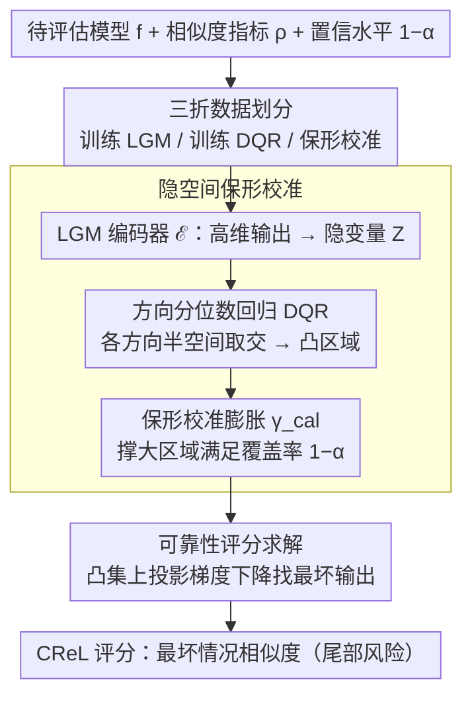

# Conformal Reliability: A New Evaluation Metric for Conditional Generation

**会议**: ICML2026  
**arXiv**: [2605.30807](https://arxiv.org/abs/2605.30807)  
**代码**: https://ggc29.github.io/CReL/ (有)  
**领域**: 图像生成  
**关键词**: 可靠性评估, 保形预测, 条件生成, 最坏情况分析, 不确定性量化  

## 一句话总结
提出基于保形预测（Conformal Prediction）的可靠性评分 CReL，通过在隐空间构建凸预测集并优化最坏情况下的指标表现，实现对条件生成模型的不确定性感知评估，在图文互生任务上揭示了传统单输出指标无法捕捉的模型可靠性差异。

## 研究背景与动机

**领域现状**：条件生成模型（文生图、图生文等）取得了显著进展，当前主流评估指标如 CLIP Score、BERT-SIM、FID 等通常只评估单次生成输出的质量，反映的是模型的"平均水平"。

**现有痛点**：生成模型具有内在随机性——同一输入在不同采样种子下可能产生截然不同的输出。一个模型可能平均得分很高，但仍有不可忽视的概率产生灾难性失败。例如，图生文任务中模型通常会正确生成"一个人在弹吉他"，但在某些种子下可能生成"一个人拿着枪"。在安全关键场景下，单输出评估无法量化这种尾部风险。

**核心矛盾**：现有指标衡量的是"模型能多好"，而可靠性应衡量"模型最差能多差"。但直接在高维输出空间中构建预测集并优化最坏情况指标，面临维度灾难和非凸优化的双重困难。

**本文目标**：定义一个考虑不确定性的可靠性评分（reliability score），在给定置信水平 $1-\alpha$ 下量化模型的最坏情况表现，并提供高效的计算框架。

**切入角度**：将高维输出映射到低维隐空间，利用方向分位数回归（DQR）构建凸预测区域，再通过保形校准确保覆盖率保证。凸性使得最坏情况优化可用投影梯度下降求解。

**核心 idea**：在隐空间中构建满足覆盖率保证的凸预测集，将原本不可解的高维非凸可靠性优化问题转化为凸约束上的可解优化问题。

## 方法详解

### 整体框架
CReL 要回答的问题是"一个条件生成模型在最坏情况下能差到什么程度"，输入是待评估模型 $f$ 和用户指定的相似度指标 $\rho$，输出是置信水平 $1-\alpha$ 下的可靠性评分。难点在于直接在高维输出空间里枚举所有可能输出、找出最差的那一个，既受维度灾难拖累又面临非凸优化。CReL 的破局思路是把高维输出压到低维隐空间，在那里构建一个满足覆盖率保证的凸预测集，于是"找最坏输出"就退化成在凸集上做投影梯度下降这个可解问题。

### 关键设计

**1. 隐空间保形校准：把不可解的高维校准搬到低维凸区域**

最坏情况评估的第一道坎是构建一个"模型在置信水平 $1-\alpha$ 下真正可能产出的输出集合"。如果在原始输出空间里做，需要网格离散化，计算代价随维度指数膨胀。CReL 把训练数据拆成三折——$\mathcal{I}_{\text{lgm}}$ 训练 VAE 编码器/解码器，$\mathcal{I}_{\text{dqr}}$ 训练方向分位数回归（DQR），$\mathcal{I}_{\text{cal}}$ 做保形校准。编码器 $\mathcal{E}$ 先把输出 $\hat{Y}$ 压成隐变量 $Z \in \mathbb{R}^r$，DQR 对每个方向 $\mathbf{u} \in \mathbb{S}^{r-1}$ 估计一个 $\alpha$ 分位数半空间 $\mathbb{H}_u^+(x)$，所有半空间取交集就得到凸区域 $R_\mathcal{Z}(x) = \bigcap_{\mathbf{u}} \mathbb{H}_u^+(x)$。

多方向取交集会让实际覆盖率掉到 $1-\alpha$ 以下，所以还需保形校准来"撑大"区域：算出校准集里每个样本到 $R_\mathcal{Z}$ 的投影距离 $E_i^+$，取第 $\lceil(|\mathcal{D}_{\text{cal}}|+1)(1-\alpha)\rceil$ 分位数作为膨胀量 $\gamma_{\text{cal}}$，把区域扩成 $S^{\gamma_{\text{cal}}}(x)$。这一步之所以能高效，正是因为隐空间里的凸区域允许用线性规划算投影距离，而不是在原空间里铺网格。

**2. 可靠性评分的定义与求解：在凸预测集上找最差输出**

有了校准后的凸预测集 $C_\mathcal{Z}$，可靠性评分就被定义为集合内使指标最差的那个输出的得分：

$$\text{CReL} = \min_{z \in C_\mathcal{Z}(X_{n+1})} \rho\big(\mathcal{D}ec(z; X_{n+1}), \text{GT}_{n+1}\big)$$

也就是在模型"合理可能"产出的所有结果里，挑出和 ground truth 最不相似的那个来打分——分数越低说明尾部风险越大。原问题里指标 $\rho$ 和约束集 $C_\mathcal{Y}$ 在输出空间都是非凸的，无从下手；搬到隐空间后约束变凸，目标虽仍非凸但可用投影梯度下降。投影算子本身归结为线性规划：先解 $y^* = \arg\min_{y_1 \in R_\mathcal{Z}(x)} \|y_1 - y\|_2$，再沿方向平移 $\gamma_{\text{cal}}$。实际用 50 个随机起点跑投影梯度下降以缓解非凸局部最优，结果相当稳定，多起点解的标准差只有 0.00027。

**3. 覆盖率的理论保证：校准在隐空间，保证传回输出空间**

可靠性评分要可信，前提是这个预测集真的以 $1-\alpha$ 概率盖住真实输出。CReL 基于可交换性（exchangeability）先证明隐空间里 $\mathbb{P}(Z_{n+1} \in S^{\gamma_{\text{cal}}}) \geq 1-\alpha$，再论证当 LGM 能准确恢复条件分布 $\hat{Y}|X$ 时，解码器映射不会让覆盖率下降，于是 $\mathbb{P}(\hat{Y}_{n+1} \in C_\mathcal{Y}(X_{n+1})) \geq 1-\alpha$ 成立；覆盖率上界为 $1-\alpha + 1/(1+|\mathcal{D}_{\text{cal}}|)$，校准集越大越贴近目标。相比 Feldman 等人直接在输出空间校准，隐空间校准会因解码器膨胀而略偏保守，但换来的是整个优化问题从"不可解"变成"可解"，这正是 CReL 愿意付的代价。

## 实验关键数据

### 合成数据校准结果

| 方法 | $\alpha$ | 覆盖率-$\mathcal{Z}$ | 覆盖率-$\mathcal{Y}$ | 区域面积 |
|------|----------|----------------------|----------------------|----------|
| CReL (Ours) | 0.10 | 0.8953 | 0.8915 | **232.7** |
| Feldman | 0.10 | — | 0.8940 | 234.5 |
| DQR | 0.10 | 0.8823 | 0.9145 | 287.4 |
| CReL (Ours) | 0.02 | 0.9770 | 0.9760 | **398.5** |
| DQR | 0.02 | 0.9818 | 0.9872 | 749.1 |

### 图生文任务可靠性评估（$\alpha=0.1$）

| 模型 | CLIP-SIM | CReL-CLIP | BERT-SIM | CReL-BERT |
|------|----------|-----------|----------|-----------|
| BLIP-base | 0.2330 (4th) | **0.0070 (1st)** | 0.8349 (3rd) | 0.6335 (3rd) |
| BLIP-large | 0.2453 (3rd) | −0.0074 (4th) | 0.8106 (4th) | 0.5631 (4th) |
| GIT-base | 0.2511 (2nd) | −0.0021 (2nd) | **0.8620 (2nd)** | **0.6474 (1st)** |
| GIT-large | 0.2550 (1st) | −0.0043 (3rd) | **0.8649 (1st)** | 0.6459 (2nd) |

### 关键发现
- **排名反转现象**：BLIP-base 在 CLIP-SIM 平均分排名最低（0.2330），但 CReL-CLIP 排名第一（0.0070），因为其得分分布更集中，最坏情况表现更好
- **区域面积优势**：CReL 的预测集面积（232.7）远小于 DQR（287.4）且与 Feldman（234.5）持平，表明联合校准产生更紧凑的信息集
- **可扩展性**：与 Feldman 的网格方法在高维时指数增长不同，CReL 的隐空间校准运行时间随维度线性增长
- **文生图任务**中也观察到类似反转：SD3-M 在 CLIP-SIM 排第三但 CReL-CLIP 排第一，Kandinsky-2.2 平均最高但可靠性排第三

## 亮点与洞察
- **将可靠性重新定义为最坏情况问题**：跳出传统平均指标思路，用保形预测框架量化生成模型的尾部风险，概念简洁且适用于任意用户指定指标 $\rho$。这个视角对安全关键场景（医学、自动驾驶）的生成模型评估有直接价值
- **隐空间凸化策略**：通过 LGM+DQR 的组合将非凸高维问题转化为凸约束低维优化，是一个优雅的工程-理论平衡。投影算子归结为线性规划，使整个框架可实际运行
- **模型排名反转的发现**具有实际指导意义：说明平均分高的模型未必可靠，分布集中性才是可靠性的关键特征，可迁移到任何需要评估生成一致性的场景

## 局限与展望
- LGM 需要额外训练（VAE 编码器/解码器），增加评估成本，且覆盖率保证依赖 LGM 重建质量的假设
- 当前仅在 MS-COCO 上评估图文互生任务，未涉及视频生成、3D 重建等更复杂的条件生成场景
- 保形预测提供的是边际覆盖率保证（marginal coverage），非条件覆盖率，对特定困难输入可能不够严格
- 可扩展到多对多映射场景（视频、机器人控制），但需要设计新的联合隐空间表示和校准策略

## 相关工作与启发
- Feldman et al. (2023) 的校准多输出分位数回归在输出空间校准，非凸性导致优化困难；CReL 转移到隐空间获得凸性
- 方向分位数回归 DQR (Kong & Mizera, 2012) 提供凸预测集构建基础，但在高维时过于保守
- PCP (Wang et al., 2022b) 对条件生成模型构建预测集，但其逐坐标校准可能比联合隐空间校准更保守（面积 854.24 vs 232.70）

<!-- RELATED:START -->

## 相关论文

- [\[ICML 2026\] Conf-Gen: Conformal Uncertainty Quantification for Generative Models](conf-gen_conformal_uncertainty_quantification_for_generative_models.md)
- [\[CVPR 2026\] SHOE: Semantic HOI Open-Vocabulary Evaluation Metric](../../CVPR2026/image_generation/shoe_semantic_hoi_open-vocabulary_evaluation_metric.md)
- [\[ICLR 2026\] PolyGraph Discrepancy: a classifier-based metric for graph generation](../../ICLR2026/image_generation/polygraph_discrepancy_a_classifier-based_metric_for_graph_generation.md)
- [\[ICML 2026\] AtelierEval: Agentic Evaluation of Humans & LLMs as Text-to-Image Prompters](ateliereval_agentic_evaluation_of_humans_llms_as_text-to-image_prompters.md)
- [\[ICML 2026\] HoloFair: Unified T2I Fairness Evaluation and Fair-GRPO Debiasing](holofair_unified_t2i_fairness_evaluation_and_fair-grpo_debiasing.md)

<!-- RELATED:END -->
