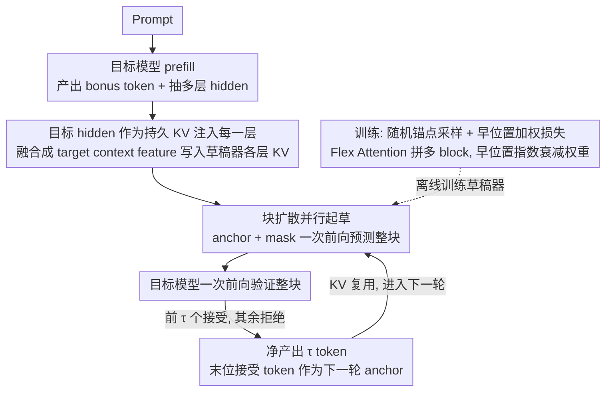

# DFlash: Block Diffusion for Flash Speculative Decoding

**会议**: ICML 2026  
**arXiv**: [2602.06036](https://arxiv.org/abs/2602.06036)  
**代码**: https://dflash.z-lab.ai (有，含 GitHub + HuggingFace)  
**领域**: LLM效率 / 推测解码 / 扩散语言模型  
**关键词**: 推测解码, 块扩散, 草稿模型, KV 注入, 并行起草

## 一句话总结
DFlash 用一个轻量级的"块扩散"草稿模型替代 EAGLE-3 那种自回归草稿器，并通过把目标模型的多层 hidden features 作为 KV 注入到草稿模型每一层，在单次前向中并行起草整块 token，端到端最高拿到 6× 无损加速，比 EAGLE-3 再快 2.5× 左右。

## 研究背景与动机

**领域现状**：自回归 LLM 推理被"逐 token 串行"卡死，GPU 利用率极低。推测解码（speculative decoding）通过"小草稿模型快速猜一段、大目标模型并行验证"成为主流加速方案，EAGLE-3 是当前 SOTA，但它的草稿器仍然是自回归的——只是层数更浅、序列更短。

**现有痛点**：自回归起草有两个本质问题——(1) 起草耗时 $T_{\text{draft}}=\gamma\cdot t_{\text{step}}$ 随推测预算 $\gamma$ 线性增长，所以草稿器只能用极浅（1 层 Transformer）结构；(2) 浅模型容量不足，接受长度 $\tau$ 很快饱和。两者夹击导致整体加速被卡在 2–3× 的天花板上。

**核心矛盾**：草稿阶段的"质量"和"延迟"通过 $\gamma$ 强耦合——想要 $\tau$ 大就要 $\gamma$ 大，但 $\gamma$ 大又会把起草耗时拉爆。

**已有的扩散草稿尝试**：DiffuSpec / SpecDiff-2 直接拿 7B 的 dLLM 当草稿器，起草质量高但参数太大、起草延迟反过来吃掉了加速；PARD 训小模型模仿扩散式并行生成，又因为容量太小接受长度上不去。所以"扩散草稿"听起来很美，但落地时陷入"要么太大要么太弱"的两难。

**本文目标**：做一个既轻量（5 层 Transformer）、又能拿到长接受长度（$\tau\!\ge\!6$）、还能被目标模型深度条件化的扩散草稿器。

**切入角度**：作者抓住一个观察——目标模型的隐藏特征里已经"偷偷"编码了多个未来 token 的信息（呼应 Samragh et al. 2025）。既然如此，草稿器就不需要"从零推理"，只需要做一个轻量的"扩散适配器"，把目标模型在 prefill 时算出的 hidden 特征翻译成未来 block 的 token 即可。

**核心 idea**：用块扩散做并行起草 + 把目标模型多层 hidden features 当 KV 直接注入草稿模型每一层，让"起草耗时几乎不随 $\gamma$ 变" 和 "接受长度随草稿层数稳定 scaling" 这两件好事同时成立。

## 方法详解

### 整体框架
DFlash 要解决的是自回归草稿器把"质量"和"延迟"通过推测预算 $\gamma$ 死死绑在一起的困境，它的做法是只替换标准推测解码循环里 draft 这一侧、verify 一侧完全不动。给定 prompt，目标模型先正常 prefill 产出第一个 bonus token，同时顺手从若干中间层抽出隐藏特征当作"未来 token 的提示"，融合后塞进一个轻量草稿模型每层的 KV cache；草稿模型随即用块扩散在单次前向里并行吐出整个 block，再交回目标模型一次性验证。这样起草质量来自对目标特征的深度条件、起草速度来自一次并行前向，两者不再互相掣肘。

### 关键设计

**1. 目标 hidden features 作为持久 KV 注入每一层：让加深草稿器还能继续涨接受长度**

EAGLE-3 也用目标 hidden，但它把特征和草稿 token embedding 拼接后只在输入端喂一次；问题是草稿模型一旦加深，这股条件信号沿着层层传递会被稀释，导致加层数也涨不动接受长度 $\tau$。DFlash 改为从目标模型均匀采样的若干层（默认 5 层，第 2 层到倒数第 3 层）抽 hidden states，拼接后经一个投影层融合成一份紧凑的 target context feature，再把这份特征**单独投影成每一层草稿 Transformer 的 Key/Value 矩阵**写进 KV cache，并跨多轮起草复用。如此每一层 attention 都能直接访问目标特征而非靠输入端逐层渗透，这正是 DFlash 敢上 5 层乃至 8 层草稿器的根本前提——Table 9 在 5 层草稿器下对比，input fusion 的 GSM8K $\tau$=3.5，换成 KV 注入立刻涨到 4.2。

**2. 块扩散并行起草替代自回归起草：把起草耗时和推测预算解耦**

自回归起草的成本是 $T_{\text{draft}}=\gamma\cdot t_{\text{step}}$，随推测预算线性增长，逼得草稿器只能用 1 层这种极浅结构，容量天花板把整体加速锁死在 2–3×。DFlash 的草稿模型本身是 block-diffusion 风格：给定 block 内一个 anchor（上一步目标模型产生的 bonus token），其余 $\text{block\_size}-1$ 个位置全部初始化为 mask token，一次前向就同时预测出所有 mask 位置。这样起草耗时近似 $T_{\text{draft}}\!\approx\!t_{\text{parallel}}$，几乎不随 block 大小变化——Figure 3 显示 5 层 DFlash 起草 16 token 甚至比 1 层 EAGLE-3 起草 8 token 还快。一旦起草耗时被这样解耦，"用更深更强的草稿模型"和"用更长的草稿块"这两件原本互相打架的事就能同时成立，把整个速度-质量 Pareto 前沿往右上推。

**3. 随机锚点采样 + 早位置加权损失：让训练对齐推理、并先训好最卡瓶颈的早 token**

推理时草稿器是"以任意 bonus token 为 anchor、随机位置起草"，所以训练也不能像标准块扩散那样固定切块。DFlash 从 response 里随机采若干 anchor token，每个 anchor 作为一个 block 的首位置、其后全部 mask，让草稿模型预测后 $\text{block\_size}-1$ 个 token；多个 block 通过 Flex Attention 拼成一条序列、用稀疏 mask 同时训练（block 内双向且可见目标特征，block 间互不可见），随机 anchor 让草稿器见到更多样的 target context feature。损失上对 block 内位置 $k$ 施加指数衰减权重 $w_k=\exp(-\tfrac{k-1}{\gamma})$，因为推测解码的接受长度本质由"第一个被拒位置"决定，早期位置一错后面整块都白起草，对早 token 加权等于直接攻击这个瓶颈——Table 13 报告这套训练策略显著抬高了接受长度和加速。

### 一个完整示例
以 Qwen3-8B、block size 16、草稿器 5 层为例走一轮：目标模型 prefill 完 prompt，给出 bonus token $x_0$，并从第 2、…、倒数第 3 共 5 层各抽一份 hidden，融合成 target context feature 写进草稿器每层 KV。草稿器把 $x_0$ 当 anchor、后面 15 个位置全置 mask，单次前向并行预测出候选 $\hat{x}_1\dots\hat{x}_{15}$。目标模型一次前向并行验证这 16 个位置，假设前 6 个被接受、第 7 个起被拒，则本轮净产出 6 个 token（对应 GSM8K 实测 $\tau\approx6.5$），第 6 个接受位的目标输出成为下一轮的新 bonus token / anchor，target context feature 仍在 KV 里被复用，无需重抽。整轮起草只花一次草稿前向 + 一次目标验证，而非 EAGLE-3 那样串行起草 $\gamma$ 步。

### 损失函数 / 训练策略
基础目标是 cross-entropy，配上面 $w_k=\exp(-\tfrac{k-1}{\gamma})$ 的位置权重。草稿模型的 token embedding 和 LM head 与目标模型**共享并冻结**，只训草稿 Transformer 层，强化"草稿模型就是个轻量扩散适配器"的定位。训练数据约 800K 样本（NVIDIA Nemotron Post-Training V2 + CodeAlpaca），response 全部用目标模型重生成以对齐分布；长上下文只需 1.6K LongAlign 样本微调 3 epoch 即可从 4K 扩到 32K。

## 实验关键数据

### 主实验

| 模型 / 任务 | 方法 | Speedup | $\tau$ |
|---|---|---|---|
| Qwen3-8B GSM8K (T=0) | EAGLE-3 (tree=16) | 1.94× | 3.23 |
| Qwen3-8B GSM8K (T=0) | EAGLE-3 (tree=60) | 2.23× | 3.71 |
| Qwen3-8B GSM8K (T=0) | **DFlash (block=16)** | **5.15×** | **6.54** |
| Qwen3-8B HumanEval (T=0) | EAGLE-3 (tree=60) | 2.17× | 3.65 |
| Qwen3-8B HumanEval (T=0) | **DFlash (block=16)** | **5.14×** | **6.50** |
| Qwen3-4B 平均 8 任务 (T=0) | EAGLE-3 (tree=16) | 1.81× | 3.05 |
| Qwen3-4B 平均 8 任务 (T=0) | **DFlash (block=16)** | **4.91×** | **6.54** |
| Qwen3-8B Math500 SGLang(B200) C=1 | Baseline → DFlash | **5.1×** | 8.01 |
| Qwen3-Coder-30B-A3B HumanEval SGLang C=32 | DFlash | **3.1×** | 8.09 |

要点：在公平起草预算下（EAGLE-3 tree=16 vs DFlash block=16），DFlash 的 $\tau$ 几乎翻倍、speedup 翻 2.4–2.7×；即使把 EAGLE-3 放宽到 tree=60（验证成本拉满），DFlash 仍然全面领先。在生产级 SGLang + FA4 backend 上单 B200 也能稳拿 4–5×。

### 消融实验

| 配置 | 关键观察 | 说明 |
|---|---|---|
| 草稿层数 3 / 5 / 8 (Table 6) | speedup 4.69× / 4.71× / 4.64× | 8 层 $\tau$ 最高但起草更慢，5 层综合最优 |
| 目标 hidden 数 3 / 5 (Table 7) | Math500 $\tau$ 5.38 → 5.64 | 多抽几层目标特征稳定涨 $\tau$，代价是训练时缓存翻倍 |
| Train BS 16 / Test BS 8 (Table 8) | speedup 3.87× vs Train=Test=8 的 3.97× | 大 block 训练的模型能向下泛化到小 block，反之不行 |
| Input fusion vs KV 注入 (Table 9, 5 层) | GSM8K $\tau$ 3.5 → 4.2 | KV 注入是"加深草稿器还能涨 $\tau$"的关键 |

### 关键发现
- 真正让 DFlash 拉开 EAGLE-3 的不是"扩散"本身，而是 **KV 注入 + 块并行**这对组合：消融把扩散换成自回归 + KV 注入（DFlash-AR）仍然在 $\tau$ 上超过 EAGLE-3-5L，但 speedup 远不及完整 DFlash，说明 KV 注入贡献质量、块扩散贡献速度，两者缺一不可。
- 起草耗时几乎和 block 大小无关（Figure 3）这一硬件层面的事实，是整篇文章的"赦免券"——它让草稿器可以同时变深（→ $\tau$ 高）和变宽（→ block 长），打破了自回归草稿器的 Pareto 前沿。
- 基础模型 4K 训练 + LongAlign 微调 3 epoch 就能撑到 32K（Table 4），说明目标 hidden features 自带长上下文表征，草稿器只需学短程适配。

## 亮点与洞察
- **重新定义扩散语言模型的位置**：与其和自回归 LLM 在端到端生成上硬刚，不如把 dLLM 当成"专司起草的并行加速器"。这个 reframing 让"扩散步数越少越好（极端就 1 步）"和"质量靠验证保证"两件事同时合理化，是扩散范式在 LLM 推理里第一次找到不需要拼端到端质量的落脚点。
- **KV 注入这招可以迁移**：所有"小模型条件依赖大模型 hidden"的场景（蒸馏起草、并行 head、early-exit fallback 验证等）都可以借鉴——把条件信息塞 KV 而不是 input，能让深层小模型一直拿到强信号、不被稀释。
- **位置加权损失对接受长度的针对性**：识别出"接受长度被最早一个错误位置决定"这个瓶颈后，用指数衰减权重直接攻击瓶颈，是个轻巧但很对症的训练技巧，类似思想可用于一切"前缀决定后缀有效性"的并行生成任务。

## 局限与展望
- 作者承认未与 DiffuSpec / SpecDiff-2 / TiDAR / Samragh et al. 等扩散草稿方法做直接代码层对比（理由是缺开源实现），所以"DFlash 是 SOTA"的对照实质上只有 EAGLE-3，扩散草稿器内部的横向位置仍有待第三方复现。
- 训练侧成本不低：800K 样本 + 必须用目标模型自己 regenerate response 才能对齐，且 hidden features 缓存随抽取层数线性增长，迁移到 70B+ 目标模型时存储和计算压力会比论文里的 8–30B 设定大得多。
- block size 的选择仍然是离线决策。论文指出大 batch / 计算受限场景下减小 block 更优、但留待 future work；理想的下一步是做"按 batch size 和接受历史动态调度 block size"的在线调度器。
- 草稿器在 MT-Bench / Alpaca 这类开放对话任务上 speedup 明显低于代码/数学（Q3-8B MT-Bench 仅 2.75× vs HumanEval 5.14×），说明"目标 hidden 含未来 token 信息"这个核心假设在开放生成上较弱，需要更针对性的训练数据或条件方式。

## 相关工作与启发
- **vs EAGLE-3**：同样利用目标 hidden features，但 EAGLE-3 把特征和 token embedding 拼接后只在输入层喂一次，且草稿仍是自回归。DFlash 把特征做成 KV 注入每层（→ 加深草稿器有效），并把自回归换成块扩散（→ 起草耗时不随 $\gamma$ 涨）。结果在公平 tree=block=16 下 speedup 翻 2.4× 以上，且超过 EAGLE-3 调大 tree 到 60 的设定。
- **vs PARD**：PARD 用小自回归模型模仿扩散并行生成，本质还是浅小模型，容量不足；DFlash 用真扩散并行 + 深层 KV 注入，把"用扩散做草稿"这件事从"3× 上限"提到"6× 上限"。
- **vs DiffuSpec / SpecDiff-2**：他们用 7B 量级现成 dLLM 起草，$\tau$ 高但起草延迟吃掉了加速；DFlash 用 5 层（30M 量级）专门训练的小扩散适配器，从"质量靠自身"切换到"质量靠对目标 hidden 的条件"，把扩散草稿器从"重资产"做成了"轻资产"。
- **vs Samragh et al. (LoRA 并行起草)**：同样基于"目标 hidden 含未来 token 信息"的观察，但他们用 LoRA 适配让目标自身并行起草；DFlash 把这件事外包给独立草稿器，工程上更解耦、KV 注入也更彻底。

## 评分
- 新颖性: ⭐⭐⭐⭐ 块扩散用作草稿器并非完全首创，但"KV 注入每层 + 块并行 + 早位置加权"这套组合把扩散草稿真正做到产线可用，关键洞见清晰。
- 实验充分度: ⭐⭐⭐⭐⭐ 覆盖 Qwen3-4B/8B/Coder-30B、LLaMA-3.1-8B，Math/Code/Chat 8 任务，T=0 / T=1，Transformers / SGLang / vLLM 多 backend，含长上下文与全面消融。
- 写作质量: ⭐⭐⭐⭐ 故事线（autoregressive 草稿器的瓶颈 → 扩散并行的诱惑 → 现有扩散草稿的失败 → DFlash 解法）非常顺，公式与图表配合到位。
- 价值: ⭐⭐⭐⭐⭐ 直接给出 6× 量级无损加速并集成进 SGLang，对推理服务降本的实际价值很大，且为"扩散语言模型在 LLM pipeline 里的位置"提供了新答案。

<!-- RELATED:START -->

## 相关论文

- [\[ICML 2026\] Speculative Coupled Decoding for Training-Free Lossless Acceleration of Autoregressive Visual Generation](speculative_coupled_decoding_for_training-free_lossless_acceleration_of_autoregr.md)
- [\[AAAI 2026\] Annealed Relaxation of Speculative Decoding for Faster Autoregressive Image Generation](../../AAAI2026/image_generation/annealed_relaxation_of_speculative_decoding_for_faster_autor.md)
- [\[ICCV 2025\] Grouped Speculative Decoding for Autoregressive Image Generation](../../ICCV2025/image_generation/grouped_speculative_decoding_for_autoregressive_image_generation.md)
- [\[CVPR 2026\] Multi-Scale Local Speculative Decoding for Image Generation](../../CVPR2026/image_generation/multi-scale_local_speculative_decoding_for_image_generation.md)
- [\[CVPR 2026\] SJD-PAC: Accelerating Speculative Jacobi Decoding via Proactive Drafting and Adaptive Continuation](../../CVPR2026/image_generation/sjd-pac_accelerating_speculative_jacobi_decoding_via_proactive_drafting_and_adap.md)

<!-- RELATED:END -->
