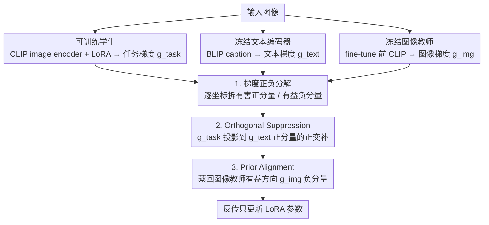

# DGS-Net: Distillation-Guided Gradient Surgery for CLIP Fine-Tuning in AI-Generated Image Detection

**会议**: ICML 2026 Spotlight  
**arXiv**: [2511.13108](https://arxiv.org/abs/2511.13108)  
**代码**: https://horizontel.github.io/DGS-Net/  
**领域**: AI 生成图像检测 / CLIP 微调 / 梯度操控  
**关键词**: AIGI 检测, CLIP LoRA, 灾难性遗忘, 梯度正交投影, 蒸馏对齐

## 一句话总结
论文针对"CLIP 微调到 AI 生成图像检测时灾难性遗忘破坏可迁移先验"的问题，提出 DGS-Net：把分类损失的梯度按坐标拆成有害正分量 $g^+$ 与有益负分量 $g^-$，让训练网络的图像梯度先正交投影到冻结 CLIP **文本梯度有害方向**的补空间（Orthogonal Suppression，剔除任务无关语义），再额外对齐到冻结 CLIP **图像梯度有益方向**（Prior Alignment，保住预训练先验），从而在 50 个生成模型上的平均检测精度比 SOTA 高 6.6%。

## 研究背景与动机
**领域现状**：CLIP 这类大规模多模态预训练模型给 AI 生成图像 (AIGI) 检测带来一种很有竞争力的"开放集"通用特征。UnivFD 直接冻结 CLIP 跑线性头就能在很多生成器上拿到不错的泛化结果，后续工作（C2P-CLIP、Effort、NS-Net 等）则改用 LoRA 微调注入 forgery-specific 特征。

**现有痛点**：作者构造 ProGAN / R3GAN / SDXL / SimSwap 四个数据集做 t-SNE 可视化（Fig. 1）发现：(1) 冻结 CLIP 几何结构完整但真/假不可分；(2) LoRA 微调真/假分开了但 CLIP 原本的几何流形被压扁，跨生成器泛化掉点严重。换句话说，"微调"在这个任务上是双刃剑——拿到检测信号的同时把可迁移先验毁掉。

**核心矛盾**：预训练知识里只有**一部分**对检测有用（与 forgery artifact 相关的方向），另一部分（与语义内容相关）是无关甚至干扰项；但传统 feature distillation 是 global alignment，会把这两部分都拽住一起对齐，结果是"既没保住真正有用的先验、又留下了大量与任务无关的语义包袱"。

**本文目标**：(1) 让训练网络的更新方向只在"对任务无害"的子空间里走；(2) 同时用蒸馏机制有选择地把"对任务有益"的预训练先验拉回来；(3) 不要用 global feature alignment 那种笼统的方式。

**切入角度**：作者借用一阶 Taylor 展开的方向解读——对一个分类损失 $\mathcal{L}(u, y)$，梯度 $\nabla_u \mathcal{L}$ 的**正分量** $g^+=[\nabla_u \mathcal{L}]_+$ 表示"沿这些坐标增大特征会让损失变大"，即**有害方向**；**负分量** $g^- = [\nabla_u \mathcal{L}]_-$ 则是"沿这些坐标增大特征会让损失变小"，即**有益方向**。这种坐标级的正负分解给"知识价值"提供了一把刻度尺。Fig. 3 还做了一个有意思的对照实验：单纯用 BLIP 生成的文本描述训分类器准确率约 60%，说明语义信息与真假标签部分相关、但绝大多数是干扰——这就给"文本梯度的正分量代表语义干扰方向"提供了实证依据。

**核心 idea**：把"知识保留 / 抑制"统一在**梯度空间**做手术——文本梯度的有害方向告诉我们什么应该被压制、图像教师梯度的有益方向告诉我们什么应该被强化；前者用正交投影把它从训练梯度里剔掉，后者用蒸馏 loss 把它注入下降方向。

## 方法详解

### 整体框架
DGS-Net 要解决的是"CLIP 微调到 AIGI 检测时，拿到真假信号的同时把可迁移先验毁掉"这个两难，它的做法是把"保留有益先验、抑制无关语义"这件事从特征空间挪到**梯度空间**去做手术。训练时同时跑三条冻结/可训练的支路：可训练的学生（CLIP image encoder + LoRA）、冻结的 CLIP 文本编码器、冻结的图像教师（fine-tune 前的 CLIP 副本）。三条支路各自算损失、各自在特征层取梯度，然后用文本梯度的"有害方向"把学生梯度里的语义干扰投影掉，再用图像教师梯度的"有益方向"把预训练好处补回来，最后反传只更新 LoRA 参数。

### 关键设计

**1. 梯度正负分解：给"知识价值"一把坐标级刻度尺**

后面两个组件都建立在同一个观察上：分类损失在特征处的梯度，可以按坐标符号拆成"价值相反"的两半。对损失 $\mathcal{L}$ 在特征 $u$ 处做一阶展开 $\mathcal{L}(u+\varepsilon e, y) \approx \mathcal{L}(u, y) + \varepsilon\langle \nabla_u \mathcal{L}, e\rangle$，沿单位方向 $e_j$ 正向扰动会让损失变大当且仅当 $\partial \mathcal{L}/\partial u_j > 0$。据此把梯度逐元素拆成正部和负部：$g^+ \triangleq [\nabla_u \mathcal{L}]_+$ 是"沿这些坐标增大特征会让损失变大"的**有害方向**，$g^- \triangleq [\nabla_u \mathcal{L}]_-$ 是"沿这些坐标增大特征会让损失变小"的**有益方向**。

这一步的价值在于把判定粒度做到了**坐标级**——传统蒸馏只看特征"差距大小"不分方向，PCGrad 那类正交投影方法也只看整向量的方向冲突，而 DGS-Net 发现梯度的正负分量恰好对应价值不同的特征维度，于是"哪些维度有害、哪些有益"变成了可以逐位读出的标签，为后面"该压制谁、该强化谁"提供了原料。

**2. Orthogonal Suppression：用文本梯度当语义滤波器，剔除任务无关方向**

这一块针对的痛点是"微调会沿任务无关的语义维度乱走，压扁 CLIP 流形"。做法是借冻结文本编码器算出文本梯度 $g_{\text{text}}$，取其正分量 $g_{\text{text}}^+$——因为 CLIP 视觉-文本特征本就对齐良好，文本梯度可以当作图像梯度里"语义子空间"的免费代理，它的有害方向就标出了"由语义维度造成的局部增损方向"。然后把学生的任务梯度 $g_{\text{task}}$ 投影到 $g_{\text{text}}^+$ 的正交补上：

$$\tilde{g}_{\text{task}} = g_{\text{task}} - \langle g_{\text{task}}, \hat{g}_{\text{text}}^+\rangle\, \hat{g}_{\text{text}}^+$$

其中 $\hat{g}_{\text{text}}^+$ 是单位化后的有害方向。这样修剪后，image encoder 只在"语义不相关、但分类损失仍能下降"的子空间里更新，相当于挂了一个语义滤波器。Fig. 3 那个"单用 BLIP 文本训分类器只有约 60% 准确率"的对照实验正是它的依据——语义与真假**有微弱相关**，但一旦当成主要决策线索就会拖累跨生成器泛化，所以应该作为干扰方向剔除，而不是像 UnivFD 那样全保留、或像直接 LoRA 那样全替换。

**3. Prior Alignment：只把图像教师的有益方向蒸回来**

光剔除还不够，被微调洗掉的有益先验得补回来，但又不能像传统 feature distillation 那样全局对齐 $\|f - f^T\|^2$——那会把任务无关的语义部分一起拽住，正是几何崩塌的元凶。这里的做法是让冻结的图像教师 $E_{\text{img}}^T$ 在同样图像-标签上 forward 算出 $g_{\text{img}}$，只取它的负分量 $g_{\text{img}}^-$（按定义就是"沿该坐标正扰动可降损"的有益方向），把它当作一个轻量蒸馏目标，在梯度空间里让学生的更新方向偏向 $g_{\text{img}}^-$ 所代表的特征区域。等于教师只挑出"预训练里就有、且对当前真假区分有用"的那部分知识对学生说"别在 fine-tune 时把这些洗掉"，实现 selective prior preservation。两个组件合力——Orthogonal Suppression 砍掉无关维度、Prior Alignment 拉回有用维度——就在梯度空间里同时完成了"先验保留 + 干扰抑制"。

### 损失函数 / 训练策略
学生骨干为 LoRA 注入的 CLIP image encoder，文本侧用 BLIP 自动给每张图生成 caption 再喂给冻结文本编码器；三条支路各套一个独立线性头算 BCEWithLogits 损失 $\mathcal{L}_{\text{img}}, \mathcal{L}_{\text{text}}, \mathcal{L}_{\text{img}}^T$，并在特征层取梯度 $g_{\text{task}}=\nabla_f \mathcal{L}_{\text{img}}, g_{\text{text}}=\nabla_t \mathcal{L}_{\text{text}}, g_{\text{img}}=\nabla_{f^T}\mathcal{L}_{\text{img}}^T$。最终反传时，学生梯度先经上述两步手术修改再传给 LoRA 参数 $\theta$；教师编码器是 fine-tune 前的 CLIP 副本，纯 forward 只用于提供 $g_{\text{img}}^-$。

## 实验关键数据

### 主实验
AIGCDetectBench 跨模型检测精度（部分摘录，mAcc = real + 17 个生成器平均）：

| 方法 | Real | ProGAN | StyleGAN2 | SD v1.4 | ADM | GLIDE | Midjourney | DALLE2 | mAcc |
|------|------|--------|-----------|---------|------|-------|------------|--------|------|
| CNN-Spot | 99.0 | 95.3 | 22.0 | 55.9 | 1.8 | 4.8 | 5.2 | 4.5 | 29.0 |
| UnivFD (冻结 CLIP) | 92.3 | 98.9 | 48.7 | 96.3 | 12.7 | 75.6 | 61.2 | 62.3 | 72.7 |
| FreqNet | 89.9 | 99.4 | 67.5 | 99.9 | 37.7 | 78.9 | 80.8 | 88.8 | 71.7 |
| NPR | 99.3 | 98.9 | 58.7 | 100.0 | 26.5 | 69.2 | 71.0 | 89.8 | 53.1 |

作者在论文文本里宣称：在 50 个生成模型上的平均检测精度比 SOTA 高 **6.6%**；t-SNE（Fig. 1）显示 DGS-Net 同时实现真假可分 + 保持 CLIP 原始几何流形——这是 LoRA fine-tune 做不到的。

### 消融实验
论文摘要 + Section 4 描述（具体表格在论文后段，缓存截断处未含）：

| 配置 | 说明 |
|------|------|
| Full DGS-Net | Orthogonal Suppression + Prior Alignment 同时启用 |
| w/o Orthogonal Suppression | 不剔除文本有害方向 → 跨生成器泛化下降 |
| w/o Prior Alignment | 不注入图像教师有益方向 → CLIP 先验丢失，几何崩塌 |
| Global feature distill (传统) | 蒸馏整个特征 → 把任务无关语义一并拽住，效果不如 selective |

### 关键发现
- **"梯度的正负分量 = 不同价值"是关键洞察**：BLIP 文本只能预测 60% 真假说明语义与标签有弱相关，正交投影掉文本梯度正部恰好对应"剔除这部分相关但不可泛化的线索"。
- **CLIP 内嵌几何对跨生成器泛化决定性强**：t-SNE 上保不住流形几何的方案（LoRA 直接 fine-tune）在新生成器上必然掉点，DGS-Net 用 selective prior 把这个几何护住。
- **文本梯度是图像语义子空间的免费 proxy**：不用额外训练或标注就能用 BLIP + CLIP text encoder 拿到"语义维度有害方向"，工程代价极低却效果明显。
- **不同生成器 + 不同 forgery family（GAN/Diffusion/Deepfake）几乎都涨**：说明这种"先验保留 + 任务无关抑制"是一种正交于具体 artifact 类型的通用机制。

## 亮点与洞察
- **把蒸馏从特征空间搬到梯度空间**：传统 distillation 对齐 $f$ 与 $f^T$；本文对齐"下降方向"。梯度比特征更接近"什么知识在被使用"，所以选择性更强、对几何破坏更小——这种范式可以推广到任意需要"保留部分先验"的下游适配任务。
- **坐标级正负切分给 gradient surgery 提供新刻度**：相比 PCGrad / GradVac 等"整向量方向冲突"路线，DGS-Net 的"分量级符号筛选"更细粒度，更适合"知识可分子空间"场景（如 CLIP 多模态）。
- **跨模态梯度作为正则化信号**：用 text 梯度修剪 image 梯度，本质是把"CLIP 文本-视觉对齐"翻新利用为一种自由的正则化 prior，整个过程不需要额外标注。
- **可解释性可视化做得好**：t-SNE 三图直接说明"先验流形 vs 真假可分"两者通常 trade-off，DGS-Net 同时满足；BLIP-only-60% 那个对照实验也很有说服力地解释了"为什么文本是干扰"。

## 局限与展望
- 文本-图像 gradient 对应关系依赖 CLIP 本身的多模态对齐质量；如果换成对齐弱的 backbone（如纯视觉 SSL），用文本梯度做 proxy 可能失灵。
- BLIP 生成 caption 的质量直接影响 $g_{\text{text}}$ 的可靠性；遇到 caption 模糊或错误的图（如抽象艺术、deepfake 人脸），文本梯度方向可能不准。
- 用"坐标符号"做正负切分是局部一阶展开的简化；实际特征空间维度间高度相关，符号判定在高度耦合维度上可能噪声大。
- 三条 forward + 两次额外梯度计算让训练成本上升，论文没量化训练 wall-time 与显存开销。
- 实验主要在分类精度上，没系统报告对各种 attack（压缩、扰动、对抗样本）的鲁棒性。

## 相关工作与启发
- **vs UnivFD**：UnivFD 冻结 CLIP 只学线性头，保住先验但真假分得不开；DGS-Net 微调 LoRA 同时用 selective distill 保几何，两条优点都拿到。
- **vs LoRA fine-tune (C2P-CLIP, Effort, NS-Net)**：纯 LoRA 微调泛化掉点是因为破坏 CLIP 流形；DGS-Net 通过梯度手术机制保留有益先验、抑制无关语义。
- **vs PCGrad / GradVac (multi-task gradient surgery)**：那一系方法在整向量方向上做投影解决任务间冲突；DGS-Net 在分量符号粒度上做正负筛选，针对"单任务但需保护多种知识"的不同 setting。
- **vs Feature-level KD (FitNet, Hinton KD)**：传统 KD 全局对齐特征；DGS-Net 只对齐有益方向，避免无关知识反噬。
- **启发**：这种"用辅助模态的梯度当 proxy 来剔除主模态干扰子空间"的思路可以迁移到——医学影像分类（用文本报告梯度去除背景纹理影响）、视频检测（用音频梯度过滤画面冗余）、跨域 ReID 等多模态适配任务。

## 评分
- 新颖性: ⭐⭐⭐⭐ 把"梯度正负分量 = 价值差"和"跨模态梯度做正则化"组合成 selective distillation 的新范式，思路漂亮。
- 实验充分度: ⭐⭐⭐⭐ 50 个生成器 + 多个 SOTA 对比 + t-SNE 可解释性；缓存截断处未含全部消融数据，但 main table 已覆盖 GAN/Diffusion/Deepfake 三大家族。
- 写作质量: ⭐⭐⭐⭐ 动机 → preliminaries → 方法递推清晰；公式与图示配合好（Fig. 1 t-SNE + Fig. 3 BLIP 实验 + Fig. 2 框架图）。
- 价值: ⭐⭐⭐⭐ +6.6% mAcc 对 AIGI 检测落地有直接价值；同时 selective gradient distillation 的框架可以迁移到其他"需要保留预训练先验"的微调任务。

<!-- RELATED:START -->

## 相关论文

- [\[ICML 2026\] OmniAID: Decoupling Semantic and Artifacts for Universal AI-Generated Image Detection in the Wild](omniaid_decoupling_semantic_and_artifacts_for_universal_ai-generated_image_detec.md)
- [\[AAAI 2026\] Aggregating Diverse Cue Experts for AI-Generated Image Detection](../../AAAI2026/image_generation/aggregating_diverse_cue_experts_for_ai-generated_image_detec.md)
- [\[ICLR 2026\] Diffusion Fine-Tuning via Reparameterized Policy Gradient of the Soft Q-Function](../../ICLR2026/image_generation/diffusion_fine-tuning_via_reparameterized_policy_gradient_of_the_soft_q-function.md)
- [\[ECCV 2024\] Zero-Shot Detection of AI-Generated Images](../../ECCV2024/image_generation/zero-shot_detection_of_ai-generated_images.md)
- [\[AAAI 2026\] Beyond Semantic Features: Pixel-Level Mapping for Generalized AI-Generated Image Detection](../../AAAI2026/image_generation/beyond_semantic_features_pixel-level_mapping_for_generalized_ai-generated_image_.md)

<!-- RELATED:END -->
