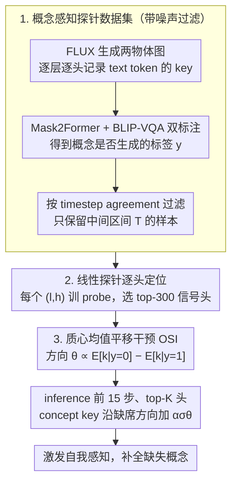

# Diagnosing and Correcting Concept Omission in Multimodal Diffusion Transformers

**会议**: ICML 2026  
**arXiv**: [2605.14270](https://arxiv.org/abs/2605.14270)  
**代码**: 论文未提供公开仓库链接  
**领域**: 扩散模型 / 文本到图像生成 / 表征干预  
**关键词**: MM-DiT, 概念遗漏, 线性探针, 注意力 key 干预, training-free 引导

## 一句话总结
论文用线性探针发现 MM-DiT (FLUX / SD3.5) 在中间层的某些注意力头里、其 text token 的 key 向量天然编码了"目标概念是否会出现"的二元信号，并由此提出 Omission Signal Intervention (OSI)：在 inference 时把"omission 类 - existence 类"的均值差方向以 $\alpha\sigma\boldsymbol{\theta}$ 的强度注入 Top-K 头的 key 向量，激发模型对缺失概念的"自我感知"并补全生成；在 FLUX 上 GenEval 6-object 准确率从 0.18 → 0.40，且无需任何 fine-tune。

## 研究背景与动机
**领域现状**：T2I 扩散模型已大量切换到 MM-DiT 架构（FLUX、SD3、SD3.5），把 text token 和 image patch token 拼成单序列做联合 attention，相比 U-Net + cross-attention 的单向注入更适合学习跨模态语义对齐。

**现有痛点**：尽管架构进步，concept omission（要求生成"猫和狗和书"，结果少了书）仍是 MM-DiT 的顽疾。现有缓解方案要么在视觉 attention map 上加优化约束（Attend-and-Excite、A-STAR、Rassin et al.）、要么需要额外训练（GLIGEN、reward 微调），都伴随高 inference 成本或破坏原模型分布。

**核心矛盾**：现有研究只看 visual embedding，text embedding 在扩散模型**内部**怎么编码"概念是否会出现"这一信号几乎是黑盒；Chen et al. (2024) 虽然分析了 CLIP 文本输出但没追踪到 diffusion 内部 attention 头层面。换句话说：模型可能"知道"自己漏掉了什么，但我们没工具去问。

**本文目标**：(1) 用 probe 工具检查 MM-DiT 内部 text token 是否真的承载了"omission 状态"信息；(2) 如果存在，找到承载这一信号的具体层/头/timestep；(3) 用最小代价的 inference-time 干预把这个信号放大，逼迫模型生成缺失的概念。

**切入角度**：MM-DiT 的 joint attention 让 text token 在每层都能从 image token 接收视觉反馈，因此 text token 的 key/value 不再是"静态文本描述"，而是动态反映当前 latent 中已经生成了什么。在中间层（即 image token 已携带语义但生成尚未完成），text token 的 key 向量可能就编码了"我对应的概念在 noisy latent 里出现了吗"。

**核心 idea**：先用 linear probe 把这种"omission signal"从 attention key 中显式抽出来（"absent → present"的均值差方向），再用 mass mean shift 在 inference 时朝**反向缺席方向**移动 key，相当于让模型"以为自己漏得更严重"，从而主动补救缺失概念。

## 方法详解

### 整体框架
论文要解决的是 MM-DiT 的概念遗漏，但它不直接改生成流程，而是先把"模型内部是否已经知道某个概念会缺席"这个隐信号探出来、再在 inference 时把它放大去逼模型补救。整套流程分两阶段：**Diagnose** 阶段在 FLUX.1-Dev 上跑 GenEval two-object 生成，对每张图用 Mask2Former + BLIP-VQA 双标注得到每个 concept token 是否成功生成的二元标签 $y\in\{0,1\}$，再收集中间 timesteps 的 text token key 向量 $\mathbf{k}_c^{(t,l,h)}$，对每个 $(l,h)$ 训一个线性 probe 来判别 absent/present，从而定位到底哪些头编码了这个信号；**Correct (OSI)** 阶段则从这些头算出"缺席方向"，在生成早期只对最可靠的 top-K 头、只在概念尚未定型的时间窗里，把 concept token 的 key 向量沿该方向推一下，等价于让模型"误以为自己漏得更严重"，由此触发它内置的补救机制把缺失概念画出来。

### 关键设计

**1. 带噪声过滤的概念感知探针数据集：让 probe 学的是"此刻这个 token 知不知道自己会出现"**

probe 想成立的前提是数据真实反映 token 在当下时刻的"觉知状态"，否则后面找到的"重要头"全是噪声。论文以 "a photo of {obj1} and {obj2}" 为模板批量生成，逐步、逐层、逐头记录 text token key 向量 $\mathbf{k}^{(t,l,h)}$，label 取自最终图像并用 Mask2Former (mmdetection) 与 BLIP-VQA 双标注、两者一致才采纳以压掉单标注器噪声。关键是清掉两类时间错位的脏样本：早期 timestep 里目标在第 1-3 步根本还没出现，却因为最终成功而被打成 $y=1$，此时 key 编码的是"还没生成"、label 却说"会生成"，直接制造训练矛盾；晚期 timestep 扩散主要在刷细节，omission 信号已几乎消失。Table 1 把这点量化得很干净——early/intermediate/late 三段与最终标签的 agreement 分别是 0.409、0.965、1.000，于是只保留中间区间 $\mathcal{T}$ 的样本进 probe 训练集、按 4:1 切 train/val。这种"按 generation dynamics 过滤数据"本质是把扩散模型的时间结构直接嵌进了 probe 设计。

**2. 用线性探针做逐头定位：在 1368 个头里只挑出编码遗漏信号的专家头**

承接上一步，信号是稀疏的——不是每个头都编码 omission，所以必须精确定位、避免对全部头无脑干预破坏其他能力。论文对每个 $(l,h)$ 单独训一个线性分类器，输入该头的 text token key 向量、输出 absent vs present 的预测。Fig. 2(a) 显示 probe 准确率在中间 timestep 达到峰值（与 Table 1 一致），Fig. 2(b) 的 head-wise 热图则揭示一个反直觉的层分布：早期 layer 接近随机猜（此时 text token 还没充分吸收 image token 的视觉反馈），中间 layer 大幅抬升（最高 91.0% 准确率），后期 layer 又掉下来。据此选出 top-300 头（占 1368 头的 22%，全部超过 80% 准确率）作为"omission 信号头"。Fig. 3-4 进一步用 box plot 把这些 probe 输出随 timestep 的演化画出来：上排预测 $\hat{x}_0$ 里的视觉对象逐渐显形，下排 probe 的"present"概率同步爬升——这是对"模型自我感知"非常直观的动态可视化。逐头独训 probe 工程量大，但换来的精确定位正是后续 OSI 不产生负面副作用的前提。

**3. 质心均值平移干预 OSI：朝"缺席方向"推 key 向量，激发模型补全**

定位到信号头后，OSI 用训练免费、近零开销的方式做手术式干预。对每个 top-K 头先算质心均值平移方向 $\boldsymbol{\delta}^{(l,h)} = \mathbb{E}[\mathbf{k}^{(t,l,h)}|y=0] - \mathbb{E}[\mathbf{k}^{(t,l,h)}|y=1]$（注意是"absent 减 present"），归一化得 $\boldsymbol{\theta}^{(l,h)}$；inference 时按

$$\mathbf{k}_c \leftarrow \mathbf{k}_c + \alpha\,\sigma^{(l,h)}\,\boldsymbol{\theta}^{(l,h)}$$

修改 concept token 的 key，其中 $\sigma^{(l,h)}$ 是 probe 数据在该方向上的标准差、起自适应尺度归一化的作用，$\alpha$ 是单一标量（FLUX 取 5.0、SD3.5 取 7.5）。干预只在前 15 步（共 30 步）、即 $t\in[0.78,1]$ 的早期区间生效，因为概念形成主要发生在这一阶段。最反直觉的一点是它加的是"缺席方向"而非"存在方向"——相当于让模型"以为自己漏得更严重"，从而触发更强的补救冲动，是一种刻意夸大严重度的干预。它之所以比传统做法（改 attention map 加约束、或 fine-tune）更轻，是因为沿用了 ITI 的 mass mean shift + steering vector 范式（Li et al. 2023a），全程不动模型权重；而方向选对的重要性由 Table 4 的方向消融坐实——反向 $-\boldsymbol{\theta}$ 反而让性能崩盘（two-object 0.81 → 0.72，six-object 0.18 → 0.02），说明方向对了是补救、方向反了就成了压制。

### 损失函数 / 训练策略
OSI 本身 training-free，主模型完全不动，只在 inference 时按上式改 key。唯一需要训练的是 1368 个轻量线性 probe（参数量远小于主模型），用 BCE 损失。其余关键设置：总采样 30 步、CFG=3.5 (FLUX) / 7.0 (SD3.5)、top-K=300 (FLUX) / 100 (SD3.5)、$\alpha=5.0/7.5$、$t_{\text{stop}}=0.78/0.76$、前 15 步生效。Token 选择上，GenEval 用模板规则解析、T2I-CompBench 用 Llama-3.1-8B 抽取目标 span。

## 实验关键数据

### 主实验
GenEval 多对象 (2-6 obj) + T2I-CompBench non-spatial 子集（object omission）：

| Backbone | Method | 2-obj | 3-obj | 4-obj | 5-obj | 6-obj | Avg | T2I non-spatial |
|----------|--------|-------|-------|-------|-------|-------|-----|-----------------|
| FLUX | Base | 0.81 | 0.63 | 0.44 | 0.29 | 0.18 | 0.47 | 0.3069 |
| FLUX | TACA | 0.89 | 0.68 | 0.56 | 0.31 | 0.20 | 0.53 | 0.3078 |
| FLUX | PLADIS | 0.87 | 0.71 | 0.56 | 0.31 | 0.20 | 0.53 | 0.3075 |
| FLUX | **OSI** | **0.92** | **0.71** | **0.64** | **0.40** | **0.40** | **0.61** | **0.3083** |
| SD3.5 | Base | 0.82 | 0.72 | 0.59 | 0.38 | 0.24 | 0.55 | 0.3155 |
| SD3.5 | TACA | 0.87 | 0.74 | 0.55 | 0.47 | 0.26 | 0.58 | 0.3164 |
| SD3.5 | **OSI** | **0.89** | **0.80** | **0.68** | 0.46 | **0.35** | **0.64** | 0.3159 |

attribute neglect (T2I-CompBench attribute binding):

| Backbone | Method | Color | Shape | Texture |
|----------|--------|-------|-------|---------|
| FLUX | Base | 0.7923 | 0.4995 | 0.6419 |
| FLUX | TACA | 0.7742 | 0.5118 | 0.6493 |
| FLUX | **OSI** | **0.8014** | **0.5819** | **0.7039** |
| SD3.5 | Base | 0.7955 | 0.5820 | 0.7305 |
| SD3.5 | **OSI** | **0.8048** | **0.6119** | **0.7480** |

最显著的是 6-object 场景从 0.18 → 0.40 翻倍以上，证明 OSI 在"基线几乎崩盘的难场景"才显出真正威力。

### 消融实验
方向 + head 选择 + token-specific (FLUX):

| Setting | 2-obj | 3-obj | 4-obj | 5-obj | 6-obj |
|---------|-------|-------|-------|-------|-------|
| Base | 0.81 | 0.63 | 0.44 | 0.29 | 0.18 |
| Direction = Opposite ($-\boldsymbol{\theta}$) | 0.72 | 0.40 | 0.15 | 0.06 | 0.02 |
| Direction = Random | 0.84 | 0.65 | 0.53 | 0.32 | 0.30 |
| Heads = Bottom-K | 0.81 | 0.60 | 0.47 | 0.22 | 0.15 |
| Heads = Random K | 0.82 | 0.67 | 0.55 | 0.31 | 0.17 |
| Heads = All 1368 | 0.90 | 0.74 | 0.50 | 0.33 | 0.32 |
| **Ours (top-K + θ)** | **0.92** | **0.71** | **0.64** | **0.40** | **0.40** |

Token-specific (100 个 FLUX 漏物失败案例):

| Method | Accuracy (omitted obj) | Probe Prob (omitted obj) |
|--------|------------------------|---------------------------|
| FLUX (no OSI) | 0.00 | 0.292 |
| OSI on omitted token | **0.70** | **0.658** |
| OSI on present token | 0.14 | 0.298 |

Intervention 时长 ($t_{\text{stop}}$):

| Step | 0 | 5 | 10 | **15 (Ours)** | 20 | 25 | 30 |
|------|---|---|----|---------------|----|----|---|
| Accuracy | 0.82 | 0.88 | 0.91 | **0.92** | 0.92 | 0.92 | 0.91 |
| MANIQA | 0.473 | 0.479 | 0.480 | **0.480** | 0.481 | 0.480 | 0.480 |

### 关键发现
- **方向就是一切**：反向干预让 6-obj 从 0.18 崩到 0.02，说明 mass mean shift 方向不是任意 steering——它精准对应"概念实现"的语义轴；选错方向比不干预还糟。
- **必须 surgical 干预 top heads**：bottom-K 几乎无效甚至倒退，random 微弱，all heads (1368) 虽强但被 top-K 进一步超过，说明"少而精"比"广撒网"更有效，验证了 probe-based head selection 的价值。
- **OSI 的效果**因 **token 而异**：把同样干预施加给"已经生成成功"的 token 几乎不涨（0.14 vs 0.70），证明 OSI 不是普适的"画质增强器"，而是真正对症下药——它放大的是"概念缺席信号"，对没有缺席的概念无效。这把"causal link to concept generation"做实了。
- **早期 5 步就能拿主要收益**：$t_{\text{stop}}=0.95$ 时（仅前 5 步干预）准确率已 0.88，第 15 步饱和到 0.92；说明 concept 形成确实主要发生在早期 denoising，符合 "perception prioritized" 训练理论。MANIQA 几乎不动，证明 OSI 不破坏图像质量。
- **训练用 object，泛化到 attribute**：probe 只用 object-level 标签训，但 OSI 对 color/shape/texture 三类 attribute binding 都有效，说明 omission signal 是更通用的"语义实现"概念。

## 亮点与洞察
- **"模型其实知道自己漏了什么"是非常漂亮的发现**：用 91% 精度的 probe 把这种内部觉知量化出来，再用 mass mean shift 把它放大成可控的引导信号，整条链路打通了"诊断 → 干预 → 验证"。
- **训练免费 + 极少额外计算**：只动 key 向量、只在 top-K 头、只在前 15 步生效，开销几乎为零；这种"surgical inference-time intervention" 范式相比 fine-tune / 引入额外 loss 是工程上的大跃进。
- **"放大缺席信号而非注入存在信号"是反直觉但精准的设计**：直观会想"让模型相信它已经画出来了"，但实际是反过来——"让模型相信它漏得更严重" 才能触发其内置补救机制。这暗示扩散模型可能学到了一种隐式的 "self-correction loop"，OSI 只是把它的输入信号放大。
- **Mass Mean Shift + Probe 是 Diffusion Steering 的通用配方**：这套思路（找信号承载头 → 算类间均值差 → 在 key 上推一下）可以直接迁移到风格控制、构图修正、概念融合等其他 controllability 问题；本质上是把 ITI (Inference-Time Intervention) 从 LLM 搬到 MM-DiT。
- **数据筛选与时间结构挂钩**：通过 0.409 / 0.965 / 1.000 这三组 agreement 数字精准地区分早/中/晚 timestep 的数据可用性，是把扩散动力学嵌入到表征分析的范本。

## 局限与展望
- **Over-generation 副作用** (Fig. 7)：作者承认 OSI 有时会"画太多"——本来要一个，结果生成两三个。需要靠 $\alpha$、$K$ 调，本质是缺乏闭环 stopping criterion。
- 依赖"二元 absent/present 标签"，对模糊或主观概念（美学风格、相对数量"两三个"）难以应用——signal 本身没法二元化。
- top-K 与 $\alpha$ 是基于网格搜索定的经验值，换 backbone 要重做；缺乏自动化校准方法。
- Probe 在 4-6 object 高密集场景下的可靠性没单独评估；当 prompt 里有 5 个概念时 head 选择是否需要 prompt-conditional 也未讨论。
- 时间窗 $[t_{\text{stop}}, 1]$ 是静态的；理论上可以做动态干预——监测 probe 实时概率，在某 token 概率仍低时延长干预，可能进一步提升效果。
- 实验集中在 FLUX 和 SD3.5，未在 Imagen / DALLE 等其他 MM-DiT 衍生上验证；signal 头的位置和数量可能架构特异。

## 相关工作与启发
- **vs Attend-and-Excite / A-STAR / Rassin et al.**：他们在 cross-attention map 上加损失或优化约束，每步迭代都要反向传播，inference 慢；OSI 只在 forward 时改 key，延迟可忽略。
- **vs TACA / PLADIS**：TACA 通过 LoRA 平衡 text-image token 数量、PLADIS 用稀疏 attention，都改变了 attention 计算流程；OSI 不改流程只动具体 key 值，更轻量。
- **vs Chen et al. (2024)**：他们也分析 text embedding 的"概念混淆"问题但只看 CLIP 输出（diffusion 之外），OSI 进入 MM-DiT 内部 head 级别。
- **vs ITI (Inference-Time Intervention, Li et al. 2023a)**：本文直接借用 mass mean shift 思想并把它从 LLM 迁移到 diffusion key 向量；贡献在于发现 MM-DiT 中"中间 layer + 中间 timestep"才是 signal 富集区。
- **启发**：这种"在内部表征里探出语义信号 → 在 inference 时朝相反方向 steering"的范式不仅适用于 concept omission，也可推广到——属性绑定（color leakage）、位置关系（spatial omission）、否定理解（negation）、长 prompt 一致性等所有"模型能感知但执行不到位"的 controllability 问题。

## 评分
- 新颖性: ⭐⭐⭐⭐⭐ 第一次把 LLM 的 ITI / mass mean shift 范式系统化迁移到 MM-DiT 内部 key 向量，并发现"放大缺席信号"这种反直觉但有效的方向选择。
- 实验充分度: ⭐⭐⭐⭐⭐ 两个 MM-DiT backbone × 5 个对象密度 × 3 类 attribute × token-specific 因果实验 × 4 类超参 ablation，覆盖非常全面。
- 写作质量: ⭐⭐⭐⭐⭐ "诊断 → 干预 → 验证"叙事流畅，Fig. 3-4 的 probe 概率动态可视化非常直观；公式与实验对应清晰。
- 价值: ⭐⭐⭐⭐⭐ training-free、近零开销、对 FLUX 6-obj 翻倍提升，对工业 T2I 部署有立即可用的价值；范式可扩展到其他 controllability 问题。

<!-- RELATED:START -->

## 相关论文

- [\[ICCV 2025\] Rethinking Cross-Modal Interaction in Multimodal Diffusion Transformers](../../ICCV2025/image_generation/rethinking_cross-modal_interaction_in_multimodal_diffusion_transformers.md)
- [\[ICML 2026\] Orthogonal Concept Erasure for Diffusion Models](orthogonal_concept_erasure_for_diffusion_models.md)
- [\[ICCV 2025\] Exploring Multimodal Diffusion Transformers for Enhanced Prompt-based Image Editing](../../ICCV2025/image_generation/exploring_multimodal_diffusion_transformers_for_enhanced_prompt-based_image_edit.md)
- [\[AAAI 2026\] Laytrol: Preserving Pretrained Knowledge in Layout Control for Multimodal Diffusion Transformers](../../AAAI2026/image_generation/laytrol_preserving_pretrained_knowledge_in_layout_control_fo.md)
- [\[ICML 2026\] Krause Synchronization Transformers](krause_synchronization_transformers.md)

<!-- RELATED:END -->
