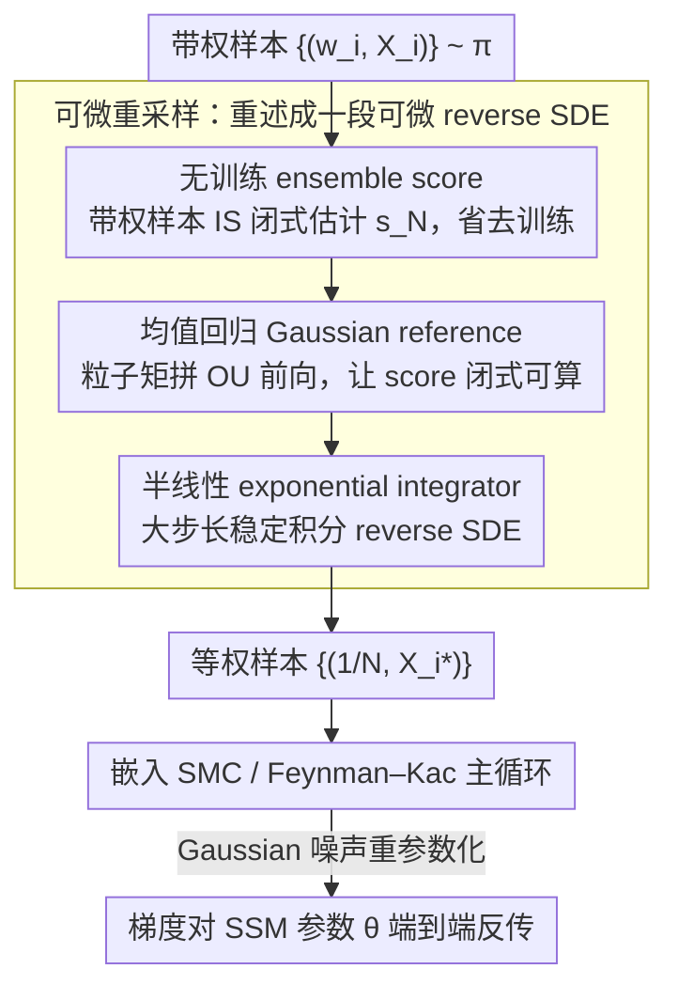

# Diffusion Differentiable Resampling

**会议**: ICML 2026  
**arXiv**: [2512.10401](https://arxiv.org/abs/2512.10401)  
**代码**: https://github.com/zgbkdlm/diffres (有)  
**领域**: 科学计算 / 顺序蒙特卡洛 / 粒子滤波 / 可微采样  
**关键词**: 扩散模型, 粒子滤波, SMC, 可微重采样, 状态空间模型

## 一句话总结
本文提出 **diffusion resampling**：用一个**无需训练**的扩散过程为顺序蒙特卡洛 (SMC) 的重采样步骤提供天然可微的 reparametrisation 替代，证明其在 Wasserstein 距离下相对样本数 $N$ 一致收敛，并在多个粒子滤波与参数估计基准上超越 OT / Gumbel-Softmax / Soft 等现有可微重采样方法。

## 研究背景与动机

**领域现状**：粒子滤波 / SMC 是状态空间模型 (SSM) 推断的主力工具，而 **resampling** 是缓解 particle degeneracy 的关键步骤。最常用的 multinomial resampling 通过类别采样 $I_i \sim \mathrm{Categorical}(w_1,\dots,w_N)$ 来重新选取粒子。

**现有痛点**：multinomial resampling 是**离散**操作，路径导数 $\partial X_i^{\theta,*}/\partial\theta$ 没有定义；当下游需要基于梯度学习 SSM 参数（甚至神经网络化的 dynamics / decoder）时，自动微分库会默默丢掉这部分梯度，导致**错误的梯度估计**。

**核心矛盾**：现有可微重采样在"无偏 / 一致性"与"可微性 / 计算成本"之间存在 trade-off：
- **REINFORCE 类**（Score-based / Ścibior–Wood stop-gradient）方差大；
- **Soft / Gumbel-Softmax** 是 multinomial 与 uninformative 之间的有偏插值，必须在偏差与统计性能之间手调系数；
- **OT-based**（Corenflos et al., 2021）虽然一致且可微，但要解 Sinkhorn，计算量 $O(N^2)$ 且对熵参数 $1/\varepsilon$ **指数**依赖；线性传输映射在分布流形复杂时也力不从心；
- **神经网络化** / **deterministic** 重采样都引入不可消除的偏差。

**本文目标**：构造一个 (i) 天然可微、(ii) 不破坏 SMC / SSM 既有结构、(iii) 一致收敛、(iv) 计算成本可控、(v) 能利用 SMC 的序列结构自适应注入先验信息 的重采样方法。

**切入角度**：OT 重采样的核心是"求一个传输映射 $X_i^* = N\sum_j P_{i,j}^\varepsilon X_j$"。作者关键洞察是——**这个映射不必"求"出来，可以直接"指定"**。如果我们用一个 Langevin SDE 把目标 $\pi$ 平滑地推向用户选定的 reference $\pi_{\mathrm{ref}}$（前向），再反演回来（reverse SDE）从 $\pi_{\mathrm{ref}}$ 采到 $\pi$，那么整条采样链上唯一的随机源就是 Gaussian 噪声，**自然可重参数化**。

**核心 idea**：用**无训练扩散模型** + **加权样本驱动的 ensemble score 近似** 替代 Sinkhorn 求出的传输矩阵，把 SMC 重采样表达成一段可微 SDE 模拟。

## 方法详解

### 整体框架
方法要解决的是"重采样这一步天然不可微"的问题：输入一组带权样本 $\{(w_i, X_i)\}_{i=1}^N \sim \pi$，要输出一组等权样本 $\{(\frac{1}{N}, X_i^*)\}$，同时让从输入到输出的映射对 SSM 参数 $\theta$ 可导。作者的转法是把"重采样"重述成"一段扩散采样"：先指定一个 Langevin 前向 SDE 把目标 $\pi$ 平滑推向一个用户选定的 reference $\pi_{\mathrm{ref}}$，再反演这条 SDE 从 $\pi_{\mathrm{ref}}$ 采回 $\pi$，于是整条链路上唯一的随机源只剩 Gaussian 噪声，自然可重参数化。其中 reverse SDE 需要的 score 用带权样本即时估计、不需要训练，最后把这段可微 SDE 模拟整体嵌进 Feynman–Kac / SMC 主循环，就得到一个梯度能端到端反传的 differentiable SMC。

### 关键设计

**1. 无训练 ensemble score：把离散类别采样翻译成连续可微的 score**

reverse SDE 真正缺的零件是各时刻的 score $\nabla\log p_t$。常规做法要先训一个扩散模型才能拿到 score，等于在重采样里再套一层训练，既慢又引入偏差。作者改用 importance sampling 把它写成现成带权样本的闭式组合 $s_N(x,t) \coloneqq \sum_i \alpha_i(x,t)\,\nabla\log p_{t|0}(x|X_i)$，权重 $\alpha_i = w_i\, p_{t|0}(x|X_i) / \sum_j w_j\, p_{t|0}(x|X_j)$ —— 这恰好是"以 $\pi$ 为 proposal、前向转移 $p_{t|0}(\cdot|x_0)$ 为 likelihood 的自归一化 IS"，所以拿到当前 SMC 步的 $\{(w_i,X_i)\}$ 就能直接算，省掉全部训练。

之所以这个替换是干净的，关键在 Remark 1 给的 Doob $h$-function 解释：$s_N = \nabla\log\sum_i h_i$，意味着这段扩散其实就是 multinomial resampling 的**连续可微 reparametrisation** —— 原本"按权重 $w_i$ 离散地挑粒子"这个不可导操作，被等价改写成"沿一段由 Gaussian 噪声驱动的 SDE 流动"，梯度问题随之化解。代价上，naive 评估每步是 $O(N)$（枚举所有粒子），但可并行成对数复杂度；而且 reference $\pi_{\mathrm{ref}}$ 隐式编码了传输代价与 Rao–Blackwellisation 条件，使它比 multinomial 的方差更小。

**2. 均值回归 Gaussian reference：让扩散"少走路"并注入 SMC 自身的后验信息**

reference 选得不好会直接拖垮收敛：若沿用固定的 $\mathrm{N}(0, I_d)$，当 $\pi$ 离它几何距离很远时，前向扩散得跑非常大的 $T$ 才能收敛，反演也随之变贵。作者改用粒子的加权矩估计 $\mu_N, \Sigma_N$ 现场拼一个贴合当前后验的 Gaussian reference，取 $\nabla\log\pi_{\mathrm{ref}}(x) = -\Sigma_N^{-1}(x-\mu_N)$，对应一个 OU 型前向 SDE $dX = -b^2\Sigma_N^{-1}(X-\mu_N)\,dt + \sqrt{2}\,b\,dW$。这样做一举两得：一是 reference 已经贴近终点，把"扩散要走多远"压到最短；二是它的前向转移 $p_{t|0}(x_t|x_0) = \mathrm{N}(x_t; m_t(x_0), V_t)$ 有解析形式（含 $e^{-b^2\Sigma_N^{-1}t}$ 项），于是上一设计 ensemble score 里需要的 $\nabla\log p_{t|0}$ 全部闭式可算、无需数值近似。相比 OT 用 predictive 样本 $\{(w_{j-1,i}, Z_{j,i})\}$ 当 reference，本文能用更准的后验 $\{(w_{j,i}, Z_{j,i})\}$，信息量更足。

**3. 半线性 exponential integrator：在大步长下稳定地积分 reverse SDE**

ensemble score 在 $t\to 0$ 附近 Lipschitz 常数会爆炸，普通 Euler–Maruyama 为了不发散只能用极小步长，离散步数 $K$ 被迫开很大。借助 Gaussian reference 带来的 semi-linear 结构 $dU = (AU + f(U,t))\,dt + \sqrt{2}\,b\,dW$（$A = b^2\Sigma_N^{-1}$ 是线性刚性主项），作者用 Jentzen–Kloeden 指数积分器把这个刚性部分**精确积分**：$U_{t_k} = e^{A\Delta_k}U_{t_{k-1}} + A^{-1}(e^{A\Delta_k}-I_d)f(U_{t_{k-1}}) + B_k$，其中 Wiener 积分 $B_k\sim \mathrm{N}(0,\, \Sigma_N(e^{2A\Delta_k}-I_d))$ 也闭式可采（$A$ 不可逆时退化到 Lord–Rougemont 的低阶积分器）。刚性主项被解析处理后，即便步长开大、$K$ 取小，模拟依然稳定，从而把离散代价压下来。

### 损失函数 / 训练策略
本方法**不引入新的损失或训练目标**，它是 SMC 主循环里的即插即用模块。下游学习时直接最小化 Feynman–Kac 边际似然估计的负对数 $-\log L(\theta)$（$L(\theta) = \prod_j L_j(\theta)$），梯度通过两条路径自动反传：(i) Gaussian 噪声重参数化，(ii) SDE solver 的 adjoint / discretise-then-differentiate（复用 Bartosh / Li / Kidger 等已有的 differentiable SDE 工具）。

收敛分析（Section 3）给出主结论 Proposition 1：

$$\mathsf{W}_2^2(\widetilde{q}_t, q_t) \le \mathsf{W}_2^2(p_T, \pi_{\mathrm{ref}})\, e^{b^2(C_{\mathrm{ref}}-2C_p)t} + 2b^2 N^{-r} \overline{C}_e(t, T)$$

误差被显式拆成两块：score 近似项随 $N$ 以 IS 速率 $r=1/2$ 衰减，$p_T \approx \pi_{\mathrm{ref}}$ 的有限时间偏差项随 $T$ 衰减。Corollary 1 进一步证明存在线性 $t \mapsto T(t)$ 使 $\mathsf{W}_2(\widetilde{q}_t, q_t) \to 0$；Remark 2 指出 Gaussian reference 下 $N$ 仅需**多项式 $T$** 即可匹配，明显优于 OT 中 $N$ 对 $1/\varepsilon$ 的**指数**依赖。

## 实验关键数据

### 主实验（Gaussian mixture importance resampling，$N{=}10{,}000$，100 次独立运行）

| 方法 | SWD ($\times 10^{-1}$) ↓ | 重采样方差 ($\times 10^{-2}$) ↓ |
|------|--------------------------|------------------------------------|
| **Diffusion ($T{=}3, K{=}128$)** | **0.80 ± 0.21** | 3.74 ± 2.99 |
| OT ($\varepsilon{=}0.3$) | 0.84 ± 0.22 | 3.42 ± 3.26 |
| OT ($\varepsilon{=}0.6$) | 0.97 ± 0.20 | **3.41 ± 3.29** |
| Multinomial | 0.82 ± 0.25 | 3.78 ± 4.43 |
| Soft (0.9) | 0.83 ± 0.24 | 3.75 ± 3.77 |
| Gumbel-Softmax (0.1) | 1.40 ± 0.24 | 3.92 ± 3.74 |

线性 Gaussian SSM 粒子滤波（$N{=}32$，128 步，100 次平均）：

| 方法 | $\|L-\hat L\|_2$ | Filtering KL ($\times 10^{-1}$) | $\|\theta-\hat\theta\|_2$ ($\times 10^{-1}$) |
|------|------------------|---------------------------------|------------------------------------------------|
| **Diffusion ($T{=}3, K{=}8$)** | **2.55 ± 1.89** | **4.26 ± 4.49** | 1.58 ± 0.75 |
| Diffusion ($T{=}1, K{=}4$) | 2.61 ± 2.08 | 4.94 ± 6.92 | **1.28 ± 0.70** |
| OT ($\varepsilon{=}0.4$) | 2.64 ± 2.13 | 5.07 ± 6.21 | 1.53 ± 1.16 |
| Multinomial | 2.80 ± 1.84 | 5.49 ± 6.87 | NaN（发散） |
| Soft (0.9) | 2.85 ± 1.80 | 4.66 ± 5.68 | NaN |
| Gumbel-Softmax (0.1) | 2.79 ± 2.14 | 4.83 ± 5.76 | NaN |

### 消融与分析
| 配置 / 现象 | 观察 | 说明 |
|-------------|------|------|
| Diffusion w/ $K{=}8$ vs $K{=}128$ | SWD: 1.64 → 0.80 | 离散步数直接决定精度，需要足够细的积分 |
| 计算开销 ($N$ 增大) | Diffusion vs OT 的交点向左移 | 大样本下扩散重采样**比 OT 更便宜** |
| 计算开销 ($K$ vs $1/\varepsilon$) | 在 $N{=}8192$ 时 $K \approx 6/\varepsilon$ 交叉 | 两类方法同阶；Diffusion 不受 OT 的指数熵依赖 |
| Lokta–Voltera 神经动力学学习 ($N{=}64$) | Diffusion 的预测 RMSE 最低、训练 loss 最稳 | 优于 OT / Soft / Gumbel / REINFORCE (Ścibior–Wood) |
| 32×32 视觉 pendulum dynamics 学习 | SSIM / PSNR 与最强 baseline 持平或更优 | 验证能稳定嵌入**高维图像观测**的复杂 SMC pipeline |

### 关键发现
- **即使不考虑可微性，diffusion resampling 本身已经是更好的重采样器**——LGSSM 上同时压住 multinomial / OT / Soft 三家，主要得益于"用后验粒子做 reference"比 OT 的 predictive 更 informative。
- **梯度稳定性是决定下游优化能否收敛的关键**：Multinomial / Soft / Gumbel 给 L-BFGS-B 喂的梯度都太脏导致 NaN；Diffusion 与 OT 是仅有的能跑通二阶优化器的两家。
- **扩散重采样对 $K$ 比较敏感** —— Gaussian mixture 上 $K{=}8$ 还打不过 OT，调到 $K{=}128$ 才 SOTA；好处是 $K$ 是线性代价，比 OT 的指数 $1/\varepsilon$ 更可控。
- Gaussian reference 的"均值回归"设计是性价比最高的一环：让所需 $T$ 不爆炸，也让 exponential integrator 真正发挥作用。

## 亮点与洞察
- **"不必计算传输映射，直接指定它"** 是整篇论文的灵魂转向。Corenflos 等人花在 Sinkhorn 上的算力，本文用一段闭式 SDE 直接绕过，把可微重采样从 $O(N^2/\varepsilon)$ 拉到接近 $O(N\log N \cdot K)$。
- 把 ensemble score 解释为 Doob $h$-function 进而看作 **multinomial 的连续可微 reparametrisation**，把"离散类别采样的梯度问题"翻译成了"SDE 中 Gaussian 噪声的重参数化"——这是非常优雅的视角迁移，可启发其他离散结构（如类别 token、tree structure）的可微化研究。
- "用 SMC 当前步的后验做 reference" 这一招对所有 amortised inference / latent SDE 学习都有借鉴价值：序列结构里**信息来源应当随时间自适应**，而不是用静态先验。
- 收敛证明把"$N$ vs $T$"两类误差**显式解耦**，并给出 $N$ 只需多项式增长就能匹配任意 $T$，这一类边界对设计 SMC + 可微采样的实践有直接指导意义。

## 局限与展望
- 作者承认：通过 diffusion resampling 反向传播梯度对 **SDE 求解器选择敏感**；exponential integrator 在 $t\to 0$ 附近 score 爆炸时仍可能不稳。
- ensemble score 是 $O(N)$ 的（每步要枚举所有粒子），当粒子数极大时仍是瓶颈，需要并行 / 树形归约才能压到 $O(\log N)$。
- 自评：reference 假设是 Gaussian / 矩匹配，对**强多峰**目标会失效；作者提到"用 Gaussian mixture reference"是方向，但相应的 semigroup 需要近似，并不平凡。
- 自评：实验中 vision-pendulum 仍是 32×32 灰度图，**真实图像观测（高分辨率 / RGB / decoder 更深）下方差能否保持稳定**仍是开放问题。
- 改进方向：用 Corenflos et al. (2025) / Zhao et al. (2025) 的 forward-backward Gibbs 链把 $p_T \approx \pi_{\mathrm{ref}}$ 的偏差换成 chain correlation，可能进一步去掉 finite-$T$ bias。

## 相关工作与启发
- **vs OT resampling (Corenflos et al., 2021)**：核心区别是 transport map "computed vs specified"。本文绕过 Sinkhorn，把 $1/\varepsilon$ 的指数依赖换成 $T$ 的多项式依赖；并且 reference 可以用更 informative 的后验。
- **vs Soft / Gumbel-Softmax (Karkus 2018 / Jang 2017)**：那两家是 multinomial 与 uninformative resampling 的有偏插值；本文是**一致**重参数化，理论上更干净，实验也压住它们一档（特别是带 L-BFGS-B 时不会 NaN）。
- **vs Score-based / REINFORCE (Poyiadjis 2011 / Ścibior–Wood 2021)**：那是期望梯度路线，方差大、需大 $N$；本文走 pathwise 路线，配合 reparametrisation 的低方差优势。
- **vs Wan & Zhao (2025)**：同样用扩散做 differentiable resampling，但他们**训练**一个 conditional diffusion，引入偏差、破坏一致性、且需要把重采样梯度传回扩散训练。本文 training-free 是关键差异点。
- **vs Gourevitch et al. (2026, concurrent)**：他们用 stochastic interpolants 对**离散 one-hot** 类别做可微 reparametrisation；本文针对 $\mathbb{R}^d$ 连续样本，且关心 $N\to\infty$ 收敛到背后真实连续分布的极限性质。

## 评分
- 新颖性: ⭐⭐⭐⭐⭐ "不算传输映射，直接指定一段 SDE 当传输映射"是真正干净的范式转换。
- 实验充分度: ⭐⭐⭐⭐ 覆盖了 GMM / LGSSM / Lokta–Voltera / vision-pendulum 四档难度，但分辨率最高也只到 32×32 图像。
- 写作质量: ⭐⭐⭐⭐⭐ 动机推导、定理陈述与算法伪代码层次分明；Remark 中的 Doob $h$-function 解释尤其精彩。
- 价值: ⭐⭐⭐⭐⭐ 给概率编程 / latent SDE / 神经化 SSM 学习提供了一个能直接替换、几乎无副作用的可微重采样模块，工程价值很高。

<!-- RELATED:START -->

## 相关论文

- [\[ICML 2025\] FlexTok: Resampling Images into 1D Token Sequences of Flexible Length](../../ICML2025/image_generation/flextok_resampling_images_into_1d_token_sequences_of_flexible_length.md)
- [\[CVPR 2025\] Reward Fine-Tuning Two-Step Diffusion Models via Learning Differentiable Latent-Space Surrogate Reward](../../CVPR2025/image_generation/reward_fine-tuning_two-step_diffusion_models_via_learning_differentiable_latent-.md)
- [\[ICML 2026\] Recovering Hidden Reward in Diffusion-Based Policies](recovering_hidden_reward_in_diffusion-based_policies.md)
- [\[ICML 2026\] Stage-wise Distortion-Perception Traversal in Zero-shot Inverse Problems with Diffusion Models](stage-wise_distortion-perception_traversal_in_zero-shot_inverse_problems_with_di.md)
- [\[ICML 2026\] A Unified Framework for Diffusion Model Unlearning with f-Divergence](a_unified_framework_for_diffusion_model_unlearning_with_f-divergence.md)

<!-- RELATED:END -->
