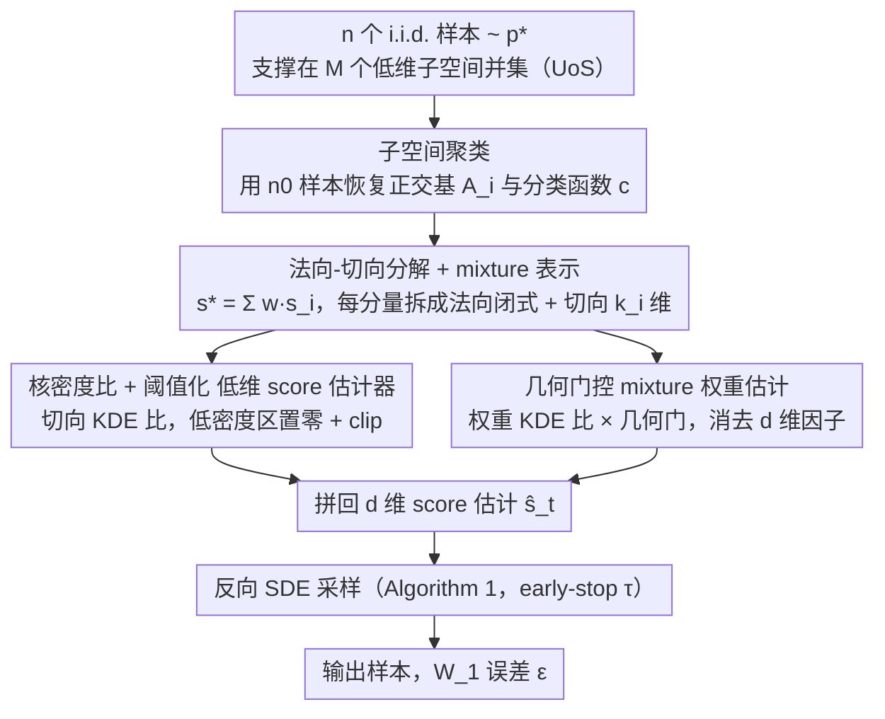

# Diffusion Models Are Statistically Optimal for Learning Low-Dimensional Multi-Modal Distributions

**会议**: ICML 2026  
**arXiv**: [2605.30153](https://arxiv.org/abs/2605.30153)  
**代码**: 无（理论论文，仅含合成数据数值验证）  
**领域**: 扩散模型 / 生成模型统计理论  
**关键词**: 扩散模型, 样本复杂度, 子空间并集, 多峰分布, minimax 最优

## 一句话总结
本文证明：当数据分布支撑在 $M$ 个低维线性子空间的并集（UoS）上且每个子空间内的分布是 subgaussian 时，存在一个基于核密度的 score 估计器可以让 score-based 扩散采样器以 $\widetilde{O}(\varepsilon^{-(k\vee 2)})$ 个样本达到 1-Wasserstein 误差 $\varepsilon$（$k$ 为最大内在维度），首次在多峰、无 smoothness/有界密度/log-concavity 假设下达到了与内在维度匹配的 minimax 最优率，彻底打破了维度灾难。

## 研究背景与动机

**领域现状**：score-based 扩散模型在图像、视频、信号、语言等高维生成任务上拿到了 SOTA，其工作原理是先在前向 OU 过程中加噪、再用学到的 score 函数 $s_t^\star=\nabla\log p_t$ 反向去噪。理论侧最近几年也在追问：要让扩散采样器以 $\varepsilon$ 精度逼近目标分布，需要多少训练样本？现有最强结果对 $\beta$-Hölder smooth 的 $d$ 维分布给出 $\varepsilon^{-(d+2\beta)/\beta}$ 的样本复杂度（Zhang 2024, Cai & Li 2025），属于 minimax 最优但显然受维度灾难支配。

**现有痛点**：这个 worst-case rate 完全无法解释扩散模型在真实高维数据上的实际表现。已有"利用内在低维结构"的工作（Chen 2023, Azangulov 2024, Tang & Yang 2024 等）虽然把 rate 改进到只依赖内在维度，但代价是要求分布满足：(i) 单一低维子空间/流形支撑；(ii) 密度在支撑集上一致下界 bounded away from zero；(iii) score 全局 smooth 或 log-concave。这些条件天然排除了多峰分布——因为多峰之间的密度必然趋零、score 必然爆炸。

**核心矛盾**：真实高维数据（图像、文本类别簇等）几乎一定是多峰的，且不同峰常常分布在不同的低维结构上（"union of manifolds hypothesis"）；现有理论要么吃维度灾难，要么用排除多峰的假设换内在维度——两条路都解释不了实证现象。

**本文目标**：拿掉对密度光滑/有界/log-concave 的假设，让扩散的样本复杂度 rate 既只依赖内在维度 $k$、又能容纳多峰几何。

**切入角度**：把数据分布建模为 UoS——$\mathsf{supp}(p^\star)\subseteq \cup_{i=1}^M V_i$，每个 $V_i$ 是 $k_i$ 维线性子空间、限制分布 $p_i^{\mathsf{low}}$ 在 $V_i$ 上是 $\sigma$-subgaussian。这是一个"既允许多峰、又给出明确低维结构"的最简模型。技术上的关键观察是：在每个子空间上，平滑后的 score 可以拆成"法向（解析高斯）+ 切向（$k_i$ 维子问题）"两块——前者闭式可算，后者只是 $k_i$ 维的低维 score 估计。

**核心 idea**：先做子空间聚类把样本归到各 $V_i$，再在每个 $V_i$ 内用核密度 + 阈值化构造低维 score 估计器，最后用 mixture 权重把各分量加权拼回 $d$ 维。整套估计器纯解析、不依赖神经网络，目的是"证可达"，从而把扩散采样的统计极限钉死在 $\varepsilon^{-(k\vee 2)}$。

## 方法详解

### 整体框架

本文要解决的核心问题是：在 UoS 多峰假设下构造一个 score 估计器，让扩散采样器的样本复杂度只依赖内在维度而非 ambient 维度 $d$。做法是把高维 score 估计拆成"先把样本聚到各子空间、再在每个子空间内做低维 score 估计、最后用 mixture 权重拼回 $d$ 维"三件事，整套估计器纯解析、不训练神经网络。

具体地，给定 $n$ 个来自 $p^\star$ 的 i.i.d. 样本，先用 $n_0=C_{\mathsf{sc}}M^2k\log n$ 个样本跑标准子空间聚类（SSC / 阈值聚类 / 贪心聚类皆可），恢复正交基 $\{A_i\}_{i=1}^M$（$A_i\in\mathbb{R}^{d\times k_i}$，$A_i^\top A_i=I_{k_i}$）和分类函数 $c:\mathbb{R}^d\to[M]$；在 UoS + 标准 separation 条件下这一步以高概率精确成功，所需样本量相对总预算可忽略。再用剩余的 $N=n-n_0$ 个样本构造 score 估计器 $\widehat s_t$ 去逼近目标 $s_t^\star=\nabla\log p_t$（$p_t=p^\star * \mathcal{N}(0,tI_d)$），对所有 $t>0$ 成立。得到 $\widehat s_t$ 后套进标准反向 SDE 采样算法（Algorithm 1：初始化于 $\mathcal{N}(0,I_d)$，反向积分到 early-stopping 时间 $\tau$）即得最终采样器；理论分析则建立在 $h(t)=\sigma_t^2/c_t^2$ 把 OU 过程 $X_t$ 与方差爆炸过程 $Z_t$ 的 score 一一映射的等价上（公式 8）。

### 关键设计

**1. Score 的"法向-切向"分解与 mixture 表示：把 $d$ 维 score 降维成 $M$ 个 $k_i$ 维子问题**

直接估 $d$ 维 score 会吃维度灾难，而 UoS 结构恰好提供了一个分而治之的切口。由 $p^\star=\sum_i p_i^\star$ 出发，平滑密度写成 $p_t(x)=\sum_i\int_{V_i}\varphi_t(x-y;d)p_i^\star(\mathrm{d}y)$，对应 score 分解为 $s_t^\star(x)=\sum_i w_t(i,x)\cdot s_t(i,x)$，其中 $w_t(i,x)$ 是"$x$ 来自第 $i$ 个子空间的后验权重"、$s_t(i,x)$ 是第 $i$ 个 component 的 score。关键引理（沿用 Chen et al. 2023）进一步把每个 component score 拆成法向加切向两块：$s_t(i,x)=-\tfrac{1}{t}(x-\mathsf{proj}_i(x))+A_i\,s_t^{\mathsf{low}}(i,A_i^\top x)$——第一项是远离子空间的法向位移，形式闭式且只依赖 $t$；第二项是 $V_i$ 内 $k_i$ 维平滑分布 $p_i^{\mathsf{low}}*\mathcal{N}(0,tI_{k_i})$ 的 score，只需在 $k_i$ 维空间里估。这一分解把所有"高维难处"挪到法向闭式部分，把真正的"统计难处"压到内在 $k_i$ 维子问题，从根上避开了 $d$ 维 score 的高维估计灾难。

**2. 核密度比 + 自适应阈值化的低维 score 估计器：在峰间空隙处不崩**

低维子问题虽然维度降下来了，但多峰分布在"峰间空隙"密度趋零，plug-in 的 score 估计会因分母接近零而剧烈震荡——这正是现有理论要靠"密度有下界"假设回避的病态。本文的处理是在 KDE 比上叠两层正则。先对子集 $\mathcal{C}_i=\{j:X^{(j)}\in V_i\}$ 做 Gaussian KDE $\widehat g_t(i,x)=\frac{1}{|\mathcal{C}_i|}\sum_{j\in\mathcal{C}_i}\varphi_t(x-A_i^\top X^{(j)};k_i)$ 并取 plug-in 比 $\nabla\widehat g_t/\widehat g_t$；再用指示阈值 $\psi(\widehat g_t;\eta_t)$ 在低密度区直接把估计置零（阈值 $\eta_t=\frac{\log N}{N(2\pi t)^{k_i/2}}$ 随 $t$ 自适应），并用半径 $R=\sqrt{2\log N/t}$ 做 clip，得到 $\widehat s_t^{\mathsf{low}}(i,x)=\mathsf{clip}_R\!\big(\tfrac{\nabla\widehat g_t}{\widehat g_t}\psi(\widehat g_t;\eta_t)\big)$，回填到 $\widehat s_t(i,x)=-\tfrac{1}{t}(x-\mathsf{proj}_i(x))+A_i\widehat s_t^{\mathsf{low}}(i,A_i^\top x)$。阈值化本质上是声明"数据稀疏到不足以估计 score 时就摆烂为 0"，既控住了第二动差、又恰好把估计器复杂度对齐到 minimax bound，论文据此得到 $\mathbb{E}[\|\widehat s_t-s_t^\star\|_2^2]=\widetilde{O}(\tfrac{1}{N}(\tfrac{1}{t}+\tfrac{\sigma^{k\vee 2}}{t^{(k\vee 2)/2+1}}))$，且整个论证只用 subgaussian、不需要密度光滑或 log-concave。

**3. 基于几何门控的 mixture 权重估计：拼回 $d$ 维时不把内在维度的好结果毁掉**

把各 component 的 score 加权拼回 $d$ 维时，权重 $w_t$ 的估计本身又是个 $d$ 维 KDE 比——朴素地估它会带 $d$ 维 KDE 的 $t^{-d/2}$ 因子，硬上就会把前两步省下的维度优势全部吐回去。本文对 $w_t(i,x)=q_t(i,x)/p_t(x)$ 的分子分母各用 KDE 估计——$\widehat p_t(x)=\tfrac{1}{N}\sum_j\varphi_t(x-X^{(j)};d)$、$\widehat q_t(i,x)=\tfrac{1}{N}\sum_j\varphi_t(x-X^{(j)};d)\mathds{1}_{c(X^{(j)})=i}$，比值即权重——再在外面乘一个"几何门" $\mathds{1}_{\{x\in\mathcal{G}_t(i)\}}$，其中 $\mathcal{G}_t(i)=\{x:\|x-\mathsf{proj}_i(x)\|_2\le R_t(i)\}$、$R_t(i)=C_R\sqrt{td\log(Ndt^{k_i/2})}$。Lemma 1 证明这种依赖点位 $x$ 的 MSE bound（含 $e^{-\|x-\mathsf{proj}_i(x)\|^2/(2t)}$ 衰减因子）一旦在 subgaussian band $\mathcal{B}_t$ 上积分，$d$ 维高斯权重就被 $V_j$ 法向的衰减积掉，最终只剩 $\sum_j(\sigma^2+t)^{k_j/2}/(Nt^{k_j/2})$。正是几何门和这套 point-wise bound 的精细化把"和 $V_i$ 距离远的 $x$"的贡献压到指数小，确保最终 rate 不再依赖 $d$。

### 损失函数 / 训练策略

整个方法不需要训练神经网络、不需要梯度下降——所有 estimator 都是显式公式，理论上需要的"超参"只有阈值 $\eta_t$（由 $N,t,k_i$ 自然决定）、clip 半径 $R$ 和几何门 $R_t(i)$。采样阶段用 Algorithm 1 的反向 SDE，配 early-stopping $\tau=n^{-2/k}$ 和总时间 $T=\log n$，端到端给出 $W_1$ 误差。论文同时指出 NN-based score 训练应当沿"先 subspace clustering、再在低维 latent 上拟合 score"的路子做，本文构造正好提供了对应的理论 target。

## 实验关键数据

### 主结果：理论 rate 对比（vs. 已有 SOTA 理论）

| 设置 | 之前最强理论 | 本文 | 关键区别 |
|------|-------------|------|---------|
| $d$ 维 $\beta$-Hölder smooth 密度 | $\varepsilon^{-(d+2\beta)/\beta}$ (Zhang 2024 / Cai & Li 2025) | — | baseline，受 $d$ 支配 |
| 单一 $k$ 维子空间 + 密度有下界 + smooth score | $\varepsilon^{-O(k)}$（依赖额外条件） | $\widetilde{O}(\varepsilon^{-(k\vee 2)})$ | 去掉密度下界 + smooth score |
| UoS 多峰 + 子空间内 subgaussian | 现有理论无法处理（多峰必然破坏密度下界） | $\widetilde{O}(\varepsilon^{-(k\vee 2)})$ | 首个达到内在维度 minimax 最优 |
| Minimax 下界（$k$ 维密度估计，Chewi 2024） | $n^{-1/(k\vee 2)}$ | 匹配 | 本文是 (near-)minimax 最优 |

具体两条 main bound：

- **Score 估计（Theorem 1）**：$\mathbb{E}[\|\widehat s_t(X)-s_t^\star(X)\|_2^2]\le C\cdot\tfrac{dM^3}{N}\big(\tfrac{1}{t}+\tfrac{\sigma^{k\vee 2}}{t^{(k\vee 2)/2+1}}\big)\mathsf{polylog}\,N$，$t$ 依赖只跟 $k$ 走，$d$ 仅出现在前因子。
- **采样（Theorem 2）**：取 $T=\log n$、$\tau=n^{-2/k}$，则 $\mathbb{E}[W_1(p^\star,p_{\widehat Y_{T-\tau}})]\le C\cdot dM^{3/2}n^{-1/(k\vee 2)}\mathsf{polylog}\,n$。换句话说，达到 $\varepsilon$ 精度只需 $\widetilde{O}(\varepsilon^{-(k\vee 2)})$ 个样本，与 ambient 维度 $d$ 完全解耦。

### 消融与机制实验（合成数据）

| 配置 | 关键量 | 说明 |
|------|--------|------|
| 完整方法 | $d=48,M=128,k=3,N=50{,}000$，目标是每个 $V_i$ 上的 2-component GMM | 经验 $L^2$ score error 随 $t$ 的衰减曲线与 $1/N\cdot(1/t+\sigma^k/t^{k/2+1})$ 完全对齐 |
| 去掉法向-切向分解 | 退化为 $d$ 维 KDE | $t^{-d/2}$ 因子直接吃掉所有信号，理论上不可能拿到 $t^{-k/2}$ 那条 rate |
| 去掉阈值化 $\psi$ | plug-in $\nabla\widehat g/\widehat g$ | 多峰间隙处第二动差爆炸，bound 不再成立 |
| 去掉几何门 $\mathcal{G}_t(i)$ | 朴素 KDE 比 | 权重 MSE 会带 $t^{-d/2}$，前因子从 $d$ 退化到 $\exp(d)$ |

### 关键发现

- 在 $d=48$ 但 $k=3$ 的合成数据上，经验 $L^2$ score error 对 $t$ 的依赖明显比 $t^{-d/2}$ 温和得多、与理论预测的 $t^{-(k\vee 2)/2-1}$ 一致，直接证伪了"高维 ambient 必然导致高 score error"的 worst-case 论调。
- 速率 $n^{-1/(k\vee 2)}$ 中的 $k\vee 2$ 来源于 $k=1$ 时密度估计 minimax 下界本身就是 $n^{-1/2}$（不能更快），这与论文结论 $\varepsilon^{-(k\vee 2)}$ 的"$\vee 2$"完全自洽，是统计极限而非证明松弛。
- 论文坦言前因子里的 $d$ 是分析 artifact、$M^3$ 和 $M^{3/2}$ 来自分量数的并集 bound，未来更精细的分析有望进一步剥离。

## 亮点与洞察

- "法向-切向分解 + mixture 权重 + 阈值化 KDE"这套组合拳第一次把 UoS 多峰场景下扩散的统计极限钉死在内在维度上，更可贵的是只要 subgaussian、不需任何关于密度/分数的光滑性或下界，这种"最弱假设 + 最优 rate"的组合在生成模型理论里相当稀缺。
- 论文明确承认 kernel-based estimator 不是为了"打败" NN-based estimator，而是作为理论 proof device 把 achievability 钉死；同时它给出的低维近似 target（每个子空间的 $k_i$ 维 score）正好可以作为未来分析 NN 容量与近似误差的具体目标，这种"理论 → 工程"的桥梁性表述很值得学习。
- 阈值化 $\psi(\widehat g_t;\eta_t)$ 本质上是 "在低密度区主动认怂、在高密度区保留 plug-in" 的自适应正则——这一思路其实可以反过来启发实际 score network 训练：在 SNR 极低 / KDE-style 密度估计极不稳的区域，与其逼网络硬学，不如在 loss 端显式忽略或加大 noise schedule 的覆盖。

## 局限与展望

- 当前结果建立在精确子空间恢复事件之上，对 noisy / approximate subspace（数据只是"靠近"低维结构）只在 Section 6 给了 sketch，端到端 rate 还没写出来。
- 上界前因子 $dM^{3/2}$（采样）和 $dM^3$（score 误差）里 $d$ 的线性依赖明显是 proof artifact 但论文没去掉；$M$ 的多项式依赖在 $M$ 很大时会让常数变得难看，需要更紧的并集 bound。
- 整套理论只覆盖 OU 前向过程 + 连续时间反向 SDE，未把数值离散化误差（DDPM/DDIM/ODE-based）端到端纳入；要给真实 sampler 一个无条件的 Wasserstein non-asymptotic bound 仍是 open。
- 把"线性子空间并集"换成"低维流形并集"是最自然的下一步，论文给了路线图但尚未做。

## 相关工作与启发

- **vs. Zhang 2024 / Cai & Li 2025（一般 $\beta$-Hölder 密度）**：他们做 $\varepsilon^{-(d+2\beta)/\beta}$ minimax 最优、本文做 $\varepsilon^{-(k\vee 2)}$ 内在维度最优；区别在于本文用 UoS 结构换 ambient 维度的指数依赖。
- **vs. Chen et al. 2023（单子空间 + smooth score）**：本文继承了法向-切向分解的工具，但拿掉了"密度有下界"和"smooth score"，并把单子空间扩展到多子空间并集——后者正是允许多峰的关键。
- **vs. Azangulov 2024 / Tang & Yang 2024（流形假设）**：他们处理流形几何但需要密度下界，本文用"线性子空间"换"流形"的几何复杂度，作为代价"只"在 UoS 上达到最优，但首次把多峰彻底包进来。
- **vs. Wang et al. 2024（低秩高斯混合）**：那篇限定正交子空间 + 高斯分量，本文允许非正交子空间 + 任意 subgaussian 分量，模型严格更广。
- **启发**：阈值化 KDE 的 "低密度区直接置零" 思路可迁移到 score distillation、conditional generation 中的稀疏类别处理；UoS 假设可作为给"类内低维 + 类间分离"型数据集（如多类别图像）做扩散理论分析的标准 toy model。

## 评分
- 新颖性: ⭐⭐⭐⭐⭐ 首个同时容纳多峰、达到内在维度 minimax 最优、且不依赖密度光滑/下界的扩散统计理论。
- 实验充分度: ⭐⭐⭐ 作为纯理论论文只配了一组合成 $L^2$ score 数值验证，方向正确但实验体量小。
- 写作质量: ⭐⭐⭐⭐⭐ 假设、定理、证明 sketch 都讲得清清楚楚，UoS / 法向-切向 / 阈值化的动机表述非常到位。
- 价值: ⭐⭐⭐⭐⭐ 把"扩散为什么能在高维 work"的理论解释推进到能解释多峰、low-dim 结构的层面，给后续 NN-based score 理论留下了明确的低维近似 target。

<!-- RELATED:START -->

## 相关论文

- [\[ICML 2025\] Annealing Flow Generative Models Towards Sampling High-Dimensional and Multi-Modal Distributions](../../ICML2025/image_generation/annealing_flow_generative_models_towards_sampling_high-dimensional_and_multi-mod.md)
- [\[ICML 2026\] Pareto-Guided Optimal Transport for Multi-Reward Alignment](pareto-guided_optimal_transport_for_multi-reward_alignment.md)
- [\[CVPR 2026\] Evaluating Generative Models via One-Dimensional Code Distributions](../../CVPR2026/image_generation/evaluating_generative_models_via_one-dimensional_code_distributions.md)
- [\[NeurIPS 2025\] Understanding Representation Dynamics of Diffusion Models via Low-Dimensional Models](../../NeurIPS2025/image_generation/understanding_representation_dynamics_of_diffusion_models_via_low-dimensional_mo.md)
- [\[ICML 2026\] STARE: Step-wise Temporal Alignment and Red-teaming Engine for Multi-modal Toxicity Attack](stare_step-wise_temporal_alignment_and_red-teaming_engine_for_multi-modal_toxici.md)

<!-- RELATED:END -->
