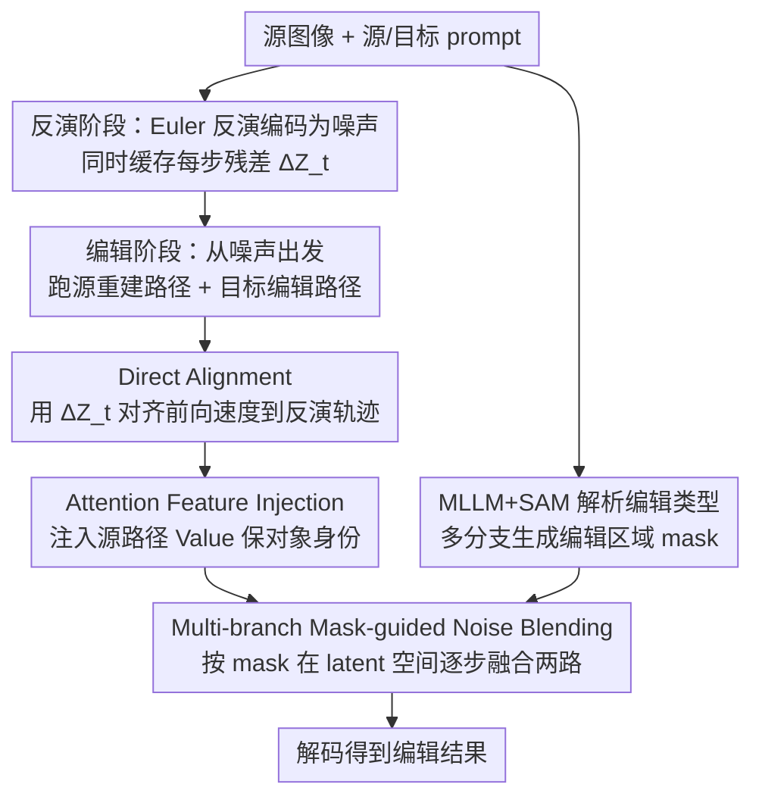

# DirectEdit: Step-Level Accurate Inversion for Flow-Based Image Editing

**会议**: ICML 2026  
**arXiv**: [2605.02417](https://arxiv.org/abs/2605.02417)  
**代码**: https://desongyang.github.io/Directedit (有)  
**领域**: 扩散模型 / 图像编辑 / Rectified Flow  
**关键词**: 流模型反演、训练无关图像编辑、步级精确重建、特征注入、Mask 引导融合

## 一句话总结
DirectEdit 通过在 Rectified Flow 反演过程中记录每一步的潜变量残差 $\Delta\mathbf{Z}_t$ 并在前向路径中提前注入，让重建路径与反演轨迹严格逐步对齐，从而在不增加任何 NFE 的前提下实现"步级精确重建"，并结合 MLLM+SAM 多分支 mask 噪声融合与注意力 Value 注入，在 PIE-Bench 上以综合排名 4.0 (FLUX) / 2.43 (SD3.5) 显著优于 RF-Inversion、FireFlow、FTEdit、DNAEdit 等所有现有训练无关方法。

## 研究背景与动机

**领域现状**：Rectified Flow (RF) 已成为 SD3.5、FLUX 等大规模 T2I 模型的主流框架。基于这些预训练流模型做训练无关图像编辑通常遵循"反演→去噪重建+编辑双路径"的范式：先用 Euler 反演把干净图像映射到噪声潜变量，再在前向去噪时同时跑一条 source 重建路径和一条 target 编辑路径，并把 source 路径的特征（attention KV、潜变量等）注入 target 路径以保持原图信息。

**现有痛点**：Euler 反演的核心近似 $\mathbf{Z}^{inv}_t = \mathbf{Z}^{inv}_{t+1} - (\sigma_{t+1}-\sigma_t)\,v_\theta(\mathbf{Z}^{inv}_{t+1})$ 用 $t+1$ 时刻的速度近似 $t$ 时刻速度，单步误差虽小但会沿去噪步累积，导致重建路径完全偏离反演轨迹。后续工作（高阶 ODE 求解器 RFEdit、定点迭代 FTEdit、插值噪声优化 DNAEdit）只能缓解轨迹整体漂移，**每一步内部的 step-level 误差仍然存在**——这意味着每一步注入到编辑路径的 source 特征都是"漂移的特征"，最终导致背景失真和编辑伪影；FlowEdit 类 inversion-free 方法则因为依赖随机噪声插值反而牺牲了 fidelity。作者在 Table 2 实测：标准 Stepwise Correction 的 step-level MSE 平均 0.2857、最大 11.73；FTEdit 也有 0.0881。

**核心矛盾**：现有方法都在"修正反演路径让其逼近重建路径"这条思路上做文章，但 RF 的 Euler 反演对单步近似误差**比 DDIM 反演敏感得多**，再怎么优化反演侧，前向去噪那一步用的速度 $v_\theta(\mathbf{Z}_t)$ 和反演时记录的速度 $v_\theta(\mathbf{Z}^{inv}_{t+1})$ 本质上就不一样，step-level 误差无法根除。

**本文目标**：在不增加任何额外神经网络评估次数 (NFE) 的前提下，实现 step-level 的精确重建——即让前向路径每一步的潜变量都严格等于反演路径对应步的潜变量 $\mathbf{Z}_{t+1} = \mathbf{Z}^{inv}_{t+1}$。

**切入角度**：反过来想——既然修正反演路径走不通，那为什么不**直接对齐前向路径**？只要能让前向去噪那一步用的速度恰好等于反演那一步用的速度 $v_\theta(\mathbf{Z}_t) = v_\theta(\mathbf{Z}^{inv}_{t+1})$，逐步对齐就自动成立。而 $\mathbf{Z}^{inv}_{t+1}$ 在反演阶段是完全可访问的，只要在反演时把每一步的潜变量残差 $\Delta\mathbf{Z}_t = \mathbf{Z}^{inv}_{t+1} - \mathbf{Z}^{inv}_t$ 缓存下来即可。

**核心 idea**：用反演时缓存的潜变量残差 $\Delta\mathbf{Z}_t$ 在前向路径预测速度前临时加到当前 latent 上得到 $\hat{\mathbf{Z}}_t = \mathbf{Z}_t + \Delta\mathbf{Z}_t$，再用 $v_\theta(\hat{\mathbf{Z}}_t)$ 去更新 $\mathbf{Z}_t$，从而无代价地强制速度对齐反演轨迹。

## 方法详解

### 整体框架
DirectEdit 要解决的是 RF 反演里每一步内部速度对不齐导致重建轨迹漂移的问题。它把整个流程拆成反演和编辑两个阶段：反演阶段用标准 Euler 把源图像编码成噪声轨迹，同时悄悄缓存每一步的潜变量残差，并让 MLLM+SAM 提前算好编辑区域的 mask；编辑阶段从噪声出发同时跑源图重建和目标编辑两条前向路径，每一步先借缓存的残差把速度场对齐回反演轨迹，再把源路径的注意力 Value 注入目标路径保细节，最后用 mask 在 latent 空间融合两条路径，解码得到编辑结果。整个过程相对 vanilla Euler 不增加任何神经网络评估，额外开销只是缓存一份残差。

### 关键设计

**1. Direct Alignment：用缓存残差让前向速度对齐反演轨迹**

前人都在想办法修正反演路径，让它逼近重建路径，但 RF 的 Euler 单步近似对误差太敏感，怎么修都消不掉每一步内部的 step-level 误差。作者把问题反过来：把反演轨迹当成 pivot，让前向路径去对齐它。由 Euler 更新公式可推出，前向第 $t$ 步要做到 $\mathbf{Z}_{t+1}=\mathbf{Z}^{inv}_{t+1}$，等价于让速度对齐 $v_\theta(\mathbf{Z}_t)=v_\theta(\mathbf{Z}^{inv}_{t+1})$，而右边的 $\mathbf{Z}^{inv}_{t+1}$ 在反演阶段是完全已知的。于是反演时记录每步残差 $\Delta\mathbf{Z}_t=\mathbf{Z}^{inv}_{t+1}-\mathbf{Z}^{inv}_t$，前向去噪时先构造对齐潜变量 $\hat{\mathbf{Z}}_t=\mathbf{Z}_t+\Delta\mathbf{Z}_t$ 喂给网络预测速度，再用这个速度更新原 latent：

$$\mathbf{Z}_{t+1}=\mathbf{Z}_t+(\sigma_{t+1}-\sigma_t)\,v_\theta(\hat{\mathbf{Z}}_t).$$

关键的巧思在于"速度预测的输入是 $\hat{\mathbf{Z}}_t$、但更新的是原 $\mathbf{Z}_t$"这一错位——它让速度场恰好等于反演时用的速度，从而逐步严格对齐。因为没有额外调用 $v_\theta$、没有定点迭代也没有高阶求解器，NFE 与 vanilla Euler 相同（60 而非 FTEdit 的 120），却把 step-level MSE 从 0.0881 量级压到 0.0006，足足降两个数量级，直接触及 VAE 重建下限。

**2. Attention Feature Injection：注入源路径 Value 保住对象身份**

精确重建解决了"特征不漂移"，但编辑区域内部若完全自由生成，原对象的纹理和身份仍会丢失。于是在 tar 路径的 self-attention 里做 Value 注入：前 $t_{inj}$ 步把每个 MM-DiT block 的注意力输出替换成 $\text{Attention}(\mathbf{Q}^{tar}_t,\mathbf{K}^{tar}_t,\mathbf{V}^{src}_t)$，之后回归标准 self-attention，得到的特征用于刷新 tar 速度。这样 Value 提供原对象的"内容"、Query/Key 来自目标路径负责新的"关系"，而 DirectEdit 又保证了被注入的 V 是未漂移的"干净"特征。架构上 SD3.5 对除最后一个之外的所有 MM-DiT block 注入，FLUX 只注入同时处理图文特征的 single block。$t_{inj}$ 是保细节与跟 prompt 之间的旋钮：值越小越贴目标 prompt、越大越像源图，实测 $t_{inj}=3$ 是多数场景的甜点。

**3. Multi-branch Mask-guided Noise Blending：按编辑类型路由 mask 保护背景**

Value 注入守住了编辑区域内的对象身份，但还要保证非编辑区域整体不被改动，这就需要空间约束。单一矩形框或单一分割掩码无法适配所有编辑：背景编辑要取对象掩码的补集、风格迁移要覆盖整图、物体添加时 SAM 根本分割不出还不存在的对象。为此先用 MLLM 输入 $(\mathbf{I}_{src},\psi_{src},\psi_{tar})$ 解析出编辑类型 $O\in\{\text{Local, Background, Global, Other}\}$ 和感兴趣框 $(P,Q)$，再按 $O$ 走不同分支生成 mask $\mathcal{M}$：Local 用 SAM 分割对象、Background 取其补集、Global 整图置 1、Other 直接用矩形框 $\mathcal{B}(P,Q)$。每个去噪步结束后在 latent 空间逐步融合两条路径：

$$\mathbf{Z}^{tar}_{t+1}\leftarrow\mathbf{Z}^{src}_{t+1}\odot(\mathbf{1}-\mathcal{M})+\mathbf{Z}^{tar}_{t+1}\odot\mathcal{M}.$$

逐步融合（而非最后一次性融合）能避免边界伪影，配合 DirectEdit 的精确重建，非编辑区域可做到几乎零失真。消融里把多分支退回成统一矩形框，PSNR 就掉了 4.77 dB（32.63→27.86），说明 mask 路由对背景保真至关重要。

### 损失函数 / 训练策略
**完全训练无关**，无任何 loss 与反向传播。推理设置：FLUX.1-dev / SD3.5-medium 作骨干，30 步去噪，CFG=1（反演）/CFG=2（编辑），$t_{inj}=3$。

## 实验关键数据

### 主实验
PIE-Bench (700 张图、9 类编辑) 上的训练无关编辑对比（综合排名越小越好）：

| Backbone | 方法 | Structure↓ | PSNR↑ | LPIPS↓ | MSE↓ | CLIP-Whole↑ | Avg. Rank↓ |
|----------|------|-----------|-------|--------|------|-------------|-------------|
| FLUX | RF-Inversion | 41.17 | 20.86 | 187.01 | 120.12 | 25.08 | 13.57 |
| FLUX | RFEdit | 25.15 | 24.33 | 121.59 | 56.98 | 25.57 | 9.14 |
| FLUX | FireFlow | 27.40 | 23.11 | 128.46 | 70.75 | 26.13 | 9.43 |
| FLUX | FlowEdit | 27.83 | 21.96 | 112.15 | 94.94 | 25.26 | 10.57 |
| FLUX | DNAEdit | 16.81 | 25.20 | 86.68 | 48.35 | 24.81 | 7.71 |
| FLUX | **DirectEdit** | **17.94** | **32.63** | **35.45** | **25.05** | 25.39 | **4.00** |
| SD3.5 | FTEdit | 21.06 | 23.49 | 90.25 | 61.78 | 25.21 | 9.29 |
| SD3.5 | FlowEdit | 23.13 | 23.29 | 92.81 | 69.09 | 26.71 | 7.29 |
| SD3.5 | DNAEdit | 11.03 | 27.71 | 60.51 | 26.28 | 25.20 | 5.14 |
| SD3.5 | **DirectEdit** | **14.65** | **31.82** | **31.36** | **21.64** | 25.64 | **2.43** |

**重建误差对比**（FLUX，60 NFE vs 120 NFE，关键指标 Step-Level MSE）：

| 方法 | NFE↓ | PSNR↑ | Step-Level MSE Avg↓ | Step-Level MSE Max↓ |
|------|------|-------|---------------------|---------------------|
| VAE (理论下限) | - | 34.38 | - | - |
| Vanilla Euler | 60 | 14.59 | 1177.73 | 39511.72 |
| Stepwise Correction | 60 | 34.38 | 0.2857 | 11.73 |
| FTEdit | 120 | 34.38 | 0.0881 | 14.82 |
| RFEdit | 120 | 21.92 | 231.72 | 20156.25 |
| **DirectEdit** | **60** | **34.38** | **0.0006** | **0.0757** |

DirectEdit 用一半 NFE 把 step-level MSE 平均/最大同时降低 **2~4 个数量级**，触及 VAE 重建下限。

### 消融实验 (FLUX, PIE-Bench)

| 配置 | Struct.↓ | PSNR↑ | LPIPS↓ | MSE↓ | CLIP-Whole↑ |
|------|----------|-------|--------|------|-------------|
| Vanilla | 75.95 | 16.81 | 276.29 | 332.65 | 23.57 |
| w/o alignment (回退 Stepwise Correction) | 29.22 | 31.12 | 53.16 | 48.17 | 25.24 |
| w/o attention | 23.75 | 31.93 | 39.60 | 33.97 | 25.60 |
| w/o mask | 21.93 | 24.70 | 102.92 | 56.76 | 25.89 |
| w/o multi-branch (回退矩形框) | 19.15 | 27.86 | 60.92 | 38.94 | 25.71 |
| **DirectEdit (full)** | **17.94** | **32.63** | **35.45** | **25.05** | 25.39 |

### 关键发现
- **Direct Alignment 是绝对核心**：去掉后所有指标全面崩塌（PSNR 从 32.63→31.12，Structure 距离从 17.94→29.22），印证"step-level 重建误差是注入特征漂移的根因"这一论断。
- **Mask blending 主导背景保真度**：w/o mask 时 PSNR 直接掉 7.93 dB（32.63→24.70）；多分支 mask 进一步贡献约 4.77 dB。
- **Attention injection 在保细节与跟 prompt 之间做 trade-off**：去掉后 CLIP 反而略升（25.60 vs 25.39），但视觉上会丢原对象的细粒度纹理，$t_{inj}=3$ 是经验甜点。
- **效率优势显著**：60 NFE 跑出比 120 NFE 的 FTEdit 更好的 step-level MSE（0.0006 vs 0.0881），意味着既快又准。

## 亮点与洞察
- **"反着想"的反演哲学**：所有前人都在修反演路径让它逼近重建路径，作者反过来——把反演路径当 pivot，让前向路径去对齐它。一旦换了视角，解法竟然简单到只需缓存一份残差并加回去，这是工程师审美的极致体现。
- **零 NFE 代价实现两个数量级精度提升**：纯靠潜变量层面的代数恒等（$v_\theta(\mathbf{Z}_t + \Delta\mathbf{Z}_t) = v_\theta(\mathbf{Z}^{inv}_{t+1})$）就达成 step-level 严格对齐，没有额外神经网络前向，没有定点迭代，没有高阶求解器——这种"几乎免费"的改进特别可遇不可求。
- **MLLM+SAM 形成的"语义化 mask 路由器"**：把 mask 生成从"二选一"（要么 SAM 要么矩形框）升级为按编辑类型多分支路由，这个模式可以直接迁移到所有需要空间约束的训练无关编辑（视频编辑、3D 编辑、布局到图像等）。
- **可复用 trick**：缓存反演侧中间量并在前向侧"补偿"的范式，可推广到任何用 Euler/RK 离散求解 ODE 的反演任务，例如音频/视频 RF 编辑、3D 高斯编辑等。

## 局限与展望
- 作者承认：编辑质量天花板被骨干 T2I 模型的先验锁死；对尺寸变化、空间操控、复杂上下文推理这类需要"重新组织内容"的编辑仍然吃力。
- 隐含局限：MLLM 解析编辑类型与坐标的准确性直接决定 mask 质量，论文未量化 MLLM 误判对最终编辑的影响；当 MLLM 把 Local 误判为 Background 时整个融合方向会反掉。
- 隐含局限：需要缓存 $\{\Delta\mathbf{Z}_t\}$（$T$ 份 latent），对长 schedule 和高分辨率的 FLUX 在显存上有压力，论文未给峰值显存数据。
- 改进思路：(1) 把 Direct Alignment 与一阶高阶 solver 结合，进一步用更少步数达到同样精度；(2) 把 mask 路由从离散四分支扩展为可学习的连续 mask 生成器；(3) 与 inversion-free 思路（FlowEdit）做混合——前几步用 inversion-free 探索大幅编辑，后几步用 DirectEdit 精修细节。

## 相关工作与启发
- **vs Stepwise Correction (Direct Inversion, 2023)**：两者都意识到反演与重建路径要严格对齐，但前者通过"强制 $\mathbf{Z}_t = \mathbf{Z}^{inv}_t$"在重建后修正轨迹，每步内部速度仍然不一致；DirectEdit 通过"事先用残差对齐速度输入"在重建前就保证速度一致，更彻底且 step-level MSE 量级低两个数量级（0.2857→0.0006）。
- **vs FTEdit / DNAEdit**：FTEdit 用定点迭代 + 重建轨迹修正、DNAEdit 用插值速度估计，本质上都是"减小但消不掉"step-level 误差，且都把 NFE 翻倍到 120；DirectEdit 在 60 NFE 下直接做到 step-level 误差量级 1e-4，且实测 PSNR 和综合 rank 全面领先。
- **vs FlowEdit (inversion-free)**：FlowEdit 通过随机噪声插值绕过反演，简单粗暴但 fidelity 差（FLUX 上 PSNR 仅 21.96）；DirectEdit 走的是"把反演做到极致"的另一极端，证明了精确反演路线在 RF 上依旧是更优选择。
- **vs RF-Inversion**：RF-Inversion 用 LQR 控制理论构造辅助速度场，理论漂亮但实测 PSNR 仅 20.86；DirectEdit 用最朴素的"残差缓存+对齐"达到 32.63，再次说明工程上简单方案+正确视角往往胜过复杂理论。

## 评分
- 新颖性: ⭐⭐⭐⭐⭐ "对齐前向而非反演"的视角切换 + 零 NFE 残差缓存技巧，简单到看完想拍大腿，属于真正改变思路的小创新。
- 实验充分度: ⭐⭐⭐⭐ PIE-Bench 全指标 + 双骨干 (FLUX/SD3.5) + step-level MSE 单独验证 + 完整消融，覆盖训练无关编辑 SOTA，但缺少长 schedule 和高分辨率显存数据。
- 写作质量: ⭐⭐⭐⭐ 推导清晰、对比图 (Fig.2) 和 algorithm 1 帮助理解，但部分关键证明放 Appendix A 未展开。
- 价值: ⭐⭐⭐⭐⭐ 在 RF-based 训练无关编辑上同时把"效率（60 vs 120 NFE）"和"精度（step MSE 降 2 个数量级）"刷到新水位，可直接被下游研究复用作为反演基础组件。

<!-- RELATED:START -->

## 相关论文

- [\[ICML 2025\] Taming Rectified Flow for Inversion and Editing](../../ICML2025/image_generation/taming_rectified_flow_for_inversion_and_editing.md)
- [\[CVPR 2026\] BiFM: Bidirectional Flow Matching for Few-Step Image Editing and Generation](../../CVPR2026/image_generation/bifm_bidirectional_flow_matching_for_few-step_image_editing_and_generation.md)
- [\[NeurIPS 2025\] SplitFlow: Flow Decomposition for Inversion-Free Text-to-Image Editing](../../NeurIPS2025/image_generation/splitflow_flow_decomposition_for_inversion-free_text-to-image_editing.md)
- [\[CVPR 2025\] Unveil Inversion and Invariance in Flow Transformer for Versatile Image Editing](../../CVPR2025/image_generation/unveil_inversion_and_invariance_in_flow_transformer_for_versatile_image_editing.md)
- [\[ICML 2026\] Principled RL for Flow Matching Emerges from the Chunk-level Policy Optimization](principled_rl_for_flow_matching_emerges_from_the_chunk-level_policy_optimization.md)

<!-- RELATED:END -->
