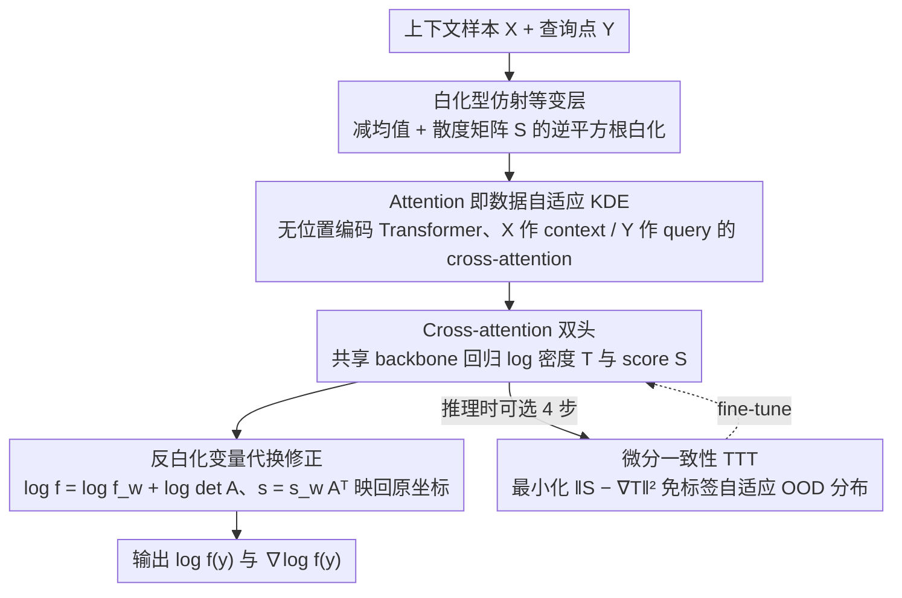

# DiScoFormer: Plug-In Density and Score Estimation with Transformers

**会议**: ICML 2026 Oral  
**arXiv**: [2511.05924](https://arxiv.org/abs/2511.05924)  
**代码**: 待确认  
**领域**: 科学计算 / 非参数统计 / 密度与 score 估计  
**关键词**: 密度估计, score 估计, Transformer, 核密度估计, 等变网络

## 一句话总结
本文提出 DiScoFormer，一种对样本顺序置换等变、对坐标仿射等变的 Transformer，用一次前向把任意 i.i.d. 样本集映射到对应密度 $f$ 与 score $\nabla\log f$，并从理论上证明 self-attention 在适当参数化下可精确复现归一化高斯 KDE，实验上在 GMM、Laplace、Student-$t$ 等多种分布、宽样本量与维度范围内全面优于经典 KDE，并可作为即插即用 score oracle 用于 Fisher 信息、熵估计与 Fokker–Planck 类 PDE 求解。

## 研究背景与动机

**领域现状**：从样本估计密度 $f$ 与 score $\nabla\log f$ 是生成模型、贝叶斯推断、动理学方程求解中的基础原语。目前主流分两派：以 Parzen 窗 / Silverman 法则为代表的核密度估计 (KDE) 提供闭式、可解释、分布无关的估计；以 denoising score matching / 扩散模型为代表的神经 score 学习则在高维下精度极高。

**现有痛点**：两派各有死穴。KDE 受困于"维度灾难"——bandwidth 的偏差-方差权衡僵硬，维度一旦升上去误差爆炸，且 score 估计天然带有 $O(h^2)$ 的偏置。神经 score matching 虽然精度高，但是**transductive** 的：每换一个目标分布都要重训，根本没法当"即插即用"的统计原语用。

**核心矛盾**：泛化能力（KDE 对任意分布通用）和高精度（神经网络在高维下精确）之间存在结构性矛盾——一个把"学到的归纳偏置"完全交给固定核函数，另一个则完全绑死在单一目标分布上。

**本文目标**：拆成两个子问题——(i) 找到一种**架构层面**就尊重置换/仿射对称性的网络，把 KDE 的对称归纳偏置"内化"进网络；(ii) 让该网络学一个**算子** $X \mapsto (\log f, \nabla\log f)$ 而不是某个特定分布的函数，使其能跨分布、跨样本量泛化。

**切入角度**：把密度/score 估计重新表述为 sequence-to-operator 学习——输入是整个样本序列 $X=\{x_i\}_{i=1}^n$，输出是两条与样本一一对应的序列 $\log f(x_i)$ 与 $\nabla\log f(x_i)$。Transformer 的 self-attention 天然对 token 顺序置换等变，恰好匹配 i.i.d. 样本"无序集合"的结构；再补上仿射等变，就能完全继承 KDE 的对称性。作者进一步注意到，softmax attention 的指数核形式与高斯核 KDE 形式上极度相似，这暗示 Transformer 不是"另起炉灶"，而是**KDE 的数据自适应推广**。

**核心 idea**：用置换等变 + 仿射等变 Transformer 学一个跨分布通用的 score/density 算子，并在理论上证明 attention 可严格复现归一化 KDE，从而把 KDE 的"通用性"和神经网络的"精度+多尺度自适应"合在同一架构内。

## 方法详解

### 整体框架
DiScoFormer 把密度/score 估计当成一个"集合到算子"的回归任务：吃进上下文样本 $X \in \mathbb{R}^{n_x \times d}$（定义经验密度的 i.i.d. 样本）与查询点 $Y \in \mathbb{R}^{n_y \times d}$（要在哪些位置取值），一次前向就吐出每个查询点的标量 $\log f(y_i)$ 和向量 $\nabla\log f(y_i)$。样本先过一层白化把坐标尺度归一化，再进无位置编码的标准 Transformer encoder 让 $X$、$Y$ 之间做 cross-attention，最后由两个共享 backbone 的输出头分别回归 log 密度 $T$ 与 score $S$，并把白化坐标里的结果反映回原坐标。整个模型只在即时采样的 GMM 流上训练，推理时还能选择性地打开 test-time training 自适应到训练没见过的分布。

### 关键设计

**1. 白化型仿射等变层：把 KDE 的"尺度无感"硬编进网络**

纯 Transformer 加位置无关只能拿到置换等变，但 KDE 真正强的地方是对坐标平移/缩放/旋转都不敏感，要把这个性质装进网络就必须有显式的仿射归一化。作者的做法是闭式可微的白化：先让 $X, Y$ 一起减去 $X$ 的均值，再对正则化散度矩阵 $S = X_c^\top X_c + \varepsilon I$ 取矩阵逆平方根 $A = S^{-1/2}$（矩阵意义而非逐元素），把两组点都变换到白化坐标 $X_w = X_c A,\ Y_w = Y_c A$；Transformer 在白化坐标里算出 $\log f_w, s_w$，最后靠变量代换修正回去——$\log f = \log f_w + \log\det A$，$s = s_w A^\top$。这样模型对任意可逆线性变换都满足 $T(PXA+\mathbf{1}\mu^\top) = PT(X) - \log|\det A|\,\mathbf{1}$、$S(PXA+\mathbf{1}\mu^\top) = PS(X)A^{-\top}$。白化只能把任意 affine 变换归约到 $O(d)$ 旋转/反射上的残差，剩下这点旋转等变性则靠"训练时对 GMM 做随机正交旋转增广"近似学到，从而避开了完整等变网络那种昂贵的群积分；表 1 实测各类仿射变换的相对 MSE 只有 $10^{-4}$ 量级，说明这套"硬等变 + 软增广"的组合确实拿到了近似仿射等变。

**2. Attention 即数据自适应 KDE：一条构造性等价定理**

这是全文的理论支点：softmax cross-attention 并不是黑箱，而是归一化高斯 KDE 的严格推广。对任意半正定 $B$，cross-attention 权重经极化恒等式可以改写成 KDE 的形式 $A_{ij} = \frac{w_j \exp(-\tfrac{1}{2}\|y_i - x_j\|_B^2)}{\sum_k w_k \exp(-\tfrac{1}{2}\|y_i - x_k\|_B^2)}$，其中唯一"挡在标准 KDE 前面"的多余项是 $w_j = \exp(\tfrac{1}{2}\|x_j\|_B^2)$（Prop. 3.3）。只要给每个 token 额外拼上一个标量特征 $\|z\|^2$，这个 $w_j$ 就能被精确抵消，于是单个残差 cross-attention block（宽度 $d_\text{model} \geq 2d+1$，无 FFN、无 LayerNorm）配一个仿射读出和 per-query 的 log-normalizer $\ell_i = \log\sum_j \exp(q_i^\top k_j)$，就能在任意 query 点精确复现 KDE 的 score 与 log 密度：

$$\nabla\log\hat{f}_{h,X}(y_i) = h^{-2}\Bigl(\tfrac{\sum_j K_h(y_i,x_j)x_j}{\sum_j K_h(y_i,x_j)} - y_i\Bigr),\quad \log\hat{f}_{h,X}(y_i) = \ell_i - \tfrac{\|y_i\|^2}{2h^2} - \log n_x - \tfrac{d}{2}\log(2\pi h^2)$$

（Prop. 3.5、Cor. 3.6）。这条定理的意义是把"Transformer 能做密度/score 估计"从经验现象升级成结构性必然——KDE 落在模型假设空间里、是模型能力的下界，而多 head、多层只会让它学到比固定核更灵活的数据自适应多尺度核。它也正好解释了实验里观察到的 head 专家化现象（head 1 看远点、head 0/2/5 看近-中距、head 3/4/6/7 学方向核）：多 head 天然对应多带宽 + 各向异性 KDE。

**3. Cross-attention 双头 + 微分一致性 TTT：免标签 OOD 自适应**

要让估计能力从"只在样本点 $X$ 上"扩展到"任意 query 点 $Y$"，作者用 $X$ 当 context、$Y$ 当 query 做 cross-attention，使模型成为一个真正的非参数平滑算子而非只能输出训练样本处的统计量。两个输出头共享同一 backbone 分别回归 $\log f$ 与 score，既利用了二者共享的几何特征提高样本效率，也用联合 MSE 目标 $\mathcal{L} = \alpha \mathcal{L}_T + (1-\alpha)\mathcal{L}_S$ 一起训练（Eq. 6-8）。更关键的是，数学上必然有 $S(C,Q)_i = \nabla_{q_i} T(C,Q)_i$，于是推理时把 context 设为 $\text{stopgrad}(X)$、query 设为 $X$，最小化一致性损失

$$\mathcal{L}_\text{con} = \tfrac{1}{n}\sum_i \bigl\|S(C,Q)_i - \nabla_{q_i} T(C,Q)_i\bigr\|_2^2$$

就能在完全没有 ground-truth 密度的情况下对未见分布做 fine-tune——这就是 test-time training。实测只要 4 步 TTT，就能在 Laplace、Student-$t$ 等非 GMM 分布上把 score MSE 进一步压低，相当于把"密度与 score 之间必然成立的微分关系"当成零成本的 self-supervision 来用。

### 损失函数 / 训练策略
联合优化 $\mathcal{L} = \alpha\,\mathcal{L}_T + (1-\alpha)\,\mathcal{L}_S$，其中 $\mathcal{L}_T, \mathcal{L}_S$ 分别是 $\log f$ 与 score 的 MSE（Eq. 6-8）。训练数据由 Algorithm 1 即时生成：每个 batch 随机抽取 $k \in [k_\text{min}, k_\text{max}]$ 个 GMM components，采两组独立 GMM 作为 context $X_b$ 和 query $Y_b$，并解析计算 $\log f_{X_b}(y), \nabla\log f_{X_b}(y)$ 作为监督信号。默认配置：4 encoder 层、隐藏维度 128、8 heads、GELU、pre-norm、无位置编码，约 80 万参数；batch size 32、$n=2048$、dropout 0.1，GMM mean 在 $[-3,3]^d$、对角协方差在 $[0.2,1]^d$。大 $n$ 实验另训 $d_\text{model}=256$、6 层、8 heads、150k steps 的更大模型，并在 $[2^8, 2^{14}]$ 范围内随机采样 context 大小，使模型自然学会跨样本量泛化。

## 实验关键数据

### 主实验
所有实验单卡 48GB L40S；对比对象主要是 Scott 规则 KDE 与 Score-Debiased KDE (SD-KDE)，Appendix 还对比了 sliced score matching。

| 数据集 / 设置 | 指标 | 本文 | KDE | 提升 |
|--------|------|------|------|------|
| GMM 2D, $n=2^{14}$ | Rel. score MSE (%) | 6.80 | 17.2 | $\approx 2.5\times$ |
| GMM 10D, $n=2^{14}$ | Rel. score MSE (%) | 2.83 | 52.9 | $\approx 18\times$ |
| GMM 10D, $n=2^{17}$（外推） | Rel. score MSE (%) | 2.74 | OOM | KDE 显存爆炸 |
| 2D Laplace, $n=2048$ | Score MSE | 0.2990（更优）| 0.2990（持平/略差）| 跨分布泛化 |

### 消融实验
| 配置 | 关键指标 | 说明 |
|------|---------|------|
| 全模型（cross-attention + 等变） | 表 1 各类仿射变换相对 MSE $\sim 10^{-4}$ | 白化 + 数据增广共同保证近似等变 |
| GMM 1-10 modes 训练 → 测 1-19 modes | MSE 单调小幅上升 | OOD mode 数泛化稳定 |
| 大 $n$ Transformer，$n \in [2^8, 2^{14}]$ 训练 → 测到 $2^{17}$ | MSE 仍单调下降 | 序列长度外推成功 |
| TTT 0 步 → 4 步（Laplace / Student-$t$） | score MSE 进一步下降 | 一致性损失提供免标签 OOD 适配 |

### 关键发现
- 维度越高，Transformer 相对 KDE 的领先越大：$d=2$ 时差距约 $2$-$3\times$，$d=10$ 时差距拉到 $\sim 18\times$，且 KDE 在 $n \geq 2^{15}$ 已 OOM，DiScoFormer 仍能流畅 evaluate——这把"维度灾难"问题从根上缓解。
- Head 自动专家化（far-range / mid-range / 方向核）与"多尺度 KDE"的理论预测高度一致，构成对 Prop. 3.3-3.6 的强经验佐证：多 head Transformer 学到的就是"自适应多带宽核 + 各向异性核"。
- 模型只在 GMM 上训练就能迁移到 Laplace、Student-$t$，配合 4 步 TTT 即可继续压低误差，验证了"GMM 是平滑密度空间稠密集"的训练数据选择是合理的。
- 把 DiScoFormer 作为即插即用 score oracle 接入 SD-KDE / Fisher 信息计算 / Fokker–Planck 型 PDE 的粒子求解器，能在零额外训练下给下游任务高保真 score，证明它确实是 KDE 之后被长期缺位的那个"通用 score 组件"。

## 亮点与洞察
- **把 attention 严格证明为"数据自适应 KDE 的推广"**：Prop. 3.3-3.6 不是 hand-wavy 的类比，而是构造性等价——给 token 拼 $\|z\|^2$ 这一个标量后，单 head cross-attention 能在任意 query 点精确等于归一化高斯 KDE。这条结果对 attention 解释性社区也有独立价值。
- **白化层 + 训练时旋转增广**这个组合很巧妙：白化把任意可逆 affine 严格归约到 $O(d)$ 残差，剩下的 $O(d)$ 通过数据增广近似学到——既保证了"硬"等变性（平移/缩放/permutation），又用低成本方式拿到旋转近似等变，避免了完整的等变网络层那种昂贵的群积分。
- **联合 $(\log f, \nabla\log f)$ 双头 + 自动微分一致性 → 免标签 TTT**：这条 trick 在任何输出"密度+score"的工作里都可以复用——把数学上必有的微分关系当 self-supervision，零成本拿到 OOD 适配能力。

## 局限与展望
- 当前训练数据完全是 GMM，虽然理论上 GMM 在 TV / Fisher divergence 下稠密，但对"重尾/离散/低秩流形"等极端分布仍然依赖 TTT 兜底；可以引入更丰富的分布族（如 normalizing flow 采的样本）做混合训练。
- 实验维度最高只到 $d=10$，真实场景里图像 / 分子构象空间维度高得多；白化层依赖样本协方差，$n < d$ 时会奇异，必须再加低秩 / 谱截断策略才能扩到 ImageNet 量级。
- 文中没有给出 cross-attention 的复杂度分析：当 $n_x, n_y$ 同时变大时 attention 是 $O(n_x n_y)$，与 KDE 同阶，仍可能是大样本场景的瓶颈，可考虑接 linear attention / Nyström 近似（其本身已被证明与 kernel 方法相关）。
- 仿射等变只到"协方差归一化"层级，对存在低维流形结构的真实数据（如自然图像、分子构象）来说，欧氏白化不是最佳的几何归一化方式；后续可以替换成黎曼或谱流形上的归一化层。
- 训练目标是 MSE 而非负对数似然，意味着 $\log f$ 头并没有显式保证"$\exp(\log f)$ 积分为 1"，下游若把它当真实概率密度用，需要额外做后处理或加 normalization 正则。

## 相关工作与启发
- **vs Score-Debiased KDE (Epstein et al., 2025)**：SD-KDE 需要一个外部 score oracle 来纠偏 KDE 的 $O(h^2)$ 偏差，但论文没说这个 oracle 从哪来；DiScoFormer 恰好是这个"缺失的 oracle"，反过来又能把 SD-KDE 作为下游受益者——本文实验里直接把 DiScoFormer 的 score 喂给 SD-KDE 跑了一遍。
- **vs Score Neural Operator (Liao et al., 2024)**：两者都想学"概率分布上的算子"，SNO 走 RKHS 嵌入路线、需要先把分布映射到 RKHS；DiScoFormer 直接吃原始 i.i.d. 样本、不依赖任何 kernel embedding，架构更简单、跨密度/维度泛化更直接。
- **vs Score-based 生成模型（DDPM、Score SDE）**：那一派是 transductive 的——每个目标分布一个网络；DiScoFormer 学的是分布无关的算子，"一次训练，到处用"，定位互补：DDPM 解决"如何从某个特定分布采样"，DiScoFormer 解决"如何对任意分布估 score"。
- **vs Set Transformer / DeepSets / Neural Processes**：共享"对置换等变的可交换数据"思路，但本文额外强加了仿射等变 + 输出统计量（密度/score），并给出与 KDE 的严格连接，把"等变集合处理"具体落到了非参数统计任务上。

## 评分
- 新颖性: ⭐⭐⭐⭐⭐ 第一次给"attention = 数据自适应 KDE"以构造性等价证明，并据此设计了通用的密度/score 算子学习器。
- 实验充分度: ⭐⭐⭐⭐ 维度/样本量扫描、OOD（mode 数、Laplace、Student-$t$）、TTT、下游 SD-KDE / Fisher / Fokker–Planck 应用都覆盖到了，唯一遗憾是没上真实高维数据。
- 写作质量: ⭐⭐⭐⭐⭐ 理论命题、白化伪代码、attention 可视化图与 head 专家化分析层层递进，把"为什么 Transformer 适合做这件事"讲得非常清晰。
- 价值: ⭐⭐⭐⭐⭐ 一旦权重发布，社区终于有了一个 plug-in 的通用 score oracle，可直接喂给 SD-KDE、SVGD、Fokker–Planck 求解器、信息论估计等大量下游任务，影响面非常宽。

<!-- RELATED:START -->

## 相关论文

- [\[ICLR 2026\] Sample-Efficient Evidence Estimation of Score-Based Priors for Model Selection](../../ICLR2026/image_generation/sample-efficient_evidence_estimation_of_score_based_priors_for_model_selection.md)
- [\[CVPR 2025\] Taming Score-Based Denoisers in ADMM: A Convergent Plug-and-Play Framework](../../CVPR2025/image_generation/taming_score-based_denoisers_in_admm_a_convergent_plug-and-play_framework.md)
- [\[ICML 2026\] Scalable GANs with Transformers](scalable_gans_with_transformers.md)
- [\[ICLR 2026\] Monocular Normal Estimation via Shading Sequence Estimation](../../ICLR2026/image_generation/monocular_normal_estimation_via_shading_sequence_estimation.md)
- [\[ICML 2026\] Krause Synchronization Transformers](krause_synchronization_transformers.md)

<!-- RELATED:END -->
