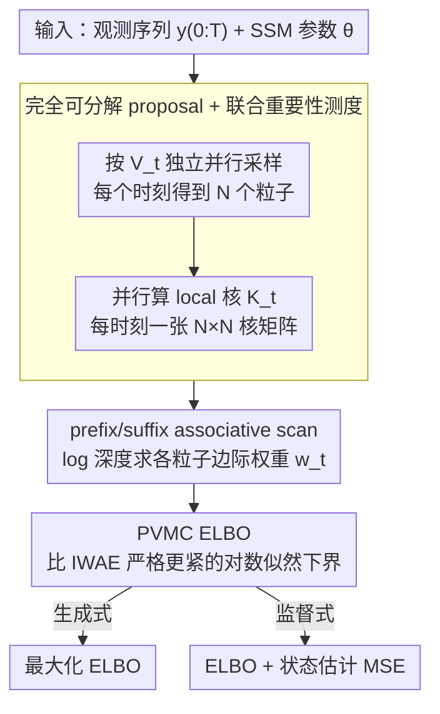

# Efficient Learning of Deep State Space Models via Importance Smoothing

**会议**: ICML 2026  
**arXiv**: [2605.21108](https://arxiv.org/abs/2605.21108)  
**代码**: https://github.com/John-JoB/parallel-variational-sequential-monte-carlo (有)  
**领域**: 时间序列 / 概率深度学习 / 状态空间模型  
**关键词**: 深度状态空间模型, 序贯蒙特卡洛, 重要性平滑, 并行 prefix scan, 变分推断

## 一句话总结
本文提出 Parallel Variational Monte Carlo (PVMC)，用 prefix/suffix associative scan 把深度状态空间模型的重要性加权边际平滑分布在 $\mathcal{O}(\log N \times \log T)$ span 内并行算出来，同时支持监督式状态估计和生成式建模，比最快的可微 SMC 基线快约 10×，精度还更高。

## 研究背景与动机

**领域现状**：深度状态空间模型（DSSM）把转移核 $M_t$ 和观测核 $H_t$ 用神经网络参数化，是金融、生态、目标跟踪、神经科学等领域时间序列建模的主力工具。它的训练通常走两条互不相通的路线：(a) 把整条轨迹视作一个 VAE 的潜变量 $\tilde{x}=x_{0:T}$，用 IWAE 风格的 ELBO 训练（auto-encoding DSSM）；(b) 把分类的序贯蒙特卡洛/粒子滤波（SMC）做成可微算子，反传通过粒子的重要性权重训练（differentiable SMC, DSMC）。

**现有痛点**：两条路线各有死穴。VAE 路线虽然可以完全并行，但 (i) 不支持监督式损失——它的编码器只看 $y_{0:T}$，无法在每个时刻输出一个能与真值状态比对的粒子分布；(ii) 其 ELBO 是"对单条轨迹做重要性加权"的松弛上界，远没有用上不同时刻粒子组合出来的指数级轨迹空间。DSMC 路线虽然能给监督损失（MSE / KNLL）提供合理的边际滤波后验，但它的核心算子 resampling 会引入跨粒子的全局依赖，迫使前向必须沿时间顺序串行；要么以 reinforce 估计有偏梯度，要么牺牲无偏性换低方差，要么引入 differentiable relaxation 但带来高昂的额外算力开销（Diffusion DPF 在表 2 训练时间是 PVMC 的 ~150 倍）。

**核心矛盾**：要"并行 + 监督 + 紧的变分下界 + 无偏梯度"四件事同时成立。VAE 路线砍掉了监督和紧 bound，DSMC 路线砍掉了并行和（部分方法的）无偏性。本文要把这四件事一次性补齐。

**本文目标**：构造一种既能像 VAE 一样在硬件上并行训练、又能像 DSMC 一样输出每个时刻的边际平滑后验 $Q_t(x_t \mid y_{0:T})$、还能给出比 IWAE 更紧的 ELBO 的端到端可微估计器。

**切入角度**：作者注意到，如果把"采样"和"加权"两步彻底解耦——让 proposal 在时间维度完全可分解 $V_{0:T}(x_{0:T}\mid y_{0:T})=\prod_t V_t(x_t\mid y_{0:T})$，于是采样天然并行；剩下的边际权重 $w_t^n$ 形式上是一个对所有其他时刻粒子索引的求和，这个求和结构是一条"前向×后向"链式张量积，可以套上**结合律 prefix/suffix scan**这把锤子。换句话说，把 SMC 里逼着串行的"resampling 依赖"换成"重新求和的依赖"，后者结合律成立、可以 log-depth 并行。

**核心 idea**：用一个**可分解 proposal + 时间维 associative scan 上的重要性平滑**替换粒子滤波 resampling，得到 span 复杂度 $\mathcal{O}(\log N \times \log T)$、梯度无偏、且 ELBO 严格紧于 IWAE 的 DSSM 训练算法。

## 方法详解

### 整体框架
PVMC 要解决的是"DSSM 训练在并行、监督、紧 bound、无偏梯度四者间二选二"的困境，做法是把粒子滤波里逼着串行的 resampling 彻底拿掉，换成一个在时间维完全可分解的 proposal 加上一遍 associative scan。给定参数化 SSM（$x_0\sim P$，$x_t\sim M_t(\cdot\mid x_{t-1})$，$y_t\sim H_t(\cdot\mid x_t)$）和神经网络 proposal $V_t(\cdot\mid y_{0:T})$，它吃进观测序列 $y_{0:T}$ 与模型参数 $\theta$，吐出每个时刻的加权粒子集合 $\{(X_t^n, w_t^n)\}$ 和似然估计 $\hat L^N$；因为采样、加权两步被解耦成"独立并行采 + 链式张量积求和"，前向与反向都维持 $\mathcal{O}(\log N\times\log T)$ 的 span。

### 关键设计

**1. 完全可分解 proposal + 联合重要性测度：把"串行依赖"换成"可结合求和"**

DSMC 不能并行的根源在于 resampling 让 $t$ 时刻的 proposal 依赖 $t-1$ 时刻全体粒子，而 VAE 的 bound 松则源于它只看 $N$ 条轨迹而非指数级的轨迹空间。本文把 proposal 取成横切分解 $V_{0:T}=\prod_t V_t(x_t\mid y_{0:T})$，让采样天然独立可并行；再定义 local 重要性核 $K_t(X_t^{n_t}, X_{t-1}^{n_{t-1}}) = M_t H_t / V_t$，沿一条"轨迹索引" $(n_0,\dots,n_T)$ 把所有时刻的 $K_t$ 连乘并对全部索引组合求和，就得到似然估计 $\hat L^N = \frac{1}{N^{T+1}}\sum_{n_0,\dots,n_T}\prod_t K_t$（公式 19），对除 $n_t$ 外的索引求和则给出第 $t$ 时刻的边际权重 $w_t^{n_t}$（公式 18）。这等价于对**所有** $N^{T+1}$ 条"每时刻挑一个粒子"的轨迹同时加权的联合重要性测度 $Q_{0:T}^N$，其时间边际 $Q_t^N$ 即边际平滑后验的无偏估计；论文进一步证明 $\hat L^N$ 对 $p(y_{0:T})$ 无偏（Prop 3.1）且以 $\mathcal{O}_P(N^{-1/2})$ 收敛（Prop 3.2-3.3）。横切分解 + 联合测度的一招同时绕开了 DSMC 的串行和 VAE 的松 bound——proposal 能独立采，bound 用上了指数级轨迹空间。

**2. prefix/suffix associative scan：把 forward-backward 翻译成硬件 parallel scan**

边际化里那个对 $n_{-t}$ 全体索引的求和乍看是 $N^T$ 项暴力枚举，但 $\prod_t K_t$ 的链结构让"对索引求和"恰好等价于矩阵连乘，而矩阵连乘满足结合律，于是能用 Blelloch 式 scan 做 log-depth 并行。具体做法是把相邻两时刻的核矩阵打包成半群元素 $a_s=(\{K_{2s}\}, \{K_{2s+1}\})\in\mathbb{R}^{N\times N}\times\mathbb{R}^{N\times N}$，配上结合算子 $(C_1, C_2)\oplus(D_1, D_2):=(C_1, C_2 D_1 D_2)$（公式 20），跑一遍 prefix scan $b_s$ 和 suffix scan $\hat b_s$，再由 Theorem 3.1 按时刻奇偶性的不同分支从 $\{b_s, \hat b_s\}$ 抽出每个粒子的边际权重 $w_t^i$ 的闭式（公式 22）。两次 $N\times N$ 矩乘的 span 是 $\mathcal{O}(\log N)$，scan 在时间维贡献 $\mathcal{O}(\log T)$，二者相乘得总 span $\mathcal{O}(\log N\times\log T)$，而反向传播沿同一棵 scan 树倒走、深度不变。这正是把"贝叶斯推断里默认串行的 forward-backward"接到 GPU prefix scan 上的关键工程化一招。

**3. PVMC ELBO：在不增加采样开销的前提下比 IWAE 更紧**

训练目标取 $\mathcal{L}^N_{\text{PVMC}} = \mathbb{E}[\log\hat L^N]$，由 Jensen 不等式它仍是 $\log p(y_{0:T})$ 的下界，但更紧——直觉上 IWAE 的求和 $\frac{1}{N}\sum_n\prod_t K_t(X_t^n, X_{t-1}^n)$ 只对 $N$ 条"对角线"轨迹加权，而 PVMC 的 $\hat L^N=\frac{1}{N^{T+1}}\sum_{n_0,\dots,n_T}\prod_t K_t$ 对全部 $N^{T+1}$ 条粒子组合轨迹加权，Jensen gap 更小。Theorem 3.2 给出完整 bound 链 $\log p \geq \mathcal{L}^N_{\text{PVMC}} \geq \mathcal{L}^N_{\text{IWAE}} \geq \mathcal{L}^{\tilde N}_{\text{IWAE}} \geq \mathcal{L}^N_{\text{P-VAE}}=\mathcal{L}^N_{\text{VAE}}$（公式 29），且 PVMC 自身随 $N$ 单调收紧（公式 30）。紧 bound 对生成式任务直接转化为更好的似然，对监督式任务则是更稳的梯度信号；表 2 的 P-VAE 消融（同采样器但换 VAE-style 目标）相对 PVMC 在 filtering MSE 上从 0.40 退到 1.21、2-SWD 从 2.96 退到 20.9，说明它在"训出的 DSSM 能否被经典粒子滤波器复用"上至关重要。

### 一个完整示例
跟着一次前向走一遍三个设计如何咬合。**第一步并行采样**：在所有 $(t, n)$ 对上同时从 $V_t$ 采出 $N$ 个独立粒子 $X_t^{1:N}$（Algorithm 1 第 3-9 行），因为 proposal 横切分解，这一步没有任何跨时刻依赖。**第二步并行核计算**：在所有 $(t, n, m)$ 三元组上同时算 local 核 $K_t(X_t^m, X_{t-1}^n) = M_t(X_t^m\mid X_{t-1}^n)\,H_t(y_t\mid X_t^m)\,/\,V_t(X_t^m\mid y_{0:T})$（第 11-19 行），得到每个时刻一张 $N\times N$ 核矩阵。**第三步 associative scan**：把相邻两时刻的核矩阵打包成半群元素跑 prefix/suffix scan，再用四向乘积组合出每个粒子的边际权重 $w_t^n$（Algorithm 2）——这一步把"对所有其他时刻粒子求和"在 $\mathcal{O}(\log T)$ 深度里完成。**第四步似然与损失**：归一化常数 $\hat L^N = \frac{1}{N^{T+1}}\sum_n W_t^n$ 在任意 $t$ 都成立（同一 joint 的不同边际化），生成式任务取负 ELBO $-\mathbb{E}[\log\hat L^N]$，监督式任务再加 $\sum_t\mathrm{MSE}(\sum_n w_t^n X_t^n, x_t^\star)$。

### 损失函数 / 训练策略
生成式直接最大化 $\mathcal{L}^N_{\text{PVMC}} = \mathbb{E}[\log\hat L^N]$；监督式最小化 $-\mathcal{L}^N_{\text{PVMC}} + \beta\sum_t\|\sum_n w_t^n X_t^n - x_t^\star\|^2$，即线性组合 ELBO 与状态估计 MSE。由于 proposal 完全可分解且 $V_t$ 用 reparameterisation 采样，整条 pipeline 的梯度是无偏的，这一点区别于多数需要 reinforce 或松弛 resampling 的 DSMC 方法。实现上作者基于 PyDPF（Brady et al., 2025），在单卡 NVIDIA RTX 4090 上完成全部实验。

## 实验关键数据

### 主实验

**线性高斯系统**（5 维状态，可解析比对 RTS 平滑器）：

| 方法 | $e_x$（vs RTS 均值） | Time (s) | KSD |
|------|-----------------------|----------|-----|
| Kalman Filter | 0.132 | 0.13 | — |
| TFS（经典两滤波器平滑） | 0.501 | 25.9 | 0.410 |
| d-SMC | 0.44 | 4.00 | 2.21 |
| **PVMC (Kalman proposal)** | **0.054** | **1.88** | **0.200** |
| **PVMC (learned proposal)** | **0.052** | **1.50** | **0.199** |

学到的 neural proposal 与 Kalman analytic proposal 几乎打平，证明 PVMC ELBO 能学出有效 proposal。

**Prey-Predator 监督式状态估计**（256 步随机 Lotka-Volterra + Poisson 观测，20 次独立训练）：

| 方法 | MSE | Filtering MSE | 2-SWD | Time (m:s) | Failures (/20) |
|------|-----|---------------|-------|------------|----------------|
| Stop-gradient DPF | 0.83±0.50 | 0.72±0.46 | 14.8±9.4 | 16:27 | 2 |
| Soft DPF | 0.62±0.42 | 0.58±0.42 | 6.70±4.30 | 15:32 | 7 |
| Diffusion DPF | 0.52±0.22 | 0.56±0.16 | 10.2±4.28 | **267:10** | 0 |
| MDPS | 1.20±0.55 | 1.32±0.64 | 13.5±10.0 | 26:23 | 14 |
| P-VAE 消融 | 0.43±0.06 | 1.21±0.11 | 20.9±2.6 | 1:49 | 0 |
| **PVMC** | **0.32±0.04** | **0.40±0.03** | **2.96±0.74** | **1:49** | **0** |

20 次重复全部收敛、所有指标最优；训练时间比最快的 Soft DPF 快 ~10×，比 Diffusion DPF 快 ~150×。

**金融时间序列生成**（SPX 日收益，120 天窗口，2014-2024）：PVMC 在 |return| 和 squared return 的短期自相关结构上最贴合真实 SPX 的 6 段非重叠 360 天轨迹；DMM 和 Soft-DPF 完全没能学出 volatility clustering；P-VAE 和 TC-VAE 在 skewness/kurtosis 的幅度和散布上都低估。

### 消融实验

| 配置 | MSE | Filtering MSE | 2-SWD | 说明 |
|------|-----|---------------|-------|------|
| PVMC（完整） | 0.32 | 0.40 | 2.96 | ELBO + scan |
| P-VAE（去 PVMC ELBO，换 VAE 目标） | 0.43 | 1.21 | 20.9 | 同采样器 + 同架构，仅换训练 loss |
| PVMC (Kalman proposal) | 0.054（$e_x$） | — | 0.200（KSD） | 用解析 proposal 替代学到的 proposal |
| PVMC (learned proposal) | 0.052（$e_x$） | — | 0.199（KSD） | 默认 |

### 关键发现
- **紧 bound 的作用**：P-VAE 在直接监督的 MSE 上还行（0.43），但 filtering MSE 飙到 1.21、2-SWD 飙到 20.9——说明松 bound 训出的 DSSM 在"被经典粒子滤波器复用"时就崩。PVMC 的 ELBO 才能学出真正自洽的 DSSM。
- **并行 vs 串行**：Soft / Stop-grad / Diffusion / MDPS 都需要沿时间 resampling，单 epoch 时间 15-267 分钟；PVMC 只需 1:49。Diffusion DPF 虽然方差最低，但 150× 的算力差距使其在大规模训练里不实用。
- **训练稳定性**：DPF 家族失败次数 2/7/0/14（共 20 次），PVMC 是 0；作者归因于无偏梯度 + 不需要 reinforce 通过离散 resampling 采样变量。
- **学习 proposal 几乎不输 analytic proposal**：在线性高斯设定里 PVMC + learned proposal 与 PVMC + Kalman proposal 打平，说明 ELBO 信号足以替代结构性先验知识。

## 亮点与洞察
- **"associative scan 替代 forward-backward"是漂亮的工程化抽象**：经典平滑算法的核心就是链式张量积；只要 proposal 在时间上可分解，链式张量积就是结合律半群上的 scan，硬件友好。这把贝叶斯推断里被默认为串行的算子打通到 GPU prefix scan 上，可复用到任何"链结构边际化"问题（HMM、CRF、CTC 等）。
- **横切 proposal 是个被低估的选择**：DSMC 长期默认 proposal 必须依赖前一时刻粒子（"propagate-and-weight" 范式），本文把这条假设直接砍掉，换来并行的同时还顺手解锁了更紧的 ELBO——因为现在 joint proposal 跨越了所有 $N^{T+1}$ 条潜在轨迹。
- **紧 bound 的 hierarchy 给出一个清爽的理论故事**：从 VAE → IWAE → PVMC 是"利用粒子组合 vs 单条轨迹"的逐级松弛收紧，让 PVMC 在不增加任何额外采样开销的前提下拿到一个比 IWAE 严格更紧的 bound。
- **"训练 SSM 是否能被经典滤波器复用"作为评估指标**：表 2 同时报 learning-time MSE 和"用学到的 SSM 跑 bootstrap PF 的 filtering MSE"，刻意暴露出 P-VAE 这种走 VAE 目标的方法虽然"自己用"指标好看、但"换个推断器立刻崩"，是个值得借鉴的鲁棒性度量。

## 局限与展望
- 作者承认更复杂的 proposal（如 structured inference model、粒子滤波 proposal）"需要更精细的重要性采样器推导"，目前完全跨时刻可分解的限制可能在长程依赖很强的序列上影响 proposal 拟合质量。
- 空间复杂度方面，$N\times N$ 的核矩阵在 $T$ 个时刻都要存（半群元素），内存随 $N^2 T$ 增长；当 $N$ 想开很大时会受显存限制，文章未系统报告这一 trade-off。
- 实验里 SPX 任务只评 autocorrelation / skewness / kurtosis 等"分布矩"是否吻合，没有真正下游回测（如 portfolio backtest）的指标，离"实用合成金融数据"还有一步。
- 拓展到非可分解 proposal、加入 importance-weighted 形式的辅助粒子滤波（auxiliary PF）、把 scan 框架嫁接到 S4/Mamba 这种确定性 SSM 上做"概率扩展"，都是顺理成章的下一步。

## 相关工作与启发
- **vs Differentiable SMC（Soft/Stop-grad/Diffusion DPF）**：DPFs 通过软化或松弛 resampling 维持可微，但 forward 仍沿时间串行；PVMC 直接跳过 resampling、改用 proposal-only sampling + scan，速度提升 1-2 数量级且梯度天然无偏。
- **vs MDPS（mixture density particle smoother）**：MDPS 用前后两次粒子滤波再 fuse，依然继承滤波器的有偏梯度；PVMC 直接对 joint smoothing 测度做重要性加权，是一致估计。
- **vs IWAE / DMM / TC-VAE / Krishnan et al. VAE-DSSM**：VAE 路线粒子之间不交互、bound 松、不支持 per-step 监督；PVMC 让粒子在 scan 里"通过权重"交互（不通过 resampling），既能监督又拿到更紧 bound。
- **vs Särkkä-García-Fernández (2021) 和 Zhao-Linderman (2023) 的 affine/Gaussian parallel smoother**：这些方法依赖线性高斯结构才能写出 scan；PVMC 用"通用 SSM + proposal 重要性加权"把 scan 推广到非线性非高斯情形。
- **vs S4 / Mamba 等确定性 SSM**：那一系列方法砍掉了概率潜在状态、不支持后验近似；PVMC 保留概率 latent state，与确定性 SSM 互补——前者管表征长程依赖，后者管贝叶斯推断。

## 评分
- 新颖性: ⭐⭐⭐⭐⭐ 第一个端到端可微、无偏、log-depth 并行的粒子平滑器，把 DSSM 训练里两条对立路线（VAE / DSMC）真正缝合起来；associative scan + 横切 proposal 的组合是干净且有理论保证的新抽象。
- 实验充分度: ⭐⭐⭐⭐ 涵盖 linear-Gaussian / 非线性监督状态估计 / 真实金融生成三档难度，监督任务跑了 20 次重复并报失败次数；扣分点是 N、T 的可扩展性曲线和显存开销未系统报告，金融实验缺下游回测。
- 写作质量: ⭐⭐⭐⭐⭐ Theorem 3.1/3.2 + Algorithm 1/2 把工程实现和理论保证讲得清晰可复现，Figure 1 一眼区分 PVMC / IWAE-DSSM / Bootstrap DSMC 三种 sampling-weighting 结构，related work 把每个对手的弱点定位精确。
- 价值: ⭐⭐⭐⭐⭐ 10× 速度 + 0 失败 + 更紧 bound 三件事一次拿齐，对所有用 DSSM 做时间序列建模、状态估计、生成式建模（金融、生态、神经科学、SLAM 等）的下游研究都有直接加速效益，代码开源进一步降低落地门槛。

<!-- RELATED:START -->

## 相关论文

- [\[ICCV 2025\] Long-Context State-Space Video World Models](../../ICCV2025/image_generation/long-context_state-space_video_world_models.md)
- [\[ICML 2025\] Importance Sampling for Nonlinear Models](../../ICML2025/image_generation/importance_sampling_for_nonlinear_models.md)
- [\[ICML 2026\] Spectral Guidance for Flexible and Efficient Control of Diffusion Models](spectral_guidance_for_flexible_and_efficient_control_of_diffusion_models.md)
- [\[CVPR 2026\] Smoothing the Score Function for Generalization in Diffusion Models: An Optimization-based Explanation Framework](../../CVPR2026/image_generation/smoothing_the_score_function_for_generalization_in_diffusion_models.md)
- [\[ICML 2026\] DynaDiff: Generative Adaptation of Dynamics to Environmental Shifts via Weight-space Diffusion](generative_adaptation_of_dynamics_to_environmental_shifts_via_weight-space_diffu.md)

<!-- RELATED:END -->
