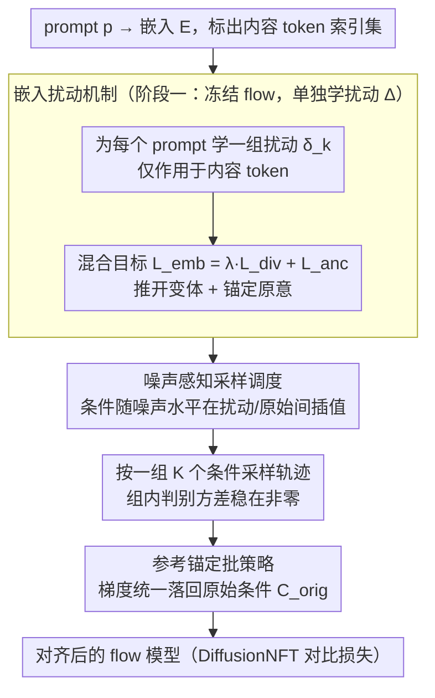

# E²PO: Embedding-perturbed Exploration Preference Optimization for Flow Models

**会议**: ICML 2026  
**arXiv**: [2605.15803](https://arxiv.org/abs/2605.15803)  
**代码**: 待确认  
**领域**: 图像生成 / Flow Matching / RL 对齐  
**关键词**: GRPO、Flow Matching、文本嵌入扰动、Reward Hacking、组内方差

## 一句话总结
针对 GRPO/DiffusionNFT 等基于组的 RL 在 flow 模型对齐中组内方差崩塌、信号消失的问题，E²PO 在文本嵌入空间注入一组可学习的结构化扰动以维持组内判别方差，并配合噪声感知调度与参考锚定批策略，在 SD3.5-M 上把 GenEval 从 0.917 抬到 0.932 且显著提升多样性。

## 研究背景与动机

**领域现状**：将 RLHF 风格的 GRPO 范式搬到 flow / diffusion 模型，通过把确定性 ODE 改写为 SDE 在采样过程里探索 reward 高分轨迹，是当前文本到图像模型对齐人类偏好的主流路线；DiffusionNFT 进一步把这一过程拉回 forward process，用对比目标直接优化速度场。

**现有痛点**：这一类方法极度依赖"组内相对优势"信号——奖励先在组内做标准化再回传梯度。然而训练过程中策略会自然向高 reward 模式收敛，组内样本越来越像，组内方差 $\sigma_R$ 迅速衰减到接近 0；论文用 GenEval/PickScore 监控发现 baseline 的 std 几乎在训练前期就跌穿基线。

**核心矛盾**：信号源（intra-group variance）和优化目标（让组内样本一致地向高分模式靠拢）天生互斥——优化越成功，方差越小，梯度越无意义。常见对策只有两条路：放大 latent 组 size $G$ 或换不同初始噪声；前者把 $G$ 从 4 拉到 48 仍挡不住衰减且算力线性飙升，后者容易触发 reward hacking（学到高分但视觉不连贯的伪影）。

**本文目标**：构造一种不依赖 latent 噪声扩张、又能持续维持"语义上有意义的"组内差异的探索机制，既要避免信号消失，又要把策略推离狭窄局部最优。

**切入角度**：作者观察到文本嵌入空间是一个低维、结构化的语义流形，沿这个流形微调比在高维噪声里硬撒采样能更高效地诱发有意义的语义变化；前期 prompt engineering / textual inversion 工作已经证明嵌入空间的微小偏移会显著改变生成轨迹。

**核心 idea**：把"组内多样性"的来源从噪声先验切换到文本嵌入扰动——为每个 prompt 学一组结构化扰动 $\bm{\delta}_k$ 注入到 content token 上，强制策略在每一步都看到一组语义上明确不同但仍贴近原意的条件，借此把判别方差稳稳钉在一个非零水平。

## 方法详解

### 整体框架
给定 prompt $p$，先把它 tokenize 成嵌入 $\mathbf{E} \in \mathbb{R}^{S\times d}$，定义只覆盖"实质内容 token"的索引集 $\mathcal{I}$（剔除 [SOS]/[EOS]/padding，有效长度 $L$）。E²PO 的训练分两阶段：阶段一冻结整个 flow 模型，单独学一组扰动 $\Delta=\{\bm{\delta}_k\}_{k=1}^{K}$；阶段二冻结这些扰动，把它们和原 prompt 一起送进 RL 对齐循环（基于 DiffusionNFT 的对比目标）。采样时一个 batch 由 1 个原始条件 $\mathbf{C}^{\text{orig}}$ 加 $K-1$ 个扰动条件 $\mathbf{C}_k(t)$ 组成，按 noise-aware 时刻调度切换；策略更新只在 $\mathbf{C}^{\text{orig}}$ 上计算梯度，把"用什么探索"和"按什么更新"显式解耦。

### 关键设计

**1. 嵌入扰动机制：把组内方差的来源从噪声换成语义**

针对的痛点是组内样本越训越像、判别方差 $\sigma_R$ 衰减到 0。E²PO 不在高维噪声里硬撒采样，而是为每个 prompt 学一组结构化扰动 $\bm{\delta}_k \in \mathbb{R}^{L\times d}$，仅作用于内容 token 位置 $t=\mathcal{I}_j$，得到 $\tilde{\mathbf{E}}_{k,t} = \mathbf{E}_t + \bm{\delta}_{k,j}$，再经冻结的文本编码器 $f_\phi$ 得到全局嵌入 $e_k$。

关键在于扰动既要互相分开、又不能飘出原意，这靠一个混合目标 $\mathcal{L}_{\text{emb}} = \lambda_{div}\mathcal{L}_{\text{div}} + \mathcal{L}_{\text{anc}}$ 来约束：$\mathcal{L}_{\text{div}}$ 最小化 $K$ 个变体间的平均余弦相似度，把它们在嵌入球面上推开；$\mathcal{L}_{\text{anc}} = \sum_k |\cos(e_k, e_{\text{anc}}) - \mu|_\epsilon$ 用 $\epsilon$-不敏感损失把每个变体与原 prompt 的相似度锚定在 $\mu$ 附近。单靠 diversity 项会发散到语义无关区域触发 reward hacking，单靠 anchor 项又会退化成同一个点失去方差；两项相加再叠加"只扰内容 token"，等于在原 prompt 语义邻域里画一个"近但不重合"的环，把探索严格限制在不同的语义方向上，既稳住了判别信号又不偏离 intent。

**2. 噪声感知采样调度：让扰动只在该出现的时刻出现**

如果扰动条件全程生效，低噪声的细节阶段会被语义漂移污染，画出伪影。E²PO 把第 $k$ 个变体的实时条件写成随时间插值 $\mathbf{C}_k(t) = \gamma(\sigma_t)\mathbf{C}^{\text{opt}}_k + (1-\gamma(\sigma_t))\mathbf{C}^{\text{orig}}$，权重 $\gamma(\sigma_t) = \text{clip}((\sigma_t - (1-\rho))/\rho, 0, 1)$ 随归一化噪声水平 $\sigma_t$（从 1 衰减到 0）单调下降，超参 $\rho \in (0,1]$ 控制扰动覆盖的高噪声区间长度。

这一调度顺应了扩散模型"粗结构早期定型、细节后期补足"的特性：早期高噪声阶段让扰动主导，把不同变体的轨迹分流到不同的结构布局；后期低噪声阶段切回原始 anchor，保证细节保真度。消融（Fig. 6）证实，若静态地一直用 $\mathbf{C}^{\text{opt}}_k$ 不做衰减，就会出现语义漂移和伪影。

**3. 参考锚定批策略：探索条件与更新条件显式解耦**

最后一个隐患是策略可能被扰动条件本身带偏——学成"在扰动 prompt 下表现好"而非"在真实 prompt 下表现好"。E²PO 的做法是采样时用一整组条件 $\mathcal{C}_{\text{batch}} = \{\mathbf{C}^{\text{orig}}\} \cup \{\mathbf{C}_k(t)\}_{k=1}^{K-1}$ 生成轨迹，但代入 DiffusionNFT 的对比损失（Eq. 4/7）算梯度时，强制所有条件都落回未扰动的 $\mathbf{C}^{\text{orig}}$。

这样一来，reward 评估覆盖的是一片由扰动撑开的语义空间，而真正被推动的只有原 prompt 的条件分布。换句话说，组内方差只服务于 reward 估计，模型本体始终单峰地向原 prompt 对应的高分模式收敛——这正是"谁采样就在谁上更新"会破坏的性质。

### 损失函数 / 训练策略
阶段一：用 $\mathcal{L}_{\text{emb}}$ 单独学 $\Delta$，$\bm{\delta}_k \sim \mathcal{N}(0, \sigma_{\text{init}}^2 \mathbf{I})$ 初始化；阶段二：套用 DiffusionNFT 的自归一化 $\bm{x}_0$-回归损失，把奖励 $r(\bm{x}_0, \bm{c}) \in [0,1]$ 拆成正/负策略 $v_\theta^{\pm} = (1\mp\beta)v^{\text{old}} \pm \beta v_\theta$ 的加权回归项。Backbone 用 SD3.5-Medium，8×H20，三种典型配置：High-Exploration $(G=4,K=12)$、Efficient $(G=2,K=4)$、Human Preference $(G=8,K=3)$。

## 实验关键数据

### 主实验

GenEval 奖励训练后在 in-domain reward 与多样性指标上的对比（SD3.5-M 为零样本基线，IDS 越低越好，其余越高越好）：

| 方法 | $G$/$K$ | GenEval ↑ | IDS ↓ | ASC ↑ | SDI ↑ | PVS ↑ |
|------|---------|-----------|-------|-------|-------|-------|
| SD3.5-M | — | 0.263 | 0.044 | 0.143 | 0.458 | 0.392 |
| Flow-GRPO | 24/— | 0.776 | 0.064 | 0.123 | 0.422 | 0.318 |
| DiffusionNFT | 24/— | 0.922 | 0.054 | 0.118 | 0.418 | 0.259 |
| DiffusionNFT | 48/— | 0.917 | 0.051 | 0.109 | 0.463 | 0.196 |
| **E²PO (Ours)** | 4/12 | **0.932** | **0.048** | **0.127** | **0.467** | **0.322** |

PickScore 奖励（K=3）下泛化到未见 reward 的能力：

| 方法 | $G$ | PickScore ↑ | Aesthetic ↑ | ImgRwd ↑ | HPSv2.1 ↑ | IDS ↓ |
|------|------|-------------|-------------|----------|-----------|-------|
| SD3.5-M | — | 19.93 | 5.600 | -0.50 | 0.203 | 0.044 |
| Flow-GRPO | 24 | 22.72 | 6.273 | 1.30 | 0.324 | 0.222 |
| DiffusionNFT | 24 | 23.34 | 6.514 | 1.27 | 0.324 | 0.239 |
| **E²PO (Ours)** | 8 | **23.38** | **6.538** | **1.29** | **0.325** | **0.167** |

### 消融实验

| 配置 | 关键现象 | 说明 |
|------|---------|------|
| 完整 E²PO ($G=4,K=12$) | GenEval 0.932 | 噪声+语义双源探索最稳 |
| $G=1$ 极端（只靠 $K$） | 全任务掉点明显 | 单一噪声先验不足以撑起探索 |
| $K=1$ 极端（退化为 NFT） | 与高 $G$ NFT 同档 | 失去判别方差稳定器 |
| 静态 $\mathbf{C}^{\text{opt}}_k$（去掉 noise-aware 调度） | 出现语义漂移与伪影 | 低噪声阶段被语义扰动污染 |
| 去掉 $\mathbf{C}^{\text{orig}}$ 锚（无参考批） | 收敛更慢、渐近表现更差 | 缺少 anchor 后扰动会带偏策略 |

### 关键发现
- 组内方差监控（Fig. 2）显示 baseline 的 reward std 在前 150 步就跌进 log 尺度的"地板"，E²PO 在整段训练里维持基本稳定的方差水平——这是 GenEval/PickScore 上能继续涨点的直接原因。
- 固定算力预算 $N=G\times K$ 下，"全压 $G$" 或 "全压 $K$" 都不是最优，平衡分配（$G=4,K=12$）效果最好，说明噪声多样性和语义多样性互补而非替代。
- E²PO 在 IDS（图像间相似度）上几乎对齐零样本基线（0.048 vs 0.044），同时 GenEval 反而最高，说明它在拉高 reward 的同时几乎没有牺牲生成多样性，定性图（Fig. 4）也显示其在计数、属性绑定、文字渲染等容易 reward hacking 的任务上明显优于 baseline。

## 亮点与洞察
- 把"维持探索"的来源从噪声空间挪到嵌入空间，是这篇文章最巧妙的认知翻转——一个高维各向同性噪声先验在生成模型已经收敛后几乎无能为力，而低维语义流形上的一小步往往就能切到完全不同的生成模式。
- 用 $\mathcal{L}_{\text{div}} + \mathcal{L}_{\text{anc}}$ 显式约束扰动相对原 prompt 的余弦相似度，等价于在嵌入球面上画一个"近但不重合"的环，工程上简单但理论上很干净，比硬塞 KL 罚项更可控。
- "采样用扰动 + 更新用 anchor" 的解耦思想可以迁移到任何 reward 估计需要多样性但策略本体应保持单峰的 RL 场景，例如 LLM 的 RLHF 也可以考虑对 prompt 嵌入做同样的扰动而保持参数更新条件不变。

## 局限与展望
- 扰动是 per-prompt 学的，意味着对未见 prompt 在线 RL 时需要先做一轮 $\Delta$ 优化，对推理-time 应用并不友好；如果能学一个 prompt → $\Delta$ 的 amortized 生成器会更实用。
- 评估完全限定在 SD3.5-Medium，对更大的 SD3.5-Large/FLUX 这类模型的迁移性、以及非 RL/NFT 的策略梯度框架是否同样受益，文章没有给出。
- $K$ 与 $G$ 的最优搭配显然与 backbone 与 reward 类型有关，论文只给了一组经验值；缺乏从 reward landscape 性质出发预测最优 $(G,K)$ 的理论分析。

## 相关工作与启发
- **vs Flow-GRPO / DiffusionNFT**：同样基于组的 RL 对齐，但只在 latent 噪声层面探索；E²PO 指出这条路径在 variance collapse 上没有解，转去 embedding 层引入结构化多样性。
- **vs Textual Inversion / DreamBooth**：这些方法学嵌入是为了"复现某个静态概念"；E²PO 把学嵌入当作"在线 RL 训练的动态探索机制"，把 prompt tuning 从 pre-processing 拉进 RL 内循环。
- **vs Initial Noise Diversification (Xue et al. 2025)**：靠不同初始噪声扩散，但 Xue 自己就指出这会让模型"刷分"画出视觉不连贯的图；E²PO 的语义锚定项天然约束探索不漂出 prompt 含义之外。

## 评分
- 新颖性: ⭐⭐⭐⭐ 把 GRPO 的方差问题归因到信号源选择上，并给出嵌入扰动这一干净的替代路径，角度清新但属于增量改进。
- 实验充分度: ⭐⭐⭐⭐ GenEval/PickScore 双 reward 都做了主表与多样性，配三组消融；缺更大 backbone 与跨架构验证。
- 写作质量: ⭐⭐⭐⭐ 动机 → 现象 → 公式 → 消融的链条清晰，Fig. 2 的方差监控很有说服力。
- 价值: ⭐⭐⭐⭐ 给 flow/diffusion RL 对齐提供了一个即插即用的稳定器，工程实现成本不高，预期会被后续 RL 对齐工作快速吸收。

<!-- RELATED:START -->

## 相关论文

- [\[ICML 2026\] Offline Preference Optimization for Rectified Flow with Noise-Tracked Pairs](offline_preference_optimization_for_rectified_flow_with_noise-tracked_pairs.md)
- [\[ICML 2026\] Principled RL for Flow Matching Emerges from the Chunk-level Policy Optimization](principled_rl_for_flow_matching_emerges_from_the_chunk-level_policy_optimization.md)
- [\[CVPR 2026\] Neighbor GRPO: Contrastive ODE Policy Optimization Aligns Flow Models](../../CVPR2026/image_generation/neighbor_grpo_contrastive_ode_policy_optimization_aligns_flow_models.md)
- [\[ICML 2026\] Adversarial Flow Models](adversarial_flow_models.md)
- [\[AAAI 2026\] Rethinking Direct Preference Optimization in Diffusion Models](../../AAAI2026/image_generation/rethinking_direct_preference_optimization_in_diffusion_models.md)

<!-- RELATED:END -->
