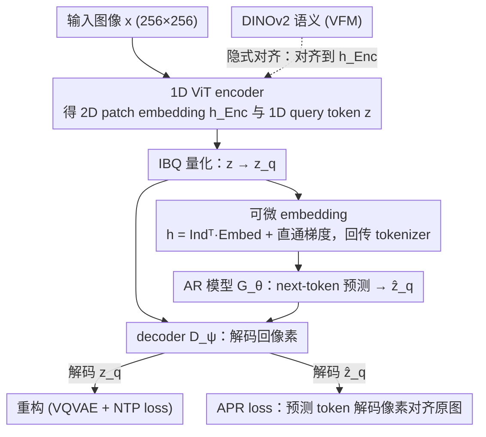

# End-to-End Autoregressive Image Generation with 1D Semantic Tokenizer

**会议**: ICML 2026 Spotlight  
**arXiv**: [2605.00503](https://arxiv.org/abs/2605.00503)  
**代码**: 无  
**领域**: 图像生成 / 自回归视觉 Tokenizer / 表示对齐  
**关键词**: 1D Tokenizer, 自回归图像生成, APR loss, VFM 隐式对齐, ImageNet FID

## 一句话总结
EOSTok 用单阶段端到端管线把 1D ViT tokenizer 和自回归模型一起训练，靠新提出的 APR（Autoregressive Prediction Reconstruction）loss 把「next-token 预测」的梯度真正传回 pixel space 防止码本崩塌，再用「隐式对齐」把 DINOv2 语义注入 1D 隐空间而不破坏 1D 自回归结构，最终在 ImageNet 256 上无 guidance 拿到 1.48 的 FID（SOTA）。

## 研究背景与动机

**领域现状**：自回归图像生成（VQGAN、LLaMaGen、MAR、VAR 等）希望复刻 LLM 的成功，但绝大多数沿用 2D grid tokenizer：把 256×256 图压成 16×16 patch token，按 raster-scan 顺序解码。最近 TiTok / FlexTok / Semanticist 等用 learnable query 把图压成 1D 序列，主要追求高压缩率（如 32 token）。

**现有痛点**：(1) 2D grid token 之间天然有双向依赖（一个 patch 同时被上下左右 patch 解释），与 raster-scan 单向因式分解相冲突，AR 建模总有「方向错位」。(2) 现有 1D tokenizer 为了高压缩牺牲重构质量，且训练分两阶段——tokenizer 先单独做 reconstruction，再冻结让 AR 模型学，AR 端的梯度根本传不回 tokenizer。(3) 把 VFM 表示直接对齐到 1D 隐空间会让它退化成 raster-ordered patch 序列，反而把 2D 先验偷渡回来。

**核心矛盾**：「重构质量 vs 自回归友好性」「2D 语义先验 vs 1D 序列结构」「next-token 损失 vs 像素生成质量」三对矛盾相互纠缠，单阶段联合训练又会被 NTP loss 钻空子——tokenizer 学着只用极少几个 token 就能让 NTP 损失变小（hacking），码本利用率从 99.8% 崩到 51.8%。

**本文目标**：(1) 设计 1D tokenizer 而不强求极致压缩；(2) 让 tokenizer 直接接收来自像素空间的生成梯度；(3) 把 VFM 语义注入 1D 路径但不破坏 1D 结构。

**切入角度**：作者发现 2D 限制的本质是「token 排列与因果分解的方向冲突」。一旦剥掉 2D 先验，1D tokenizer 反而可以原生支持 vanilla AR 建模——不需要 random masking、不需要 next-scale prediction。

**核心 idea**：用 APR loss 把 AR 预测的 token 解码回像素与 ground truth 对齐，构成端到端生成监督；同时用「隐式对齐」把 VFM 表示对齐到 encoder 的 2D 隐藏 patch embedding 而不是 1D 隐空间，让 1D latent 间接吸收语义。

## 方法详解

### 整体框架
EOSTok 要解决的是「1D tokenizer 和自回归模型分两阶段训练、AR 的梯度传不回 tokenizer」这个老问题，把它改成单阶段端到端联合训练。一张 256×256 图像 $x$ 先经 ViT encoder 得到 2D patch embedding $h_\text{Enc}$ 和一串用 $L$ 个 learnable query 抽出的 1D 隐 token $z$，只把 $z$ 送进 IBQ 量化得到 $z_q$；AR 模型 $\mathcal{G}_\theta$ 在 $z_q$ 上做 next-token prediction，decoder $\mathcal{D}_\psi$ 既解码 $z_q$ 又解码 AR 预测出的 $\hat z_q$ 回到像素。整套目标是 $\mathcal{L}_\text{VQVAE} + \lambda_\text{NTP}\mathcal{L}_\text{NTP} + \lambda_\text{APR}\mathcal{L}_\text{APR} + \lambda_\text{align}\mathcal{L}_\text{align}$，三项新增设计分别负责打通梯度、防止码本崩塌、注入语义。

### 关键设计

**1. 可微 embedding：让 NTP 梯度真正回传到 tokenizer**

端到端联合训练能不能成立，先卡在一个工程细节上：常规 LLM 的 embedding 是离散索引 look-up，对 tokenizer 完全不可微，于是 NTP loss 只能更新 AR 模型，tokenizer 永远学不到「哪种 token 序列更容易被自回归预测」。EOSTok 把 AR 的输入从索引查表改成对 IBQ 输出的概率矩阵 $\text{Ind} \in \mathbb{R}^{L \times K}$ 做加权和：$h = \text{Ind}^\top \text{Embed}$。再配合 IBQ 量化器自带的 straight-through 技巧 $\text{Ind} = \text{onehot}(\arg\max p) + [p - \text{stopgrad}(p)]$，梯度就能连续地从 AR loss 一路流回 encoder 和码本，端到端的链路这才闭合。

**2. APR loss：把 AR 生成梯度送回像素空间**

光打通梯度还不够——直接在端到端里加 NTP 监督会被 loss 钻空子：vanilla E2E 下 NTP 把 AR 准确率从 11.8% 虚拉到 30.2%，但因为它只盯着离散 token 空间、不看最终像素，tokenizer 学会了只用极少几个 token 就能压低 NTP，码本利用率从 99.8% 崩到 51.8%、gFID 飙到 8.01。APR（Autoregressive Prediction Reconstruction）loss 把约束从「token 对得上」改成「解码后的像素对得上」：teacher forcing 下让 AR 一步预测出 $\hat z_q = \mathcal{G}_\theta(z_q)$，直接送进 decoder 解码回像素再与原图对齐，$\mathcal{L}_\text{APR}(\phi, \psi, \theta) = \|x - \mathcal{D}_\psi(\mathcal{G}_\theta(z_q))\|_2^2$（再叠一项 LPIPS）。工程上把 $\hat z_q$ 和 $z_q$ 沿 batch 维拼接共过 decoder，一次前向就同时拿到重构 loss 和 APR loss。约束维度一旦对齐真正的生成目标，码本利用率立刻恢复到 99.7%，gFID 反而降到 3.32。

**3. 隐式对齐：把 VFM 语义注入 1D encoder 而不破坏 1D 结构**

想让 1D tokenizer 带上 DINOv2 这类 VFM 的语义，最直觉的做法是把 1D 隐 $z$ 直接对齐到 VFM 特征 $f(x)$（Direct alignment），但这会把 2D 空间先验偷渡进来，$z$ 退化成 raster-ordered 序列，AR 生成的好处归零、gFID 从 12.27 涨到 5.98 甚至不收敛；用 VFM 直接替换原始 patch embedding（Direct substitution）也只是中庸。作者改用隐式对齐：不动 1D latent，而是把 VFM 对齐到 encoder 中间的 2D 隐藏 patch embedding，$\mathcal{L}_\text{implicit} = -\frac{1}{N}\sum_n \text{sim}(h_\omega(h_\text{Enc}^{[n]}), y^{[n]})$，让 1D latent $z$ 通过 cross-attention 间接吸收语义、自己却不被强制保留 2D 顺序。这样既拿到 VFM 的语义又保住 1D 的自由排列，gFID 从 12.27 降到 3.32，AR 准确率从 7.8% 提到 11.9%。

### 损失函数 / 训练策略
总目标 $\mathcal{L}_\text{E2E} = \mathcal{L}_\text{VQVAE} + \lambda_\text{NTP}\mathcal{L}_\text{NTP} + \lambda_\text{APR}\mathcal{L}_\text{APR} + \lambda_\text{align}\mathcal{L}_\text{align}$，其中 $\mathcal{L}_\text{recon}$ 是 L1/L2 + LPIPS + GAN，$\mathcal{L}_\text{reg}$ 含 commitment + entropy。decoder 端额外做一项 REPA 风格对齐——把 mask token 第 $k$ 层的隐藏特征对齐到 VFM，加速 1D decoder 收敛（论文把 1D decoder 视作「条件生成」而非单纯「重构」）。

## 实验关键数据

### 主实验

| 模型 | Tokenizer | #Tokens | rFID ↓ | gFID (无 guidance) ↓ | gFID (有 guidance) ↓ |
|------|-----------|---------|--------|---------|---------|
| LDM-4 | SD-VAE (2D) | 64×64 | 0.27 | 10.56 | 3.60 |
| DiT-XL/2 | SD-VAE | 32×32 | 0.62 | 9.62 | 2.27 |
| MAR-L | SD-VAE | 16×16 | 0.87 | 2.60 | 1.78 |
| Lightning-DiT | VA-VAE | 32×32 | 0.28 | 2.17 | 1.35 |
| **EOSTok-H** | **1D + VFM 隐式对齐** | 256 query | — | **1.48** | — |

### 消融实验

| 配置 | rFID ↓ | gFID ↓ | AR Acc. ↑ | 码本利用 |
|------|--------|--------|-----------|----------|
| 两阶段基线 | 1.09 | 3.82 | 11.8% | 99.8% |
| Vanilla E2E（只加 NTP） | 4.92 | 8.01 | 30.2% | 51.8% |
| **+ APR loss** | 1.02 | 3.32 | 11.9% | 99.7% |
| + Decoder VFM 对齐 | 1.12 | 5.68 | 8.2% | — |
| + Encoder Direct alignment | 0.98 | 5.98 | 8.5% | — |
| + Direct substitution | 1.05 | 4.89 | 12.1% | — |
| **+ Implicit alignment（本文）** | 1.02 | 3.32 | 11.9% | — |

### 关键发现
- **Vanilla E2E 是反面教材**：单加 NTP 监督会让 AR 准确率虚高（30.2%）但实际生成质量崩盘（gFID 8.01），码本急剧塌缩——这是「在错维度上对齐」的典型例子，作者用 PCA 把码本投到 3D 球上可视化了这种坍塌。
- **APR loss 是关键修补**：单加一项像素级损失就把码本利用率从 51.8% 拉回 99.7%，rFID/gFID 全面恢复，是「直接监督真正关心的量」的胜利。
- **2D 空间先验是 1D AR 的毒药**：Direct alignment 把 VFM 强行对齐到 1D 隐空间反而让 gFID 从 12.27 涨到 5.98 还不收敛——证明 1D 路线不能私自混入 2D 顺序假设。
- **scaling 友好**：EOSTok-S/L/H 三档模型上 gFID 单调下降，码本从 4096 到 16384 也持续提升；更大模型缩小不同码本配置间的差距。

## 亮点与洞察
- **「联合训练 + 端到端监督」的范式价值**：本文证明只要把监督信号送到真正的生成目标（像素 MSE）而非中间代理（NTP），单阶段训练就能既保住重构又改善生成。这是给所有「冻结编码器再训生成器」范式的一个拷问。
- **VFM 注入方式的微妙性**：「对齐到 latent 还是对齐到中间 hidden」「直接替换 vs 隐式蒸馏」这种看似细节的选择决定了 1D AR 是否走得通——它给了一个反例：不是「加 VFM 就一定好」，对齐位置不对甚至更差。
- **可微 codebook embedding trick**：用 `Ind^T Embed` 替代 look-up 是一个看似工程实则关键的改动，让端到端联合训练的链路真正闭合，可以迁移到任何 VQ + 下游模型的联合优化场景。

## 局限与展望
- 论文只在 ImageNet-256 类条件生成上验证；text-to-image、视频等更复杂场景能否复刻 SOTA 还需后续工作。
- 1D token 数固定为 256，与 2D 序列长度对齐方便对比但并未探索自适应 token 数；FlexTok 那种 nested dropout 思路尚未集成。
- APR loss 需要 AR 模型每步前向都解码到像素，训练成本明显高于两阶段；论文未给出 wall-clock 对比。
- 量化器固定用 IBQ；其他码本设计（如 FSQ、LFQ）在该端到端框架下的行为未知。

## 相关工作与启发
- **vs TiTok / FlexTok / Semanticist**：他们做 1D tokenizer 但仍走两阶段训练；EOSTok 是首个把 1D + AR 真正端到端打通的方案。
- **vs VAR / MAR**：VAR 用 next-scale prediction 绕开 2D 方向问题，MAR 用 random mask；EOSTok 主张「丢掉 2D 先验后 vanilla AR 就够用」，路线更接近 LLM 的简洁性。
- **vs VA-VAE / REPA / RAE**：他们把 VFM 对齐用于扩散模型；EOSTok 系统比较了 3 种注入方式，给出了「1D 路线必须用隐式对齐」的明确结论。
- **vs LLaMaGen / RQ-VAE**：传统 2D AR 在无 guidance 下 gFID 8-15 起步；EOSTok-H 把 1D AR 推到 1.48，几乎追平最佳扩散模型的 1.35（VA-VAE）。

## 评分
- 新颖性: ⭐⭐⭐⭐ 端到端 1D+AR 联合训练 + APR loss + 隐式对齐三连，每一项都不算颠覆但组合起来打出了 SOTA。
- 实验充分度: ⭐⭐⭐⭐⭐ 联合训练、注入方式、scaling、码本大小、收敛曲线五个维度都有消融。
- 写作质量: ⭐⭐⭐⭐ 把每个失败案例（NTP hacking、Direct alignment 退化）讲清楚，让人能学到「为什么」。
- 价值: ⭐⭐⭐⭐⭐ 给 AR 视觉生成路线注入新血液，可能改变社区对 1D tokenizer「只能高压缩」的固有印象。

<!-- RELATED:START -->

## 相关论文

- [\[ICML 2026\] CLEAR: Context-Aware Learning with End-to-End Mask-Free Inference for Adaptive Video Subtitle Removal](clear_context-aware_learning_with_end-to-end_mask-free_inference_for_adaptive_vi.md)
- [\[CVPR 2026\] DeCo: Frequency-Decoupled Pixel Diffusion for End-to-End Image Generation](../../CVPR2026/image_generation/deco_frequency-decoupled_pixel_diffusion_for_end-to-end_image_generation.md)
- [\[CVPR 2026\] SpeeDiff: Scalable Pixel-Anchored End-to-End Latent Diffusion Model](../../CVPR2026/image_generation/speediff_scalable_pixel-anchored_end-to-end_latent_diffusion_model.md)
- [\[ICCV 2025\] End-to-End Multi-Modal Diffusion Mamba](../../ICCV2025/image_generation/end-to-end_multi-modal_diffusion_mamba.md)
- [\[NeurIPS 2025\] LinEAS: End-to-end Learning of Activation Steering with a Distributional Loss](../../NeurIPS2025/image_generation/lineas_end-to-end_learning_of_activation_steering_with_a_distributional_loss.md)

<!-- RELATED:END -->
