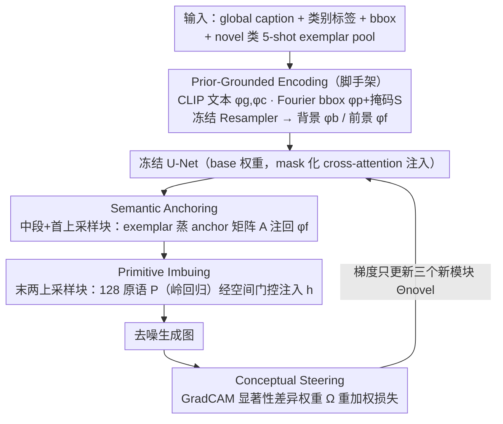

# Envisioning Beyond the Few: Disentangled Semantics and Primitives for Few-Shot Atypical Layout-to-Image Generation

**会议**: ICML 2026  
**arXiv**: [2605.31266](https://arxiv.org/abs/2605.31266)  
**代码**: https://github.com/iCVTEAM/DSP  
**领域**: 扩散模型 / 图像生成 / 少样本学习  
**关键词**: layout-to-image、few-shot 适应、表示解耦、视觉原语、扩散模型

## 一句话总结
针对 5-shot 非典型域（航拍 / 水下 / 极暗）下 layout-to-image 生成出现的"表示碎片化"，作者把每个类别的条件表示显式拆成全局语义锚 + 局部可重组原语，并用显著性感知的损失强制前景一致，在 DIOR 上将 Bootstrap FID 从 82.5 压到 74.3、mAP 提到 26.1。

## 研究背景与动机

**领域现状**：Layout-to-image (L2I) 用类别 + bbox 控制扩散模型生成复杂场景，主流做法（MIGC、CC-Diff 等）基于 Stable Diffusion，依赖 COCO 级规模的成对数据训练实例条件注入。

**现有痛点**：当目标是航拍、水下、低照度等非典型域时，标注稀缺、典型只有 5-shot 可用；直接把 L2I 模型在这种 few-shot 下微调，会出现**表示碎片化**——生成的烟囱被切开、海龟的壳裂成几片，纹理和几何同时崩。这不是简单"过拟合"，而是模型根本没形成连贯表示。

**核心矛盾**：作者把根因归为**粒度错配**——高层语义身份（一只海龟）应该在所有实例间稳定，低层视觉细节（壳上花纹、光照）天然局部且高度变化；但现有 L2I 的条件路径把两者塞进同一组 cross-attention embedding，少样本下高方差的局部细节就会冲淡稳定的全局语义，导致两边都崩。同时 base 集和 novel 集的前景类是 disjoint 的，背景统计却基本共享，损失会偷偷优先去拟合背景。

**本文目标**：在不动 base 扩散模型参数的前提下，为 novel 类别 (i) 稳住分类身份；(ii) 在样本极少时仍能恢复细粒度局部细节；(iii) 防止优化跑去拟合背景而走捷径。

**切入角度**：与其在参数空间（LoRA、DreamBooth 风格）抢容量，不如在**表示空间**做粒度解耦——让一支条件路径只管"是什么类"，另一支只管"长什么样"，再用一个空间损失强制模型真的去用前景上的语义信号。

**核心 idea**：把 L2I 的条件表示显式拆成全局 *Semantic Anchors*（管身份）+ 局部 *Visual Primitives*（管细节），再用 GradCAM 驱动的显著性损失 *Conceptual Steering* 把梯度拽到前景区域。

## 方法详解

### 整体框架
方法要解决的是 5-shot 非典型域下 layout-to-image 的"表示碎片化"，思路是把条件表示按粒度拆开：一支只管"是什么类"、一支只管"长什么样"，再用一个空间损失逼模型真的去用前景信号。整套框架建在 SD v1.5 上，分两阶段——base 阶段在大数据集上以标准 cross-attention 学好通用 L2I 能力得到 $\Theta_{\text{base}}$；novel 阶段把 base 权重完全冻结，只更新三个新增模块的参数 $\Theta_{\text{novel}}$。

novel 阶段的输入条件先经过 *Prior-Grounded Encoding*：global caption 与类别标签经冻结 CLIP 文本编码得到 $\phi_g, \phi_c$；bbox 经 Fourier 编码得到 $\phi_p$ 和 sigmoid 空间掩码 $\mathbf{S}$；视觉特征由一个在 base 上预训练并冻结的 Resampler 给出背景 $\phi_b$ 和前景 $\phi_f$，其中 $\phi_f$ 的源从 base 切到从 novel 各类 5-shot 裁出的 *exemplar pool* $\Delta$。这五组 embedding 通过 mask 化 cross-attention 注入 U-Net 的中段与上采样段，三个新模块分别在不同位置接管：Semantic Anchoring 改写中段与第一上采样块的 $\phi_f$，Primitive Imbuing 改写最后两个上采样块的空间特征 $\mathbf{h}$，Conceptual Steering 改写损失 $\mathcal{L}$。

### 关键设计

**1. Semantic Anchoring：稳住 novel 类的视觉身份**

痛点是冻结的 Resampler 只见过 base 类、对完全不相交的 novel 类只能给粗粒度特征，缺少细分类语义，5-shot 下逐样本拟合还会语义漂移。做法是从 5 张 exemplar 里蒸出一个跨样本共识的 anchor 矩阵 $\mathbf{A}\in\mathbb{R}^{n\times d}$ 注回前景 embedding：对类 $c$ 取其 exemplar 子集 $\delta_c$，用冻结 DINOv2 抽 dense 特征 $\phi_{(\Delta,c)}\in\mathbb{R}^{n\times h\times w\times d}$，再用 $r$ 个可学 token 经冻结 Resampler 做 cross-attention 压成 $\phi_r\in\mathbb{R}^{n\times r\times d}$，做 intra-exemplar self-attention 后沿 token 维平均得到 $\mathbf{A}$。注入走门控 cross-attention $\tilde{\phi}_f=\phi_f+\eta\cdot\text{softmax}((\phi_f\mathbf{W}_Q')(\mathbf{A}\mathbf{W}_K')^\top/\sqrt{d}+\mathcal{M})(\mathbf{A}\mathbf{W}_V')$，门控 $\eta$ 初始化为 0 以保留 base 先验、mask $\mathcal{M}$ 屏蔽 padding。用"共识"而非"逐样本拟合"正是为了在样本极少时不被单张噪声带偏，把身份稳住。

**2. Primitive Imbuing：在新布局下重组局部细节**

少样本下恢复细粒度纹理是个 ill-posed 问题，直接学一张完整外观图既不稳又难迁到新 bbox。这里改用一组 $s=128$ 个可学原语 $\mathbf{P}\in\mathbb{R}^{s\times d}$ 显式建模可重组的局部细节，注入到 U-Net 上采样后期。原语的求解被设计成离线交替最小化：把 $\delta_c$ 的 DINOv2 特征 flatten 成 $\mathbf{T}\in\mathbb{R}^{nhw\times d}$、$\mathbf{P}$ 用 K-Means 初始化，以 $\mathbf{T}\approx\mathbf{W}\mathbf{P}$ 为目标，固定 $\mathbf{P}$ 时系数取 Tikhonov 闭式解 $\hat{\mathbf{W}}=\mathbf{T}\mathbf{P}^\top(\mathbf{P}\mathbf{P}^\top+\lambda\mathbf{I})^{-1}$（$\lambda=0.1$），固定 $\mathbf{W}$ 时最小化 Frobenius 重建误差更新 $\mathbf{P}$，跑 $N_{\text{iter}}=50$ 轮——岭回归闭式解比迭代 SGD 在 few-shot 下数值稳定得多。注入用空间门控 cross-attention $\tilde{\mathbf{h}}=\mathbf{h}+\gamma\cdot\mathcal{G}\odot\text{softmax}(\cdot)$，其中稀疏空间门 $\mathcal{G}=\mathbf{S}\odot\mathbf{1}_{\text{top}}(\mathbf{S})$ 用 sigmoid 掩码点乘 top-k 硬选择，把原语严格锁在前景显著区域，避免污染背景。可重组的原语库比单张外观图更能在新 bbox 下"拼装"出合理纹理。

**3. Conceptual Steering：把梯度拽到前景，堵掉拟合背景的捷径**

base 与 novel 的前景类完全不同、背景统计却基本共享，普通 MSE 会偷偷优先拟合背景拿低 loss，让前两个模块被旁路。对策是给标准 LDM 损失加一个由显著性差异决定的空间权重 $\boldsymbol{\Omega}$：用 text-driven GradCAM 在目标类 $c$ 上分别取 GT 图 $I$ 与一步预测 $\hat{I}$ 的激活图 $\mathbf{M}(I,c)$、$\mathbf{M}(\hat{I},c)$，定义 $\boldsymbol{\Omega}=\mathbf{1}+\min(|\mathbf{M}(I,c)-\mathbf{M}(\hat{I},c)|/\mu,\,1)$（$\mu=0.95$），作为 element-wise 权重得到 $\mathcal{L}_{\text{final}}=\mathbb{E}[\|\boldsymbol{\Omega}\odot(\epsilon_\Theta(x_t,t,\tau(y),\Delta)-\epsilon)\|_2^2]$。激活差异大、也就是前景"该亮没亮"的位置惩罚翻倍，等于把"语义有没有对齐"直接编码进损失权重，强制 anchor 和原语真的落到前景上。

### 损失函数 / 训练策略
最终训练目标即上式 $\mathcal{L}_{\text{final}}$。优化器 AdamW，基础 lr $1\times 10^{-4}$，对两个门控参数 $\eta,\gamma$ 加 $100\times$ 乘子（先保留预训练能力、再快速学新模块）；base 阶段 100 epoch、batch 320，novel 阶段固定 100 步、每步用全部 novel 样本梯度累积做全 batch 更新。原语的交替最小化作为前置离线流程单独跑一次，不参与 SGD。推理用 Euler Discrete Scheduler 50 步 + CFG=7.5。

## 实验关键数据

### 主实验
三个非典型域 5-shot 设置下与 MIGC、CC-Diff、CC-Diff++ 比，用预训练 Faster R-CNN 在生成图上跑检测当作 alignment 指标，FID 用 50 seed pool 的 Bootstrap FID（解决小样本下 FID 偏置）。

| 数据集 | 指标 | 之前 SOTA (CC-Diff++) | Ours | 提升 |
|--------|------|----------------------|------|------|
| DIOR (航拍) | FID↓ | 82.62 | **74.34** | -8.28 |
| DIOR | mAP↑ | 24.63 | **26.06** | +1.43 |
| DIOR | AP50↑ | 54.60 | **57.22** | +2.62 |
| RUOD (水下) | FID↓ | 46.46 | **45.44** | -1.02 |
| RUOD | mAP↑ | 18.37 | **19.45** | +1.08 |
| ExDark (极暗) | FID↓ | 93.09 | **91.36** | -1.73 |
| ExDark | mAP↑ | 35.34 | **35.93** | +0.59 |

DIOR 上换用更强的 YOLOv8 检测器复测，本文 mAP 20.80 vs CC-Diff++ 19.50、AP50 43.34 vs 41.20，结论不变。

### 消融实验（DIOR）
SA = Semantic Anchoring，PI = Primitive Imbuing，CS = Conceptual Steering。

| 配置 | FID↓ | mAP↑ | AP50↑ | 说明 |
|------|------|------|-------|------|
| 基线（无新模块） | 94.96 | 19.15 | 47.97 | 仅 Prior-Grounded Encoding |
| + SA | 88.57 | 22.84 | 52.05 | 单加语义锚：FID -6.4，mAP +3.7 |
| + PI | 87.34 | 21.09 | 51.12 | 单加原语：FID -7.6，但 mAP 增益不如 SA |
| SA + PI | 85.00 | 25.28 | 56.15 | 两者协同，mAP 跳到 25.3 |
| SA + PI + CS（Full） | **74.34** | **26.06** | **57.22** | 加 CS 单独把 FID 又压 10.7 点 |

变体消融里 *PI-SA Swapping*（把语义锚放到上采样后期、原语放到中段）mAP 暴跌到 11.89，AP50 30.77，验证"全局语义注早层、局部原语注后层"的层次绑定不能反。

### 关键发现
- 三个模块缺一不可，且贡献分工明确：SA 主要拉 mAP（语义对齐），PI 主要拉 FID（纹理保真），CS 既拉 FID 又额外稳定 mAP——和它"把梯度拉到前景"的设计动机完全一致。
- PI 与 SA 在注入层的位置不能互换，说明"高层语义—早期 / 局部细节—后期"是 U-Net 结构本身决定的硬性绑定，而非超参偏好。
- Bootstrap FID 比 vanilla FID 更适合 few-shot 评测（每类只 50 张生成图），作者把这点写成了独立 metric 贡献。

## 亮点与洞察
- "表示碎片化"这个失败模式命名得很精准——把"模型崩"从笼统的"过拟合"细化成"高频细节冲淡低频语义"，并用粒度错配做一句话归因，整个方法都是围着这一句话设计的。
- 用**岭回归闭式解 + K-Means 初始化**学原语是个干净的 trick：避开了 few-shot 下 SGD 不稳定的老问题，且 50 步迭代离线跑完即可，不进训练 loop。
- *Conceptual Steering* 把 GradCAM 当成损失的空间权重而不是事后可视化工具，是个可迁移到其它"前景小、背景大、base/novel 分布不对称"任务（医学小病灶、遥感小目标 few-shot 生成）的通用思路。
- 门控参数 $\eta,\gamma$ 初始化为 0 + 加 100× lr 乘子，等于"先保留预训练能力、再快速学新模块"，是 ControlNet/IP-Adapter 同款 trick 在 few-shot 上的复用。

## 局限与展望
- 评测只在 5-shot；1-shot / 10-shot 下 SA 的"跨样本共识"是否退化、原语数 $s=128$ 是否仍合适，论文未涉及。
- 三个域都还是"物体级"非典型（航拍小目标、水下浑浊、低照度），对真正异构的医学/工业缺陷 layout 是否泛化未知；前景显著性假设在这些域不一定成立。
- ExDark 上的 FID 改进只有 1.7 点，提升幅度明显小于 DIOR——暗示当前景在原图上信号本就极弱时，GradCAM 给出的 $\boldsymbol{\Omega}$ 可能本身就不准。
- 整套方法只针对 SD v1.5 的 U-Net cross-attention 结构；迁到 DiT / SD3 / Flux 这类纯 transformer 主干时，"早层注 SA、后层注 PI"的层次绑定需要重新定位。

## 相关工作与启发
- **vs MIGC / CC-Diff / CC-Diff++**：同样做实例级 L2I，但都假定大数据训练，在 5-shot 非典型域直接微调表现退化；本文不动 base 参数，只在条件表示侧加解耦模块，FID 在 DIOR 上比 CC-Diff++ 多压 8 点。
- **vs DreamBooth / DataDream**：同样做 few-shot 个性化，但它们是 *subject-driven*（一个 token 学一个实例），没有 bbox 级布局控制；本文显式把 layout 作为输入，并把"身份 vs 细节"解耦，比 token-level 嵌入更适合多实例场景。
- **vs IP-Adapter 类适配器方法**：都用门控 cross-attention 注入图像条件，但 IP-Adapter 是单一全局图像 embedding；本文把同一条 image-conditioning 通路拆成 anchor + primitive 两条粒度，对应"语义"和"细节"两件事。

## 评分
- 新颖性: ⭐⭐⭐⭐ 表示碎片化的命名 + 解耦框架结构清晰，但单看每个模块（DINOv2 抽特征、Resampler 蒸 anchor、原语字典、GradCAM 损失加权）都是组合既有 trick，组合方式是主要贡献。
- 实验充分度: ⭐⭐⭐⭐ 三个非典型域 + 两个检测器双重交叉、消融完整、有变体 swap 实验、还引入 Bootstrap FID 解决小样本评测偏置；缺 K-shot 扫描和更大模型迁移。
- 写作质量: ⭐⭐⭐⭐ Introduction 把"表示碎片化"逻辑链推得很清楚，方法节按"先稳身份、再补细节、最后防走捷径"组织，公式与算法表都齐全。
- 价值: ⭐⭐⭐⭐ 给"少样本 + 非典型域 L2I"这个具体应用提供了即用方案，代码开源；解耦思路和 GradCAM-as-loss 对其它 few-shot 生成任务有迁移价值。

<!-- RELATED:START -->

## 相关论文

- [\[CVPR 2026\] Beyond Patches: Global-aware Autoregressive Model for Multimodal Few-Shot Font Generation](../../CVPR2026/image_generation/beyond_patches_global-aware_autoregressive_model_for_multimodal_few-shot_font_ge.md)
- [\[CVPR 2026\] Uni-DAD: Unified Distillation and Adaptation of Diffusion Models for Few-step Few-shot Image Generation](../../CVPR2026/image_generation/uni-dad_unified_distillation_and_adaptation_of_diffusion_models_for_few-step_few.md)
- [\[CVPR 2025\] Zero-Shot Image Restoration Using Few-Step Guidance of Consistency Models (and Beyond)](../../CVPR2025/image_generation/zero-shot_image_restoration_using_few-step_guidance_of_consistency_models_and_be.md)
- [\[CVPR 2026\] Few-shot Acoustic Synthesis with Multimodal Flow Matching](../../CVPR2026/image_generation/few-shot_acoustic_synthesis_with_multimodal_flow_matching.md)
- [\[CVPR 2025\] DualAnoDiff: Dual-Interrelated Diffusion Model for Few-Shot Anomaly Image Generation](../../CVPR2025/image_generation/dual-interrelated_diffusion_model_for_few-shot_anomaly_image_generation.md)

<!-- RELATED:END -->
