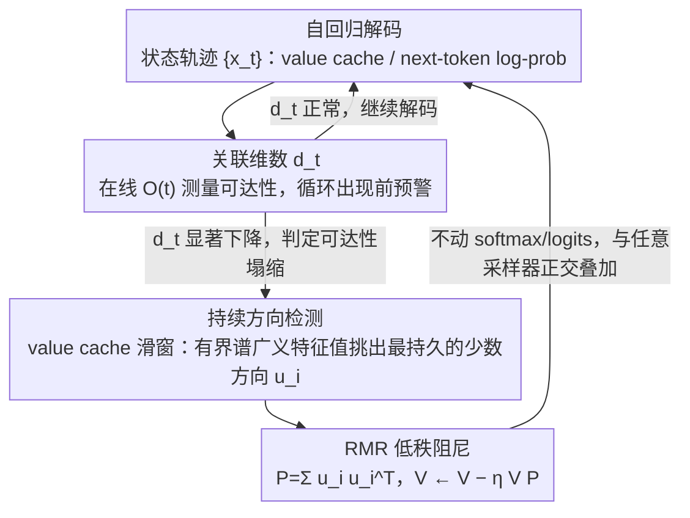

# Escaping Mode Collapse in LLM Generation via Geometric Regulation

**会议**: ICML 2026  
**arXiv**: [2605.00435](https://arxiv.org/abs/2605.00435)  
**代码**: 无  
**领域**: LLM 生成 / 动力系统 / 解码控制  
**关键词**: 模式崩溃、几何坍缩、关联维数、KV 缓存干预、低秩阻尼

## 一句话总结
本文从动力系统视角把 LLM 长文本生成中的「模式崩溃」（重复、循环、单调）重新解释为隐藏状态轨迹在表示空间里的「几何坍缩」，并提出 RMR — 在 Transformer value cache 上做轻量低秩阻尼来抑制最具持续性的自我强化方向，从而在极低熵的解码区间（0.8 nats/step）依然保持稳定高质量生成。

## 研究背景与动机

**领域现状**：长文本解码失败（重复、循环、单调化）是 LLM 落地的老大难。主流缓解办法都是「token 层面」的：top-k / top-p / 温度采样、重复惩罚、locally typical sampling 等，都在修改下一 token 的概率分布。

**现有痛点**：这些做法本质上是「局部、符号层面」的修补 — 在低温或低熵目标下（例如温度 0.5、熵目标 1.0），模型仍然会大概率陷入循环；token 级启发式只压制症状，不解释为什么循环系统性出现，也无法给出长程动力学的可控旋钮。

**核心矛盾**：模式崩溃不是「某个 token 的概率不对」，而是「整段生成过程沿某条狭窄路径滑下去」。一个本质上是「轨迹/长程」的问题，被用「逐 token / 局部」的工具去解，自然力不从心。

**本文目标**：(1) 建立一个能直接刻画长程崩溃的几何度量；(2) 设计一个能直接干预内部状态而不动概率分布的轻量方法。

**切入角度**：把自回归解码视为高维状态空间里的随机轨迹（状态就是 KV cache 或下一 token log-prob 向量）。模式崩溃 ↔ 轨迹被困在一个低维「准吸引子」中，即「状态空间可达性塌缩」。

**核心 idea**：用关联维数 (correlation dimension) 量化「可达性」；当检测到强自我强化的低秩方向（类比 Ising 模型相变的序参量），就在 value cache 上做低秩阻尼，把这些方向轻微衰减掉，从而恢复轨迹的全空间探索能力。

## 方法详解

### 整体框架
方法把「token 层面救火」换成「轨迹层面治本」，分诊断与干预两层。诊断层先用一个二维 state-dependent IFS（带状态依赖的迭代函数系统）作为最小动力学模型，证明当温度/反温度 $\beta$ 越过临界 $\beta_0$ 后，系统会从单一遍历不变测度分裂为两个稳定吸引域，这正是 mode collapse 的几何对应物；再用「有限时间关联维数」 $d_t$ 在真实 LLM 解码里做在线测量，把这一相变信号落到逐步的 next-token log-prob 向量序列上。干预层 RMR (Reinforced Mode Regulation) 则在解码间隔里从最近的 value cache 段定位「时序持续性异常强」的低秩子空间并对其做阻尼，把最小模型里对历史均值的收缩推广到高维，且全程不动 softmax 概率、不改 logits，是纯状态空间干预。

### 关键设计

**1. 关联维数：把「轨迹被困住」变成可测的几何探针**

token 级的 entropy / Distinct-n 是单条轨迹上的随机量，方差大、阈值难定，只能在循环已经发生后才报警；作者改用轨迹层面的几何不变量来直接刻画「可达性塌缩」。具体对轨迹 $\{x_t\}$ 计算关联和 $C_t(\varepsilon)=\frac{2}{t(t-1)}\sum_{i<j}\mathbf{1}(\|x_i-x_j\|<\varepsilon)$，在 log-log 图上对 $\varepsilon$ 取斜率得到有限时间关联维数 $d_t$（基于标度律 $C_t(\varepsilon)\propto\varepsilon^d$）。为了能在线跑，作者把朴素的 $O(t^2)$ 算法改写成 $O(t)$ 的增量更新 $C_{t+1}(\varepsilon)=\frac{t-1}{t+1}C_t(\varepsilon)+\frac{2}{t(t+1)}\sum_i\mathbf{1}(\|x_i-x_{t+1}\|<\varepsilon)$。这样 $d_t$ 既能作为早期预警（实验中它在显式循环出现之前就显著下降），又天然和后续干预目标对齐。

**2. 持续方向检测：用有界谱广义特征值问题挑出该压制的少数方向**

直接对 value cache 做全维度阻尼会连正常语义一起损坏，所以必须先精准定位「最自我强化、最慢消散」的那几个方向——它们就是最小模型里历史均值 $m_t$ 的高维对应物。作者在一个滑动窗口的 value cache 矩阵上构造瞬时与历史平均两组协方差类矩阵，求广义特征向量；为避免数值爆炸，采用有界谱形式让特征值 $\lambda\in[0,1]$ 对应「持续性强度」，再做有原则的阈值化，只取前几个远离背景谱的最显著方向。之所以这样克制，是因为最小模型 3.2 节的洞察显示只需 $\eta=10^{-4}$ 量级的弱阻尼就足以恢复可达性，压住「最持久」的少数方向即可在最小破坏下解开循环陷阱。

**3. RMR 低秩阻尼更新：在 value cache 上做正交、免训练的状态干预**

拿到选中方向后，作者构造低秩投影 $P=\sum_i u_i u_i^\top$，对 value cache 执行低秩更新 $V \leftarrow V - \eta\, V P$，在高维上等价于最小模型里的 $m_t\leftarrow(1-\eta)m_t$ 收缩。整个操作只额外引入一次小型矩阵乘，开销与一次 attention 相当甚至更低。因为干预发生在 value cache 这个状态层、不触碰 token 概率分布的解析形式，RMR 可以和任意采样器（top-p、温度、对比解码等）正交叠加。它是纯推理时方法，无需训练、微调或 reward model，仅有的两个超参是阻尼系数 $\eta$ 与目标低秩 $r$，作者建议 $\eta\in[10^{-3},10^{-2}]$、$r\in\{2,4,8\}$ 即可在多数模型上工作。

## 实验关键数据

### 主实验
作者在多个开源 LLM（含 Qwen3-4B-Base 等）上分别用「温度锁定」和「熵锁定」两种解码协议测试。核心指标是「non-collapse rate」（在长生成中未触发显式循环的样本比例）。

| 解码设置 | Baseline non-collapse | RMR non-collapse | 备注 |
|---|---|---|---|
| Temperature = 0.7 | 8% | **56%** | 极大幅度提升 |
| Entropy target = 1.0 nats/step | 5% | **33%** | 低熵区域基线几乎全崩溃 |
| Entropy target ≈ 2.0 nats/step | 接近饱和 | 接近饱和 | 高熵时差距收窄 |
| Entropy target = 0.8 nats/step | 几乎 0 | 仍可用 | RMR 打开了一个全新的可用低熵区 |

### 消融实验

| 配置 | non-collapse 表现 | 说明 |
|---|---|---|
| RMR full | 显著恢复 | 检测 + 低秩阻尼 |
| 仅检测，不阻尼 | 与 baseline 相当 | 验证「干预」是必需的，仅诊断没用 |
| 全维度阻尼 (非低秩) | 文本质量下降 | 说明「最少必要干预」原则的价值 |
| 仅 token 级 repetition penalty | 改善有限 | 验证符号级方法在低温区失效 |

### 关键发现
- 关联维数 $d_t$ 在显式循环出现**之前**就显著下降，可作为 early warning，远比 entropy 或 Distinct-n 灵敏。
- 「持续方向」非常稀疏（通常 < 8 维），印证最小模型中「序参量是低维」的直觉，也解释了为什么低秩阻尼足以解决问题。
- RMR 把可用解码区间从 ~2.0 nats/step 扩展到 ~0.8 nats/step，相当于解锁了一个之前因循环而不可用的「高确定性 + 高多样性」操作区。

## 亮点与洞察
- **跨学科类比**：把 LLM 解码与非平衡统计物理（Ising 相变、慢变量、自组织）打通，关联维数与序参量的对应非常优雅 — 这种「轨迹几何」视角比单看 token 概率更接近问题本质。
- **诊断—干预闭环**：先用关联维数定性指出「可达性塌缩」，再用低秩阻尼定向解决，整套链路自洽，方法不是凑出来的而是从理论推出来的。
- **可迁移的 trick**：「在 value cache 上做低秩 / 低开销干预」这条路径对其他长程问题（幻觉漂移、思维链塌缩、agent 重复调用同一工具）都可能适用 — 都是高维隐空间中的「轨迹陷阱」。

## 局限与展望
- 实验主要集中在开放式文本生成与 Qwen3 系列，未充分覆盖 reasoning / agent / 代码等强结构任务，「最持久方向 = 不需要的方向」这一假设在结构化任务上可能站不住。
- 关联维数本身估计对窗口长度敏感，作者给出的在线算法仍依赖经验阈值 $\varepsilon_0,\varepsilon_1$；自动选阈值是潜在改进点。
- RMR 当前是「事后干预」，将持续方向检测信号反馈到训练目标（例如在 RLHF reward 里加入几何项）是显然的下一步。

## 相关工作与启发
- **vs Locally Typical Sampling / top-p**：他们改概率，本文改状态；正交，可叠加使用。
- **vs activation steering (Zou 2023 / Turner 2023)**：同样在 cache 上做干预，但 RMR 的方向来自「时序持续性」而非任务向量，目标是稳定动力学而非控制语义。
- **vs 现有 repetition penalty**：从根本上避开「需要 N-gram 历史窗口」的工程化补丁，机制更普适。

## 评分
- 新颖性: ⭐⭐⭐⭐⭐ 用动力系统/相变的语言重新定义模式崩溃，给出可计算的几何量与对应干预，框架感强
- 实验充分度: ⭐⭐⭐⭐ 跨多个模型与解码协议有完整对比，但未触及推理/agent 长程任务
- 写作质量: ⭐⭐⭐⭐ 理论叙事清晰，最小模型铺垫到真实 LLM 干预，逻辑顺畅
- 价值: ⭐⭐⭐⭐ 提供了一条几乎免费的低熵解码新区间，部署摩擦极小，工程价值显著

<!-- RELATED:START -->

## 相关论文

- [\[CVPR 2026\] DiverseGRPO: Mitigating Mode Collapse in Image Generation via Diversity-Aware GRPO](../../CVPR2026/image_generation/diversegrpo_mitigating_mode_collapse_in_image_generation_via_diversity-aware_grp.md)
- [\[CVPR 2026\] Taming Preference Mode Collapse via Directional Decoupling Alignment in Diffusion Reinforcement Learning](../../CVPR2026/image_generation/taming_preference_mode_collapse_via_directional_decoupling_alignment_in_diffusio.md)
- [\[ICML 2026\] Information-Geometric Adaptive Sampling for Graph Diffusion](information-geometric_adaptive_sampling_for_graph_diffusion.md)
- [\[ICML 2026\] Quantifying Error Propagation and Model Collapse in Diffusion Models](quantifying_error_propagation_and_model_collapse_in_diffusion_models.md)
- [\[ICML 2026\] Restoring Initial Noise Sensitivity in Text-to-Image Distillation via Geometric Alignment](restoring_initial_noise_sensitivity_in_text-to-image_distillation_via_geometric_.md)

<!-- RELATED:END -->
