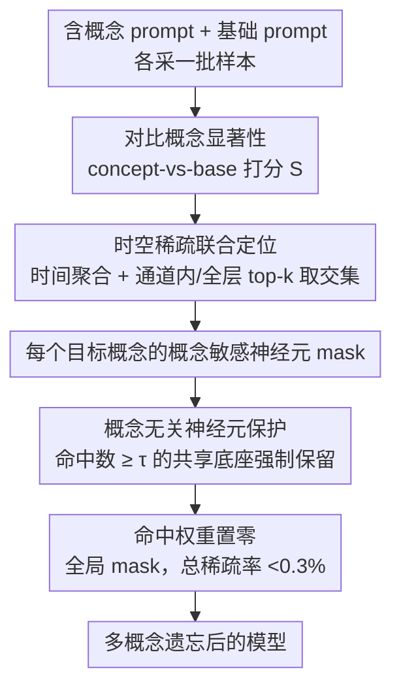

# Forget-It-All: Multi-Concept Machine Unlearning via Concept-Aware Neuron Masking

**会议**: ICML 2026  
**arXiv**: [2601.06163](https://arxiv.org/abs/2601.06163)  
**代码**: https://github.com/kaiyuan02415/Forget-It-All (有)  
**领域**: AI 安全 / 扩散模型遗忘 / 模型稀疏  
**关键词**: 多概念机器遗忘, 文本到图像扩散, 概念敏感神经元, 神经元掩码, 训练无关

## 一句话总结
本文提出训练无关的多概念遗忘框架 FIA，通过"对比概念显著性 + 时空稀疏筛选"定位每个目标概念所对应的概念敏感神经元，并在融合多概念掩码时显式保留同时响应多个概念的"概念无关神经元"，仅剪掉真正概念专属的连接，在 SD v1.5/v1.4 上以 <0.3% 的总稀疏率同时遗忘十个 Imagenette 类（平均遗忘准确率 1.9%，整体得分 86%）以及多艺术家风格和不良内容。

## 研究背景与动机

**领域现状**：T2I 扩散模型（Stable Diffusion 等）能生成高质量图像，但同时带来版权、隐私和不良内容风险。机器遗忘 (machine unlearning, MU) 被视为成本可控的解决方案，目前主流分两类：基于微调的方法（FMN、SalUn、AC、ESD、MACE、SPM）通过更新 cross-attention 或加 LoRA 来抹掉概念；训练无关方法（UCE、SLD、ConceptPrune）则直接编辑权重或在推理时注入安全引导。

**现有痛点**：绝大多数方法只针对单概念设计。把它们顺序套用到多个概念时会出现两个明显问题：(i) 已遗忘的概念会"被重新激活"或者整体生成质量崩塌；(ii) 微调对超参极其敏感，每加一个待遗忘概念都要重新调，计算开销线性增长且容易过拟合。即使是专门的多概念方法（SPM/MACE/COGFD/SepME）也依赖额外 LoRA、概念图或闭式编辑，遗忘效果与生成质量之间难以同时达到最优。

**核心矛盾**：要"彻底删掉 N 个概念" 与 "保留通用生成能力" 是冲突的——许多 weight 同时承担多个概念表达，简单地把所有 candidate 神经元的 mask 取并集会大量误伤共享底层特征的神经元。

**本文目标**：(1) 在不微调、不引入额外参数的前提下，给每个目标概念识别出真正属于它的"概念敏感"神经元；(2) 在融合多个 mask 时保护那些被多个概念共用的"概念无关"神经元，避免生成质量下降。

**切入角度**：作者把多概念遗忘重新理解为**模型稀疏化**问题——既然单个概念只激活了少量神经元，那么对每个概念分别做"概念感知剪枝"，再用一个聪明的融合策略合并 mask，就能在极低稀疏率下完成多概念遗忘。

**核心 idea**：用 *对比的、时空联合的* 神经元显著性把概念专属神经元从共享神经元中分离出来；剪掉前者、保留后者，从而做到"忘掉 N 个概念，又不忘怎么画画"。

## 方法详解

### 整体框架
FIA 把"同时遗忘 $C$ 个概念又不伤通用画图能力"重新表述成一个模型稀疏化问题：对每个待遗忘概念单独定位出真正只服务于它的少量神经元，再用一套会"绕开共享神经元"的融合策略把所有概念的剪枝决定合并成一张全局 mask。整条 pipeline 完全在推理期完成，不更新任何权重——先对每个概念用对比显著性给每条连接打分、沿时空聚合筛出概念敏感神经元，再做概念无关感知融合、把最终 mask 命中的权重置零，全程总剪枝率不到模型的 0.3%。

### 关键设计

**1. 对比概念显著性：用 concept-vs-base 把"概念专属"从"通用特征"里分离出来**

多概念遗忘的第一道坎是判据：单纯看权重幅值或激活强度无法区分一条连接到底在画"概念"还是在画"任何图都要用的底层特征"。FIA 先给每条连接 $(i,j)$ 定义一个统一能量 $U_{\ell,t,i,j}=|W_{\ell,i,j}|\cdot\|X_{\ell,t,j}\|_2\cdot \frac{|\langle X_{\ell,t,j},Y_{\ell,t,i}\rangle|}{\|X_{\ell,t,j}\|_2\cdot\|Y_{\ell,t,i}\|_2+\varepsilon}$，同时刻画权重大小、输入活跃度以及"输入-输出方向一致性"——最后那个 cosine 项专门压低那些激活很强却只在传递噪声方向的神经元。真正的关键是对比：对同一概念分别用"含概念 prompt"（如 *a golf ball on the table*）和剥掉概念的"基础 prompt"（*a table*）各采一批样本，算出 $U$ 的均值 $\mu_c$、$\mu_b$ 和基础方差 $\sigma_b$，再取 $S_{\ell,t,i,j}=\max(0,\,\mu_c-\mu_b-\sigma_b)$。减去背景均值又扣掉一倍背景方差，等价于一个轻量的统计显著性过滤器，只有"加上概念后贡献稳定且显著抬升"的连接才会留下正分，让后续剪枝从一开始就对准概念专属连接而不是共享底座。

**2. 时空稀疏联合定位：让被选中的神经元既稳又精**

有了逐步逐位置的显著性 $S$ 之后，还得把它收敛成一组真正稳定响应概念的神经元，否则去噪某一步的瞬时爆点会被误当成概念神经元。FIA 先沿时间聚合 $A_{\ell,i,j}=\tfrac12\cdot\tfrac1T\sum_t S_{\ell,t,i,j}+\tfrac12\cdot\tfrac1T\sum_t \mathbf{1}[S_{\ell,t,i,j}>\tau_{\ell,t}]$，把"平均响应强度"和"超过自适应阈值的激活频率"等权相加（阈值 $\tau_{\ell,t}$ 取每层每步的 top-$r_1$ 分位），这样只有跨时间步持续活跃的连接才拿得到高分。空间上再做两次互补筛选：在每个输出通道内按 $A$ 取通道内 top-$k$ 得到局部集合 $C_\ell$，保证 budget 不被少数 dominant channel 吃光；同时在整层一次性取 top-$K_g=r_2\cdot C_{out}\cdot C_{in}$ 得到全局集合 $G_\ell$，保证入选的确实够强。最终该概念在该层的概念敏感神经元为两者交集 $\mathcal{Q}_\ell^{(c)}=C_\ell\cap G_\ell$，"局部不漏、全局不弱"，构成后续多概念融合的稳定输入。

**3. 概念无关神经元保护：用一行计数锁死共享底座**

把 $C$ 个单概念 mask 合并时若直接取并集，会把那些"碰巧每个概念都用"的神经元一并剪掉，而它们恰恰编码颜色、形状、构图这类基本能力，误删会让 CLIP/FID 全线崩盘。FIA 的观察是：被越多目标概念同时命中的神经元，越可能是通用底座而非概念专属。于是对每个神经元统计被多少概念命中 $s_{\ell,i,j}=\sum_{c=1}^C \mathrm{Mask}_\ell^{(c)}[i,j]$，并设阈值 $\tau_{ca}=\lceil \alpha C \rceil$（$\alpha\in(0,1]$ 为"概念无关比例"）：命中数 $s_{\ell,i,j}\ge\tau_{ca}$ 的判为概念无关神经元强制保留，只剪掉 $0<s_{\ell,i,j}<\tau_{ca}$ 这批"只服务一两个目标概念"的连接。无需 LLM 概念图或显式 anchor，一个计数加阈值就把共享底座从待剪集合里摘了出来，使遗忘既彻底又克制。

整个流程完全 training-free，没有任何梯度更新或新增可学习参数，需要人手设定的只有三个稀疏率——时间稀疏 $r_1$、空间稀疏 $r_2$、概念无关比例 $\alpha$；每概念采样约 10 张图、走完 50 步去噪即可收集显著性，单卡 A6000 推理就能跑完并即时回滚（保留原 mask 备份即可）。

## 实验关键数据

### 主实验

**多对象遗忘 (Imagenette 10 类同时遗忘, SD v1.5)**：

| 方法 | 平均遗忘准确率↓ | CLIP_coco↑ | 备注 |
|------|----------------|------------|------|
| SD v1.5 (原模型) | 90.34 | 31.42 | 未遗忘 |
| CP (训练无关剪枝) | 7.34 | 27.93 | 遗忘较好但画质崩 |
| UCE (闭式编辑) | 8.62 | 29.25 | 训练无关 baseline |
| SalUn (微调) | 23.17 | 29.93 | 微调 SOTA 之一 |
| SPM (LoRA) | 47.29 | 30.77 | 微调 |
| MACE (LoRA+CFR) | 78.22 | 31.05 | 多概念专门方法 |
| **FIA (本文)** | **1.9** | 29.56 | 训练无关，几乎完全遗忘 |

**Imagenette 前 5 遗忘 / 后 5 保留 (overall = harmonic mean(P, 1−F))**：

| 方法 | 遗忘准确率 ↓ | 保留准确率 ↑ | Overall ↑ |
|------|------------|--------------|-----------|
| CP | 2.7 | 52.4 | 68.1 |
| UCE | 5.5 | 71.9 | 81.7 |
| MACE | 58.5 | 78.2 | 54.2 |
| SalUn | 22.3 | 77.4 | 77.5 |
| **FIA** | **2.1** | 76.7 | **86.0** |

**不良内容遗忘 (I2P, NudeNet 检测, SD v1.4)**：FIA 把暴露身体部位总检测数从原模型 743 降到 **32**（次优 MACE 111），同时 FID 14.02 / CLIP 31.18 保持与基线相当。

**多艺术家风格遗忘 (Van Gogh / Monet / Picasso / Da Vinci / Dali 五人同时遗忘)**：

| 方法 | CLIP_a (艺术家相似度) ↓ | FSR (forget success) ↑ | COCO CLIP ↑ |
|------|------------------------|-----------------------|-------------|
| CP | 27.90 | 79.6 | 29.76 |
| MACE | 30.98 | 57.4 | 30.14 |
| SPM | 31.10 | 40.0 | 31.33 |
| **FIA** | **27.45** | **83.4** | 30.56 |

### 消融实验

| 配置 | 关键指标 | 说明 |
|------|---------|------|
| Full FIA | Forget Acc 1.9 / CLIP 29.56 | 完整模型 |
| 仅时间稀疏 (无空间筛选) | 遗忘略增、画质明显掉 | 选到了"全层 dominant 神经元"，伤通用能力 |
| 仅空间稀疏 (无 contrastive 显著性) | 遗忘不彻底 | 选到的是通用激活强的神经元而非概念专属 |
| 无概念无关保护 (naive union mask) | CLIP 大幅下滑 | 共享神经元被误剪，画质崩 |
| 总稀疏率从 0.3% 提高 | 遗忘≈不变，画质单调下降 | 验证 FIA 已在剪枝最经济点 |

（具体数字见原文 Appendix B / Tables 6, 19–22；上表保留定性结论。）

### 关键发现
- 三大模块各自不可替代：对比显著性决定"找得准不准"，时空稀疏决定"找得稳不稳"，概念无关保护决定"剪完还能不能画画"，去掉任一项都会显著掉点。
- 总剪枝率不到全模型 0.3%——证实多概念遗忘的"信息"高度集中在极少数神经元上，这本身是一个有意思的稀疏性发现。
- 随着待遗忘概念数从 2 增到 10，FIA 的遗忘准确率几乎线性保持低位，而 baseline 普遍随概念数增加迅速劣化（Figure 4 的曲线斜率差异很明显）。
- 三种任务（物体 / 风格 / 不良内容）共用同一套超参，验证了"plug-and-play"承诺：换任务不调参就能用，这是相对微调系方法最大的实用优势。

## 亮点与洞察
- **对比 + 统计显著性的剪枝判据**：用 concept prompt vs base prompt 的均值差减背景方差，相当于把传统神经元剪枝中"重要性分数"升级成了"概念专属性 t-test"，思想简洁但效果显著，完全可以迁移到其他需要"按语义剪枝"的场景（如 LLM 风格遗忘、特定能力裁剪）。
- **"被多个概念共激活的就是通用神经元"这一观察**：用一行计数公式就把"共享底层"从"概念专属"中识别出来，避开了之前多概念方法需要 LLM 概念图或显式 anchor 的复杂工程，是这篇论文最让人"啊哈"的设计。
- **训练无关 + 0.3% 稀疏率**：意味着无需 GPU 微调、无新增参数、可即时回滚（保留原 mask 备份即可），对监管侧合规非常友好。
- **可迁移性**：该框架本质上是"先建立目标-非目标的对比响应分布，再做交集 + 共享保护"，这套思路可以直接套用到 LLM 的 unlearning（按 prompt 套件构造 contrastive activation）甚至 vision encoder 的特征剪枝。

## 局限与展望
- 作者承认：当待遗忘概念数极大且语义高度重叠时，可能找不到足够多的"概念专属"神经元，全部都落到"概念无关"区域，从而遗忘不彻底；同时三种稀疏率虽少但仍需根据任务大致校准。
- 论文只在 SD v1.4/1.5 和 SDXL 上验证，对 DiT 系（如 PixArt、SD3、Flux）和视频扩散模型的稀疏假设是否成立尚未验证。
- Contrastive Concept Saliency 依赖人工设计的 base prompt，对组合式/抽象概念（如"暴力"、"种族刻板印象"）很难设出"减掉概念后剩下的中性 prompt"，可能造成显著性估计偏差。
- 神经元剪枝是不可学习的二值决定，理论上仍存在"重新激活"风险（对抗 prompt 或 textual inversion 可能绕过 mask），文中只在常规 prompt 上评测了鲁棒性，未与 Stereo 等对抗鲁棒遗忘方法做严格对比。
- 改进方向：用门控 mask 替代硬 0/1（推理时按 prompt 自适应关停）、把 contrastive 显著性扩到 cross-attention 层之外的 self-attention/MLP、把"概念无关比例 $\alpha$"做成数据驱动的自适应阈值。

## 相关工作与启发
- **vs ConceptPrune (CP)**: 同样走"训练无关 + 剪枝"路线，但 CP 只针对单概念、依赖固定阈值，多概念时神经元干扰严重；FIA 加入了 contrastive 显著性、时空联合和概念无关保护，遗忘从 7.34 降到 1.9，CLIP 从 27.93 提到 29.56，证明 CP 的弱项不是剪枝本身而是"多概念融合策略"。
- **vs MACE / SPM (LoRA 多概念遗忘)**: MACE/SPM 通过 LoRA 适配多个概念，但需要为每个概念训练 adapter，且 cross-attention 闭式编辑会带来量化误差累积；FIA 既不微调也不需要为每个概念存额外参数，部署成本和遗忘效果都更优。
- **vs UCE / SPEED / ScaPre (闭式编辑训练无关)**: 这类方法直接改 cross-attention 权重，依赖精确概念 embedding 且容易拖累画质；FIA 不动权重数值，只把少数神经元置零，画质受影响极小、可即时回滚。
- **vs SalUn (梯度显著性微调)**: SalUn 同样用 saliency，但需要反传梯度并微调；FIA 用前向激活的对比显著性近似神经元贡献，省掉了反传，更快也更稳定。
- 启发：本文显式区分"概念专属"vs"概念无关"神经元，可推广为 LLM 安全微调中的"通用能力护栏"——通过类似 contrastive activation 找到承担基础语言能力的神经元并冻结，再在其他神经元上做对齐 / 遗忘，可能缓解 RLHF 的能力退化问题。

## 评分
- 新颖性: ⭐⭐⭐⭐ "概念无关神经元"这一观察 + 对比显著性的统计构造把多概念遗忘转成稀疏化问题，视角清新且能复用到 LLM
- 实验充分度: ⭐⭐⭐⭐⭐ 三类任务（物体 / 不良内容 / 风格）+ 多个 baseline + 多 forget-preserve 配置 + SDXL 泛化 + 大量消融，验证充分
- 写作质量: ⭐⭐⭐⭐ pipeline 结构清楚、公式自洽、图示直观；个别符号（$\tau_{\ell,t}$ 的层步双重下标）首次出现略密
- 价值: ⭐⭐⭐⭐⭐ 训练无关 + 0.3% 稀疏 + 即插即用，对 T2I 模型合规与多概念遗忘是非常实用的 baseline

<!-- RELATED:START -->

## 相关论文

- [\[ECCV 2024\] Challenging Forgets: Unveiling the Worst-Case Forget Sets in Machine Unlearning](../../ECCV2024/image_generation/challenging_forgets_unveiling_the_worst-case_forget_sets_in_machine_unlearning.md)
- [\[ICML 2026\] Diagnosing and Correcting Concept Omission in Multimodal Diffusion Transformers](diagnosing_and_correcting_concept_omission_in_multimodal_diffusion_transformers.md)
- [\[CVPR 2026\] Neighbor-Aware Localized Concept Erasure in Text-to-Image Diffusion Models](../../CVPR2026/image_generation/neighbor-aware_localized_concept_erasure_in_text-to-image_diffusion_models.md)
- [\[ICML 2026\] Orthogonal Concept Erasure for Diffusion Models](orthogonal_concept_erasure_for_diffusion_models.md)
- [\[AAAI 2026\] Mass Concept Erasure in Diffusion Models with Concept Hierarchy](../../AAAI2026/image_generation/mass_concept_erasure_in_diffusion_models_with_concept_hierarchy.md)

<!-- RELATED:END -->
