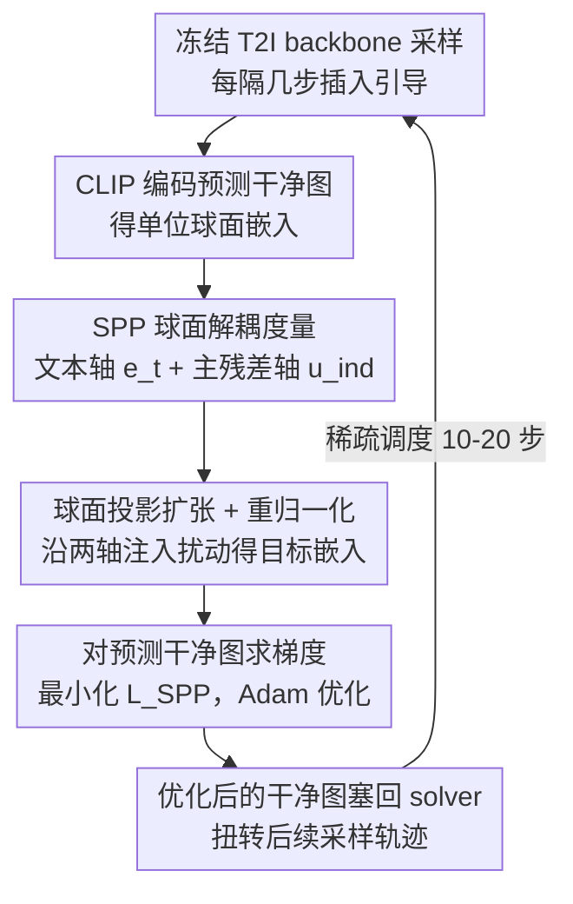

# GASS: Geometry-Aware Spherical Sampling for Disentangled Diversity Enhancement in Text-to-Image Generation

**会议**: ICML 2026  
**arXiv**: [2602.17200](https://arxiv.org/abs/2602.17200)  
**代码**: https://github.com/L-YeZhu/GASS_T2I (有)  
**领域**: 扩散模型 / 图像生成  
**关键词**: T2I 多样性、CLIP 球面几何、正交分解、推理时引导、prompt 无关变化

## 一句话总结
作者把 T2I 同 prompt 下的样本多样性投到 CLIP 单位超球面上，沿"文本方向 $\mathbf{e}_t$"与"正交主残差方向 $\mathbf{u}_{\text{ind}}$"分别拉开投影展度，并通过对预测干净图 $\hat{x}_{0|t}$ 做梯度优化把这种几何展开搬回扩散/流采样轨迹，在 SD2.1 与 SD3-M 上同时提升 prompt 相关（姿态、构图）与 prompt 无关（背景、风格）的多样性，几乎不损质量与对齐。

## 研究背景与动机

**领域现状**：现代 T2I（SD2.1、SD3-M 等扩散与 rectified flow 模型）在保真度和文本对齐上已经很强，但给定同一个 prompt 反复采样时往往输出高度雷同的图，缺少多样性。现有的推理时增强方法（PG、CADS、IG、SPELL）大多沿用"最大化 batch 内样本不相似度 / 嵌入空间熵"这一思路，对齐 Vendi Score 之类的指标。

**现有痛点**：纯熵最大化把所有变化方向一视同仁，无法区分"语义层面的变化（视角、姿态）"和"prompt 没有约束的变化（背景、风格、光照）"。实测中这些方法常常只让前景做点扰动，背景却被磨成模糊统一色块——所谓的"多样性提升"主要来自语义抖动，背景多样性几乎被忽视。新近的 Scendi / SPARKE 想用 Schur complement 熵做解耦，但要求 prompt 与图像数量相等，在固定 prompt 设置下退化为标准 VS，失去解耦能力。

**核心矛盾**：T2I 多样性天然是多源的——同一句 "A black colored car" 下既有 prompt 相关变化（车型、视角），也有 prompt 无关变化（背景、光照）；但现有指标和采样方法都只给一个标量，没有把这两个轴拆开来分别度量与干预。

**本文目标**：(i) 给出一种能把 prompt 相关 / 无关多样性几何上分离开的度量；(ii) 设计一种推理时采样干预，能可控地放大某一轴或两轴的展度；(iii) 在冻结的 T2I backbone 上即插即用，不引入额外训练。

**切入角度**：CLIP 嵌入天然归一化在单位超球面 $\mathbb{S}^{d-1}$ 上，且文本与图像共享同一流形——这给"以 $\mathbf{e}_t$ 为锚做正交分解"提供了几何便利。任何图像嵌入 $\mathbf{e}_i$ 都可以分解成"沿 $\mathbf{e}_t$ 的分量"（语义对齐方向，本质就是 CLIPScore）+ "正交补里的残差"。残差子空间维度高，但深网络表征通常集中在低维流形上，因此可以用一个主方向 $\mathbf{u}_{\text{ind}}$ 来近似 prompt 无关变化。

**核心 idea**：用"沿 $\mathbf{e}_t$ 与 $\mathbf{u}_{\text{ind}}$ 两轴投影的极差之和"$SPP = \mathcal{D}_{\text{dep}} + \mathcal{D}_{\text{ind}}$ 度量多样性，并在采样过程中显式地把每张图的目标 CLIP 嵌入沿这两个轴随机推开一点，再通过 CLIP encoder 的梯度把这种"想象中的更分散的嵌入"反传回去修改预测的干净图 $\hat{x}_{0|t}$。

## 方法详解

### 整体框架
GASS 想解决的是"同一个 prompt 反复采样却总出雷同图"的问题，而它的思路是把"多样性"这件事搬到 CLIP 单位超球面上来重新定义和操作。冻结的 T2I backbone（UNet 或 DiT，扩散或 rectified flow 都行）正常采样，每隔几步插入一次 GASS 引导：先用冻结的 CLIP image encoder $\mathcal{E}_I$ 把当前预测的干净图编码成球面嵌入，找出一条文本方向和一条主残差方向作为两根解耦坐标轴，沿这两根轴把 batch 内的嵌入人为推开，再通过对预测干净图 $\hat{x}_{0|t}$ 求梯度，把"想象中更分散的嵌入"反传回像素空间。整套引导是稀疏的，只在 10–20 个采样步上开启，A100 上一个 batch 仅多花 2.93–3.68 秒。

### 关键设计

**1. 球面解耦度量 SPP：把多样性拆成 prompt 相关与无关两根轴**

现有指标（Vendi Score、嵌入熵）只给一个标量，无法区分"语义层面的变化（视角、姿态）"和"prompt 没约束的变化（背景、光照）"，于是放大多样性时常常只让前景抖动、背景却被磨成统一色块。GASS 的解法是借 CLIP 嵌入天然归一化在单位球、且文本图像共享流形这一点，以归一化文本嵌入 $\mathbf{e}_t$ 为第一基把每个图像嵌入展开成 $\mathbf{e}_i = (\mathbf{e}_i^\top \mathbf{e}_t)\mathbf{e}_t + \sum_{k\ge 2} (\mathbf{e}_i^\top \mathbf{u}_k)\mathbf{u}_k$——第一项正好就是 CLIPScore（prompt 相关），剩下的正交补就是 prompt 无关变化。由于深网络表征集中在低维流形，作者用 Algo. 1 的随机 Gram-Schmidt 搜索在正交补里找一条响应最强的主残差方向 $\mathbf{u}_{\text{ind}} = \arg\max_{\mathbf{r}} \tfrac{1}{B}\sum_i |\mathbf{e}_i^\top \mathbf{r}|$ 来近似它。多样性即两轴投影极差之和 $SPP = \mathcal{D}_{\text{dep}} + \mathcal{D}_{\text{ind}}$，其中 $\mathcal{D}_{\text{dep}} = \max_i(\mathbf{e}_i^\top \mathbf{e}_t) - \min_i(\mathbf{e}_i^\top \mathbf{e}_t)$、$\mathcal{D}_{\text{ind}}$ 同构。这样单 prompt batch 就能给出两个独立标量，绕开了 Scendi 那种必须多 prompt 协方差才能解耦的限制；ImageNet 上真实图的 $SPP \approx 0.220$ 比 SD2.1/SD3-M 的 $0.126$–$0.146$ 高约 50%，说明它确实能区分"真实多样性 vs 生成多样性"，既可当评估指标也可当干预目标。

**2. 球面投影扩张 + 重归一化：定向把 batch 推得更散而不打乱主语义**

有了两根解耦轴，GASS 就沿它们对每张图注入有界均匀扰动 $\delta_i^{\text{dep}}, \delta_i^{\text{ind}} \sim \mathcal{U}[-r, r]$，构造一个几何上更分散的目标嵌入 $\tilde{\mathbf{e}}_i = (\mathbf{e}_i^\top \mathbf{e}_t + \delta_i^{\text{dep}})\mathbf{e}_t + (\mathbf{e}_i^\top \mathbf{u}_{\text{ind}} + \delta_i^{\text{ind}})\mathbf{u}_{\text{ind}} + \mathbf{r}_i$，其中 $\mathbf{r}_i$ 是除掉两主分量后的初始残差，原样保留以免破坏图像其它细节方向，最后再 $\tilde{\mathbf{e}}_i \leftarrow \tilde{\mathbf{e}}_i / \|\tilde{\mathbf{e}}_i\|_2$ 投回单位球。相比 PG / SPELL 在高维做各向同性扰动（被语义先验稀释后留给背景的"预算"几乎为零），把扰动局限在两个有语义解释的方向上，就能在不打乱主语义的前提下定向放大背景或姿态变化。重归一化这步是质量护栏——它把目标拉回 CLIP 训练分布的高密度区，消融显示去掉它 ImageReward 会从 0.778 掉到 0.732（嵌入飞出单位球图像就开始走样）。作者还给出 Prop. 4.1：在期望意义下 batch 点集的 Gram 行列式（即超体积）严格增大，把"几何展度真的扩了"从经验观察升级成可证命题。

**3. 对预测干净图求梯度：把球面目标翻译回像素而不穿过 backbone**

球面上的目标嵌入要真正改变采样结果，得回到像素空间，但 CLIP 没有解码器、又不想为大 T2I backbone 反传。GASS 的做法是直接对每步预测的干净图 $\hat{x}_{i,0|t}$ 求导：以 $\mathcal{L}_{\text{SPP}} = \sum_i (1 - \mathcal{E}_I(\hat{x}_{i,0|t})^\top \tilde{\mathbf{e}}_i)$ 为目标，用 Adam（lr $1\times 10^{-4}$，最多 60 步，早停 patience 4、容差 $5\times 10^{-4}$）做 $\hat{x}^*_{i,0|t} \leftarrow \hat{x}_{i,0|t} - \eta \nabla \mathcal{L}_{\text{SPP}}$，再把优化后的 $\hat{x}^*_{0|t}$ 塞回 solver 的状态转移方程（DDIM 或 flow ODE 都适用）扭转后续轨迹。因为梯度完全不经过生成网络，方法对 backbone 是黑盒，UNet/DiT、diffusion/flow 即插即用；配合早停 + 稀疏调度（只在 10–20 步开启），单次额外开销压到 3 秒级别，是 SOTA 推理时方法里少有的"既稳又便宜"的设计。

### 损失函数 / 训练策略
无训练，纯推理时。引导损失即上面的 $\mathcal{L}_{\text{SPP}}$；超参 $r_{\text{dep}} = r_{\text{ind}} = 0.02$，SD2.1 用 50 步、SD3-M 用 28 步采样，GASS 默认 20 步均匀开启，候选方向数 $N = 10$。

## 实验关键数据

### 主实验

ImageNet（SD3-M，50 张/类，1000 类，"A photo of [class]" 模板）：

| 方法 | Density↑ | Coverage↑ | VS↑ | ClipScore↑ | SPP↑ |
|------|---------|----------|-----|-----------|------|
| CFG | 1.105 | 0.588 | 28.119 | 0.308 | 0.137 |
| PG (ICLR'24) | 1.103 | 0.586 | 28.119 | 0.308 | 0.129 |
| CADS (ICLR'24) | 1.374 | 0.636 | 28.456 | 0.309 | 0.133 |
| IG (NeurIPS'24) | 1.389 | 0.627 | 27.415 | 0.310 | 0.129 |
| SPELL (ICML'25) | 1.105 | 0.585 | 28.433 | 0.302 | 0.128 |
| **GASS** | 1.164 | 0.611 | **28.877** | **0.313** | **0.141** |

DrawBench（SD3-M，200 prompt × 10 张）：VS 8.115→**8.212**、ImageReward 0.779→0.778、ClipScore 0.318→**0.320**、SPP 0.113→**0.114**。SD2.1 上 GASS 也是唯一在 VS、ClipScore、SPP 三项同时拿最高的方法（VS 8.847、ClipScore 0.307、SPP 0.135）。

### 消融实验

| 配置 | VS↑ | ImageReward↑ | ClipScore↑ | SPP↑ |
|------|-----|-------------|-----------|------|
| **GASS (full, $r=0.02$)** | 8.212 | 0.778 | **0.320** | **0.114** |
| IP（两轴都随机各向同性扰动） | 8.203 | 0.774 | 0.308 | 0.113 |
| RD（保 $\mathbf{e}_t$，$\mathbf{u}_{\text{ind}}$ 随机正交） | 8.206 | 0.778 | 0.313 | 0.113 |
| w/o Re-normalization | **8.876** | 0.732 | 0.313 | 0.123 |
| $r_{\text{dep}}=0, r_{\text{ind}}=0.02$（只扩背景轴） | 8.207 | 0.787 | 0.319 | 0.111 |
| $r_{\text{dep}}=0.02, r_{\text{ind}}=0$（只扩语义轴） | 8.206 | 0.780 | 0.320 | 0.112 |
| $r=0.05$（扩太狠） | 8.205 | 0.778 | 0.320 | 0.112 |
| GASS 步数 10 (early consecutive) | 8.215 | **0.808** | 0.318 | 0.114 |

### 关键发现
- **解耦基的选择是关键**：IP 把 $\mathbf{e}_t$ 也替成随机方向后 ClipScore 从 0.320 跌到 0.308，证明锚定文本方向 + 主残差方向的几何分解不是可有可无的"random pick"。
- **重归一化是质量护栏**：去掉后 VS 飙到 8.876，但 ImageReward 从 0.778 掉到 0.732——说明嵌入飞出单位球后图像就开始走样，这条简单约束是"多样性 vs 质量"的关键调节器。
- **两轴同扩 > 单轴扩**：单扩任一轴 SPP 都不如同时扩两轴（0.114 vs 0.111/0.112），证实多样性确实由两个独立可加的源构成。
- **GASS 在长 prompt 上 margin 更大**：DrawBench 按词数分短/中/长三档，长 prompt（≥15 词）下 VS 7.549→7.935 涨幅最显著，反直觉地补足"复杂 prompt 反而 VS 更低"这一现象。
- **早期连续 vs 均匀调度**：早期连续 10 步 ImageReward 最高（0.808），但生成图饱和度偏低；均匀调度色彩更自然——这是个值得记的 trick，可以根据下游需求切换。

## 亮点与洞察
- **几何视角替代熵视角**：把"多样性"从"信息熵"换成"球面投影展度"，立刻得到一个天然解耦、可控、可视化的度量。这是这篇最让人"啊哈"的角度——同一个问题换坐标系后，原本纠缠的两个变量直接被一根 $\mathbf{e}_t$ 切开。
- **首个显式增加背景多样性的采样方法**：作者明确指出 GASS 是第一个不改 prompt 就能引入有意义背景变化的 sampling-based 方法。其它方法的多样性集中在前景，根因正是它们的扰动是各向同性的，被语义先验稀释后留给背景的"预算"几乎为零。
- **对预测干净图求导而非对噪声预测求导**：这个 trick 让 GASS 完全绕开 T2I backbone 的反传，是它能同时在 UNet/DiT、diffusion/flow 上即插即用的关键工程决定。这种"在 $\hat{x}_0$ 空间做引导"的范式可以迁移到任何 CLIP-based 评估目标（FairFace 减偏、风格控制等），只要换 $\mathcal{L}_{\text{SPP}}$ 为对应目标即可。
- **Prop. 4.1 给的超体积保证**很优雅：把"我希望多样性增加"从经验观察升级到了 Gram 行列式期望严格大于原值的可证明命题，给后续做几何引导的工作提供了一个干净的理论模板。

## 局限性 / 可改进方向
- **只取 1 个主残差方向**：作者承认这是为计算效率做的简化，假设 prompt 无关变化集中在低维流形上。当 prompt 真的非常 underspecified 时（如 "an object"），单一 $\mathbf{u}_{\text{ind}}$ 可能不足以覆盖背景 + 风格 + 光照 + 视角等多个残差子方向，需要多基扩展。
- **$N=10$ 候选方向的随机搜索略 brute**：未来可以用 batch SVD / PCA 直接抽 top-k 主残差方向，避免依赖随机种子。
- **依赖 CLIP image encoder 作为代理**：所有几何引导都建立在 CLIP 流形结构上，对 CLIP 视而不见的细节（细粒度纹理、高频细节）GASS 无法直接放大。换用 DINOv2 / SigLIP 等更强表征空间是显然的扩展。
- **早停 + 60 步 Adam 仍带常数级开销**：虽然 2.93–3.68 s/batch 已经能接受，但在大 batch 或更高分辨率（≥1024）下成本会线性放大；和 quantized CLIP / 蒸馏 encoder 结合可能再压一个量级。
- **未在多 prompt / multi-condition（layout、参考图）上验证**：作者自己也把"扩展到多条件输入"列为未来方向，目前的几何分解只显式处理单一文本锚。

## 相关工作与启发
- **vs PG (Corso et al., 2024) / SPELL (Kirchhof et al., 2025) / CADS (Sadat et al., 2024) / IG (Kynkäänniemi et al., 2024)**：它们都在 latent 或 conditioning 上做各向同性随机扰动以最大化 batch dissimilarity，等价于盲增 VS；GASS 把扰动局限到几何解释明确的两个正交轴，因此多样性更可控、背景效果显著更好，质量损失也更小。
- **vs Scendi / SPARKE (Ospanov et al., 2025; Jalali et al., 2025a)**：它们也想做 prompt 相关 / 无关解耦，但依赖文本-图像协方差矩阵，固定 prompt 时矩阵奇异、退化为 VS；GASS 用单 prompt batch 的几何投影绕开这个限制，并且既能用作度量也能用作干预目标。
- **vs CLIP latent editing 系列（Park et al., 2023; Baumann et al., 2025）**：那条线主要做编辑/个性化的几何控制，GASS 是少数把这套几何工具用到"多样性"这个看似与编辑正交的问题上的工作，提示我们"球面方向控制"是一个比想象中更通用的工具箱。

## 评分
- 新颖性: ⭐⭐⭐⭐ 把多样性问题从信息熵框架彻底搬到 CLIP 球面几何，且给出可证明的超体积保证；解耦视角虽不是首创但执行得很干净。
- 实验充分度: ⭐⭐⭐⭐ 覆盖 SD2.1/SD3-M（U-Net + DiT、diffusion + flow），ImageNet + DrawBench，4 个最新 SOTA baseline + 多组消融，并按 prompt 复杂度细分析；只是没扩到 1024 分辨率与 SDXL/FLUX。
- 写作质量: ⭐⭐⭐⭐ 几何推导清晰，Algo. 1/2 给得明确，图 1/2 帮助直觉理解；只是公式较密集，对非扩散背景读者略陡。
- 价值: ⭐⭐⭐⭐ 即插即用、对 backbone 黑盒、几乎无质量代价，工程上立刻能用；并且"球面解耦 + $\hat{x}_0$ 梯度引导"这套范式对公平性、可控生成都有迁移潜力。

<!-- RELATED:START -->

## 相关论文

- [\[ICML 2026\] Geometry-Aware Tabular Diffusion](geometry-aware_tabular_diffusion.md)
- [\[CVPR 2026\] DiverseGRPO: Mitigating Mode Collapse in Image Generation via Diversity-Aware GRPO](../../CVPR2026/image_generation/diversegrpo_mitigating_mode_collapse_in_image_generation_via_diversity-aware_grp.md)
- [\[ICML 2026\] Envisioning Beyond the Few: Disentangled Semantics and Primitives for Few-Shot Atypical Layout-to-Image Generation](envisioning_beyond_the_few_disentangled_semantics_and_primitives_for_few-shot_at.md)
- [\[CVPR 2026\] Spherical Leech Quantization for Visual Tokenization and Generation](../../CVPR2026/image_generation/spherical_leech_quantization_for_visual_tokenization_and_generation.md)
- [\[CVPR 2026\] Denoising, Fast and Slow: Difficulty-Aware Adaptive Sampling for Image Generation](../../CVPR2026/image_generation/denoising_fast_and_slow_difficulty-aware_adaptive_sampling_for_image_generation.md)

<!-- RELATED:END -->
