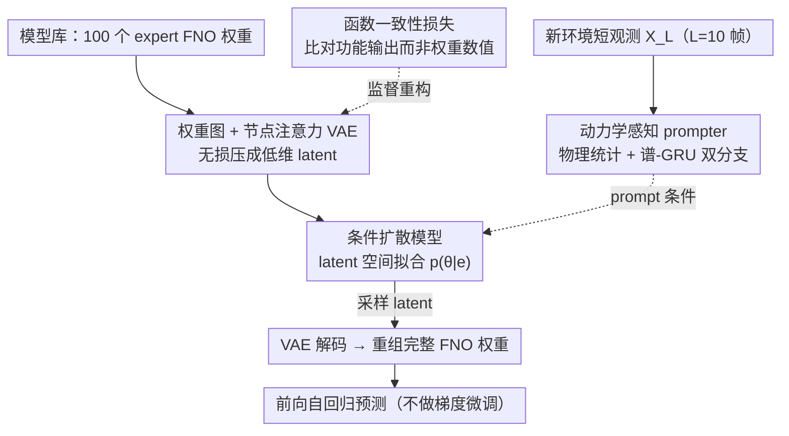

# DynaDiff: Generative Adaptation of Dynamics to Environmental Shifts via Weight-space Diffusion

**会议**: ICML 2026  
**arXiv**: [2505.13919](https://arxiv.org/abs/2505.13919)  
**代码**: https://github.com/tsinghua-fib-lab/DynaDiff (有)  
**领域**: 扩散模型 / 科学机器学习 / 元学习  
**关键词**: 权重空间扩散, 动力学预测, 跨环境泛化, Schrödinger-bridge 替代, 元学习

## 一句话总结
DynaDiff 把"为新环境训练一个预测器"的元学习问题改写成"用扩散模型直接生成完整网络权重"的条件采样问题，借助权重图 + 函数一致性损失 + 动力学感知 prompter，在 4 个 PDE 系统上平均 RMSE 比强基线再降 10.78%。

## 研究背景与动机

**领域现状**：数据驱动的动力学预测（FNO、Transformer 神经算子等）已经在分子动力学、流体力学、气象上替代传统数值方程求解；处理跨环境（不同雷诺数、不同外力等）的两条主流路线是 (i) 元学习把权重拆成 environment-shared + environment-specific context，新环境上只更新 context；(ii) 训练一个超大基础模型再 fine-tune 一小撮参数。

**现有痛点**：两类方法只允许"在权重空间的一个小局部子空间里调整"，无法表征专家权重在不同环境下张成的完整流形；而且都依赖梯度优化或巨型骨干，部署到数据稀缺或硬件受限的场景非常吃力。

**核心矛盾**：动力学函数空间和环境空间之间存在天然耦合 $\frac{dx}{dt}=f(x,t,e)$，最优解是 environment-dependent 的"整套权重"，但现有范式被迫只能优化权重的某个子集，导致表达力天花板。

**本文目标**：建模 $p(\theta\mid e)$ 的联合分布，给定新环境的几帧观测就一次性生成完整 expert 权重 $\theta_{new}$，完全避免推理时的梯度反传。

**切入角度**：把"模型权重"当做和图像、文本同等地位的数据模态，用 latent diffusion 在权重空间上做条件生成；但权重有三个独特挑战——拓扑结构不能展平、参数空间维度极高且 MSE 度量失真、新环境只有短轨迹做条件。

**核心 idea**：用"权重图 + 函数空间一致性 VAE + 动力学感知 prompter"三件套，把权重生成做成一次纯前向的采样过程。

## 方法详解

### 整体框架
DynaDiff 要解决的是"换了环境就得重新训一个动力学预测器"这件事，办法是把"训练权重"改写成"采样权重"。离线阶段它先在所有可见环境上预训练一个 base FNO，再为每个环境快速 fine-tune 出一个 expert，攒成规模 100 的 model zoo；接着把每个 expert 的权重整理成"权重图"，过一个节点注意力 VAE 压成低维 latent；最后在这个 latent 空间上训练条件扩散模型 $\epsilon_\theta(z_n,n,\text{prompt})$，其中 prompt 由 dynamics-informed prompter 从短观测序列 $X_L$ 提取。

到了在线阶段，整条链路是一次纯前向的采样：拿到新环境的 $L=10$ 帧观测，prompter 产出条件向量，扩散模型采样出 latent，VAE 把它解码回权重图并重组成完整 FNO 权重，再直接用这套权重跑 100 步自回归预测——全程不碰任何梯度更新，把分钟级的微调压成毫秒级的一次采样。

### 关键设计

**1. 权重图 + 节点注意力 VAE：把网络权重无损搬进扩散友好的 latent**

权重要喂进扩散模型，最直接的做法是 flatten 成一串 token，但那样会丢掉网络的连接拓扑，而改用稠密边特征又太贵。DynaDiff 的折中是把每层的输出神经元 / 输出通道当作图节点：线性层有 $D_{out}$ 个节点、每个节点特征是流入它的全部权重加偏置拼成的 $D_{in}+1$ 维向量，卷积层则是 $C_{out}$ 个节点、每个 $C_{in}\cdot h\cdot w+1$ 维，skip connection 的权重附加到 merge 节点上。跨层依赖不用 GNN 而用 multi-head attention 来建模，好处是不依赖固定边结构、能自动适配各种拓扑，节点级聚合也在计算量和表达力之间取了平衡，让任意架构的权重都能无损映射到一个低维、适合扩散的 latent。

**2. 函数一致性损失替代 MSE 重构：让重构在"行为"而非"数值"上对齐**

神经网络的损失景观高度多模态，参数差很多但函数等价的解比比皆是，如果 VAE 还按朴素的 $\|\hat{\mathbf{w}}-\mathbf{w}\|^2$ 来重构，就会把这些"行为相同"的权重当成完全不同的样本，latent 空间被这种参数置换噪声主导，扩散模型根本学不出有意义的条件分布。DynaDiff 把重构项换成函数空间一致性损失 $L_{func}=\mathbb{E}_{x_i}\|f_{\hat{\mathbf{w}}}(x_i)-f_{\mathbf{w}}(x_i)\|_2^2$，即过同一组输入比较两套权重的输出，只要功能等价就算重构成功。这样 latent 在功能语义意义上变得平滑，扩散模型才能稳定拟合 $p(\theta\mid e)$（附录 G 进一步给出了对应的泛化误差界）。

**3. 动力学感知 prompter：从几帧短观测里反推"这是哪个环境"**

实际部署时看不到雷诺数这类环境标签，只能从一小段轨迹里反推环境身份，可纯数据驱动的特征容易过拟合到样本噪声、纯物理统计量又表达力不足。prompter 用双分支互补来兼顾两者：显式分支提取物理统计量（一阶/二阶矩、能量、enstrophy）的时序均值与趋势，保住物理可解释性；隐式分支把 FFT 得到的实部 / 虚部谱序列过 GRU、取末态隐藏向量，补上数据驱动的灵活度。两路拼接后通过 adaLN 注入 diffusion transformer。训练时把观测长度在 $[1,L]$ 内随机采样，让 prompter 对测试时拿到的不同帧数都保持鲁棒。

### 损失函数 / 训练策略
VAE 目标 $L_{VAE}=-\mathbb{E}[\log p(\mathbf{w}|\mathbf{z})]+\beta\,\mathrm{KL}+\lambda L_{func}$；扩散模型用标准 $\epsilon$-prediction 目标 $L_n=\mathbb{E}\|\epsilon_n-\epsilon_\theta(\sqrt{\bar\alpha_n}z_0+\sqrt{1-\bar\alpha_n}\epsilon_n,n,\text{prompt})\|^2$。Model zoo 构造采用"domain-adaptive initialization"：先训一个共享 base，再加一点单层扰动后 fine-tune 出每个 expert，避免随机初始化带来的非平稳权重分布。

## 实验关键数据

### 主实验
4 个 PDE 系统（Cylinder Flow / Lambda-Omega / Kolmogorov Flow / Navier-Stokes）+ ERA5 真实风速。生成端 ~380M 参数，目标 FNO ~1M 参数。

| 系统 | 指标 | DynaDiff | 最强 meta-learning (GEPS) | 最强权重生成 (D2NWG) | 提升 vs SOTA |
|------|------|---------:|--------------------------:|---------------------:|--------------|
| Cylinder Flow (out-domain) | RMSE | **0.065** | 0.082 | 0.086 | −20.7% |
| Lambda-Omega (out-domain)  | RMSE | **0.091** | 0.092 | 0.105 | −1.1% |
| Kolmogorov Flow (out-domain) | RMSE | **0.079** | 0.086 | 0.090 | −8.1% |
| Navier-Stokes (out-domain) | RMSE | **0.064** | 0.099 | 0.089 | −35.4% |

DynaDiff 在部分环境上甚至能超过 One-per-Env（每个环境单独训练一个 FNO 的"上界"），作者归因于优化器训练有时陷入局部最优，而扩散采样在权重流形上更稳。

### 消融实验

| 配置 | RMSE (Kolmogorov) | 说明 |
|------|------------------:|------|
| Full DynaDiff | 0.079 | 完整模型 |
| w/o 函数损失 | ↑明显 | VAE 退化到纯 MSE，OOD 上掉点严重 |
| w/o domain init | ↑显著 | model zoo 用随机初始化，权重分布过散 |
| Model zoo size 50 → 25 | 性能开始退化 | zoo ≥50 才稳定 |
| 观测长度 $L$=1 vs 10 | 退化温和 | 变长训练让 prompter 鲁棒 |
| 神经元随机 permutation 10% | 几乎不变 | 全局 attention 自动适配等价排列 |

### 关键发现
- **函数损失贡献最大**：去掉后 OOD 上掉得最猛，验证了"权重相似度应该用功能相似度衡量"的核心假设。
- **生成器参数随 predictor 线性增长**：MLP 模块参数 $O(Ld^2)$，但权重图节点数 $O(Ld)$、特征维 $O(d)$，attention 与节点数无关，所以生成器只随 $L,d$ 线性扩展，而不是随 predictor 总参数指数爆炸。
- **可解释性**：encoder attention 矩阵呈现块对角结构，块边界对齐 FNO 的 lifting / fno_blocks / projection 三段，且不同环境下结构稳定 —— DynaDiff 识别的是拓扑级别的不变功能划分，而非数值权重本身。
- **采样稳定**：100 次重复采样在 10 个 OOD 环境下方差极低，"最差样本"仍优于最强 baseline。

## 亮点与洞察
- **范式跳跃**：把"梯度微调"换成"前向生成"。对部署而言，新环境的适应从分钟级变成毫秒级，且免去梯度反传所需的显存。
- **权重图 + attention 是 model-agnostic 的**：实验把 FNO 换成 WNO、UNO 表现都稳，说明这是一个能复用到其他算子族的通用接口。
- **函数损失是个可迁移的 trick**：任何"权重作为模态"的生成任务（hypernetwork、LoRA 生成、神经场生成）都可以借鉴这个"用 output 一致性代替 weight MSE"的技巧。
- **domain-adaptive model zoo 是隐性核心**：作者反复强调"sample quality > diversity"，这与 D2NWG 等随机初始化的权重生成方法形成鲜明对比，提示后续工作不要忽视训练数据本身的分布平滑性。

## 局限与展望
- Model zoo 构造仍需"为每个可见环境训一个 expert"，offline 成本随环境数线性增加，对环境数极多的场景仍重。
- 目前只覆盖到 ~1M 参数的小算子；扩散生成能否扩展到 100M+ 的 foundation model 权重还未验证。
- prompter 假设 $L=10$ 帧足够区分环境，对高混沌系统或观测噪声大的场景，物理统计量和谱特征可能失效。
- 没有讨论生成权重的安全性 —— 扩散采样有可能落到模型 zoo 之外的"看似合理实则崩坏"的权重，论文仅用"最小重构残差"做后筛。

## 相关工作与启发
- **vs CoDA / GEPS / CAMEL**: 元学习路线只更新环境上下文 + 共享权重，新环境仍需梯度；DynaDiff 直接生成整套权重，搜索空间和表达力都更大。
- **vs Poseidon / DPOT / MPP**: 600M 级 foundation model 走 ERM 路线；DynaDiff 用 380M 生成器配 1M expert，总参数相当但分工不同——大模型负责"造小模型"，推理时只跑小模型。
- **vs D2NWG / CVAE / HyperDiffusion**: 同样是权重空间扩散，但 D2NWG 把权重 flatten 成序列、CVAE 缺少几何约束；DynaDiff 的权重图 + 函数损失让 JSD 显著更低，分布拟合更紧。
- **可迁移启发**：把模型权重当作数据模态、用功能等价性而非数值等价性来定义相似度，这两点对 LoRA 生成、神经场超网络、continual learning 等都有直接借鉴价值。

## 评分
- 新颖性: ⭐⭐⭐⭐⭐ 把"为每个环境训一个网络"重新框定为"采样一个网络"，权重图 + 函数损失组合在科学 ML 里属首次。
- 实验充分度: ⭐⭐⭐⭐⭐ 4 个 PDE + 1 个真实数据集，14 个 baseline，6 个维度消融（zoo size / 环境数 / 观测长度 / permutation / 函数损失 / domain init），还附了泛化误差界证明。
- 写作质量: ⭐⭐⭐⭐ 主线清晰、图表充足；少数地方（如 prompter 双分支）需要翻附录才能补全细节。
- 价值: ⭐⭐⭐⭐⭐ 给"weight-as-modality"研究提供了完整范式与可复现代码，对边缘部署的科学计算有实际推动力。

<!-- RELATED:START -->

## 相关论文

- [\[ICML 2026\] Compression as Adaptation: Implicit Visual Representation with Diffusion Foundation Models](compression_as_adaptation_implicit_visual_representation_with_diffusion_foundati.md)
- [\[CVPR 2026\] Scale Space Diffusion：把尺度空间塞进扩散过程](../../CVPR2026/image_generation/scale_space_diffusion.md)
- [\[CVPR 2026\] Guiding a Diffusion Transformer with the Internal Dynamics of Itself](../../CVPR2026/image_generation/guiding_a_diffusion_transformer_with_the_internal_dynamics_of_itself.md)
- [\[NeurIPS 2025\] PID-controlled Langevin Dynamics for Faster Sampling of Generative Models](../../NeurIPS2025/image_generation/pid-controlled_langevin_dynamics_for_faster_sampling_of_generative_models.md)
- [\[CVPR 2026\] LoFA: Learning to Predict Personalized Prior for Fast Adaptation of Visual Generative Models](../../CVPR2026/image_generation/lofa_learning_to_predict_personalized_prior_for_fast_adaptation_of_visual_genera.md)

<!-- RELATED:END -->
