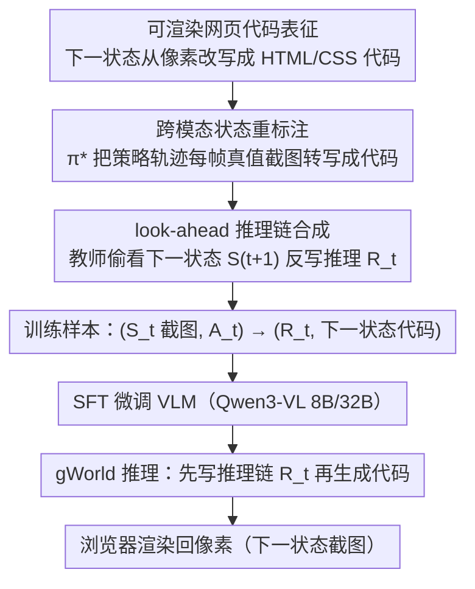

# Generative Visual Code Mobile World Models

**会议**: ICML 2026  
**arXiv**: [2602.01576](https://arxiv.org/abs/2602.01576)  
**代码**: 有（论文提供 Project Page、Code、gWorld 8B/32B 权重与 MWMBench 基准）  
**领域**: LLM Agent / 多模态 VLM / 移动 GUI 世界模型  
**关键词**: 移动 GUI 世界模型、可渲染代码生成、VLM 后训练、跨模态重标注、look-ahead 推理

## 一句话总结
作者把"移动 GUI 世界模型"重新表述成"VLM 生成可渲染的网页代码"这一新范式，配套提出一套自动把策略轨迹改写成（图像状态、动作）→（推理链、下一状态代码）训练样本的数据合成管线，得到的 gWorld-8B/32B 在 6 个 in/out-of-distribution 基准上同时拿下最佳，并把基线模型平均指令准确率拉高 27–46 个百分点、把渲染失败率压到 <1%。

## 研究背景与动机

**领域现状**：移动 GUI 智能体（mobile GUI agent）近两年是热门方向，主流提升手段之一是引入"世界模型（World Model, WM）"：给定当前 GUI 状态 $S_t$ 与动作 $A_t$，预测下一状态 $S_{t+1}$，从而在训练时增强策略、推理时做 rollout 价值估计。现有 WM 大致分两类：(1) **文本型 WM**——把状态压缩成文字描述后预测，丢失了图标、版式、字体、颜色等关键视觉信息；(2) **视觉型 WM**——直接生成下一张 GUI 截图，例如 VIMO 用了一条"OCR→box mask→GPT-4o 过滤→自训扩散模型补图→两次 GPT-4o 回填文字"的 5 段式流水线。

**现有痛点**：文本型 WM 牺牲了视觉保真度，没法跟主流 VLM 策略对接；纯像素的视觉型 WM 在 GUI 这种"文字密集 + 离散版式"的场景里很吃亏——扩散/自回归像素模型出来的文字常常不可读、版式扭曲，被迫依赖一整条慢、复杂、闭源、还需要多次调 GPT-4o 的外部管线。VIMO 又只发了数据没发权重，难以复现部署。

**核心矛盾**：GUI 状态既要求**像素级保真**（截图能直接 grounding），又要求**符号级精确**（文字、按钮、列表必须准），这两个要求让"直接预测像素"的范式陷入两难——图像模型擅长视觉但写不好字，文字模型写得好字但丢了视觉。同时，作者通过观察发现，GUI 转移其实有大量视觉冗余（如打字时大部分像素不变），像素模型容易学到"近似复制 $S_t$"的退化解，反而在相似度指标上看着不差，骨子里却没建模动作语义。

**本文目标**：用**单一自包含模型**完成"视觉 mobile GUI 世界建模"，要求同时满足——(a) 字、版式像素级正确；(b) 端到端无需多模型流水线；(c) 训练数据可大规模合成；(d) 动作保留原生坐标，能直接对接真实手机执行。

**切入角度**：作者注意到现代 VLM 在预训练阶段大量见过结构化网页代码，并且天然擅长生成可读的文字。如果把"下一状态"表征成**可渲染的 web 代码**（HTML/CSS），然后用浏览器把代码渲染回像素，那么：VLM 的语言先验直接保证文字与语义内容质量，网页代码先验直接保证版式结构，渲染器再把符号化输出"翻译"回像素。这样一来，单个 VLM 同时承担"看图理解状态变化"和"输出结构化下一状态"两件事，外部依赖被消除。

**核心 idea**：把世界模型从 $p_\theta(S_{t+1}^{\text{image}} \mid S_t, A_t)$ 改写成 $p_\theta(R_t, S_{t+1}^{\text{code}} \mid S_t^{\text{image}}, A_t)$——VLM 直接生成"先推理、再写代码"的下一状态描述，浏览器负责渲染回像素。

## 方法详解

### 整体框架
gWorld 把"预测下一张 GUI 截图"这件难事换了个表征空间：让一个标准 VLM（基座 Qwen3-VL 8B / 32B）去生成下一状态的可渲染网页代码，再由浏览器确定性地渲染回像素。要让 VLM 学会这件事，作者先用一条数据合成管线把现成的 mobile agent 策略轨迹自动改造成"截图+动作→推理链+下一状态代码"的训练样本，在 26 万条这样的样本上做监督微调（SFT），最后用"浏览器渲染 + 三家前沿 VLM 联合判分"来评估。工程上整条链路就是"一个 VLM + 一个渲染器"，对比 VIMO 那种 OCR/扩散/多次调 GPT-4o 的 5 段式管线极简。

### 关键设计

**1. 用可渲染网页代码替换像素作为下一状态表征：让 VLM 的语言先验绕开图像模型写不好字的弱点**

GUI 状态的难点在于它同时要求像素级保真和符号级精确，而直接生成像素的图像模型在这两点上都吃亏——文字不可读、版式扭曲，更糟的是会退化成"几乎复制输入 $S_t$"的捷径解：消融里 Emu3.5 34B 的输出相似度与 $\text{Sim}(S_t, S_{t+1})$ 的 Pearson 相关高达 $\rho=0.92$，几乎是 identity mapping，相似度好看但根本没建模动作。作者的做法是把预测目标从图像 $S_{t+1}^{\text{image}}$ 改成 HTML/CSS 代码 $S_{t+1}^{\text{code}}$，即把世界模型形式化为 $p_\theta(S_{t+1}^{\text{code}} \mid S_t^{\text{image}}, A_t)$，VLM 输出 token 序列而非像素，像素一致性完全交给浏览器渲染。这样文字逐字正确由 VLM 的语言先验保证，版式与组件结构由预训练里见过的大量网页代码提供强归纳偏置；更关键的是代码空间把"结构变化"显式化了，VLM 必须真的理解动作才能改对节点，没法靠近似复制取巧——gWorld 32B 的相关系数因此只有 $\rho \approx 0.4$。

**2. 跨模态状态重标注：把现成策略轨迹无损搬运成世界模型训练数据**

代码型 WM 没有现成数据集，从零人工标注代价高到不可接受，但 mobile agent 的策略轨迹异常丰富（作者算出仅 AitW / GUIO / AC / AMEX 四个公开集就能榨出 370 万条 transition）。于是作者分两步把策略数据搬过来：先把一条长度 $T$ 的 episode $\{(S_t^{\text{image}}, A_t)\}_{t=1}^{T}$ 里"第 $t$ 步动作"这条监督换成"第 $t+1$ 步状态"作目标，每条 episode 就产出 $T-1$ 条 transition；再调用前沿模型 $\pi^*$（Gemini 3 Flash）做 image-to-code 重标注 $S_t^{\text{code}} \leftarrow \pi^*(S_t^{\text{image}}, P^{\text{img-to-code}})$，把每一帧 ground-truth 截图转写成可渲染代码当目标。整条数据是全自动合成、零人工成本的。值得强调的是"重标注 ground-truth 帧"而非"让 $\pi^*$ 直接从 $(S_t^{\text{image}}, A_t)$ 一次性 zero-shot 预测 $S_{t+1}^{\text{code}}$"——前者因为有真实像素兜底，生成代码的可渲染率与 IAcc. 都是 100%，比后者高 +5.4% IAcc.（表 3）。而且图 5 的幂律外推显示 gWorld 远未饱和，只要继续把剩余轨迹翻成代码，性能还能接着涨。

**3. look-ahead 推理链合成：让教师偷看未来，把"图→代码"难题拆成两步**

直接让 VLM 一次性吐代码很难，它要同时完成"理解动作影响 + 设计 DOM 结构 + 写对每个字符"三件事。作者的对策是在 SFT 标签里于 $S_{t+1}^{\text{code}}$ 前再插一段自然语言推理链 $R_t$，把训练目标变成 $(S_t^{\text{image}}, A_t) \rightarrow (R_t, S_{t+1}^{\text{code}})$，等于强迫模型先用语言描述状态如何变化、再翻译成代码，把一个难问题分解成两个简单子问题。这里的窍门是合成 $R_t$ 时**让标注模型 $\pi^*$ 偷看 ground-truth 下一状态** $S_{t+1}^{\text{image}}$，即 $R_t \leftarrow \pi^*(S_t^{\text{image}}, A_t, S_{t+1}^{\text{image}}, P^{\text{look-ahead}})$，让它解释"在动作 $A_t$ 作用下从 $S_t$ 到 $S_{t+1}$ 究竟发生了什么"。推理时学生模型当然看不到未来，但因为训练标签是"带答案回写的正确推理"，质量远高于盲推——消融（图 6）显示相同 37K 样本下，look-ahead 的 $R_t$ 在五个基准上一致优于无 look-ahead 的 $R_t^*$，说明真正起作用的不只是"有 reasoning"，而是 reasoning 本身的正确性。

### 损失函数 / 训练策略
标准 SFT 交叉熵，目标序列同时包含 $R_t$ 与 $S_{t+1}^{\text{code}}$。基座选 Qwen3-VL 8B/32B（开源 VLM 前沿），数据集总规模 260K，合成模型 $\pi^* =$ Gemini 3 Flash。评估侧用三家前沿 VLM 联合判分（GPT-5 Mini、Claude 4.5 Haiku、Gemini 3 Flash）以消除 judge family bias，并对不可渲染代码用规则过滤器直接判失败。

## 实验关键数据

### 主实验
覆盖 4 个 in-distribution（AitW / GUIO / AC / AMEX）+ 2 个 out-of-distribution（AndroidWorld / KApps）共 6 个基准，对比 8 个前沿开源基线，包括图像生成模型（Qwen-Image-Edit 20B, Emu3.5 34B）与大尺寸 VLM（Llama 4 109B/402B、Qwen3-VL 8B/32B/235B、GLM-4.6V 106B）。

| 模型 | 参数量 | 平均 IAcc.↑ | 平均渲染失败↓ | 平均 Similarity↑ |
|------|--------|------------|--------------|-----------------|
| Qwen-Image-Edit | 20B | 13.4 | — | 65.2 |
| Emu3.5 | 34B | 25.8 | — | 70.5 |
| Llama 4 | 402B-A17B | 55.7 | 9.2 | 62.4 |
| Qwen3-VL | 32B | 52.5 | 11.0 | 63.3 |
| Qwen3-VL | 235B-A22B | 51.5 | 29.5 | 67.6 |
| GLM-4.6V | 106B | 67.4 | 2.5 | 69.6 |
| **gWorld** | **8B** | **74.9** | **1.4** | **70.3** |
| **gWorld** | **32B** | **79.6** | **0.6** | **71.4** |

gWorld-8B 在 IAcc. 上击败了体量 50.25× 的 Llama 4 402B 与 13.25× 的 GLM-4.6V 106B；相对其基座 Qwen3-VL 8B/32B 的提升分别是 +45.7 / +27.1 个百分点，渲染失败率从 40.1% / 11.0% 压到 <1%。OOD 基准（AW、KApps）退化也极轻微，泛化能力突出。

### 消融实验
| 配置 | 关键指标 | 说明 |
|------|---------|------|
| 朴素 $S_{t+1}^{\text{code}}$ 合成（$\pi^*$ 直接预测） | 可渲染 97%，IAcc. 94.6% (Gemini Pro) | 不靠 ground-truth 像素 |
| **本文：跨模态重标注 ground-truth** | 可渲染 100%，IAcc. 100% | +5.4% IAcc. |
| 无 look-ahead $R_t^*$ | 5 个基准全部更低 | 仅看 $(S_t, A_t)$ 写推理 |
| **本文：look-ahead $R_t$** | 5 个基准一致更高 | 教师偷看 $S_{t+1}$ |
| Qwen3-VL 8B 基座 | 29.2% 平均 IAcc. | 无 SFT |
| **gWorld 8B（37→240K 数据）** | 幂律涨，$R^2 \geq 0.94$ | 数据 scaling 远未饱和 |

### 关键发现
- **图像生成模型是 GUI 世界建模的伪强者**：Emu3.5 34B 输出几乎复制输入（$\text{Sim}(\hat S_{t+1}, S_{t+1}) \approx \text{Sim}(S_t, S_{t+1})$，$\rho=0.92$），相似度看起来不错但 IAcc. 仅 25.8%；gWorld 真的在"改变结构"，$\rho \approx 0.4$ 且增益方差大。说明传统视觉相似度指标在 GUI 上具有强欺骗性，必须配合动作条件 IAcc.。
- **数据合成两步都不可省**：跨模态重标注 + look-ahead 推理两件事在消融里都是必需的，前者保证标签可渲染且语义正确，后者把"图→代码"难题拆成两步，缺一个都会回退。
- **代码表征不怕照片**：在占 17.4% 的 photo-realistic GUI 状态（如相机预览）上，gWorld 8B 相对其他状态只掉 0.66%，说明"代码无法精确表示照片"并不是瓶颈，因为绝大多数 GUI 转移都是文字/结构性的。
- **下游策略可直接吃到红利**：把 gWorld 8B 接到 M3A agent 做 K=3 候选 rollout + value 估计，平均成功率比 backbone-only 高出 +7.6 个点，比"用同尺寸 Qwen3-VL 8B 当 WM"高出 +22.4 个点，证明更好的 WM = 更好的 agent。

## 亮点与洞察
- **范式级 reframe**：把"视觉世界建模"重新定义为"结构化代码生成 + 确定性渲染"，本质上是用 VLM 的语言能力绕开图像模型的物理弱点。这种"换一个表征空间让难题变简单"的思路可以迁移到很多受文字精度卡脖子的视觉生成任务（如海报、PPT、文档版面、UI 设计稿生成）。
- **教师偷看未来 = 高质量推理监督**：look-ahead reasoning 的窍门很值得记。给标注模型额外提供"答案"再让它回写"为什么"，比让它盲推有数量级的质量差距，且推理时学生模型并不会作弊——这套路在任何"过程监督 + 结果监督"两阶段任务里都能用。
- **数据合成的杠杆**：把"策略轨迹"无损改造成"世界建模数据"打开了一扇 370 万条样本的窗户，幂律外推显示性能还会继续涨。这暗示了一条 mobile/GUI 领域的廉价 scaling 路径：策略数据收集成本远低于世界建模数据，而前者完全可以喂后者。
- **评估也立了一块碑**：MWMBench 在动作空间上保留原生坐标（不再让 GPT-4o 把坐标翻译成自然语言），并第一次系统加入 OOD 测试，把"视觉 mobile WM 怎么评"这件事做正了。

## 局限性 / 可改进方向
- **代码空间天花板**：当 GUI 包含真实照片、视频、复杂 SVG 图标时，纯 HTML/CSS 表征会有信息损失，gWorld 32B 在 photo-realistic 子集上确实掉了 4.7 个点。可改进方向是混合表征——结构部分写代码、照片部分嵌入像素或扩散补全。
- **依赖前沿教师 $\pi^*$**：整条数据管线靠 Gemini 3 Flash 做 image-to-code 与 look-ahead reasoning，开源完全替代时质量是否守得住未知；对 $\pi^*$ 的错误传递也未做深入分析。
- **只在 mobile 域验证**：网页代码先验恰好对手机 GUI 很合适，但要扩到桌面 GUI（macOS/Win）甚至游戏 UI，代码 schema 是否同样高效仍待证；可能需要不同的 DSL 或者把代码空间换成 Compose/SwiftUI 之类的声明式 UI 框架。
- **推理时延**：模型要先输出长 reasoning 再吐一长串 HTML/CSS，每步 token 量远超直接像素扩散，落到 on-device 部署时延迟与功耗是个问号。

## 相关工作与启发
- **vs VIMO（Luo et al., 2025）**：VIMO 是上一代视觉 mobile WM 的代表，用 OCR + GPT-4o + 扩散 + GPT-4o 的 5 段式管线，且权重不开源、动作要被翻译成自然语言；本文用单个 VLM + 浏览器渲染替换整条管线，动作保留坐标，权重全开，IAcc. 与可复现性双双反超。
- **vs 像素生成 WM（Qwen-Image-Edit 20B, Emu3.5 34B）**：它们能保住 perceptual similarity 但因为"近似复制 $S_t$"在 IAcc. 上一败涂地（10–29%），说明纯像素范式在 GUI 这种符号密集场景里几乎走不通；本文实证地把这条死路标了出来。
- **vs Code-based World Model（Dainese et al. 2024, Copet et al. 2025；Feng et al. 2025）**：之前的 code-based WM 是为代码生成或虚构游戏世界设计，本文第一次把"代码 WM"思路移植到 mobile GUI，并且配套了大规模数据合成方案。
- **vs Image-to-Web-Code（Yun et al. 2024, Si et al. 2025 等）**：那条线是把"现有网页截图"转成代码用于前端自动化；本文证明同一类能力可以被"折叠"进世界建模训练，从单纯的复刻任务升级为"预测动作后的下一状态代码"。
- **启发**：可以把"用结构化代码替代像素"的思路推广到文档编辑、PPT 生成、IDE 自动补全 UI、Figma 设计稿等任意"语义结构远比像素重要"的场景；也可以把 look-ahead 教师范式用到 robot manipulation 的 video WM 上——让标注器偷看真实未来帧再写控制级解释。

## 评分
- 新颖性: ⭐⭐⭐⭐⭐ 把视觉世界建模 reframe 成可渲染代码生成是干净利落的范式级创新，在 GUI 领域属于第一次。
- 实验充分度: ⭐⭐⭐⭐⭐ 6 基准（4 ID + 2 OOD）、8 个前沿基线、人工评估、数据 scaling law、消融、下游策略对接，全套打满。
- 写作质量: ⭐⭐⭐⭐ 结构清晰、图 4 的相似度分析很漂亮，但前面相关工作的引用堆得稍密。
- 价值: ⭐⭐⭐⭐⭐ 既开源 8B/32B 权重和 MWMBench，又给 mobile GUI agent 社区指了一条"代码=新像素"的可复制路径，落地与研究双重价值。

<!-- RELATED:START -->

## 相关论文

- [\[ICML 2026\] Threshold-Guided Optimization for Visual Generative Models](threshold-guided_optimization_for_visual_generative_models.md)
- [\[CVPR 2026\] Evaluating Generative Models via One-Dimensional Code Distributions](../../CVPR2026/image_generation/evaluating_generative_models_via_one-dimensional_code_distributions.md)
- [\[CVPR 2026\] A Style is Worth One Code: Unlocking Code-to-Style Image Generation with Discrete Style Space](../../CVPR2026/image_generation/a_style_is_worth_one_code_unlocking_code-to-style_image_generation_with_discrete.md)
- [\[ICML 2026\] Compression as Adaptation: Implicit Visual Representation with Diffusion Foundation Models](compression_as_adaptation_implicit_visual_representation_with_diffusion_foundati.md)
- [\[ICML 2026\] Conf-Gen: Conformal Uncertainty Quantification for Generative Models](conf-gen_conformal_uncertainty_quantification_for_generative_models.md)

<!-- RELATED:END -->
