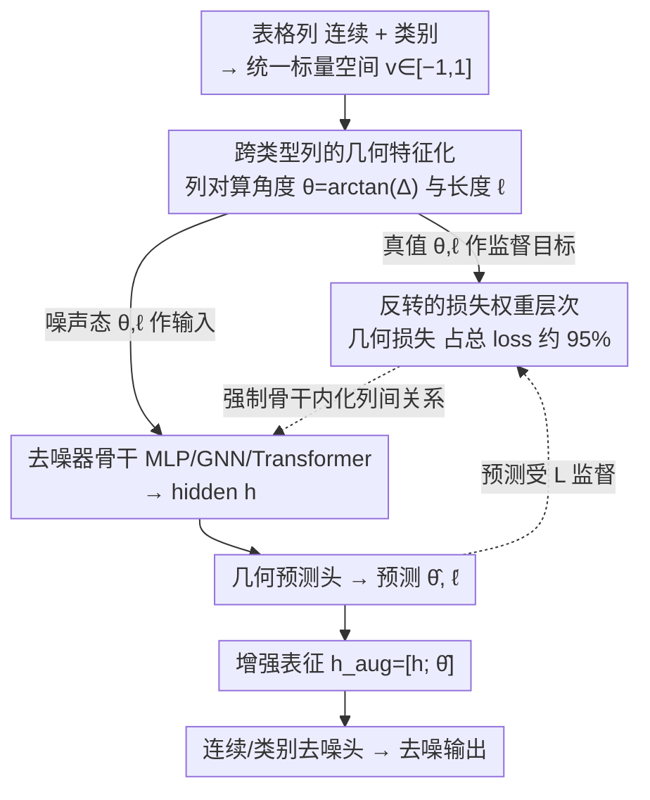

# Geometry-Aware Tabular Diffusion

**会议**: ICML 2026  
**arXiv**: [2606.02607](https://arxiv.org/abs/2606.02607)  
**代码**: 待确认  
**领域**: 表格数据生成 / 扩散模型 / 几何深度学习  
**关键词**: 表格扩散、列间几何特征、辅助监督、可移植归纳偏置、TabDiff

## 一句话总结
作者提出 GATD（Geometry-Aware Tabular Diffusion），在表格扩散去噪器输入和损失里显式加入"列对之间的角度和长度"几何特征作为辅助监督信号，用一个参数量仅 TabDiff 1/3.5（分类任务甚至 1/25）的小 MLP 就在 10 个数据集上拿下 8/10 Shape、7/10 Trend、9/10 下游效用胜场，并且同一套默认超参可直接迁移到 GNN 和 Transformer 去噪器（27/30 Shape、25/30 Trend 涨点）。

## 研究背景与动机

**领域现状**：表格数据是企业、医疗和科研里最常见的数据形态，合成表格被广泛用于隐私保护下的数据共享和数据增强。近两年扩散模型成为表格合成主流，TabDDPM、STaSy、TabSyn、TabDiff 依次刷点，其中 TabDiff 用 Transformer 自注意力建模列间关系，是当前 SOTA。

**现有痛点**：所有这些方法都把"列与列之间应该如何协同变化"这一关系信号完全交给去噪损失隐式学习——Transformer 注意力虽然灵活，但需要靠去噪 MSE 这种远端、弱监督的目标自己摸索出列间结构。结果是模型越大、训练越久才能学好，跨架构迁移也没有共享的归纳偏置。

**核心矛盾**：表格列之间客观存在可计算的几何关系（如两列数值差的方向和幅度），但现有架构既不把它喂给模型，也不要求模型显式预测它，等于把一个免费的、可监督的结构信号扔掉了。

**本文目标**：(1) 把列对几何关系做成显式、可微的特征 + 辅助预测目标；(2) 验证这种监督信号是否能跨 MLP / GNN / Transformer 三种去噪器迁移；(3) 用一个尽量小的 MLP 去挑战 Transformer SOTA。

**切入角度**：作者借鉴几何深度学习的思路——既然 GNN、点云、Transformer 位置编码的成功都来自"显式给出几何结构"，那表格的列对差值也可以被参数化为类似图边的几何量。但关键在于：他们用一组架构匹配的消融证明，**只把几何特征喂进去没有任何收益（Cohen's $d=-0.08$），必须把它作为辅助预测目标做监督才有大效应（$d=0.81$）**。也就是说真正起作用的不是"看到了几何"，而是"被强迫学会几何"。

**核心 idea**：用每对列值差的 $\arctan$（角度）和 $\frac{1}{2}\log(1+\Delta^2)$（长度）构造显式几何目标，权重远超扩散损失本身（约占总 loss 95%），强迫去噪器把列间关系内化进表征，这就是一种"可移植到任意去噪架构"的关系归纳偏置。

## 方法详解

### 整体框架
GATD 要解决的是"列间关系全靠去噪 MSE 隐式学、学得慢又不可迁移"的问题，做法是保留 TabDiff 的扩散底座（连续列走 EDM、类别列走 masked diffusion、per-column 可学习的 $\rho$ 噪声调度），在去噪器外面套一层"几何输入 + 几何预测头 + 几何监督"，把列对之间的角度/长度从一个被丢弃的免费信号变成被强制学习的辅助目标。

具体地，所有列先被映射到统一标量空间 $v\in[-1,1]^d$，对 $\binom{d}{2}$ 个列对算出真实角度 $\theta_{ij}$ 与长度 $\ell_{ij}$ 当监督目标、噪声态下的同名几何量当输入；去噪器吃进 `[时间嵌入; 加噪连续; one-hot 类别; 输入角度; 输入长度]` 产出 hidden $\mathbf{h}$，几何头从 $\mathbf{h}$ 预测 $\hat{\boldsymbol{\theta}}$（$\frac{\pi}{2}\tanh$ 约束）和 $\hat{\boldsymbol{\ell}}$，再把增强表征 $\mathbf{h}_{\text{aug}}=[\mathbf{h};\hat{\boldsymbol{\theta}}]$ 喂回连续/类别去噪头。采样阶段照算几何输入但不做几何监督，且长度头被 detach（长度经平方丢了符号信息，只在训练当正则、不进 $\mathbf{h}_{\text{aug}}$），生成后用反射（$s\mapsto 2-s$ 或 $s\mapsto -s$）而非硬裁剪把越界值折回 $[0,1]$，避免合成数据在分位数边界堆积。

### 关键设计

**1. 跨类型列的几何特征化：把任意两列的差值无损编码成一对有界几何量**

要让一个统一的几何信号同时覆盖连续列和类别列，前提是有一个共同的标量空间，所以连续列走分位数变换 $v=2\cdot\text{QT}(x)-1$、类别列走固定确定性映射 $v=2\cdot\text{idx}/\max(\text{card}-1,1)-1$，都落到 $[-1,1]$。随后对每个 $i<j$ 计算角度 $\theta_{ij}=\arctan(v_j-v_i)$ 和长度 $\ell_{ij}=\frac{1}{2}\log(1+(v_j-v_i)^2)$：$\arctan$ 让角度天然有界且反对称，$\log$ 对大差值做对数压缩，消融显示直接用原始差值当目标会略弱，正是因为有界目标更稳定。由于 $v_j-v_i=\tan(\theta_{ij})$ 可从角度反解，角度信息严格强于长度，所以只有预测角度被拼回 $\mathbf{h}_{\text{aug}}$。用固定映射而非可学嵌入是为了让几何特征"现算现用"、不引入额外可训练参数，顺带还让序数类别（教育程度、Likert 量表）自动获得有序强化。

**2. 架构匹配的"输入 vs 监督"对照：把效益干净归因到监督而非容量**

几何到底是靠"被模型看见"起作用，还是靠"被强迫预测"起作用？为剥离这个混淆变量，作者构造三档配置——NoGeom（完全无几何）、InputsOnly（喂几何、装预测头，但 $\lambda_\theta=\lambda_\ell=\lambda_c=0$）、+Geom（喂几何 + 预测头 + 权重打开），三者架构、参数量、梯度拓扑完全一致，唯一开关就是"是否给几何损失权重"。结果 InputsOnly vs NoGeom 的 Cohen's $d=-0.08$（几乎为零），而 +Geom vs NoGeom 的 $d=0.81$（大效应），干净地证明真正起作用的是辅助监督，不是几何输入也不是额外容量。这也回答了"为什么 Transformer 自注意力学不到这种结构"——不是学不到，而是没有人逼它学；它是全文最有说服力的方法论贡献。

**3. 反转的损失权重层次：让几何辅助任务占总 loss 约 95%**

默认权重 $(\lambda_\epsilon,\lambda_{\text{cat}},\lambda_\theta,\lambda_\ell,\lambda_c)=(1.0,0.05,15,15,8)$，使收敛时几何项加权后约占总 loss 的 95%，去噪本身只剩 5%，相当于强迫骨干先把列间关系编码进表征、再"顺带"完成去噪。其中一致性损失 $\mathcal{L}_c=\mathbb{E}[(1-t)^2]\cdot(\|\hat{\boldsymbol{\theta}}-\text{sg}(\boldsymbol{\theta}_{\text{pred}})\|^2+\|\hat{\boldsymbol{\ell}}-\text{sg}(\boldsymbol{\ell}_{\text{pred}})\|^2)$ 用 $(1-t)^2$ 在低噪声段强约束几何头的预测要与从去噪输出反算出的几何一致。这个权重层次和多任务学习"辅助任务权重要小"的常识相反——权重消融里把几何降到和扩散同量级反而掉点，原因是去噪 MSE 是空间局部的逐元素目标、梯度不会指向"理解列对关系"，必须由更重的辅助损失牵引，学到的几何表征才能反哺去噪；而同一套权重在 MLP/GNN/Transformer 三套骨干上无须重调，说明它是结构性的而非凑出来的。

### 损失函数 / 训练策略
总损失为 $\mathcal{L}=\lambda_\epsilon\mathcal{L}_{\text{cont}}+\lambda_{\text{cat}}\mathcal{L}_{\text{cat}}+\lambda_\theta\mathcal{L}_{\text{angle}}+\lambda_\ell\mathcal{L}_{\text{length}}+\lambda_c\mathcal{L}_{\text{consistency}}$，其中 $\mathcal{L}_{\text{cont}}$ 是 EDM 加权去噪 MSE、$\mathcal{L}_{\text{cat}}$ 是 masked token 上的加权交叉熵、$\mathcal{L}_{\text{angle}}/\mathcal{L}_{\text{length}}$ 直接对真值 $\theta/\ell$ 做 L2、$\mathcal{L}_{\text{consistency}}$ 让预测几何与从去噪输出反算的几何对齐（带 stop-gradient）。优化器用 AdamW + EMA，训练 20,000 epoch（TabDiff 为 8,000）、第 10,000 epoch 后挑最佳；尽管 epoch 多 2.5×，但单步因模型小，端到端 wall-clock 反而比 TabDiff 快 1.7×。采样用 EDM Euler 1000 步 + 类别迭代 unmasking + 反射边界处理。

## 实验关键数据

### 主实验
在 10 个 TabDiff 风格基准（5 分类 + 5 回归，Adult / Beijing / Bikesharing / California / Default / Diabetes / Magic / News / Powerplant / Shoppers）上，3 训练种子 × 20 生成种子。

| 比较维度 | 本文（GATD-MLP） | TabDiff（Transformer SOTA） | 关键改进 |
|---|---|---|---|
| 参数量 | ~400K–6M | ~10M | 平均 3.5×、分类任务最多 25× 更小 |
| Shape 胜场 | **8/10** | 2/10 | Shape 误差降 27% |
| Trend 胜场 | **7/10** | 3/10 | Trend 误差降 20% |
| 下游效用（F1/RMSE） | **9/10** | 1/10 | XGBoost 在合成数据上训练后真实测试集表现 |
| 训练时间 | **1.7× 更快** | 基线 | 即便训了 2.5× 个 epoch |

跨架构可移植性（同一组 $(\lambda_\theta,\lambda_\ell,\lambda_c)=(15,15,8)$ 默认值）：

| 去噪骨干 | Shape 胜场 (+Geom vs 自身 baseline) | Trend 胜场 |
|---|---|---|
| 残差 MLP | 9/10 | 8/10 |
| GNN + Laplacian eigenmap | 8/10 | 9/10 |
| 列级 Transformer | 10/10 | 8/10 |
| **合计** | **27/30** | **25/30** |

把每个"架构 × 数据集 × 指标"格子当作 Bernoulli 试验，60 格中 52 胜的双侧 sign-test $p=5.21\times 10^{-9}$。

### 消融实验
最关键的是"输入 vs 监督"架构匹配消融（同样参数量、同样梯度拓扑，只切几何损失权重的开关）：

| 配置 | 是否喂几何输入 | 是否有几何预测头 | 是否开几何 loss | vs NoGeom 效应量 |
|---|---|---|---|---|
| NoGeom | 否 | 否 | 否 | baseline |
| InputsOnly | **是** | **是** | **否** | Cohen's $d=-0.08$（无差） |
| +Geom（GATD） | 是 | 是 | **是** | Cohen's $d=0.81$（大效应） |

其它消融：(1) 用原始差值替换 $\arctan/\log$ 表示，平均略弱；(2) 几何权重降到与扩散同量级，掉点显著；(3) MLP 的 $n_{\text{blocks}}$ 分类用 0、回归用 8；(4) 之前 MLP 上观察到的"类别列锚点"机制（$\rho=0.70$）不能跨架构泛化，作者明确把它降级为"操作机制之一"而非必要条件。

### 关键发现
- **监督是唯一变量**：把几何特征"看一眼"完全没用，必须强迫模型"自己预测出来"才有效；这把"显式归纳偏置 = 显式监督"这一论点钉死。
- **几何信号是结构性的**：同一套默认权重在三种风格迥异的去噪器上都涨点，意味着这不是 MLP 的修补方案，而是表格扩散的通用辅助任务。
- **小模型挑战大模型成立**：一个最多 6M 参数的 MLP 用辅助监督就能反超 10M Transformer SOTA，提示"算力 vs 显式结构"之间存在可观的替代关系，尤其在表格这种相对低维度的数据上。
- **权重要倒过来加**：与多任务学习的常识相反，辅助任务权重必须远大于主任务才能起效，因为只有这样去噪 MSE 的局部梯度才会被"理解列间关系"这一目标牵引。

## 亮点与洞察
- **方法论贡献>方法贡献**：InputsOnly vs +Geom 的架构匹配消融堪称范本——它独立地排除了"额外容量"、"额外特征通道"、"额外预测头"三种替代解释，把效益归因到"辅助监督"这一变量，这种实验设计比单纯刷点更值得借鉴。
- **可移植的归纳偏置**：作者把"几何输入 + 几何头 + 几何 loss + $\mathbf{h}_{\text{aug}}$"打包成一个 drop-in 模块，对 MLP/GNN/Transformer 三种骨干无须改超参就生效，这种"骨干无关的辅助任务"思路可直接迁移到时间序列、传感器、图等其他结构化数据扩散上。
- **统一标量空间技巧**：用固定确定性映射把类别列也变成 $[-1,1]$ 的实数，从而能和连续列共享一套几何计算——这一招避开了"如何为类别构造可微距离"的麻烦，是后续做混合类型几何建模的实用 trick。
- **反射边界处理**：相比对生成值做硬裁剪，反射 $s\mapsto 2-s$ 或 $s\mapsto -s$ 最多 10 轮再裁剪，能有效避免合成数据在分位数边界堆积，这是任何带 $[0,1]$ 输出范围的扩散方法都能直接复用的小工程。

## 局限与展望
- **$O(d^2)$ 列对扩张**：几何特征数量随列数平方增长，对宽表（几百列以上的特征工程数据）会显著吃显存和算力；论文给的实验最大也就 ~48 列（News 数据集），未在极宽表上验证。
- **类别列的固定排序偏置**：非序数类别用确定性 index 映射会引入"相邻类别更易混淆"的偏置，作者承认这会影响合成样本中类别的对称性结构，但宣称对预测精度无影响；这一点在严格的隐私/公平评测下需要更细致的检验。
- **类别锚点机制不跨架构**：早期在 MLP 上发现的"类别列充当锚点"的解释只在 MLP 上成立，作者把它降级为"操作机制之一"——这意味着 GATD 在 GNN/Transformer 上 *为什么* 也涨点其实尚未给出统一机理解释，是个待解谜题。
- **仅在扩散框架内验证**：作者明确说几何监督的可移植性只在扩散去噪器中得到证实，是否能迁移到 GAN、VAE、autoregressive 这些非扩散表格生成器仍未知。
- **改进思路**：可以尝试 (1) 用低秩或稀疏化把列对数量从 $O(d^2)$ 压到 $O(d\log d)$（如基于互信息的 top-k 列对）；(2) 让类别映射变成可学习的等距嵌入；(3) 在条件采样（指定某些列）下测试几何监督是否能更好地保持条件分布。

## 相关工作与启发
- **vs TabDiff（Shi et al., 2025）**：同样的 EDM + masked diffusion 底座，但 TabDiff 用 Transformer 自注意力**隐式**学列关系，GATD 用辅助损失**显式**强迫去噪器学；结果是 GATD 用 1/3.5 的参数反超，且 GATD 把同样的辅助信号也回喂给 Transformer 骨干能再涨 10/10 Shape，说明几何监督和注意力是**互补**而非替代。
- **vs TabDDPM / TabSyn**：前者纯 MLP 无关系建模，后者先 VAE 再扩散；两者都没显式列对监督，是 GATD 的"应该但没做"对照。
- **vs 几何深度学习（GNN / 位置编码）**：之前 GNN 把几何用在 *本来就有图结构* 的数据上（分子、点云），GATD 把这条思路"反过来用"——给一个表面上没有几何的表格数据**人造**出几何关系图并加以监督，这种"无中生有"的归纳偏置构造方式可推广到任何具有列/字段结构的数据。
- **启发**：辅助任务监督是一个被低估的设计维度——当主任务（去噪 MSE）的梯度方向不直接指向你想要的表征（如列间关系），与其堆容量或换更复杂的架构，不如设计一个能直接监督那个表征的辅助任务并加大权重。

## 评分
- 新颖性: ⭐⭐⭐⭐ 把几何深度学习思路"反向"应用到没有显式结构的表格数据，并通过严谨消融把效益归因到监督而非输入，角度新颖。
- 实验充分度: ⭐⭐⭐⭐⭐ 10 个数据集 × 3 训练种子 × 20 生成种子 × 3 种骨干，60 格 cross-architecture 评估 + sign-test，架构匹配的输入-监督对照消融，扎实。
- 写作质量: ⭐⭐⭐⭐ 论证主线（监督才是关键 → 信号可移植 → 小 MLP 也能 SOTA）层层递进，公式与设计动机配套清楚；细节有少量编排粗糙。
- 价值: ⭐⭐⭐⭐ 给表格扩散提供了一个可直接 drop-in 的辅助监督模块，更重要的是把"显式辅助监督 vs 隐式架构容量"作为方法论命题摆上台面，对其他结构化生成任务有迁移意义。

<!-- RELATED:START -->

## 相关论文

- [\[CVPR 2026\] SPREAD: Spatial-Physical REasoning via geometry Aware Diffusion](../../CVPR2026/image_generation/spread_spatial-physical_reasoning_via_geometry_aware_diffusion.md)
- [\[ICML 2026\] GASS: Geometry-Aware Spherical Sampling for Disentangled Diversity Enhancement in Text-to-Image Generation](gass_geometry-aware_spherical_sampling_for_disentangled_diversity_enhancement_in.md)
- [\[ICML 2026\] Rethinking FID Through the Geometry of the Reference Dataset](rethinking_fid_through_the_geometry_of_the_reference_dataset.md)
- [\[ICML 2026\] Geometry-based Schrödinger Bridges for Trustworthy Multimodal Fusion](geometry-based_schrödinger_bridges_for_trustworthy_multimodal_fusion.md)
- [\[ICLR 2026\] The Spacetime of Diffusion Models: An Information Geometry Perspective](../../ICLR2026/image_generation/the_spacetime_of_diffusion_models_an_information_geometry_perspective.md)

<!-- RELATED:END -->
