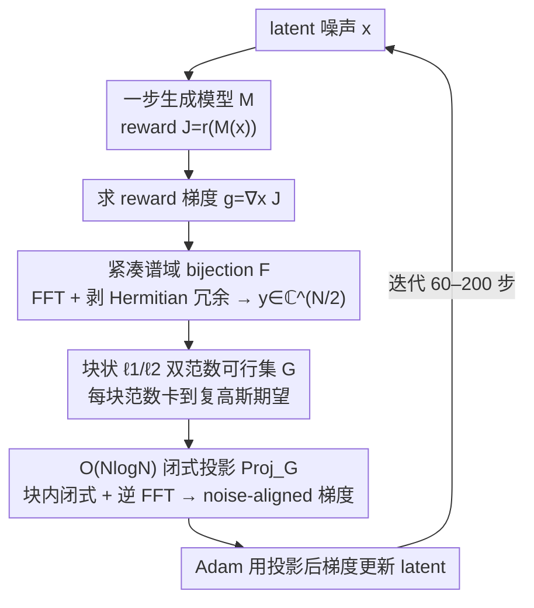

# Gradient Preconditioning for Efficient and Reliable Reward-Guided Generation

**会议**: ICML 2026  
**arXiv**: [2602.08646](https://arxiv.org/abs/2602.08646)  
**代码**: 待确认  
**领域**: 图像生成 / 扩散模型 / Test-time 优化  
**关键词**: reward-guided generation, 一步生成模型, 白高斯噪声约束, 梯度预条件, 谱域投影

## 一句话总结
通过把 reward 梯度投影到一个用 DFT 块状 $\ell_1/\ell_2$ 范数刻画的"白高斯噪声可行集"上，作者把一步生成模型的 test-time latent 优化变得既快又稳：在 FLUX 上只用 30% 的 wall-clock 时间就追平 SOTA 正则化方法 MPGR 的 Aesthetic Score，并彻底避免 reward hacking。

## 研究背景与动机

**领域现状**：随着 shortcut / consistency 等蒸馏技术让扩散与流模型可以"一步出图"，在推理阶段直接对 latent 噪声 $\bm{x} \in \mathbb{R}^N$ 做梯度上升以最大化某个 reward $r(\mathcal{M}(\bm{x}))$ 成为热门方向（ReNO、MPGR、ORIGEN 等）。它不需要重新训练，可以即插即换 reward，是当下 reward-guided generation 最轻量的路线。

**现有痛点**：这套 test-time latent 优化在实践里有两个死结。其一是 **reward hacking**——latent 沿梯度跑着跑着就偏离了白高斯先验，模型开始产生伪影甚至崩坏的图，但 reward 数值反而被刷得很高。其二是**慢**——即使底层是一步模型，单张图常常也要做上百次梯度更新、耗费数十秒到数分钟。

**核心矛盾**：现有方法（ReNO、PRNO、MPGR）走的都是**软正则**路线，在目标函数里加一项 $-\lambda \mathcal{L}_{\text{reg}}(\bm{x})$ 来鼓励 latent 保持高斯性质（$\ell_2$ 范数、谱域块状 $\ell_1$ 等）。但软正则有三重缺陷：(i) 不保证 latent 真的留在 noise-like 区域，只是"鼓励"；(ii) 需要手动调 $\lambda$，权重和学习率耦合在一起；(iii) 当优化器找到 shortcut（比如把某个频率分量拉爆）时，软惩罚根本拦不住。

**本文目标**：把"保持白高斯性质"从软约束升级为**硬约束**，同时不能牺牲速度（每步都要做投影，所以投影必须是闭式且至多 $\mathcal{O}(N \log N)$）。

**切入角度**：作者注意到 MPGR 的谱域块状 $\ell_1$ 惩罚已经能很好刻画白噪声谱平坦性，那么是否可以直接把它升级成"硬集合"并对梯度做投影？直接对原 DFT 系数 $\hat{\bm{x}} = \bm{F}\bm{x}$ 做投影行不通——实数信号的 DFT 满足 Hermitian 对称性，块之间彼此耦合、有的系数实、有的复，没有简单闭式解。但如果先**剥掉 Hermitian 冗余**，把独立自由度重组为一个紧凑的复向量 $\bm{y} \in \mathbb{C}^{N/2}$，问题就解耦成了 $P$ 个独立的"$\ell_1$ 球与 $\ell_2$ 球交集"上的投影，而后者有已知闭式解。

**核心 idea**：用一个 **bijection $\mathcal{F}: \mathbb{R}^N \to \mathbb{C}^{N/2}$** 把白高斯先验映射到紧凑谱域，在那里定义"每个 size-$B$ 块的 $\ell_1$ 与 $\ell_2$ 范数都等于其在 $\mathcal{CN}(0,1)$ 下的期望"作为可行集 $\mathcal{G}_{\mathbb{C}}$，每次把 reward 梯度投影回 $\mathcal{G}_{\mathbb{R}} = \mathcal{F}^{-1}(\mathcal{G}_{\mathbb{C}})$，得到 noise-aligned 的更新方向。

## 方法详解

### 整体框架
这套方法要解决的是 test-time latent 优化"既要快、又不能 reward hacking"的两难。作者的做法是保留原来的 reward ascent 循环——每步算 reward $J = r(\mathcal{M}(\bm{x}))$、求梯度 $\bm{g} = \nabla_{\bm{x}} J$、用 Adam 更新 latent——但在 Adam 之前插入一个投影算子，把梯度 $\bm{g}$ 投影到一个刻画"白高斯噪声"的可行集 $\mathcal{G}$ 上再去更新（Algorithm 1）。关键的视角转换是：软正则路线 $\max_{\bm{x}} r(\mathcal{M}(\bm{x})) - \lambda \mathcal{L}_{\text{reg}}(\bm{x})$ 把噪声性写进目标函数、还要调 $\lambda$，而本文把它写进**更新方向**——不要求 $\bm{x}$ 本身落在 $\mathcal{G}$ 里，只要求每步走的方向落在 $\mathcal{G}$ 里，这样既无超参，又把搜索锁在与白噪声兼容的子空间内。整个方法的全部技术含量都在投影算子 $\text{Proj}_{\mathcal{G}}$ 怎么设计得既精确又能 $\mathcal{O}(N\log N)$ 算出来，下面三个设计层层递进地解决它。

### 关键设计

**1. 紧凑谱域 bijection $\mathcal{F}$：把 Hermitian 冗余剥掉让投影解耦**

直接在 DFT 系数 $\hat{\bm{x}} = \bm{F}\bm{x}$ 上写硬约束行不通——实信号的 DFT 满足 Hermitian 对称性，不同频率块彼此耦合、有的系数实有的复，没有简单闭式投影。作者的破解办法是把冗余一次性剥干净：对偶数维 $N$，$\hat{\bm{x}}$ 里只有 $\hat{x}_0, \hat{x}_{N/2}$ 是实数且满足 $\hat{x}_k = \overline{\hat{x}_{N-k}}$，独立自由度其实只有 $N/2$ 个复数。于是定义 $y_0 = \tfrac{\hat{x}_0}{\sqrt 2} + \tfrac{\hat{x}_{N/2}}{\sqrt 2} i$、$y_k = \hat{x}_k\,(k = 1, \dots, N/2-1)$，得到紧凑谱向量 $\bm{y} = \mathcal{F}(\bm{x}) \in \mathbb{C}^{N/2}$。Proposition 4.1 证明 $\mathcal{F}$ 是 $\mathbb{R}^N \leftrightarrow \mathbb{C}^{N/2}$ 的双射，并且 $\bm{z} \sim \mathcal{CN}(\bm 0, \bm I_{N/2})$ 当且仅当 $\mathcal{F}^{-1}(\bm{z}) \sim \mathcal{N}(\bm 0, \bm I_N)$；Proposition 4.2 再给出等距关系 $\|\mathcal{F}^{-1}(\bm z)\|_2^2 = 2\|\bm z\|_2^2$。这两条把"空间域白高斯噪声约束"无损翻译成"紧凑谱域复高斯约束"，约束从此可以按块解耦，后续高效投影才成为可能。

**2. 块状 $\ell_1/\ell_2$ 双范数可行集 $\mathcal{G}$：把白噪声统计性精确卡死**

有了紧凑谱域，作者在上面定义可行集来刻画"latent 长得像白噪声"这件事。把 $\bm{y}$ 切成 $P = N/(2B)$ 个 size-$B$ 块（取 $B = 16$），对每块**同时**强制 $\ell_1$ 与 $\ell_2$ 范数等于复高斯 $\mathcal{CN}(0,1)$ 下的理论期望：$\|\bm{y}^{(p)}\|_1 = \tfrac{\sqrt\pi}{2}B$ 且 $\|\bm{y}^{(p)}\|_2^2 = B$，空间域可行集即 $\mathcal{G}_{\mathbb{R}} = \mathcal{F}^{-1}(\mathcal{G}_{\mathbb{C}})$。这两个范数各管一件事：$\ell_2$ 约束让整体能量精确对齐 $\chi_N$ 分布的众数 $\|\bm{x}\|_2^2 = N$（与 $\ell_2$ 范数正则 $\mathcal{L}_{\text{norm}}$ 的极小点几乎重合），$\ell_1$ 约束则压制任一单频率分量主导谱（理论上每块内 $|y_j|^2$ 最大约 $7.18$，远小于总预算），对应白噪声"无主导频率"的平坦谱。相比 MPGR 只软惩罚 $\ell_1$ 偏差，这里按块给出 $2P$ 个硬等式、还额外卡住 $\ell_2$ 能量，形成的可行集严格更小，把会导致伪影的 shortcut 解直接排除在集合之外。作者还用 1.1M 个真实高斯样本反向验证：$\bm{x} \sim \mathcal{N}(\bm 0, \bm I_N)$ 与其在 $\mathcal{G}_{\mathbb{R}}$ 上投影的余弦相似度最低也有 $0.988$，说明这个硬约束并没扭曲先验，而是顺着白噪声本来的样子做剪裁。

**3. $\mathcal{O}(N\log N)$ 闭式投影 $\text{Proj}_{\mathcal{G}}$：让硬约束在工程上几乎免费**

可行集再好，如果每步投影都很慢就失去意义。本文的投影之所以快，正是前两个设计铺垫的结果：先用 FFT 算 $\bm{y} = \mathcal{F}(\bm{x})$，由 Proposition 4.2 的等距关系 $\|\mathcal{F}^{-1}(\bm y) - \mathcal{F}^{-1}(\tilde{\bm y})\|_2^2 = 2\|\bm{y} - \tilde{\bm y}\|_2^2$，空间域的最近点问题在紧凑谱域里有相同最优解；又因为可行集按块独立，整个投影分解成 $P$ 个互不干扰的"$\ell_1$ 球与 $\ell_2$ 球交集"上的投影，每块用 Liu et al. (2020) 的算法以 $\mathcal{O}(B\log B)$ 闭式求解。具体到每块：把块内 $|y_j|$ 降序排成 $\bm{w}$、算前缀和 $S_{d,k} = \sum_{l=0}^k w_l^d\,(d = 1, 2)$，找唯一的 $k^*$ 满足 $w_{k^*+1} \le \lambda^{(k^*)} < w_{k^*}$，其中阈值 $\lambda^{(k^*)} = \tfrac{S_{1,k^*}}{k^*+1} - \tfrac{\sqrt\pi}{2}\tfrac{\sqrt B}{k^*+1}\sqrt{\tfrac{(k^*+1)S_{2,k^*} - S_{1,k^*}^2}{k^*+1 - \tfrac{\pi}{4}B}}$，再用 ReLU 软阈值表达式 $\dot y_j = \tfrac{\sqrt\pi}{2}B \cdot \tfrac{\text{ReLU}(|y_j| - \lambda^{(k^*)})}{S_{1,k^*} - (k^*+1)\lambda^{(k^*)}} \cdot \tfrac{y_j}{|y_j|}$ 直接给出投影值，最后逆 FFT 回空间域。整套流程 $\mathcal{O}(N\log N)$，在 FLUX 上实测仅占单次迭代 wall-clock 的 **0.04%**；作为对照，把 $\mathcal{L}_{\text{power}}$ 的极小集当可行集投影需要数百步内层梯度下降（MPGR 的做法），既慢又只是近似最优。

### 损失函数 / 训练策略
没有显式损失项，只有 reward $r$ 与投影约束。优化器是 Adam（学习率 FLUX 0.02 / SDXL-Turbo 0.1），梯度裁剪 0.03；FLUX 跑 200 步、SDXL-Turbo 跑 50 步，整套实验都在单张 A6000 上完成。每步既投影梯度，也投影 latent 本身（论文附录 H 给了拆开二者的消融）。

## 实验关键数据

### 主实验
评测设置沿用 MPGR：以 Aesthetic Score / PickScore / HPSv2 / ImageReward 中的一个作为"被优化 reward"，其余三个作为 held-out 用于检测是否 reward hacking；prompt 集来自 animal dataset 与 T2I-CompBench++；底层一步模型主要用 FLUX-schnell。

| 方法 | 迭代数 | Aesthetic Score (target) ↑ | PickScore (held-out) | Wall-clock (s) ↓ |
|------|-------|---------------------------:|---------------------:|-----------------:|
| No Opt. | 0 | 5.99 | 0.219 | — |
| ReNO | 200 | 7.06 | 0.219 | 232.0 |
| PRNO | 200 | 7.02 | 0.218 | 255.4 |
| MPGR (SOTA) | 200 | 7.13 | 0.220 | 235.5 |
| **Ours (60 iters)** | 60 | **7.12** | 0.220 | **69.7** |
| **Ours (200 iters)** | 200 | **8.91** | 0.220 | 232.2 |

两个数字最值得记住：(1) 60 步、69.7 秒就追平 MPGR 200 步、235.5 秒的成绩——**30% wall-clock 时间达到 SOTA**；(2) 同样 200 步，本文 reward 飙到 8.91 而 baseline 卡在 7.13 一线，差距高达 1.8 分（Aesthetic 通常 6–9 这个区间）。Figure 2 还显示在四个 reward × 三个 held-out 的所有组合里，本文都形成最右上的 Pareto 前沿。

### 消融实验（与现有正则方法相比的"reward hacking 抗性"）

| 配置 | 现象 | 说明 |
|------|------|------|
| No Reg.（无正则） | Aesthetic 飙高但图像崩坏 | 标准 reward hacking |
| $\mathcal{L}_{\text{norm}}$（$\ell_2$ 正则） | 余弦相似度 0.222 | 只约束总能量，空间相关性失控 |
| MPGR（谱域 $\ell_1$ 软正则） | 余弦相似度 0.548；需数百步内层投影 | 软惩罚 + 慢 |
| **Ours**（硬集合 + 闭式投影） | **保持高余弦相似度且无 hacking；单步投影** | Figure 1 中 latent 与初始噪声仍高度对齐，图像清晰真实 |

多样性消融（1,125 张图，Aesthetic 优化下）：本文 IS = 21.10 / Vendi = 6.97，与未优化基线（IS 21.57–22.33、Vendi 6.42–6.61）方差内一致，**没有 mode collapse**。

### 关键发现
- **投影开销可以忽略**：FFT + 块内闭式解整体 $\mathcal{O}(N\log N)$，实测仅占总 wall-clock 的 0.04%，几乎不增加单步耗时。
- **"每步走得准"比"步数多"更重要**：在 noise-aligned 子空间内更新让每步 reward 增益更大，因此 60 步就够、还不会 hack。
- **硬约束 > 软正则不止快，而且稳**：Figure 3 的定性结果显示 PRNO/MPGR 偶尔仍会生成不合 prompt 或带伪影的图，本文每张都合 prompt（包括"skyline pierced the clouds"这种细节）。
- **可行集很贴近真实白噪声**：1.1M 高斯样本的投影余弦相似度最低 0.988，说明这套硬约束并没有"勒死"先验，而是顺着它做剪裁。

## 亮点与洞察
- **优雅的"剥冗余"trick**：用 $\mathcal{F}$ 把 Hermitian 对称性这个"坏耦合"一次性消掉，把整个谱投影问题拆成 $P$ 个独立的小问题——这是论文最 elegant 的一步，没有这一步就没有闭式投影。值得在任何要在"实信号谱域"做约束/正则/采样的工作里复用。
- **从"软正则"到"梯度预条件"的视角转换**：传统正则把噪声性写进目标函数，本文把它写进**优化几何**。优化器仍然在做原问题的 reward ascent，但行进方向被强制限制在 noise-aligned 子空间——这是一种比加正则项更强、却又比硬约束 latent 更灵活的中间路线（latent 本身不必在 $\mathcal{G}$ 里）。这个思路可以原样迁移到 RLHF/Inference-time scaling 等任何对 latent 做梯度优化的场景。
- **0 超参 + 0.04% 开销**：相比所有 baseline 都要调的 $\lambda$，本文不引入任何新超参，且投影开销几乎免费——这种"减法式贡献"在工程上极具吸引力。
- **拿真实样本的余弦相似度反向验证可行集设计**：1.1M 个 $\mathcal{N}(\bm 0, \bm I)$ 样本与其投影的最小余弦相似度 0.988 这个实验非常巧妙，等于反过来证明"我设计的硬约束不会扭曲先验"，比单纯做消融更有说服力。

## 局限与展望
- 当前算法只验证了一步生成模型（FLUX-schnell、SDXL-Turbo、SANA-Sprint、SD-Turbo），多步扩散/流模型的中间状态如何套用这套硬约束（需要在哪一步、是否对所有 timestep 都投影）论文没回答。
- 可行集是用 $\mathcal{CN}(0,1)$ 的**理论期望**做等式约束，但真实采样下每块的范数本身有方差；当 latent 维度较小、块数 $P$ 较少时，"严格等于期望"可能比"允许小波动"更糟（论文用大 $N$ 缓解了这点，但小模型场景可能要重新讨论）。
- 论文从头到尾都假设 latent 先验是各向同性高斯，对非高斯先验（categorical token、VQ index、Mixture of Gaussians 等）没有直接推广路径。
- Block size $B = 16$ 沿用 MPGR 设置，论文附录 G 讨论了影响但没给出"如何在不同模型上自适应选 $B$"的实操指南。
- 实验只在图像生成上做了完整对比，视频、3D、motion 等高维 latent 场景（噪声维度可能更大、Hermitian 结构更复杂）值得进一步验证。

## 相关工作与启发
- **vs ReNO (Eyring et al., NeurIPS 2024)**：ReNO 是这条 test-time 路线的奠基作，用 $\ell_2$ norm 软正则保持高斯性。本文证明 $\ell_2$ 软正则既不约束空间相关、又会被 reward 优化器轻松绕过——硬约束 + 双范数才是正解。
- **vs PRNO (Tang et al., 2024)**：PRNO 直接在空间域惩罚块均值/协方差，要求 latent 看起来"像 i.i.d. 高斯"。本文换到谱域、并把惩罚换成硬约束，既覆盖空间相关、又能闭式投影。
- **vs MPGR (Hwang et al., NeurIPS 2025)**：MPGR 提出了谱域块状 $\ell_1$ 软惩罚 $\mathcal{L}_{\text{power}}$，是本文最直接的前作；本文沿用谱域 + 块状思想，但 (i) 加上 $\ell_2$ 约束、(ii) 用 $\mathcal{F}$ 解决 Hermitian 耦合、(iii) 用闭式投影替换内层梯度下降，最终把"60 步打平 200 步"做了出来。两篇是漂亮的迭代关系：MPGR 提出谱域刻画，本文把它升级成可计算的硬约束。
- **vs RL fine-tuning（DDPO/RLAIF/Flow-GRPO）**：那条路线要数十至数百 GPU 小时、每个 reward 重训一次。本文这种 test-time 方法零训练、即插即换 reward，两条路线正交可叠加。
- **启发**：把"想要的统计性质"写成硬约束 + 设计闭式投影，可能比无脑加正则项更鲁棒——这套范式在 RLHF、Constrained Decoding、Inference-time Alignment 等所有"边走边修"的场景都值得借鉴。

## 评分
- 新颖性: ⭐⭐⭐⭐ 把谱域软正则升级为硬可行集 + 利用 Hermitian 对称性设计 bijection 拿到闭式投影，是干净漂亮的技术贡献，但整体仍站在 MPGR 的肩膀上。
- 实验充分度: ⭐⭐⭐⭐ 四个 reward × 多个一步模型 × 完整 baseline 对比 + 多样性 + 余弦相似度反向验证 + 投影时间分解，链路非常完整；扣一星是只做了图像生成。
- 写作质量: ⭐⭐⭐⭐⭐ 数学严谨、动机推导清晰、Figure 1 的可视化把方法优势讲得极透，附录把所有 proposition 都补全了。
- 价值: ⭐⭐⭐⭐⭐ 0 超参、0.04% 开销、30% 时间打平 SOTA、彻底解决 reward hacking——对所有做 test-time reward optimization 的人都是即插即用的硬升级。

<!-- RELATED:START -->

## 相关论文

- [\[ICML 2026\] Pareto-Guided Optimal Transport for Multi-Reward Alignment](pareto-guided_optimal_transport_for_multi-reward_alignment.md)
- [\[CVPR 2026\] EgoFlow: Gradient-Guided Flow Matching for Egocentric 6DoF Object Motion Generation](../../CVPR2026/image_generation/egoflow_gradient-guided_flow_matching_for_egocentric_6dof_object_motion_generati.md)
- [\[ICML 2026\] Divide and Conquer: Reliable Multi-View Evidential Learning for Deepfake Detection](divide_and_conquer_reliable_multi-view_evidential_learning_for_deepfake_detectio.md)
- [\[ICML 2026\] DGS-Net: Distillation-Guided Gradient Surgery for CLIP Fine-Tuning in AI-Generated Image Detection](dgs-net_distillation-guided_gradient_surgery_for_clip_fine-tuning_in_ai-generate.md)
- [\[ICML 2026\] Recovering Hidden Reward in Diffusion-Based Policies](recovering_hidden_reward_in_diffusion-based_policies.md)

<!-- RELATED:END -->
