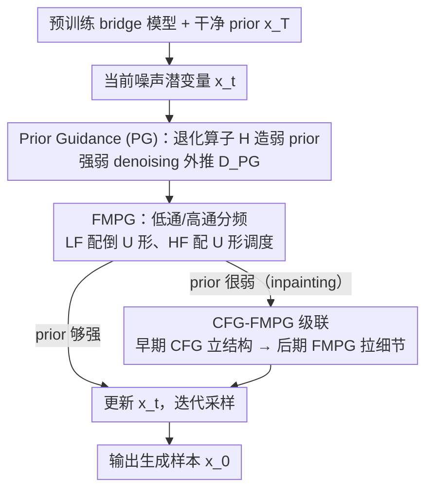

# GuidedBridge: Training-freely Improving Bridge Models with Prior Guidance

**会议**: ICML 2026  
**arXiv**: [2606.03119](https://arxiv.org/abs/2606.03119)  
**代码**: 待确认  
**领域**: 图像生成 / Diffusion Bridge / Guidance  
**关键词**: bridge model, prior guidance, frequency modulation, image translation, training-free

## 一句话总结
针对 diffusion bridge 模型（data-to-data 生成），论文提出训练免费的 Prior Guidance (PG)：通过对干净 prior 加扰动构造"弱 prior"，再把强/弱 prior 的两个 denoising 结果做外推来放大模型对 prior 的利用，并进一步用 U 型频率调制（FMPG）和 CFG-FMPG 级联框架，在 Edges→Handbags、DIODE、ImageNet inpainting 等任务上不增训练、不增 NFE 地稳定提升 DDBM / DBIM 等预训练 bridge 模型的 FID。

## 研究背景与动机

**领域现状**：Diffusion 的 guidance 已经有非常成熟的两大范式——CFG 用"条件 vs 无条件"两个 denoising 结果做外推强化条件对齐，AG 用"训得好 vs 训得欠"两个 denoising 结果做外推强化 score 准确度。二者本质都是"制造两个 denoising 之间的质量差，然后沿质量更高的方向外推"。同时，bridge 模型（DDBM、DBIM、I2SB 等）通过条件化在干净 prior $\bm{x}_T$ 上把生成过程变成 data-to-data，对 image-to-image 翻译、修复这类已经有强先验的任务比从纯高斯噪声出发的 diffusion 更高效。

**现有痛点**：CFG/AG 可以直接搬到 bridge 上用，但它们都没有用到 bridge 与 diffusion 真正的关键差异——**prior exploitation**（利用 $\bm{x}_T$ 提供的干净先验）。换句话说，搬过来的 guidance 只是在"强化条件"或"修分数误差"，没有专门强化"模型有没有真的把先验用透"。同时，AG 要专门多训一个 under-trained 网络，成本不低。

**核心矛盾**：bridge 区别于 diffusion 的最大优势没有对应的 guidance 设计；而且 bridge 的 SNR 沿采样轨迹是 U 形（两端干净、中间最噪），与 diffusion 单调上升的 SNR 完全不同，导致直接用恒定 guidance scale 对所有时间步、所有频率段一视同仁会浪费 bridge 自身的几何结构。

**本文目标**：(1) 设计第一个面向 bridge 的训练免费 guidance，让 guidance 信号直接对应到"prior exploitation"；(2) 让 guidance 强度匹配 bridge 的 U 形 SNR 与频域行为；(3) 在 prior 本身就很弱（如 inpainting 的 mask 区域）时让方法仍然可用。

**切入角度**：既然 CFG/AG 都是"造一个质量更差的 denoising 然后外推"，那么对 bridge 而言最自然的"造差"方式就是**破坏掉模型可以用的 prior**——bridge 没见过被扰动后的 prior，所以会给出更差的结果。这种"差"恰好对应到"prior 没用好"，外推方向天然就是"prior 用得更好"。

**核心 idea**：训练免费地对 $\bm{x}_T$ 和每一步的 $\bm{x}_t$ 加一个退化算子 $\mathcal{H}$（如加高斯噪声 / 模糊 / JPEG 压缩），用 $D_{\bm{\theta}}(\bm{x}_t,t,\bm{x}_T)$ 与 $D_{\bm{\theta}}(\mathcal{H}(\bm{x}_t),t,\bm{x}_T)$ 之差做 guidance 外推，并按 U 形 SNR 在高频/低频带上分别调度 guidance scale。

## 方法详解

### 整体框架
输入是一个**预训练好的 bridge 模型**（DDBM / DBIM）以及一个干净 prior $\bm{x}_T$（例如待翻译图、待修复图）。生成时不再调用单一的 $D_{\bm{\theta}}(\bm{x}_t,t,\bm{x}_T)$ 来预测 $\bm{x}_0$，而是在每个采样步上：

1. 用退化算子 $\mathcal{H}$ 把当前噪声潜变量 $\bm{x}_t$ 破坏成"弱 prior" $\mathcal{H}(\bm{x}_t)$（$\bm{x}_T$ 始终保留为干净条件信号，不被退化）；
2. 同时调用 $D_{\bm{\theta}}(\bm{x}_t,t,\bm{x}_T)$ 与 $D_{\bm{\theta}}(\mathcal{H}(\bm{x}_t),t,\bm{x}_T)$ 拿到强弱两个 denoising 结果；
3. 用外推 $D_{\text{PG}} = D_{\text{weak}} + w_{\text{PG}}(D_{\text{strong}} - D_{\text{weak}})$ 替换原本的 denoising 输出；
4. FMPG 进一步把这个外推拆到低频/高频两个频带上分别配 $w^{\text{LF}}_{\text{PG}}$ 与 $w^{\text{HF}}_{\text{PG}}$；
5. 对 inpainting 等弱 prior 任务，先用 CFG 跑一段 $t\in[T,t_s)$ 产生粗结构，然后切到 FMPG 跑 $t\in[t_s,0)$ 精修细节（CFG-FMPG 级联）。

整个流程**不改训练、不加参数**，只是替换采样时的 denoising 调用，且 NFE 与原 baseline 严格对齐（用更少采样步数补偿掉每步多一次前向的开销）。

### 关键设计

**1. Prior Guidance (PG)：用退化后的 prior 制造一个质量更差的 denoising**

PG 解决的是"bridge 没有对应自己核心优势的 guidance"这个空白。它沿用 CFG/AG 的"造差→外推"思路，但把"差"的来源换成 prior 被破坏后的结果。具体做法是选一个训练免费的退化算子 $\mathcal{H}$（默认加一份额外高斯噪声 $\bm{\epsilon}\sim\mathcal{N}(\bm{0},\bm{I})$，模糊、JPEG 压缩也都可用），对每个中间潜变量 $\bm{x}_t$ 施加得到弱版本 $\mathcal{H}(\bm{x}_t)$，而条件信号 $\bm{x}_T$ 始终保持干净。因为 bridge 在预训练时**从未见过**被退化的 prior，$D_{\bm{\theta}}(\mathcal{H}(\bm{x}_t),t,\bm{x}_T)$ 必然比 $D_{\bm{\theta}}(\bm{x}_t,t,\bm{x}_T)$ 更差，于是两者的外推

$$D_{\text{PG}} = D_{\bm{\theta}}(\mathcal{H}(\bm{x}_t),t,\bm{x}_T) + w_{\text{PG}}\,\big(D_{\bm{\theta}}(\bm{x}_t,t,\bm{x}_T) - D_{\bm{\theta}}(\mathcal{H}(\bm{x}_t),t,\bm{x}_T)\big)$$

天然指向"把 prior 用得更透"的方向。把 $\bm{x}_T$ 留在弱项里保持干净，是为了让强弱两个结果的差异**只来自 prior 退化**而非条件改变。相比 AG 必须额外训一个 under-trained 网络作差源，PG 完全免训练；相比 CFG 只强化"条件对齐"，PG 直接对应到 bridge 区别于 diffusion 的本质优势——prior exploitation。退化算子无论换成噪声、模糊还是 JPEG 都能 work，说明这个范式对"怎么造差"相当鲁棒。

**2. Frequency-modulated PG (FMPG)：按 U 形 SNR 在频带上分别调度 guidance**

恒定一个 $w_{\text{PG}}$ 对所有时间步、所有频率一视同仁，浪费了 bridge 自身的几何结构，FMPG 就是来解决这点。作者追踪 $\Delta\bm{x}_t \to \Delta\bm{x}_0$ 的频域能量传递后发现：bridge 的 SNR 沿轨迹是 U 形（两端干净、中间最噪），因此在中间时间步上**高频（HF）prior 已被噪声严重淹没**，这里硬加 guidance 只会放大噪声；而**低频（LF）prior 在整条轨迹上都还可读**，中间时间步反而是强化 LF 的好时机。基于这个诊断，FMPG 把 PG 外推拆成两路：用低通滤波器 $I^{\text{LF}}$ 取出低频分量，配**倒 U 形**的 $w^{\text{LF}}_{\text{PG}}$（中间时间步放大）；用 $I^{\text{HF}}$ 取出高频分量，配 **U 形**的 $w^{\text{HF}}_{\text{PG}}$（中间时间步压缩、两端放大），低频路写作

$$D^{\text{LF}}_{\text{FMPG}} = I^{\text{LF}}[D_{\text{weak}}] + w^{\text{LF}}_{\text{PG}}\,\big(I^{\text{LF}}[D_{\text{strong}}] - I^{\text{LF}}[D_{\text{weak}}]\big),$$

高频路 $D^{\text{HF}}_{\text{FMPG}}$ 同理。这等于把 bridge 的 U 形 SNR 这个 data-to-data 几何特征直接编码进了 guidance schedule，让 guidance 强度与生成动力学对齐——而 diffusion 单调上升的 SNR 上根本没有对应概念。作者特意强调 U 形/倒 U 形只是**经验上的粗调度**，不需要精确对齐预训练 bridge 的 SNR 表，形状对就够了，所以 FMPG 仍是 training-free 的轻量插件。

**3. CFG-FMPG 级联：救场 prior 本身就很弱的任务**

当 prior 难用到 PG 造不出差异时——典型是 inpainting 把中心 128×128 区域整块 mask 掉，那里压根没有像素可供退化——就需要先借别的 guidance 把粗结构立起来。CFG-FMPG 把采样轨迹切成两段：早期 $t\in[T,t_s)$ 用 CFG 在类别标签 $\bm{l}$ 上做条件对齐，给 mask 区域填进语义粗结构，得到一个已含目标大致轮廓的中间潜变量；之后 $t\in[t_s,0)$ 切到 FMPG，把这份 CFG 产物当作"已经够强的 prior"去 exploit、把高频纹理拉回来。两段共享同一个 bridge 网络和同一条采样轨迹，只是分时段切换 guidance 公式，因此**不增 NFE**。这样安排是因为单用 PG 在 inpainting 上无差可造、单用 CFG 又只能强化语义拉不出高频细节，而 CFG 管"语义对齐"、FMPG 管"prior 利用"恰好互补，时序级联是把两者拼起来最省成本的方式。

### 损失函数 / 训练策略
完全 training-free。所有 bridge 检查点都直接用官方原版（DDBM 用推荐的 hybrid SDE-ODE 采样器，DBIM 用 $\eta=0.0$ 的纯 ODE 模式）。实践调参用两步：先在 {加噪、模糊、JPEG、pooling} 里搜一个退化算子 $\mathcal{H}$，再调 $w_{\text{PG}}$（包括 FMPG 的频带分量），整体调参成本与 CFG/AG 同量级。

## 实验关键数据

### 主实验

NFE 严格与 baseline 对齐（用更少采样步数抵消每步多跑一次前向）。

| 数据集 | 指标 | DBIM (基线) | DBIM+FMPG (本文) | NFE |
|--------|------|-------------|------------------|-----|
| Edges→Handbags 64×64 | FID ↓ | 1.74 | **1.07** | 20 |
| Edges→Handbags 64×64 | FID ↓ | 0.91 | **0.78** | 100 |
| DIODE-Outdoor 256×256 | FID ↓ | 4.99 | **3.20** | 20 |
| DIODE-Outdoor 256×256 | FID ↓ | 2.58 | **2.06** | 100 |
| DIODE | LPIPS ↓ | 0.201 | **0.199** | 20 |
| Edges→Handbags | MSE ↓ | 0.005 | 0.005 | 20 |

DDBM 上同样有效：DDBM+PG 在 Edges→Handbags 上把 NFE=150 / 300 的 FID 从 1.30 / 0.65 降到 1.23 / 0.59。

### 消融实验

DIODE 上对比 PG 不同变体与 FMPG（baseline 为 DBIM）：

| 配置 | NFE=10 FID | NFE=20 FID | NFE=40 FID | 说明 |
|------|-----------|-----------|-----------|------|
| DBIM (无 guidance) | 7.99 | 4.99 | 3.35 | 原 baseline |
| ECSI (并行工作) | 6.83 | 4.12 | - | 仅快速采样器 |
| DBIM+PG (Blur) | 7.33 | 3.89 | 2.64 | 退化用模糊 |
| DBIM+PG (Noise) | 6.25 | 3.77 | 2.96 | 退化用加噪 |
| **DBIM+FMPG (Noise)** | **5.28** | **3.20** | **2.62** | 频率调制后最佳 |

Edges→Handbags（10000 张）上 FMPG(noise) 在 NFE=6 时把 baseline 4.86 降到 4.54，NFE=100 时从 3.16 降到 **3.08**。

### 关键发现
- **FMPG > PG > baseline**：把恒定 $w_{\text{PG}}$ 拆成 U 形 + 倒 U 形的频带调度，在所有 NFE 上都进一步降 FID，证明 bridge 的 U 形 SNR 与频域行为确实需要专门的 guidance schedule；同时 PG (Noise) 与 PG (Blur) 哪个更强随数据集变化，说明"造差"的具体退化算子需要轻搜索而非通用最优。
- **NFE 越小提升越大**：例如 DIODE 上 NFE=10 时 FID 从 7.99→5.28（-34%），NFE=100 时仅从 2.58→2.06（-20%），说明 FMPG 对快采样场景特别有价值——它"挤"出了 bridge 模型在少步采样下没充分用上的 prior 信息。
- **CFG-FMPG 是 inpainting 的钥匙**：ImageNet 中心 128×128 mask 修复中，单用 PG 几乎没差异可造；但 CFG-FMPG 级联在质量上既超过纯 CFG 也超过 CFG 之外的简单 hybrid，定性结果可同时恢复语义布局与高频纹理。

## 亮点与洞察
- **"造差"范式的第三种填法**：CFG 造"条件 vs 无条件"差、AG 造"训练充分 vs 不充分"差、PG 造"prior 干净 vs 退化"差。三者正交，意味着未来可以在同一采样器上叠加多种 guidance；论文里 CFG-FMPG 已经是个微缩示范。
- **训练免费但物理可解释**：U 形高频调度不是凭空堆 trick，而是来自 $\Delta\bm{x}_t \to \Delta\bm{x}_0$ 频域能量传递的直接可视化——中间时间步高频确实传不过去，所以 guidance 该退场。这种"先做诊断、再做调度"的设计套路完全可以复用到 audio bridge、video bridge 等其他 data-to-data 任务。
- **NFE 严格对齐的诚实比较**：用更少采样步 + 每步多一次前向去匹配 baseline 的总 NFE，避免了"用 2× 算力换性能"的虚假提升，让 PG/FMPG 真正落在"免费午餐"上。

## 局限与展望
- **退化算子需要逐任务搜索**：噪声 vs 模糊 vs JPEG 哪个最好依赖数据集，没有统一规则；论文给的是"两步调参"的工程做法，理论上为什么某种退化在某任务更优还未深入。
- **频带调度形状是手工先验**：U 形 / 倒 U 形虽然来自 SNR 观察，但具体峰值位置、幅度仍要调；自适应、按时间步实时估计 LF/HF 可用度的 schedule 可能更优。
- **只验了图像翻译/修复**：bridge 在音频超分、信号恢复、image-to-video 上同样常用，FMPG 能否迁移、U 形是否仍成立没有给出实验。
- **CFG-FMPG 切换时刻 $t_s$ 仍需调参**：在弱 prior 任务里切换早晚直接影响粗结构与细节的权衡，未来可以做成自动决策。

## 相关工作与启发
- **vs CFG (Ho & Salimans, 2021)**：CFG 强化"条件对齐"，差异来源是是否给条件；PG 强化"prior 利用"，差异来源是 prior 是否被破坏。两者在 bridge 上正交，CFG-FMPG 级联直接证明了互补性。
- **vs AG (Karras et al., 2024)**：AG 必须额外训练一个 under-trained 网络作为"差"的来源；PG 用训练免费的退化算子在前向时即时构造，部署成本更低，且本质对应到 bridge 的 prior exploitation 而非通用 score 准确度。
- **vs DDBM / DBIM (Zhou et al., 2024; Zheng et al., 2025)**：DDBM/DBIM 提供 bridge 训练与快采样器，本文不动它们的参数，只在采样阶段插入 guidance，是对这些 backbone 的**通用增强插件**；论文显示无论慢采样（DDBM 200 步）还是快采样（DBIM 10–20 步）都稳定提升。
- **vs ECSI (Zhang et al., 2025b)**：ECSI 走的是更聪明的采样器路线，PG/FMPG 走的是 guidance 路线，二者解耦——理论上可以叠加使用进一步压 NFE 下的 FID。

## 评分
- 新颖性: ⭐⭐⭐⭐ 把 CFG/AG 的"造差→外推"范式干净地迁移到 bridge，并第一次把 U 形 SNR 与频域行为编码进 guidance schedule。
- 实验充分度: ⭐⭐⭐⭐ 覆盖 DDBM/DBIM 两个 backbone、Edges→Handbags / DIODE / ImageNet 三个任务、NFE 从 6 到 300 的完整曲线，并对比 DDIB/SDEdit/Pix2Pix/I2SB/ECSI 多个基线，但缺音频/视频 bridge 的迁移验证。
- 写作质量: ⭐⭐⭐⭐ 从"造差"统一视角讲清楚 CFG/AG/PG/FMPG 的关系，频域分析图与 U 形 SNR 配合到位，公式与算法表述清晰。
- 价值: ⭐⭐⭐⭐ 真正训练免费、不加 NFE 的 bridge 通用插件，对所有用 DDBM/DBIM 跑 image translation/restoration 的工作直接可用，落地价值高。

<!-- RELATED:START -->

## 相关论文

- [\[CVPR 2026\] Understanding, Accelerating, and Improving MeanFlow Training](../../CVPR2026/image_generation/understanding_accelerating_and_improving_meanflow_training.md)
- [\[CVPR 2026\] Improving Diffusion Generalization with Weak-to-Strong Segmented Guidance](../../CVPR2026/image_generation/improving_diffusion_generalization_with_weak-to-strong_segmented_guidance.md)
- [\[ICLR 2026\] Stochastic Self-Guidance for Training-Free Enhancement of Diffusion Models](../../ICLR2026/image_generation/stochastic_self-guidance_for_training-free_enhancement_of_diffusion_models.md)
- [\[ICML 2026\] Spectral Guidance for Flexible and Efficient Control of Diffusion Models](spectral_guidance_for_flexible_and_efficient_control_of_diffusion_models.md)
- [\[CVPR 2026\] Improving Controllable Generation: Faster Training and Better Performance via x0-Supervision](../../CVPR2026/image_generation/improving_controllable_generation_faster_training_and_better_performance_via_x0-.md)

<!-- RELATED:END -->
